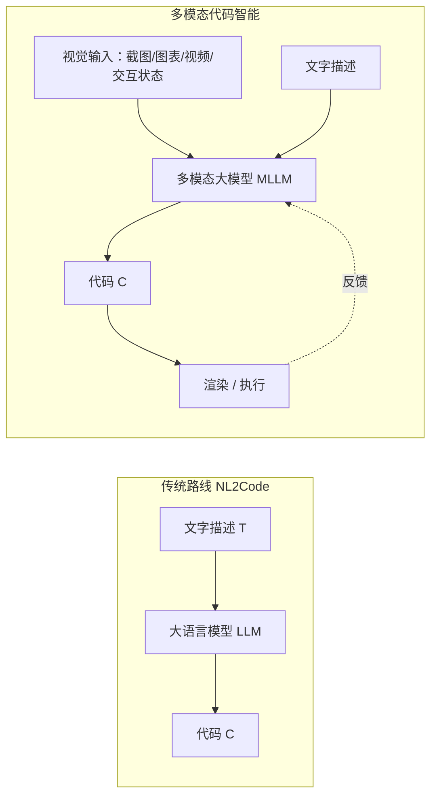
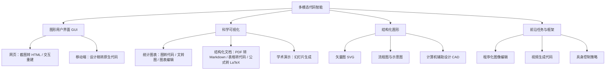
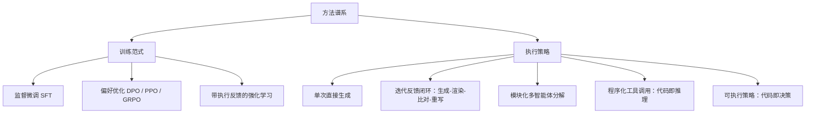
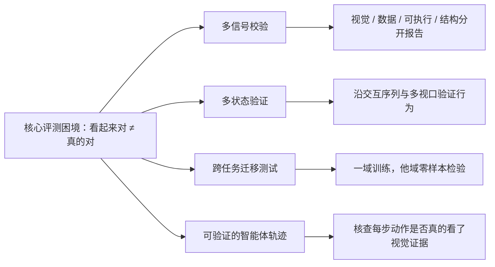

# 超越自然语言转代码：多模态代码智能的结构化综述

> **原题**：Beyond NL2Code: A Structured Survey of Multimodal Code Intelligence
> **作者**：Xuanle Zhao, Qiushi Sun, Jingyu Xiao, Xuexin Liu, Haoyue Yang 等（共 19 位作者）
> **机构**：论文公开页未明确列出
> **年份**：2026（arxiv ID 2606.15932，v1 6 月 14 日，v2 6 月 16 日）
> **分类**：cs.CL
> **链接**：https://arxiv.org/abs/2606.15932
> **精读日期**：2026-06-25

## 阅读须知

**这篇在领域里的位置。** 过去几年，大语言模型把「自然语言转代码」这件事推到了相当成熟的程度。给一句话的需求，模型就能写出一段可运行的函数，这条路线在学术界和工业界都被研究得很透。但现实里的编程任务，意图往往不是用一句话讲清楚的，而是摆在一张截图、一幅图表、一段录屏、或者一个正在交互的界面里。前端工程师拿到的是设计稿而不是文字描述，数据分析师手里是一张别人画好的图而想复现它的代码，做文档处理的人面对的是一页带表格和公式的 PDF。这一类「视觉里藏着意图」的任务，已经各自长出了一片研究，却散落在不同的会议、不同的名字、不同的评测标准底下，彼此之间很少对话。这篇综述要做的，就是把这一整片散落的工作收拢起来，给它起一个统一的名字叫「多模态代码智能」，再为它画一张结构化的地图。

**读完能回答什么。** 读完这份笔记，应该能回答下面这几个问题：第一，多模态代码智能到底比传统的自然语言转代码多了什么，它的输入输出各是什么模态；第二，这片领域被作者切成了哪四个大领域，每个领域里具体在做什么任务；第三，为什么「生成的网页和参考图长得一模一样」并不等于「这个网页是对的」，这背后的评测难题出在哪里；第四，现有方法在训练范式和执行策略上分成了哪几类；第五，作者认为这片领域下一步该往哪走，所谓「多信号校验、多状态验证、跨任务迁移、可验证轨迹」这四条具体指什么。

**阅读前置。** 这份笔记假定读者熟悉大语言模型的基本用法，知道什么叫监督微调和强化学习的大致流程，也写过一点前端或者数据可视化的代码。但不预设读者专门做过多模态模型，也不预设熟悉前端、CAD、文档解析这些具体子领域的术语。凡是子领域内部的专有名词，第一次出现时都会先铺垫再展开。

**首次出现的缩写表。**

- **NL2Code**（Natural Language to Code，自然语言转代码）：给定一段文字需求，让模型直接生成代码。这是本文要「超越」的那条传统路线。
- **LLM**（Large Language Model，大语言模型）：只吃文本的语言模型。
- **MLLM**（Multimodal Large Language Model，多模态大语言模型）：既能看图又能读文的模型，是这片领域的主力工具。
- **GUI**（Graphical User Interface，图形用户界面）：网页、手机应用这一类有可视界面的程序。
- **SVG**（Scalable Vector Graphics，可缩放矢量图形）：用代码描述的矢量图，放大不失真。
- **CAD**（Computer-Aided Design，计算机辅助设计）：用代码或参数描述三维物体的设计方式。
- **DOM**（Document Object Model，文档对象模型）：网页结构的树状表示。
- **OCR**（Optical Character Recognition，光学字符识别）：把图片里的文字认出来。
- **SFT**（Supervised Fine-Tuning，监督微调）：用「输入-标准答案」成对的数据去微调模型。
- **DPO / PPO / GRPO**：三种偏好优化或强化学习的训练算法，用来在 SFT 之后进一步对齐模型的输出。
- **RAG**（Retrieval-Augmented Generation，检索增强生成）：生成前先去一个素材库里检索相关样例，拿回来辅助生成。
- **BLEU / SSIM / CLIP**：三种常见的相似度度量，分别偏向文本重合、图像结构相似、图文语义匹配。

多模态代码智能这件事不解决会怎样，过去几年走到了哪一步，为什么现在需要一篇综述来收口，这些放到下面第一节展开。

## 一、问题

先把这片领域要解决的痛点说清楚。传统的自然语言转代码，本质上是一个从文字到程序的映射，可以写成「代码等于大语言模型读了一段文字之后的输出」。这条路线的隐含假设是，需求能够被文字充分描述。可是一旦任务涉及到界面布局、几何结构、图表的精确样式，光靠文字去描述就既啰嗦又容易丢信息。要把一个复杂的用户界面用文字讲明白，得写上几百字，还未必讲得全；而同样的意图，一张截图一眼就传达完了。于是真正的瓶颈不在于模型会不会写代码，而在于意图本身是视觉化的，文字这个入口根本装不下。

作者据此给出多模态代码智能的定义：它指的是这样一类任务，其中视觉上下文、渲染出来的反馈、或者用视觉方式给出的意图，是任务的核心。换句话说，模型的输入不再只是文字，而是「一张图加一段文字描述」，输出仍然是代码。这个改动看起来小，影响却是结构性的：视觉信号里编码着空间关系、语义层次和交互信息，这些是文字难以高效承载的。在前端开发和 CAD 这种领域里，这一点尤其突出，靠纯文字去描述精细的界面排布或者精确的几何形状，效率低且容易在转述中丢失信息。

把这条主线再往下落，就能看清楚为什么需要一篇综述。这片领域的麻烦不在于没人做，而在于做的人太多、太分散。研究截图转 HTML 的人和研究图表转代码的人，研究 PDF 转 Markdown 的人和研究草图转 SVG 的人，几乎是在各说各话：任务名字不一样，用的数据集不一样，评测指标也不一样，彼此的经验很难互相借鉴。一个在网页生成上摸索出来的「先渲染再比对」的思路，做图表生成的人可能完全不知道。综述的价值就在这里，它先把这些孤岛按统一的坐标系摆好，让读者看到原来这些任务共享同一套底层结构和同一批评测难题，进而能把一个子领域的进展迁移到另一个子领域。

下面这张图把传统路线和多模态路线的差别摆在一起，关键的新增项是那条从「渲染或执行」回到模型的反馈线：多模态任务的答案能不能算对，往往要把生成的代码真的跑一遍、画出来看一眼才知道，这是纯文本代码生成里没有的环节。

## 二、方法

综述本身没有提出新模型，它的「方法」是一套分类框架。这套框架分两层看：一层是按任务领域切，把整片版图切成四块；另一层是按技术手段切，把现有模型的训练范式和执行策略各归各类。先看任务领域这一层。

第一个领域是图形用户界面，也就是 GUI。它又分网页和移动端两支。网页这一支里，最典型的任务是截图转 HTML，即给一张网页截图，让模型还原出能渲染成同样样子的网页代码；更难的是交互式网页生成，不光要长得像，还要按钮能点、表单能填、路由能跳。作者特意把网页任务再细分成三层：静态渲染只看长得像不像，可执行交互看事件处理和状态切换对不对，动态功能看表单处理和接口调用通不通。移动端这一支，则是从设计稿生成原生代码，比如基于 Figma 设计工具的界面还原，对应 CANVAS、APPUI 这些数据集。

第二个领域是科学可视化，这一块和数据工作者关系最近。它包含三类。统计图表类里有三个互逆又互补的任务：文字转图表是把一句话的绘图需求变成可执行的画图代码，图表转代码反过来，给一张画好的图，让模型逆向推出它背后的数据和绘图代码，图表编辑则是按指令去改一张已有的图。结构化文档类处理的是带版式的文档，典型任务有 PDF 页面转 Markdown（要保住版面和阅读顺序）、表格图像转代码（还原出 HTML 或 LaTeX 的网格结构）、公式图像转 LaTeX（把一个数学表达式变成能编译的 LaTeX 序列）。第三类是学术演示，比如从文字大纲生成幻灯片。

第三个领域是结构化图形，特点是输出本身就是一种用代码描述的图形。它涵盖矢量图 SVG 的生成（从设计草图生成分层的矢量代码）、流程图与示意图的生成（把一张示意图变成 Mermaid 这类结构化代码）、以及 CAD（从三维物体的描述生成参数化的设计代码，比如 OpenSCAD）。第四个领域作者叫前沿任务与框架，是一批边界还在扩张的方向，包括程序化的图像编辑（用可执行的程序去做像素级或语义级的图像操作）、视频生成代码（把一段动作序列变成生成动画的代码）、以及具身控制（把机器人的视觉观测变成可执行的控制策略代码）。这四个领域和它们的子类，汇成下面这张分类树。

再看技术手段这一层。综述把现有方法的训练范式归为三类。第一类是在合成或真实数据上做监督微调，靠大规模的「截图-代码」成对数据喂出来，代表是 WebSight、Web2Code 这些工作。第二类是偏好优化，在监督微调之外再用 DPO、PPO、GRPO 这类算法，根据「哪个输出更好」的偏好信号去进一步打磨，常见于图表生成的细化。第三类是带执行反馈的强化学习，它的奖励不是人标的，而是把代码真的渲染或执行一遍，根据结构对不对、画出来像不像来给分，比如表格转 LaTeX 工作里那种「结构奖励加视觉奖励」的双重设计。

训练范式之外，执行策略也分出了几档，区别在于模型有没有「再看一眼自己产物」的机会。最朴素的是单次直接生成，输入图和文字，一遍过输出代码，问题是错了没法补救。进一步是迭代反馈闭环，生成之后把代码渲染出来，和目标比对，让一个批评者模型挑毛病，再回去重写，WebGen-Agent、ReLook 这类工作走的就是这条路。再复杂一点是模块化多智能体分解，把定位、规划、生成拆成不同的单元各管一段，ScreenCoder 是代表。还有两种更特殊：程序化工具调用把代码当成推理的中间步骤，让模型先写一段调用检测或 OCR 的代码、执行完再把结果喂回去；可执行策略则把代码当成决策序列，用于具身智能体的控制闭环。这套方法谱系，连同上面的训练范式，汇成下面这张图。

## 三、实验

综述不跑自己的实验，它的「实验」是把这片领域六十多个数据集和它们的发现梳理出来。这里挑几条最有说服力的来看。

在网页这一块，静态和动态评测讲的是两个不同的故事。静态评测里，数据集规模差异很大，从合成的 WebSight（八十二万三千对截图与 HTML）到真实世界的 Design2Code（仅四百八十四个真实网站），度量手段也从文本重合的 BLEU、图像结构相似的 SSIM，一路到分块匹配。但真正点破问题的是动态评测。其中 IWR-Bench 给出了一个反差极大的数字：模型能达到百分之六十四点二五的视觉保真度，意味着生成的页面看起来和参考图很像；可一旦去测交互能不能用，成功率只有百分之二十四点三九。这两个数字摆在一起，等于在说一件冷峻的事：模型很擅长把界面「画」对，却远没学会让它「动」对。

| 评测基准 | 任务 | 规模 | 关键信号 / 发现 |
|---|---|---|---|
| WebSight | 截图转 HTML（静态） | 82.3 万对 | 合成数据，BLEU / SSIM |
| Design2Code | 截图转 HTML（静态） | 484 个真实网站 | 视觉相似度、分块匹配 |
| IWR-Bench | 交互式重建（动态） | 小规模真实集 | 视觉保真 64.25%，交互成功仅 24.39% |
| Plot2Code | 图表转代码 | 132 张真实图 | 参考渲染与代码精确度 |
| ChartMimic | 图表转代码与编辑 | 4800 例 | 数据、版式、配色保持度 |
| OmniDocBench | PDF 转 Markdown | 1300 份 PDF | 块级与跨度级多层评测 |
| PubTabNet | 表格转 HTML | 9000 例 | 树编辑距离度量结构 |
| UniMER-Test | 公式转 LaTeX | 23000 例 | 印刷体与手写体混合 |

科学可视化这一块的发现，落点和网页惊人地一致：好看不等于正确。一张图表可以画得很顺眼，可坐标轴标错了、数据聚合错了、编码方式不对，它依然是错的。文档处理同理，一份转出来的 Markdown 哪怕文字重合度很高，只要阅读顺序乱了、表格的网格塌了、公式的嵌套层级错了，结果就不可用，而 BLEU 这种纯文本相似度根本测不出这些毛病。这批数据集之所以越做越精细，比如表格评测用树编辑距离去比对网格结构，正是因为粗糙的相似度指标会把「形似而神不似」的错误放过去。

把这些发现合在一起，综述得到一个贯穿全篇的结论：在多模态代码任务里，视觉相似度有用，但远不充分。一个产物能不能算对，必须同时拿到关于语义和交互的证据，而不能只看它渲染出来像不像。这个结论不是某一个子领域的特例，而是从网页、图表、文档一路重复出现的共同规律。

## 四、局限

先说这篇综述作为综述自身的边界。它的覆盖偏重于有成熟评测的领域，网页和图表着墨最多，证据也最扎实；而结构化图形里的 SVG、CAD，以及前沿任务里的视频和具身控制，作者自己也承认缺乏详尽的性能数据，更多是点到为止的罗列。这意味着这张地图的清晰度并不均匀，越靠近前沿的角落越模糊，读者不应把这片领域的成熟度想象得太一致。另外，作为一篇结论指向「现有评测都不够」的综述，它给出的更多是研究议程而非现成答案，真正能落地的统一评测标准还没有，需要后续工作去填。

再说这片领域读完能看出来的、更深的局限，作者把它们组织成了四条未来方向，可以反过来当作四个尚未解决的难题来读。第一条是多信号校验：现在的评测常常依赖单一指标，要么是图文重合的 CLIP 分，要么是像素比对，而这些都会漏掉数据正确性、结构语法合法性、交互状态、可访问性这些维度，所以应该把视觉、数据、可执行、结构这几路证据分开报告，而不是揉成一个数字。第二条是多状态验证：与其只验证一张静态截图，不如沿着交互序列和不同视口去测行为，IWR-Bench 那个视觉高、交互低的反差，正是单状态指标的盲区被戳破的例子。

第三条是跨任务迁移测试：要检验模型学到的究竟是可复用的视觉接地能力，还是只背下了某个任务的套路，办法是在一个领域上训练、到相关的另一个领域上做零样本评测。第四条是可验证的智能体轨迹：当任务交给多步的智能体去做时，得能回看它每一步到底有没有真的依据视觉证据，哪一块视觉区域触发了哪一次代码生成，中间的检查步骤是不是真的去看了渲染结果，以此防止智能体凭空编动作、或者干脆无视视觉反馈。这四条困境与对策，连同贯穿全文的那句「看起来对不等于真的对」，构成下面这张收束图。

## 一句话

这篇综述把散落各处的「截图转代码、图表转代码、文档转代码」收拢成「多模态代码智能」一个领域，按四大任务域和方法谱系画出地图，核心结论是：模型擅长把界面画对，却远没学会让它动对，评测必须从「看起来像」走向多信号、多状态的真实验证。
