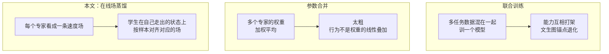
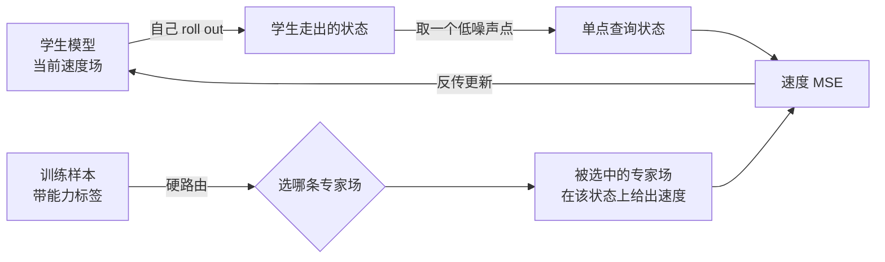
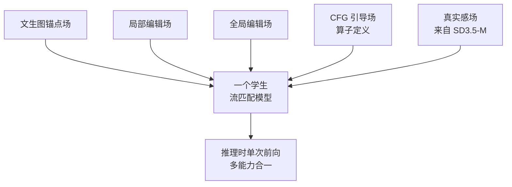

# DanceOPD：用在线场蒸馏把多种图像能力合进一个流匹配模型

> **原题**：DanceOPD: On-Policy Generative Field Distillation
> **作者**：Wei Zhou, Xiongwei Zhu, Zelin Xu, Bo Dong, Lixue Gong, Yongyuan Liang, Meng Chu, Leigang Qu, Lingdong Kong, Wei Liu, Tat-Seng Chua
> **机构**：字节跳动 Seed、新加坡国立大学（NUS）、马里兰大学（UMD）、香港科技大学（HKUST）
> **年份**：2026（arxiv ID 2606.27377v1，6 月 25 日提交，技术报告 39 页、13 图、9 表）
> **分类**：cs.CV
> **链接**：https://arxiv.org/abs/2606.27377
> **精读日期**：2026-06-26

## 阅读须知

**这篇在领域里的位置。** 这几年的图像生成，先是文生图扩散模型把"给一句话画一张图"做扎实，接着指令编辑类工作让模型学会"照一句话改一张图"，再往后，大家想要的是一个模型把这些事一起干：既能从文字生成，又能做局部编辑，也能做全局编辑，最好还又真实又快。把多种能力塞进同一个模型，过去主要有两条路。一条是联合训练，把各任务的数据混在一起训一个模型；另一条是参数合并，把几个各有所长的专家模型的权重做加权平均。这篇论文走的是第三条路：把"能力"看成一条条速度场，用蒸馏把多个冻结专家的本事吸进同一个学生模型里，而且蒸馏是"在线"的，查询的是学生自己走出来的状态。它正好坐落在"多能力统一生成"和"在线蒸馏"这两条线的交叉点上。

**读完能回答什么。**

- 为什么把文生图、局部编辑、全局编辑硬凑进一个模型去联合训练会"打架"，参数合并又为什么粗糙。
- "把一种能力看成一条速度场"到底是什么意思，流匹配模型为什么天然适合这种抽象。
- "在线（on-policy）"蒸馏和"离线"蒸馏差在哪里，为什么查询学生自己走出来的状态能消掉训练与推理之间的偏差。
- 什么叫"无分类器引导（CFG）吸收"和"真实感吸收"，它们怎么用同一套场蒸馏框架顺手做掉。
- 为什么只在一个低噪声点上查询一次就够，省在什么地方。

**阅读前置。** 假定读者熟悉扩散模型或流匹配的基本框架，知道模型学的是一个速度场、采样是沿一条常微分方程把噪声推成图像；也知道文生图与指令编辑的基本任务设定；对"蒸馏"这个概念有一般了解。不预设读者专门做过在线策略蒸馏，也不预设研究过模型权重合并。

**首次出现的缩写。**

- **T2I**（Text-to-Image，文生图）：给一段文字，生成一张对应的图像。
- **流匹配**（Flow Matching）：扩散类生成的一种训练框架，模型学一个随时间变化的速度场，采样时沿这个场积分，把简单噪声分布一路搬到数据分布。
- **CFG**（Classifier-Free Guidance，无分类器引导）：推理时把"带条件"和"不带条件"两次预测做外推，用来增强生成对条件的服从度，代价是每步要前向两次。
- **MSE**（Mean Squared Error，均方误差）。
- **ODE**（Ordinary Differential Equation，常微分方程）：流匹配采样时沿之积分的那条轨迹方程。
- **OPD**（On-Policy Distillation，在线策略蒸馏）：本文方法 DanceOPD 即 Dance On-Policy Distillation。
- **GEditBench-EN**：图像编辑评测基准。**GenEval**：文生图评测基准。
- **Z-Image**：本文用作主干的流匹配生成模型。**SD3.5-M**：本文用作"真实感"来源的另一个生成模型。

很多人希望最终只用一个图像模型，就能既听文字作画、又能在原图上修一小块、还能对整张图做风格或场景的全局改动，顺带画得真实、跑得快。可现实里，这些能力常常分散在不同的模型或不同的权重里，要么各用各的，要么靠一次昂贵的联合训练硬捏到一起。问题在于，硬捏的代价不小：联合训练时不同任务会互相干扰，常常是这个指标涨了、那个指标掉了，连最基本的文生图都可能被带退化；而把几个专家的权重直接平均，做法虽便宜，却太粗，因为模型的行为并不是权重的线性叠加，平均完往往两头不讨好。于是领域里缺一种办法：拿几个已经很强的、冻结不动的专家，把它们的本事融进一个学生模型，既不必从头联合训练，又不让这些能力彼此打架。这正是这篇论文要解决的事。

## 一、问题

把上面的动机落到一个可验证的技术表述上：给定若干已经冻结的专家流匹配模型，每个各自擅长一种能力，比如一个负责文生图（作为要守住的锚点），一个负责局部编辑，一个负责全局编辑，另外还有一些"算子定义"的场（例如 CFG 引导）和一个提供真实感的来源模型（SD3.5-M），目标是学出**一个**学生流匹配模型，把这些能力合到一起，既把目标能力做强，又不让作为锚点的文生图质量退化。

要理解这篇为什么这么做，得先看清前人两条主流路线各自卡在哪里。

第一条是**联合训练**。把多任务的数据混在一起，训一个模型同时学所有能力。它的麻烦是"能力冲突"：不同任务对同一组参数的拉扯方向并不一致，训练中此消彼长，常常顾此失彼，而且越训越容易把最基础的文生图能力冲淡。换句话说，联合训练既要数据又要算力，还未必守得住锚点。

第二条是**参数合并**。先分别训好各能力的专家，再把它们的权重做加权平均或任务向量相加，拼出一个"全能"模型。它的好处是便宜，几乎不用再训练，但坏处是粗糙：模型的实际行为是权重经过层层非线性之后才决定的，把权重在数值上平均，并不等于把行为在功能上叠加，结果往往是哪一项都打了折。

还有一条相关的路线是普通的**离线蒸馏**：让学生去对齐老师，但对齐用的状态来自老师的轨迹或固定的前向加噪过程。它的隐患是训练与推理之间的状态分布对不上：训练时喂给学生的是老师走出来的、或加噪造出来的状态，可推理时学生是沿着自己走出来的状态一步步生成的，两者分布有偏差，这种偏差会在采样轨迹上累积。

## 二、方法

DanceOPD 的第一步，是换一个看待"能力"的角度：把每一种能力都表示成一条**速度场**。这一步之所以成立，是因为流匹配模型本身就是一个速度场。流匹配里，模型学的是一个随状态与时间变化的速度 $v(x,t)$，采样时从噪声出发，沿常微分方程 $\mathrm{d}x/\mathrm{d}t = v(x,t)$ 一路积分到图像。既然每个专家都是这样一个速度场，而且它们活动在同一个隐空间上，那么"把多种能力合到一起"就可以重新理解成：学一个学生速度场，让它在面对不同样本时，能复现出相应专家场该有的速度。能力的组合，于是变成了场的组合。

在这个视角下，DanceOPD 的训练有四个关键动作。

其一，**按样本硬路由**。对每一个训练样本，根据它属于哪种能力，把它唯一地指派给对应的那条专家场。文生图的样本就对齐文生图专家，局部编辑的样本就对齐局部编辑专家，依此类推。一个样本只走一条场，不做软混合，所以叫硬路由。

其二，**在线查询学生自己走出的状态**。训练时先让学生自己 roll out，生成它自己的轨迹状态，再在这些状态上去查询被路由到的那条专家场。这就是"在线（on-policy）"的含义：监督信号是在学生实际会经过的状态上取的，而不是在老师轨迹或固定加噪过程的状态上取的。这样训练时见到的状态和推理时走到的状态分布一致，前面说的那种偏差就被堵住了。这个思路和在线策略的强化学习、以及 DAgger 一类纠偏方法是同一个精神。

其三，**单点、低噪声的查询**。它不在整条轨迹上密集地监督，而是只取一个低噪声处的学生状态查询一次。低噪声意味着图像的语义信息已经基本成形，作者把这种做法称为"语义侧的单点查询监督"，发现这样既省算力又够用。

其四，**速度 MSE 目标**。对齐的损失非常朴素，就是让学生在那个状态上的速度去逼近被路由专家场在同一状态上的速度：

$$\mathcal{L}_{\text{OPD}} = \mathbb{E}\Big[\,\big\lVert\, v_\theta(x_t, t, c) - v^{\,\text{route}(s)}_{\text{expert}}(x_t, t, c) \,\big\rVert^2 \,\Big]$$

其中 $x_t$ 是学生自己 roll out 到的那个低噪声状态，$c$ 是条件（文字提示或编辑指令），$v^{\text{route}(s)}_{\text{expert}}$ 是按样本 $s$ 路由选中的那条专家场。整个监督既不需要老师的中间轨迹，也不需要复杂的对齐项，一个均方误差就够。

把能力当成场之后，还有一个意外的好处：一些原本不是"模型"、而是"算子"的东西，也能被同样地吸进来。CFG 就是一个例子。无分类器引导本来是在推理时把带条件和不带条件两次预测做外推得到的，等于每一步都要前向两次，慢一倍。DanceOPD 把"引导之后的那条场"也当作一条由算子定义的目标场去蒸馏，让学生把引导后的行为直接学进自己的单次前向里，推理时不必再跑两遍，这被称为"CFG 吸收"。同理，"真实感吸收"是把另一个模型（SD3.5-M）的真实感也当成一条场吸收进来，让学生在不单独为真实感做训练的情况下把这一项补上。于是文生图锚点、局部编辑、全局编辑、CFG 引导、真实感这几样，最后都落进同一个学生里。

## 三、实验

主干模型用的是 Z-Image，真实感来源是 SD3.5-M。评测用两套现成基准：图像编辑看 GEditBench-EN，文生图看 GenEval。论文是一份 39 页的技术报告，带 13 张图、9 张表，围绕"多能力组合"做了较为完整的对照与消融。从摘要层面能确认的主结果是几项相对增益：

| 场景 | 相对增益 | 说明 |
| --- | --- | --- |
| 文生图与编辑的组合 | +8.1% | 在保持文生图质量的前提下做能力组合 |
| 局部与全局编辑的组合 | +16.1% | 编辑类能力的合成提升最明显 |
| 真实感吸收 | +9.9% | 真实感提升，同时维持文生图表现 |

需要诚实说明的是，这里给出的是论文摘要点名的几项相对增益，各基准上的绝对分数、与强联合训练基线的逐项对照、以及 CFG 吸收带来的推理加速的具体倍数，应当落在那 9 张表里，但仅凭可获取的摘要与首页信息无法逐条抄录。从已有信息能看出的趋势是：增益在编辑类能力的合成上最大（局部与全局编辑 16.1%），这与论文的核心卖点一致，因为编辑正是最容易和文生图锚点"打架"的地方；而真实感与文生图的并存（9.9% 的同时不掉文生图）则说明"吸收"这种做法确实能在不牺牲锚点的情况下补强一项。

## 四、局限

这一节把作者可能承认的边界和读者读完能看出来的潜在问题分开说。需要先点明：可获取的摘要里没有显式列出局限段落，所以下面以读者侧的判断为主，作者自述的部分以报告正文为准。

读者侧能看出来的有这么几点。第一，硬路由要求每个样本都有清楚的能力归属，路由才指得明白；一旦能力边界本身模糊，或者要加入一种全新的、训练时没见过的能力，"该把它路由到哪条场"就成了开放问题。第二，整套方法依赖一组已经很强的冻结专家，学生的上限被这些老师托着，蒸馏做的是搬运与融合，并不凭空创造新能力，专家不行的地方学生大概率也补不上。第三，单点、低噪声的查询省了算力，但它是否在所有能力上都够用，尤其是那些需要照顾全局结构、跨越较大噪声范围的编辑，值得更细的验证；摘要给的是相对增益，缺少在绝对质量上对强基线的全面对照。第四，所有结论都在图像、在 cs.CV 的范围内得到，推广到视频或别的模态会怎样是未知的。第五，在线蒸馏需要在训练时让学生 roll out，虽然单点查询缓解了开销，但相比纯离线蒸馏仍然更重一些。

## 一句话

把每种图像能力当成一条速度场，让一个学生在自己走出的状态上、按样本去对齐对应的专家场，从而把文生图、编辑、引导和真实感吸进同一个流匹配模型。
