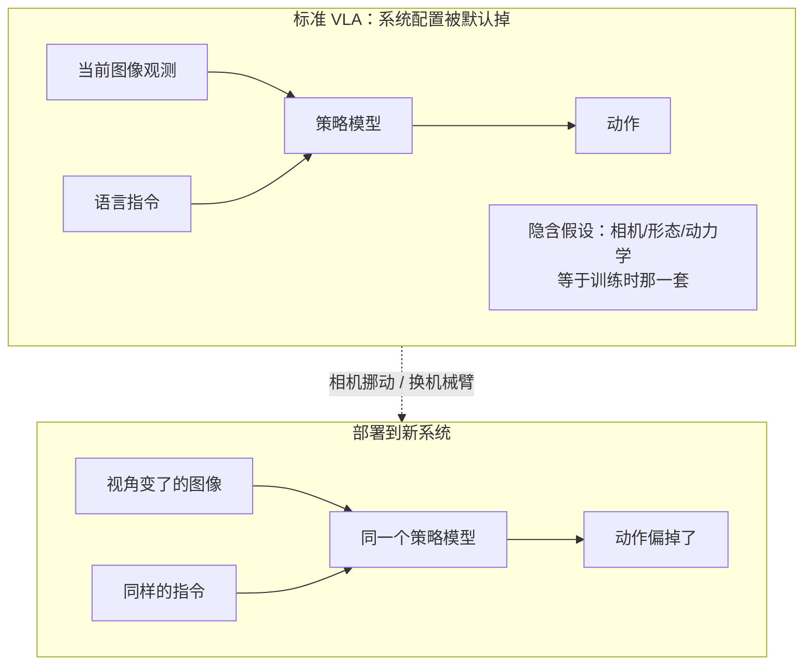
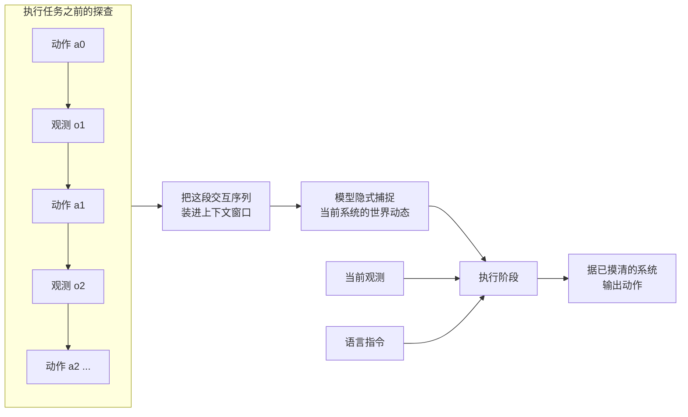
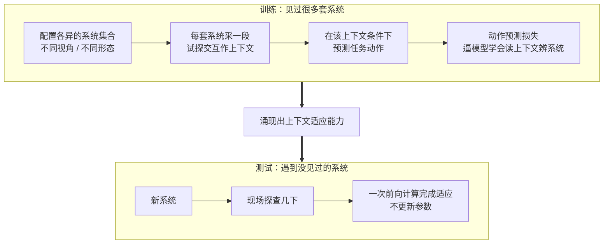

# 上下文世界建模：让机器人在执行任务前，先用几下试探把自己所处的系统摸清楚

> **原题**：In-Context World Modeling for Robotic Control
> **作者**：Siyin Wang, Junhao Shi, Senyu Fei, Zhaoyang Fu, Li Ji, Jingjing Gong, Xipeng Qiu
> **机构**：OpenMOSS 团队（作者多来自复旦大学）
> **年份**：2026（arxiv ID 2606.26025，v2 提交于 6 月 25 日）
> **分类**：cs.RO（机器人） / cs.CV（计算机视觉）
> **链接**：https://arxiv.org/abs/2606.26025
> **精读日期**：2026-06-27

---

## 阅读须知

### 这篇在领域里的位置

最近两三年，机器人控制的主流叙事从「为每个任务单独训一个策略」转向了「视觉-语言-动作模型」（Vision-Language-Action，简称 VLA）。所谓 VLA，是把一个见多识广的视觉语言大模型当作底座，让它直接吃进当前的图像观测和一句自然语言指令，输出机器人下一步该做的动作。这条路线之所以诱人，是因为它把语言模型在互联网规模数据上学到的常识和泛化能力，迁移到了机械臂的控制上，于是同一个模型可以听懂「把红色的杯子放到盘子右边」这样此前没见过的指令。

但是 VLA 有一个一直没被正面解决的软肋：它默认自己所处的「物理舞台」是固定的。训练时相机架在哪个角度、用的是哪一款机械臂、关节有几个自由度、镜头的畸变和时延是什么样，这些条件一旦在部署时变了，模型的表现就会明显下滑。过去几年，研究者用域随机化、显式系统辨识、元学习快速适应、以及干脆在新环境里再微调一遍等办法来缓解，但每一种都要付出代价：要么训练时把所有可能的变化都见一遍，要么部署时为新环境再采一批数据、再更新一次参数。这篇论文要做的，是把「适应新系统」这件事从「更新权重」彻底挪到「读上下文」里去。

### 读完能回答什么

读完这份笔记之后，你应当能回答下面这几个问题：

1. 为什么标准的 VLA 模型一换相机视角或换机械臂就容易失灵，问题的根在哪里。
2. ICWM 所说的「把系统辨识当成上下文适应问题」具体是什么意思，它和传统的上下文学习有什么本质区别。
3. 机器人「自己生成的、与任务无关的试探」是怎么帮模型推断出当前系统的，为什么这一步不需要更新任何参数。
4. 这套做法在实验上验证到了什么程度，它目前最站得住的结论是哪一条，还有哪些没有公布的数字。

### 阅读前置

这份笔记假定你熟悉 Transformer 的基本结构，知道注意力机制怎么让一段序列里的每个位置互相看见，也大致了解大语言模型里「上下文学习」是怎么回事。不预设你做过机器人或强化学习：凡是涉及策略、系统辨识、世界模型这些控制和具身智能里的术语，都会在第一次出现时先用一两句话讲清楚它要解决什么，再展开。

### 首次出现的缩写表

- **VLA**（Vision-Language-Action model，视觉-语言-动作模型）：把图像观测和语言指令一起喂进去、直接输出机器人动作的大模型。
- **ICWM**（In-Context World Modeling，上下文世界建模）：本文提出的框架，让机器人先读一小段自己生成的试探交互，在上下文里隐式地推断当前系统怎么运转，再去执行任务。
- **ICL**（In-Context Learning，上下文学习）：大模型不更新参数，只靠提示里给出的若干示例就完成新任务的能力。
- **系统辨识**（System Identification）：控制领域里的老概念，指从输入输出数据反推出一个系统的内部参数或动态规律。
- **世界模型**（World Model）：一个能根据当前状态和动作预测下一步会发生什么的模型，相当于机器人脑子里对环境的一份内部模拟。
- **形态**（Morphology）：机器人的身体构造，比如有几个关节、臂展多长、末端是夹爪还是吸盘。

## 为什么这个问题值得做

把一个在实验室里训得好好的机器人策略搬到另一处，常常会遇到一种让人沮丧的情形：什么都没改，只是把相机往旁边挪了二十厘米，或者换了一台关节布局略有不同的机械臂，原本利落的抓取就开始频频落空。原因并不在于模型「不会」这个任务，而在于它把训练时那套特定的观测条件，悄悄当成了世界的固定背景。一旦背景变了，模型读到的图像和它脑中预期的对不上，动作自然就偏了。

这件事不解决，具身智能就很难真正铺开。现实世界里没有两套机器人工作站是完全一样的：相机的安装位置、光照、镜头型号、机械臂的磨损和标定误差，处处都在变。如果每换一个场地都要重新采数据、重新微调一遍模型，那么 VLA 承诺的「一个模型走天下」就成了空话，落地成本反而比传统的逐任务编程还高。

过去主流的应对路线大致有三条。第一条是域随机化，训练时人为地把相机角度、光照、物理参数都大幅扰动，逼模型对变化不敏感；它的代价是训练负担重，而且对没覆盖到的变化仍然脆弱。第二条是显式系统辨识，先用一段数据估出当前系统的物理参数，再把参数喂给策略；它要求你事先知道该估哪些参数，建模一旦不全就会失准。第三条是到了新环境就微调，效果通常最好，但每次都要采数据、更新权重，慢且贵。这篇论文的出发点，是想绕开「更新参数」这个共同的瓶颈，转而问一个问题：能不能让模型像大语言模型读提示那样，只读一小段当前系统的交互记录，就在一次前向计算里把自己调整到位。

## 一、问题

先把问题收紧到一个清晰的技术陈述上。一个标准的 VLA 策略，本质上是一个条件概率：给定当前的图像观测和语言指令，输出一个动作。用记号写出来，策略大致是「动作 = 策略(当前观测, 指令)」。这里隐藏着一个被默认掉的变量，就是当前系统的配置：相机在哪、机器人是什么形态、动力学如何。标准 VLA 没有把这个配置当成输入，于是它只能假定这个配置永远等于训练时见过的那一套。论文把这一点说得很直白：模型「忽略了底层的系统配置这个变量，因而隐式地假设了一个在训练中固定不变的执行情境」。

一旦把这层假设挑明，失败的来由就清楚了。换一个相机视角，等于换了一个从世界到图像的投影函数；换一种机器人形态，等于换了一套从动作指令到实际位移的映射。这两样都属于「系统怎么运转」的范畴，而不属于「要做什么任务」的范畴。标准 VLA 把任务信息（语言指令）显式地接了进来，却把系统信息整个漏掉了，所以它在新任务上还能靠语言泛化，在新系统上却无能为力，只能依赖论文所说的「数据密集的微调」来补课。

值得把任务和系统这两个维度分开来看，这正是本文的关键视角。传统的上下文学习处理的是任务维度：你在提示里塞几个「输入对应输出」的示例，模型就照着办新任务。而这篇论文盯上的是系统维度：模型缺的不是「该做什么」的示例，而是「这套身体和这只眼睛是怎么工作的」这份知识。把这两件事区分开，下面方法的设计动机就顺理成成章了。

## 二、方法

ICWM 的核心主张可以浓缩成一句话：把系统辨识从「估参数、调权重」改写成「读上下文」。具体而言，它让机器人在正式执行任务之前，先自己生成一小段与任务无关的试探性交互，把这段交互放进模型的上下文窗口里；模型在处理这段上下文的过程中，隐式地把当前系统的运转规律捕捉下来，于是后续执行任务时，动作就建立在「我已经摸清了这套系统」的基础之上。整个适应过程发生在一次前向计算里，不更新任何参数。

这里要把「与任务无关的试探」讲清楚，因为它正是 ICWM 和传统上下文学习分道扬镳的地方。传统上下文学习喂给模型的是任务示范，目的是告诉模型「该做哪件事」；ICWM 喂给模型的是机器人自己动几下、看看世界如何回应的记录，目的是让模型搞明白「这套系统是怎么动的」。打个比方，一个人到了陌生的房间，会先伸手碰一碰、走两步试试地板的软硬，这些动作本身不是任务，却能让他迅速建立起对环境的感觉。ICWM 让机器人做的就是这件事：先用几个动作去探一探，从动作和观测的对应关系里反推出相机视角、形态、动力学这些潜在变量。

为什么把交互记录读进上下文，就等于在做世界建模，这一步需要点拨一下。所谓世界模型，是一个能根据「当前状态加一个动作」预测「下一步状态」的模型，相当于机器人脑中对环境的一份内部模拟。当模型逐一处理试探序列里「动作 a 之后观测变成了 o」这样的配对时，它实际上是在用注意力机制，从这些配对中归纳出「在这套系统里，给定动作会引出怎样的观测变化」的规律。这份规律不是写成一组显式参数存下来的，而是化在模型对上下文的表示里，所以论文称之为「隐式地捕捉了当前系统的世界动态」。换句话说，世界模型在这里不是一个单独训练、按环境逐个替换的模块，而是被上下文当场条件化出来的。

至于这套机制是怎么训练出来的，摘要没有逐一交代架构细节，按这一类上下文方法的通行做法和论文的描述可以做出合理的重构，下面这部分属于笔记作者的推断，不是论文的原文。训练时需要准备一大批配置各异的系统，比如把相机摆到各种角度、换上不同形态的机器人。对每一个系统，先采一小段试探交互作为上下文，再让模型在这个上下文的条件下去预测任务动作；模型为了把动作预测准，就不得不学会利用上下文里的交互去推断当前是哪一套系统。当见过的系统足够多、足够杂，这种「读一段交互就自动校准到当前系统」的能力，就像大语言模型的上下文学习能力一样，会从大规模训练中自然涌现出来。这本质上是一种摊销式的推断：把原本需要在测试时一遍遍迭代优化的系统辨识，提前摊到训练里，换来测试时一次前向计算就完成适应。

## 三、实验

论文说明，ICWM 在仿真和真实机器人平台上都做了大量实验。评测要回答的核心问题是：当部署条件偏离训练时的设定，比如把相机换到一个训练中没出现过的新视角，模型还能不能把任务做好。围绕这个问题，最直接的对照对象就是不带上下文适应机制的标准 VLA，也就是只看当前观测和指令、把系统当成固定背景的那一类模型。

公开摘要给出的明确结论只有一条，而且这一条说得相当肯定：在新的相机视角下，ICWM 显著优于标准的 VLA 基线。这条结论之所以重要，是因为相机视角的改变正是 VLA 最典型、也最常遇到的失效场景，它直接动摇了模型赖以定位物体的视觉投影；ICWM 能在这种条件下把性能拉回来，说明「先探查、再执行」这套思路确实抓住了问题的要害。

需要诚实地交代一处空白：截至这份笔记所依据的摘要与论文页面，作者并没有公开具体的数字，包括成功率提升了多少个百分点、用了哪些基准任务、换形态相比换视角的增益差多少、以及探查交互需要多长这一类消融。出于不杜撰的原则，这里不替论文编造任何成功率或对比数值。可以确定的实验骨架是：评测同时覆盖仿真与真实平台，对照的是标准 VLA，主打的变量是新相机视角；至于换机器人形态这条线，摘要把它列为动机里要解决的目标，但拿出来作为明确量化结论的，目前只有视角这一项。等正式版论文给出表格，这一节应当用真实数字补全，而不是用印象去填。

## 四、局限

先说作者自陈的局限。摘要本身没有专门列出局限，因此这一块严格意义上的「作者承认部分」是空的，下面几条都属于读完之后能看出来的潜在问题，分开来讲以免和论文原文混淆。

第一，整套方法的成败系于那段自己生成的试探交互。如果探查动作没能激发出与任务相关的系统特性，比如机器人随便动了动，却没碰到能暴露视角偏差或动力学差异的那些维度，模型读进去的上下文就可能信息不足，推断自然会打折扣。如何设计或学出「信息量高」的探查动作，是这条路线绕不开的隐忧。

第二，上下文窗口的长度是把双刃剑。试探交互越长，模型能掌握的系统信息越多，但上下文也越长，推理的计算和时延都会上去；在真实机器人上，执行任务前先花一段时间做探查，还涉及探查动作本身是否安全的问题。第三，无须更新参数固然轻快，可一旦新系统与训练分布相差极大，仅靠前向条件化的适应能力未必比真刀真枪地微调更强，这类「分布外」的硬骨头，上下文方法通常也啃得吃力。第四，目前最硬的结论集中在相机视角上，而换形态意味着动作空间和自由度都可能变化，比视角改变要剧烈得多，这一维度上 ICWM 能走多远，还要等更充分的数字来回答。

## 一句话

把机器人「适应新相机、新身体」这件事，从「重新采数据微调权重」改写成「先自己动几下、把这段交互读进上下文」，一次前向计算就完成系统辨识。
