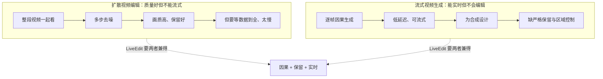
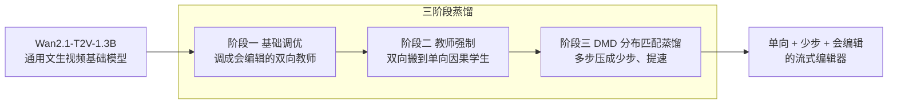
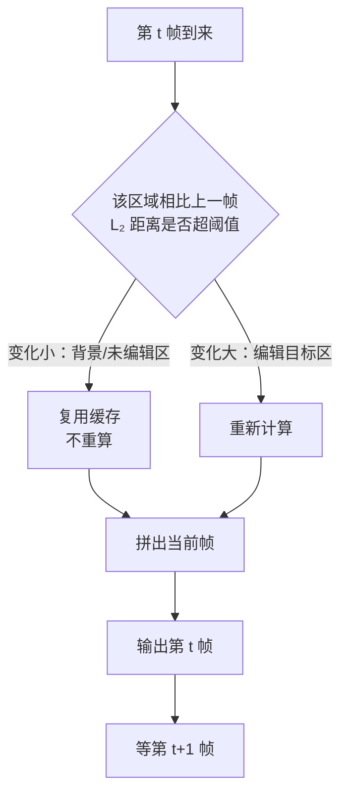

# LiveEdit：把扩散视频编辑做到边看边改、逐帧实时

> **原题**：LiveEdit: Towards Real-Time Diffusion-Based Streaming Video Editing
> **作者**：Xinyu Wang, Chongbo Zhao, Fangneng Zhan, Yue Ma
> **机构**：清华大学（据 huggingface daily papers 标注）
> **年份**：2026（arxiv ID 2606.26740，6 月 25 日提交）
> **分类**：cs.CV（计算机视觉）
> **链接**：https://arxiv.org/abs/2606.26740
> **精读日期**：2026-06-30

---

## 阅读须知

### 这篇在领域里的位置

这两年，用扩散模型（diffusion model）做视频编辑已经成了一条很热的线。所谓视频编辑，是给定一段已有的视频和一句话的指令，比如「把这个人的外套换成红色」，让模型只改动该改的地方，其余部分尽量保持原样。扩散模型在画质上很强，但它有两个让人头疼的特点：一是慢，生成一帧往往要反复去噪好几十步；二是它习惯把整段视频前后一起看（双向注意力），这样质量好，却没法做到「来一帧、改一帧、马上输出」。

与此同时，另一条线在做流式视频生成（streaming video generation），追求的就是边生成边输出、低延迟。可这条线绝大多数是为「凭空合成」设计的，没法直接拿来做编辑，因为编辑有一个合成任务没有的硬要求：严格保留。背景、没被指令点到的区域，必须在很长的时间里都稳稳不动，不能闪、不能飘。LiveEdit 站的就是这两条线的交叉口：它想要扩散编辑的画质，又想要流式生成的实时性，目标是做一个能逐帧、因果地实时编辑视频的框架。

### 读完能回答什么

读完这份笔记之后，你应当能回答下面这几个问题：

1. 流式视频编辑难在哪里，为什么不能把现成的流式视频生成方法直接搬来用。
2. LiveEdit 的三阶段蒸馏管线分别是哪三步，它是怎么把一个又强又慢的双向模型，逐步变成一个又快又能流式的单向模型的。
3. 那个「掩码缓存」是怎么省下计算、把速度提上去的，它依赖的假设是什么。
4. 这套方法到底快到什么程度、画质守到什么程度，它和别的流式方法比赢在哪。

### 阅读前置

这份笔记假定你了解扩散模型的基本思路，知道它通过一步步去噪从噪声里生成图像，也大致清楚注意力机制是怎么回事。不预设你做过视频生成或模型蒸馏：凡是涉及双向与单向注意力、教师强制、分布匹配蒸馏、缓存复用这些词，都会在第一次出现时先用一两句话讲清楚它要解决什么，再展开。

### 首次出现的缩写表

- **扩散模型**（Diffusion Model）：通过反复去噪、从随机噪声里逐步生成图像或视频的一类模型，画质好但推理偏慢。
- **流式**（Streaming）：数据像水流一样一帧帧到来、一帧帧处理并输出，不等整段都到齐，是实时交互的前提。
- **双向 / 单向（因果）**：双向指模型能同时看前后文，质量高但要等数据到全；单向（因果，causal）只看过去、不看未来，才能边到边处理。
- **蒸馏**（Distillation）：让一个小而快的学生模型，去模仿一个大而强的教师模型的行为，从而以更低的成本逼近教师的效果。
- **DMD**（Distribution Matching Distillation，分布匹配蒸馏）：一种把多步扩散压成极少步数的蒸馏方法，靠的是让学生的输出分布去贴近教师的输出分布。
- **教师强制**（Teacher Forcing）：训练逐帧生成的模型时，用真实或教师给出的前文作为输入来预测下一步，让学生学得更稳。
- **掩码缓存**（Mask Cache）：把跨帧基本没变的区域的计算结果缓存下来重复使用，少算一遍，从而加速。
- **FPS**（Frames Per Second，每秒帧数）：衡量实时性的指标，数字越高越流畅。

## 为什么这个问题值得做

设想一个很具体的场景：你在做直播或者戴着 AR 眼镜，希望画面里某样东西被实时换掉，比如把桌上的杯子换个颜色、给人物加一件衣服，而且要立刻看到效果、可以随时再调。这件事用现在的扩散视频编辑做不了，原因有两层。

第一层是慢。扩散模型生成一帧要去噪很多步，再加上视频编辑往往要把整段一起处理，算下来一帧要等很久，根本谈不上实时，更别说交互。第二层是稳。编辑和凭空生成不一样，它对「不该动的地方别动」有近乎苛刻的要求。一段视频几百帧放下来，背景哪怕只有一点点抖动或色彩漂移，人眼立刻就能看出来，观感会非常廉价。偏偏逐帧、只看过去的流式做法，最容易在时间上累积这种漂移。

于是这个方向就卡在一个两难里：要画质和稳定，就得用又大又慢、还要前后一起看的双向扩散模型；要实时和流式，就得用又小又快、只看过去的单向模型，可这样质量和稳定性又保不住。把这两头同时拿到手，正是 LiveEdit 想解决的问题，也是它值得一读的地方。

## 一、问题

把问题收紧成一句清晰的技术陈述：给定一段持续到来的视频流和一句编辑指令，要做到逐帧、因果地编辑，每来一帧就改好一帧、马上输出，同时在很长的时间跨度里把背景和未编辑区域守稳，并且整体速度要快到能交互。这里面有三个约束彼此拉扯，分别是因果（只能看过去）、保留（不该动的别动）、实时（要快）。

前人为什么不够用，可以分两类来看。一类是扩散视频编辑的既有方法，它们画质和保留都做得不错，但普遍依赖双向注意力和多步去噪，本质上是「拿到整段再慢慢改」，没法变成边来边改的流式形态。另一类是近来的流式视频生成方法，它们在因果和实时这两点上已经走得很远，但它们是为合成设计的，没有「严格保留原视频内容」和「只在特定区域施加控制」这两项编辑特有的能力，直接拿来做编辑会破坏不该动的地方。

所以真正的难点不在于单独实现某一个约束，而在于把因果、保留、实时三者同时满足。LiveEdit 的整套设计，都是围绕「如何在变成单向、变快的同时，不把画质和保留弄丢」来展开的。

## 二、方法

LiveEdit 的主干是一条三阶段蒸馏管线，思路是把编辑能力从一个又强又慢的双向基础模型，一步步搬到一个又快又能流式的单向学生模型上。之所以要分三阶段循序渐进，而不是一步到位，是因为「双向变单向」和「多步变少步」这两件事如果同时硬来，学生会学崩；拆开来逐步逼近，才能在提速的同时把画质和保留尽量守住。基础模型用的是 Wan2.1-T2V-1.3B，一个十三亿参数的文本生成视频扩散模型。

第一阶段是基础调优（Foundation Tuning）。先把这个通用的文生视频基础模型，调成一个会做编辑任务的双向教师，让它在「保留原内容、按指令改特定区域」这件事上先做到位。这一步还不管快不快，只管把编辑能力和保留能力立起来，作为后面蒸馏的源头。

第二阶段是教师强制（Teacher Forcing）。这一步开始把双向往单向搬：训练一个只看过去、逐帧生成的因果学生，用教师给出的结果作为引导，让学生在一帧帧自回归生成时，对齐教师那种稳定的输出。教师强制的作用是给学生一个可靠的前文参照，避免它在自己逐帧往下走时越跑越偏。

第三阶段是分布匹配蒸馏（DMD，Distribution Matching Distillation）。前两阶段解决了「单向也能编辑得稳」，但去噪步数可能还多、还不够快。DMD 的任务是把多步去噪压成极少的步数，做法不是逐像素地对齐，而是让学生的输出分布去贴近教师的输出分布，从而在大幅减步、提速的同时，尽量不丢画质。三步走完，得到的就是一个单向、少步、会编辑、还守得住背景的流式编辑器。

光有蒸馏还不足以达到实时，于是 LiveEdit 又加了一个面向自回归的掩码缓存（AR-oriented Mask Cache）。它的出发点很朴素：在一段视频里，背景和未编辑区域帧与帧之间往往几乎不变，如果每一帧都把这些地方从头算一遍，就是大量重复劳动。掩码缓存的做法是把这些区域相关的计算结果缓存下来，跨帧复用；判断某块区域要不要复用，靠的是 L₂ 距离阈值，也就是看这块区域相比上一帧变化有没有超过一个设定的门槛，变化小就直接用缓存，变化大才重新计算。配合分块的因果注意力（chunk-wise causal attention），这套缓存把冗余处理大幅砍掉，把推理速度顶了上去。需要点明的是，这个复用建立在「背景大体不动」的假设上，这一点在后面的局限里还会提到。

## 三、实验

训练这一侧，LiveEdit 在 Wan2.1-T2V-1.3B 的基础上，用了两万对视频，这些数据是从 Ditto-1M 这个数据集里筛出来的。评测则建立在一个专门为流式视频编辑搭的基准之上，作者把若干流式方法放在一起比，包括 LucyEdit、InsV2V、VideoCoF、StreamV2V、StreamDiffusion 以及 StreamDiffusionV2。

速度是这篇最硬的卖点。LiveEdit 的推理速度做到了每秒 12.66 帧，在开启掩码缓存的情况下，单帧延迟约为 79 毫秒。对交互和增强现实这类场景而言，这个量级已经跨进了「可以边看边改」的门槛，而这正是过去扩散编辑做不到的。

画质这一侧，作者在主表里给出了几项指标。文本对齐（衡量编辑结果是否贴合指令）为零点二七零，在所有对比方法里最好；背景一致性（衡量未编辑区域守得稳不稳）为零点九五六；运动平滑度为零点九九二；成像质量为零点七零八。把这几项放在一起看，LiveEdit 想说明的是，它在大幅提速的同时，并没有以画质和保留为代价，反而在流式这一类方法里拿到了最好的视觉质量。除了这些自动指标，作者还组织了二十名志愿者做人工评测，从指令一致性、背景保留和整体质量三个角度排序打分，用来佐证自动指标之外的主观观感。

| 指标 | LiveEdit 数值 | 含义 |
| --- | --- | --- |
| 文本对齐 | 0.270（最佳） | 编辑结果是否贴合指令 |
| 背景一致性 | 0.956 | 未编辑区域是否守稳 |
| 运动平滑度 | 0.992 | 时间上是否连贯不跳 |
| 成像质量 | 0.708 | 画面本身的清晰与观感 |
| 推理速度 | 12.66 FPS（79 毫秒/帧） | 实时性 |

## 四、局限

先说作者自己点到的边界。论文把适用场景定位在交互与增强现实，言下之意，它追求的是「够快到能交互」，而不是追求电影级的逐帧极致画质；它解决的也主要是流式编辑这一类任务，不是所有视频编辑场景的通解。

再说几条读完能看出来的潜在问题，与作者承认的分开讲。第一，每秒 12.66 帧虽然跨进了交互门槛，但仍低于常见视频二十四到三十帧的流畅标准，用在快速运动或对帧率敏感的场合可能还不够顺。第二，掩码缓存的提速，建立在「背景和未编辑区域帧间变化小」这个假设上，一旦镜头本身在大幅运动、或者画面整体都在变，可被复用的区域就会变少，这套加速的收益会随之打折。第三，成像质量零点七零八这样的数字说明画质仍有提升空间，提速和画质之间的取舍并没有被完全抹平。第四，训练只用了从单一来源 Ditto-1M 筛出的两万对视频，编辑类型的覆盖面可能有限；而评测又是在作者自建的基准上做的，和其他工作各自的设定能否横向对齐，还需要更多交叉验证。第五，逐帧因果生成在极长视频上是否会缓慢累积漂移，尽管三阶段蒸馏正是冲着稳定去的，仍要看更长时长下的实际表现。

## 一句话

用三阶段蒸馏把一个又强又慢的双向扩散编辑模型，逐步压成一个只看过去、少步、还守得住背景的单向流式编辑器，再靠掩码缓存复用不变区域，把扩散视频编辑做到每秒 12.66 帧的实时交互级别。
