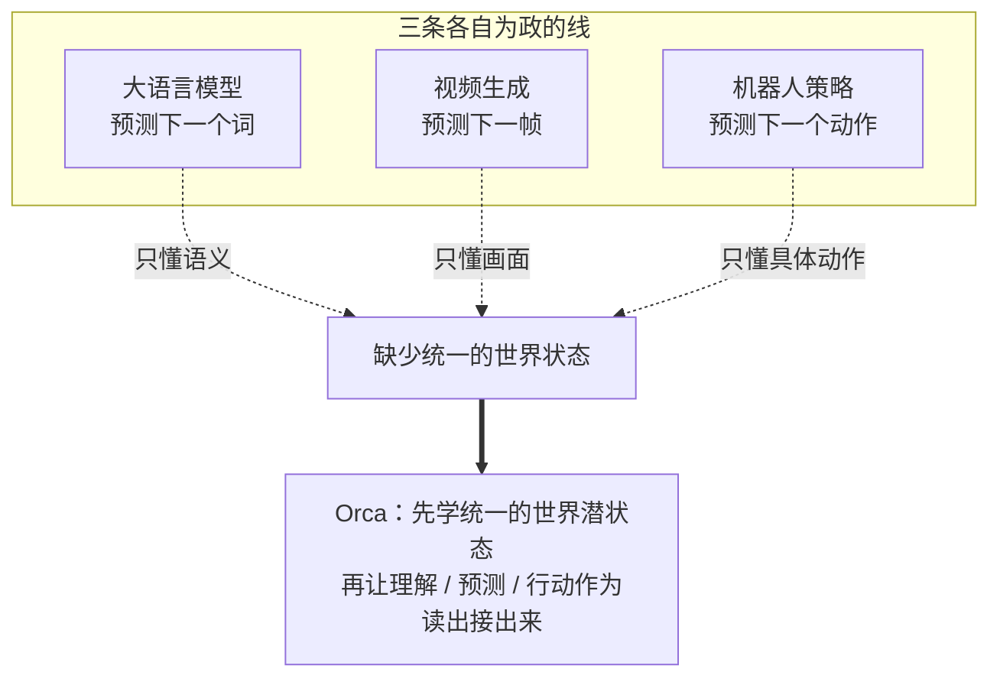
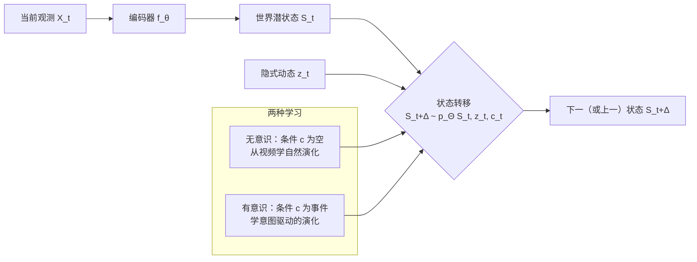
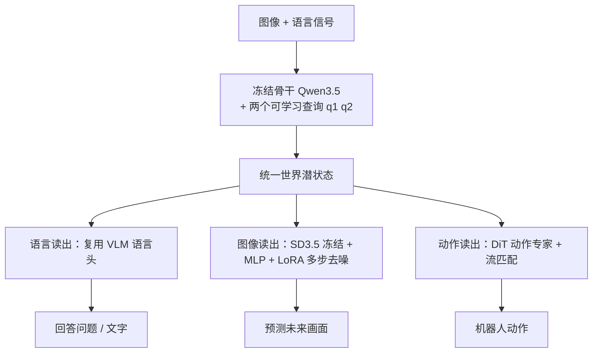

# Orca《世界在你脑中》：用「下一状态预测」把理解、预测和行动统一进一个世界潜空间

> **原题**：Orca: The World is in Your Mind
> **作者**：Yihao Wang, Yuheng Ji, Mingyu Cao, Yanqing Shen, Runze Xiao 等四十余人
> **机构**：北京智源人工智能研究院（BAAI）及合作单位
> **年份**：2026（arxiv ID 2606.30534）
> **分类**：cs.CV / cs.LG / cs.RO
> **链接**：https://arxiv.org/abs/2606.30534
> **精读日期**：2026-07-01

---

## 阅读须知

### 这篇在领域里的位置

这几年，人工智能的进步几乎是沿着三条各自为政的线在走。一条是大语言模型，核心是预测下一个词（next-token）；一条是视频生成，核心是预测下一帧（next-frame）；还有一条是机器人策略，核心是预测下一个动作（next-action）。这三条线各有各的强项，也各有各的盲区：语言模型不懂物理世界怎么动，视频模型不会做决策，机器人策略又难以泛化。它们共享的其实是同一个世界，却把这个世界拆成了三套互不相通的预测任务。

Orca 想做的，是把这三条线收回到一个共同的根上。它自称是「通用世界基础模型」（general world foundation model）的一个初步实例，主张智能不应该只是预测下一个词、下一帧或下一个动作，而应该先在脑子里建起一个统一的「世界状态」，再让理解、预测、行动这些不同能力从这个共同的状态里长出来。这篇之所以值得读，是因为它不是又提出一个更强的单项模型，而是在方法论上重新给「一个模型该学什么」画了一条线：学状态怎么转移，而不是学某一种输出怎么接龙。

### 读完能回答什么

读完这份笔记之后，你应当能回答下面这几个问题：

1. 「下一状态预测」（Next-State-Prediction）到底是什么意思，它和下一个词、下一帧、下一个动作这三种预测有什么本质区别。
2. 论文说的「无意识学习」和「有意识学习」分别指什么，各自让模型学到了世界的哪一面。
3. Orca 是怎么用一个冻结的骨干加几个轻量读出模块，同时输出文字、图像和动作的。
4. 它在文字、图像、真实机器人动作三条线上分别验证到什么程度，尤其是一个没喂过动作标签的模型，为什么还能做出动作。

### 阅读前置

这份笔记假定你了解大语言模型「预测下一个词」的基本范式，知道扩散模型大致是怎么生成图像的，也大致清楚视觉语言模型（VLM）是把图像和文字一起处理的模型。不预设你做过机器人或世界模型：凡是涉及潜空间、状态转移、流匹配、读出接口这些词，都会在第一次出现时先用一两句话讲清楚它要解决什么，再展开。

### 首次出现的缩写表

- **世界模型 / 世界基础模型**（World Model / World Foundation Model）：一个在内部对世界怎么运转建立起表示、并能预测状态如何变化的模型。
- **潜空间 / 潜状态**（Latent Space / Latent State）：模型内部用来概括一段观测的抽象向量表示，不是像素本身，而是像素背后的「意思」。
- **下一状态预测**（Next-State-Prediction）：本文的核心范式，预测的不是下一个词或下一帧，而是世界潜状态从当前到下一时刻的转移。
- **读出接口**（Readout）：从共享潜状态里取出某种具体输出（文字、图像或动作）的轻量模块。
- **VLM**（Vision-Language Model，视觉语言模型）：能同时接收图像和语言、并做理解与生成的模型，本文用 Qwen3.5 作骨干。
- **VQA**（Visual Question Answering，视觉问答）：给一张图或一段视频配一个问题，模型给出答案的任务，用来锚定语义。
- **流匹配**（Flow Matching）：一种训练生成模型的方法，让模型学会从噪声平滑地流向目标，本文用在动作生成上。
- **OOD**（Out-Of-Distribution，分布外）：测试时遇到训练里没见过的环境或物体，用来衡量泛化。

## 为什么这个问题值得做

先想一个很朴素的问题：一个真正通用的智能体，应该先学会什么。按现在的主流做法，你想让它会说话，就拿海量文本训一个预测下一个词的模型；想让它会想象画面，就拿视频训一个预测下一帧的模型；想让它会干活，就拿机器人数据训一个预测下一个动作的策略。三样能力，三套模型，三份数据，彼此之间几乎不通气。

这样做的代价，是每一样能力都只看见了世界的一个侧面。语言模型读了很多描述世界的文字，却没真正见过物体怎么掉下来、怎么被手挡住；视频模型见过大量画面的流动，却不知道这些流动对应着什么意图和后果；机器人策略学会了某些具体动作，可一旦换个环境、换个物体就容易失灵，因为它并没有一个关于「世界一般怎么运转」的底子。归根结底，它们缺的是同一样东西：一个统一的、关于世界状态如何随时间转移的内部表示。

Orca 的出发点，就是把这个缺失的底子补上。它主张先不要急着优化某一种输出，而是先让模型从多模态的世界信号里，学出一个统一的世界潜空间，再让文字、图像、动作这些具体能力，作为从这个潜空间往外的「读出」接出来。如果这条路走得通，那么理解、预测、行动就不再是三件要分开训练的事，而是同一个世界模型的三种表达。

## 一、问题

把问题收紧成一句技术陈述：能不能训练一个模型，让它学到一个统一的世界潜状态，使得从这个状态既能读出对世界的理解（回答问题）、又能读出对世界的预测（生成未来画面）、还能读出对世界的干预（输出机器人动作），而这三者共享同一个骨干、不需要为每种任务各训一个模型。

前人的三条路各自的局限，正是这个问题的由来。以预测下一个词为核心的语言模型，强在语义和推理，弱在对物理动态和空间关系的把握；以预测下一帧为核心的视频与图像生成模型，强在画面，却没有面向决策的能力，也难以回答关于场景的问题；以预测下一个动作为核心的机器人策略，能干具体的活，但泛化差，且严重依赖带动作标签的昂贵数据。这三者的共同短板，是都在优化一个孤立的、单向往后接龙的输出，而没有一个可以被多种任务复用的世界状态。

所以真正的难点不在于把某一项做得更强，而在于找到一种统一的建模目标，让一个表示同时服务于理解、预测和行动。Orca 给出的答案，就是把建模的中心从「预测下一个输出」挪到「预测下一个状态」。

## 二、方法

Orca 的核心是把学习目标定为「下一状态预测」。它先用一个编码器把多模态观测压成一个世界潜状态，记作 S 等于 f_θ(X)，也就是把原始的图像、语言等信号，映射成一个抽象的状态向量。然后它建模的是这个状态怎么转移：给定当前状态 S_t、一份隐式的动态 z_t 和一份显式的条件 c_t，预测 Δ 时刻之后（或之前）的状态 S_{t+Δ}。这里有一个值得点出来的细节：Δ 可以是正的，也可以是负的，也就是说模型既能往前推测未来的状态，也能往回推测过去的状态，这和只会单向往后接龙的下一个词、下一帧、下一个动作是根本不同的。

围绕这个状态转移，论文提出两种互补的学习范式。第一种叫无意识学习（Unconscious Learning）。它从连续的视频里学，不需要任何标签，条件 c 为空，模型要做的就是从一帧到下一帧，捕捉那些密集而自然的变化，比如运动、遮挡、物体交互、场景切换。这一部分由一个冻结的视觉编码器给出的潜表示来监督，学的是世界「自己会怎么动」。第二种叫有意识学习（Conscious Learning）。它引入显式的语言条件，比如一个事件、一个任务意图、一个因果前提，让模型学那些稀疏但有意义的状态转移；同时还配上视觉问答（VQA）来锚定语义。这一部分学的是「在某个意图或事件之下，世界会怎么变」。两者合起来，一个负责世界的自然演化，一个负责有意义的、被意图驱动的演化。

架构上，Orca 用的是编码器加解码器的结构，关键设计是骨干在下游适配时保持冻结。编码器以一个预训练好的视觉语言模型 Qwen3.5 作骨干，另外从头训练两个可学习的查询向量：第一个查询配上当前帧，用来预测下一时刻的视觉潜表示；第二个查询配上指令，用来预测事件层面的潜表示。解码器则是按模态分开的、轻量且可训练的读出模块：语言这一路直接复用视觉语言模型自带的语言头；图像这一路是在冻结的 Stable Diffusion 3.5 上加一个 MLP 适配器和 LoRA，做多步去噪来出图；动作这一路是一个从头训练、基于 DiT 的「动作专家」，用流匹配损失，把潜表示、带噪的动作和本体感知一起处理成具体动作。之所以要在读出后训练时冻结骨干、只训练这些轻量模块，是为了把「潜状态本身好不好」和「某个具体任务适配得好不好」分开，从而检验前者的质量。

预训练的目标由三部分损失加权而成，写出来是 L 等于零点一乘 L_obs，加零点五乘 L_evt，加零点四乘 L_vqa。第一项 L_obs 是仅凭观测的状态转移，用均方误差加余弦相似度去匹配「预测的视觉潜表示」和「相邻帧真实的视觉潜表示」，其中匹配是零点一的均方误差加零点九的余弦，也就是更看重方向对齐。第二项 L_evt 是事件条件下的状态转移，对前后两个方向的事件转移取平均。第三项 L_vqa 就是标准的下一个词预测损失，用在「视频加问题到答案」上。三项数据的采样比例是五比十五比一。从权重上看，事件条件转移和视觉问答占了大头，观测转移权重虽小，但后面的消融会显示它对动作能力至关重要。

数据这一侧，论文准备的预训练素材有十二万五千小时的视频和一亿六千万条事件标注，但实际只用了其中约一万两千五百小时，也就是十分之一。视频涵盖第一人称交互、第三人称操作、不含动作标签的机器人执行、以及自然动态几类。模型评了两个规模，分别是八亿参数的 Orca-0.8B 和四十亿参数的 Orca-4B。

## 三、实验

Orca 在文字、图像、动作三条读出线上分别做了验证，比较的对象都是各条线上的强基线。

文字这一路，Orca-4B 在 MVBench、TemporalBench、3DSRBench、SWITCH 四个基准上取得五十一点八的平均分，高于同规模的 Qwen3.5-4B 的四十六点七，也远高于 Emu3.5 的二十九点八。更细的能力拆解显示，相比 Qwen3.5-4B，它在状态转移一项上高出百分之十二点二七，在常识推理上高出百分之五点一九，说明「先学状态转移」确实给理解类任务带来了额外的收益。

图像这一路，在论文自建的 PRICE-V0.1 基准上，Orca-4B 得到五十九点八、上下浮动十点九的分数，超过了 FLUX.2 klein 的五十六点一，而且方差更小、更稳定。作者强调它的优势在于更好地保持了机器人的形态、场景与物体的一致性以及接触关系，这些正是把预测用于具身场景时最要紧的东西。

动作这一路是最有意思的一处。在真实机器人的环境分布外测试上，Orca 的规则化得分为三十六点六，高于强视觉动作基线 π₀.₅ 的二十七点六，更是远高于 Qwen3.5 的十二点四和 V-JEPA 2.1 的十五点二；在物体分布外一项上，Orca 得二十八点二，与 π₀.₅ 的三十一点二相近。这里真正值得记住的一点是：Orca 的预训练里根本没有用过任何带动作标签的数据，动作能力却能涌现出来，说明它是从对视频、对世界动态的理解里，迁移出了做动作的本领。

| 读出线 | 关键结果 | 对照 |
| --- | --- | --- |
| 文字（四基准均值） | Orca-4B 51.8 | Qwen3.5-4B 46.7 / Emu3.5 29.8 |
| 图像（PRICE-V0.1） | Orca-4B 59.8±10.9 | FLUX.2 klein 56.1±18.1 |
| 动作（环境 OOD） | Orca 36.6 | π₀.₅ 27.6 / V-JEPA2.1 15.2 |
| 动作（物体 OOD） | Orca 28.2 | π₀.₅ 31.2 |

消融实验把三项损失的作用坐实了。三项齐备时，各任务平均为四十八点零；去掉仅观测的 L_obs，动作能力受损最重；去掉事件条件的 L_evt，视觉读出明显崩坏，降到三十点九；去掉视觉问答的 L_vqa，整体的平衡性下降到四十二点六。也就是说，三项各司其职：观测转移撑起动作，事件转移撑起视觉，视觉问答守住语言与语义。此外，扩展性实验显示，无论把模型从 0.8B 加到 4B，还是把预训练数据加多，下游三条线的表现都单调变好；训练基建这边，靠 FSDP2、分块交叉熵、激活重算和通信调度等手段，把吞吐做到了相对 StarVLA 基线约四点四倍的加速。

## 四、局限

先说作者自陈的边界。论文把 Orca 定位成通用世界基础模型的一个「初步实例」，用词本身就留了余地：这是一条路线的第一步，而不是终点。而且它实际只用了备好数据的十分之一来训练，规模上远没有跑满。

再说几条读完能看出来的潜在问题，与作者承认的分开讲。第一，在物体分布外的动作泛化上，Orca 的二十八点二仍略低于专门的视觉动作基线 π₀.₅ 的三十一点二，说明「统一世界状态」这条路在某些动作泛化维度上，还没有全面超过为动作量身打造的方法。第二，模型规模只有 0.8B 与 4B，与「基础模型」四个字通常唤起的量级相比偏小，它的许多结论能否在更大规模上继续成立，还需要验证。第三，它高度依赖若干冻结的现成组件，骨干用 Qwen3.5，出图靠 Stable Diffusion 3.5，读出质量在一定程度上被这些外部模型的上限所框定。第四，「无意识」与「有意识」这组说法很有画面感，但其实际机制是损失加权加条件输入，这层认知隐喻有把工程设计说得过重的风险。第五，图像基准 PRICE-V0.1 是作者自建的，且图像评测借助大模型充当评委，主观性和方差都不小；真实机器人也只测了五个任务，样本偏少。这些都提示，结论虽然方向明确，但还需要更大规模、更多任务、更独立基准上的交叉验证。

## 一句话

不再分别去学「下一个词、下一帧、下一个动作」，而是先从多模态视频里学出一个统一的世界潜状态、并建模它怎么转移，再让理解、预测、行动作为轻量读出从同一个冻结骨干接出来，其中动作能力在完全没有动作标签的情况下也能涌现。
