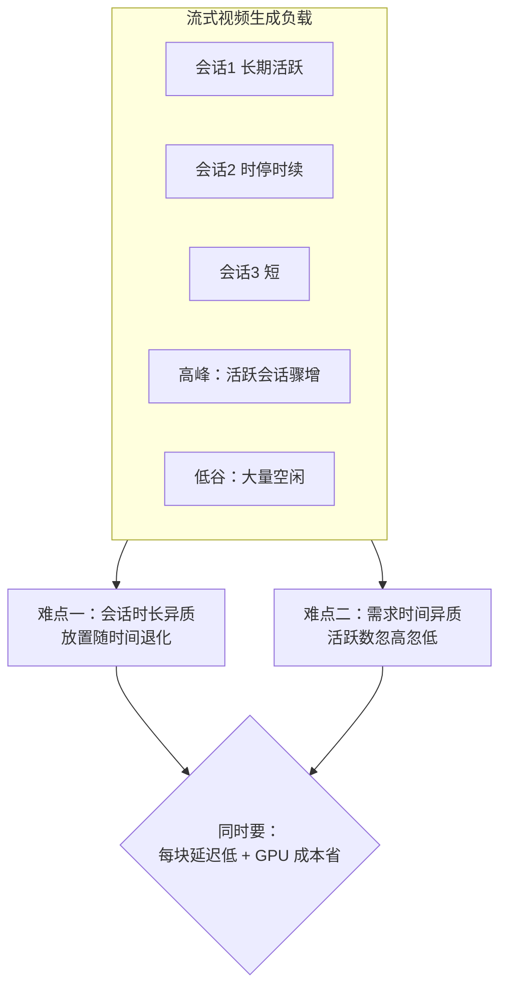
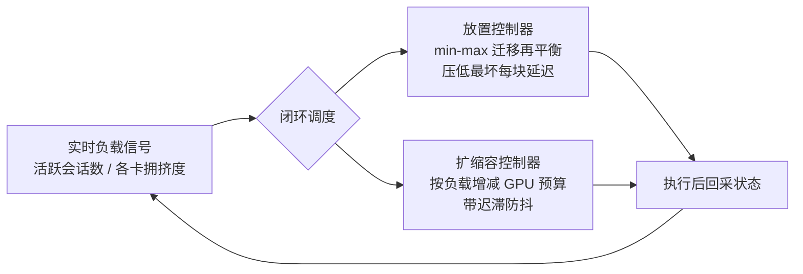
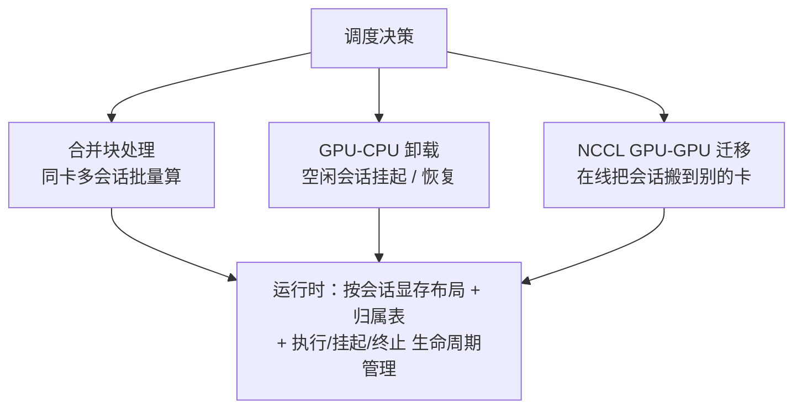

# TurboServe：为「边生成边看」的流式视频生成，搭一套又快又省的在线调度服务系统

> **原题**：TurboServe: Serving Streaming Video Generation Efficiently and Economically
> **作者**：Haoxu Wang, Haotong Bao, Kai Jiang, Jianfei Chen, Jun Zhu, Fangcheng Fu, Jintao Zhang（通讯作者）
> **机构**：上海交通大学、生数科技（Shengshu）、清华大学
> **年份**：2026（arxiv ID 2606.19271）
> **分类**：cs.DC（分布式与并行计算） / cs.LG
> **链接**：https://arxiv.org/abs/2606.19271
> **代码**：https://github.com/shengshu-ai/TurboServe
> **精读日期**：2026-07-02

---

## 阅读须知

### 这篇在领域里的位置

前几年模型服务（serving）这门学问，主要是围着两类负载打转：一类是离线的视频生成，你提交一个提示，等上一阵，拿回一整段视频；一类是大语言模型的在线服务，一个请求进来，模型把答案一段段吐出来，讲究的是吞吐和排队。这两类都有相对成熟的系统方案。但最近冒出来一种新的负载，叫流式视频生成，它跟前两类都不一样：用户是在一个长时间存活的会话里，和模型持续互动，视频是一块一块（chunk by chunk）逐步生成出来的，边生成边看，中间还可能有停顿和继续。

这种负载给服务系统出了新难题。它要在会话活跃和空闲之间一直保存住会话状态，要反复地重新调度那些还没结束的会话，还要保证每一块视频都在很紧的延迟目标内交付。TurboServe 就是冲着这个空白来的，论文自称是第一个专门为流式视频生成负载设计的服务系统。它值得一读，是因为它不提新模型，而是回答一个非常工程、也非常现实的问题：当很多人同时在多张 GPU 上跑这种长会话、时快时慢的视频生成时，怎么把每块视频的最坏延迟压下去，同时又不让 GPU 的账单失控。

### 读完能回答什么

读完这份笔记之后，你应当能回答下面这几个问题：

1. 流式视频生成的服务，和离线视频生成、以及普通的大语言模型在线服务，到底难在哪几处不一样。
2. 论文说的两种「异质性」，会话时长异质性和用户需求的时间异质性，分别会把系统坑在什么地方。
3. TurboServe 的闭环调度是怎么同时管「会话摆在哪张卡上」和「一共开几张卡」这两件事的。
4. 它靠哪几样运行时机制把调度决策落地，最终把延迟和成本各压下去了多少。

### 阅读前置

这份笔记假定你大致了解 GPU 集群上跑深度学习负载是怎么回事，知道「吞吐」「延迟」「批处理」这些服务领域的基本概念。不预设你做过系统或调度：凡是涉及会话迁移、自动扩缩容、显存卸载、NCCL 通信这些词，都会在第一次出现时先用一两句话讲清楚它要解决什么，再展开。

### 首次出现的缩写表

- **服务 / 服务系统**（Serving / Serving System）：把训练好的模型部署起来、面向多用户实时提供推理的那一层基础设施。
- **会话**（Session）：一个用户与模型的长时间互动过程，在流式视频生成里，一个会话会持续地一块块产出视频。
- **块**（Chunk）：视频被切成的一小段，是流式生成里交付和计时的基本单位。
- **放置 / 迁移**（Placement / Migration）：把某个会话安排在哪张 GPU 上叫放置；运行中把它从一张卡挪到另一张卡叫迁移。
- **自动扩缩容**（Autoscaling）：根据负载多少，动态地增减投入的 GPU 数量，忙时多开、闲时收回。
- **卸载**（Offloading）：把暂时用不到的会话状态从 GPU 显存挪到 CPU 内存暂存，腾出显存，需要时再挪回来。
- **NCCL**（NVIDIA Collective Communications Library）：英伟达的多卡通信库，这里用来在 GPU 之间高速搬运会话状态。

## 为什么这个问题值得做

先设身处地想一想服务方的处境。假设你运营一个能实时生成视频的产品，很多用户同时在用，每个人都开着一个会话，让画面一段段生成下去。有的人一开就是很久，中间还时不时停下来想一想再继续；有的时段涌进来一大批人，有的时段又冷冷清清。你手上有一批 GPU，既要保证每个人看到的每一小段视频都足够快地蹦出来，又不想为了应付偶尔的高峰，长年累月养着一大堆空转的卡烧钱。

这件事难就难在两种「不齐整」。第一种是会话时长的不齐整：会话有长有短，一个当初被安排得挺合理的放置，随着短会话纷纷结束、长会话继续赖着，慢慢就变得不均衡了，某些卡越来越挤，另一些越来越空。第二种是用户需求随时间的不齐整：活跃会话的数目会在爆发和空闲之间剧烈跳动，你按高峰配卡就浪费，按低谷配卡就在高峰时卡顿。这两种不齐整叠在一起，让「延迟低」和「成本省」变成一对天生打架的目标。

现有的服务系统之所以不够用，是因为它们大多是为「请求来了、处理完就走」的短生命负载设计的，没有专门去处理这种长会话、要保状态、还要反复重排的形态。TurboServe 的价值，就在于把这个被忽略的新负载正面接了下来，并给出一套能同时兼顾延迟与成本的调度办法。

## 一、问题

把问题收紧成一句技术陈述：在一个多用户、多 GPU 的环境里，面对一批长时间存活、逐块生成、活跃度随时间剧烈波动的视频会话，如何在线地决定「每个会话此刻该放在哪张 GPU 上」以及「此刻一共该开多少张 GPU」，使得每一块视频的最坏延迟尽可能低，同时 GPU 的运行成本尽可能省。

这个问题的两个难点，前面已经点了名。会话时长异质性，指的是长短不一的会话会让当初的放置随时间退化，需要不断重新平衡；用户需求的时间异质性，指的是活跃会话数忽高忽低，需要动态地增减 GPU。前者对应「怎么摆」，后者对应「开几张」，而这两件事又互相牵扯：你要迁移会话去平衡负载，迁移本身有代价；你要缩容省钱，缩过头了高峰一来就崩。把这两个决策割裂开各管各的，很难得到全局上又快又省的结果。

正因如此，TurboServe 的核心主张是把放置和扩缩容放进一个闭环里联合协调，而不是当成两件孤立的事。

## 二、方法

TurboServe 把服务问题形式化成一个在线调度问题，由一套闭环调度算法来解，这套算法同时协调两件事：会话怎么放，GPU 开几张。

第一个部件是感知迁移的放置控制器（migration-aware placement controller）。它做的是一种最小化最大值（min-max）意义上的再平衡：当某些 GPU 因为长会话堆积而变得拥挤、拖高了那张卡上每块视频的延迟时，它就把一部分会话迁移到别的卡上，让「最忙那张卡的每块延迟」尽量降下来。因为服务质量往往取决于最坏的那一个，所以压低最大值比压低平均值更贴近用户的真实体验。

第二个部件是负载驱动的自动扩缩容控制器（load-driven autoscaling controller）。它按当前负载的高低，成比例地调整投入的 GPU 预算，忙时多开、闲时收回，并带有迟滞（hysteresis）设计，也就是不因为负载一点点抖动就频繁地开关卡，避免在临界点上反复横跳。它追求的是在满足延迟约束的前提下，把成本压到尽量低。

光有决策还不够，要让这些决策在运行时真正跑得起来，TurboServe 配了三样底层机制。其一是合并块处理（coalesced chunk processing），把同一张 GPU 上多个并发活跃会话的块放到一起批量处理，提高利用率。其二是 GPU 与 CPU 之间的卸载（offloading），当一个会话进入空闲，就把它的状态从显存挪到 CPU 内存暂存挂起，需要恢复时再挪回来，从而把宝贵的显存让给正在活跃的会话。其三是基于 NCCL 的 GPU 间迁移（GPU-GPU migration），当放置控制器决定要把某个会话从一张卡挪到另一张卡时，靠 NCCL 这个高速通信库在线地把会话状态搬过去，实现运行中的再平衡。为支撑这些操作，系统还维护了带归属表的按会话显存布局，以及执行、挂起、终止等会话生命周期的状态管理。

## 三、实验

评测用的是生数科技真实生产环境里的负载轨迹，覆盖多种模型规模，硬件上从十六张英伟达 H20 的小集群，一直到六十四张英伟达 B300 的大集群，模型是 LongLive 一类的流式视频生成模型，规模从十三亿参数起。对照的基线包括轮询分配加先到先服务的朴素做法，以及把新激活会话分给「负载最轻」或「显存占用最低」那张卡的两种贪心策略。

端到端的结果相当扎实。在把 GPU 成本对齐的前提下比延迟，TurboServe 把最坏情况下每块视频的延迟平均降低了百分之三十七点五，最多能降百分之五十一点六；反过来，在把延迟约束对齐的前提下比成本，它把 GPU 的运行成本平均降低了百分之三十七点二，最多能省百分之四十九。也就是说，无论你是想在同样的花费下把体验做得更稳，还是想在同样的体验下把账单压得更低，这套系统都能挤出三分之一以上的空间。

消融实验把两个控制器各自的贡献坐实了。把迁移关掉，平均成本上升百分之十五，最多上升百分之二十八；把自动扩缩容关掉，代价更大，平均成本上升百分之四十二点九，最多上升百分之八十点四。可见在这类负载里，能不能随负载动态地增减 GPU，是省钱的第一大杠杆，而在卡之间迁移会话来平衡，则是第二道保险。

| 维度 | 结果 |
| --- | --- |
| 最坏每块延迟（成本对齐） | 平均降 37.5%，最多降 51.6% |
| GPU 运行成本（延迟对齐） | 平均降 37.2%，最多降 49.0% |
| 去掉迁移 | 成本平均升 15.0%，最多升 28.0% |
| 去掉自动扩缩容 | 成本平均升 42.9%，最多升 80.4% |

调度本身的质量与开销也交代得很清楚。放置的再平衡算法，得到的解与穷举得到的最优解平均只差百分之三点六，最多差百分之六点五，而速度比穷举搜索快十倍；自动扩缩容的成本，也落在离线最优方案的百分之六点一以内。开销方面，调度在六十四卡集群上只需十五毫秒，不到每块延迟的百分之二，即便扩到二百五十六卡也只要零点一秒；单次迁移的开销约二十三到三十毫秒，占每块延迟的百分之二到三，且在 H20 与 B300 两种卡上表现一致。这些数字说明，这套调度的收益远远盖过了它自身引入的那点代价。

## 四、局限

先说读完能看出来的适用边界。第一，整套系统是紧贴流式视频生成这一种负载设计的，评测也用的是 LongLive 一类模型，它对其他形态负载的迁移性，论文并未展开，未必能直接照搬。第二，用来评测的生产轨迹全部来自生数科技一家，虽然是真实数据，但会话时长与爆发模式的分布是否具有普遍代表性，还需要更多来源的轨迹来验证。

再说几处工程上天然的权衡。其一，会话迁移之所以可行，前提是靠 NCCL 在卡间搬状态足够便宜，这一点与集群的网络拓扑和互联带宽强相关，换一套硬件环境，迁移开销的比例可能变化。其二，自动扩缩容的迟滞设计是在「响应够快」和「不要频繁开关卡抖动」之间取的折中，这个折中点调得好不好，直接影响收益，论文报告的是它调得不错时的结果。其三，这套方法的红利，很大程度上来自负载本身的异质性够高；如果实际负载相当均匀、活跃度平稳，迁移与扩缩容能挤出的空间就会相应变小。最后，二百五十六卡那一档主要是用来测调度耗时的微基准，端到端的完整评测做到六十四卡，更大规模上的整体表现仍有待观察。

## 一句话

针对「边生成边看」的流式视频生成这一新型服务负载，用一套把会话迁移放置和 GPU 自动扩缩容联合起来的闭环在线调度，再配上合并批处理、显存卸载和 NCCL 迁移三样运行时机制，在真实生产轨迹上把最坏每块延迟和 GPU 成本各压下约三成七。
