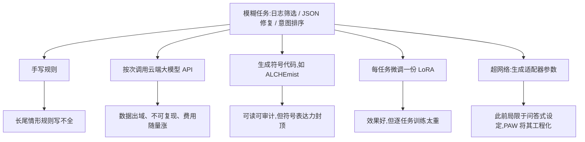
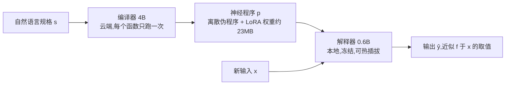
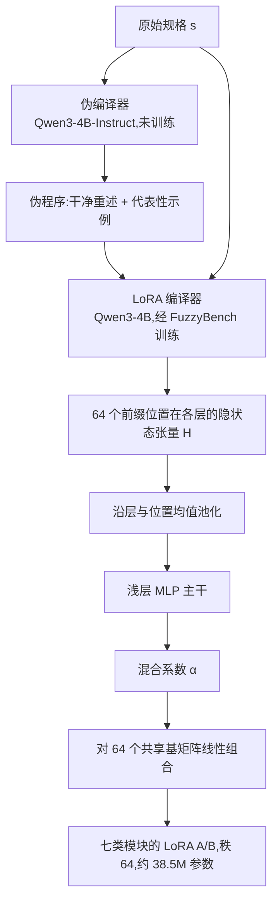

# 程序即权重:面向模糊函数的编程范式

> **原题**:Program-as-Weights: A Programming Paradigm for Fuzzy Functions
> **作者**:Wentao Zhang, Liliana Hotsko, Woojeong Kim, Pengyu Nie, Stuart Shieber, Yuntian Deng
> **机构**:滑铁卢大学、哈佛大学
> **年份**:2026(arXiv ID 2607.02512)
> **分类**:cs.LG / cs.AI / cs.CL
> **链接**:https://arxiv.org/abs/2607.02512
> **精读日期**:2026-07-03

## 阅读须知

**这篇在领域里的位置。** 这篇论文属于「用一个模型去生成另一个模型的参数」这一支工作,学界一般称之为超网络(hypernetwork)路线。过去几年这条路线大多停留在研究性的设定里:给定若干问答上下文,生成一份适配器参数,在学术基准上验证可行性,代表工作有 Hypter、HyperTuning 与 Text-to-LoRA。与此同时,业界解决「模糊任务」的主流做法却是另一条完全不同的路,即把任务措辞成提示词,按次调用云端大模型 API。这篇论文做的事情,是把超网络路线第一次包装成一个面向开发者的编程范式:自然语言写规格,云端编译一次,产物是一个几十 MB 的「神经程序」,在本地一个冻结的 0.6B 小模型上反复执行。它的贡献与其说是某个单点技术,不如说是把「编译器、程序、解释器」这套编程语言的概念框架完整地移植到了神经网络上,并用一个千万级样本的数据集把它训练到了可用的程度。

**读完能回答什么。** 读完这份笔记,应当能回答下面几个问题:第一,什么是模糊函数,为什么它既不适合手写规则,也不值得每次都调大模型 API;第二,PAW 的编译器如何在一次前向计算里产出另一个模型的 LoRA 权重,mapper 的共享基设计是怎么回事;第三,为什么要分两级编译,先产出伪程序再产出权重,这一步与规格噪声的鲁棒性有什么关系;第四,0.6B 的解释器凭什么在 FuzzyBench 上超过 32B 模型的直接提示,而在经典分类数据集上又为什么仍然略逊;第五,这套范式目前的适用边界在哪里。

**阅读前置。** 假定读者熟悉 Transformer 的基本结构,知道 LoRA 这类参数高效微调方法的大致原理,也用过按次计费的大模型 API;不预设读者接触过超网络或程序合成方向的文献。

**首次出现的缩写表。**

- **PAW**(Program-as-Weights):本文提出的范式与系统,把自然语言规格编译成神经网络权重形式的「程序」。
- **PEFT**(Parameter-Efficient Fine-Tuning,参数高效微调):只训练或注入少量参数来适配大模型的一族方法,LoRA 与前缀微调都属于此类。
- **LoRA**(Low-Rank Adaptation,低秩适配):PEFT 中最常用的一种,给权重矩阵加一对低秩矩阵 A、B 作为可训练的增量。
- **前缀微调**(prefix-tuning):另一种 PEFT,把可训练的虚拟 token 前置到注意力的键值缓存里,本文的早期版本用的是它。
- **SFT**(Supervised Fine-Tuning,监督微调):用带标准答案的输入输出对做的常规微调训练。
- **FuzzyBench**:作者构建的一千万样本数据集,既是训练集也是主要评测基准。
- **ALCHEmist**:一条对比路线的代表工作,让语言模型把任务蒸馏成符号化的 Python 代码。

## 一、问题

先说这个问题为什么值得做。软件工程里有一大类任务,人看一眼就知道该怎么办,却怎么也写不成干净的规则:从滚动的日志里挑出真正要紧的那几行,把格式残缺的 JSON 修复成合法结构,按用户意图给搜索结果重新排序,给邮件分拣轻重缓急。作者把这一类称为模糊函数(fuzzy function):输入输出关系对人类直觉透明,对符号规则却始终差一层。传统写法是堆正则与 if-else,堆到长尾处必然崩坏;于是近几年开发者的实际做法,是把这类函数外包给云端大模型,每一次调用都把数据发出去、按 token 付费。这样做换来了效果,代价却是三样实实在在的东西:数据出域带来的本地性丧失,同一输入不保证同一输出的不可复现性,以及随调用量线性增长的费用。

这篇论文要解决的技术问题因此可以陈述得很具体:能否把一段自然语言写成的模糊函数规格 s,一次性地转换成某种紧凑、可本地执行、可版本化分发的产物 p,使得一个冻结的小模型拿着 p 处理新输入 x 时,行为近似于人们期望的函数 f(x)。用论文自己的记号,就是 p = Compiler(s),ŷ = Interpreter(p, x) ≈ f(x)。

在它之前,这个问题上已经有几条路线各自走了一段。第一条是让大模型把任务写成符号代码,代表是 ALCHEmist:产物可读可审计,但表达力被符号系统封顶,恰恰在「模糊」的那一部分上不够用。第二条是每个任务单独微调一份 LoRA:效果扎实,但每新增一个任务就要准备数据、跑一遍梯度训练,对「开发者随手定义一个函数」这种使用节奏来说太重。第三条就是前面说的按次调用 API,问题已经列过。与这三条相比,超网络路线理论上最贴合需求,即训练一个网络直接生成适配器参数,免去逐任务训练;只是此前的工作要么产物是纯连续参数、缺少可读的部分,要么训练分布局限在问答式上下文,离开发者真实会写的那种规格很远。PAW 接的正是这一棒。

## 二、方法

整个系统由三个角色组成,对应编程语言里的编译器、程序与解释器。编译器是一个 4B 参数的模型,部署在云端,对每个函数定义只运行一次;它的输出是一个混合形态的「程序」,由两部分构成,一部分是离散的伪程序文本,另一部分是连续的 LoRA 参数,量化后约 23MB。解释器则是一个完全冻结的 0.6B 小模型,跑在用户本地;执行一个程序的方式是把 LoRA 挂载到指定模块上,把伪程序文本前置到输入前面,然后照常自回归生成。之所以强调解释器冻结且可热插拔,是因为这样一台解释器可以服务任意多个程序:换函数只需换一份 23MB 的适配器,底座不动。

编译器内部又分两级。第一级叫伪编译器,用的是一个未经任何训练的 Qwen3-4B-Instruct,只靠提示词模板工作:它把开发者写的原始规格重述成一段干净的任务描述,并补出几个有代表性的输入输出示例,合称伪程序。这一级的存在有明确的目的,即把原始规格里的错字、口语化措辞与含糊表述挡在后续流程之外,后面的实验会专门验证这层「防噪」作用。第二级叫 LoRA 编译器,是一个在 FuzzyBench 上训练过的 Qwen3-4B:它读入规格与伪程序的拼接,末尾再接上 64 个可学习的前缀 token,然后把这 64 个位置在各层的隐状态取出来,堆成一个张量 H,交给一个称为 mapper 的小网络去转换成真正的 LoRA 权重。

mapper 的设计是全文技术上最值得记住的一处。它并不直接回归出千万级的权重数值,而是先把 H 沿层与位置两个维度做均值池化,得到一个向量,再经过一个浅层 MLP,输出一组混合系数 α;真正的 LoRA 矩阵是用这组系数对 64 个全体函数共享的基矩阵做线性组合得到的。换句话说,所有模糊函数的 LoRA 都住在同一个 64 维的基空间里,编译一个新函数只是在这个空间里选一个点。生成的 LoRA 秩为 64,覆盖解释器所有层的注意力 q、k、v、o 与 MLP 的 gate、up、down 全部七类模块,合计约 38.5M 参数。消融实验给了一个反直觉的结论:这个「均值池化加共享基」的最简设计,好过每层独立基、按位置聚合等一切更有表达力的变体,后文实验一节再展开。

训练只针对第二级:伪编译器与解释器自始至终冻结,可训练的只有 LoRA 编译器与 mapper 的参数 θ。目标函数是端到端的:从数据集中采样规格 s 与输入输出对 (x, y),把编译出来的伪程序与 LoRA 装进解释器,对 y 计算负对数似然,梯度一路穿过冻结的解释器回到 θ。这样训练出来的编译器,优化的从头到尾都是「它生成的程序在解释器上跑得对不对」,而不是任何权重层面的中间指标。

支撑这一切的数据集 FuzzyBench 本身也是论文的主要贡献之一。它共有一千万个样本,横跨八百多个任务类别,归入七个大族:核心文本处理、网页理解、代码与命令生成、智能体工具调用、安全校验、解析与格式转换、模糊匹配与排序。构建方式是两级生成:先让 gpt-5.2 在类别约束下批量产出自然语言规格,再对每个规格产出八组输入输出对。数据按规格划分成 80/10/10,测试集的规格在训练时完全未见,这一点决定了后面所有数字衡量的都是「对新函数定义的泛化」。测试集另做了一层核验,要求 gpt-5.2 与独立的 gpt-5-mini 对答案取得一致才保留,以剔除任务本身含糊的样本;此外还造了拼写、语法、含糊、格式等八个噪声轴、每轴三档强度的规格变体,专门用来测鲁棒性。

## 三、实验

主基准就是 FuzzyBench 的核验测试集,指标为精确匹配。主结果如下表,作为参照,生成数据的 gpt-5.2 自己能到 96.09%,可视作这套数据的上限。

| 方法 | FuzzyBench | 解释器规模 | 推理显存 |
| --- | --- | --- | --- |
| gpt-5.2(API,数据生成方,视作上限) | 96.09% | 不适用 | 不适用 |
| Qwen3-32B 直接提示 | 68.70% | 32B | 约 60GB(bf16) |
| **PAW,解释器 Qwen3-0.6B** | **73.78%** | **0.6B** | **约 1.2GB(bf16)** |
| PAW,解释器 Qwen3.5-0.8B | 67.29% | 0.8B | - |
| PAW,解释器 GPT-2 124M | 54.39% | 124M | - |

核心数字就是第一行与第三行的对照:0.6B 的解释器带着编译出来的权重,比 32B 模型的直接提示高出 5 个百分点,显存却只有约五十分之一。与「不用编译器」的适配方式相比差距更大:在同一设定下,固定训练一份秩 64 的 LoRA 只有 52.10%,全参数微调也只有 58.40%,PAW 领先最强者约 21.7 个百分点。这个差距的来源值得想清楚:测试规格是训练时未见的,固定的 LoRA 或全参微调学到的是一份对所有任务折中的参数,而 PAW 为每个规格现场生成一份专属参数,泛化的单位从「任务集合」变成了「单个函数」。

不过论文没有回避另一面:在 YouTube、SMS、Yelp、IMDB 这些经典分类数据集上,PAW 略低于 32B 直接提示,例如 YouTube 上 90.40% 对 93.60%,SMS 的 F1 为 80.77% 对 89.04%。也就是说 PAW 的优势集中在它所定义的模糊函数分布上,还谈不上全面胜过大模型提示。

鲁棒性实验回应了两级编译的设计动机。规格从干净换到重度噪声,PAW 的准确率只从 66.92% 降到 63.26%;而消融显示,如果跳过伪编译器、把原始规格直接喂给 LoRA 编译器,在重度拼写噪声下会掉到 56.62%,比走伪程序的 61.08% 低 4.5 个百分点。伪程序这一层确实起到了「把脏规格洗干净再编译」的作用。

消融里最反直觉的结果出在 mapper 上:默认的均值池化加共享基设计得分 0.6223,给每层配独立基降到 0.6028,再按位置细化聚合更是降到 0.5559。表达力越强,效果越差。一个合理的解读是,编译器单次前向能可靠提取的信息量有限,参数化越铺张,越是在这个有限信号上过拟合。另有两组结果佐证范式的可扩展性:把编译器换成 Qwen3-VL-4B、解释器不动,图像任务(电路图、化学式、乐谱转写)上即超过基线,只有长输出的 Im2LaTeX 因上下文预算受限而更差;做本地部署方向的量化后,底座 IQ4_XS 加适配器 Q4_0 的组合总共 430MB,准确率与 bf16 相比只差约 1 个百分点,在 MacBook M3 上跑到 31.6 token 每秒,冷启动 0.48 秒。

## 四、局限

作者自己承认的边界有五条。其一,编译器与 PEFT 方法是绑定的,给前缀微调训练的编译器不能直接给 LoRA 用,换一种适配格式就要重训一个编译器。其二,编译产物是黑盒,离散伪程序虽可读,真正承载行为的那 38.5M 连续参数无法解释。其三,当前系统只处理单步的输入到输出映射,多步推理与智能体循环不在覆盖范围内。其四,FuzzyBench 完全由 gpt-5.2 合成,与真实开发者写的规格之间可能存在分布差距。其五,不同任务可能各自偏好不同的 PEFT 方法,系统不提供自动选择。

读完还能看出几处论文没有明说的问题。评测与训练数据同源,核验也依赖 gpt-5 系列自家模型,「73.78% 对 68.70%」这组核心对照建立在一个由更强模型定义了标准答案的分布上,换到人工标注的真实模糊任务上优势能保留多少,论文里没有直接证据;经典数据集上的落后已经提示了这一点。其次,编译这一步本身仍需要在 GPU 上跑一个 4B 模型,「本地化」成立的前提是函数定义得足够少、执行得足够多,对规格频繁迭代的开发流程,一次一编译的成本与延迟还需要单独核算。最后,精确匹配这个指标偏爱格式规整的短输出,对生成式、开放式的模糊函数,这套评测未必能反映真实可用性。

## 一句话

把自然语言规格一次性编译成小模型的 LoRA 权重,0.6B 本地解释器以约五十分之一的显存,在模糊函数基准上超过 32B 直接提示。
