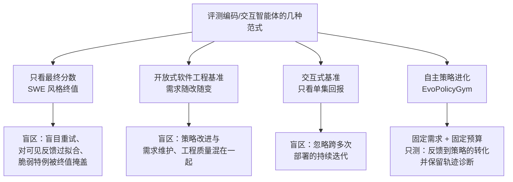
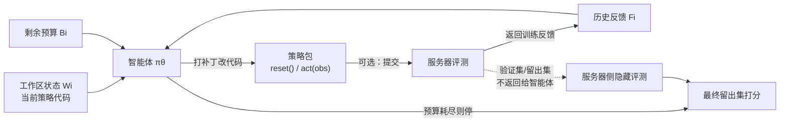
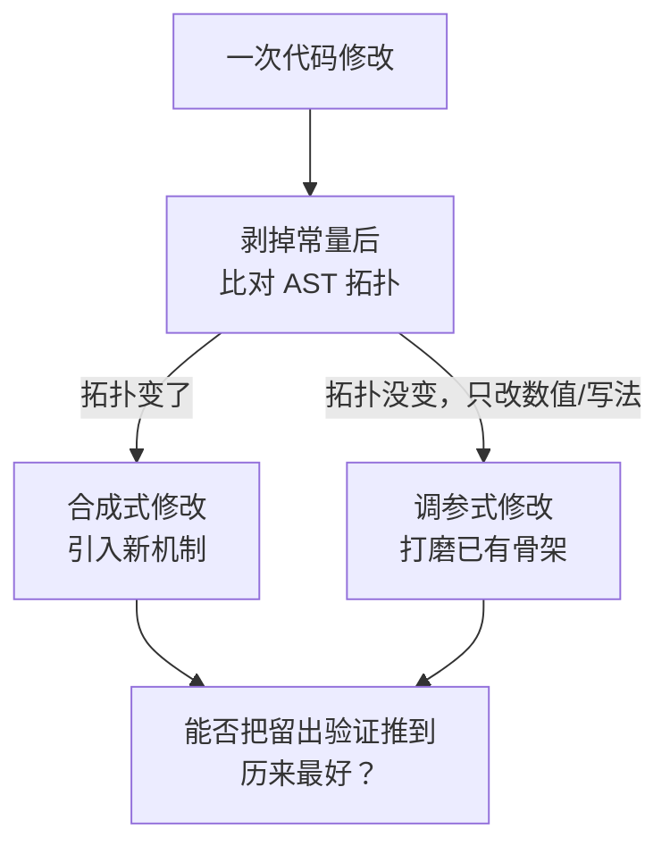

# EvoPolicyGym：在交互式环境里评测智能体的自主策略进化

> **原题**：EvoPolicyGym: Evaluating Autonomous Policy Evolution in Interactive Environments
> **作者**：Zhilin Wang, Han Song, Runzhe Zhan, Jusen Du, Jiacheng Chen, Tianle Li, Qingyu Yin, Yulun Wu, Zhennan Shen, Tong Zhu, Yanshu Li, Guanjie Chen, Derek F. Wong, Yafu Li, Yu Cheng, Yang Yang
> **机构**：论文抓取页面未标注（作者含 Derek F. Wong、Yu Cheng 等）
> **年份**：2026（arxiv ID 2607.02440，7 月 2 日提交）
> **分类**：cs.AI / cs.CL
> **链接**：https://arxiv.org/abs/2607.02440
> **精读日期**：2026-07-04

## 阅读须知

**这篇在领域里的位置。** 过去两年，用大语言模型驱动的编码智能体（coding agent）已经从「一次性写完一段代码」走向了「反复改进一个持续运行的系统」。与此对应，评测这些智能体的方式也在演变。最早的一批评测把智能体扔进一个软件工程任务里，只看它最终有没有把测试跑通，代表是各种 SWE 风格的基准；稍晚一些的交互式基准让智能体在一个环境里一集一集地行动，看它能拿到多少回报。这篇论文属于「评测方法学」这一支，它既不提出新的模型，也不提出新的训练算法，而是指出上述两类评测都漏掉了一件真正困难的事：给定有限的反馈预算，智能体能不能持续地把一个可执行的策略越改越好。它把这件事单独拎出来，命名为「自主策略进化」（Autonomous Policy Evolution），并造了一个叫 EvoPolicyGym 的基准去量它。

**读完这份笔记，应当能回答：**

- 为什么「只看最终分数」的评测会掩盖智能体的真实能力，它具体掩盖了哪些失败模式
- 「自主策略进化」这个设定和普通的强化学习、以及和 SWE 风格的软件工程评测，边界分别划在哪里
- EvoPolicyGym 里，一个智能体在一次迭代里到底做了什么，它的固定预算是怎么定义的
- 论文用什么指标把四个模型排出高下，为什么用「排名分」而不是直接比原始回报
- 「合成式修改」与「调参式修改」这对区分是怎么定义的，它为什么能把强模型和弱模型分开

**阅读前置。** 假定读者熟悉大语言模型智能体的基本运作方式，也大致知道强化学习里「环境、动作、回报」这套概念，但未必专门做过策略优化，也未必读过 Gym、MuJoCo 这些经典环境的接口。凡是涉及具体环境名或具体指标的地方，本文都会先铺垫再展开。

**首次出现的缩写表：**

- **RL**（Reinforcement Learning，强化学习）：智能体在环境里反复试错、靠回报信号学习行为的范式。
- **策略**（policy）：从观测到动作的映射。本文里它不是一组神经网络权重，而是一段可执行的 Python 代码。
- **harness**（承载框架）：把大语言模型接进一个可以读写文件、运行命令的工作区的外壳，例如 Codex、Claude Code。
- **AST**（Abstract Syntax Tree，抽象语法树）：代码在语法层面的结构化表示，本文用它来判断两次修改是不是改动了程序的骨架。
- **Core16**：本文的核心环境套件，由 16 个交互式环境组成，是主结果的基准盘。
- **best-so-far**（历来最好）：在一条轨迹里，到目前为止在留出验证集上取得过的最好成绩。
- **held-out / validation**（留出集 / 验证集）：智能体看不到的那部分评测，用来防止它对可见反馈过拟合。

## 正文

一个编码智能体在真实生产环境里的价值，往往不体现在它第一次写出的代码有多好，而体现在它拿到反馈之后能不能持续地把系统改得更好。换句话说，人们真正想要的，是一个能在预算有限的条件下，把环境给的反馈转化成策略实质进步的智能体。可眼下评测这类智能体的办法，几乎都在这一点上失焦。

第一种办法只记录最终分数。它的问题在于，一个漂亮的终值可以掩盖沿途一切难看的过程：智能体可能只是在盲目重试，可能对看得见的反馈过拟合，可能靠若干脆而不稳的特例把分数堆上去，也可能根本没做验证就提交了。终值把这些轨迹层面的失败模式全都抹平了。第二种办法借用软件工程基准，让智能体在一个开放式的工程任务里持续改进。它的问题在于，「把策略改好」这件事被「维护一份不断变化的需求说明」和「保持工程质量」搅在了一起，无法单独度量。第三种办法是交互式基准，让智能体一集一集地和环境打交道，但它通常只看单集表现，忽略了智能体如何在反复部署之间迭代改进同一份持续存在的策略。

于是这篇论文要解决的问题就清晰了：造一个评测设定，把「在有限反馈下持续改进一份可执行策略」这件事从其余因素里剥离出来，同时保留那些让自主改进真正困难的迭代决策，并且允许我们在轨迹层面做诊断，而不是只拿到一个终值。

### 一、问题

先把「自主策略进化」这个设定的边界划清楚。它指的是这样一种受控评测：一个由承载框架加模型组成的智能体，在固定的交互预算之下，反复地编辑一套可执行的策略系统。这里被度量的核心能力，是智能体能不能把有限的环境反馈，转化成对一份可执行策略的、可泛化的改进。

这个设定和几条相邻的路线，差别都在一处细微但关键的地方。它和普通强化学习的差别在于，改动策略的不是梯度下降，而是智能体去改写代码；它和 SWE 风格软件工程评测的差别在于，任务的需求说明是固定的，不存在「一边改代码一边改需求」的混淆；它和一般交互式基准的差别在于，它关心的是跨多次提交的持续改进，而不是单集回报。这几条路线的关系可以用下面这张图来对照。

值得强调的是，这套设定之所以有意义，是因为它复现了自主改进里最难的那一部分决策。智能体每一步都要在几件事之间权衡：是继续读上一次提交的反馈，还是动手改代码；是把剩下的预算花在探索新机制上，还是花在打磨已有参数上；是现在就提交拿一次评测，还是再攒一攒。终值评测把这些决策全部隐去，而这篇论文要做的恰恰是把它们重新暴露出来。

### 二、方法

整个方法可以先从一次迭代里智能体到底看见什么、做什么讲起。

在第 i 次迭代，智能体 πθ 观测到三样东西。第一样是工作区状态 Wi，也就是当前那份策略代码连同它周边的辅助文件。第二样是此前提交换来的反馈 Fi，这是服务器在训练评测上返回的信号。第三样是剩余预算 Bi，它告诉智能体还能再花多少次交互。看过这三样之后，智能体给工作区打一个补丁，也就是改代码；它可以选择把当前这版提交上去做一次训练评测，也可以选择先不提交、继续改。一旦提交，服务器就返回训练反馈。这个循环一直进行，直到预算耗尽。

这里的预算是硬约束：每个环境固定给 128 集。需要分清楚的是，训练反馈是智能体看得见的，而验证集和最终的留出集评测始终留在服务器一侧，智能体看不到。之所以这样设计，是为了防止智能体对着可见信号过拟合，把「在看得见的地方刷高分」误当成「策略真的变好了」。

那份被反复编辑的「策略系统」到底长什么样？它是一个可执行的 Python 策略包，对外暴露两个接口：在每一集开始时调用的 reset()，以及在每一步根据观测给出动作的 act(obs)，策略的内部状态就藏在这两个接口背后。智能体可以在这个包里自由添加辅助模块、常量、控制器、诊断代码，甚至学出来的参数。整个交互循环如下图。

有了每个环境上的成绩，还需要一个能把不同环境、不同量纲的回报汇到一起的指标。论文没有直接平均原始回报，而是先在每个环境里排名，再把排名折算成分数。对环境 e，模型 m 的分数定义为：

s(m, e) = 1 − ( rank_e(m) − 1 ) / ( N_e − 1 )

这里 rank_e(m) 是模型 m 在环境 e 上的名次，N_e = 5，因为每个环境里有四个被测智能体外加一个随机策略作参照。排第一名得 1 分，排最后一名得 0 分。把这些单环境分数按类别做宏平均，就得到类别分；把 16 个环境一起做宏平均，就得到 Core16 总分。之所以用排名分而不是原始回报，是因为这样奖励的是「在整套环境上稳定地接近榜首」，而不是「在个别任务上侥幸爆一个高分」。

方法里最有洞察力的一环，是它不满足于给出总分，还在轨迹层面做诊断。其中最关键的一项，是把智能体的每一次代码修改分成两类。一类叫合成式修改（synthesis edit）：把代码里的常量剥掉之后，抽象语法树的拓扑结构变了，说明智能体动的是程序的骨架，引入了新的机制。另一类叫调参式修改（parametric edit）：拓扑结构没变，只是源代码里的数值或写法变了，说明智能体只是在原有骨架上打磨参数。这一分类，加上「历来最好」验证曲线、策略复杂度统计（函数、分支、循环、状态变量的数量）、以及把代码修订和可见反馈对齐的时间线，共同构成了这套诊断。它的判别逻辑如下。

### 三、实验

评测盘 Core16 由 16 个交互式环境组成，按来源分成四个家族，每族四个。第一族是 Gym 与 Box2D 里的经典控制与像素任务，包含 Acrobot-v1、MountainCarContinuous-v0、BipedalWalker-v3、CarRacing-v3。第二族是 MuJoCo 的连续控制，包含 Reacher-v5、HalfCheetah-v5、Ant-v5、Pusher-v5。第三族是 MiniGrid 的符号化导航与规划，包含 DoorKey-16x16、KeyCorridorS4R3、FourRooms、ObstructedMaze-1Q。第四族是机器人与驾驶，包含 parking、roundabout、FetchPush、FetchPickAndPlace。这四族在感知与决策上的侧重很不一样，像素与符号规划任务更吃「发明新机制」，而低维连续控制更吃「把参数调准」。

被测的智能体一共四个，都各自套在合适的承载框架里：GPT-5.5 跑在 Codex 框架上，Claude Opus 4.7 跑在 Claude Code 框架上，MiniMax-M3 与 DeepSeek-V4-Pro 也跑在 Claude Code 框架上；此外再放一个均匀随机策略作参照。主结果如下表。

| 模型 | Core16 总分 | 夺魁环境数 | 进入前二的环境数 |
|---|---|---|---|
| GPT-5.5 | 0.891 | 9 | 16 |
| Claude Opus 4.7 | 0.750 | 5 | 12 |
| MiniMax-M3 | 0.531 | 1 | 3 |
| DeepSeek-V4-Pro | 0.359 | 1 | 1 |
| 随机策略 | 0.109 | 0 | 0 |

这张表里最醒目的一条，是 GPT-5.5 在全部 16 个环境上都进了前二，是唯一做到这一点的智能体，它在 Gym/Box2D、MuJoCo、机器人与驾驶三个家族上都领先。与之相对，Claude Opus 4.7 在 MiniGrid 这个偏符号规划的家族上最强，家族分达到 0.938，并在 ContinuousCar、Ant、KeyCorridor、FourRooms、ObstructedMaze 这几个环境上夺魁。换句话说，两个第一梯队的模型各有所长，GPT-5.5 胜在全面稳定，Opus 4.7 胜在符号规划这类需要发明机制的任务。

真正把强弱分层讲透的，是合成式与调参式那一组诊断。在偏「发明新机制」的合成主导任务上，一次成功的合成式修改能把留出验证推到历来最好的比率，四个模型分别是：GPT-5.5 为 41%、Claude Opus 4.7 为 48%、MiniMax-M3 为 10%、DeepSeek-V4-Pro 只有 3%。可到了偏「调参」的低维控制任务上，四个模型的成功率反而挤在 21% 到 61% 的一个窄带里，差距明显收窄。这说明弱模型不是不会改代码，而是几乎不会有效地「发明机制」，它们的短板集中暴露在需要改动骨架的地方。

这一点在代码复杂度上也有印证。把合成主导任务上的策略代码统计一下，函数数量分别是 GPT-5.5 的 30.2、Opus 4.7 的 19.0、MiniMax-M3 的 12.8、DeepSeek-V4-Pro 的 5.4，强模型写出的策略结构明显更繁复。若把留出成绩按「随机到最优」归一化，合成主导任务上四个模型的均值分别是 GPT-5.5 的 0.98、Opus 4.7 的 1.00、MiniMax-M3 的 0.19、DeepSeek-V4-Pro 的 0.03，差距被拉得极大；而在调参主导任务上，四者的均值挤在 0.67 到 0.99 之间，彼此贴得很近。归根结底，能不能在合成式修改上持续奏效，才是区分自主策略进化能力的分水岭。

### 四、局限

论文自己承认的局限有几处，都相当克制。其一，用抽象语法树的拓扑来判断「是否引入新机制」只是一个客观代理，两份拓扑不同的代码可能实现相近的行为，而同一份拓扑里也可能同时混着有用的与有害的改动。其二，合成式与调参式这对区分是一副观察问题的透镜，不是对任务的严格分类，作者提醒不要把它当成一套任务分类法来用。其三，诊断只看策略代码本身，刻意排除了生成的数据文件、学出来的权重、以及那些没有被引用的实验，因此存在一个「只看策略」的盲区。作者最后强调，这套诊断应被理解为来自分数、代码产物、修改结果、可见反馈轨迹的多方旁证互相印证，而不是对某种潜在能力的精确测量。

除作者明说的之外，读完还能看出几处潜在问题。首先，被测模型只有四个，且各自绑定了不同的承载框架，GPT-5.5 用的是 Codex，其余三个用的是 Claude Code，这意味着模型能力和框架能力被耦合在了一起，很难判断某个差距里有多少来自模型、多少来自框架。其次，每个环境固定 128 集的预算是一个人为设定的数字，预算若放大或收紧，模型之间的排序未必稳定，论文没有给出对预算规模的敏感性分析。最后，整套 Core16 都是紧凑的经典 RL 环境，任务本身规模不大，这套结论能不能外推到更大、更开放的真实系统上，仍是一个悬而未决的问题。

## 一句话

一个专测「编码智能体能否在固定预算下把可执行 RL 策略越改越好」的基准，发现会不会「发明新机制」而非仅调参，才是拉开强弱的分水岭。
