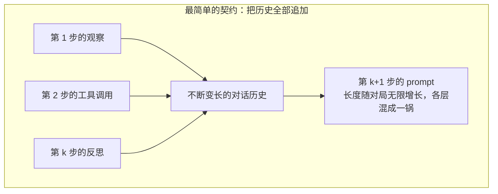
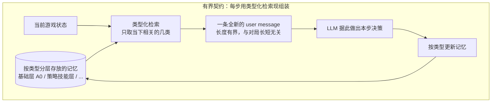
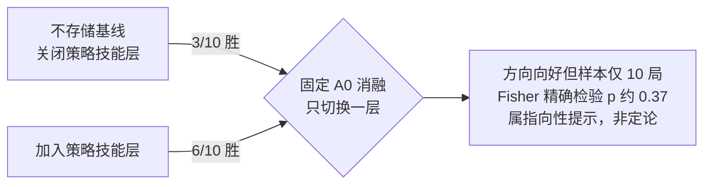

# AgenticSTS：一个给长程 LLM 智能体的有界记忆测试床

> **原题**：AgenticSTS: A Bounded-Memory Testbed for Long-Horizon LLM Agents
> **作者**：Xiangchen Cheng, Yunwei Jiang, Jianwen Sun, Zizhen Li, Chuanhao Li, Xiangcheng Cao, Yihao Liu, Fanrui Zhang, Li Jin, Kaipeng Zhang
> **机构**：Alaya Studio
> **年份**：2026（arXiv 2607.02255，提交于 7 月 2 日）
> **分类**：cs.AI / cs.CL
> **链接**：https://arxiv.org/abs/2607.02255
> **精读日期**：2026-07-05

## 阅读须知

**这篇在领域里的位置。** 过去两年里，大语言模型从"回答单个问题"走向了"扮演一个能连续行动的智能体"。所谓智能体，就是让模型在一个环境里反复地观察、决策、调用工具，一步接一步地把一件复杂的事情做完。可是一旦任务变长，问题就来了：模型每一步该看到什么？最省事的做法，是把此前发生过的一切，也就是每一次观察、每一次工具调用、每一次自我反思，通通拼接到当前的输入里。这条路简单直接，却会让输入越滚越长，也让人无从判断，一次成功或失败究竟是记忆里的哪一部分在起作用。这篇论文正是站在这个位置上：它不追求刷新某个榜单的分数，而是想把"智能体的记忆到底该怎么组织、又该怎么被严肃地研究"这件事，做成一套可以复现、可以逐层拆解的方法与测试床。

**读完能回答什么。** 读完这份笔记，你应该能够回答下面这几个问题。第一，为什么把全部历史一股脑拼进 prompt，这种最自然的记忆方式反而会成为研究上的障碍？第二，论文说的"把记忆当成一份契约"，这个比喻具体指什么？第三，"类型化检索"是怎样让 prompt 的长度不再随对局增长的？第四，为什么作者要挑《杀戮尖塔 2》这样一款卡牌游戏来做实验，而不是常见的问答或代码基准？第五，那个从三比十到六比十的结果，到底说明了多少，又没能说明什么？

**阅读前置。** 这份笔记预设你大致知道大语言模型是怎么被"提示"（prompt）驱动的，也知道所谓智能体就是"模型加上一个能反复调用它的外层循环"。但它不预设你专门研究过智能体的记忆机制，也不预设你玩过《杀戮尖塔》这一类游戏，凡是涉及这些的地方，都会先交代清楚再往下讲。

**首次出现的缩写与专名表。**

- **LLM**（Large Language Model，大语言模型）：这里指被当作决策核心的基础模型。
- **智能体（agent）**：模型加上一个外层循环，能在环境里连续地观察与行动。
- **长程（long-horizon）**：一个任务需要成百上千步决策才能完成，而不是一问一答。
- **STS（Slay the Spire，杀戮尖塔）**：一款单人卡牌构筑类游戏，论文用它的第二代《Slay the Spire 2》做测试床。
- **类型化检索（typed retrieval）**：不把原始历史直接拼接，而是把记忆按类别存放，每一步只检索出当下需要的那几类，拼成一条新的输入。
- **消融（ablation）**：把系统里的某一个部件单独关掉或打开，看结果如何变化，用来判断这个部件到底有没有用。
- **骨干模型（backbone）**：智能体底层所用的那个具体的大语言模型。
- **Fisher 精确检验（Fisher exact test）**：一种在样本很小时判断两组胜率差异是否只是偶然的统计方法。
- **轨迹（trajectory）**：智能体从开局到结束打完的一整局记录。

这个问题不解决，会一直卡住整个智能体研究的一个环节。当人们说某个记忆方案"更好用"时，往往说不清好在哪一层：是因为它记住了更多观察，还是因为它保留了某几条策略提示，抑或只是因为它把输入撑得更长、顺带塞进了更多有用信息。过去几年，主流的做法要么是把上下文无限拼接下去，要么是往里加各种检索式记忆库，可这些方案彼此纠缠，很难做出干净的对照实验。旧路线卡住的地方就在这里：记忆被当成一个越堆越大的仓库，而不是一份可以逐条约定、逐条检验的规则。于是一个方法即便真的有效，研究者也很难指着它说清楚，究竟是哪一部分在生效。这篇论文想推进的，正是把这团纠缠拆开。

## 一、问题

论文开篇提出了一个很凝练的说法：对一个长程智能体而言，记忆其实是一份契约，约定的是"未来的每一次决策，被允许看到什么"。这句话值得停下来体会一下。我们平时谈记忆，容易把它想成一个存东西的地方；而这里换了一个角度，把记忆看成一条规则，它规定的是信息的可见范围，而不是信息的存放位置。

顺着这个角度看，最简单的那份契约就是"全部追加"：把过去的观察、工具调用和反思，原封不动地接到每一次的输入后面。这样做的好处显而易见，先前发生的一切都触手可及，模型想回看哪一步都行。可坏处同样明显。其一，输入会随着对局的进行不断变长，一局需要几百步决策的任务，到后期的 prompt 会膨胀到既昂贵又笨重。其二，也是作者更在意的一点，这样拼出来的上下文是一锅混在一起的杂烩，观察、工具结果、反思彼此交叠，你根本没办法把其中任何单独一层拎出来，去看它到底贡献了多少。换句话说，这种最方便的记忆方式，恰恰让"记忆研究"本身变得无从下手。

于是问题就清楚了：能不能设计另一份契约，让 prompt 的长度不再随对局无限增长，同时又让记忆的每一层都能被单独地打开或关掉，从而被干净地研究？这就是全篇要回答的技术问题。

## 二、方法

作者给出的替代契约，被称为"有界契约"。它的核心动作只有一句话：每一次决策，都从一条全新的 user message 开始，这条消息由类型化检索临时组装而成，中间不再附带任何跨决策的原始记录。

把这句话拆开来看。所谓类型化检索，意思是记忆不再以"原始历史"这种单一形态存在，而是被按类别分层地存放起来；到了要做决策的当口，系统根据当前的游戏状态，只从相关的那几类里检索出需要的内容，再拼成一条干净的输入。因为每一步都是重新组装，而不是往上累加，这条输入的长度就被稳稳地限制住了，无论这一局已经打了多少步。作者强调的一个直接后果是：正因为各层是分开存放、按需取用的，任何单独一层都可以被单独关掉，于是"这一层到底有没有用"这个问题，第一次变得可以用受控实验来回答。

在摘要给出的层次里，可以看到两类具体的记忆成分。一类是被记为 A0 的基础配置，实验中把它固定下来当作对照的基准；另一类是"被触发的策略技能"，也就是在满足某些条件时才会被检索进来的一层策略性提示。需要说明的是，论文正文的 HTML 版本此刻尚未放出，可从公开摘要核实到的层次命名就是这两类，更细的分层此处不作展开，以免超出可核实的范围。

这套设计的价值，与其说在于"让智能体打得更好"，不如说在于"让研究者第一次能把记忆的各层拆开来称重"。这一点会在实验部分体现得更清楚。

## 三、实验

作者没有选常见的问答或代码基准，而是把整套契约放进了《杀戮尖塔 2》这款卡牌构筑游戏里。选它是有道理的。这类游戏规则是封闭的，也就是每一张牌、每一次战斗的效果都有明确定义，不存在模糊地带；但它同时又是随机的，抽牌、遇敌、掉落都带着运气成分。更要紧的是，打完一整局需要成百上千次决策，既有一场战斗内部该出哪张牌的战术判断，也有整局里该往卡组里加什么牌、走哪条路线的战略判断。这样一来，一局游戏就天然是一段很长的决策序列，而胜负又给出了一个干净利落的结果信号。

为了说明这个任务的难度，论文引用了一个公开的在线基准：多款前沿大语言模型在最低难度、五种不同配置下的战绩是零胜；而开发者报告的人类在同一难度下的胜率约为百分之十六。这两个数字放在一起，说明这个任务对当前的模型来说很难，但并没有难到毫无希望，也就是所谓"困难但尚未饱和"，正好适合用来做区分度实验。

论文最主要的一处对照，是所谓"固定 A0"的消融。做法是把基础层 A0 固定住，只切换"被触发的策略技能"这一层的开关。结果如下表所示。

| 条件 | 胜场 |
| --- | --- |
| 不存储的基线（关闭策略技能层） | 三比十（3/10） |
| 加上策略技能层 | 六比十（6/10） |

从三比十到六比十，方向上是明显向好的，加上那一层策略技能之后，胜率翻了一倍。但作者在这里非常克制，没有把它说成一个确定的结论。因为每种条件只有十局的样本，用 Fisher 精确检验一算，两组之间的差异对应的 p 值约为 0.37，远没有达到统计上可以下定论的程度。也就是说，这个结果是有指向性的提示，而不是一锤定音的证据。除此之外，论文还做了一个跨骨干模型的探针实验，以及与公开的"累积上下文"方案的对照，但作者明确地把这两项定位为"操作层面的比较"，而不是针对契约这一个变量的受控检验。这种自我设限，在方法学导向的论文里其实是难得的诚实。

论文真正想交付的东西，写在了最后：一套可复现的测试床。它包含 298 条打完的完整轨迹，每一条都带着条件标签，还配上了被冻结保存的记忆与技能快照、完整的 prompt 记录，以及分析脚本。换句话说，这篇论文给出的与其说是一个更强的智能体，不如说是一套"用来研究记忆各层如何塑造长程决策"的、经过验证且可以反复使用的方法。

## 四、局限

论文自己承认的局限相当明确。首先是统计上的：核心那处对照每组只有十局，胜率差异在 Fisher 精确检验下并不显著，作者因此反复用"方向性"而非"结论性"来措辞。其次是范围上的：跨骨干模型的探针与外部方案的对照，被作者主动降格为操作性比较，而没有当作对"有界契约"这一变量的严格检验，这等于承认，真正干净的因果证据还有待更大规模的实验去补。

还有几点是读完之后可以看出来的。其一，所有结论都建立在《杀戮尖塔 2》这一款游戏上，它固然是个很好的长程测试床，可它规则封闭、胜负分明，这些恰恰是许多真实智能体任务所不具备的，方法能否迁移到那些没有清晰胜负信号的场景，论文没有回答。其二，类型化检索本身要能奏效，前提是记忆能被合理地分类、相关的那几类能被准确地检索出来，这套分类与检索一旦设计得不好，有界契约的优势也会随之打折，而这部分的敏感度并没有被充分探究。归根到底，这是一篇把话说得很有分寸的方法学论文：它没有承诺一个更强的智能体，而是老老实实地搭好了一张可以让别人接着做实验的台子。

## 一句话

把长程智能体的"记忆"重新定义为一份规定每步可见范围的契约，用类型化检索换来长度有界、可逐层消融的 prompt，并以《杀戮尖塔 2》为测试床交付了一套可复现的研究方法。
