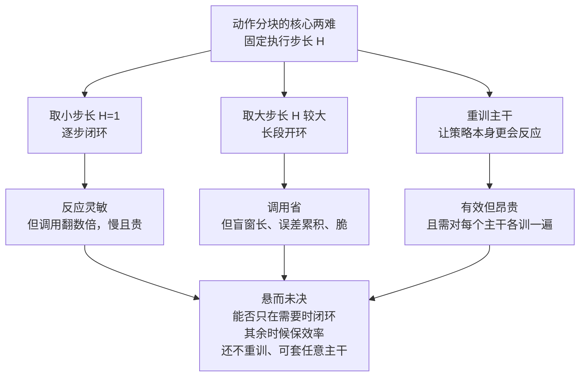
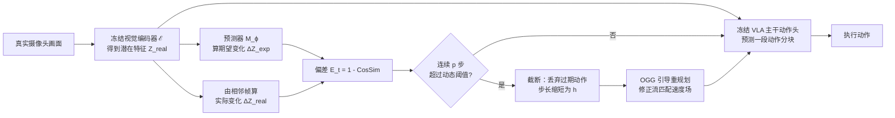

# VLA-Corrector：给动作分块的机器人策略装一个会喊停的视觉监视器

> **原题**：VLA-Corrector: Lightweight Detect-and-Correct Inference for Adaptive Action Horizon
> **作者**：Yi Pan, Miao Pan, Qi Lu, Jiaming Huang, Man Zhang, Siteng Huang, Xin Li, Jie Zhang, Yongliang Shen, Xuhong Zhang, Wenqi Zhang
> **机构**：arXiv 页面未标注所属机构
> **年份**：2026（arxiv ID 2607.01804）
> **分类**：cs.RO（机器人学）
> **链接**：https://arxiv.org/abs/2607.01804
> **精读日期**：2026-07-06

## 阅读须知

**这篇在领域里的位置。** 这两年机器人操作里最热的一条线，是所谓的视觉-语言-动作基础模型，也就是 VLA（Vision-Language-Action）。它要做的事情，是让一个大模型直接看着摄像头画面、听着一句自然语言指令，就吐出机械臂接下来该怎么动。为了让这种大模型跑得起来，主流做法引入了一个叫动作分块（action chunking）的技巧：模型不是一步一预测，而是一次预测出未来若干步的动作，然后闭着眼睛把这几步连着执行完，再回头做下一次预测。这样能把昂贵的模型调用次数摊薄下来。这篇论文并不打算再造一个新的 VLA 主干，它站在整条链路更靠后的一环上，处理的是推理阶段的一个具体毛病：那段闭眼执行的窗口里，一旦现实和预测对不上，误差会一路滚大，最后把任务做砸。它给出的方案是一个外挂式的、不动主干权重的纠错框架。

**读完能回答什么。** 读完这份笔记，应当能回答下面几个问题。第一，为什么固定长度的动作分块开环执行，会让误差累积到无法挽回。第二，论文里那个视觉监视器靠什么信号，在线判断出当前这段动作已经不可信，它比较的是什么、用什么度量、又怎么定阈值来避免草木皆兵。第三，一旦决定喊停，所谓在线梯度引导是怎么把动作往回掰的，它和单纯重新推理一遍的区别在哪里。第四，为什么说这套机制把一个静态的执行步长，变成了按需伸缩的自适应步长。第五，一个不重训主干、只有四千万参数的小外挂，究竟能把成功率抬高多少，代价又是多少。

**阅读前置。** 这里假定读者熟悉深度学习和机器人操作的基本概念，比如策略（policy）、观测到动作的闭环、模仿学习，也大致了解 Transformer 与扩散、流匹配这类生成式模型的思路。但不预设读者专门做过 VLA 或具身智能，对动作分块、闭环与开环控制的区别也不预设熟悉，这些正文都会先铺垫再展开。

**首次出现的缩写表。**

- **VLA**（Vision-Language-Action）：视觉-语言-动作基础模型，直接从图像与语言指令生成机器人动作。
- **LVM**（Latent-space Vision Monitor）：潜空间视觉监视器，本文提出的在线偏差检测模块。
- **OGG**（Online Gradient Guidance）：在线梯度引导，本文提出的纠偏采样机制。
- **action chunking**：动作分块，一次预测多步动作并连续开环执行。
- **horizon / H**：动作视野或执行步长，一段分块里实际闭眼执行的步数。
- **flow-matching**：流匹配，一种生成式动作头的采样方式，通过一个速度场把噪声逐步推成动作。
- **MAD**（Median Absolute Deviation）：中位数绝对偏差，一种对离群点稳健的离散度度量。
- **CosSim**：余弦相似度，用来衡量两个向量方向的接近程度。
- **OOD**（Out-Of-Distribution）：分布外，指机器人漂到了训练时几乎没见过的状态。
- **pp**（percentage points）：百分点，用于描述成功率的绝对增减。
- **DoF**（Degrees of Freedom）：自由度，六自由度指机械臂能独立控制的运动维度有六个。

一个跑着 VLA 策略的机器人，想要快，就得少调用几次那个昂贵的大模型，于是它一次预测出未来十来步动作，然后闭着眼睛一口气执行完。这确实省了调用，可问题在于这段执行是盲的：动作发出去之后，哪怕摄像头已经拍到抓取打滑了、物体被碰歪了，控制器在这段窗口里也不去看这些新画面，只顾把预定好的动作走完。在拧插、对位这类接触密集的任务里，一点点位置偏差会在接触中迅速放大，等这段盲窗走完再回头看，机器人可能已经滑进了一个训练时几乎没见过的状态，这时候再重新规划也救不回来了。

面对这个毛病，最朴素的两条路都不令人满意。一条是把执行步长压到一步一看，也就是彻底的闭环，反应是灵敏了，可模型调用次数翻上好几倍，慢且贵。另一条是把步长放大图个效率，结果就是更脆，稍有扰动就崩。还有一条路是干脆重训主干，让它自己学会更强的反应能力，但这既昂贵，又得针对每个不同的 VLA 主干各训一遍。于是留下一个悬而未决的问题：能不能只在真正需要的时候才切换到闭环反应，其余时候照样享受分块的效率，而且这一切不必重训、还能套在任意一个现成的 VLA 主干上。这正是本文要补的那一步。

## 一、问题

把上面的动机落到一个可验证的技术陈述上，这篇论文要解决的，是动作分块里固定执行步长带来的一个两难。步长这个量，指的是一段分块预测出来之后，机器人实际闭眼执行的步数，论文里记作 H。

论文先用一组数字把这个两难量化了出来。在名为 π₀.₅ 的一个 VLA 主干上，把执行步长从每步一看的 H 等于一，放大到 H 等于十，模型调用次数大约降到四分之一，可任务成功率也从约百分之六十四跌到约百分之四十九。换句话说，省下来的调用是以成功率的实打实下滑换来的，两者被固定步长死死地捆在一起，没有中间地带。

误差为什么会在盲窗里累积到不可收拾，值得单独说清。开环执行的那几步里，每一步都有新的观测送进来，但控制器一概不看，直到这段步长走完。于是打滑、碰撞、位姿漂移这些小扰动，在无人纠正的情况下一点点叠加。一旦漂移持续得够久，机器人就滑出了训练分布，进入一个它没被教过怎么应对的状态，此时即便触发重新规划也回天乏术。论文用开抽屉的例子作了直观对照：步长取十时，机器人在偏差发生后仍机械地执行着过期的动作，最终卡死；而步长取一的闭环执行则能顺利完成。

前人的几条路线之间，其实是围绕这同一个步长在做取舍，可以用下面的关系理一理。



归根结底，前人要么在效率与鲁棒之间选一个固定的折中点，要么付出重训的代价，谁也没有让这个折中点随着任务当下的状态自动移动。本文的切入口，就是让步长不再是一个提前拍死的常数，而是一个由现场偏差触发的、可长可短的变量。

## 二、方法

VLA-Corrector 的整体思路，是在不碰主干权重的前提下，给它加一双眼睛和一只手。眼睛负责盯住开环执行有没有跑偏，这就是潜空间视觉监视器 LVM；手负责在跑偏之后把动作往回掰，这就是在线梯度引导 OGG。下面按信号流动的顺序，把用到的符号逐个交代清楚。

先说监视器看的是什么。这里的潜空间，指的是主干那个被冻结的视觉编码器输出的特征表示，记作 ℰ。

- **Z_t^real**：第 t 步时，由真实摄像头画面经编码器 ℰ 得到的潜在视觉特征，代表机器人此刻实际看到的世界。
- **M_ϕ**：一个轻量的外挂预测器，参数记作 ϕ，它接收当前的真实潜在状态与将要执行的动作，预测出潜在特征接下来应当怎样变化。
- **ΔZ_t^exp**：由 M_ϕ 预测出的期望潜在变化，也就是如果一切顺利，画面特征本该往哪个方向走。
- **ΔZ_t^real**：由连续两帧真实观测算出的实际潜在变化，也就是画面特征实际往哪个方向走了。

监视器要做的判断，是看这两个变化方向对不对得上。它用的度量是余弦相似度的失配，写成

```
E_t = 1 - CosSim(ΔZ_t^exp, ΔZ_t^real)
```

E_t 越大，说明预测的走向和实际的走向掰得越开，漂移越严重。这里特意用方向的相似度而不是绝对数值的差，好处是对特征幅度的整体缩放不敏感，只关心走势有没有背离。

接下来是怎么根据这个偏差信号决定要不要喊停。直接拿一个固定阈值去卡是不稳的，因为偏差信号本身会有瞬时的毛刺。论文改用一套基于中位数绝对偏差 MAD 的动态双阈值。MAD 是一种对离群点稳健的离散度度量，用它来估计偏差信号平时的波动幅度。两个阈值写成

```
T_on  = M_e + λ_on · MAD
T_off = M_e + λ_off · MAD   （λ_on > λ_off）
```

其中 M_e 是偏差信号在一个滑动窗口内的中位水平。开的阈值 T_on 比关的阈值 T_off 更高，这构成一个迟滞区间，避免信号在阈值附近反复横跳时频繁触发。默认设置里，λ_on 取三点零，λ_off 取二点零，滑动窗口取十五步，此外还要求偏差连续超过开阈值达 p 等于五步才算数。也就是说，只有当 E_t 连着五步都压过 T_on，才真正触发一次中断，一两帧的偶发尖峰不会惊动它。论文观察到，成功的回合里偏差信号集中在低位，失败的回合则拖着一条明显更重的高位尾巴，这也从数据上印证了这个信号确实有区分力。

一旦监视器确认漂移属实，系统就做三件事：把队列里剩下的过期动作全部丢掉，立刻触发一次新的推理，于是这一段实际执行的步长就缩短成了已经走过的 h 步，而不是原定的 H 步。论文提到，有百分之八十三点七的截断都发生在精细抓取这类关键阶段，说明这套机制并不是到处乱砍，而是把刀用在了容易出事的节骨眼上。

真正把动作往回掰的，是只作用于截断后那一次恢复推理的在线梯度引导 OGG。它的做法可以拆成三步。第一步，在生成动作的某个去噪步 τ 上，用预测器估计候选动作 â_t 会带来的潜在变化

```
ΔẐ_act = M_ϕ(Z_t^real, â_t)
```

第二步，算出一个纠偏的目标方向，它以最近一个稳定步的期望走向为基准，扣掉已经累积的偏差

```
ΔZ_corr = ΔZ_exp − ΔZ_dev
```

第三步，把这个目标方向变成一个作用在流匹配速度场上的引导梯度。流匹配是这类生成式动作头采样时用的机制，它通过一个速度场 v_τ 把噪声一步步推成最终动作。OGG 定义一个损失，衡量候选动作带来的潜在变化与纠偏目标方向差多远，再拿它的梯度去修正速度场

```
L_OGG = 1 − CosSim(ΔẐ_act, ΔZ_corr)
v_τ^guide = v_τ − η · ∇_{v_τ} L_OGG
```

默认引导强度 η 取一。这一步的意义在于，它不是被动地指望重新推理一次就能自己走出泥潭，而是主动地把生成过程往那个能纠偏的方向上推。

把这套检测与纠正的回路串起来，就是下面这张图。



值得强调的是这套机制对执行步长的效果。它并不是把步长整体调短，而是让步长随现场情况伸缩：在当前分块还可靠的稳定阶段，长步长照常往下走，效率不受影响；一旦进入误差敏感的阶段并被监视器逮到漂移，就临时切成短步长做纠偏重规划。下面这张时间线可以看出这种事件触发的伸缩。


## 三、实验

论文在三个不同的 VLA 主干上验证了这套外挂，分别是 π₀.₅、SmolVLA 和 X-VLA。评测环境覆盖仿真与真机两侧：仿真用 MetaWorld，按 Easy、Medium、Hard、Very Hard 四个难度切分接触密集的操作任务，另用 LIBERO 测语言条件下的长程任务；真机则用一台 AgileX PiPER 六自由度机械臂，做抓放、对位以及受扰恢复这几类任务。所有实验都不再重训主干。

先看 MetaWorld 上的主结果，也就是加与不加这套外挂的平均成功率对照。

| 主干 | 基线平均成功率 | 加 VLA-Corrector | 增益 |
|------|------|------|------|
| π₀.₅ | 48.70% | 64.35% | +15.65pp |
| SmolVLA | 61.90% | 66.65% | +4.75pp |
| X-VLA | 55.55% | 59.60% | +4.05pp |

可以看到三个主干都有提升，其中原本更弱的 π₀.₅ 提升最猛，接近十六个百分点。这也符合直觉：主干越是容易漂，事件触发的纠偏能补的空间就越大。

在 LIBERO 上有一个值得单拎出来讲的反直觉结果。只用少量样本微调的 π₀.₅，配上这套外挂之后平均成功率达到百分之九十七点八，反而略高于完整微调的百分之九十六点九五。换句话说，一个推理阶段的纠错机制，在这里顶替掉了昂贵的完整微调所需要的大量数据，把省数据和提性能这两件事同时办了。

效率一侧的结果同样关键，因为这套方法的初衷本就是不牺牲分块的效率。论文用每次调用能换来多少成功来衡量，发现步长越大、增益越明显：在步长取五十这种很长的设定下，π₀.₅ 的这一效率指标提升了约百分之二十四点六，SmolVLA 在不同步长下的提升区间为百分之二十点六到四十五点三。也就是说，在多数设定里，它是在维持甚至压低总调用次数的同时把成功率抬了上去，并没有靠多调用来换成功。

真机结果则最能体现它对扰动的价值。

| 真机任务 | 增益 |
|------|------|
| 抓放 | +8.3pp |
| 对位 | +16.6pp |
| 受扰恢复 | +28.3pp |
| 总体 | 55.6% → 73.3%，+17.7pp |

受扰恢复这一项提升最大，接近三十个百分点，正好对上了这套机制的设计初衷：它就是为对付执行途中的突发偏差而生的。

消融方面有两处最能说明问题。其一，把两个组件拆开看：只做截断不做引导，成功率从基线的百分之四十八点七提到六十点三五；再加上 OGG 引导，进一步到六十四点三五。可见喊停这一步贡献了大头，而主动纠偏又在此之上添了一截。其二，引导强度并非越大越好：η 取一时最优，一旦强推到一百，在更难的任务上反而变差，说明引导是把双刃剑，过猛会把生成推离主干本来合理的动作先验。此外，监视器的容量四千万参数已经够用，加到一亿六千万带来的额外收益微乎其微。

## 四、局限

论文自己承认的边界，有几条讲得相当坦率。其一是工作空间耗尽：如果目标物或夹具被移到机械臂够不着的范围，单次纠偏重规划既没有足够的空间、也没有足够的时间把局面救回来。其二是接触与摩擦：在需要紧配合的对位任务里，一条没有力反馈的六自由度手臂，哪怕视觉目标已经纠正，仍可能因为接触几何、摩擦或微小的高度误差而失败。其三是视觉歧义：夹爪的部分遮挡、物体与目标区域对比度太低，都会让监视器看走眼。其四是动作先验的天花板：OGG 终究依赖那个被冻结的主干动作先验，它能把下一次生成往更好的纠偏方向上偏一偏，却造不出一个主干本身根本表达不了的恢复行为。其五是推理开销：OGG 在恢复推理时会带来约一点六二到一点六八倍的墙钟耗时，不过摊到每一步执行上只多出约七点九三毫秒。其六是纠偏器对数据的依赖：跨域迁移能力有限，用 LIBERO 训出来的纠偏器搬到 MetaWorld 上只带来约三点一个百分点的收益，而域内匹配训练能带来约十个百分点。

除了作者点明的这些，读完还能看出几处潜在的问题。第一，监视信号的模态是单一的，它只盯视觉潜在特征的走向，那些不引起明显视觉变化的接触力或触觉偏差，它天然监测不到。这和它承认的力反馈缺失是一回事的两面，但更本质的一点在于，纠偏的触发权完全交给了视觉这一个通道。第二，所谓不重训主干，并不等于零训练。那个纠偏器 M_ϕ 仍然需要针对具体的域，去采集大量由真实潜在状态、动作、以及潜在变化构成的配对数据来训练，加上前面跨域迁移弱的事实，这份额外的数据与训练成本不宜被轻描淡写地略过。第三，整套机制挂着一串超参数，从开关两个阈值系数、滑动窗口、连续越阈的耐心步数，到引导强度，默认值在论文的任务上好用，但换一批任务是否需要重新调、鲁棒性如何，论文没有给出充分的证据。第四，评测仍以仿真为主，真机任务集偏小，只有抓放、对位、受扰恢复这几类，对于更长程、更复杂的真实任务，可靠性的证据还比较有限。

## 一句话

为分块执行的 VLA 策略外挂一个视觉监视器，开环漂移就截断并做梯度纠偏，把固定动作视野变成按需伸缩，不重训主干即提升接触密集任务的鲁棒性。
