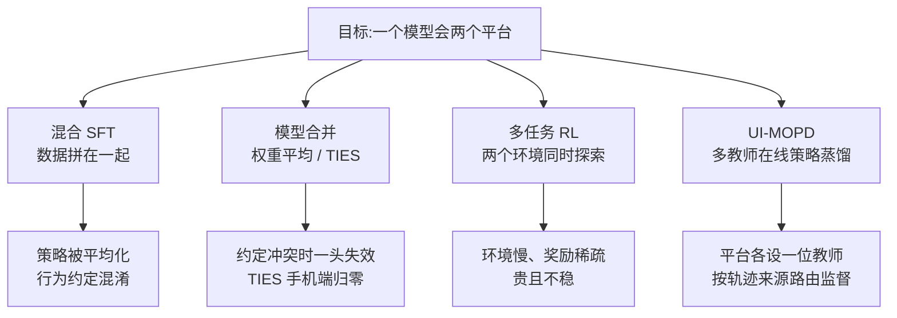
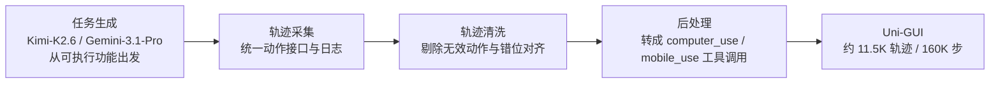
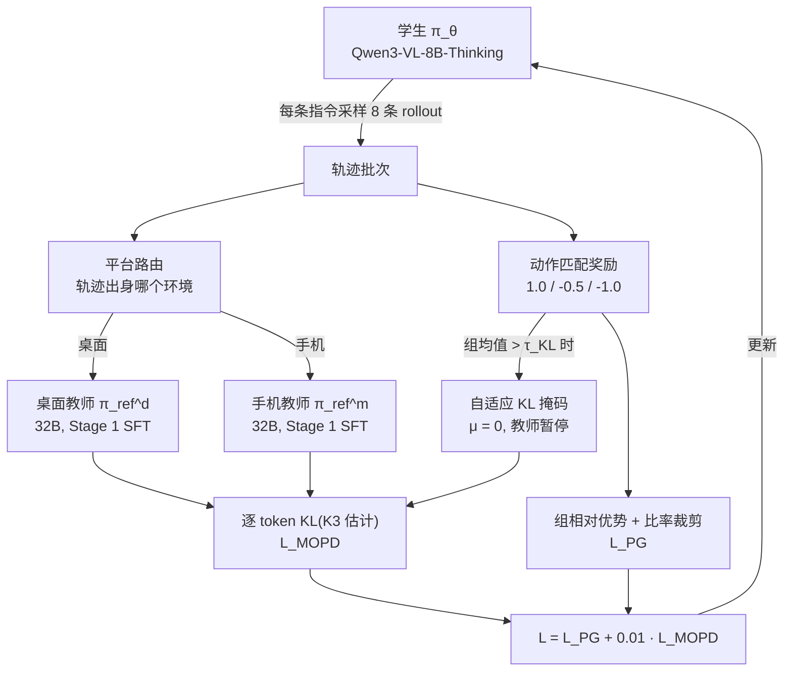
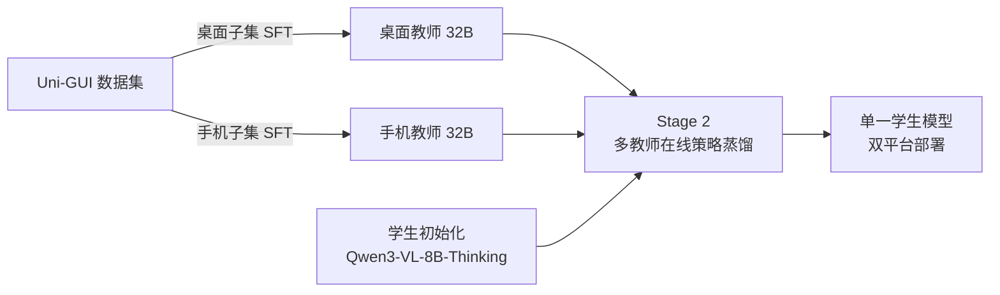

# UI-MOPD:面向持续 GUI 智能体学习的多平台在线策略蒸馏

> **原题**:UI-MOPD: Multi-Platform On-Policy Distillation for Continual GUI Agent Learning
> **作者**:Niu Lian, Alan Chen, Zhehao Yu, Chengzhen Duan, Fazhan Liu, Hui Liu, Pei Fu, Jian Luan, Yaowei Wang, Shu-Tao Xia, Jinpeng Wang
> **年份**:2026(arxiv ID 2607.04425)
> **分类**:cs.CL / cs.AI / cs.CV / cs.LG / cs.MM
> **链接**:https://arxiv.org/abs/2607.04425
> **精读日期**:2026-07-07

## 阅读须知

**这篇在领域里的位置。**GUI 智能体(GUI agent)指的是那类以屏幕截图为输入、以点击键入等界面操作为输出、替人完成软件任务的模型。过去两年这个方向大体沿着两条线推进:一条是把视觉语言模型(VLM)在人工采集或合成的操作轨迹上做监督微调,把界面元素定位和单步操作先学扎实;另一条是把强化学习引入可交互的仿真环境,让模型在多步任务里学会规划与纠错。这篇论文站在这两条线的交汇处,处理的是一个更工程化、却一直没有被正面解决的问题:同一个模型如何既会操作桌面电脑,又会操作手机,而不是学了一头就忘掉另一头。它给出的答案借用了大模型后训练里较新的一个工具,也就是在线策略蒸馏(on-policy distillation),并把它扩展成多教师、按平台路由的形式。

**读完能回答什么。**读完这份笔记,应当能回答下面五个问题:第一,为什么把桌面和手机的操作数据直接混在一起训练,常常两头都得不到好处;第二,在线策略蒸馏和普通的蒸馏式监督微调差别在哪里,为什么前者更能修正学生自己犯的错;第三,UI-MOPD 用什么机制决定一条轨迹该听哪位教师的,这个机制在损失函数里落在哪一项;第四,自适应 KL 掩码解决的是什么问题,什么情况下教师的意见可以被暂时搁置;第五,8B 的学生最后距离 32B 的教师还差多远,这个差距又说明什么。

**阅读前置。**假定读者了解视觉语言模型的基本结构,也具备后训练的常识,知道监督微调、策略梯度和 KL 散度分别是什么;不预设读者做过 GUI 智能体,也不预设读者熟悉蒸馏的各种变体,凡涉及处均先铺垫再展开。

**首次出现的缩写表。**

- **GUI**(Graphical User Interface,图形用户界面):人和软件之间以窗口、按钮、图标交互的界面层,本文的智能体就工作在这一层。
- **VLM**(Vision-Language Model,视觉语言模型):能同时读图和读文的大模型,GUI 智能体通常以它为底座。
- **SFT**(Supervised Fine-Tuning,监督微调):拿标注好的输入输出对,以模仿为目标继续训练模型。
- **KD**(Knowledge Distillation,知识蒸馏):让小模型(学生)去逼近大模型(教师)的输出分布,而不只是逼近数据标签。
- **on-policy distillation**(在线策略蒸馏):蒸馏的一种变体,训练样本不来自固定数据集,而来自学生模型当下自己采样的轨迹,教师在这些轨迹上逐 token 给出监督。
- **KL**(Kullback-Leibler divergence,KL 散度):衡量两个概率分布差多远的量,蒸馏损失的核心。
- **K3 估计器**:KL 散度的一种低方差单样本估计写法,只需教师与学生在已采样 token 上的对数概率即可计算。
- **Uni-GUI**:本文构建的跨平台轨迹数据集。
- **OSWorld / MobileWorld**:分别是桌面与手机端的可交互任务基准,前者 361 个任务,后者 117 个。
- **ScreenSpot / OSWorld-G / AndroidControl**:界面元素定位(grounding)与单步操作的静态基准,用来检查通用能力有没有在训练中退化。
- **OpenCUA / OpenMobile**:已有的开源桌面与手机轨迹数据集,Uni-GUI 吸收了它们的一部分。
- **Qwen3-VL**:阿里的开源视觉语言模型系列,本文学生用 8B-Thinking 版本,教师用 32B-Thinking 版本。

## 一、问题

先说这个问题为什么值得做。设想一个真正有用的操作助手,它早上在你的工作电脑上整理文件、填报表,通勤路上又得在你的手机上订票、回消息。换句话说,跨平台不是锦上添花,而是这类产品形态的基本要求;可是今天公开的 GUI 智能体几乎都是单平台的,桌面模型不会用手机,手机模型坐到电脑前就手足无措。之所以卡在这里,不是没人想到,而是两个现实困难叠在一起:高质量的跨平台轨迹数据本来就稀缺,而把两个平台的数据简单混起来训练,又常常训出一个两头都不精的模型。

把第二个困难拆开看,根子在于两个平台的行为约定不一致。同样是"回到上一个界面",在桌面上意味着关掉一个窗口或者切换窗口,在手机上却是按一下返回键;同样是滚动,桌面靠滚轮和拖拽,手机靠划动。于是同一个抽象意图,在两个平台上对应着完全不同的动作序列,模型如果在混合数据上做联合训练,学到的往往是一个被平均过的策略,论文把这种失败称作行为约定的混淆(behavioral convention mixing)。与之相对,如果按先后顺序分别训练,先学桌面再学手机,又会撞上持续学习里的老问题,也就是灾难性遗忘:新平台的能力长上来,旧平台的能力掉下去。

前人处理这类"多个来源的能力要装进一个模型"的问题,大致有三条路。第一条是混合 SFT,把各平台数据拼在一起监督微调,简单直接,代价就是上面说的平均化;第二条是模型合并(model merging),先各自训出单平台模型,再在权重空间里加权平均或者做 TIES 这类稀疏合并,它不需要重新训练,可是两个行为约定冲突的模型合并之后,常常在其中一头断崖式失效,论文的实验里 TIES 合并在手机端的成功率直接归零;第三条是多任务强化学习,让模型在两个平台的环境里同时探索,理论上最彻底,实际上受限于环境吞吐和奖励稀疏,训练又贵又不稳。归根结底,缺的是一种机制,既能让两个平台各自的专家知识分头注入,又不在注入过程中互相踩踏。

数据这一头,论文也没有绕开。它构建了一个叫 Uni-GUI 的跨平台数据集,合计约 11.5K 条轨迹、约 160K 个交互步骤:桌面侧约 7K 条自采轨迹(约 95K 步)再并入 OpenCUA 的约 0.8K 条,手机侧约 1K 条自采轨迹(约 17K 步)再并入 OpenMobile 的约 2.7K 条。采集走一条四段流水线,先由大模型(桌面用 Kimi-K2.6,手机用 Gemini-3.1-Pro)从软件的可执行功能出发生成任务指令,然后统一的采集框架执行并记录轨迹,再经过清洗与后处理,最后把两个平台的动作各自规整进两套明确的工具调用接口:桌面是 computer_use(涵盖点击、拖拽、滚轮、按键等十二种动作),手机是 mobile_use(涵盖点按、长按、划动、系统键等九种)。也就是说,数据层面先把"动作说什么语言"这件事定死,方法层面才谈得上讨论"听谁的"。

## 二、方法

UI-MOPD 的整体设计可以用一句话先立住骨架:先给每个平台各训一位大教师,再让一个小学生自己上手做题,做题过程中由对应平台的教师逐 token 批改。展开来说,训练分两个阶段。第一阶段,拿 Qwen3-VL-32B-Thinking 在 Uni-GUI 的桌面子集与手机子集上分别做 SFT,得到桌面教师 π_ref^d 与手机教师 π_ref^m;两位教师彼此独立,各自把本平台的行为约定学到位,互不掺水。第二阶段,以 Qwen3-VL-8B-Thinking 为学生 π_θ,进入多教师在线策略蒸馏。

这里需要先铺垫一下在线策略蒸馏这个概念,因为整个方法的效力都建立在它与普通蒸馏的差别上。普通的蒸馏式 SFT 是离线的:训练样本来自固定数据集,学生在教师(或人)写好的正确轨迹上学习,于是它只见过"走对了的路",一旦推理时自己走偏,进入训练分布之外的状态,就没有任何监督教过它如何回来,这就是模仿学习里经典的暴露偏差(exposure bias)问题。在线策略蒸馏反过来:样本由学生当下的策略自己采样,教师再在学生实际走出的每一步上给出自己的概率分布,学生把自己的分布向教师拉近。换句话说,批改发生在学生自己的错误分布上,学生越容易犯的错,越会被反复纠正,这正是 SFT 给不了的。

落到公式上,对学生采样出的第 i 条响应的第 t 个 token,监督信号是学生分布与教师分布之间的逐 token KL 散度。为了不必显式枚举整个词表,论文采用 K3 估计器,只用两边在已采样 token 上的对数概率就能算:记 δ_t = log π_ref(y_t|h_t) - log π_θ(y_t|h_t),ρ_t = exp(δ_t),则该 token 的 KL 估计为 ρ_t - δ_t - 1。这个量恒非负,在两个分布一致时取零,于是它可以直接当作损失最小化。

多平台的关键一步,是教师不再只有一位,而是按轨迹来源路由。每条 rollout 都带着它出身的环境标签,来自手机环境集合 S_mobile 的轨迹,其 KL 项里的 π_ref 取手机教师 π_ref^m;来自桌面环境集合 S_desktop 的取桌面教师 π_ref^d。也正因为如此,两套彼此冲突的行为约定从头到尾没有在同一个监督信号里相遇过:桌面轨迹上只有桌面专家发言,手机轨迹上只有手机专家发言,而它们共同雕刻的是同一个学生的权重。行为层面的隔离与参数层面的共享,就这样被拆到了两个不同的维度上,这是整篇论文最干净的一个设计。

蒸馏之外,训练里还并行跑着一路任务奖励。奖励设计得很朴素:预测动作与参考动作各维度全部匹配记 1.0,部分匹配记 -0.5,格式不合法或无法解析记 -1.0。优势函数用组内相对基线,也就是同一条指令采样 8 条响应,每条的奖励减去组均值,再配上 PPO 式的比率裁剪构成策略梯度项 L_PG。最终目标是两项相加:L(θ) = L_PG(θ) + β·L_MOPD(θ),其中 β 取 0.01。

两路信号并行,就有了打架的可能:如果学生在某道题上已经答得很好,教师的分布约束反而可能把它往回拽。为此论文加了一个自适应 KL 掩码 μ:对每条指令,若同组 8 条响应的平均奖励已经超过阈值 τ_KL,该组的 KL 项整体置零,教师暂时闭嘴;反之 KL 照常生效。换句话说,教师的角色被明确为兜底而非包办,学生自己会做的题,不必再听讲。

工程配置交代得也算清楚:64 张 H100(8 机 8 卡),教师与学生各训一个 epoch,响应长度上限 512 token。整个第二阶段不需要真实环境在线打分,奖励来自与参考动作的匹配,这让它比多任务 RL 便宜得多。

## 三、实验

主实验在两个可交互基准上进行:桌面端 OSWorld 的 361 个任务与手机端 MobileWorld 的 117 个任务,报告任务成功率。对照组覆盖了前面提到的几条路线:基座模型直接测、混合 SFT、两种模型合并。

| 方法 | OSWorld | MobileWorld |
|---|---|---|
| Qwen3-VL-8B-Thinking(基座) | 33.9% | 7.7% |
| 混合 SFT | 35.0% | 6.4% |
| 模型合并(权重平均) | 36.5% | 6.8% |
| 模型合并(TIES) | 36.8% | 0% |
| **UI-MOPD** | **38.2%** | **12.0%** |
| 平台专属 32B 教师(参照上限) | 46.3% | 16.2% |

这张表里有三个值得停下来看的地方。其一,混合 SFT 在桌面上小涨、在手机上反而比基座还低,行为约定混淆不是理论担忧,是实测现象;其二,TIES 合并在桌面上是四个对照里最好的,可手机端成功率归零,权重空间的合并在约定冲突面前脆得很彻底;其三,UI-MOPD 是唯一两头同涨的方法,桌面相对基座提升 12.7%,手机相对提升 55.8%,并且 8B 的学生在 MobileWorld 上(12.0%)已经超过了 32B 基座的表现。与此同时也要看清上限:两位 32B 教师各自能到 46.3% 与 16.2%,学生与教师之间仍然隔着明显一段,蒸馏搬运了行为约定,并没有搬运全部能力。

论文还在一组静态基准上检查了通用能力有没有被训练损伤,这一点对持续学习的论证很要紧:AndroidControl 步级评测上 UI-MOPD 从基座的 78.73% 升到 80.05%,而模型合并掉到 74.01%;元素定位方面,ScreenSpot-Pro(43.71% 对 43.14%)、ScreenSpotV2(91.27% 对 90.88%)、OSWorld-G(52.13% 对 52.84%)三项与基座基本持平,合并法则全面下滑。换句话说,UI-MOPD 在把两个平台的操作能力灌进去的同时,底座的感知与定位能力几乎没有付出代价,而这恰恰是"持续学习"四个字真正要求的东西。

消融里最有说服力的一条,是平台专属 SFT 的迁移不对称:只在单平台数据上微调,本平台能到 35.8%,跨平台却直接归零,这从反面确认了两套行为约定确实不可通约,也就解释了为什么必须两位教师分头执教而不是一位通才教师包办。

## 四、局限

论文自己承认的局限写得很少,没有设专门的一节,这在如今的论文里不算好习惯,读者只能自己把边界找出来。

读完能看出来的问题,至少有这样几处。第一,平台只有桌面与手机两个,网页浏览器作为第三大形态并没有单独建制,而方法名义上是"多平台",两个平台之下路由机制的可扩展性(教师数量随平台数线性增长,显存与训练成本随之增长)还没有被真正压力测试过。第二,MobileWorld 上 12.0% 的绝对值仍然很低,手机教师自己也只有 16.2%,说明瓶颈可能不在蒸馏而在手机侧数据的量与质,Uni-GUI 手机自采轨迹只有约 1K 条,这个短板蒸馏无法凭空补齐。第三,成本上并不轻:要先训两个 32B 教师,再用 64 张 H100 跑第二阶段,复现门槛不低,而"每加一个平台加一位教师"的模式会让这个门槛继续抬高。第四,奖励是与参考动作匹配的离线代理奖励,不是环境真实回报,动作匹配得上不等于任务真做成,这层近似在长程任务上会积累偏差。最后,响应上限 512 token、各训一个 epoch 的配置说明这是一次相对轻量的后训练,学生与教师之间八个点上下的差距有多少能靠更长的训练吃回来,论文没有给出 scaling 方向的证据。

## 一句话

给桌面与手机各配一位 32B 教师,按轨迹出身把监督路由到 8B 学生自采的 rollout 上做逐 token 蒸馏,两个平台的操作能力同涨而互不侵蚀。
