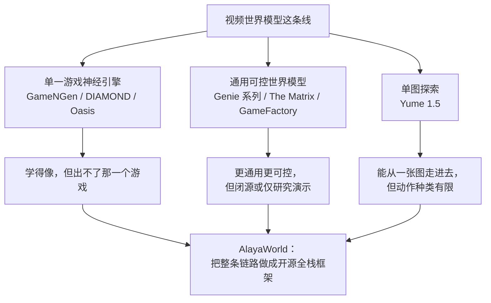
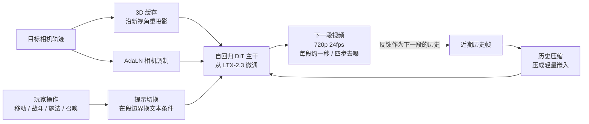
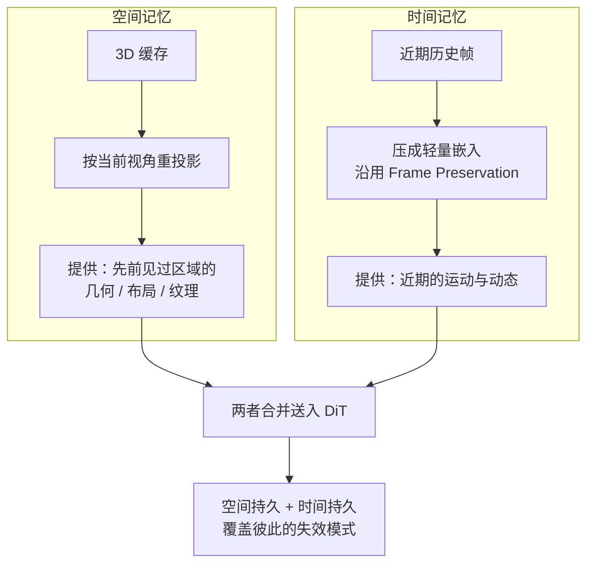

# AlayaWorld：面向长时程、可游玩的视频世界生成

> **原题**：AlayaWorld: Long-Horizon and Playable Video World Generation
> **作者**：AlayaWorld Team（Kaipeng Zhang、Chuanhao Li、Yifan Zhan、Yongtao Ge、Yuanyang Yin 等）
> **机构**：arXiv 页面未明确标注（AlayaWorld Team）
> **年份**：2026（arxiv ID 2607.06291，7 月 7 日提交）
> **分类**：cs.CV（计算机视觉）/ cs.HC（人机交互）
> **链接**：https://arxiv.org/abs/2607.06291
> **精读日期**：2026-07-08

## 阅读须知

**这篇在领域里的位置。** 这几年有一条新的研究路线，叫做视频世界模型（video world model）。它想做的事情，是让一个神经网络扮演"游戏引擎"本身：不再由人把每一个物体、每一条碰撞规则、每一段动画都写死在代码里，而是让模型看着"当前这一帧画面加上玩家刚按下的操作"，直接把"下一帧画面"生成出来。一帧接一帧地生成下去，一个可以实时游玩的世界便凭空长了出来。过去两年这条线上出过不少代表作，从只在单一游戏里跑的 GameNGen、DIAMOND、Oasis，到号称能实时导航、保持分钟级一致性却始终闭源的 Genie 3。AlayaWorld 处在这条线的一个特定位置上：它不主打某一项刷新纪录的指标，而是把从数据准备、模型结构、训练、推理加速到部署的整条链路做成一套**开源全栈框架**，试图把这件原本被大厂闭源把持的事情，完整地摆到桌面上来。

**读完这份笔记，你应该能回答：**

- 视频世界模型与普通的文生视频（text-to-video）模型，本质区别在哪一处
- 为什么"长时程"这件事对这类模型如此困难，画面会以什么方式逐渐崩坏
- AlayaWorld 为了让画面在你转一圈回到原地时还能对得上，用了什么样的记忆机制
- "视觉延迟"与"语义延迟"是两回事，AlayaWorld 分别用什么手段去压低它们
- 一个自回归生成的世界模型，如何做到 720p、24fps 的实时输出

**阅读前置。** 这份笔记假定读者熟悉深度学习的基本概念，知道扩散模型（diffusion model）大致是"从噪声里一步步去噪、还原出图像"这么个过程，也用过 Transformer。但不预设读者做过视频生成或者游戏 AI，凡是这两个子领域的专有名词，第一次出现时都会先铺垫再展开。

**首次出现的缩写表：**

- **DiT**（Diffusion Transformer，扩散 Transformer）：把扩散模型的去噪网络从卷积换成 Transformer 的一类骨干，眼下视频生成的主流选择。
- **AR**（Autoregressive，自回归）：一段接一段地生成，后一段以前面已生成的内容为条件。
- **LTX-2.3**：一个开源的视频扩散基础模型，AlayaWorld 在它之上微调而来。
- **AdaLN**（Adaptive Layer Normalization，自适应层归一化）：一种把外部条件（这里是相机位姿）通过缩放和平移注入网络的轻量做法。
- **3D cache**（三维缓存）：把已经见过的场景以三维形式暂存下来，之后按新视角重新投影出来，给生成器提供"这里以前长什么样"的直接证据。
- **DMD**（Distribution Matching Distillation，分布匹配蒸馏）：一种把多步扩散蒸馏成少数几步的加速技术。
- **FID / FVD**（Fréchet Inception / Video Distance）：图像与视频生成里最常用的两个质量指标，数值越低表示生成分布越接近真实分布。

这个问题不解决会怎样，得先看看游戏世界今天是怎么造出来的。一款开放世界游戏，地形、建筑、光照、每一只怪物的行为、每一条物理碰撞规则，都要由美术和程序一寸一寸地手工搭建并写死在引擎里。这样造出来的世界有两个天生的毛病：一是极贵，一支团队几年才做得出一个像样的世界；二是几乎不可改，世界一旦交付上线，想往里添一种新玩法、换一种画风，往往意味着重做一大片。视频世界模型给出的是一条根本不同的路：世界不再被"编写"，而是被"生成"，玩家的每一个动作都即时地塑造出接下来的画面，理论上可以无穷地玩下去，也可以随口一句话就把整片场景换成水墨或者赛博朋克的样子。

可是这条路要真正走通，前人卡在了几处很硬的地方。GameNGen 和 DIAMOND 这类"神经游戏引擎"确实把 DOOM、Minecraft 这样的单个游戏学得惟妙惟肖，但它们几乎无法迁移到训练过的那一个游戏之外。Genie 系列和 The Matrix 把通用性和可控性往前推了一大步，Genie 3 甚至做到了实时导航与分钟级的一致性，然而它们要么闭源，要么只停留在研究演示，外人拿不到、也复现不了。归根结底，这个领域最缺的不是又一个刷高了分的闭源模型，而是一套任何人都能上手、能改、能部署的完整工程底座。这正是 AlayaWorld 想补上的那一块。

## 一、问题

把上面的动机落到一个清晰的技术命题上，AlayaWorld 要解决的是这样一件事：给定一个自回归的视频生成器，让它在玩家自由操控（移动视角、战斗、施法、召唤怪物）的前提下，长时间、稳定、实时地把一个视觉与物理都自洽的世界一帧帧生成出来。作者把这件事拆成四个彼此纠缠的硬约束，这四个词是理解全文的骨架：

- **可控（Control）**：导航是否真的无边界，玩家的动作是否不被预设的物理规则框死。
- **一致（Consistency）**：空间和时间上是否连贯，转一圈回到原处，先前见过的东西还在不在、对不对得上。
- **稳定（Stability）**：长时间生成下去，画面会不会逐渐"漂移"，也就是误差一点点累积，最后糊成一团。
- **实时（Runtime）**：能否以够低的延迟出画，让人真的玩得起来，而不是等半天出一帧。

这四条里，最能拉开差距、也最难的是"一致"与"稳定"。之所以难，是因为自回归生成有一个天生的隐患：每一帧都以前面生成的帧为条件，而前面那些帧本身也是模型生成的、带着瑕疵的。于是瑕疵会像滚雪球一样，一帧喂给下一帧，误差层层累积，几十秒之后画面就开始扭曲、物体开始变形，这个现象业内称作漂移（drift）。前人的几条主流路线，恰好可以按它们"如何对抗漂移、如何保持一致"来归类。

这里出现的几个名字，都值得用一两句话交代清楚。Genie（以及后来的 Genie 2、Genie 3）是从无标注视频里学动作条件世界模型的代表，思路很通用，但一致性做得最好的 Genie 3 至今闭源。GameNGen、DIAMOND、Oasis 属于"把某一个具体游戏学成一个神经网络"，DOOM 和 Minecraft 是它们的招牌，代价是几乎不能迁移。The Matrix 与 GameFactory 在可控性和跨域泛化上更进一步，但同样不开放。Yume 1.5 走的是另一条小路，从单张图片出发、用键盘操作走进这个场景，长处是轻，短处是能做的动作太少。把这些摆在一起，AlayaWorld 的定位就清楚了：它不声称在某一项上碾压所有人，而是把可控、一致、稳定、实时这四件事同时做到一个可用的水平，并且把实现它们的每一块都开源出来。

## 二、方法

AlayaWorld 不是从零训练，而是**在开源视频扩散模型 LTX-2.3 之上微调**得到的。它的主干是一个自回归的 DiT，也就是用 Transformer 做去噪骨干的扩散模型，只不过生成方式是一段接一段（chunk by chunk）地往下续。围绕这个主干，作者挂上了五个各司其职的部件：负责换动作的提示切换（prompt switching）、负责控制相机的 AdaLN 模块、负责空间记忆的 3D 缓存、负责时间记忆的历史压缩模块，以及负责对抗漂移的误差库（error bank）。最后再用一次蒸馏把去噪步数压到极低，换来实时。先看整体的信号流向。

**生成的基本节拍。** AlayaWorld 以 720p、24fps 自回归生成，每一段（chunk）大约对应一秒钟的视频，而这一段只用四步去噪就产出。之所以要切成一秒一段，而不是一口气生成一长条，是因为"段"正好是玩家改变意图的最小颗粒度：你这一秒想往左走，下一秒想施法，模型就在段与段的边界上把条件换掉。这就引出了第一个部件。

**提示切换（prompt switching）。** 它做的事，是允许在任意一个段边界替换文本条件。关键的巧思在于：换了条件之后，从下一段起生成的新内容不会回过头去改动前面已经生成好的序列。换句话说，玩家中途改主意，模型只需要顺着往下改，不必把已经出过的画面推倒重来。这一点直接关系到后面要讲的"语义延迟"。

**相机控制：两条路并用。** 让生成的画面精确地跟着玩家转动的视角走，是"可控"这条约束里最吃功夫的部分。AlayaWorld 没有把相机位姿一股脑塞进网络，而是并用两条互补的路径。第一条是显式的几何证据：沿用 GEN3C 的思路维护一个 3D 缓存，把已经见过的场景以三维形式存着，再按玩家要去的那个视角把它重新投影、渲染出来。这张渲染图给了生成器一个非常具体的参照，告诉它"从这个新角度看过去，画面大致该是这样"。第二条是轻量的结构注入：把紧凑的相机条件通过 AdaLN 式的调制（也就是对网络中间特征做缩放和平移）送进去，只增加很小的参数与计算量。一条给证据，一条给微调，精度和开销就都照顾到了。

**记忆：空间与时间各管一半。** 这是全篇最核心的设计，也是对抗"一致性崩坏"的主力。作者的洞察是，纯空间记忆和纯时间记忆各有各的盲区，于是把两者拼起来，让它们互相补位。

空间那一半靠 3D 缓存，把先前观察过的区域以几何形式钉住，所以你转身回望，墙还是那面墙、路还是那条路。它的短板是缓存主要记录的是**静止结构**，没法单靠自己编码近期那些动来动去的东西。时间那一半正好补这个短板：把最近若干帧的历史压缩成一个轻量嵌入（做法沿用一项叫 Frame Preservation 的工作），保住近期的运动与动态连续性。作者把这层意思说得很直白：显式缓存供给空间上的持久，压缩历史供给时间上的持久，两者合起来，恰好覆盖了"只有空间记忆"和"只有时间记忆"各自会栽的那些跟头。

**稳定性训练：误差库（error bank）。** 光有记忆还不够，还要专门训练模型去扛住漂移。常规训练里，喂给模型的历史都是干净的真实帧，可到了真正推理的时候，历史全是模型自己生成的、带瑕疵的帧，训练与推理之间就有了鸿沟。AlayaWorld 的对策，是造一个误差库：把自回归推理过程中累积出来的残差瑕疵存起来，当作有结构的扰动，回过头注入到训练里。而且注入得比前人更彻底，前人往往只把这种误差加在要预测的目标段上，AlayaWorld 把误差库里的样本**同时注入到记忆条件和目标段**两处，这样才更贴近长时程推理时"连历史都是脏的"这个真实处境。这一路的思想承接自一项叫 Helios 的工作，核心是让模型在训练时就见惯了"漂移过的历史"，从而学会在脏历史下依然稳住生成、不让误差一步步滚大。

**推理加速：把去噪压到四步。** 前面反复出现的"每段四步去噪"，靠的是标准的 DMD 蒸馏。扩散模型原本要几十步才能从噪声还原出一帧干净画面，DMD 把这个多步过程蒸馏进一个只需极少步数的学生模型，AlayaWorld 由此把每一段的去噪压到四步，这是它能跑到实时的直接原因。

**顺带厘清两种延迟。** 作者特意把"延迟"拆成两种，这个区分很有价值。一种是视觉延迟（visual latency），指从"决定要生成"到"一帧真的出现在屏幕上"的时间，这本质是个算力问题，靠蒸馏和短段来压。另一种是语义延迟（semantic latency），指从"玩家改变意图"到"画面真的反映出这个改变"的时间，这本质是个条件更新问题，靠的正是前面那个段级的提示切换。把两种延迟分开谈，才能对症下药。

## 三、实验

需要先如实说明一点：这是一篇以开源框架和系统能力为主轴的论文，正文（就本次可读到的渲染版而言）**并没有摆出 FID、FVD 或者具体的帧率、延迟数字**来和基线逐项打擂台，而是以能力演示的方式说明它做到了什么。因此下面这张表整理的是它声称覆盖并展示了的几项能力，而不是一组可比的量化战绩。读的时候要意识到这个分寸。

| 能力维度 | 论文的说法 |
|---|---|
| 相机控制 | 画面忠实跟随请求的视角变化与平移，同时保住场景身份与几何合理性 |
| 一致性（闭环回看） | 重新回到先前见过的区域时，几何、布局、纹理都与早先保持一致 |
| 长时程 | 随着生成持续变长，画质、物体身份、运动连续性都维持住，没有明显的瑕疵累积（论文图 5 展示了约一分钟的连续生成） |
| 画风多样 | 同一条导航轨迹可以被渲染成写实、Minecraft、水墨、油画、赛博朋克、像素、以及塞尔达风格，而场景几何、相机轨迹、语义内容始终一致 |

关于对比，论文的处理方式是定性的：它把若干"有代表性的交互式世界模型"作为参照，指出它们会露出几类典型的失败样子，也就是画面逐渐劣化、相机控制不准、以及回看先前区域时前后对不上。AlayaWorld 展示自己在这三处都更稳。这里最能说明设计意图的，是那组"同一轨迹、七种画风"的演示：它想证明的是，场景的几何骨架和玩家的操作轨迹，是与表面画风解耦的两件事，换皮不换骨。这一点若成立，恰好回应了开头那个"随口一句话就换掉整片场景画风"的愿景。

至于哪一个部件最关键，从论文的行文重量来看，误差库那一路的"双重注入"（同时扰动记忆条件与目标段）是作者着墨最多、也最想强调其新意的地方，因为它直接针对自回归世界模型最要命的漂移问题。只是需要留意，论文在可读版本里并没有给出把这些部件逐个拆掉的消融数字，所以"每个部件各自贡献多少"这个问题，目前只能从论述里定性地体会，还看不到量化的拆解。

## 四、局限

作者自己言明的边界，主要落在记忆机制的适用范围上。3D 缓存虽然把空间结构钉得很牢，但它本质上记录的是**静止结构**，没法单靠自己去编码近期那些不断变化的动态，这也正是要额外挂一个时间记忆来补位的原因。顺着这条线还能看出，整套空间记忆依赖对深度和几何的估计，一旦深度估得不准，重投影出来的证据就会带偏，控制精度也会跟着受损，这一点作者提到过前人"控制精度受限于所估几何的质量"，AlayaWorld 用双路条件缓解，但并没有从根子上摆脱这个依赖。

读者还能看出几处论文没有正面承认的问题。其一，"每段只用四步去噪"是拿画质换实时，蒸馏得越狠，单帧的精细程度相比慢慢跑几十步的扩散就越可能打折，这个取舍论文没有量化。其二，也是最实在的一条，是前面已经点出的评测缺口：全篇几乎不出现标准的量化指标与消融数字，能力都以演示图的方式呈现。对于一篇定位为"可复现、开源全栈"的工作，这其实是个略显别扭的空白，因为可复现最终是要靠数字说话的，光有漂亮的演示，外人很难判断它相对前人到底强了多少、每个部件值不值。其三，缓存对**长时间里状态不断改变的动态物体**仍然可能应付不来，比如一只跑来跑去、形态还在变的怪物，这类对象既不完全属于静止结构、其变化又超出近期历史窗口，恰好落在两种记忆的接缝处。

## 一句话

把自回归视频扩散做成开源全栈框架，用"3D 缓存管空间、压缩历史管时间"的混合记忆加误差库训练，实时生成可长时间游玩、可随口换画风的世界。
