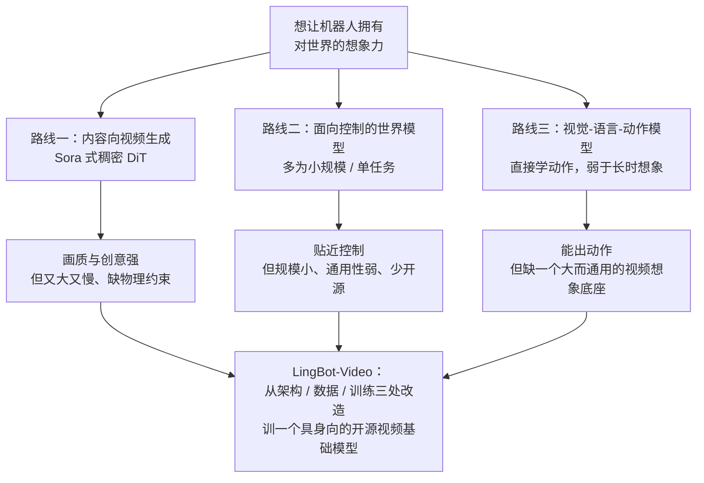
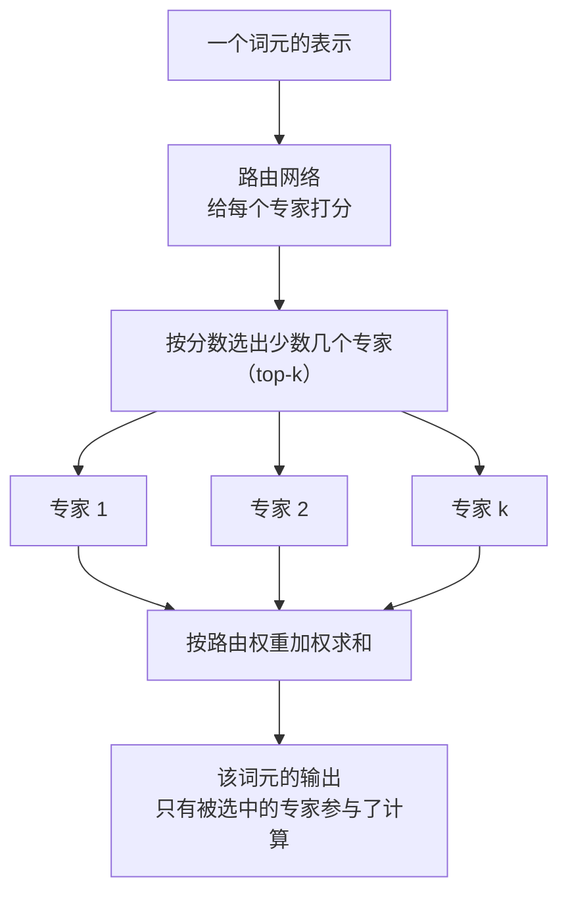
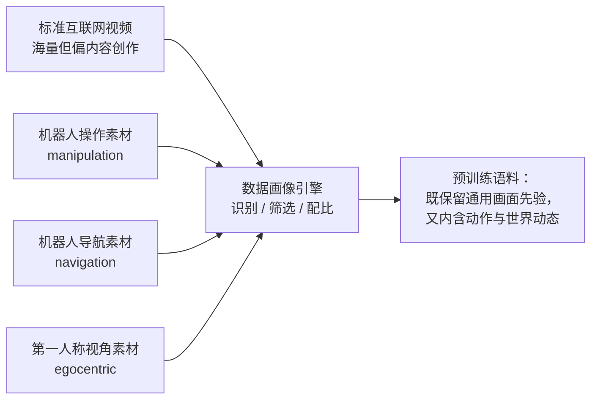
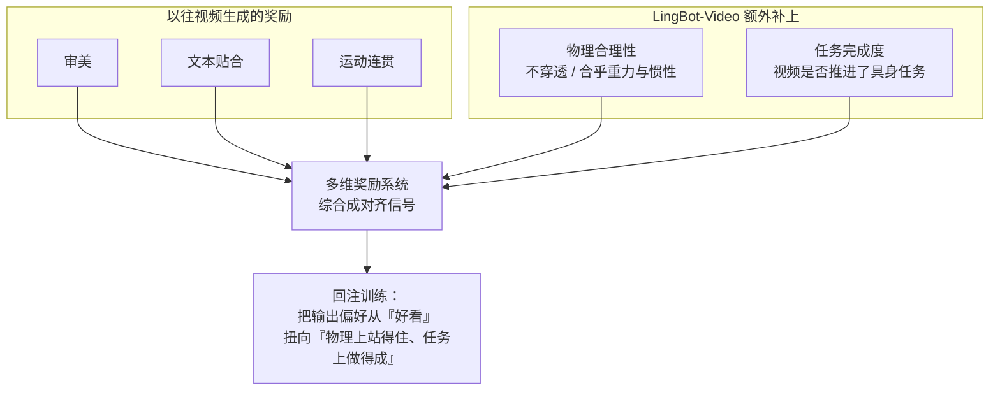

# LingBot-Video：为具身智能规模化混合专家视频预训练

> **原题**：Scaling Mixture-of-Experts Video Pretraining for Embodied Intelligence
> **作者**：Shuailei Ma、Jiaqi Liao、Xinyang Wang、Jingjing Wang、Chaoran Feng 等 27 人（作者阵容中含 Kecheng Zheng、Yinghao Xu、Yujun Shen、Ka Leong Cheng）
> **机构**：arXiv 页面未明确标注；项目主页域名 technology.robbyant.com 指向蚂蚁（Ant）方向的具身团队
> **年份**：2026（arxiv ID 2607.07675，7 月提交）
> **分类**：cs.CV（计算机视觉）
> **链接**：https://arxiv.org/abs/2607.07675
> **项目页**：https://technology.robbyant.com/lingbot-video
> **精读日期**：2026-07-09

## 阅读须知

**这篇在领域里的位置。** 这两年有一件事逐渐成了共识：想让机器人真正会做事，先得让它对这个世界"有想象力"。具体来说，是让模型在动手之前，先在脑子里把"如果我这样动一下，画面接下来会变成什么样"预演一遍。承担这项预演职责的模型，业内叫做世界模型（world model）。而视频生成模型天生就擅长"预测接下来的画面"，于是有一条很自然的研究路线，就是把近两年被 Sora 这类工作推到很高水准的视频生成模型，直接拿来当具身智能的世界模型底座。问题在于，这些视频生成模型原本是为内容创作训练的，它们在意的是画面好不好看、够不够有创意，而不是省不省算力、符不符合物理。把一个为"好看"优化的模型硬塞到一个要求"物理正确且能大规模部署"的场景里，中间横着一道很实的鸿沟。LingBot-Video 处在这条线的一个明确位置上：它不是又训一个更能出大片的视频模型，而是从架构、数据、训练三处同时改造，专门为具身智能训一个视频基础模型，并且把它作为第一个大规模、开源的混合专家视频基础模型交给社区。

**读完这份笔记，你应该能回答：**

- 为什么把一个为内容创作优化的视频生成模型直接拿来当机器人的世界模型，会出现"水土不服"，这道鸿沟具体差在哪几处
- 混合专家（Mixture-of-Experts）相比传统的稠密（dense）结构，在"模型容量"与"推理效率"这一对天生矛盾上，到底赢在什么地方
- 所谓"数据画像引擎"往普通互联网视频里补的究竟是什么，为什么机器人视角（操作、导航、第一人称）的素材是不可或缺的
- 多维奖励系统里，"物理合理性"和"任务完成度"这两个维度，为什么是标准的审美、文本贴合、运动连贯之外必须额外补上的
- 一个想成为具身智能地基的"视频基础模型"，它的训练目标与一个纯粹的"文生视频模型"差在哪里

**阅读前置。** 这份笔记假定读者熟悉深度学习的基本概念，知道扩散模型（diffusion model）大致是"从一团噪声里一步步去噪、最终还原出图像或视频"这么个过程，也用过 Transformer。至于混合专家、世界模型、具身智能这几个子领域的专有名词，用过更好，但笔记不作预设，凡是第一次出现的，都会先花一两句话铺垫"它是什么、为什么需要它"，再展开具体定义。

**首次出现的缩写表：**

- **MoE**（Mixture-of-Experts，混合专家）：把网络里原本一整块的前馈层，拆成许多个平行的小网络（专家），每次只挑其中少数几个来算，从而在总参数很大的同时，单次实际参与计算的参数很少。
- **DiT**（Diffusion Transformer，扩散 Transformer）：把扩散模型的去噪网络从卷积换成 Transformer 的一类骨干，是当前视频生成的主流选择。
- **稠密（dense）结构**：与 MoE 相对的说法，指网络的每一层对每一个输入都动用全部参数，没有"只挑几个专家算"这一步。
- **FFN**（Feed-Forward Network，前馈网络）：Transformer 每一层里紧跟注意力之后的那一小段全连接网络，也正是 MoE 要把它替换成"一组专家"的位置。
- **世界模型（world model）**：一个能根据"当前状态加上一个动作"去预测"下一时刻状态"的模型，机器人可以借它在脑内预演，而不必每一步都真的动手去试。
- **具身智能（embodied intelligence / embodied AI）**：让智能体有身体、能在真实或仿真的物理世界里感知并行动的一类研究，机器人操作与导航是它最典型的落点。
- **第一人称视角（egocentric，自我中心视角）**：从智能体自己"眼睛"出发拍到的画面，与第三人称俯瞰式的旁观视角相对，是机器人真实感知世界的方式。
- **路由（routing）**：MoE 里那个"该把当前这个词元交给哪几个专家来算"的决策模块，通常是一个很小的打分网络。

这个问题不解决会怎样，得先看清楚今天想让机器人"有想象力"是怎么做的。一条被寄予厚望的做法，是直接复用现成的视频生成模型：它们已经在海量互联网视频上学过，随手就能把一段画面往下续得像模像样。可是这些模型的训练目标，从一开始就偏向内容创作那一侧，也就是把画面做得越好看、越有创意越好。这带来两个对具身场景很致命的偏差。其一是效率，为追求视觉保真，这类模型往往又大又慢，稠密结构下每生成一帧都要动用全部参数，成本高到很难放进一个需要频繁预演的机器人回路里。其二是物理，模型学到的是"看起来对"，未必是"物理上站得住"，它可以生成一只手漂亮地穿过桌面，因为那一帧的像素分布很自然，但那在真实世界里根本不会发生。

于是这个方向真正卡住的地方就浮出来了。过去几年，主流的努力要么在拼视频生成本身的画质与时长，要么在小范围、单任务的世界模型上做控制，二者之间始终缺一座桥：既要有视频基础模型那样的通用性和规模，又要在效率与物理这两件事上向具身智能靠拢，同时还能开源出来让整个社区一起推进。LingBot-Video 想补的正是这座桥。它没有单点去刷某一项画质指标，而是同时在三处动刀，把一个内容向的视频预训练范式，改造成一个具身向的视频基础模型。

## 一、问题

把上面的动机落到一个清晰、可验证的技术命题上，LingBot-Video 要解决的是这样一件事：设计一套专为具身智能量身定制的视频预训练范式，让由它训出来的视频基础模型在三个彼此拉扯的维度上同时站得住 - 建模容量要足够大以承载复杂的世界动态，推理效率要足够高以能被真实部署，物理真实性与动作理解要足够强以真的能服务于机器人。这三条里的任意两条单独达成都不算难，难在要它们同时成立，因为它们在传统做法下几乎是互相矛盾的：想要容量就得把模型堆大，堆大就牺牲效率；想要物理正确就得改训练目标，可现成的视频数据与奖励几乎只教模型"好看"。

要看清 LingBot-Video 的取舍，先把前人几条主流路线摆开，按它们各自"擅长什么、在具身场景里缺什么"来归类。

这里出现的几类工作，值得各用一两句话交代清楚。第一类是以 Sora 为代表的内容向视频生成，它们把 DiT 这一骨干做到了很高的画质与时长，长处是通用与真实感，短处是为保真而牺牲了效率，且几乎不带任何显式的物理约束，把手穿过桌子这种"像素上自然、物理上荒谬"的画面，对它们而言并不违和。第二类是面向控制的世界模型，它们直接冲着机器人预演去，贴近下游任务，但通常规模不大、绑定在特定任务或场景上，通用性和开放程度都有限。第三类是近来很热的视觉-语言-动作模型（Vision-Language-Action，简称 VLA），它把感知、语言和动作端到端地接在一起、直接吐出机器人的动作指令，强在"动手"，弱在"想象"，缺的正是一个又大又通用、能在脑内把长段未来铺开来的视频想象底座。把这三类放在一起，LingBot-Video 的定位就清楚了：它要提供的恰是第三类所缺、又比第二类更大更通用、同时补齐了第一类所缺的效率与物理的那个底座。

之所以强调"域不匹配"（domain mismatch）这个词，是因为它点破了整件事的症结。一个模型在什么数据上、朝什么目标训练，就会带着那套数据与目标的烙印。内容向视频模型带的是"创作"的烙印，而具身智能要的是"物理"的烙印。想让前者服务于后者，仅仅换个下游任务是不够的，必须回到预训练本身，从它见的数据、它的骨架结构、它被奖励的方向上一并重塑。这就自然引出了方法一节的三支柱。

## 二、方法

LingBot-Video 的做法，可以概括成一句话：以 DiT 为主干，把它的前馈层换成混合专家并从零开始规模化，再用一套专门的数据引擎和一套多维奖励，把这个视频模型的"世界观"从创作扭向物理。作者自己就是按架构、数据、训练这三个视角来组织全文的，下面依样逐支柱展开。先看整体的信号流向。

**支柱一，架构：把稠密的前馈层换成混合专家，并从零 scale。** 要理解这一步的价值，先得说清 MoE 到底在解什么难题。一个 Transformer 里最占参数、也最占算力的地方，往往是每一层紧跟注意力之后的那段前馈网络（FFN）。稠密结构下，无论输入是什么，这段前馈都要用上它的全部参数，于是"把模型做大以增强能力"和"让模型跑得快以便部署"就成了直接对立的两件事。混合专家给出的破法是：把这一整块前馈，拆成许多个平行的小前馈，每一个叫一个专家；再配一个很小的路由网络，让它根据当前这个词元的内容，只挑其中少数几个专家来算，其余专家这一次完全不参与。这样一来，模型的总参数可以堆得很大（容量上去了），但任意一次前向里真正被激活、真正耗算力的参数只是一小部分（效率保住了）。

这里作者特意点出的一处，是"从零 scale"（scale it up from scratch）。业内把稠密模型改造成 MoE 有一条省事的捷径，叫做上采样（upcycling），也就是拿一个已经训好的稠密检查点，复制它的前馈层去初始化各个专家，再接着训。这条捷径省算力，但各专家起点雷同，容易学不出真正的分工。LingBot-Video 选择的是更重、也更彻底的一条路：把这个混合专家的视频骨干从随机初始化直接一路训上去，让专家之间的差异从训练一开始就自然生长出来。之所以肯下这个成本，正是因为它的目标不是微调一个现成模型，而是要立起一个"基础模型"，基础模型的地基值得从头夯。

**支柱二，数据：用数据画像引擎，给互联网视频补上机器人的那一半。** 一个模型对世界的理解，归根结底来自它见过的数据。普通互联网视频虽然海量，但里面绝大多数是影视、风景、人物这类内容，机器人真正要打交道的"伸手去抓、绕过障碍、从自己视角看世界"这类画面少得可怜。如果只喂这些，模型学到的世界是一个"供人观赏"的世界，而不是一个"供身体操作"的世界。作者的对策是构建一个数据画像引擎（data profiling engine），它在标准互联网视频的基础上，大量掺入面向机器人的素材，覆盖三类具身场景：操作（manipulation，机械臂或手去抓取、摆放物体）、导航（navigation，智能体在空间里移动、避障、寻路）、以及第一人称视角（egocentric，从智能体自己的"眼睛"出发看到的画面）。这三类素材合起来，恰好把"动作会引发什么后果"和"世界会如何随之变化"这两件具身智能最需要的常识，内在地灌进了基础模型里。

**支柱三，训练：用多维奖励系统，把对齐从"好看"扩到"物理上站得住、任务上做得成"。** 光有好数据还不够，还得有一个明确的方向去牵引模型往具身智能想要的样子走。这里作者借用了近年大模型对齐（alignment）里很成熟的思路：在预训练之上，再用一套奖励信号去校准模型的输出偏好，让它更符合人所期望的方向。以往视频生成里的奖励，大多围着三件事打转：审美（画面好不好看）、文本贴合（有没有照着提示词生成）、以及运动连贯（帧与帧之间动作顺不顺）。这三条对内容创作足够了，对具身智能却远远不够。LingBot-Video 因此在这三条之外，额外加进两个更硬的维度：物理合理性（physical rationality，生成的画面在物理上是否站得住，物体会不会互相穿透、运动是否符合常识重力与惯性），以及任务完成度（task completion，一段生成的视频是否真的把某个具身任务朝着完成的方向推进了）。这两维正是把模型从"会画"逼向"会预演真实后果"的关键。

把三支柱合起来看，它们并不是三件互不相干的工程，而是围着同一个目标各管一段：架构管的是"能不能又大又快地放进机器人回路"，数据管的是"模型的世界里有没有身体和动作"，训练管的是"模型被奖励的方向对不对"。三处一并改造，才把一个内容向的视频预训练范式，整体地搬到了具身智能这一侧。

## 三、实验

需要先如实说明一点。这是一篇以"提出并开源一个视频基础模型"为主轴的工作，本次能可靠读到的，是它的摘要与项目页层面的信息；至于逐项的 benchmark 分数、激活参数与总参数的具体拆分、帧率与算力的量化对比，在可读到的材料里并没有以表格形式摊开来。因此下面这张表整理的是它声称覆盖并验证了的几项能力与主张，而不是一组可以逐条复算的量化战绩。读的时候要留着这个分寸，避免把"作者声称做到"误读成"论文已给出可比数字"。

| 维度 | 论文层面的说法 |
|---|---|
| 建模容量与效率 | 采用混合专家而非稠密结构，在"容量 vs 推理效率"上取得更好的折衷，并从零把规模做上去 |
| 物理与动作理解 | 借数据画像引擎掺入操作 / 导航 / 第一人称素材，让基础模型内含对动作与世界动态的理解 |
| 对齐方向 | 多维奖励在审美、文本贴合、运动连贯之外，额外强制物理合理性与任务完成度 |
| 综合评估 | 作者称"comprehensive evaluations"验证了它作为视频基础模型的性能与效率 |
| 开放程度 | 定位为首个大规模、开源的混合专家视频基础模型 |

关于对比，可以从论文的定位反推它大致会跟谁比、往哪个方向证明。既然核心主张是"混合专家换来更好的容量-效率折衷"，那么最自然的参照系，就是同等规模下的稠密视频基础模型：在相近甚至更低的单次激活算力下，看它能否达到相当或更好的生成质量。既然另一条主张是"物理合理性与任务完成度"，那么它要证明的，就是在这两个以往少被专门优化的维度上，自己比只优化审美与文本贴合的模型更站得住。这两条对比方向，本质上都在回答开篇那个问题：把视频模型改造向具身之后，效率和物理这两处的鸿沟有没有被真的收窄。

至于哪一处设计最吃重，从论文的行文与命名来看，"混合专家 + 从零 scale"这条架构主线是它最想立住的招牌，因为它直接支撑了"开源的、大规模的、可部署的"这个身份；而"物理合理性 / 任务完成度"这两维奖励，则是它与既有视频模型拉开身位、朝具身靠拢的分水岭。只是需要再次留意，可读版本里并没有把这些部件逐个拆掉的消融数字，所以"混合专家究竟省了多少算力""物理奖励究竟提了多少合理性"这类问题，目前只能从论述里定性地体会，还看不到量化的拆解。

## 四、局限

先说作者自己言明或直接承认的那一层。整篇工作的出发点，本身就是对一个局限的正视：内容向的视频生成模型存在"域不匹配"，它们为视觉保真与创意而生，天然轻视效率与物理真实。LingBot-Video 是冲着弥合这道鸿沟去的，但作者在摘要里也把话说得克制，用的是"取得更好的折衷（better trade-off）""内在的理解（intrinsic understanding）"这类留有余地的措辞，而不是宣称把矛盾彻底消解。换句话说，容量与效率之间、好看与物理之间，被推进了一步，却并没有被声称一劳永逸地解决。

再说读完能进一步看出、论文未必展开的那几处。其一，混合专家虽然让单次激活的参数变少，却把系统复杂度转移到了别处：所有专家的权重仍要整体驻留在显存里，路由的负载均衡、专家之间的通信与调度，都是部署一个 MoE 基础模型时绕不开的实际成本，"激活参数少"并不直接等于"整体开销低"。其二，这套方法对数据画像引擎的质量与规模高度依赖，机器人素材的采集、清洗与配比是一件很重的活，而恰恰是这一环，最难被外部完整复现，"开源"能开到什么程度、数据引擎是否随之开放，会实质影响它对社区的真实价值。其三，也是最根本的一处，一个生成模型所理解的"物理合理性"，终究是像素与外观层面的合理，未必等同于真正的接触力学与动力学；一段视频看上去不穿透、不违反重力，与它在真实机器人上转化为可靠的控制之间，仍隔着一层需要下游任务去验证的距离。这篇工作把地基打向了具身，但"更好的视频想象是否真的带来更好的真实操作"，是它作为基础模型留给后续下游研究去回答的问题。

## 一句话

首个开源的混合专家视频基础模型：以机器人视角数据和物理合理性奖励，把内容向的视频生成拉向具身智能。
