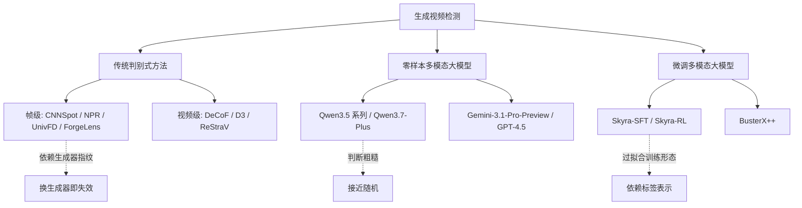
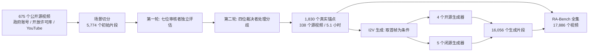
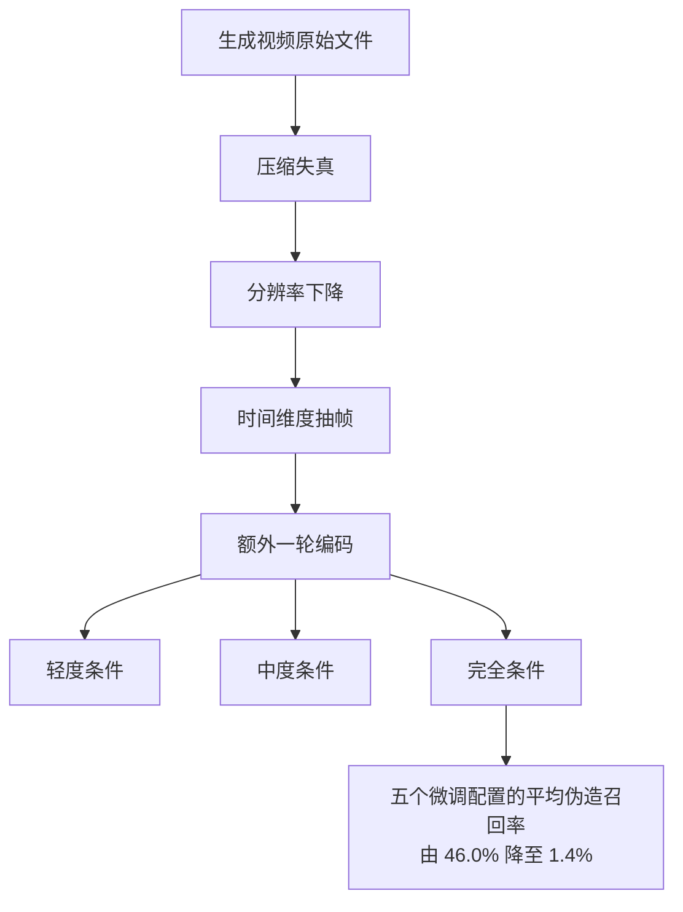

# 我们能防住针对真实危机事件的 AI 生成视频吗

> **原题**：Can We Defend Against AI-Generated Video Attacks on Real-World Crisis Events? A Systematic Evaluation of Detectors, Generators and Social Dissemination
> **作者**：Shuo Liang, Yixing Ma, Pengfei Zhou, Xingyan Chen, Zihan Mei 等 35 人，通讯与资深作者包括 Chunhua Shen、Yang You、Kaipeng Zhang、Wangbo Zhao
> **年份**：2026（arxiv ID 2608.14391，提交于 8 月 14 日）
> **分类**：cs.CV / cs.AI
> **链接**：https://arxiv.org/abs/2608.14391
> **精读日期**：2026-08-17

## 阅读须知

### 这篇在领域里的位置

生成视频检测这条线，过去三年大致沿着两级台阶往上走。第一级是把图像伪造检测的成熟做法搬到视频上：既然单帧图像可以靠 CNN 提取的低层统计痕迹来判定真伪，那么逐帧判定再投票，理论上也能识别一段生成视频。CNNSpot、NPR、UnivFD 这一类工作属于这一级。第二级则意识到视频有图像没有的东西，也就是时间维度上的连贯性。生成模型即便能把单帧画得很干净，帧与帧之间的运动是否符合物理，光照是否一致，物体边界是否稳定，这些是它容易露出破绽的地方。DeCoF、D3、ReStraV 这一类工作转而在时序特征上做文章。

与检测方法并行发展的是评测基准。GVF、GenVideo、GenVidBench、AIGVDBench 这几个基准解决的是"有没有统一的尺子"这个问题，它们各自收集了一批真实视频与一批生成视频，让不同检测器可以在同一批数据上比较。这篇论文的位置就在这里：它不提出新的检测器，而是指出现有的这把尺子量错了地方。已有基准的生成视频大多是内容中性的日常场景，比如一只猫在走路、一辆车在开，而真正会造成社会危害的生成视频是战争、灾难、公共卫生事件这一类有真实指涉对象的内容。在中性场景上测出来的高分，未必能迁移到危机场景上。

于是这篇论文构造了 RA-Bench，一个专门覆盖真实危机场景的评测基准，然后把三类检测方法在上面重跑一遍，看看那些漂亮的数字还剩下多少。

### 读完能回答什么

- 为什么在通用生成视频基准上表现良好的检测器，换到危机场景就接近随机猜测
- RA-Bench 用什么办法保证"真实锚点"这一侧的视频确实是真的，而不是已经混进了生成内容
- 什么是 RA-Bench-HumanProof 子集，它为什么比全集更难
- 社交平台的转发压缩为什么能把检测器的伪造召回率从 46.0% 打到 1.4%
- 微调过的多模态大模型检测器，为什么会对时间戳的表示形式产生依赖，而不是真正在看画面

### 阅读前置

假定读者熟悉深度学习的基本概念、分类器的常用评价指标，以及多模态大模型的基本用法，但未必专门做过伪造检测或者视频理解。文中出现的每个检测器与生成器都会在首次出现时说明它属于哪一类、大致怎么工作。

### 缩写表

- **RA-Bench**（Risk-Aware Benchmark）：本文提出的评测基准，围绕真实社会风险事件构造
- **RA-Bench-HumanProof**：上述基准的一个子集，只保留那些成功骗过全部人类审核者的生成视频
- **RA-Bench-LastMile**：模拟社交平台传播链条的退化协议，用来测试检测器在真实流通条件下的表现
- **MLLM**（Multimodal Large Language Model，多模态大语言模型）：能同时处理文本与图像或视频输入的大模型
- **I2V**（Image-to-Video）：以一张图像作为条件生成一段视频的生成方式，本文用真实视频的首帧作为条件
- **AUC**（Area Under the ROC Curve）：受试者工作特征曲线下面积，衡量二分类器在所有判定阈值下的整体排序能力，0.5 相当于随机猜测
- **TPR@5%FPR**（True Positive Rate at 5% False Positive Rate）：把误报率固定在 5% 时的检出率，比 AUC 更贴近实际部署时的取舍
- **BAcc**（Balanced Accuracy，平衡准确率）：对正负两类分别计算召回率再取平均，避免类别不均衡时的虚高
- **FakeR**（Fake Recall，伪造召回率）：所有生成视频中被正确识别为生成的比例
- **SFT**（Supervised Fine-Tuning，有监督微调）与 **RL**（Reinforcement Learning，强化学习）：两种把通用大模型改造成专用检测器的训练方式

## 一、问题

现在的视频生成模型已经可以合成出相当逼真的战争场面、自然灾害现场与突发公共事件画面。这件事的危险之处不在于画面本身好看或者不好看，而在于这类内容有明确的现实指涉：一段伪造的空袭视频会被当作某地正在遭受袭击的证据，一段伪造的洪水视频会影响真实的救灾资源调度。与之相对地，一段伪造的猫在走路的视频，即便画质完美，也不会造成同等量级的后果。

那么现有的检测器能不能防住这类内容？从公开基准上的数字看，答案似乎是肯定的。这些检测器在各自论文报告的测试集上，AUC 普遍落在 67.6% 到 98.6% 这个区间，其中不少已经接近实用水平。但作者提出的疑问是，这些数字是在什么样的数据上测出来的。已有的几个主流基准在收集数据时，关注的是生成模型的技术多样性，也就是尽量覆盖不同的生成架构与不同的画面类型，而不是内容的社会后果。换句话说，现有基准回答的问题是"检测器能不能分辨生成视频"，而社会真正需要回答的问题是"检测器能不能防住那些会造成危害的生成视频"。这两个问题在数据分布上并不重合。

前人工作在检测方法这一侧可以分成三条路线，每一条都有它做对的地方与不够用的地方。

第一条是传统判别式方法。它的基本假设是生成过程会在画面上留下统计意义上的指纹，比如上采样操作带来的频域异常，或者生成器特有的纹理模式。这一路的优点是轻量、可解释、推理成本低。它的问题在于这些指纹与具体的生成器强绑定，一旦换了一个训练时没见过的生成器，指纹就变了，性能随之崩塌。

第二条是零样本多模态大模型。它不做任何针对性训练，直接把视频喂给一个通用大模型，让它判断真伪。这一路的吸引力在于泛化性：大模型见过的世界足够广，理论上不依赖某个特定生成器的指纹，而是靠常识与物理直觉发现不合理之处。它的问题在于这种判断相当粗糙，模型往往说不清楚自己依据什么下的结论。

第三条是微调后的多模态大模型，试图把前两条路的优点结合起来，既保留大模型的语义理解能力，又通过监督信号让它学会关注伪造痕迹。这一路目前的成绩最好看，但也最容易过拟合到训练数据的具体形态上。这篇论文后面会给出一个相当尖锐的证据，说明这种过拟合可以严重到什么程度。

## 二、方法

这篇论文的"方法"不是一个新模型，而是一套数据集构造流程与三条相互独立的压力测试协议。理解它的关键在于，作者刻意让每一条协议都只施加一种压力，这样当检测器失效时，可以定位到失效的原因。

数据集这一侧的核心难题是真实性。如果要评测"生成视频能不能被识别出来"，那么作为对照组的真实视频必须确实是真的，否则整个评测就失去了地基。作者的做法是把来源限制在三类可追溯的渠道：政府与公共机构的官方账号、开放许可的素材库比如维基共享资源、以及 YouTube 上可核实来源的公开视频。从这些渠道收集到 675 个原始视频之后，先做场景切分，得到 5,774 个初始片段。

接下来是两轮人工审核。第一轮由七位审核者独立评估每个片段，评估维度包括画质是否达标、语义是否契合所属类别、时长是否合适、是否与其他片段重复、以及来源本身是否存在风险。第二轮由四位裁决者处理第一轮中意见不一致的片段。这个流程最终留下 1,830 个片段，来自 338 个不同的源视频，总时长 18,448 秒，大约 5.1 小时。从 5,774 到 1,830 这个筛除比例本身值得注意，超过三分之二的候选片段没有通过审核。

这 1,830 个片段被组织进 10 个一级社会风险类别与 44 个二级子类。一级类别包括天气与自然灾害、战争与武装冲突、政治与治理、公共安全、事故与基础设施、经济与社会恐慌、公共卫生、科技、太空与探索，以及大型公共活动。这个分类不是按画面内容分的，而是按一旦被伪造会引发何种社会后果分的，这一点决定了整个基准的取向。

生成这一侧，作者用了四个开源生成器与五个闭源生成器。开源侧包括 Wan2.2、LTX 与 Omni Weave 等，闭源侧包括 Runway、Kling、Seedance 2.0、Hailuo 与 Happy Horse。生成方式统一采用图生视频，也就是取真实片段的首帧作为条件图像，配以共享的提示词，让每个生成器基于同一个起点各自续写。这样做的好处是生成视频与真实视频在首帧上完全一致，检测器不能靠"这个场景看起来就很假"取巧，必须真的去看后续帧的生成痕迹。全部生成片段共 16,056 个，与 1,830 个真实锚点合在一起，构成 17,886 个视频的完整基准。所有片段统一到 3 到 15 秒，并用 H.264 重新编码，消除编码差异带来的额外线索。

在这个基础上，作者设计了两个额外的评测层。

第一个是 RA-Bench-HumanProof。作者请五位审核者对生成视频做真伪判断，把那些被全部五人一致判为"真"的生成视频挑出来，共 633 个。这个子集回答的问题很具体：那些已经骗过人类的视频，机器能不能兜住？如果检测器在这批视频上表现更差，那就意味着人与机器的失效模式是重合的，也就没有互补的余地。

第二个是 RA-Bench-LastMile，模拟视频在社交平台上流通时受到的退化。真实世界中一段视频从生成到被人看到，中间要经过多次转发、多次转码、多次压缩，画质不断损失。作者把这个过程拆成压缩失真、分辨率下降、时间维度抽帧与额外一轮编码，按强度分成轻度、中度与完全三档条件。这一层测的是检测器依赖的痕迹有多脆弱：如果那些生成指纹只存在于高码率的原始文件里，转发几次就没了，那么检测器在实际环境中就等于不存在。

评测指标这一侧，传统检测器输出的是连续分数，因此用配对 AUC 与固定 5% 误报率下的检出率。多模态大模型输出的是离散判断，因此改用平衡准确率、宏平均 F1 与伪造召回率。用两套指标而不是强行统一，是因为把连续分数硬卡一个阈值会引入额外的人为选择，反而模糊了模型本身的能力。

## 三、实验

先看传统判别式检测器这一组，共七个。它们在各自公开基准上报告的 AUC 落在 67.6% 到 98.6% 之间。换到 RA-Bench 上之后，七个检测器的平均 AUC 在面对开源生成器时落到 50.9% 到 57.3%，面对闭源生成器时落到 43.9% 到 54.0%。这里有两件事值得分开说。

第一件是绝对水平。AUC 等于 50% 意味着完全随机，而闭源生成器那一侧的下限已经是 43.9%，也就是说在某些生成器上，检测器的判断比随机猜测还要差，它系统性地把生成视频判成了真的。第二件是排序的稳定性。作者计算了检测器在 RA-Bench 上的排名与在公开基准上的排名之间的 Spearman 相关系数，结果只有 0.26。换句话说，一个检测器在公开基准上排第几，几乎无法预测它在危机场景上排第几，选型时参考公开榜单是不可靠的。

零样本多模态大模型这一组共十个配置，表现最好的是 Gemini-3.1-Pro-Preview，在二元判定提示下取得 63.4% 的平衡准确率，在诊断式提示下是 63.1%。这个数字比传统检测器好，但离可用还有很远的距离，而且方差很大：同一个模型面对 LTX 生成的视频能达到 74.5%，面对 Seedance 2.0 只有 54.3%。模型规模的作用也不稳定，Qwen3.5 从 0.8B 一路放大到 122B-A10B，收益在不同生成器上并不一致。

微调过的多模态大模型这一组给出了整篇论文最尖锐的一个结果。Skyra-SFT 使用官方时间戳格式时，平均平衡准确率为 61.8%，看上去不算差，但它的伪造召回率在不同来源之间从 16.4% 一路跨到 73.3%，稳定性很成问题。真正的问题出在下面这个对照上：作者把输入中的时间戳换成帧索引，其他一切不变，平衡准确率从 68.5% 掉到 54.4%。时间戳与帧索引描述的是同一件事，只是写法不同，画面内容一帧都没变。模型对这个改动如此敏感，说明它学到的相当一部分判据来自标签的表示形式，而不是视频本身。

BusterX++ 则暴露了另一种失效方式。它对真实视频的召回率高达 93.7%，但对生成视频的召回率只有 4.1% 到 9.1%。这不是一个检测器，而是一个几乎把所有输入都判成"真"的分类器，它的高准确率完全来自类别偏置。

| 检测器类别 | 代表配置 | 主要指标 | RA-Bench 上的结果 |
|---|---|---|---|
| 传统判别式（7 个） | CNNSpot / NPR / DeCoF 等 | 平均 AUC | 开源生成器 50.9-57.3%，闭源 43.9-54.0% |
| 零样本 MLLM（10 个） | Gemini-3.1-Pro-Preview | BAcc | 63.4%（跨生成器 54.3-74.5%） |
| 微调 MLLM | Skyra-SFT（官方时间戳） | 平均 BAcc | 61.8%，FakeR 跨度 16.4-73.3% |
| 微调 MLLM | Skyra（换用帧索引） | 平均 BAcc | 54.4-54.9%，由 68.5% 跌落 |
| 微调 MLLM | BusterX++ | FakeR / 真实召回 | 4.1-9.1% / 93.7% |

HumanProof 子集上的结果印证了作者最担心的一件事。在这 633 个骗过全部人类审核者的生成视频上，Gemini 的两种提示方式分别只有 54.7% 与 54.5% 的平衡准确率，七个传统检测器的平均 AUC 是 47.5%，低于它们在全集上的 48.7%。也就是说，人觉得难的视频，机器也觉得难，两者的失效是同向的。这个结论直接否定了一种常见的部署设想，即让人工审核与自动检测互为补充，因为互补的前提是两者的盲区不重合。

社交传播这一层给出的数字最为直接。在完全退化条件下，五个微调配置的平均伪造召回率从 46.0% 降到 1.4%。这几乎等于说，一段生成视频只要在社交平台上正常流转几轮，现有检测器就再也认不出它了。而现实中人们看到的视频，恰恰全都是流转过的版本，没有人从生成器的输出端直接取原始文件。

人类侧的评测数据同样值得记一笔。面对闭源生成器产出的视频，审核者只有 52.9% 的比例判断出它是生成的，其中 Seedance 2.0 只有 40.7%，Kling 只有 45.1%。低于 50% 意味着在这两个生成器面前，人的判断已经比抛硬币更糟。

消融实验这一侧，有一个结果值得单独拎出来。作者比较了均匀采样八帧与全局局部混合采样八帧两种输入构造方式，后者只带来 0.99 个百分点的 AUC 提升。这说明在固定的帧预算内重新分配注意力，收益非常有限，瓶颈不在于看了哪几帧，而在于检测范式本身。

## 四、局限

作者自己承认的局限主要是覆盖范围。整个评测围绕危机事件构造，因此结论未必能推广到其他视频类型或者其他检测场景。一个在危机视频上失效的检测器，在人脸伪造或者商品广告伪造上未必同样失效，反过来也成立。

除此之外，还有几处读完能看出来的问题。

第一是基准本身的时效性。九个生成器的能力停在 2026 年年中这个时间点上，而生成模型的迭代速度以月计。这篇论文测出的失效结论大概率会持续成立，因为生成质量只会更高，但具体数字会很快过期，作为选型依据的价值有限。

第二是评测口径的不完全可比。传统检测器用连续分数配 AUC，多模态大模型用离散判断配平衡准确率，两套指标各自合理，但跨组比较时只能定性不能定量。文中"零样本模型比传统检测器好"这一类表述，需要读者自己在心里打个折扣。

第三是那个时间戳与帧索引的对照虽然极具说服力，却只在 Skyra 这一个模型族上做了。它究竟是这一族模型特有的缺陷，还是所有微调式检测器的通病，从现有证据还判断不了。考虑到这个结论的分量，只有一个模型族的样本量偏薄。

第四是社交传播模拟与真实平台之间仍有距离。压缩、降分辨率、抽帧与重编码这四步覆盖了主要的退化来源，但真实平台还会叠加水印、字幕、画中画转发与二次剪辑，这些操作对检测器的影响未必与前四类同向。从 46.0% 到 1.4% 这个数字已经足够触目，真实条件下大概只会更糟，但严格来说它是模拟结果而非实测结果。

## 一句话

在专为真实危机场景构造的基准上，现有检测器的表现普遍接近或低于随机猜测，且经社交传播退化后伪造召回率降至 1.4%。
