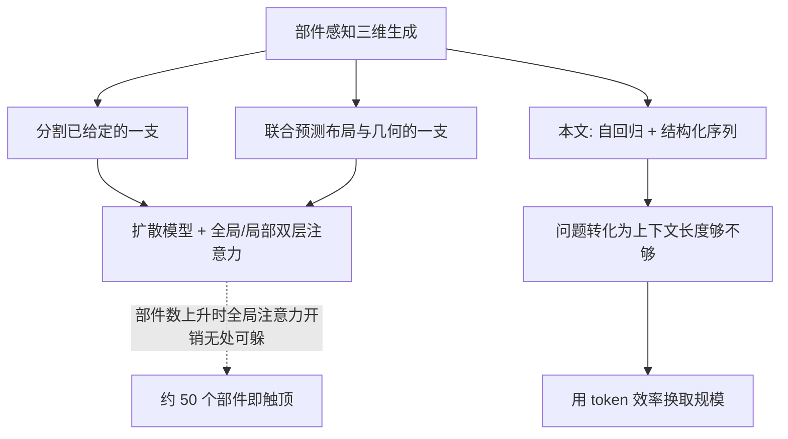
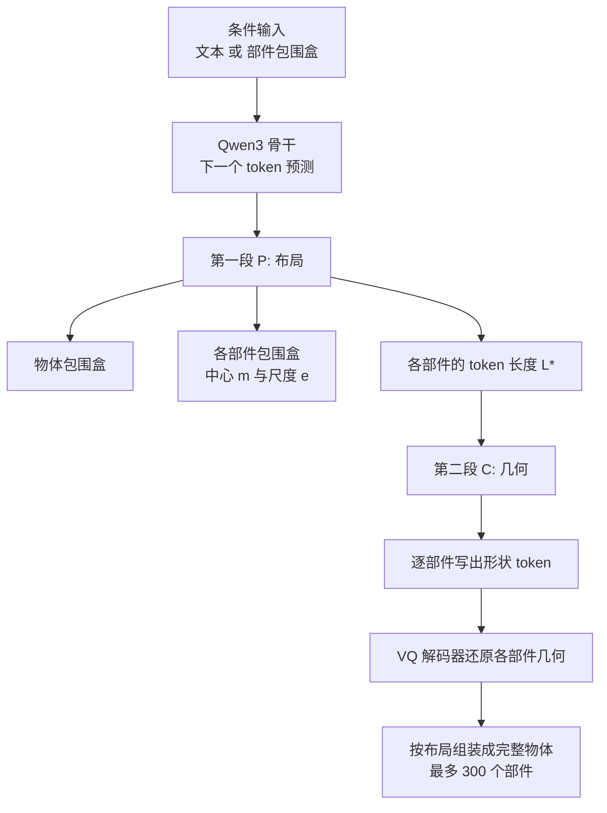

# MegaParts：把部件级三维生成推到 300 个部件

> **原题**：MegaParts: Scaling Part-Aware 3D Object Generation to 300 Parts via Token-Efficient Autoregressive Modeling
> **作者**：Manwen Liao, Xinyu Lian, Jian Mao, Kaixu Chen, Li Luo, Jinghao Yan, Wanshui Gan, Qiao Yu, Weitian Zhang, Chunhua Shen, Guang Chen, Bo Dai, Xudong Xu, Zhaoyang Lyu
> **机构**：上海人工智能实验室等
> **年份**：2026（arxiv ID 2608.14783，提交于 8 月 14 日）
> **分类**：cs.CV / cs.GR
> **链接**：https://arxiv.org/abs/2608.14783
> **精读日期**：2026-08-18

## 阅读须知

### 这篇在领域里的位置

三维生成这条线过去两年的主流是生成一个整体。给一段文字或者一张图，模型吐出一个完整的网格，看上去像那么回事，但它是一整块。对于观赏用途这没问题，对于要拿去用的场合就不够：想把椅子的靠背单独换个造型，想让机器人的手臂能绕关节转，想把一辆车拆成可以分别编辑的零件，都需要模型在生成的时候就知道哪一块是哪一块。这类工作被称为部件感知生成，也就是把物体表示成若干语义部件的有机组合，而不是一张连成一片的表面。

这个方向已有的工作大致分两支。一支假定分割是给定的，也就是有人先把物体拆好，模型只负责把每个部件的几何生成出来。另一支更进一步，让模型自己预测部件的布局，再生成各部件的几何。两支的共同点是，它们基本都建立在扩散模型之上，通过精心设计的全局与局部注意力来分别捕捉部件之间与部件内部的关系。

这篇论文的判断是，这种设计从根子上限制了规模。于是它换了一条路：不用扩散，改用自回归的语言模型，把整个物体写成一段结构化的 token 序列。这个换法本身不新鲜，真正的贡献在于它解决了换路之后立刻会撞上的那面墙，也就是序列长度。

### 读完能回答什么

- 为什么部件数量一多，现有的部件感知生成方法就变得代价高到不可行
- 什么叫自适应长度的 tokenization，它凭什么决定给某个部件多少个 token
- 因果注意力在形状 tokenizer 里起什么作用，为什么去掉它之后加大 token 预算反而收益变小
- 把一个三维物体写成一段 token 序列时，布局与几何是怎么排进同一条序列的
- 这套方法在 1024 个 token 的同等预算下，重建误差比对照方法低了多少

### 阅读前置

假定读者熟悉 Transformer、自回归语言模型的训练方式，以及自编码器的基本概念，但未必做过三维视觉。文中涉及的三维专门术语，例如 Chamfer 距离、法向一致性、网格与点云的区别，都会在首次出现时说明。不需要事先了解扩散模型的细节，只需要知道它是当前三维生成的主流路线之一。

### 缩写表

- **VQ-VAE**（Vector-Quantized Variational Autoencoder，向量量化变分自编码器）：一类把连续表示压缩成离散码本索引的自编码器，压出来的整数序列可以直接当作 token 喂给语言模型
- **tokenizer**（形状 tokenizer）：本文特指把三维几何转成离散 token 的那个编码器，与文本 tokenizer 是同一个角色，只是输入换成了形状
- **CD**（Chamfer Distance，倒角距离）：衡量两组点云差异的常用指标，对每个点找对方最近的点并累加距离，越小越好
- **NC**（Normal Consistency，法向一致性）：衡量重建表面的朝向与真实表面是否吻合，越高越好
- **IoU**（Intersection over Union，交并比）：两个区域重叠部分占并集的比例，本文用于部件与包围盒的对齐程度，越高越好
- **FID**（Fréchet Inception Distance）：衡量生成结果整体分布与真实分布差距的指标，越低越好
- **bbox**（bounding box，包围盒）：包住一个部件或整个物体的最小长方体，用中心点与三个方向的尺度描述
- **率失真**（rate-distortion）：信息论里的经典权衡框架，一端是编码所用的比特数即率，另一端是还原后的误差即失真

## 一、问题

先把痛点说具体。假设要生成一台机械设备，它有两百个零件。按照现有做法，每个零件都要用一段 token 序列来表示它的几何。若想保住细节，每个零件给一千个 token 并不算奢侈，两百个零件就是二十万个 token。自注意力的开销随序列长度平方增长，二十万这个量级在训练时的显存占用与计算量都不现实。于是实践中大家只能压缩每个部件的 token 数，而压缩的代价是几何细节丢失，生成出来的零件变成一团模糊的形状。

论文把这个矛盾概括得很干净：几何保真度与 token 效率之间存在直接冲突。用长序列表示每个部件可以保留精细几何，但总序列长度增长过快。按作者的说法，超过大约五十个部件之后，代价就已经高到难以承受。

这里值得停一下，说明为什么扩散路线在这件事上不占优势。扩散模型处理部件关系的方式，是设计两套注意力，一套管部件之间的相对位置与整体协调，一套管每个部件内部的细节。这种双层结构在部件数量少的时候工作得很好，但它要求模型在每一步去噪时都同时看到所有部件，因此部件数量增加时，全局注意力那一层的开销无处可躲。与之相对地，自回归模型天然是一个一个 token 往外吐，理论上只要上下文放得下就能一直生成下去，问题从"能不能同时处理"变成了"上下文够不够长"。这是一个更好对付的问题，因为长上下文训练已经有成熟的工程手段。

前人在形状 tokenizer 这一侧留下的空白，也是这篇论文的切入点之一。以往的 VQ-VAE 在训练时几乎只盯着一个目标，就是重建得像不像。没有人把"用了多少个 token"也列进优化目标里。结果是所有部件不论简单复杂，都拿到同样长度的 token 预算。一个圆柱形的螺栓和一个带曲面的外壳消耗同样多的 token，这在部件数量少的时候只是浪费，在部件数量多的时候就是致命的。

## 二、方法

整套方法由两层构成。下面一层是形状 tokenizer，负责把每个部件的几何压成尽可能短的离散 token；上面一层是一个语言模型，负责把布局与几何统一写成一条序列生成出来。两层各自解决前面提到的一个问题，前者管 token 效率，后者管规模。

先说 tokenizer。它是一个自编码器，但编码器的内部结构与常见做法不同。它的层交替执行两种操作：一部分层对输入的几何 token 做交叉注意力，把外部信息读进来；其余层对内部的隐变量查询做因果自注意力。写成式子是这样：

第 ℓ 层的隐状态 H 的更新规则，在属于交叉注意力的那些层里等于 CrossAttn(H_ℓ, T)，其中 T 是输入的几何 token；在其余层里等于 CausalSelfAttn(H_ℓ)。

这里的关键词是因果。因果注意力意味着靠前的隐变量看不到靠后的，于是训练过程会自然地把最要紧的几何信息挤到序列前面去。这个性质带来的直接好处是可截断：想省 token 的时候，直接把后面的截掉，前面留下的仍然是这个部件最本质的形状，而不是随机丢掉一部分细节。

有了可截断这个性质，才谈得上第二件事，也就是自适应长度。对每个部件，方法在一组候选长度里挑一个最优的，判据是一个率失真目标：

J(L) = D(L) + γ · R(L)

其中 D 是失真项，由三部分组成，倒角距离衡量形状差异，法向一致性衡量表面朝向是否对，包围盒交并比衡量整体尺寸位置是否对得上。R 是率项，写作 L / L_max，也就是所用 token 数占上限的比例。γ 控制两者的相对权重。这个式子做的事情很直白：简单的部件用几个 token 就能把失真压得很低，继续加 token 收益甚微却要付率的代价，于是最优解自然落在小的 L 上；几何复杂的部件则相反，失真下降得快，值得多给。整体效果是把有限的 token 预算按几何复杂度分配下去，而不是平均摊派。

训练这个 tokenizer 时还用了一个稳定性技巧。先做一段联合训练，之后进入交替阶段：只训编码器时冻住解码器，只训解码器时冻住编码器，两者轮换。后面的消融会显示这一步的分量不轻。

上面那一层是序列的组织方式。一个物体被拆成两段来写。第一段是布局，记作 P，它是所有部件描述符排成的序列。每个描述符包含三样东西：该部件包围盒的中心点 m，一个三维向量；包围盒的尺度 e，也是一个三维向量；以及这个部件被分配到的最优 token 长度 L*。第二段是几何，记作 C，按照第一段给出的长度，逐个部件把几何 token 写出来。

完整序列于是写成 Y = [P, C]。它的语义顺序是：先把所有部件的位置和大小一次性定下来，再回过头逐个填充每个部件的形状细节。之所以这样设计是因为，布局是全局性的约束，先确定下来可以让后续每个部件的生成都有明确的空间目标，不必在生成细节的同时还要操心自己会不会跟别的部件撞在一起。

骨干模型是微调后的 Qwen3，训练目标就是标准的下一个 token 预测。因为布局和几何写在同一条序列里，同一个模型既可以做无条件生成，也可以在给定部件包围盒的情况下做条件生成，后者相当于把序列的前半段固定住，只让模型续写后半段。工程上用了上下文并行与张量并行来支撑长序列训练。最终这套组合能处理多达 300 个部件、长度达到 256k token 的序列。

## 三、实验

训练数据来自公开与私有数据的混合，补充材料里提到了 ShapeNet 与 Objaverse 等来源。评测主要在 PartObjaverse-Tiny 这个公开的部件感知基准上进行，部件数量更高的那部分评测放在补充材料中。

第一组实验单独考察 tokenizer 的重建能力，对照方法是 Cube，双方都限定在 1024 个 token 的预算上。

| 指标 | MegaParts | Cube |
|---|---|---|
| 部件级 CD（×10⁻³，越低越好） | 0.12 | 3.95 |
| 部件级 NC（越高越好） | 0.93 | 0.89 |
| 物体级 CD（×10⁻³） | 1.52 | 1.89 |
| 物体级 NC | 0.89 | 0.85 |

部件级倒角距离从 3.95 降到 0.12，是三十倍以上的差距。这个数字之所以拉得这么开，是因为对照方法把 1024 个 token 平均分给各个部件，而本文的方法按复杂度分配，简单部件省下来的额度都补给了复杂部件。物体级的差距则温和得多，1.89 对 1.52，说明整体轮廓这一层面，两种做法本来就都能做好，差距主要体现在部件内部的细节上。

第二组是文本生成三维的比较，对照方法有 SAR3D、Cube、TRELLIS-text 与 ShapeLLM-Omni。

| 方法 | FID（越低越好） |
|---|---|
| MegaParts | 43.40 |
| TRELLIS-text | 54.81 |
| SAR3D | 94.69 |

CLIP 分数上 MegaParts 取得 0.27，在参与比较的方法中最高。

第三组是给定部件包围盒的条件生成，这一组最能体现部件感知的价值，对照方法是 FullPart 与 XPart。

| 指标 | MegaParts | FullPart | XPart |
|---|---|---|---|
| 部件 CD（×10⁻²，越低越好） | 3.01 | 8.59 | 8.01 |
| 部件 IoU（越高越好） | 0.63 | 0.41 | 0.52 |
| 包围盒 IoU（越高越好） | 0.94 | 0.76 | 0.59 |

包围盒交并比 0.94 这个数字值得单独说一句。它衡量的是生成出来的部件有没有老老实实待在指定的位置和尺寸里。对照方法分别是 0.76 与 0.59，也就是说它们经常会溢出给定的框。对于要把生成结果接进现有工作流的场景，这个指标的实际意义可能比 FID 更大，因为框不准就意味着后面还得手动调。

消融实验做了两项，都在 1024 token 的预算下测。去掉分阶段训练策略之后，部件级倒角距离从 0.12 升到 0.22，物体级从 1.52 升到 2.88。去掉因果注意力之后，部件级同样升到 0.22，物体级升到 1.92。

因果注意力那一项还有一个更值得注意的现象：去掉之后，加大 token 预算带来的收益明显变小。这条观察正好印证了前面方法部分的说法。因果结构的作用是把重要信息往前挤，从而让"多给 token 就能多保细节"这件事成立；一旦去掉，token 之间的重要性变得平均，多给的那些也就没有被用在刀刃上，自适应长度这个机制随之失去意义。换句话说，这两个组件不是各自独立的改进，后者是前者能够成立的前提。

## 四、局限

作者在第六节承认了两点。一是成本，长上下文的自回归生成在训练与推理两端的开销都仍然很大，物体越复杂越明显。二是范围，当前框架只建模几何，不涉及纹理、材质、语义标注，也不涉及部件之间的物理与功能关系。第二点对应用而言相当要紧：知道哪一块是哪一块，与知道这两块之间是铰链还是滑轨，是两件事，后者才是关节化真正需要的信息。

读完还能看出几处。

数据这一侧不够透明。训练集被描述为公开与私有数据的混合，具体配比与私有部分的规模没有交代。这让论文的可复现性打了折扣，也让人难以判断性能优势中有多少来自方法本身、多少来自数据。

评测规模与宣传口径之间存在落差。摘要突出的是 300 个部件与 256k token，但正文表格里的主要比较都在 PartObjaverse-Tiny 上完成，高部件数那部分被放到了补充材料。也就是说，最引人注目的那个数字，其证据强度低于其他结果。

骨干模型的规模没有写明。论文说微调 Qwen3，但没有给出参数量。在与那些不使用大语言模型的对照方法比较时，这个信息的缺失使得比较的公平性无法评估，读者无从判断优势有多少来自结构设计、多少来自骨干本身的容量。

最后是与扩散路线的比较口径。本文的核心论点是自回归比扩散更适合大规模部件生成，但实验里的扩散类对照方法都是在它们各自原本的设定下运行的，并没有一个把扩散方法也放到同等长上下文条件下去尝试的对照。这个论点在直觉上站得住，在实验上则还谈不上被严格验证。

## 一句话

用率失真准则按几何复杂度给每个部件分配 token 预算，把部件级三维生成推到 300 个部件与 256k 上下文。
