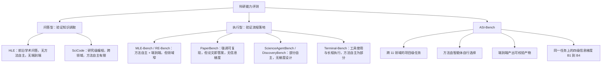
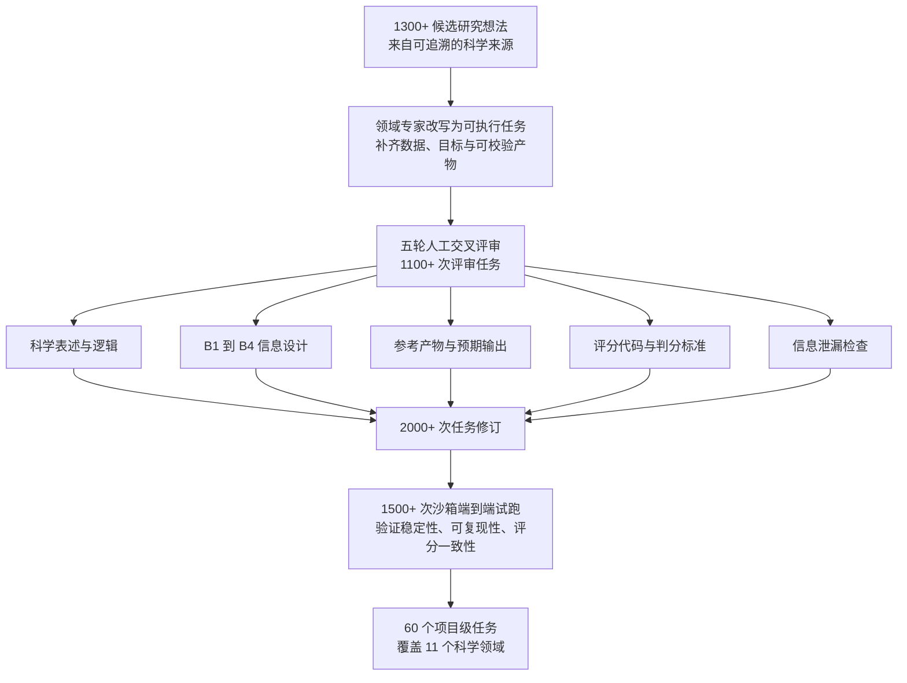
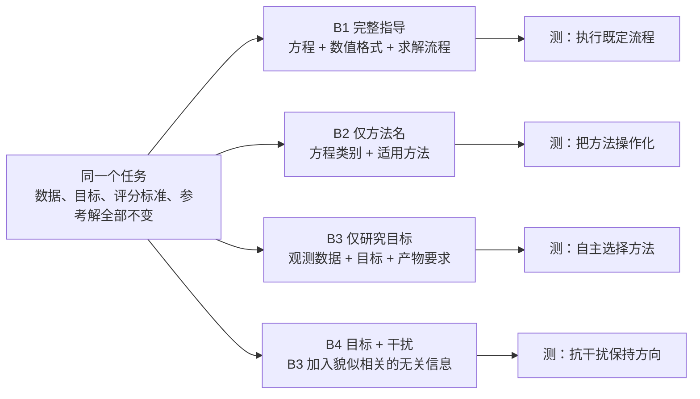
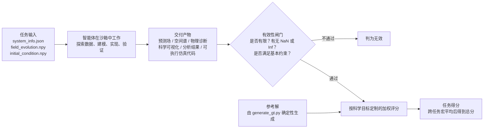

# ASI-Bench：人工超级智能的前夜

> **原题**：ASI-Bench: At the Dawn of Artificial Superintelligence
> **作者**：Junwei Zhou、Zhen Sun、Binyu Li、Jiangyu Zhou、Yuexi Pan 等 42 人
> **机构**：论文页面未列出机构归属，仅注明由四十余位领域专家共同构建
> **年份**：2026（arxiv ID 2608.17271，提交于 8 月 18 日）
> **分类**：cs.AI（ACM 分类 I.2.0）
> **链接**：https://arxiv.org/abs/2608.17271
> **精读日期**：2026-08-19

## 阅读须知

### 这篇在领域里的位置

评测大模型科研能力的工作，过去两三年大致沿着两条路径推进。第一条路径把科研压缩成一道题：给定一个有标准答案的问题，看模型答不答得对。HLE（Humanity's Last Exam，人类最后的考试）是这一路的代表，它把题目难度推到博士后水平，但形式仍然是问答。第二条路径把科研理解为工程执行：给定一个明确定义的任务，看智能体能不能在真实环境里把它跑通。MLE-Bench（Machine Learning Engineering Benchmark）与 RE-Bench（Research Engineering Benchmark）属于这一路，它们要求智能体真的写代码、真的训练模型、真的产出可验证的结果。

这两条路径各自解决了一部分问题，也各自留下了一个缺口。前者验证的是知识的调取，后者验证的是流程的执行，而真实科研里最难的那一步既不是调取也不是执行，是在没有人告诉你该用什么方法的情况下，自己判断该用什么方法。PaperBench 尝试过复现整篇论文，DiscoveryBench 尝试过让模型自己发现规律，但前者提供了完整的论文作为参照，后者的任务粒度仍然偏小。

ASI-Bench 位于这条脉络的下一步。它保留了工程执行路线的严格性，任务是项目级的、要在沙箱里真跑、产出可校验的产物；同时它引入了一个此前没有基准显式做过的设计，就是在同一个任务上分四级逐步撤走方法学指导，从「连求解步骤都写给你」一直退到「只给你数据和目标，方法自己找」。换句话说，这篇工作衡量的不是某个绝对分数，而是分数随着人类指导减少而下滑的那条曲线。

### 读完能回答什么

- 为什么把「有没有人给方法」做成同一任务上的四个档位，比再造一批更难的题目更能说明问题
- B1 到 B2 那 21.82 分的断崖具体断在哪一步，为什么它比 B2 到 B3 的 2.48 分更值得注意
- 为什么只给方法名（B2）反而比什么都不给（B3）消耗更多 token 与时间
- 同一个模型换一套执行框架，成绩为什么会差出百分之四十，这对「模型能力」这个说法意味着什么
- 花更多的钱是否换得来更强的科研能力，论文给出的三组成本与分数的对应关系说明了什么

### 阅读前置

假定读者了解大语言模型与智能体（agent）的基本工作方式，知道所谓智能体就是让模型在一个可以执行命令、读写文件、观察结果的循环里反复行动，也大致知道评测基准（benchmark）在这个领域里扮演的角色。不预设读者读过上面提到的任何一个具体基准，也不预设读者熟悉偏微分方程或任何一个具体科学领域，文中出现的领域细节都会现场交代。

### 缩写表

- **ASI**（Artificial Superintelligence，人工超级智能）：论文标题里的说法，指在广泛任务上超越人类的智能系统。这篇论文并不主张这样的系统已经存在，标题里的「前夜」是一种度量姿态而非结论
- **B1 到 B4**：本文的四级信息梯度，从完整方法学指导递减到只给研究目标并混入干扰信息。论文未解释字母 B 的来源
- **HLE**（Humanity's Last Exam，人类最后的考试）：以极高难度学术问答衡量前沿知识的基准
- **MLE-Bench**（Machine Learning Engineering Benchmark）：衡量机器学习工程能力的基准
- **RE-Bench**（Research Engineering Benchmark）：衡量人工智能研发工程能力的基准
- **PaperBench**：以论文复现为任务形式的基准
- **DiscoveryBench**：以数据驱动的规律发现为任务形式的基准
- **SciCode**：以研究级科学编程为任务形式的基准
- **ScienceAgentBench**：以数据驱动的科学分析为任务形式的基准
- **Terminal-Bench**：以终端工具使用与长程执行为任务形式的基准
- **harness**（执行框架，也译脚手架）：包裹在模型外面、负责组织工具调用与多轮循环的那一层软件。Codex、Claude Code、OpenHands 都属于这一层
- **artifact**（研究产物）：任务要求智能体交付的具体文件，例如预测出来的场、算出来的谱、画出来的图、跑得起来的代码
- **validity gate**（有效性闸门）：在打分之前先做的一道合法性检查，用来排除输出里含有 NaN（Not a Number，非数）或 Inf（Infinity，无穷）之类的无效值
- **PDE**（Partial Differential Equation，偏微分方程）：论文附录案例所属的数学对象
- **macro-average**（宏平均）：先在每个任务上算分，再对任务求平均，而不是把所有样本混在一起算

## 一、问题

现在的模型在考试类基准上的成绩已经很难再作为区分度了。分数逼近上限之后，继续把题目出难，只能证明模型记住的知识更多、推理链条能拉得更长，却回答不了一个更要紧的问题：如果没有人在旁边指着说「用这个方法」，它还剩下多少本事。这个问题不解决，后果是具体的。企业与实验室正在把智能体接进真实的研究流程，判断该给它多大的自主权，依据却是一批只测执行、不测判断的分数，于是自主权给多了会失控，给少了又等于把人力重新投回去，两头都不划算。

过去几年这个方向的努力大致分成两支。一支把科研任务拆成可自动判分的问答，好处是规模化容易、评分客观，代价是研究过程被压平成一次输出，中间那些试错、调参、否定自己再重来的部分全部消失。另一支把科研任务保留为端到端的工程，好处是过程真实、产物可验，代价是任务设定里通常已经隐含了方法，智能体做的仍然是执行而非选择。

旧路线卡住的地方正在于此。它们都是单点测量，给出的是「在某一种信息条件下得多少分」，而真实科研中的信息条件是连续变化的：有时导师给你整套流程，有时只丢给你一个名词，有时连名词都没有，甚至还夹杂着一堆看起来相关实则无关的线索。一个只在单点上测过的分数，无法告诉你系统在这条连续谱上哪一段开始崩溃。ASI-Bench 要解决的技术问题因此可以这样表述：在保持研究问题、数据、评分标准完全不变的前提下，把方法学信息作为唯一变量分级撤除，测出性能随之下滑的形状。

这个表述之所以关键，是因为它把「智能体行不行」这个模糊的判断，换成了一个可以定位的结构性问题。如果下滑主要发生在撤走详细步骤的那一档，说明瓶颈在把方法落实为流程；如果主要发生在撤走方法名的那一档，说明瓶颈在方法选择本身。两者对应的改进方向完全不同。

下面这张图把上述几个基准放在两个维度上对照，一个维度是任务是否需要端到端执行，另一个维度是方法是否由智能体自己决定。

图中最下面那一支是这篇论文自称的独有之处。前三条在既有工作里都能找到部分对应，第四条则是此前没有基准显式实现过的。

## 二、方法

整套设计可以拆成两件事：任务是怎么造出来的，以及信息梯度是怎么加上去的。先说前者，因为它决定了后者是否站得住。

### 任务构建

作者从可追溯的科学来源里收集了一千三百多个候选研究想法，最终保留六十个项目级任务，覆盖数学、物理、化学、生物、天文、材料、地球科学、医学与生物统计、计算机科学、机器人学、电气工程共十一个领域。这个从一千三百到六十的收敛比例本身就说明了筛选强度，投入的人力是三万一千多个专家小时。

保留下来的每个任务都包含固定的六件东西：科学目标、任务专属的输入数据、可执行的环境、需要交付的可校验产物、评分标准，以及一份参考解。这六件东西在 B1 到 B4 四个档位之间完全不变，变的只有提示词里给出多少方法学信息，这一点是整个设计的基石。如果不同档位之间连评分标准都换了，那么档位之间的分数差就无法归因于信息量。

质量控制分两条线并行。人工这一条走了五轮交叉评审，累计一千一百多次评审任务，检查的内容包括科学表述是否成立、B1 到 B4 的信息设计是否合理、参考产物与预期输出是否匹配、评分代码是否正确，以及是否存在信息泄漏，也就是提示词里有没有不小心把答案透出去。评审意见带来了两千多次任务修订。机器这一条走沙箱，累计一千五百多次端到端试跑，验证运行时是否稳定、参考解能否复现、产物能否生成、评分是否一致。凡是出现科学表述不一致、评分不可靠或存在意外捷径的任务，要么修订要么剔除。

### 信息梯度 B1 到 B4

这是全篇的核心机制。论文用附录里那个二维各向异性刚性动力学的案例来说明四个档位的差别，这个案例的科学内容是：给定一个周期性区域上的二维非线性系统的时空观测数据，要求预测未来的场并提取有物理意义的量。

**B1，完整方法学指导**。控制方程写给你，数值格式写给你，求解流程也写给你，智能体主要做的是把规定好的做法实现出来并跑通。

**B2，只给方法名**。完整流程被拿掉，只留下关于方程属于哪一类、哪些数值方法适用的提示，智能体必须把这条线索变成一个能跑的解法。

**B3，只给研究目标**。连方法学提示也拿掉，智能体拿到的只有观测数据、科学目标与要求交付的产物，它得自己判断背后的模型是什么、该选哪种数值方法、怎么实现、怎么验证。

**B4，研究目标加干扰**。在 B3 的基础上掺入看似合理实则与任务无关的信息，用来测试智能体会不会被带偏。

这四档分别对应四种能力：执行既定流程、把指定方法操作化、自主选择方法、在无关信息中保持方向。

### 评分链路

每个任务先过有效性闸门，检查输出是否有限、有没有 NaN 或 Inf、是否满足基本约束；通过之后再按针对该科学目标定制的加权标准打分，例如空间谱的准确度、物理诊断量是否正确。参考答案由 generate_gt.py 这样的脚本确定性地生成，保证可复现。需要说明的是，论文给出了「有效性闸门加加权标准」这个框架，但没有公开从单项分汇总到最终分数的具体公式，也没有给出评分者一致性的统计量，这一点后面会在局限里再提。

## 三、实验

被测的十八种配置由两部分组合而成。骨干模型一侧包括 GPT-5.6 Sol 的 ultra 与 xhigh 两档、GPT-5.5 的 xhigh 档、Claude Opus 5、Claude Opus 4.8、GLM-5.3、GLM-5.2、DeepSeek V4 Flash、DeepSeek V4 Pro、Kimi K3、Kimi K2.7、MiniMax M3，另外在消融里还出现了 MiMo V2.5 Pro。执行框架一侧包括 Codex、Claude Code、OpenHands、Kimi Code、MiMo Code。论文注明所有成绩都是在不给外部工具访问的条件下、跨任务宏平均得到的。

### 主结果

十八种配置在四个档位上的平均成绩如下。

| 档位 | 提供的信息 | 平均分 | 相对 B1 的落差 |
| --- | --- | --- | --- |
| B1 | 方程、数值格式、求解流程 | 50.91 | 基准 |
| B2 | 仅方程类别与适用方法 | 29.10 | -21.82 |
| B3 | 仅数据、目标与产物要求 | 26.62 | -24.29 |
| B4 | B3 加干扰信息 | 26.99 | -23.92 |

表现最好的是 Codex 搭配 GPT-5.6 Sol（ultra），B1 得 71.78，B2 得 49.57，B3 得 51.60。它是唯一一个在自主选择方法这一档越过 50 分的系统。

### 断崖断在哪里

这组数字里最值得注意的不是绝对水平，而是落差的分布。从 B1 到 B2，也就是方法还在、只拿掉详细流程，平均分掉了 21.82；而从 B2 到 B3，把方法本身也拿掉，只再掉 2.48。

换句话说，瓶颈并不在方法选择上。让智能体自己想出该用哪一类数值方法，代价其实很小；真正让它垮掉的，是把一个已知的方法变成一套完整可执行的研究流程。这个结论与直觉相反，因为在人类的经验里，「想出该用什么方法」通常被视为科研中最难、最需要品味的那一步，而「按方法把活干完」被视为体力活。论文的数据指向了相反的分工：现在的系统恰恰是体力活干不下来。

### 干扰几乎无效

B4 的成绩是 26.99，比 B3 的 26.62 还略高一点。这意味着掺进去的无关信息对结果几乎没有影响，其量级完全被流程性指导缺失所带来的损失盖过。这个结果本身也是有价值的：它说明当前系统的失败模式不是被带偏，而是压根走不完。

### 消融一：推理预算

把 GPT-5.6 Sol 从 xhigh 档提到 ultra 档，B3 成绩从 40.86 升到 51.60，涨了 10.74 分。这条对照说明，仅仅为了在人类指导减少的条件下达到中等水平，就需要额外投入相当可观的推理量。

### 消融二：执行框架的影响

同一个模型换一套框架，成绩可以差出很多。

| 模型 | 原生框架 | 换用 Claude Code | 变化 |
| --- | --- | --- | --- |
| MiMo V2.5 Pro | MiMo Code 16.17 | 23.25 | +7.08，相对提升约 44% |
| Kimi K2.7 | Kimi Code 19.72 | 27.34 | +7.62，相对提升约 39% |
| Kimi K3 | Kimi Code 36.22 | 37.09 | +0.87，几乎持平 |

这三行放在一起读会更有意思。较弱的模型换框架收益巨大，较强的 Kimi K3 换框架几乎没有变化。论文由此得出的结论是，科研能力不能只归到骨干模型头上，它是模型与执行框架相互作用的产物。从工程角度还可以再推一步：框架的作用更像是补足模型自身欠缺的流程组织能力，模型自己这部分能力足够强时，外部框架的边际价值就趋近于零。

### 消融三：计算开销

这是全篇最反直觉的一组数字。

| 档位 | token 消耗 | 执行时长 | 相对 B1 |
| --- | --- | --- | --- |
| B1 | 435 万 | 37.8 分钟 | 基准，开销最低 |
| B2 | 691 万 | 49.7 分钟 | token 多 59%，时间多 32% |
| B3 | 545 万 | 46.0 分钟 | token 多 25%，时间多 22% |
| B4 | 565 万 | 45.9 分钟 | token 多 30%，时间多 18% |

信息最少的 B3 并不是最贵的，最贵的是只给方法名的 B2。论文对此的解释是，只给出方法名并不会让研究变简单，反而把智能体锁在一个规定好的方向上，同时仍然要求它把缺失的流程细节自己重建出来。方向被限定而细节要自补，这两件事叠在一起比什么都不给还费劲。

作为参照，跑完全部六十个任务涉及两千六百多个交互轮次、两千四百多个执行步骤，智能体执行时间累计超过三十五小时。

### 成本与能力脱钩

论文给出的三组对应关系值得单独看。

| 配置 | B3 得分 | 单次运行成本 |
| --- | --- | --- |
| GPT-5.6 xhigh | 40.86 | 约 684 美元 |
| Claude Opus 5 | 40.70 | 约 2728 美元 |
| GPT-5.6 ultra | 51.60 | 约 1550 美元 |

前两行分数几乎相同，成本差了四倍；第三行分数最高，成本却低于第二行。论文的结论是，多花的钱并不直接转化为更强的科研能力。

## 四、局限

### 作者自己承认的

第一是覆盖面。十一个领域、六十个任务听起来不少，但作者明确写道，这只占「日益强大的人工智能系统应当被评估的科学挑战」中很小的一部分。

第二是工具访问。表 2 的成绩全部是在不允许外部工具访问的条件下取得的，作者也注明了这一点。真实科研中查文献、调用外部数据库是常态，放开这一条之后成绩会怎么变，论文没有回答。

第三是饱和度，这一条作者是当作优点写的：当前成绩普遍偏低，基准远未饱和，还留有区分未来系统的空间。

作者的总结陈述是：当前系统离可靠的自主科学发现还很远，即使最强的配置在 B3 上也只有 51.60；当前系统从逐步的方法学指导中获益，远多于从被告知该用哪个方法中获益。

### 读完能看出来的

**评分口径没有完全公开。** 论文描述了有效性闸门与加权标准这个两段式框架，但没有给出从单项到总分的汇总公式，也没有报告评分者一致性的任何统计量。在一个五轮人工评审、二十多位评审员参与的构建流程里，这个数字的缺席是可惜的，因为它恰恰是判断分数可信度的关键。同样，六十个任务在十一个领域之间如何分布，论文也没有给出，这意味着读者无法判断总分是否被某个任务多的领域主导。

**执行框架的巨大方差反过来削弱了模型比较。** 同一模型换框架能差出四成，这说明表里任何一行的成绩都是模型与框架的联合产物，而不同模型用的原生框架又各不相同。于是「模型 A 比模型 B 强」这个读法在这张表上其实很难成立，能成立的只有「配置 A 比配置 B 强」。论文自己指出了框架效应，但没有把它控制掉，例如让所有模型都在同一套框架下再跑一遍。

**参考解可能带来模态偏置。** B1 到 B4 四档共用同一份参考产物，好处是可比，代价是评分实际上倾向于某一种解法形态。在 B3 与 B4 这两档，智能体本可以走一条与参考解不同但同样正确的路线，而这样的解在与固定参考产物比对时未必吃得开。这个问题在越自主的档位上越严重，恰恰也是论文最看重的两档。

**统计强度不均。** 论文报告了标准差，但部分结果（例如 Claude Opus 5）来自单次运行。在一个单次运行成本高达两千多美元的评测里这可以理解，但据此比较相近的分数就要谨慎，例如上面那组 40.86 与 40.70 的对照，差距远小于多次运行可能的波动。

**缺少失败模式分析。** 全篇给出的是分数的下滑曲线，没有给出智能体究竟错在哪里的分类统计。既然核心结论是「瓶颈在把方法落实为流程」，那么最有说服力的补充证据应当是把 B2 档的失败轨迹归类，看看究竟卡在实现、调试、验证还是收敛判据上。这部分缺席使得核心结论虽然被数据支持，却还停留在现象层面。

**「人工超级智能」这个标题需要打折看。** 论文本身很克制，正文的结论是当前系统远未达到自主科研，标题里的「前夜」更像是对度量对象的命名而非对现状的判断。但读者在引用这个基准时，很容易把标题当成结论。

## 一句话

用同一任务上四级递减的方法学指导，测出智能体的瓶颈不在选方法，而在把方法落实成完整流程。
