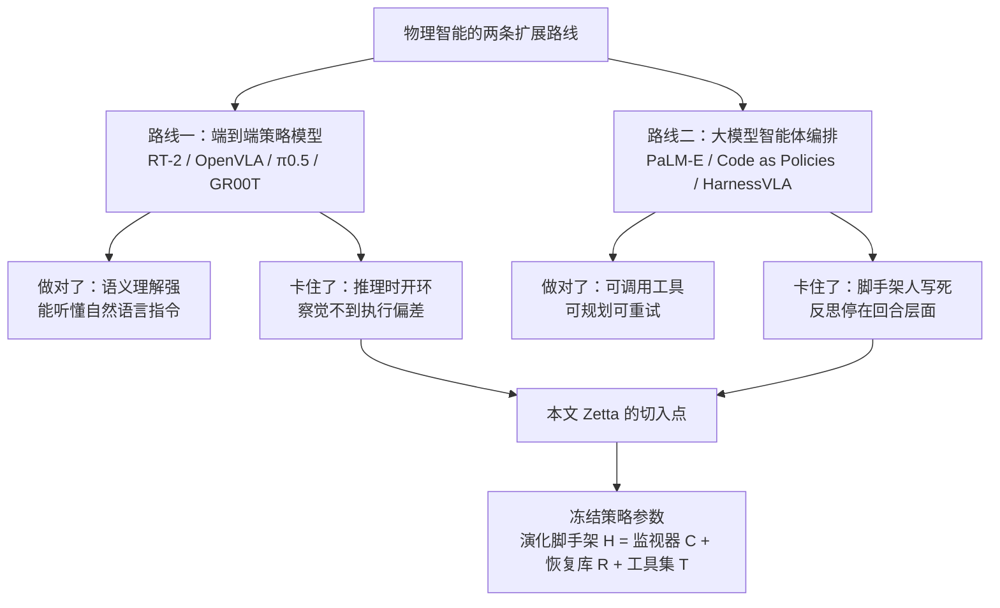
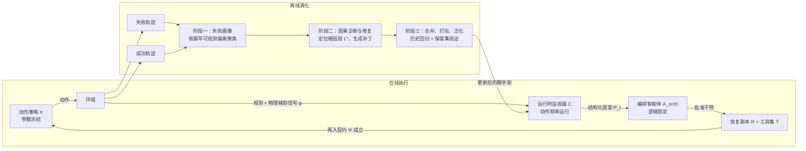
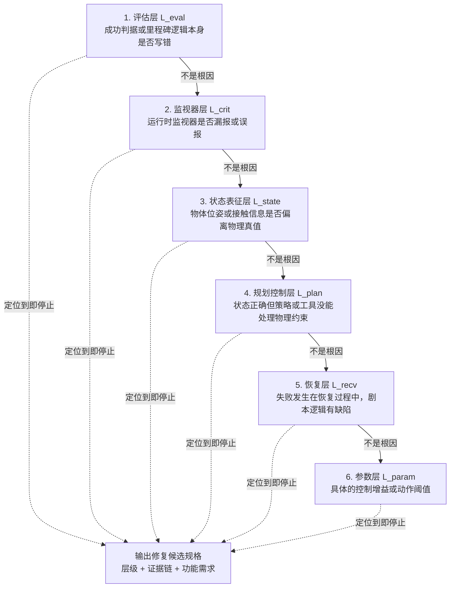
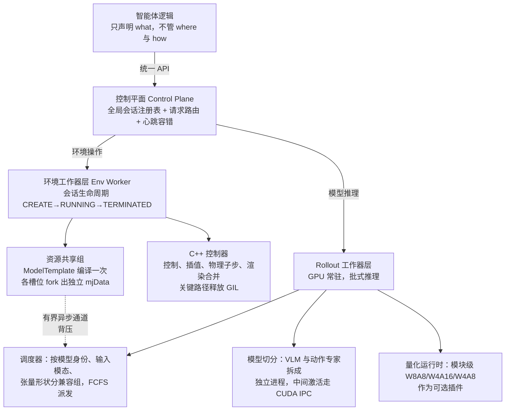
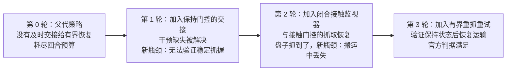

# Zetta：一个高效的闭环具身脚手架，让物理智能自己演化

> **原题**：Zetta ζ: An Efficient Closed-Loop Embodied Harness for Self-Evolving Physical Intelligence
> **作者**：Xin Ding, Liang Mi, Mingzhe Huang, Zixuan Wang, Chao Zhang, Zixu Hao, Fu Chen, Xiangyu Li, Yikai Zheng, Yaoyu Guo, Weijun Wang, Kun Li, Hao Wu, Yunxin Liu, Ting Cao（前六位并列第一作者）
> **机构**：清华大学智能产业研究院（AIR）；Z-Trans AI
> **年份**：2026（arxiv ID 2608.16590，提交于 8 月 17 日）
> **分类**：cs.RO
> **链接**：https://arxiv.org/abs/2608.16590
> **精读日期**：2026-08-20

## 阅读须知

### 这篇在领域里的位置

机器人操作这几年的主线是把一个足够大的策略模型训练到可以直接从图像与语言指令输出关节动作，也就是所谓的视觉语言动作模型（VLA）。这条路线的代表是 RT-2、OpenVLA、π0 系列以及英伟达的 GR00T，它们共同的做法是把海量的人类遥操作示范数据喂进一个多模态模型，让模型把"看到什么、被要求做什么、应该怎么动"这三件事端到端地学在一起。这条路走通了一部分：模型确实获得了相当好的语义理解能力，能听懂"把红色的杯子放到烤箱旁边"这样的自然语言。但它也留下了一个始终没有被解决的缺口，即示范数据永远是有限的，而真实部署环境的分布是漂移的，一旦执行中出现示范数据里没有覆盖过的小偏差，模型自己既察觉不到也纠正不了。

于是出现了第二条路线，即不再指望单一策略模型包办一切，而是在它外面套一层由大语言模型驱动的智能体，用代码、工具、规划与记忆去编排这个策略模型。这一路线的近期代表包括 PaLM-E、Code as Policies 这样的早期工作，以及 HarnessVLA、Anthropic 的 Claude Plays Robotics 这样的近期系统。这层外壳在文献里通常被称作 harness，本文译作"脚手架"。第二条路线的共同问题在于，脚手架本身通常是人写死的：它在一次任务里可以重试，可以在事后反思，但反思出来的东西很难沉淀下来变成下一次执行时真正生效的机制。

这篇论文位于第二条路线上，它要回答的是脚手架本身能不能自己长大。具体的答案是：把底座策略模型的参数完全冻结，把演化的对象换成脚手架里那些用代码写成的运行时监视器与恢复动作，让系统在自己跑出来的失败轨迹里学会该监视什么、该怎么救。

### 读完能回答什么

- 为什么"事后反思"这种形式对物理执行几乎无效，而"运行时监视"能够成立
- 在完全不更新策略模型权重的前提下，成功率还能从哪里来
- 三个时间尺度的环各自在管什么，为什么必须拆成三个而不是一个
- 六层因果诊断的优先级顺序为什么是自上而下的，"最小干预"这条原则要防的是什么
- 为什么一篇讲物理智能的论文要花整整一章写 rollout 基础设施，吞吐量和智能有什么关系

### 阅读前置

假定读者熟悉深度学习的基本训练流程与 Transformer 结构，用过 PyTorch，对强化学习里的 rollout、episode、seed 这几个概念有直觉，但未必专门做过机器人操作，也未必了解 MuJoCo 这类物理仿真器的内部机制。文中涉及机器人学的部分，例如末端执行器位姿、抓取谓词、阻抗控制，都会在首次出现时先解释再使用。

### 缩写表

- **VLA**（Vision-Language-Action model，视觉语言动作模型）：输入图像与语言指令、直接输出机器人动作的端到端策略模型
- **WAM**（World-Action Model，世界动作模型）：在 VLA 基础上额外建模环境动态的一类策略模型
- **EEF**（End-Effector，末端执行器）：机械臂最前端的执行部件，本文语境下通常是二指夹爪
- **PnP**（Pick-and-Place，抓取放置）：机器人操作里最基础的一类任务，抓起一个物体再放到指定位置
- **EOD**（Earliest Observable Divergence，最早可观测偏离）：一条失败轨迹与成功轨迹分布首次拉开距离的时刻
- **SR**（Success Rate，成功率）：本文所有主表的核心指标
- **SLO**（Service Level Objective，服务等级目标）：工程上对延迟上限的约定，本文用 200 毫秒
- **FCFS**（First-Come-First-Served，先到先服务）：一种调度策略
- **GIL**（Global Interpreter Lock，全局解释器锁）：CPython 的一把大锁，同一进程内同一时刻只允许一个线程执行 Python 字节码
- **CUDA IPC**（CUDA Inter-Process Communication）：英伟达提供的进程间共享显存的机制，避免张量在进程之间来回拷贝
- **W8A8 / W4A16 / W4A8**：量化方案的记法，前一个数字是权重位宽，后一个是激活位宽
- **AE**（Action Expert，动作专家）：π0.5 这类模型里负责把语义表征解码成具体动作的那一半
- **LIBERO-Pro**：LIBERO 基准的加强版，通过受控扰动来检验模型是不是只在背答案
- **RoboCasa**：一个大规模厨房场景仿真基准，本文用它的 18 个 Atomic-Seen 任务

## 一、问题

一个真实的机器人在抓一个酒瓶的时候，可能会发生这样的事：夹爪确实合上了，也确实把瓶子提了起来，但接触面不够正，走到一半瓶子从指间滑掉。此时策略模型完全不知道自己手里已经空了，它会继续按照原计划把空爪送到碗的上方，做一个漂亮的、无意义的松手动作，然后这一局判定失败。这个失败的代价并不在于最后那个动作错了，而在于错误发生在几百毫秒之前，而系统在那几百毫秒里没有任何机制去发现它。

这就是端到端策略模型在部署时最典型的失效方式。这类模型在推理时是前馈的、开环的：它把当前观测映射成一段动作块然后执行，中间没有一个环节回过头来问"我刚才那一下真的做成了吗"。一个微小的扰动，比如物体轻微滑移或者一次不构成损坏的碰撞，会在长时程任务里级联成彻底的失败。数据规模本身解决不了这个问题，因为示范数据教的是"正确的时候该怎么做"，而失败恰恰发生在正确轨迹之外。

第二条路线试图用智能体来补这个缺口，让大模型在回合结束之后回看录像、诊断原因、修改计划，然后重试。这个思路在数字世界里是行得通的，Reflexion、Self-Refine、Voyager 这些工作已经把它验证得相当充分。但把它搬到物理世界上会撞上一堵墙，而这堵墙的名字是频率。

物理交互要求决策跟着机器人与环境的状态一起变，而这个状态的变化尺度是毫秒级的。今天的大型智能体模型做不到在毫秒级的预算内给出决策，一次调用动辄几百毫秒到几秒。所以现有系统只能退而求其次，把反思放在回合层面或者轨迹层面。论文指出，这种事后反思有三个先天缺陷：智能体没法在线试一下别的动作来验证自己的反思对不对；把功劳与过错分摊到一整条轨迹上本身就是困难的；回溯分析往往拿不到失败发生那一瞬间的精确状态。结果是反思出来的经验既难以复用，也支撑不了有效的学习。

本文要解决的技术问题因此可以写成一个清晰的陈述：在完全不改动底座策略模型参数的前提下，能否让脚手架自己从失败中长出一套在动作频率上运行的监视与恢复机制，并且让这套机制随着 rollout 经验的累积持续提升成功率。

## 二、方法

### 2.1 把问题写成一个治理与演化的双层结构

论文把长时程操作任务形式化成一个带权限约束的治理过程，这个过程里有些东西是固定不变的，有些东西才是演化的对象。分清这两类是理解全文的关键。

固定不变的有两样。第一样是动作策略 π，它在观测 s_t 与目标 g 的条件下生成低层动作 a_t = π(s_t, g; θ)，其参数 θ 满足约束 ∇θ = 0，也就是说全程不做任何梯度更新。第二样是编排智能体 A_orch，它是一个固定的多模态推理算子，扮演高层指挥官的角色，负责审核实时证据并批准执行模式的切换，它的决策逻辑在演化过程中同样保持不变。

演化的对象是脚手架 H，论文把它定义成一个三元组：

H = {C, R, T}

其中 C 是运行时监视器（Runtime Critic），一组高频运行的监控函数，持续扫描到当前时刻为止的轨迹 τ_{0:t}，产出一个结构化提案 P_t = C(τ_{0:t}) = ⟨e_t, σ̂_t⟩。这里 e_t 是可审计的失败证据，例如发生了碰撞或者进度停滞，σ̂_t 则是建议切换到的执行模式。需要强调的是监视器只提案不动手，它既不执行动作也不宣布成功。R 是恢复剧本库（Recovery Playbook），一个把具体失败机制映射到应对策略的结构化库。T 是异构工具集，包含规划器、抓取检测器、恢复模块这类可执行组件，它在演化中会被生成、实例化、挑选与精修。

执行时的最终模式 σ_t 由裁决函数决定：

σ_t = A_orch(P_t, R, T, K)

其中 K 是任务知识上下文，包含预先定义的里程碑、成功判据与环境约束。σ_t = 0 表示交给 VLA 或者 WAM 执行，σ_t > 0 表示切到某个专用工具。这个协议强制了一种证据驱动的决策方式：监视器虽然在高频运行，但一次干预只有在证据 e_t 被编排智能体确认并接受之后才被允许发生。换句话说，高频的那一层只负责看，低频的那一层才有权批。

演化的驱动力是离线的演化智能体 A_evo，它分析失败 rollout 数据 D_fail 并迭代改进脚手架：

H^(k+1) ← A_evo(D_fail^(k), H^(k))

整个系统的优化目标是在 π 与 A_orch 都不变的前提下找到使期望成功率最大的脚手架配置 H*。

### 2.2 三个时间尺度的环

论文最核心的设计判断是：闭环治理与自我演化必须拆到不同的时间尺度上，因为它们对延迟的要求相差好几个数量级。

第一个环是**监视器治理的动作环**（Critic-Governed Action Loop）。它以动作频率运行学到的监视器，在必要时调用对应的恢复技能。这一层之所以能跑在动作频率上，是因为监视器是代码而不是模型：一段检查接触力振荡幅度或者夹爪开度的 Python 函数，执行成本可以忽略不计。

第二个环是**批次候选优化环**（Rollout-Batch Candidate Optimization Loop）。它在每一轮迭代结束后对失败做聚类与诊断，然后提出候选的监视器与恢复动作。这里有一个技术难点：技能与代码没有梯度，无法直接做梯度下降。论文借鉴 SkillOpt 与 EmbodiSkill 的做法，在代码空间上构造一个类似随机梯度下降的优化过程，其核心是把每次更新限制成有界的、稳定的小步改动，避免一次改动把已有能力打乱。

第三个环是**验证门控的技能更新环**（Validation-Gated Skill Update Loop）。它只接纳那些确实提升了成功率、并且能跨 rollout 泛化的候选，把它们写进技能记忆。前一个环负责提出，这一个环负责把关。

第一个环让执行成为闭环，第二与第三个环让脚手架能够自我演化。

### 2.3 三个设计原则，各自要防的是什么

论文把设计动机组织成三条挑战与三条对应原则，这一节值得逐条看，因为它解释了很多看起来繁琐的机制为什么必须存在。

第一条挑战是冻结底座模型的开环语义与物理之间的落差，也就是本文第一节讲的那个滑瓶子的例子。对应的设计原则是**高频状态治理**：给冻结的模型配上解耦的、运行频率高于策略推理频率的监视器，在偏离刚出现的最早时刻就触发干预。

第二条挑战叫**过参数化修复的泛化陷阱**，这一条是全文最有洞察力的部分。判定物理失败的根因是困难的，临时性的调试往往退化成"针对这个失败实例把某个低层控制参数调到能过为止"。这种修复解决了眼前的故障，却破坏了策略模型语义泛化所依赖的动作分布，于是在没见过的种子上性能严重下降。对应的原则是**面向最小干预的层级因果诊断**：诊断智能体必须严格按优先级自上而下地遍历诊断层，遵守"如果高层逻辑能解决，就绝不改低层参数"这条纪律，从而在最小的有效层上打补丁，保住底座模型的完整性。

第三条挑战是专家在环调试的可扩展性。靠人去分析并修补长尾任务分布里的每一个失败实例既昂贵又根本无法扩展。对应的原则是自动化的演化泛化，并且强制一套保留集泛化协议。

### 2.4 阶段一：失败画像与基线建立

演化周期的第一步是在预定义的开发种子集上大规模采样策略 π 的行为，目的是建立一条不带任何治理干预的纯策略基线。

这一步在工程上强制了两个确定性维度。其一是**确定性路由**：所有 rollout 任务都经由中心化的资源调度器分发，调度器依据计算节点的实时负载与显存阈值来路由，从而保证同一批次内的所有 rollout 跑在完全相同的软件容器、仿真器版本与硬件配置下，消除来自环境异质性的观测噪声。其二是**有效性判定与隔离**，系统显式区分基础设施故障与策略故障。只有当一次 rollout 完整产出了传感器数据与视频证据，它才被计入有效集合 V。对于网络波动、仿真器崩溃这类基础设施层面的无效尝试，系统用原始逻辑种子强制重跑直到产出有效轨迹，确保 V 的统计分布不会因为非策略因素而漂移。这一条在做实验的人看来是常识，但把它写进协议并且真的执行，是很多复现失败的分水岭。

每一条有效轨迹以只追加的方式保留完整观测流，形式化为一个多模态时间序列 τ = {(s_t, a_t, μ_t, φ_t)}，其中 μ_t 记录任务语义里程碑的完成状态，φ_t 捕捉碰撞强度与接触力向量这类物理辅助信号。

轨迹被整理成两个仓库。成功参考索引 I_succ 按里程碑聚合成功轨迹，它揭示的是任务成功的"名义分布"，也就是正常情况下这一步应该长什么样，后续所有偏离都以它为基准来度量。失败种子清单则引入了一个叫**首个缺失里程碑** m* 的概念，定义为有序里程碑序列里第一个在轨迹中没有被观测到的元素。m* 有两个用处：它给失败提供了一个粗粒度的聚类判据，同时把因果诊断的搜索空间收窄到从 m*−1 到 m* 这段转移上的证据。

### 2.5 阶段二上半：失败聚类与因果诊断

诊断不按最终结果做表面归类，而是按**最早可观测偏离**来聚类。t_EOD 定义为轨迹中状态分布首次与 I_succ 描述的健康分布拉开距离超过阈值 ε 的那个时刻。把 t_EOD 与首个缺失里程碑、机器人与物体的相对位姿、当前激活的工具编号放在一起，就得到了一个失败签名，据此把失败清单切成互不相交的簇。每个簇里选一个**中心种子**，即特征空间中最接近簇中心的那个样本，作为深入诊断的主要对象，这样既降低了计算开销，也更容易提取出机制层面的不变量。

诊断阶段还有一条容易被忽略但很实在的规定，叫**单视角接地观测协议**。多模态模型在多个摄像机视角之间来回切换时容易产生空间推理不一致与幻觉，所以诊断智能体必须先指定一个主视角，选取标准是能最清楚地同时展现末端执行器、目标物体与关键接触面的那个角度。一旦主视角确定，整个诊断过程中的所有视觉推理都必须锚定在它上面。如果主视角提供的证据不足，系统被强制回退到仿真器内部状态、传感器轨迹与物理信号 φ_t 去做跨模态验证，而不允许切换视角。

诊断的主体是自上而下的层级因果排查，诊断层空间共六层，排查顺序是固定的：

这个顺序的用意在于把最容易被误伤的东西放在最后。参数层的改动是最诱人的，因为它总能让眼前这一例过关，但它同时也是最容易破坏底座模型动作分布的。把它放在优先级末尾，等于在制度上劝阻了这种修法。

### 2.6 阶段二下半：修复与再入契约

修复智能体的目标是实现一个最小补丁，只解决诊断定位到的那一层，同时严格保住底座策略的完整性。补丁的内容包括监视器增强，也就是开发或精修用于检测该失败前兆条件的高频监控函数；以及恢复剧本的起草与工具的适配或合成。

这里有一个设计上很关键的构件，叫 **VLA 再入契约**。恢复动作把控制权抢过去之后，什么时候能还回给底座策略，不能凭感觉。契约定义了一个逻辑谓词：

Ψ(s_t) = 𝟙(FailureCleared) ∧ 𝟙(Stability(s_t) > γ)

前一项是布尔函数，验证构成证据 e_t 的那些具体条件，例如碰撞风险或者位姿偏离，已经被恢复动作彻底解除。后一项评估物理辅助信号 φ_t，确保机器人与物体之间的连接已经到达物理平衡，具体度量的是接触力矩振荡的幅度与抓握力，γ 是稳定性阈值。两个条件同时成立才允许交接。这条契约防的是一类很隐蔽的二次失败：恢复动作刚把物体重新抓好，瞬态动力学效应还没消散就把控制交还回去，策略模型接手的是一个仍在晃动的状态，于是立刻又掉一次。

补丁实现之后要过两步闭环验证。第一步是**诊断回放**，确认增强后的监视器现在能正确识别出偏离点 t_EOD。第二步是从初始状态重新跑一次**全新的闭环 rollout**。只有当任务到达目标里程碑，并且期间所有干预都合规地经过编排智能体裁决、符合再入契约，这个补丁才算通过。

### 2.7 阶段三：合并、打包与泛化

泛化智能体负责把针对单个种子的补丁抽象成能解决整个失败簇的机制层面不变量。合并操作分三路进行。**监视器统一**把单个监控函数抽象成一个统一监视器，做法是对触发条件取逻辑或，并动态调整噪声阈值，使它在簇内多样的初始条件下都能可靠检测。**恢复整合**把种子专属的剧本抽象成能应对同一失败模式的形态变体的通用版本，并标准化再入谓词。**工具集扩展**不仅调优已有算子，还纳入修复阶段新合成的可执行脚本，这些脚本封装了高精度阻抗控制这类超出底座模型能力范围的专门物理技能。

合并结果被外化成一个自包含的、可版本管理的软件包，目录结构是这样的：SKILL.md 声明高层治理逻辑，包括里程碑定义、编排裁决规则与泛化后的再入谓词；tools/ 存放监视器与工具集的可执行实现；plans/ 存放泛化后的恢复剧本，把具体证据映射到结构化的干预策略；params/ 存放定义数值边界与阈值的配置文件。把演化出来的能力做成一个可以拷走的目录，是这套方法能够谈"零样本迁移"的物质基础。

最终脚手架要过双重评估。**历史回归**要求它把原簇内所有失败 rollout 全部解决，成功率必须是百分之百。**保留集评估**在严格隔离的数据集上进行，用相对基线策略的成功率增量来量化演化的有效性。还有一条动态转换协议：如果保留集评估暴露出新的失败机制并触发了对脚手架的改动，系统强制执行数据隔离策略，把那个原本属于保留集的种子重新划归开发集，并且必须另选一批全新的、从未见过的种子来做最终验证，这一轮迭代才能关闭。

### 2.8 Z-Infra：为什么吞吐量是智能的速率限制

闭环让脚手架能够从自我探索中学习，而这个学习过程立刻把 rollout 吞吐量变成了智能扩展的瓶颈：环境是学习数据的来源，所以 rollout 跑得越快，演化就越快。论文因此提出了 Z-Infra，据作者所知是第一个专门为自演化具身智能体设计的 rollout 基础设施。

它要处理的第一个挑战是**资源异质性**。一次 rollout 会同时索取好几种性质完全不同的算力：MuJoCo 与 robosuite 这类环境在步进时消耗宿主机的 CPU 与内存，而其常规渲染管线又要用 GPU；策略模型需要 GPU 做自回归或扩散式的动作生成；轻量感知模型可以共享 GPU 但延迟要求不同；坐标变换与碰撞检测这类基础算子则是纯 CPU 计算，延迟期望在微秒量级。没有任何单一的资源池或调度策略能同时满足这些工作负载。

第二个挑战是**执行动态性**。与数据并行模式可预测的训练管线不同，智能体 rollout 的执行剖面天生不可预测：智能体依据运行时观测动态决定调用哪个工具，某一个时间步可能只需要一次策略调用，下一个时间步却可能串起感知、规划与多次基础算子。会话在不规则的时刻被创建、暂停与销毁，导致 GPU 推理需求呈突发状，批大小与到达间隔方差都很大，静态资源分配因此低效。

解法是引入一个把智能体逻辑与硬件资源管理彻底解耦的抽象层。智能体只与一个虚拟 rollout 接口交互，声明要执行什么，而不关心在哪里执行以及怎么执行。

控制平面是协调中枢，它维护一个全局会话注册表来跟踪会话与环境工作器编号的绑定关系，使得请求分发不需要智能体自己去管工作器拓扑。工作器健康通过周期性心跳监控，某个环境工作器失效时网关会检测到超时，把受影响的会话标记为 LOST 并通知智能体重建。

环境工作器层引入了会话抽象来支撑长生命周期的智能体与环境交互。要接入一个新的环境家族，开发者只需实现四个原语：init 从配置字典构造环境，reset 依据任务参数重置到初始状态，step 执行动作并返回观测、奖励与终止标志，obs_schema 声明观测的结构与编码。一个归一化层把各家族特有的观测翻译成统一格式，也就是带有声明好的形状与数据类型的命名张量字典，从而让上层代码与具体环境家族无关。

针对 MuJoCo 系环境的并行 rollout，论文实现了一个**资源共享组**优化，把模型编译与渲染上下文的建立成本摊到多个会话上。共享组把环境模型编译一次成为 ModelTemplate，保留可复用的只读 mjModel 表示与初始仿真状态，每个槽位通过 fork 原语从这个模板初始化，于是不可变的模型资源被复用，而每个槽位维护自己的 mjData 与回合状态。为了让这种共享在多线程下真正有效，环境步进例程被用一个高性能 C++ 控制器重写，把控制执行、动作插值、物理子步与渲染合并在一起，最小化 Python 侧开销，并在关键路径上释放 GIL，使同一进程内的多个槽位能够并行推进各自的物理与渲染负载。

Rollout 工作器层的调度器把到达的推理请求按模型身份、输入模态与张量形状归入兼容组，然后以先到先服务的方式把成批的请求派发给空闲工作器。这一层还有两个针对策略模型的具体优化。**模型切分**利用了 π0.5 这类架构里两个阶段计算特性迥异的事实：视觉语言模型负责把观测与指令编码成潜在表征，动作专家负责用扩散或自回归方式把表征解码成运动指令。把两者部署成独立进程并各自调度，中间激活通过 CUDA IPC 传递以避开昂贵的传输开销，对 PyTorch 实现的 π0.5 而言，这一策略相比单体部署把平均推理延迟降低了 53%，并在 200 毫秒的服务等级目标下把有效吞吐提升到 2.4 倍。**量化运行时**作为可选插件存在，与常见大模型服务框架的整模型量化不同，它对策略模型内部的不同模块分别量化，并与模型切分协同设计。在 RTX 4090 上对 π0.5，目前的做法是对计算密集的前缀 MLP 模块用 W8A8，其余模块保持 BF16 以避免额外开销，在 LIBERO 上取得 1.18 至 1.32 倍加速且不损失成功率。

整套基础设施建在 Ray 之上，每个环境工作器与 rollout 工作器都是一个 Ray actor，通过放置策略绑定到专属的 GPU 或 CPU。三层之间的通信围绕五条有界 Ray 通道组织，把控制流与数据流分开，有界这一点使得背压能够生效，防止级联过载。

## 三、实验

### 3.1 实验设置

评测在 LIBERO-Pro 与 RoboCasa 两个基准上进行，硬件是配备 8 张 NVIDIA GeForce RTX 4090 的集群，用于并行 rollout 与加速离线演化（Z-Infra 的性能评测另用 8 张 A100）。两个基准各自使用不同的冻结底座策略：LIBERO-Pro 用 π0.5，RoboCasa 用 GR00T N1.5。全程不对这两个底座做任何权重微调。

两个基准的泛化协议不同，需要分开说清楚。RoboCasa 走的是**随机分布泛化**：每个任务随机采样 50 个环境种子用于开发与演化，每一轮从这 50 个种子收集失败轨迹并按签名聚类，每个簇选中心种子做诊断与修复，最终评估在另一组与开发集不相交的 50 个种子上进行。LIBERO-Pro 走的是**开发到测试泛化**：每个任务随机采样 50 个开发种子（排除种子 1 到 20），迭代持续到开发种子上的成功率达到 50% 以上，最终评估则专门在被严格隔离的种子 1 到 20 上进行。

### 3.2 主结果

RoboCasa 的 18 个 Atomic-Seen 任务上，相比冻结的 GR00T 后训练模型，宏平均成功率从 73.56% 提升到 93.56%，绝对增益 20.00 个百分点。改进在所有任务上都成立，在接触密集或长时程的任务上尤其显著。

| 任务 | Pure VLA (GR00T) | Zetta | 任务 | Pure VLA (GR00T) | Zetta |
|---|---|---|---|---|---|
| T1 NavigateKitchen | 78 | 96 | T10 OpenCabinet | 62 | 94 |
| T2 TurnOnMicrowave | 74 | 92 | T11 CloseFridge | 92 | 98 |
| T3 PickPlaceCounterToStove | 78 | 94 | T12 SlideDishwasherRack | 76 | 94 |
| T4 PickPlaceSinkToCounter | 58 | 96 | T13 TurnOnElectricKettle | 88 | 94 |
| T5 PickPlaceDrawerToCounter | 48 | 86 | T14 OpenStandMixerHead | 96 | 100 |
| T6 PickPlaceCounterToCabinet | 62 | 80 | T15 CloseBlenderLid | 50 | 100 |
| T7 PickPlaceToasterToCounter | 72 | 96 | T16 OpenDrawer | 90 | 94 |
| T8 TurnOnSinkFaucet | 74 | 96 | T17 CloseToasterOvenDoor | 82 | 96 |
| T9 CoffeeSetupMug | 70 | 86 | T18 TurnOffStove | 74 | 92 |
| **宏平均** | **73.56** | **93.56** | | | |

LIBERO-Pro 覆盖 Goal 与 LIBERO-10 两个套件、两种扰动设置，共 40 个任务与设置的组合。T 表示任务或指令重定向扰动，即指令被改写指向另一个合法的目标物体或目标条件；S 表示位置交换扰动，即相关物体的初始位置被交换或重排而指令保持不变。相比冻结的 π0.5，总体宏平均从 32.00% 提升到 71.13%，绝对增益 39.13 个百分点。

| 套件与设置 | π0.5 | Zetta | 增益 |
|---|---|---|---|
| Goal (T) | 31.0 | 92.5 | +61.5 |
| Goal (S) | 38.0 | 89.0 | +51.0 |
| LIBERO-10 (T) | 50.0 | 63.0 | +13.0 |
| LIBERO-10 (S) | 9.0 | 40.0 | +31.0 |
| **总体宏平均** | **32.00** | **71.13** | **+39.13** |

在 40 个任务与设置的组合里，Zetta 在 32 个上有提升，在其余 8 个上与基线持平，没有出现下降。这一点比平均值本身更有说服力，因为第二条设计挑战正是要防止修复引起的性能倒退。

### 3.3 演化曲线与"顿悟时刻"

论文用累积演化轮次作为横轴，展示成功率如何随经验增长。在 RoboCasa 的 18 个任务上，四轮全局反思与修复把宏平均从 73.56% 依次推到 78.71%、84.85%、90.54%、93.56%，每个检查点都保留了此前验证通过的监视器、恢复与工具能力。在 LIBERO-Pro 的 Goal 套件上，Goal-T 从 31.0% 经 67.5%、89.5%、92% 到 92.5%，Goal-S 从 38.0% 经 39.5%、70.5%、83% 到 89.0%。

更有意思的是论文称作"顿悟时刻"的现象，也就是成功率在若干轮停滞之后突然跃升。作者把它定义为在单个失败簇的演化过程中，跨若干个被挑选出来的累积内部版本追踪成功率所观察到的不连续跳变。需要说明的是这些检查点是离线诊断与修复过程中的中间产物，既不是独立的外层 rollout，也不涉及任何额外的策略训练。

| 任务 | 纯策略 | 第一轮 | 第二轮 | 顿悟点识别出的瓶颈 |
|---|---|---|---|---|
| Goal-T2 酒瓶入碗 | 10% | 15% | 95% | 抓握保持，加入运输前验证稳定性的保持监视器 |
| Goal-T8 酒瓶上盘 | 5% | 10% | 60% | 完整的接触到抓握到保持序列 |
| Goal-S6 奶油奶酪入碗 | 0% | 5% | 90% | 接触前阶段的语义接近，而非松手时机 |
| TurnOnElectricKettle | 88% | 88% | 94% | 末端执行器重新对齐可恢复策略期望的几何 |
| SlideDishwasherRack | 76% | 76% | 94% | 接触丢失后重建居中接触 |
| CloseToasterOvenDoor | 82% | 82% | 96% | 居中接触 |

这些案例的共同形态是：早期修订处理的是局部症状或者只对特定失败回合过拟合，因此收益微小；一旦智能体分离出真正的物理瓶颈变量，成功率就出现陡峭的不连续上升。以 Goal-T2 为例，第一轮引入预抓取分级来改善接近几何，但成功率只从 10% 挪到 15%，因为它没有触及运输途中的物体丢失；第二轮识别出抓握保持才是决定性瓶颈，实现一个在运输前验证稳定性的保持监视器，成功率直接跳到 95%。Goal-S6 的路径相反但同样说明问题：第一轮做的是防止过早松手的释放门控，属于晚期症状，成功率停在 5%；第二轮把注意力移到接触前阶段，认识到主要瓶颈是接近过程中缺乏语义进展，一个经过标定的语义抓放恢复同时解决了接近、抓取与运输三处失败。

### 3.4 零样本迁移

论文考察的第二个扩展轴是跨任务迁移，即在源任务上发现的机制能否直接应用到未经演化的目标任务上。

在 RoboCasa 的抓放任务上，源任务 PickPlaceCounterToStove 经三轮演化产出三项能力：物体相对的预抓取对齐、抓握丢失后的有界重抓、稳定放置。这一累积栈不经任何额外训练或演化直接施加到三个目标任务上：

| 目标任务 | 迁移前 | 迁移后 |
|---|---|---|
| PnP-Sink | 58% | 82% |
| PnP-Cabinet | 62% | 80% |
| PnP-Toaster | 72% | 90% |
| **宏平均** | **64%** | **84%** |

在铰接交互任务上，源任务 TurnOffStove 演化出目标定位、碰撞感知的接近、稳定接触三项技能，零样本迁移到 TurnOnSinkFaucet、OpenCabinet、TurnOnMicrowave，宏平均从 64% 提升到 80%。在 LIBERO-Pro 上，从 Goal-T8 迁出的三项能力用到 Goal-S3 时把结果从 9/20 提升到 20/20。

论文对迁移能够成立的解释是：这些机制作用在与任务无关的物理变量上，例如末端执行器对齐与接触稳定性，而不是记住了源任务的轨迹。附录 C 与 D 给出的伪代码支持这个说法，两段算法的判别条件全部写成物体相对几何与通用物理谓词，例如"是否报告抓握丢失或保持不稳"，与具体是炉灶还是水槽无关。

### 3.5 失败前沿的推进

一个值得单独看的案例是 LIBERO-Pro 的 Goal-S5，任务是把盘子推到炉灶前方。这个案例展示的不是单个回合内的多次干预，而是连续几轮晋升如何把最早未解决的失败不断往后推。

第 2 轮与第 3 轮使用了完全相同的环境种子与策略随机数，因此这两轮之间的差异可以直接归因于搬运重试机制本身，这是全文里少数几个做了严格受控对比的地方。

作为对照，RoboCasa 的抓放案例展示的是另一种组合方式：在单个长时程回合内先后触发三种不同的恢复。策略模型完成抓取并开始搬运，物体滑脱时监视器检测到抓握丢失并中断名义轨迹，恢复动作执行受控的重新接近并建立新抓握；重抓位姿不可行时，监视器报告接近几何无效，恢复动作调用 GraspGen 合成一个可行的末端位姿；接近目标时，最后一个监视器检测到近目标放置风险，交给基于 CAP 的稳定放置恢复。每次局部修复之后，只有在恢复状态被验证通过后控制权才交还。

### 3.6 Z-Infra 的性能

吞吐与延迟的评测在 8 张 A100 上进行，用 LIBERO Goal 任务，并发级别取 1、8、16、32、64，三个对照分别是带 Z-Infra 的完整系统、不带 Z-Infra 的同一套脚手架、以及基线系统 RPent。

| 并发 | Z-Infra 吞吐 | 无 Z-Infra 吞吐 | RPent 吞吐 | Z-Infra 延迟 | 无 Z-Infra 延迟 | RPent 延迟 |
|---|---|---|---|---|---|---|
| 8 | 12.18 ep/min | 2.71 ep/min | 1.10 ep/min | 39s | 34s | 392s |
| 16 | 22.09 ep/min | 2.88 ep/min | 1.72 ep/min | 43s | 112s | 513s |
| 32 | 32.8 ep/min | 显存溢出 | 显存溢出 | 57s | - | - |
| 64 | 35.1 ep/min | 显存溢出 | 显存溢出 | 95s | - | - |

在并发 16 这个两个基线还能运行的最高点上，Z-Infra 的吞吐是不带它的 7.7 倍、是 RPent 的 12.8 倍。延迟这一侧的对比更能说明架构差异：不带 Z-Infra 的版本在并发从 8 提到 16 时延迟从 34 秒爆到 112 秒，而 Z-Infra 从并发 8 的 39 秒到并发 32 的 57 秒只涨了 46%。RPent 的延迟则是天然就高，从 392 秒到 513 秒，原因是它采用智能体在环的设计，每个决策点都要调用一次大模型接口。Zetta 之所以能避开这一项开销，正是因为它把智能体的介入全部挪到了离线的反思与演化阶段，在线 rollout 跑的是纯策略加上轻量的代码监视器。

## 四、局限

### 作者自己承认的

全部实验都在仿真中完成，没有任何真机结果。论文在结论里把真机列为下一步工作，具体设想是弥合仿真到现实的差距，并把真实机器人环境作为一等公民接入 Z-Infra，与仿真环境并列。这一点对本文的主张影响不小，因为方法里多处依赖仿真器能够提供的内部状态。

论文在摘要与引言里两次使用"在我们当前的 rollout 预算下"这个限定，并明确说随着 rollout 经验增加还会有额外收益，这等于承认演化并未收敛，报告的数字是一个尚在上升的曲线上的某个点，而不是方法的能力上限。

### 读完能看出来的

**摘要里的 90.8% 是子集平均。** 主表显示 LIBERO-Pro 全部 40 个任务与设置组合的宏平均是 71.13%。摘要那个 90.8% 实际是 Goal(T) 的 92.5% 与 Goal(S) 的 89.0% 的平均，把表现明显更弱的 LIBERO-10 两档排除在外了，后者演化后分别只有 63.0% 与 40.0%。LIBERO-10 恰恰是长时程任务套件，而长时程正是论文主张自己最擅长的场景，所以这个取舍值得读者自己在心里换算一遍。此外 LIBERO-10 (S) 里仍有三个任务停在 0% 或 5%。

**加速倍数取决于挑哪个工作点。** 摘要写 11.1 倍推理加速（对应引言的延迟下降 91%），4.6 节开头写 11.9 倍，图 14 在并发 16 处标注 12.0 倍。这些数字都成立，但它们各自来自不同的并发级别：11.9 倍是并发 16 处的 513 秒比 43 秒，而在并发 8 处同样的对比是 392 比 39，约 10.1 倍。摘要那个 11.1 倍究竟对应哪个工作点，论文没有说明。

引言里"有效 rollout 吞吐从 1.7 提升到 35.1 episodes/min，20.6 倍"这一句更值得留意。1.72 是 RPent 在并发 16 的数字，35.1 则是 Z-Infra 在并发 64 的数字，两者不在同一工作点上。由于两个基线在并发超过 16 之后都会显存溢出，这个比值在同一条件下原则上无法取得，它比较的是各自能达到的最好状态，而不是同一负载下的差距。

**没有真正意义上的消融。** 论文没有给出逐个移除三个环、逐层关闭因果诊断、或者去掉再入契约之后的对照表。所谓的顿悟曲线用的是"被挑选出来的累积内部版本"，也就是说 v0、v1、v2 是人为选取的检查点，中间实际尝试过多少个候选、失败了多少次、每一轮消耗多少智能体调用，全文没有报告。从科学论证的角度，这使得"顿悟"这个观察更接近一个叙事而非可量化的现象。

**保留集在协议上会被消耗。** 动态转换协议规定，一旦保留集暴露出新的失败机制并触发脚手架改动，该种子就转入开发集，然后另选一批新的保留集。这条规则本身是诚实的，但它允许无限次重抽：只要愿意继续演化，保留集就会被一批一批消耗掉，而每一批被消耗的种子都已经参与过一次修复。到最后一轮时，"从未见过"这个统计学意义已经被稀释了多少，论文没有量化。

**样本量小到刻度粗糙。** LIBERO-Pro 的最终评估每个任务只用 20 个种子，所以表 3 里所有数字都是 5 的倍数，一次成功与否就等于 5 个百分点，任务级别的差异基本落在噪声里。RoboCasa 用 50 个种子，刻度是 2 个百分点，略好但也谈不上宽裕。论文在部分图上标了 Wilson 95% 置信区间，但主表没有给。

**编排智能体用的是哪个模型没有交代。** 形式化那一节把编排智能体描述为"固定的多模态推理算子"并引了三条参考文献，分别是 Claude Sonnet 4.5、GPT-5.5 与 GPT-5.6，但实验设置一节只写了两个底座 VLA，没有说实际用的是哪一个作为编排与演化智能体。演化一轮要花多少次模型调用、多少 token、折合多少费用，全文没有出现任何数字。这对一篇把可扩展性作为核心卖点的论文来说是个不小的空白，因为"替代专家在环调试"这个主张的成立与否，最终取决于自动化的成本是否真的低于人工。

**监视器依赖仿真器可读的物理信号。** 再入契约里的稳定性判据度量的是接触力矩振荡幅度与抓握力，失败聚类用到物体与夹爪的相对位姿，官方抓取谓词更是仿真器直接给出的。这些量在仿真里是免费的，在真机上要么需要额外的力矩传感器与视觉估计，要么根本拿不到。方法迁移到真机时，监视器这一层需要重写的比例可能远大于论文的叙述所暗示的。

**评估层被放进了可修改的诊断范围。** 六层诊断的第一优先级是评估层，检查的内容是"成功判据或里程碑进度逻辑是否有错"。允许智能体在诊断根因时修改评测逻辑本身，在方法论上是一个需要额外守卫的入口。论文没有说明这一层的改动是否被人工复核，也没有报告实际发生过多少次评估层修复。在一个用成功率作为唯一优化目标的自动化循环里，这是最需要被封住的一条捷径。

## 一句话

冻结策略模型不动，只让代码写的运行时监视器与恢复技能在失败中自我演化，用三个时间尺度的环把高频治理与低频学习分开。
