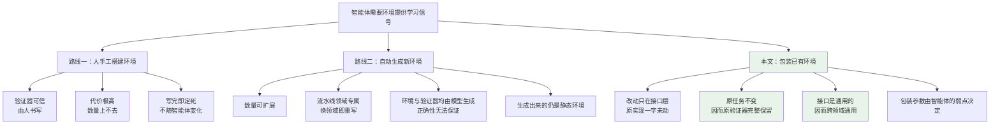
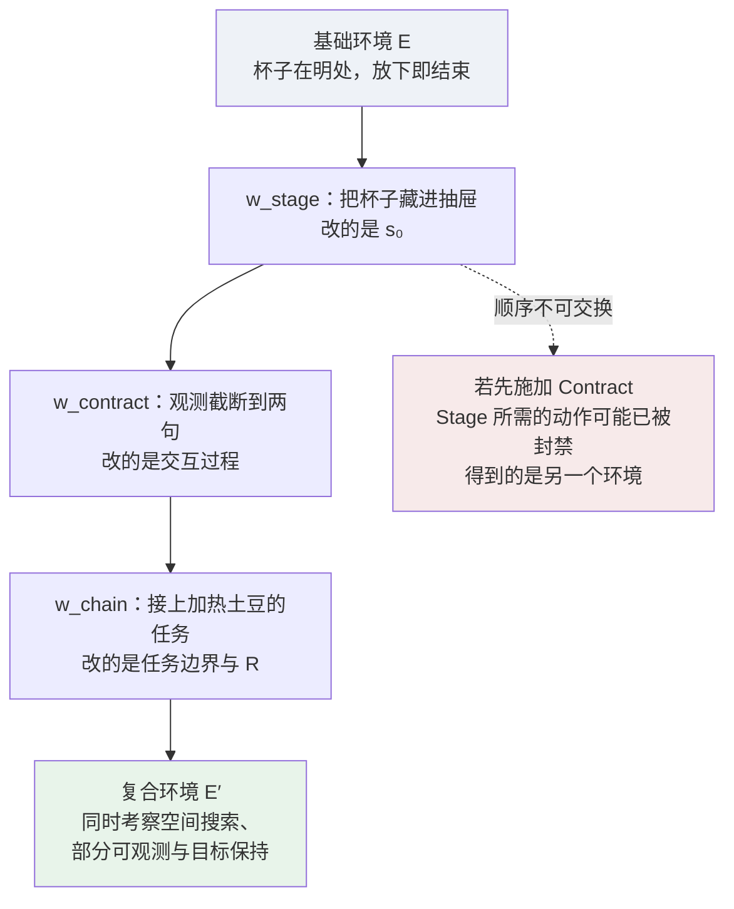
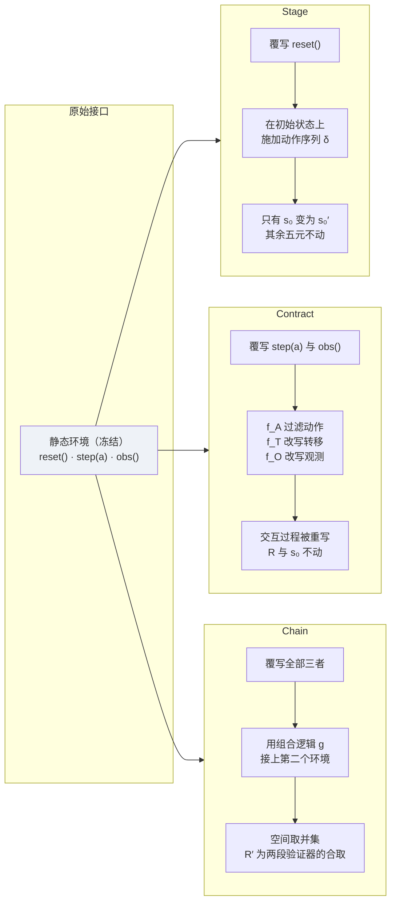
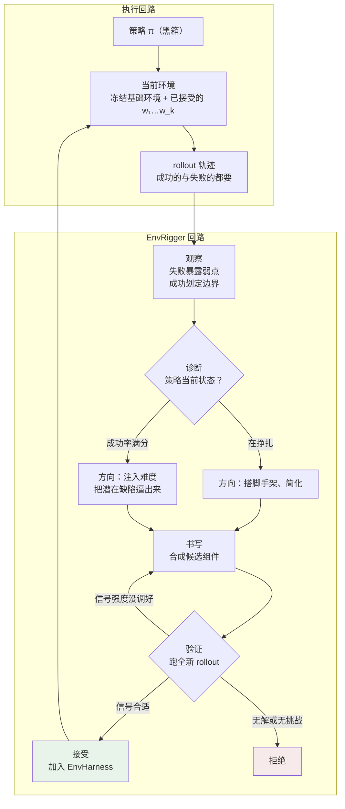
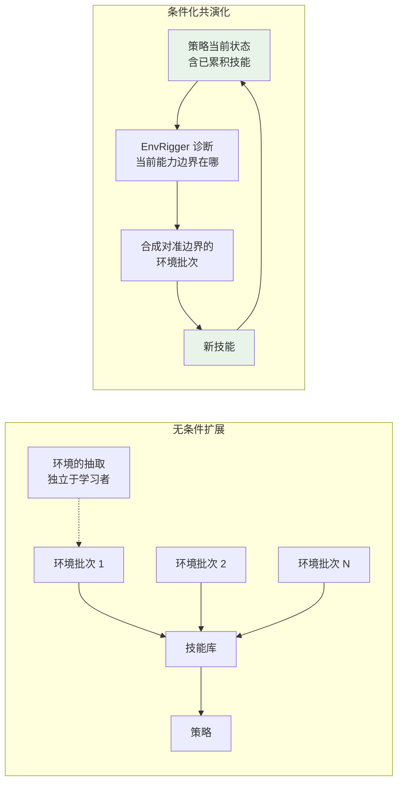

# EnvHarness：唤醒静态世界，让环境自己迎着智能体的弱点长

> **原题**：EnvHarness: Awakening Static Worlds for Agent Learning
> **作者**：Chengsong Huang, Zifeng Wang, Rujun Han, Jun Yan, Yanfei Chen, Zoey CuiZhu, Ke Jiang, Peng Xia, Han Yu, Yufan Zhuang, Yifei Ming, Jiaqi Pan, Bhavana Dalvi Mishra, Jiaxin Huang, Burak Gokturk, Tomas Pfister, Chen-Yu Lee
> **机构**：华盛顿大学圣路易斯分校、Google Cloud AI Research、Google Cloud、北卡罗来纳大学教堂山分校
> **年份**：2026（arxiv ID 2608.19880，2026 年 8 月 20 日提交）
> **分类**：cs.AI / cs.CL / cs.LG
> **链接**：https://arxiv.org/abs/2608.19880
> **代码**：github.com/google-research/envharness
> **精读日期**：2026-08-21

---

## 阅读须知

### 这篇在领域里的位置

大语言模型智能体这几年的进展，重心正在从「模型本身有多聪明」转向「模型在什么地方练」。当模型被部署成能自己动手的智能体之后，它学习的养料就不再主要是人写好的文本语料，而是它与之来回交互的那个环境：环境给它出题，维护会变化的状态，对它的每一个动作作出回应，最后判定它做成了没有。

于是问题来了。这些环境几乎全是人手工搭起来的，交互逻辑要一行行写死，判定成败的验证器也要一条条写死。搭建的代价既然如此之高，环境就只能是静态的：不管来的是哪一个智能体，也不管这个智能体已经进步到什么程度，环境的行为始终一模一样。

过去两年应对这件事的主流思路是「环境扩展」，也就是想办法自动地造出更多环境来。这条路又分几支，有的用大模型直接模拟出环境与它的反馈，有的干脆去训练世界模型来合成整族的智能体环境，有的以程序化的方式合成可执行环境，还有的在已有基准内部合成新的任务实例。另有一支不去造新环境，而是调整环境呈现给学习者的内容，强化学习里的课程生成、人工设计的纠错反馈与奖励塑形都属于这一支。

这篇论文站的位置与上面每一支都不同。它不造新环境，也不改旧环境，而是在既有的静态环境外面套一层可编程的壳。用一个类比来说：这两年的智能体框架（agent harness）把一个冻结不动的大模型武装成能干活的智能体，靠的是外挂的工具、记忆与执行循环，模型权重一个字节都没动；这篇论文把同一个思路搬到交互的另外一侧，给冻结不动的环境外挂上可插拔的组件，环境的内部实现同样一个字节都没动。

值得一提的是，昨天读的 Zetta 走的是相邻但相反的一条路：那篇冻结策略模型，让运行时的监视器与恢复技能在失败中自我演化，演化的是智能体这一侧的脚手架。这篇冻结的同样是策略，但演化的是环境那一侧。两篇放在一起看，能看出「冻结主模型、演化外围」这个思路正在向交互回路的两端同时铺开。

### 读完能回答什么

读完这份笔记之后，你应当能回答下面这几个问题：

1. 为什么「自动生成更多环境」这条路会在两个地方卡住，而「包装已有环境」能同时绕开这两处
2. Stage、Contract、Chain 这三个组件分别改动环境的哪一部分，为什么这三样合起来足以覆盖环境定制的基本模式
3. 为什么所有改动都只发生在接口层这一点如此关键，它到底换来了什么
4. EnvRigger 的观察、诊断、书写、验证四个阶段各自做什么，为什么书写与验证之间必须是一个回环而不是一条直线
5. 在什么情况下从原始环境里提取技能反而会让智能体变差，论文给出的证据是什么
6. 这套做法的代价落在哪里，哪一类环境它根本用不上

### 阅读前置

假定你熟悉大语言模型智能体的基本形态，知道所谓的智能体不过是一个被放进循环里、能调用工具的模型，也大致了解强化学习中策略与环境的划分。不预设你做过具身智能、网页自动化或者软件工程智能体这几个具体方向，涉及的基准会在用到时逐一交代。也不预设你读过智能体框架相关的工程文献，那部分会先铺垫再展开。

### 缩写表

- **LLM**（Large Language Model，大语言模型）：这里特指被放进执行循环、能与环境来回交互的那一类模型。
- **EnvHarness**（Environment Harness，环境框架）：本文提出的可编程包装层，套在静态环境外面重塑其行为。
- **EnvRigger**（环境装配器）：本文提出的自动化流程，负责观察策略、诊断缺陷、书写并验证 EnvHarness 组件。
- **Stage**（舞台）：三个组件之一，改变一局的起始状态。
- **Contract**（契约）：三个组件之一，改写动作空间、转移动力学与观测空间。
- **Chain**（链接）：三个组件之一，把多个基础环境连成一局更长的任务。
- **SL**（Skill-based Learning，基于技能的学习）：从环境交互轨迹里蒸馏出可复用的技能，再把技能挂给智能体，模型权重不动。
- **RL**（Reinforcement Learning，强化学习）：这里指在线强化学习，会真的更新策略模型的权重。
- **GRPO**（Group Relative Policy Optimization，组相对策略优化）：一种强化学习算法，本文在强化学习实验里用它优化策略。
- **OOD**（Out-Of-Distribution，分布外）：训练时没见过的任务类型，用来考察泛化。
- **SR**（Success Rate，成功率）：任务被判定为完成的比例。
- **AS**（Average Step，平均步数）：完成一局平均消耗多少次交互，越低越好。
- **EM**（Exact Match，精确匹配）：答案与标准答案完全一致的比例。
- **F1**：精确率与召回率的调和平均，用于答案部分正确时的打分。
- **ALFWorld**：文本形式的具身家务环境基准，任务形如「把一只洗干净的杯子放到桌上」。
- **WebArena**：网页交互基准，覆盖 Reddit、购物、店铺后台、GitLab 四类站点。
- **WebShop**：网页购物基准，与 WebArena 不同，本文只在强化学习实验里用到它。
- **SWE-bench Verified**：软件工程基准，任务是在真实代码仓库里修复真实的 issue，经人工核验过的子集。
- **OfficeQA / SpreadsheetBench**：办公自动化的两个基准，前者考察文档问答，后者考察电子表格操作。
- **GenEnv / VeriEnv / SWE-smith**：三个对照方法，分别是面向具身、网页与软件工程领域的环境生成流水线。
- **ReasoningBank**：本文采用的技能提取方法，从轨迹中蒸馏可复用技能。

---

## 一、问题

先说清楚不解决这件事会怎样。

假设你手上有一个已经训得不错的编程智能体，它在 SWE-bench 上能解决将近一半的题。你想让它再往上走一段，于是把它放回同一批环境里继续练。问题在于，这批环境对它的进步一无所知：它已经能一次做对的那些题，环境还会照样再出一遍；它反复栽跟头的那类毛病，比如改文件时用 `sed -i` 把 Python 的缩进弄坏，或者不看测试文件的 fixture 就动手改函数，环境并不会因此多设一道关卡去逼它改掉。于是继续练下去，它练的是它已经会的东西。

这带来两个具体的后果。其一，环境给不出针对性的信号，它无法对准某一个特定智能体的短板。其二，一旦智能体把现有任务都学会了，环境就再没有东西可教了。

**过去的路线一：手工搭建。** 这是最可靠的一条，人写的交互逻辑与人写的验证器，正确性有保障。它的问题纯粹是代价：每一个环境都要人一行行去写，因此环境的数量上不去，更要命的是写完就定死了，不会随着智能体的成长而变化。

**过去的路线二：自动生成环境。** 既然人手搭建太贵，那就让模型来造。这条路的扩展性显然更好，但它在两个地方卡住了。

第一处是领域专属。给网页导航造环境的流水线，搬不到编程上；给编程造环境的流水线，搬不到工具调用上。每换一个领域就要重写一整套，于是「自动化」省下来的力气又还回去了一部分。

第二处是正确性既贵又不可靠。环境和验证器既然都是模型生成的，那就没法保证它们是对的。实践中的应对办法是大量生成再重度过滤，可即便如此也仍然不能完全保证正确。换句话说，这条路在拿掉人工的同时，也把人工带来的那份可信度一并拿掉了。

**这篇论文要解决的技术问题**因此可以这样陈述：能不能设计一种机制，既不需要为每个领域重写流水线，又能完整保留原环境里那个人写的、可信的验证器，同时还能让环境的形态随着某一个具体智能体的弱点而变化。

三个要求同时满足，看起来是有矛盾的：要保留原验证器就意味着不能动任务本身，可不动任务又怎么让环境变化。这篇论文给出的答案是，把改动全部限制在接口这一层。

下图把上面几条路线的关系摆在一起：

---

## 二、方法

### 2.1 核心类比：把智能体框架的思路搬到环境那一侧

这两年工程上有一个已经被反复验证的做法：一个冻结不动的大模型，本身只会生成文本，可一旦在它外面套上执行循环、工具注册表与上下文管理，它就变成了一个能自主干活的智能体。这一层外挂的软件叫做智能体框架，它的要害在于**不改模型权重也能增加能力**。用论文里的写法就是：

> 智能体 = 模型 + 框架

这篇论文把完全相同的结构搬到交互回路的另外一端：

> 定制化环境 = 静态环境 + EnvHarness

两边的对应关系相当整齐。智能体框架的基座是冻结的大模型，EnvHarness 的基座是静态环境；前者要解决的是模型缺乏动作、记忆与循环，后者要解决的是环境的交互逻辑被写死；前者外挂的是能力，后者外挂的是定制化，也就是对状态、规则与观测的改写；两者的产出分别是自主智能体与定制化环境。

### 2.2 形式定义

论文把一个环境写成一个六元组：

$$E = (\mathcal{S}, \mathcal{A}, \mathcal{O}, T, R, s_0)$$

各个符号逐一说明。$\mathcal{S}$ 是状态空间，也就是环境所有可能处于的状态的集合。$\mathcal{A}$ 是动作空间，智能体能发出的所有动作。$\mathcal{O}$ 是观测空间，环境能呈现给智能体看的所有内容。$T : \mathcal{S} \times \mathcal{A} \to \mathcal{S}$ 是转移函数，它接收一个当前状态与一个动作，给出下一个状态。$R$ 是奖励，由验证器诱导出来，也就是判定成败的那套逻辑。$s_0$ 是初始状态，每一局开始时环境所处的位置。

一个 EnvHarness 组件就是一个与具体环境无关的变换 $w$：

$$E' = w(E), \quad E' = (\mathcal{S}', \mathcal{A}', \mathcal{O}', T', R', s'_0)$$

这个式子本身很朴素，真正要紧的是论文对 $w$ 施加的限制：$w$ 只在接口这一层重塑环境，不去碰底层的模拟器后端，也不碰任何实现细节。它能做的事情包括定制初始状态 $s'_0$、过滤对外暴露的动作与观测空间 $\mathcal{A}'$ 与 $\mathcal{O}'$、以及更新转移机制 $T'$。

因为所有干预都停留在外部，那套真值判定逻辑就原封不动地留在里面，原来的验证器依旧能给这一局打分。这一句是整篇论文的支点，值得停一下再往下读：正是「只在外面动手」这个自我约束，同时换来了跨领域通用与验证器可信这两样东西，而这两样恰好就是自动生成路线卡住的那两处。

### 2.3 三个组件

论文给出三个具体的组件类型，它们分别覆盖环境定制的三种基本模式。作者明确说这三个是第一批而非全部，预期后面还会有更多。

下面统一用论文中的那个例子来说明：ALFWorld 里的一个任务，「把一只洗干净的杯子放到桌上」。这个任务的默认实例里，杯子就摆在明处，而且智能体一放下杯子这一局就立刻结束。

**Stage，改变起始点。** 一个 Stage 由一串状态操作动作 $\delta = (a_1, \dots, a_k)$ 指定，这串动作被施加在 `reset()` 产生的初始状态上：

$$E' = w_{\text{stage},\delta}(E) = (\mathcal{S}, \mathcal{A}, \mathcal{O}, T, R, s'_0), \quad s'_0 = T(\cdots T(T(s_0, a_1), a_2)\cdots, a_k)$$

在这个变换下，六元组里只有初始状态变了，别的一律不动。它的用处是定制智能体的出发点，既可以往里面塞障碍来逼出某一项特定技能，也可以反过来把前面几个子目标预先完成掉，从而缩短任务的长度。

回到那只杯子。一个 Stage 可以在 `reset()` 之后执行这样一串动作：拿起杯子、打开抽屉、把杯子放进抽屉、关上抽屉。这样一来杯子就被藏起来了，智能体面对的场景变难了，它必须先去找东西，而不能像原来那样直接伸手去拿明处的杯子。反过来，另一个 Stage 也可以预先把「洗杯子」这一步做掉，只留最后的放置动作，任务就变简单了。

**Contract，改写交互。** 一个 Contract 由三个变换映射构成的三元组 $r = (f_A, f_T, f_O)$ 指定，每一个默认都是恒等映射。这三个映射分别改写动作空间、转移动力学与观测空间：

$$E' = w_{\text{contract},r}(E) = (\mathcal{S}, \mathcal{A}', \mathcal{O}', T', R, s_0), \quad (\mathcal{A}', \mathcal{O}', T') = (f_A(\mathcal{A}), f_O(\mathcal{O}), f_T(T))$$

注意这里 $R$ 与 $s_0$ 都没变，改的是交互过程本身。实践中这三个映射用来强制动作的前置条件、增补或遮蔽观测、以及给特定结果附上结构化的反馈以引导学习。

仍以那只杯子为例。一个 Contract 可以让 $f_O$ 把房间描述截断到只剩前两句，于是智能体必须分好几步才能把空间表征建立起来。另一个可以让 $f_T$ 在智能体没有拿着杯子时直接封掉「洗杯子」这个动作，逼它先把东西拿到手。第三个可以让 $f_A$ 把高层的瞬移导航指令整个删掉，逼它一步一步地走过去找。

**Chain，延长环境。** 一个 Chain 由一个二元组 $\ell = (E_{\text{ext}}, g)$ 指定，其中 $E_{\text{ext}}$ 是另一个环境，$g$ 是组合逻辑。组合逻辑把原环境与新环境合成一个复合环境，仍旧通过同一套接口对外暴露：

$$E' = w_{\text{chain},\ell}(E) = (\mathcal{S}', \mathcal{A}', \mathcal{O}', T', R', s'_0), \quad E' = g(E, E_{\text{ext}})$$

为了允许跨环境的组合，新的空间就直接取两个基础环境的并集，例如 $\mathcal{A}' = \mathcal{A} \cup \mathcal{A}_{\text{ext}}$，而 $R'$ 是新的复合奖励。组合逻辑 $g$ 不受限制，环境可以被串接、交错，也可以根据中间结果动态分支。

在那个杯子任务后面，一个 Chain 可以接上「在同一间屋子里加热一个土豆并放到台面上」，只有当两个环境都被验证通过时 $R'$ 才判成功。这就要求智能体学会把目标一直带到它本来早就该停下的那个点之后。

**组合。** 因为三个组件共用同一套接口，它们可以自由叠加。把三个都套在那个杯子任务上，得到的是一个复合环境：

$$E' = w_{\text{chain},\ell}\Big(w_{\text{contract},r}\big(w_{\text{stage},\delta}(E)\big)\Big)$$

这个式子里有一处细节容易被略过：这些变换是不可交换的，$w_1 \circ w_2 \neq w_2 \circ w_1$。嵌套的顺序决定了最终环境是怎样构造出来的，也决定了哪些约束在初始化阶段生效、哪些在交互过程中生效。

把这个不可交换性讲具体一点会更清楚。假设一个 Contract 封掉了「打开抽屉」这个动作，而一个 Stage 需要靠打开抽屉把杯子藏进去。若先套 Stage 再套 Contract，Stage 是在原始动作空间上执行的，杯子成功藏好，此后智能体才受到封禁；若顺序颠倒，Stage 执行时抽屉已经打不开了，藏杯子这一步会失败，最终得到的是一个完全不同的环境。因此这三层的嵌套顺序是设计的一部分，不是随手写的。

三个组件与原始接口的关系如下：

### 2.4 任务与策略双重条件化

上面三个组件本身是与策略无关的，因为 $w$ 被定义成一个只作用于环境的变换，同一个组件不加修改就能套给任何策略。可是**选哪些组件、参数怎么填**，这两件事必须同时依赖于基础任务 $t$ 与被观察到的策略 $\pi$ 的行为。论文因此引入一个双重条件化的映射 $\mathcal{H}$：

$$E' = \mathcal{H}(E, t; \pi) = (w_k \circ w_{k-1} \circ \cdots \circ w_1)(E)$$

其中每一个 $w_i$ 都是一个定制过的组件，用来包住基础环境并把 $\pi$ 在任务 $t$ 上的关键弱点暴露出来。这里有一个值得留意的设计选择：这些组件把智能体当作黑箱，只看它的输出，不去检视模型内部的权重。

### 2.5 EnvRigger：把上面那个映射自动化

$\mathcal{H}$ 写出来只是一个记号，真正要有人去填。EnvRigger 就是干这件事的：它让策略在环境里跑任务，分析产生的轨迹，写出针对这个任务的组件，再用新的策略 rollout 去验证这些组件。给出合适学习信号的候选被接受，不合适的被拒绝或者修改。

整个流程分成四个阶段。

**观察（Observe）。** 先让策略 $\pi$ 在当前环境里跑基础任务 $t$，收集一批 rollout 轨迹。这里有一个不太显眼但重要的地方：失败的轨迹暴露的是这个任务里需要处理的具体弱点，而成功的轨迹用来划定这些弱点的边界，也就是告诉你哪些能力其实是完好的、从哪里开始才失灵。只看失败是不够的。

**诊断（Diagnose）。** 分析收集到的轨迹，找出行为背后的根因，重点放在成体系的问题上，例如反复的动作循环、解析长观测时的失败、误读工具约束之类。这一步同时决定定制的方向，而且方向是双向的：如果策略正在挣扎，目标是把缺失的步骤搭上脚手架、把任务简化；反过来，如果策略的成功率已经是满分，那说明当前环境太宽容了，暴露不出剩下的弱点，此时诊断的结论是必须把环境变难，注入更有挑战的场景，把潜在的缺陷逼到明面上来。诊断的产物是一段文字。

**书写（Write）。** 根据诊断合成一个或多个组件。一个缺陷有可能需要多个组件配合，例如一个定制初始状态的 Stage 加上一个过滤后续交互的 Contract，作为一个候选集合一起给出。举个例子，如果诊断发现策略依赖某条绕过学习的脆弱捷径，那就可以写一个 Contract，在特定条件下把这个动作封掉，逼它去探索并掌握本该掌握的技能。

**验证（Validate）。** 用候选组件把当前环境包起来得到 $E'$，让 $\pi$ 在基础任务 $t$ 上跑一批全新的 rollout。根据成功率、失败分布这些轨迹指标，判定结果分三种：接受；拒绝那些无解的或者毫无挑战的；对信号强度没调好的进行修改。需要修改时，轨迹与调整反馈回流到书写阶段，如此往复，直到候选被接受或者修改预算耗尽。所有被接受的组件最终加进 EnvHarness。

书写与验证之间之所以必须是回环而不是直线，原因在于「合适的难度」这件事没法一次算准。组件写出来之前，谁也不知道它会把成功率压到多少。太难则无解，学不到东西；太易则没有挑战，同样学不到东西。唯一可靠的办法是真跑一遍看看，不行就改。

这里有一个前提条件值得单独记住：为了让 Stage 引入的初始状态改动能被可靠复现，论文假定基础环境在验证阶段支持确定性的 reset。这个假定后面会变成一条实打实的适用边界。

---

## 三、实验

### 3.1 实验设置

评测覆盖四个领域的五个基准：ALFWorld 对应文本形式的具身环境，WebArena 对应网页交互，SWE-bench Verified 对应软件工程，OfficeQA 与 SpreadsheetBench 对应办公自动化。每个基准都报告它自己的原生指标，此外在 SWE-bench Verified 上额外跟踪平均步数，用来衡量执行效率。训练与评测的实例在每个基准上都严格不相交。

有一处设置需要特别指出，它直接关系到结论能不能成立：**EnvRigger 与策略智能体在每个基准上使用同一个模型底座**，ALFWorld 与 WebArena 用 Gemini-3.1-Flash-Lite，其余用 Gemini-3.5-Flash。这样安排是为了确保性能提升不是来自把一个更强的外部模型蒸馏进来。如果设计环境的那个模型比被训练的策略强，那提升就有可能只是变相的知识蒸馏，这个对照就白做了。

技能提取沿用 ReasoningBank 的做法，从环境里收集到的轨迹中蒸馏技能，再把配备了技能的策略拿到留出实例上评测。

**Chain 被排除在自动化流程之外**，理由是 EnvRigger 难以观察被连起来的那些环境的内部状态。它的效果被单独拿出来分析。

对照方法有四类技能来源：无技能（也就是冻结的策略智能体本身）、原始环境（从未改动的环境里提取技能，用来把「重塑」这一步的作用单独隔离出来），以及 GenEnv、VeriEnv、SWE-smith 三个各自领域的生成流水线。所有对照共享同样的种子实例、环境数量、提取流水线与策略模型。

### 3.2 主结果

**ALFWorld 与 WebArena**（三次独立运行的均值）：

| 技能来源 | ALFWorld 分布内 | ALFWorld OOD | ALFWorld 均值 | WebArena 均值 |
|---|---|---|---|---|
| 无技能 | 62.6 | 60.7 | 61.7 | 38.7 |
| 原始环境 | 63.3 | 61.4 | 62.4 | 38.5 |
| GenEnv | 63.3 | 61.9 | 62.6 | 不适用 |
| VeriEnv | 不适用 | 不适用 | 不适用 | 39.6 |
| **EnvHarness** | **66.2** | **70.4** | **68.3** | **41.6** |
| 相对原始环境 | +2.9 | **+9.0** | +5.9 | +3.1 |

摘要里那个「最高 9.0 点」指的就是 ALFWorld 的 OOD 一列。这一列值得单独看：原始环境把 60.7 抬到 61.4，GenEnv 抬到 61.9，两者都只是聊胜于无，而 EnvHarness 抬到了 70.4。分布内那一列的差距要小得多，只有 2.9 点。换句话说，这套做法的收益主要落在泛化上，而不是落在把见过的题做得更熟上。

**SWE-bench Verified、OfficeQA 与 SpreadsheetBench**：

| 技能来源 | SWE 成功率 ↑ | SWE 平均步数 ↓ | OfficeQA EM ↑ | OfficeQA F1 ↑ | Spreadsheet Pass@1 ↑ | Spreadsheet 均分 ↑ |
|---|---|---|---|---|---|---|
| 无技能 | 47.67 | 53.58 | 54.23 | 55.77 | 46.44 | 61.32 |
| 原始环境 | 49.88 | 55.01 | 54.40 | 55.77 | 45.88 | 61.47 |
| SWE-smith | 50.12 | 54.72 | 不适用 | 不适用 | 不适用 | 不适用 |
| **EnvHarness** | **52.58** | **49.61** | **56.20** | **57.73** | **49.15** | **62.48** |
| 相对原始环境 | +2.70 | −5.40 | +1.80 | +1.96 | +3.27 | +1.01 |

摘要里那个「少 9.8% 的执行步数」来自平均步数这一列：55.01 降到 49.61，相对降幅正是 9.8%。

### 3.3 最有说服力的一个反直觉结果

这份实验里最值得单独拎出来讨论的，不是 EnvHarness 涨了多少，而是**从原始环境里提取技能有时候会让智能体变差**。

证据有两处，都在上面那张表里。第一处是 SpreadsheetBench 的 Pass@1：无技能是 46.44，从原始环境提取技能之后掉到 45.88，低于什么都不做。第二处是 SWE-bench 的平均步数：无技能是 53.58，从原始环境提取技能之后升到 55.01，也就是说学了技能之后反而绕了更多路。

论文给出的解释是这样的：静态环境只允许智能体练习它本来就会做的行为，因此提取出来的技能要么是冗余的，要么是次优的。它没法针对性地处理智能体自身的局限，反倒把一些不必要的套路固化了下来。

与之相对地，EnvRigger 那个书写与验证的回环只接受经过新鲜轨迹验证的组件，因而 EnvHarness 在所有基准上都稳定地高于无技能这条底线。这个对照把「重塑环境」这一步的作用单独隔离了出来，比单纯的涨点更有说服力。

### 3.4 效率提升的来源

在 SWE-bench Verified 上，从 EnvHarness 定制环境里提取的技能把每局平均步数从 53.6 降到 49.6，而从未改动环境里提取的技能反而把它升到 55.0。

这个效率增益与 EnvRigger 的具体诊断是直接对应的：针对性的 Contract 与 Stage 被设计来打断反复的动作循环、过滤啰嗦的观测，于是执行轨迹被切短了。附录里给出的例子很具体，例如诊断发现策略用 `sed -i` 做原地编辑并且弄坏了类体内部的 Python 缩进，写出来的 Contract 就在转移函数这一轴上做手脚，让 `sed` 命令悄悄地把源文件与测试文件的缩进移位，逼智能体自己撞上这个坑，最后蒸馏出来的技能是「改动结构敏感的文件时，用能读写并保留缩进的 Python 脚本替代脆弱的 `sed` 或 `awk`」。

### 3.5 强化学习、长任务与规模扩展

**强化学习。** 前面都是基于技能的学习，模型权重不动。论文另外验证了 EnvHarness 定制的环境能不能在在线强化学习里当作训练信号，用 Qwen3-8B-base 做策略，GRPO 做优化，在 ALFWorld 与 WebShop 上各训两个策略，一个只用原始静态环境，一个全用重塑环境。

| 训练环境 | ALFWorld 分布内 | ALFWorld OOD | ALFWorld 均值 | WebShop 得分 | WebShop 成功率 |
|---|---|---|---|---|---|
| 原始环境 | 81.4 | **89.6** | 85.5 | 75.6 | 66.0 |
| EnvHarness | **87.9** | 88.8 | **88.4** | **79.2** | **67.4** |

四项指标里赢了三项，ALFWorld 的 OOD 一项略输 0.8 点。论文把这一项称为可忽略的取舍，这个说法基本站得住，但值得注意的是，恰恰是 OOD 这一项在基于技能的实验里是收益最大的那一项，到了强化学习这里反而成了唯一输掉的一项。

**Chain 与长任务。** Chain 把两个随机配对的基础环境连成一局更长的任务，为了单独考察它的效果，这个配对不走 EnvRigger 的自动流程。评测仍在标准的单环境测试实例上进行：

| 技能来源 | 成功率 ↑ | 平均步数 ↓ |
|---|---|---|
| 无技能 | 47.67 | 53.58 |
| 原始环境 | 49.88 | 55.01 |
| EnvHarness（仅 Stage 与 Contract） | 52.58 | 49.61 |
| EnvHarness（仅 Chain） | 49.63 | **41.96** |
| **两者技能合并** | **54.30** | 43.12 |

这张表读起来很有意思。只用 Chain 的话，成功率 49.63 甚至略低于 49.88 的对照，可平均步数从 53.58 一路降到 41.96，是所有配置里最省的。论文的解释是，Chain 的训练条件很苛刻，必须两段都做对才算成功，因此它培养出来的是长程目标保持能力，而不是短任务上的最大化。两套技能合起来才拿到最好的成功率 54.30，同时保持 43.12 的低步数，说明这两类行为是高度互补的。

**环境规模扩展。** 这一项是全文我认为最有分量的证据。在同样的环境预算下比较三种分配策略，策略模型、环境预算与技能检索协议全部固定，每 50 个环境产出一个技能库，到 300 个环境时累计 15 个技能。

关键的差别在于：两个对照都是独立于学习者去抽取环境批次的，而 EnvHarness 每一批都是针对**已经装备了先前累积技能的那个策略**来合成的，于是环境与策略一起演化。

结果是 EnvHarness 从 47.67 爬到 54.79，涨了 7.12 点，而且到 300 个环境时仍在往上走；同样的预算下，原始环境只到 52.13，生成环境只到 50.37，两者都已经走平。这个差距说明的事情是：对准学习者当前的能力边界，比无条件地堆环境数量在根本上更有效。

**跨模型底座。** 在 SWE-bench Verified 上测了四个模型，从弱到强分别是 Gemini 3.1 Flash-Lite、Qwen3.6 27B、Gemini 3.5 Flash 与 Claude Sonnet 4.6，每种设置下策略与 EnvRigger 用同一个底座：

| 策略模型 | 无技能 | 原始环境技能 | EnvHarness 技能 | 相对增益 |
|---|---|---|---|---|
| Gemini 3.1 Flash-Lite | 30.7 | 36.8 | 40.0 | +8.7% |
| Qwen3.6 27B | 41.0 | 48.4 | 52.1 | +7.6% |
| Gemini 3.5 Flash | 47.7 | 49.9 | 52.6 | +5.4% |
| Claude Sonnet 4.6 | 67.2 | 69.2 | 72.4 | +4.6% |

无技能的成功率横跨 30.7 到 67.2 这么宽的区间，而 EnvHarness 相对原始环境的绝对增益始终落在 2.7 到 3.7 点之间。论文的读法是，这个增益的大小基本与底座强弱无关，定制回路既没有在最弱的模型上崩掉，也没有在最强的模型上饱和；策略的能力水平改变的是诊断的**内容**，而不是这个回路适不适用。

不过论文也老实地指出了另一件事：不管哪种技能，对两个最弱的策略帮助都最大，相对无技能分别是 +9.3 与 +11.1 点，而两个最强的策略都不到 5.5 点。

**泛化性的另一项证据。** 附录里有一个留一法实验：从除某一个任务类型之外的所有类型的环境里提取技能，然后只在留出的那个类型上评测，因此任何增益都必须来自跨类型迁移的行为，而不是对留出任务的熟悉。六个类型里 EnvHarness 赢了四个，平均高 3.1 点，最大增益是 clean 类型的 +16.4，但 heat 类型退了 8.7 点，simple 类型持平。

---

## 四、局限

### 4.1 作者承认的

**设计回路本身的代价。** EnvHarness 通过一个迭代回路来构建每一个环境，设计者智能体提出候选、执行、再修改。一个较弱的设计者需要更多轮迭代才能得到通过验证的框架，而每一轮都要真的把环境跑一遍。因此产出一批高质量环境可能消耗可观的时间与推理算力。论文的缓解说法是，这笔代价是按环境付一次，而不是按训练回合付，并且预期会随着设计者智能体变强而下降。

**必须是可重置的 gym 式接口。** EnvHarness 假定环境提供 `reset`/`step` 接口，动作与观测都是文本。真正的约束在 `reset` 上：Stage 必须能把环境置入选定的初始状态，Chain 必须能在子任务之间把环境还原到已知状态，两者都预设了环境可以被恢复而不只是向前推进。

这条排除掉的东西比乍看之下要多。任何由实时服务支撑的环境都不行，比如智能体在真实用户账号上操作，一封发出去的邮件或者一笔下过的订单是撤不回来的；物理机器人也不行，因为它周围的环境不会在每一局之间回到初始配置。

**Chain 只能做纯串行的组合。** Chain 通过拼接来组合子任务，并借助各部分的验证器来判定结果。这正是每个重塑后的任务都能继承可信的人写验证的原因，但它也让 Chain 没有任何机制去判断被组合的子任务在语义上是否相关，也无法表达带分支或共享中间状态的工作流。

论文在未来方向里把这一点讲得更透：控制流本身可以路由得更花哨，但**只有串行拼接才能构造出复合验证器**，因为每一段都自己终止并给出一个判定，复合结果就是它们的合取。一旦引入分支或交错，就没有这样一对判定可以合并了。因此语义化的组合需要的不只是更丰富的控制流，还需要一个定义在复合目标之上的验证器，以及一种衡量子任务之间兼容性的办法。

### 4.2 读完能看出来的

**算力开销的表述比数字乐观。** 附录里那张 token 消耗表的小标题是「EnvHarness 维持了实用的算力开销」，但两行数字的分量并不一样。

| 基准 | 方法 | 设计 token | rollout token | 合计 |
|---|---|---|---|---|
| ALFWorld | GenEnv | 38K | 64.2M | 64.2M |
| ALFWorld | EnvHarness | 1.46M | 226.6M | **228.0M** |
| WebArena | VeriEnv | 20K | 137.7M | 137.8M |
| WebArena | EnvHarness | 1.58M | 135.7M | **137.3M** |

WebArena 那一组确实旗鼓相当，137.3M 对 137.8M，甚至略低。可 ALFWorld 那一组是 228.0M 对 64.2M，是三倍半。论文对这个差距的解释是两者的 rollout 不是同一种活：EnvHarness 与 VeriEnv 是在真实环境里执行的，而 GenEnv 的 rollout 是大模型模拟出来的。这个解释是成立的，但它恰好说明「维持实用开销」这个小标题只对 WebArena 那一行为真。ALFWorld 上 9.0 点的增益是用三倍半的 token 换来的，这个交换比例读者应该自己知道。

**赢面并非处处都在。** 主表汇报的是均值，但拆开看有几处不占优。WebArena 的 GitLab 子项上，VeriEnv 是 38.9 而 EnvHarness 是 37.7。强化学习实验里 ALFWorld 的 OOD 一项，原始环境是 89.6 而 EnvHarness 是 88.8。留一法泛化实验里，heat 类型退了 8.7 点，simple 类型持平，六个类型只赢了四个。这些单独看都不重，但它们提示这套方法的收益是有方差的，并不是每一个切面都稳定向上。

**最亮眼的那个数字来自最小的基准。** 摘要里的 9.0 点来自 ALFWorld 的 OOD，而 ALFWorld 是这五个基准里最简单、最结构化的一个，任务模板化程度很高。在更接近真实工程的 SWE-bench Verified 上，增益是 2.70 点；OfficeQA 是 1.80 与 1.96；SpreadsheetBench 的均分是 1.01。把这几个数放在一起，得到的印象与「最高 9.0 点」相当不同。这不是说论文夸大了，摘要里写的是「最高」，措辞是准确的，但读者需要自己去看那个分布。

**Chain 没有进自动化流程。** 论文明说 Chain 被排除在 EnvRigger 之外，理由是难以观察被连接环境的内部状态。可从表 5 看，Chain 恰恰是效率增益最大的那个组件，把平均步数压到 41.96。也就是说，效果最突出的那一块目前还得靠人工配对，全自动的那一套其实只覆盖了 Stage 与 Contract 两个组件。论文对此是坦白的，但摘要里「完全自动化」的说法与这个事实之间有一点张力。

**同底座设置是为了严谨，但也限制了结论的范围。** 让 EnvRigger 与策略共用一个模型底座，这个设计是对的，它排除了变相蒸馏的可能。可它同时意味着论文没有回答另一个很自然的问题：如果用一个明显更强的模型去当设计者，收益会不会更大，性价比又如何。实践中人们大概率会这么做，而这一档设置论文里没有。

**代码与论文的命名不一致。** 附录里提到，已发布的代码早于本文的术语，三个组件在代码里叫 `Setups`、`Rules`、`Link`，候选发出的字段叫 `rules_code` 与 `in_env_actions`。要复现的话这一层对应关系得先记住，否则照着论文去代码里找 `Stage` 会一无所获。

---

## 一句话

把智能体框架的思路翻到交互的另一侧：环境一字不改，只在 reset/step 接口外面套一层可编程组件，由诊断策略弱点的回路自动写出来，于是原验证器完整保留而环境能随智能体一起长。
