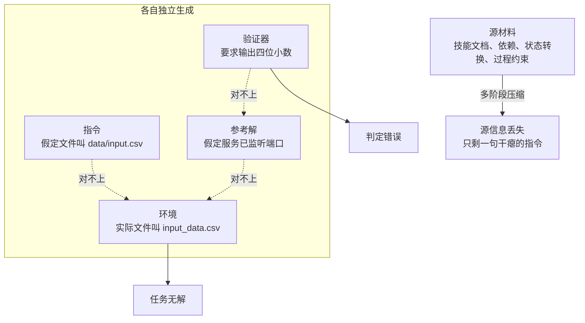
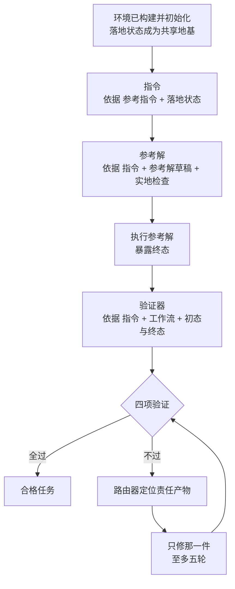

# FACET：在终端任务合成中保住源意图与可执行状态

> **原题**：FACET: Preserving Source Intent and Executable State in Terminal Task Synthesis
> **作者**：Kou Shi, Zun Wang, Qisheng Su, Shiting Huang, Ziao Zhang, Zhen Fang, Qingnan Ren, Jin Liu, Yu Zeng, Yiming Zhao, Lin Chen, Zehui Chen, Feng Zhao
> **年份**：2026（arxiv ID 2608.18580，2026 年 8 月 19 日提交）
> **分类**：cs.AI / cs.PL
> **链接**：https://arxiv.org/abs/2608.18580
> **精读日期**：2026-08-22

---

## 阅读须知

### 这篇在领域里的位置

要给一个模型训练出「会用终端」的能力，光有文本语料是不够的。写代码可以靠海量的开源仓库学，可是在终端里干活这件事，判断对错的依据不是文字是否通顺，而是命令跑完之后机器的状态有没有变成该有的样子。于是这一支研究从一开始就绕不开一个麻烦：训练数据本身必须是可执行的，而可执行的数据造起来远比文本贵。

过去几年这一支大致走过三段路。最早的做法是人工标注，请工程师把真实的操作过程录下来并整理成可复现的任务，质量高但数量上不去。随后出现了从真实材料中反向构造的路线，代表工作 TerminalWorld 从真实的终端录制中提取并校验任务，好处是场景天然真实，限制则在于录制素材本身有多少，任务就只能有多少。第三条路是程序化与模板化生成，把任务当作参数化的模板批量铺开，数量一下子就上来了，代价是任务彼此高度同质，难度也偏低。

最近一两年的重心转向了技能组合这一路。既然社区里已经沉淀了大量可复用的「技能」文档，也就是描述某项具体操作该怎么做的结构化材料，那么把若干技能拼接起来，理论上就能组合出数量庞大且形态各异的复合任务。这条路的数量问题解决了，却暴露出一个新的、也是本文真正要处理的问题：拼出来的任务，有相当一部分根本不成立。

FACET 站的正是这一步。它不追求把任务造得更多，而是追求把造出来的任务变得真的有效。

### 读完能回答什么

读完这份笔记，应当能回答下面这几个问题：

1. 一个终端任务为什么不是一段文本，而是四件必须互相咬合的产物？它们对不上的时候，具体会以什么形式失败？
2. 「可执行状态接地」这个说法到底指什么？为什么把环境先建起来再生成其余产物，会比同时生成或反向生成更可靠？
3. 论文用来支撑上述主张的那组对照实验，结论有多强？哪一处其实没有达到统计显著？
4. 为什么 FACET 造出来的数据集自身通过率反而更低，而这一点被论文当作优点而非缺点？
5. 教师模型远强于学生模型的情况下，那七到八分的提升，有多少能归功于合成方法本身？

### 阅读前置

预设读者是进入机器学习工业界三年左右的工程师，熟悉监督微调的基本流程、了解容器与命令行、知道什么叫评测基准。不预设读者做过智能体方向，也不预设读者接触过终端任务合成这一子领域，凡是本子领域特有的概念，下文都会先铺垫再展开。

### 首次出现的缩写与术语

- **FACET**（Fine-grained Agentic Construction of Executable Tasks，细粒度智能体式可执行任务构造）：本文提出的框架名称。
- **artifact（产物）**：构成一个终端任务的组成件。本文特指指令、环境、参考解、验证器这四件。下文一律译作「产物」。
- **grounding（接地）**：让生成过程依附于某个真实存在的对象，而不是依附于对该对象的想象。本文中被依附的对象是已经建好并跑起来的容器状态。
- **verifier（验证器）**：一段可执行的检查逻辑，跑在任务完成后的机器状态上，用来判定任务有没有真的做成。
- **rollout（轨迹采样）**：让一个智能体在环境里实际把任务走一遍，把过程中的每一步都记录下来，得到的这一整条记录称为一条轨迹。
- **SFT**（Supervised Fine-Tuning，监督微调）：用带标准答案的样本对预训练模型做进一步训练。
- **P@1 / P@3**（Pass@1 / Pass@3）：允许模型尝试一次或三次时，任务被判定通过的比例。
- **yield（端到端产出率）**：投进去若干个原始输入，最终有多少个变成了合格任务，两者之比。
- **BF16**（bfloat16）：一种十六位浮点格式，训练中常用于节省显存。
- **ZeRO-3**（Zero Redundancy Optimizer stage 3）：一种把模型参数、梯度与优化器状态全部切分到多张卡上的分布式训练策略。
- **Terminal-Bench 2.1**：本文使用的评测基准，由一批容器化的终端任务构成，判分方式是执行验证而非文本比对。

---

## 一、问题

一个模型如果只会写代码而不会在真实机器上把事情办成，那么它在实际工作里能替人分担的部分其实相当有限。真正耗掉工程师时间的，往往不是写出那三十行逻辑，而是把依赖装好、把数据摆到对的位置、把服务拉起来、把跑出来的结果核对一遍。这一整套工作发生在终端里，它的特征是每一步都会改变机器的状态，而下一步是否可行取决于上一步留下了什么。

要让模型学会这件事，就得有大量可执行的任务供它练习，并且每个任务都得有办法自动判定做没做成。人工制作这样的任务极慢，一个熟练工程师一天也造不出几个像样的。因此过去两年，几乎所有做智能体训练的团队都在想同一件事：能不能让模型自己批量地造任务。

问题恰恰出在这里。批量造出来的任务，看上去每一件都像模像样，实际上有相当高的比例是废的。论文把废掉的原因归成两类，并且指出这两类在多阶段生成的流水线里几乎必然会发生。

第一类叫源信息丢失。造任务的流程通常是一级一级往下压缩的：先读进一份内容丰富的源材料，抽取要点，再据要点写场景，再据场景写指令。每压缩一次就丢掉一层东西，源材料里原本写清楚的依赖关系、中间状态、过程约束，到最后往往只剩下一句干瘪的「写一个脚本处理这个文件」。任务因此变得既简单又同质，训练价值随之打了折扣。

第二类叫跨产物漂移，这一类的后果更严重。一个终端任务并不是一段文本，而是四件东西的捆绑：说明要做什么的指令，初始化好的执行环境，一份能跑通的参考解，以及一段用来判定成败的验证器。倘若这四件是各自独立生成的，它们所依据的假设就会不一致。指令里说要读取 data/input.csv，环境里那个文件实际叫 input_data.csv；验证器要求输出保留四位小数，参考解只写了两位；参考解假定某个服务已经在监听端口，环境却根本没把它拉起来。任何一处对不上，整个任务就作废，而且作废得很隐蔽：单看每一件产物，它们都是合理的。

前人在这条路上做过的尝试，各自解决了一部分。程序化生成与领域规范这一路，把任务的形态限制在可控范围内，因而产物之间不容易冲突，代价是任务的多样性被规范本身框死。以种子数据集为起点扩写的一路，继承了种子的真实性，但扩写得越远，与种子的关联就越弱，漂移仍旧会出现。TerminalWorld 从真实的终端录制里构造并校验任务，真实性最好，然而录制素材的规模决定了它的上限。技能组合这一路数量最有优势，SkillSynth 把技能组织成以场景为中介的图结构，Terminal-Lego 研究了环境接地对轨迹质量的影响，都是朝这个方向走的工作。

这些工作共同缺的那一块，正是本文要补的：没有一个统一的、真实存在的东西，供四件产物同时依附。FACET 给出的答案很朴素 - 既然它们对不上是因为各自在猜环境的样子，那就先把环境真正建起来，让它们不必猜。

---

## 二、方法

### 任务的形式定义

论文先把一个终端任务写成一个五元组，这样后面讨论「什么叫合格」才有依据。一个任务包含指令 ℐ，即用户提出的请求；环境 ℰ，即初始化完毕的执行上下文；参考解 𝒮，即一套能把任务办成的操作流程；验证器 𝒱，即可执行的判定逻辑；以及元数据 ℳ，记录运行所需的各类信息。

一个任务被接受，需要同时满足四个条件：环境能够构建并初始化；初始状态必须是非平凡的，也就是说任务在开始时确实还没有完成；参考解能够实际执行；验证器在参考解跑完之后的终态上通过。第二个条件容易被忽略，但它拦掉的是一类很尴尬的废任务 - 如果验证器在初始状态下就已经通过，那么这个任务什么也没考察，模型什么都不做也能拿分。

### 整体流程

FACET 分三个阶段。第一阶段负责把原始素材收集并整理成可用的配对库，第二阶段负责把零散的技能重建成一个连贯且信息充分的场景并写出参考，第三阶段负责真正把环境建起来并以它为地基生成全部产物。

### 阶段一：把素材整理成可用的配对

技能这一概念，指的是社区里沉淀下来的、描述某项具体操作该如何完成的结构化文档。论文从 OpenClaw、ClawHub 与 GitHub 三处收集，剔除掉不安全的、非公开的以及重复的记录之后，保留下 71,341 条。

收进来的技能形态各异，因此下一步是理解与归一：把每一条都整理成统一的结构化记录，包含描述、所需工具、输入与输出、过程步骤，以及出处。在此基础上，抽取智能体去识别每条技能可能出现在什么应用情境里、用户想达成什么目标、初始状态与期望的最终状态分别是什么，相似的假设通过向量检索归并到一起。最后由一个模型评审对候选的场景与技能配对逐一打分，考察四个维度：相关性、互补性、非冗余性与可执行性，只有通过的配对才进入配对库 𝒫。

### 阶段二：把零散技能重建成一个连贯场景

单条技能所描述的是一个孤立的动作，而一个值得训练的任务需要多个动作彼此咬合。这一阶段做的就是把若干技能重新组织成一个像样的工作流。论文把它拆成五个渐进的模块。

技能分析先弄清每条技能各自的能力边界、所用工具、输入输出、前置条件与可观察的效果。场景探索在此基础上提出若干具体的应用设定。关联与筛选保留那些组合起来真正有意义的技能搭配，剔除生硬的拼凑。演化与恢复这一步最关键，它把这些能力组织成一个连贯的流程，并且把技能与技能之间的依赖关系与状态转换重新找回来 - 这一层信息正是前文所说、在朴素的多阶段压缩中最先被丢掉的那一层。信息扩充最后给这个流程补上具体的资源、格式、约束与成功条件。

重建出来的场景用五个维度来表示，分别是目标、上下文、能力、状态与输入输出及工具。这五个维度合起来写成一份完整的自然语言场景描述 C，把整件事表述为一条连贯的工作流。随后从 C 派生出参考解 RS，记录环境准备、执行流程、中间产物、状态转换与关键步骤；再由 C 与 RS 共同派生出参考指令 RI，写明目标、输入、输出、交付物与约束。最后由一个一致性对齐模型检查三件事：两者是否共享同一个初始状态，是否指向同一个目标结果，参考解对指令的覆盖是否完整。

值得留意的是，这一阶段产出的仍然只是「参考」，还不是最终的指令与解。真正的产物要等到环境落地之后才生成。这个区分是整篇论文的枢纽。

### 阶段三：以已落地的可执行状态为共享地基

环境智能体先产出一份清单，描述需要哪些目录、文件、服务、依赖以及各自的属性。随后进入实体化：允许使用网络访问、shell 与 Python 去获取并转换所需资源，拿到的外部资源一律本地化，数据在保持语义不变的前提下做扩充与扰动，以避免任务之间过度雷同。构建失败时允许最多三轮修复，常见的失败包括编译报错、缺包、夹具文件格式不对以及服务起不来。

环境构建并初始化成功之后，这个已经真实存在的容器状态被暴露出来，作为后续全部生成过程的共享地基。产物按固定顺序依次生成：指令由参考指令与落地状态共同生成；参考解由指令、参考解草稿以及对环境的实地检查共同生成；接着实际执行这份参考解，把终态暴露出来；验证器最后生成，依据是指令、工作流以及初态与终态两份真实状态。

这个顺序不是随意排的。让验证器最后生成，意味着它写检查的时候，初态和终态都已经是摆在眼前的事实，而不是推测。同理，指令里提到的每一个文件名与路径，都来自实际存在的目录树。四件产物不再各自想象环境，而是轮流去看同一个真实的环境，漂移的空间因此被压掉了大半。

验证环节检查四项：环境能建能初始化；验证器在初始状态下应当失败；参考解能够执行；验证器在终态上通过。任何一项不过，由一个受约束的路由器从执行轨迹里判断是哪一件产物出的问题，只调用对应的那一支修复流程，已经合格的部分不重新生成。任务层面的修复最多五轮，超出预算仍不合格的候选直接丢弃。

---

## 三、实验

### 训练设置

教师是由 DeepSeek-V4-Pro 驱动的 Terminus-2 智能体，让它在 FACET 造出来的任务上实际跑，采集轨迹。最终从约 6,000 个验证通过的任务中，挑出 1,200 条完整且成功的轨迹作为训练数据。

学生是 Qwen3.5 系列的三个规模，分别为 40 亿、90 亿与 270 亿参数，训练框架用 LLaMA-Factory，做全参数监督微调，精度 BF16，分布式策略 ZeRO-3。训练三个 epoch，等效批大小 64，学习率 1×10⁻⁵ 配余弦调度，预热比例 0.1，最大序列长度 32,768。

评测在 Terminal-Bench 2.1 上进行，智能体外壳同样是 Terminus-2，推理配置与教师一致。每个任务尝试三次取平均通过率，单次尝试超时两小时，温度 1.0。

### 主结果

| 模型 | 微调前 | 微调后 | 提升 |
|---|---|---|---|
| Qwen3.5-4B | 17.60 | 24.72 | +7.12 |
| Qwen3.5-9B | 27.34 | 35.58 | +8.24 |
| Qwen3.5-27B | 40.82 | 47.57 | +6.75 |

作为参照，同一评测设置下 Qwen3.5-397B 得 49.06，Qwen3.6-27B 得 53.93，Kimi-K2.6（一万亿参数）得 59.93，作为教师的 DeepSeek-V4-Pro-Preview 得 73.03。

这组数字里最值得记一笔的是 27B 那一行。仅用 1,200 条轨迹微调之后，它拿到 47.57，距离参数量大出十倍有余的 Qwen3.5-397B 的 49.06 只差 1.49 分。数据量之小与差距之小放在一起看，说明这批轨迹的信息密度确实高。

### 数据集本身的特征

| 数据集 | 轨迹数 | 平均轮数 | 每任务平均检查数 |
|---|---|---|---|
| FACET | 1,200 | 11.86 | 22.77 |
| Terminal-Lego | 32,000 | 5.77 | 16.60 |
| Nemotron | 5,000 | 6.12 | 6.18 |
| TerminalWorld | - | 11.94 | - |
| Endless-Terminals | - | - | 5.51 |

FACET 的验证通过任务共 6,078 个，自身的通过率是 P@1 等于 27.00，P@3 等于 35.00。

这个通过率明显低于同类数据集，而论文把它当作优点来讲，理由在最后一列：FACET 的每个任务平均带 22.77 项可执行检查，Nemotron 只有 6.18 项。检查越密，判定越严，通过自然越难。换句话说，通过率低不是因为任务造得糟，而是因为判分标尺细得多。这一点在读同类工作的报表时值得记住 - 脱离检查密度去比较通过率，比出来的结论没有意义。

### 一个反直觉的观察

论文对教师轨迹做了一次拆解，得到的分布相当值得玩味。逐项来看，89.40% 的单项验证检查是通过的；可是整体来看，只有 20.94% 的完整轨迹达成了任务的全面成功。进一步看失败的那些，其中 54.00% 只差一到两项检查没过。

这三个数字放在一起，指向一个和直觉不太一样的结论：模型并不是不会做这些任务，主流程它基本走得下来，卡住它的是收尾。论文的分析把难点定位在需求追踪与最终状态一致性这两处，而不是主工作流的执行本身。也就是说，指令里提到的每一条要求有没有全部落实、最后机器的状态是否与所有约束都吻合，才是真正拉开差距的地方。

与之相关的还有一条：结构化数据类的任务比叙事性文档类的任务更容易做成；指令越长、验证器覆盖面越广，表现下降得越明显。

### 生成顺序的对照实验

这是全文最有说服力的一组实验，因为它直接检验了论文的核心主张。在 100 个相同的场景与技能配对上，比较三种产物生成顺序。

正向顺序即本文的做法，先建环境，再依次生成指令、解、验证器。反向顺序先写验证器，再倒推其余。联合顺序则用单次模型调用一次性生成全部四件。

| 顺序 | 进入验证的任务 | 首次即合格 | 最终产出率 | 修复挽回 |
|---|---|---|---|---|
| 正向（环境接地） | 99 | 46（46.5%） | 83.0% | 53 例中挽回 37 |
| 反向（验证器优先） | 91 | 22（24.2%） | 63.0% | 69 例中挽回 41 |
| 联合（单次生成） | 96 | 36（37.5%） | 65.0% | 60 例中挽回 29 |

失败原因的分布同样说明问题。反向顺序的失败中有 56.5% 属于契约不匹配，也就是验证器所约定的接口与参考解实际产出的东西对不上，这正是先写验证器必然要付的代价。联合顺序的失败中有 38.3% 出在夹具、模式与路径的接地上，即一次性生成时对环境的想象与实际不符。

论文还做了配对比较，在 88 条共同路径上，正向单独成功而反向失败的有 29 对，反之只有 9 对，双侧符号检验 p 等于 0.0017。**但正向对联合的那一组是 27 比 18，p 等于 0.233，并未达到统计显著。** 这一点论文自己给出了数字，却没有在叙述中特别指出，读者若只扫表格容易得出「三者依次优劣分明」的印象。实际能被数据牢固支撑的结论只有一条：先写验证器确实更差；而先建环境是否真的胜过一次性生成，这批样本还不足以断言。

### 端到端流水线的消融

在 500 个共同的技能配对输入上，比较三条完整流水线。

| 流水线 | 完整包 | 验证通过 | 端到端产出率 | P@1 | P@3 | 平均命令数 |
|---|---|---|---|---|---|---|
| 基线（无场景重建） | 437 | 78 | 15.6% | 80.8 | 85.9 | 12.8 |
| TerminalWorld 复现 | 449 | 139 | 27.8% | 58.8 | 64.0 | 17.0 |
| FACET | 395 | 350 | 70.0% | 25.1 | 33.1 | 21.5 |

这张表要横着读才有意思。从基线到 FACET，端到端产出率从 15.6% 升到 70.0%，涨了四倍有余；与此同时任务本身的通过率从 80.8 掉到 25.1，平均需要的命令数从 12.8 升到 21.5。两件事是同时发生的：造出来的合格任务多了，而且每一个都更难。基线那 80.8 的高通过率其实是个警讯，它说明基线造出来的任务大多过于容易，训练价值有限。

FACET 那 350 个验证通过的任务里，182 个是首次验证就通过的，另外 168 个是靠定向修复挽回的。定向修复贡献了将近一半的产量，这也从侧面说明「只修出问题那一件、不重新生成合格部分」这个设计是有实际收益的。

### 构造漏斗

| 阶段 | 数量 | 留存率 |
|---|---|---|
| 场景与技能种子 | 7,852 | - |
| 有首次构建日志 | 7,841 | 99.86% |
| 环境首次构建成功 | 6,630 | 84.56% |
| 环境修复挽回 | 874 | - |
| 环境最终成功 | 7,504 | 95.70% |
| 进入任务验证 | 7,446 | 99.23% |
| 首轮验证通过 | 2,856 | 38.35% |
| 任务修复挽回 | 3,222 | - |
| 最终合格任务 | 6,078 | 81.63% |

漏斗里最陡的一段落在首轮验证：进入验证的 7,446 个任务中只有 2,856 个一次通过，比例是 38.35%。也就是说，即便已经有了落地的环境作为共享地基，仍有六成的任务第一次做出来是不合格的。修复机制把最终留存拉回到 81.63%，挽回的数量甚至超过了首轮通过的数量。这个对比说明，接地解决的是「让漂移变得可修」这个问题，而不是「让漂移不再发生」。

至于素材的构成，71,341 条技能分布在五个顶层类别里，多媒体与创作发布占 24.42%，人工智能与工具占 21.28%，软件系统与安全占 21.11%，数据分析与研究占 17.39%，文档与办公流程占 15.79%，底下再细分为 34 个小类。最终的 6,078 个合格任务落在 9 个任务族中，各族占比在 9.59% 到 11.99% 之间，分布相当均匀。

---

## 四、局限

### 论文自己交代或默认的部分

修复预算是有上限的，环境层面三轮，任务层面五轮，超出即丢弃，构造过程中因此损失约 18% 的任务。技能素材集中来自三个站点，覆盖面并不保证完整。生成侧依赖 DeepSeek-V4-Pro，换一个模型结果未必能复现。用于对照的两条流水线是依据各自论文改写重现的，复现的保真度会影响结论的强度。

### 读完能看出来的部分

第一处是那个未达显著的比较。上文已经点明，正向对联合的配对检验 p 等于 0.233，这意味着「必须先把环境建起来」这一条，相对于「一次性生成」并没有被这批数据牢固支撑。论文的核心主张有一半站在这个比较上，而这半边的证据比另外半边弱得多。

第二处关乎归因。教师是 DeepSeek-V4-Pro，在同一评测上拿 73.03；学生是 Qwen3.5 系列，最强的一个微调前拿 40.82。两者差距如此之大，那么微调带来的七到八分提升里，究竟有多少来自「环境接地的任务合成方法」，又有多少仅仅来自「向一个远强于自己的教师蒸馏」，论文没有把这两者拆开。一个直接的对照实验是：用同样的教师、同样的采样规模，在基线方法造出的任务上采集轨迹并微调，看看能拿到几分。这个实验没有做。

第三处关乎那被丢弃的 18%。修复预算耗尽仍不合格的任务被直接丢掉，而这些任务很可能不是随机分布的，它们大概率系统性地偏向最复杂、依赖最深、状态转换最多的那一类。如果确实如此，那么训练集会在无人察觉的情况下悄悄变简单，而这恰好削弱了整套方法想要争取的东西。论文没有分析被丢弃任务的分布特征。

第四处关乎评测的单一性。全部结论都建立在 Terminal-Bench 2.1 之上，没有第二个基准做交叉验证。考虑到 FACET 的任务与 Terminal-Bench 同属容器化终端任务这一形态，两者在任务分布上的相似性有多高，提升能否迁移到形态不同的智能体任务上，目前无从判断。

第五处关乎只学成功。1,200 条训练轨迹全部是完整成功的轨迹，失败的那些被排除在外。然而论文自己的分析显示，54.00% 的失败只差一到两项检查，这批「差一点」的轨迹里其实包含了大量关于如何收尾、如何核对最终状态的信息，而这恰恰是分析中指认的主要难点所在。把它们全部弃用，可能正好丢掉了最该学的那部分。

---

## 一句话

先把容器真正建起来跑通，再让指令、参考解与验证器都基于这份已落地的状态生成，使合成出的终端任务既可解又判得准。
