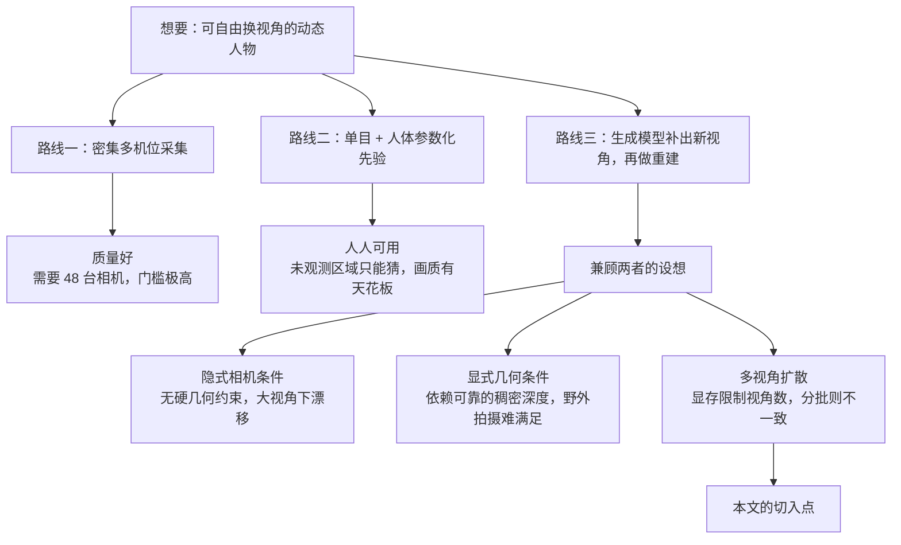
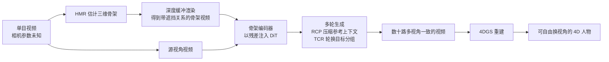
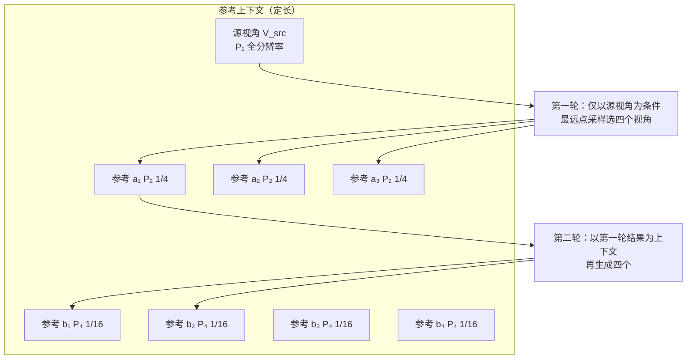
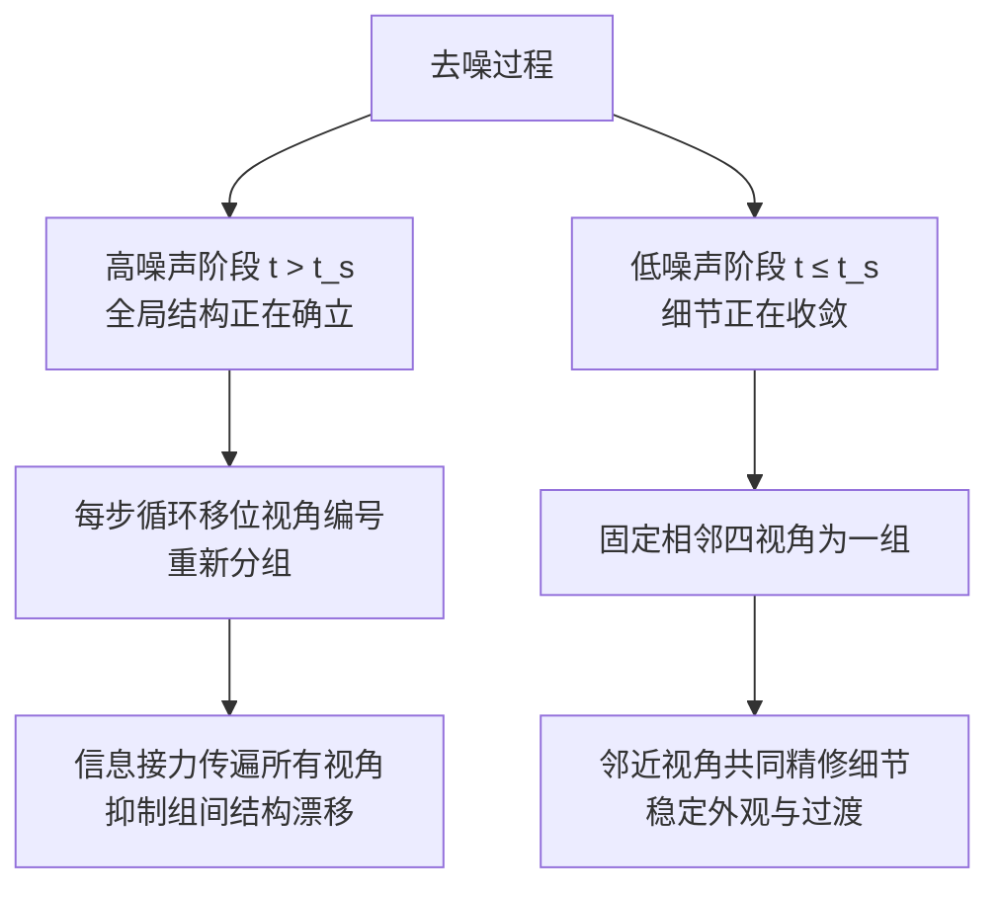

# 4DAnyone：从随手拍的单目视频里重建任意人物的 4D 形象

> **原题**：4DAnyone: Create Anyone in 4D from a Casual Monocular Video
> **作者**：Yudong Jin, Tao Xie, Qihang Zhang, Zehong Shen, Zhen Xu, Yujun Shen, Hujun Bao, Xiaowei Zhou, Yinghao Xu
> **年份**：2026（arxiv ID 2608.20335，8 月 20 日提交）
> **分类**：cs.CV
> **链接**：https://arxiv.org/abs/2608.20335
> **精读日期**：2026-08-23

## 阅读须知

### 这篇在领域里的位置

这篇工作属于「可自由换视角的人物重建」这一支。所谓 4D，指的是三个空间维度加上时间这一维：重建出来的不是一张照片，也不是一个静止的三维模型，而是一段可以绕着走、可以从任意角度回看的动态人物影像。

过去几年，这一支的主流路线依赖昂贵的采集装置。以本文用作评测集的 DNA-Rendering 为例，它靠四十八台同步相机围成一圈来采集，因此重建的质量固然好，代价却是这套设备只存在于少数实验室里。与之相对的另一条路线是只用一段普通视频，靠人体的参数化模型充当先验去补全看不见的部分，好处是人人可用，代价则是模型对没被拍到的区域只能给出一个大致合理的猜测，画面质量因此有一道天花板。

近两年出现了第三条路：既然视频扩散模型已经能生成看上去合理的新视角画面，那么就先让它把缺失的视角「画」出来，再把这些画出来的视角当作真实拍摄的素材，喂给标准的重建流程。这条路听上去顺理成章，实际做起来却在一个具体的地方卡住了，而这篇论文要解决的正是那个卡点。

### 读完能回答什么

读完这份笔记之后，应当能够回答下面这些问题：

1. 为什么现有的相机可控视频扩散模型「看起来能生成新视角」，却无法直接用于重建？
2. 什么是「注意力上下文有界」问题，它为什么会同时衍生出两个互相耦合的瓶颈？
3. Reference Context Packing 是如何把参考视角的代价从 O(N) 压到 O(1) 的，代价是什么？
4. Target Context Routing 为什么要在去噪的高噪声阶段和低噪声阶段采取相反的策略？
5. 为什么这篇论文选择用三维骨架而不是深度图来做几何条件，「准确胜过稠密」这句话具体指什么？
6. 消融实验里有一处数字，实际上动摇了作者对 TCR 所给出的机制解释，它是哪一处？

### 阅读前置

这份笔记假定读者熟悉 Transformer 的基本结构、扩散模型的去噪过程，以及注意力的计算代价随序列长度增长这一基本事实。不预设读者做过三维视觉或人体重建：凡是涉及高斯泼溅、人体网格恢复、普吕克射线这类本子领域的概念，都会在首次出现时先说清楚它是什么、为什么需要它，然后再展开。

### 缩写表

- **4D**：三维空间加时间。本文语境下指可自由换视角且随时间变化的人物影像。
- **4DGS**（4D Gaussian Splatting，四维高斯泼溅）：一种场景表示与渲染方法。它把场景表示成大量带有位置、形状、颜色与不透明度的三维高斯团块，渲染时把这些团块投影到像面上叠加成图。加上时间维之后，团块可以随时间移动与形变，于是能表示动态场景。它的特点是训练与渲染都很快，因此近两年成了动态重建的默认后端。
- **DiT**（Diffusion Transformer，扩散 Transformer）：以 Transformer 为主干的扩散模型。本文的基座视频生成模型即属此类。
- **HMR**（Human Mesh Recovery，人体网格恢复）：从图像或视频里估计出人体的三维姿态与体型，输出通常是一具三维骨架或一张人体网格。
- **RCP**（Reference Context Packing，参考上下文打包）：本文提出的第一个组件，用于压缩参考视角。
- **TCR**（Target Context Routing，目标上下文路由）：本文提出的第二个组件，用于在去噪过程中轮换目标视角的分组。
- **PSNR**（Peak Signal-to-Noise Ratio，峰值信噪比）：逐像素比对的图像质量指标，数值越高越好。
- **SSIM**（Structural Similarity Index，结构相似性）：衡量结构层面相似程度的指标，越高越好。
- **LPIPS**（Learned Perceptual Image Patch Similarity，学习得到的感知图像块相似度）：用神经网络特征衡量两张图在人眼观感上的差距，越低越好。
- **z-buffer**（深度缓冲）：图形学里用于处理遮挡的标准手段。逐像素记录当前最近物体的深度，从而让近处的物体正确遮住远处的物体。
- **普吕克射线**（Plücker rays）：一种用六个数表示空间中一条直线的方式。相机可控生成里常用它把「这个像素对应空间中哪条光线」编码给模型。

## 一、问题

### 为什么这个问题值得做

先说不解决会怎样。今天想要一个能自由换视角的动态人物，路只有两条，而两条都不好走。

第一条是搭设备。四十八台相机同步触发、统一标定、逐帧对齐，这套东西的成本与场地要求把绝大多数人挡在门外，能用得起的只有影视工业和少数研究机构。第二条是只拿一段手机视频硬做。这条路人人走得起，但一段视频只看得见人的一面，背面、侧面、被手臂挡住的躯干，这些区域没有任何观测。传统方法在这里依靠人体参数化模型作先验，它能给出一个大致合理的形体，却给不出真实的衣纹与花色，于是重建结果远看尚可、近看便垮。

近两年的新思路是把生成模型请进来补这一刀。视频扩散模型在海量视频上训练过，它对「人从背面看是什么样」这件事有相当强的先验，因此可以先让它生成若干个新视角的视频，再把这些视频当作多机位素材去做常规重建。这个思路的吸引力在于，它把「没有观测」这个死结换成了「观测由模型补出来」这个可以靠训练改进的问题。

那么为什么还需要一篇新论文。因为这条路在从演示走向重建的过程中会断掉，而断点的位置相当具体。

### 前人的三条路线各自卡在哪里

**相机可控的视频生成**是最直接相关的一支。这一支内部又分两派。隐式的一派以 CameraCtrl 为代表，把相机位姿编码成普吕克射线交给模型，让模型自己去理解这意味着怎样的视角变化。这一派的问题在于没有硬性的几何约束，视角变化一大，画面就会漂移。显式的一派以 Gen3C 为代表，先从视频估计出深度，把像素抬升成三维点云，再把点云投影到目标视角作为条件。这一派几何约束够硬，代价是它依赖稠密且尺度正确的深度估计，而这件事在随手拍的视频上很难可靠做到。

**多视角扩散**这一支已经意识到要一次生成多个视角，SV4D 与 CAT4D 都把这个思路扩展到了动态内容上。它们卡住的地方是规模：显存决定了一次前向能塞进多少个视角，而重建需要的视角数远超这个上限。于是要么把视角分批独立生成，批与批之间就会不一致；要么挑几个锚点视角来传递信息，那又等于把其余视角的外观信息丢掉。

**4D 人物重建**这一支则是从重建端出发的。依赖密集多机位采集的方法质量好但门槛高，前面已经说过。而单目方法即便用上人体参数化先验，也无法可靠地凭空生成未观测区域的外观，这一点构成了画质的固有上限。

三条路线之间的关系是这样的：

### 把断点说清楚：注意力上下文是有界的

本文把上面那个断点命名为**注意力上下文有界问题**。这个说法需要拆开讲。

扩散 Transformer 一次前向能处理的 token 数量是有限的，这个限制来自显存，也来自注意力本身随序列长度增长的计算代价。而重建级的一致性要求生成几十个目标视角，这些视角的 token 加起来远远超出一次前向的容量。既然装不下，就只能把目标视角切成若干组，一组一组地生成。

问题恰恰出在这一刀切下去之后。切分同时打开了两个口子，而且这两个口子互相耦合。

**第一个口子在参考侧。** 为了让新生成的视角与已经生成好的视角在外观上保持一致，自然的做法是把已生成的视角全都作为条件喂进去。可是已生成的视角会越来越多，条件的长度就随之线性增长，代价是 O(N)。更要紧的是，在总容量固定的前提下，参考视角越多，每一个参考视角实际分到的注意力就越稀薄，跨视角的外观引导反而被冲淡了。换句话说，想靠「多给参考」来保一致，结果是参考给得越多，一致性反而越弱。

**第二个口子在目标侧。** 被切分到不同组里的目标视角，在去噪的过程中彼此看不见对方。每一组都在独立地把噪声还原成图像，谁也不知道隔壁组把人的躯干放在了哪里、把手臂摆成了什么角度。于是各组之间会出现全局结构上的漂移：单看每一组都合理，拼在一起就对不上。

这两个口子必须一起堵。只堵参考侧，各组仍然各自为政；只堵目标侧，共享的外观引导本身就是稀薄的，共享出去的也是错的。这就是本文两个组件成对出现的原因。

## 二、方法

4DAnyone 的整体流程可以先看一眼骨架，再逐块拆开。

### 骨架条件：为什么是准确胜过稠密

在讲两个主要组件之前，先要交代这篇论文在几何条件上做的一个反直觉选择。

前面提过，显式几何条件那一派依赖稠密深度。深度图给出的信息确实稠密，每个像素都有一个值。可是在随手拍的视频上，这些值的可靠程度并不高，尺度也往往不对。本文的判断是：对于重建级的一致性而言，几何信号的**准确**比它的**稠密**更重要。一个稀疏但准确的信号，好过一张稠密但处处有偏的深度图。

于是它改用三维骨架。骨架来自现成的人体网格恢复方法，只有几十个关键点，稀疏得多，但每个点的位置是可靠的。

这里有一个不那么显然的技术细节值得单独讲。如果只是把三维骨架投影成一张二维的火柴人图，会引入姿态歧义：一条手臂位于躯干之前还是之后，投影出来可能长得一模一样，模型无从分辨。本文的做法是在光栅化骨架时逐像素启用深度缓冲，让离相机更近的肢体正确遮挡更远的肢体。这样一来，同一张骨架图上就带上了前后关系，二维的火柴人被升格成了「知道谁在前面」的渲染结果，而且没有增加任何额外的输入通道。

关键点的取舍也有讲究。本文从 Goliath 那套三百零八个关键点的词表里挑出一个**四十个关键点的紧凑子集**：保留十七个身体关键点、六个足部关键点、十个手掌层级的手部关键点，而把两百三十八个面部关键点与三十个手指关节全部排除在外。排除的理由是脸和手指的细节应当交给源视频的外观引导去负责，骨架不必也不宜在这里越俎代庖。

骨架以残差的形式注入模型。记 z^t_i 为第 i 个视角在去噪时刻 t 的带噪潜变量 token，S_i 为对应的深度缓冲骨架视频，注入的写法是：

ž^t_i = z^t_i + g_φ(S_i)

其中 g_φ 是骨架编码器。它最后一层的投影做零初始化，这样在训练刚开始时注入项为零，模型的行为与预训练的 DiT 完全一致，训练因此得以平稳起步。

### Reference Context Packing：把越来越长的参考压成定长

RCP 要堵的是参考侧那个口子。

它依据的观察是：多个参考视角之间存在大量冗余。同一个人从八个角度看过去，衣服的花色、皮肤的色调、头发的颜色这些信息在每个视角里都重复出现了一遍。既然如此，就不必让每个参考视角都以同样的分辨率占据同样多的 token。

具体做法落在**分块层**上。扩散 Transformer 在把视频转成 token 时会经过一个分块层，标准配置的卷积核与步长是 (1,2,2)。RCP 引入压缩率 r，取值为 2 或 4，压缩率为 r 时产生的 token 数是原来的 1/r²。于是同一段参考视频，可以按需被压成不同的长度。

参考上下文因此被组装成一个定长的结构：

C_R = [ P₁(V_src), {P₂(V_aⱼ)}ⱼ₌₁³, {P₄(V_bⱼ)}ⱼ₌₁⁴ ]

读法是这样：源视角 V_src 用 P₁ 处理，保持最高分辨率，因为它是唯一真实拍摄到的视角，信息最可信；接下来三个参考视角用 P₂ 压到四分之一；再接下来四个参考视角用 P₄ 压到十六分之一。八个参考视角加一个源视角，最终占据的 token 总数是固定的，与参考视角的数量无关。参考侧的复杂度就此从 O(N) 变成 O(1)。

推理时采用渐进式生成。第一轮只以 P₁(V_src) 为条件，生成四个参考视频，这四个视角的选取用最远点采样，以保证它们在视角空间里尽量铺得开而不是挤在一处。第二轮再以第一轮的结果作为上下文，生成另外四个参考视频。至此八个参考视角齐备，定长的参考上下文组装完成。

### Target Context Routing：在去噪的两端做相反的事

RCP 解决的是「拿什么作条件」，但目标视角分组之后各自独立去噪这件事并没有变。即便所有组共享同一份外观参考，全局结构仍然可能在组与组之间漂移。TCR 要堵的就是这个口子。

它的立足点是一个关于扩散过程的观察：**全局结构在高噪声阶段确立，细节在低噪声阶段确立。**去噪刚开始时，画面还是一团噪声，此时模型决定的是人站在哪里、身体朝向何方、四肢的大致布局；到了去噪后期，大结构已经定下，模型在做的是把衣纹、发丝、光影这些细节磨清楚。

由此推出的策略是在两个阶段采取相反的做法。设一个切换时刻 t_s：

**高噪声阶段（t > t_s）**，按步数索引对有序的视角编号做循环移位，然后重新划分成每组四个视角。这意味着每一步去噪，同一个视角的组内伙伴都在变。经过若干步之后，信息就以接力的方式在所有视角之间传开了，而每一组的预算始终没有变。全局结构因此得以在组间传播，不必扩大单次前向的容量。

**低噪声阶段（t ≤ t_s）**，把相邻的四个视角固定成一组，不再轮换。此时要的是让视角上邻近的画面一起把细节磨到彼此吻合，轮换反而会让刚稳定下来的细节反复受扰。

### 训练：三阶段课程与两批数据

训练分成三个阶段，每一阶段解开一层限制。

**第一阶段**在 DNA-Rendering 的前景视频上训练，也就是把人抠出来、背景去掉。这一阶段有一个刻意的设计：以百分之二十的概率，源视角片段与目标视角片段从**不同的时间窗口**里独立采样。这样做是为了把姿态与外观解耦，逼模型学会「这个人长什么样」与「这个人此刻摆什么姿势」是两件可以分开的事。

**第二阶段**去掉前景遮罩，把 MVGameHuman 与 SynCamVideo 加进来。作者对这一步的解释相当具体：带遮罩训练有两个副作用，一是前景遮罩的边界会带来边缘噪声与多视角不一致，二是没有背景就学不到光照与阴影的线索。

**第三阶段**加入单目数据集 Pexels 与 TedTalk，同时把手指关键点移除，目标是提升在野外视频上的泛化能力。

损失函数是 ℒ = ℒ_latent + λ·ℒ_LPIPS，其中 λ = 0.25。这里有一个工程上的处理值得记一笔：LPIPS 若在全分辨率上计算，显存吃不消，因此本文改在**按身体部位切出的语义块**上计算。

数据方面，本文自建了 **MVGameHuman**：用自研游戏引擎渲染，三万八千段同步多视角人物视频，分辨率 2560×1440，覆盖三百一十八名演员，每段序列由二十四台虚拟相机拍摄。合成数据在这里的价值是相机标定绝对准确，这一点真实采集做不到。训练时它与其余数据合并使用：SynCamVideo 三万四千段（十机位）、DNA-Rendering 五万一千段（四十八机位）、TedTalk 四万二千段单目视频、Pexels 两万段单目视频。

实现上，基座模型是 Wan2.2-TI2V-5B，一个五十亿参数的 DiT 视频扩散模型，训练分辨率 704×1280，学习率 1×10⁻⁵，用一百二十八张 H20-3E 训练，三个阶段合计约三天。推理时去噪二十步，每轮生成四个目标视角组。整条流水线从输入视频到可渲染的 4D 人物约需四十分钟，其中预处理两分钟、生成七分钟、4DGS 训练三十分钟。

## 三、实验

### 评测怎么设计的

评测用了十个 DNA-Rendering 场景与三个 DyMVHumans 场景，都未在训练中出现过。每个场景取十六台大致均匀分布的相机、九十八帧。

值得注意的是本文把评测拆成了三个互补的维度，因为「生成的视频好不好」与「用它重建出来的东西好不好」并不是同一件事。

第一个维度是 **4DGS 重建质量**：把十六路生成视频全部拿去训练一个 4DGS 模型，再把渲染结果与真值比对。这是最终用户实际拿到的东西。

第二个维度是 **生成视频的三维一致性**：留出四个视角，用另外十二个训练 4DGS，然后把 4DGS 在留出视角上的渲染结果与该视角的生成视频比对。这个设计相当巧妙：如果生成的各路视频彼此在三维上自洽，那么从其中十二路重建出来的模型，理应能预测出第十三路长什么样；两者的差距因此直接度量了生成结果的三维一致程度。

第三个维度是 **生成视频本身的重建误差**：十六路生成视频直接与真值比对。

### 主要结果

对比的基线有三个：MV-Performer 是面向人体的几何条件新视角合成方法，TrajectoryCrafter 是靠深度形变做显式几何条件的相机控制方法，两者均为零样本评测；ReCamMaster† 是隐式相机条件的视频模型，为公平起见做了微调。

生成视频三维一致性这一维度上的结果如下：

| 方法 | DNA-Rendering PSNR↑ | SSIM↑ | LPIPS↓ | DyMVHumans PSNR↑ | SSIM↑ | LPIPS↓ |
|---|---|---|---|---|---|---|
| MV-Performer | 21.25 | 0.799 | 0.222 | 19.98 | 0.797 | 0.182 |
| TrajectoryCrafter | 13.56 | 0.641 | 0.331 | 15.19 | 0.769 | 0.204 |
| ReCamMaster† | 21.47 | 0.806 | 0.210 | 21.94 | 0.833 | 0.142 |
| **4DAnyone** | **24.33** | **0.862** | **0.163** | **24.48** | **0.862** | **0.109** |

领先幅度不小。相对最强的基线 ReCamMaster†，在 DNA-Rendering 上 PSNR 高出 2.86，在 DyMVHumans 上高出 2.54；LPIPS 在后者上从 0.142 降到 0.109，降幅接近四分之一。

4DGS 重建这一维度上，4DAnyone 在 DNA-Rendering 上取得 PSNR 24.15、SSIM 0.863、LPIPS 0.159。

TrajectoryCrafter 那一行的 13.56 值得单独说一句。这个数字低到不像同一个量级，原因正是前面提到的：它依赖从视频估计出的深度去做形变，而人体在大视角变化下的深度估计一旦出错，形变出来的画面就整个塌掉。这一行实际上是对「显式几何条件依赖可靠深度」这一判断最直接的实证。

### 消融

消融在八个较难的 DNA-Rendering 序列上做，十六台相机、一百二十一帧。

| 配置 | PSNR↑ | SSIM↑ | LPIPS↓ |
|---|---|---|---|
| 同时去掉 TCR 与 RCP | 21.09 | 0.766 | 0.216 |
| 去掉 RCP | 22.03 | 0.780 | 0.203 |
| 去掉 TCR | 22.21 | 0.788 | 0.196 |
| 完整模型（随机路由） | 22.20 | 0.788 | 0.197 |
| 完整模型（跨步路由） | 22.06 | 0.786 | 0.198 |
| **完整模型（滑动路由）** | **22.63** | **0.796** | **0.191** |

两个组件都去掉时 PSNR 只有 21.09，任意加回一个都能涨一分左右，两个都在则到 22.63。这支持了前面那个判断：两个瓶颈是耦合的，单堵一侧收效有限。

作者对失效原因的解释是清楚的。没有 RCP 时，模型只能依赖单目上下文，拿不到已生成视角提供的外观引导；没有 TCR 时，固定的视角分组各自独立去噪，结构与外观都会出现不一致。

路由策略的三种变体里，随机路由与跨步路由都不奏效，只有滑动路由有效。这一处的数字含义相当重，留到局限一节再谈。

### 野外泛化与失败情形

论文用一组野外视频展示了泛化能力，在各类不受控的人物视频上都能生成一致的目标视角并重建出可用的 4DGS。

## 四、局限

### 论文自己承认的

**宽松衣物。** 骨架条件对那些远离身体运动的衣物不提供任何信息。一件飘起来的长裙，骨架完全不知道它此刻在哪里，于是不同视角生成出来的裙摆彼此对不上。这一条是骨架条件路线的固有代价：选择了稀疏而准确，就放弃了对非刚性附属物的约束能力。

**姿态估计错误会被忠实继承。** 当人体网格恢复对不常见的姿态估错时，比如芭蕾的足尖立姿，生成过程会忠实地跟随那副错误的骨架，错误因此原封不动地传到最终结果里。

作者对这一条补充了一个有分量的观察：在遮挡或运动模糊的情况下，人体网格恢复通常仍会给出一副完整且看上去合理的骨架，因此姿态错误表现为「人物整体略有偏移但依然连贯」，而不是画面崩坏。这个性质对实用性很重要，它意味着失败是柔性的。

### 论文没说但读得出来的

**第一，消融表里有一处数字动摇了 TCR 的机制解释。** 作者对 TCR 的解释是「让被分开的目标组在高噪声阶段交换上下文，从而传播全局结构」。若这个机制成立，那么任何能让组间交换信息的分组方式都该有收益，随机分组显然也交换了信息。可是表里「完整模型（随机路由）」是 22.20，而「去掉 TCR」是 22.21，两者在数值上没有区别。换句话说，收益并非来自「轮换」这个想法本身，而是来自「滑动」这一特定的轮换方式。真正起作用的可能是滑动所保持的视角邻接关系，而不是论文所说的上下文交换。这一点论文给出了数字却没有点破，只用「随机路由没有可测量的增益」一句带过。

**第二，MVGameHuman 没有做消融。** 这批数据有三万八千段、三百一十八名演员、二十四机位，在训练数据里占相当分量，而且它是用自研游戏引擎渲染的，外部无法获取。论文没有报告「不使用 MVGameHuman」这一组的结果，因此无法判断相对基线的领先里有多少来自 RCP 与 TCR 这两个方法贡献，又有多少只是因为多了一批标定绝对准确的高质量数据。对于想要复现的人来说，这是最关键的一个缺口。

**第三，评测规模与动机之间存在落差。** 全文的立论基础是「4DGS 重建需要几十个目标视角，一次前向装不下」，可是评测只用了十六个视角。十六个视角按每组四个来分，正好只有四组，这是分组问题最轻微的情形。真正的规模压力，比如像 DNA-Rendering 采集端那样的四十八个视角，论文并未测试。RCP 把参考侧压到 O(1) 的价值理应随视角数增长而放大，恰恰在这个方向上缺少数据支撑。

**第四，脸与手的质量没有单独报告。** 关键点子集刻意排除了两百三十八个面部关键点与三十个手指关节，第三阶段又进一步移除了手指关键点。这个取舍本身有道理，但它意味着脸和手的重建完全依赖参考视角提供的外观引导，没有任何几何约束。而人眼对面部与手部的异常最为敏感，一个整体 PSNR 很高的结果，仍可能在脸上出问题。论文报告的都是全图指标，没有针对这两个区域的分项评估。

**第五，两个维度之间的差值没有分析。** 生成视频三维一致性上的 PSNR 是 24.33，而最终 4DGS 重建的 PSNR 是 24.15。这中间的差值说明重建环节本身还在损失质量。这个差距不大，但它标示了当前方法的上界所在：即便生成的视频完美一致，4DGS 这一步仍有自己的损耗，而论文没有讨论这部分损耗来自哪里。

## 一句话

把参考视角压成定长、把目标视角的分组在去噪高噪声阶段轮换，从而突破一次前向的容量限制，让单目视频生成出重建级一致的数十路视角。
