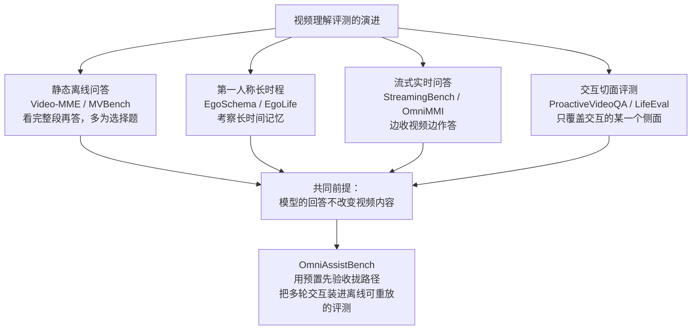
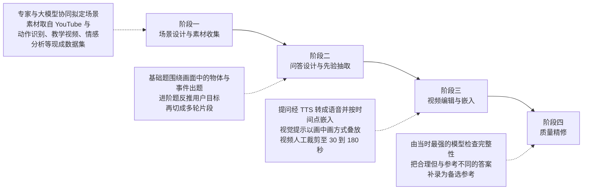
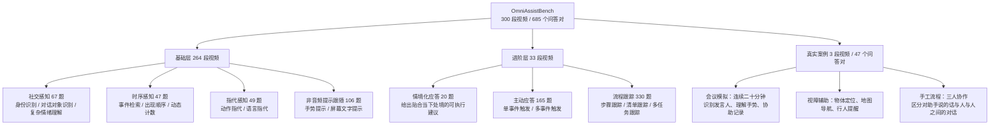
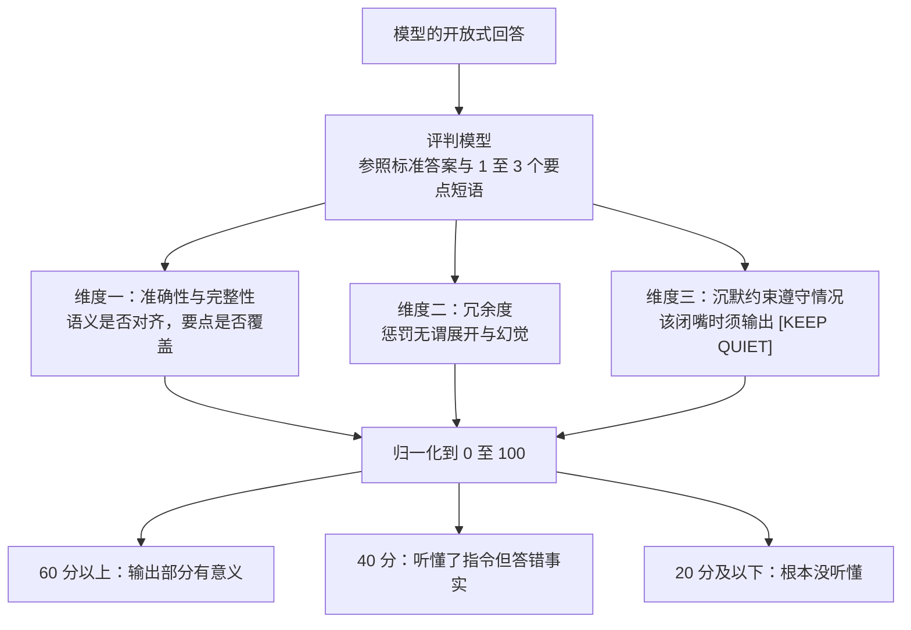

# OmniAssistBench：面向全模态大模型的助手式交互评测基准

> **原题**：OmniAssistBench: Assistant-style Interaction Benchmark for Omni-LLMs
> **作者**：Xianyun Sun, Chaoyou Fu, Zhengye Zhang, Feiyang Duan, Qingyuan Cao, Yonghui Niu, Sihang Yuan, Ge Zhang, Caifeng Shan
> **年份**：2026（arxiv ID 2608.21360，2026 年 8 月 21 日提交）
> **分类**：cs.CV
> **链接**：https://arxiv.org/abs/2608.21360
> **精读日期**：2026-08-24

---

## 阅读须知

### 这篇在领域里的位置

视频理解的评测基准这几年大致走过了三段路。最早的一段是判断模型能不能看懂一段已经录好的视频，代表是 Video-MME 与 MVBench 这一类，出题方式基本是选择题，模型看完整段视频再作答。第二段把摄像机架到了人的头上，转向第一人称视角的长时程理解，EgoSchema 与 EgoLife 属于这一支，考察的是模型能否在几十分钟甚至更长的连续记录里维持住对事件的把握。第三段则开始追求实时性，StreamingBench 与 OmniMMI 要求模型一边接收视频流一边作答，而不是等视频播完。

这三段路有一个共同的前提：视频的内容是固定的，模型说什么都不会改变接下来会发生什么。而本文要做的事情，恰恰是把这个前提拆掉。

一个真正的实时视频助手，比如戴在头上的眼镜或者架在灶台边的摄像头，它的输出会直接改变用户下一步的动作。用户听了建议就照做，听错了就走岔路，于是同一个目标可以延伸出无数条不同的交互路径。这件事让静态数据集失效：录好的视频里那个人做了什么是定死的，无法随着模型的回答而改变。OmniAssistBench 位于这条脉络的下一步，它试图在不请真人反复陪测的前提下，把这种会分叉的交互过程装进一个可复现的评测里。

### 读完能回答什么

读完这份笔记之后，应当能回答下面这几个问题：

1. 为什么交互式助手不能用传统的静态视频问答数据集来评测，症结究竟在哪一步。
2. 所谓「预置先验」是什么东西，它如何把本来会发散的交互路径重新收拢成一条可以对分的路。
3. 从现成的网络视频反推出一段多轮交互，这个反向工程具体分哪几步，每一步在补什么缺口。
4. 这套基准的一百分是怎么拆出来的，为什么专门给「保持沉默」单列一个维度。
5. 当前最好的模型距离可用的助手还差多远，差在哪几种具体能力上。

### 阅读前置

这份笔记假定读者熟悉大语言模型的基本使用方式，知道什么是多模态输入，也大致了解视频问答类基准的常见形态。但不预设读者做过全模态方向的具体工作，也不预设读者了解流式视频理解领域的术语，凡是这一支特有的概念都会在首次出现时先铺垫再展开。

### 缩写表

- **Omni-LLM**（Omni-modal Large Language Model，全模态大语言模型）：能够同时接收文本、图像、视频与音频，并以文本或语音作答的大模型。与只接受图文的多模态模型相比，它的关键增量是音频通道。
- **QA pair**（Question-Answer pair，问答对）：数据集里的一个测试单元，包含一个提问、一段参考答案，以及若干个必须命中的要点短语。
- **TTS**（Text-to-Speech，语音合成）：把文字转成语音的技术。本文用它把设计好的用户提问变成真实的说话声，再嵌回视频。
- **OCR**（Optical Character Recognition，光学字符识别）：从图像中读出文字。本文把它作为一类视觉提示的载体，也就是让模型去读画面里的手写字条。
- **PiP**（Picture-in-Picture，画中画）：在主画面一角叠放另一段画面的排版方式。本文用它把手势提示与主视频并置。

---

## 一、问题

### 为什么这个问题值得做

先说不解决会怎样。目前所有宣称能做实时助手的全模态模型，它们的能力证据几乎都来自静态评测：给一段录好的视频，问几个问题，看答对多少。这类分数与「能不能真的当助手」之间隔着一道没人跨过的沟。一个模型可以在事后问答上拿到很高的分数，同时在真实使用中完全不可用，因为它可能在用户还没做到那一步的时候就抢着说话，也可能在用户比划了一个手势之后毫无反应。

这道沟之所以一直没被填上，原因不在于没人想做，而在于做起来的成本高得不合理。要评测交互，理论上最干净的办法是请真人戴上设备，按照模型的指引一步步操作，再由第三方打分。但这样每评一个模型就要重跑一遍全部流程，模型换一个版本就得重来，评测因此既不可复现也不可规模化。研究界过去几年的折中办法是退回到静态数据上，只截取交互中的某一个片面，比如只考察模型会不会在合适的时机主动开口，或者只考察它能否处理单轮的实时提问。这些工作各自成立，但拼不出一个完整的助手。

于是问题就卡在这里：既要保留交互的动态性，又要保证评测可以离线重放。本文给出的答案是一个折中得相当巧妙的构造，下面把它的技术表述写清楚。

### 具体的技术难题

把上面的动机落到一个可验证的陈述上，本文要解决的核心矛盾是**交互路径的发散**。

同一个用户目标往往有多条合理的达成路径。以做一杯拿铁为例，先萃取浓缩再打奶泡是一条路，先打奶泡再萃取浓缩也是一条路，两者都能做出咖啡。当模型给出的指引与录制视频里那个人的实际操作不一致时，评测立刻失去了参照：视频接下来的画面对应的是原路径，而模型正把用户往另一条路上带，两者无法逐帧对齐，也就无从判断模型说得对不对。

本文的破解方式是给模型注入**预置先验**（predefined priors）。这些先验从源视频本身推导出来，形式是一句显式的约束，比如「浓缩咖啡应当在牛奶之前准备」。把这句话作为已知条件交给模型之后，模型就被要求沿着与源视频完全相同的路线去引导用户。发散的路径于是被收拢成一条，静态视频重新变得可以充当参照系。

需要说明的是，这个做法牺牲了一部分真实性。真实助手是可以合理地建议另一条路线的，而在这套评测里那样做会被判为错误。本文选择用这一部分真实性去换取可复现与可规模化，这是一个明确的取舍，而不是疏忽。

### 与既有基准的关系

下面这张图把前面提到的几类基准与本文的位置放在一起。

与这些前作相比，本文的增量集中在两处。其一是把交互的多个侧面合并到同一套题里，模型必须同时应付看懂手势、维持跨轮记忆、以及判断什么时候该闭嘴，而不是分别在三个基准上各测一次。其二是放弃选择题，改用开放式作答加自动评判，因为选择题会把「什么时候说话」这个维度整个抹掉。

---

## 二、方法

### 数据从哪里来

真实的交互视频极其稀少，几乎没有现成的语料可用。本文的应对办法是**反向工程**：不去录制交互，而是从已有的互联网视频里把交互倒推出来。

这个思路的合理之处在于，很多教学类与操作类视频虽然不是为交互录制的，但它们本身就隐含着一个目标和一串步骤。既然如此，就可以反过来问：如果当时旁边站着一个助手，用户在哪些时刻会开口提问，会问什么。把这些问题补上，一段单向的教学视频就变成了一段双向的交互记录。

整个流水线分四个阶段。

第一阶段是场景设计与素材收集。专家先与大模型协同拟出一批场景，每个场景针对某一项具体能力设计，再据此去 YouTube 以及现成的动作识别、教学视频与情感分析数据集里寻找匹配的原始素材。

第二阶段是问答设计，也是整条流水线里最重的一环。基础题相对直接，围绕视频中的物体与事件出题即可。进阶题则要先推断出一个合乎逻辑的用户目标，再把视频切成多个连续的片段以模拟持续交互，同时从源视频的操作顺序中抽出前面说的预置先验。

第三阶段把设计好的内容嵌回视频。用户的提问先经语音合成变成说话声，再按设计好的时间点插入音轨。手势与手写字条这类视觉提示则以画中画的方式叠放在主画面上，同时配上音频层面的说明。视频最后被人工裁剪到三十秒至一百八十秒之间，裁剪时要保住其中的教学线索不被切断。

第四阶段是质量精修。当时最强的一批模型被用来检查每道题的完整性，如果模型给出的答案与参考不同但确实合理，这个答案会被补录为备选参考，以免评判过于死板。

这条流水线的代价是明确的：光是脚本设计、反向推导与人工剪辑，就耗掉了超过一千个专家工时。

### 任务是怎么分层的

数据集分成基础与进阶两层，另外单列三个真实录制的案例。

基础层的四类任务考察的是感知本身。社交感知要求模型分清画面里谁是谁、谁在对谁说话，以及识别那些需要综合多个模态才能判断的复杂情绪。时序感知则关注不显眼的细节与时间上的关联，其中动态计数一项要求在超过十个同类物体中完成计数或筛选。

指代感知考察模型能否在一堆相似的干扰项中锁定目标，指代方式既可以是用手指点，也可以是用语言描述。非音频提示跟随这一类的题量最大，它要求模型响应画面里的指令而非口头指令，具体载体是手势和屏幕上的文字或手写字。

进阶层则从感知转向了交互本身。情境化应答要求建议贴合用户当下的实际处境，而不是给出泛泛的通用说法。主动应答考察的是时机：用户的提示只出现在最初几轮，后续轮次给到模型的是原始视频，模型必须自己判断什么时候才轮到它开口。

流程跟踪的题量最大，它要求模型在多步骤任务中始终保持对进度的把握。这一类下面还分了三种情形，分别是按顺序跟踪步骤且要能处理乱序的请求、记住清单上各项在不同顺序下的出现情况，以及同时监控多个存在依赖关系的并行任务。

三个真实案例是从零拍摄的，目的是把上述能力混合到同一个场景里。其中会议模拟是一段连续二十分钟的视频，模型需要同时识别发言人、理解手势并协助记录；视障辅助包含物体定位、地图导航与行人提醒三项；手工流程则安排了三个人协作，模型必须分辨哪些话是对它说的，哪些只是人与人之间的交谈。

### 怎么打分

评判交给大模型自动完成，本文的实例化选择是 GPT-5，评分采用一个五档量表再归一化到零至一百分。

三个维度里，前两个是常规的，准确性与完整性看语义是否与参考答案对齐、要点是否覆盖，冗余度则惩罚不必要的展开与幻觉。第三个维度是这套基准比较特别的地方：对于那些当前轮次信息不足或者用户根本没有发问的情形，模型必须原样输出「[KEEP QUIET]」这个标记，答非所问与抢答一样要扣分。

之所以要把沉默单列一个维度，是因为在助手场景里不说话本身就是一种正确的行为，而传统评测只奖励说对，从不奖励闭嘴。为了避免评判标准过于僵硬，每个问答对除了一句标准答案之外还附带一到三个必须命中的要点短语，模型只要覆盖了这些要点，表述方式可以自由。

---

## 三、实验

### 主要结果

十一个模型参与了评测，覆盖闭源与开源两侧。

| 模型 | 总分 | 基础层均分 | 进阶层均分 | 真实案例 |
| --- | --- | --- | --- | --- |
| Gemini-3-Pro | 66.4 | 67.0 | 58.6 | 68.0 |
| Gemini-2.5-Pro | 64.6 | 68.8 | 54.8 | 44.8 |
| Doubao-Seed-2.0-lite | 57.3 | 55.9 | 54.9 | 35.5 |
| MiMo-V2-Omni | 53.8 | 62.4 | 42.8 | 41.0 |
| Qwen3.5-Omni-Plus | 51.6 | 50.6 | 61.0 | 50.6 |
| Qwen3-Omni-Instruct | 51.2 | 54.8 | 50.0 | 53.8 |
| MiniCPM-o-4.5 (9B) | 46.0 | 55.4 | 53.0 | 37.8 |
| Qwen2.5-Omni (7B) | 43.2 | 40.6 | 51.2 | 45.2 |
| Baichuan-Omni-1.5 (7B) | 43.2 | 43.8 | 52.8 | 44.8 |
| MiniCPM-o-2.6 (8B) | 40.2 | 48.4 | 37.4 | 31.2 |
| VITA-1.5 (7B) | 24.6 | 21.4 | 28.8 | 14.6 |

最直接的一个读数是绝对分数偏低。最强的 Gemini-3-Pro 只拿到 66.4 分，开源一侧最好的 Qwen3-Omni-Instruct 是 51.2 分，而按照评分量表，六十分以上仅仅意味着输出部分有意义。换句话说，即便是当前最强的模型，在这套基准上的平均表现也只是勉强算得上有用。

第二个值得注意的读数是分层之间的落差。多数模型在进阶层的得分明显低于基础层，说明它们看懂画面的能力已经不差，真正欠缺的是把感知组织成持续帮助的能力。Gemini-2.5-Pro 是一个典型例子，它的基础层均分 68.8 甚至略高于 Gemini-3-Pro，但真实案例只有 44.8，而后者是 68.0。

### 反直觉的结果

有两组结果与直觉相反，值得单独拎出来。

第一组来自模态消融。整体上看，去掉音频对性能的损害通常比去掉视频更严重，这与许多人对视觉模型的印象相反。但在主动应答这一类任务上情况又倒了过来，模型在只有视觉输入时反而表现更好，原因是音频把它的注意力从最初的提示上引开了。这说明当前模型对音频的使用方式还相当粗糙，它既依赖音频，又容易被音频干扰。

第二组来自教师强制实验。研究者把多轮任务中模型自己的回答替换成标准答案，也就是人为地把历史上下文修正为完全正确，结果性能提升非常有限。这个结果的含义比它看上去更严重：它说明模型的多轮失败并不主要来自错误累积，而是它本来就不太会利用正确的历史上下文。

### 其他分析

评判可靠性方面，研究者换用了 GPT-5、GLM-5 与 DeepSeek-v3.2 三个不同的评判模型，两两之间的皮尔逊相关系数都在 0.75 以上，说明自动评判的结果不是某一个评判模型的偏好产物。

分辨率方面，把视频降采样到 360p 之后，模型可以多容纳大约五十秒的上下文，但性能并没有明显改善。这条实验排除了一个常见的解释，也就是说模型表现不佳并不能简单归因于上下文长度不够。

论文还给出了四条具体的失败模式：模型难以跟随手势这类视觉提示；有效记忆窗口只有八十秒到三百八十秒，很快就会耗尽；无法把回答推迟到目标事件真正发生的时刻；一旦有新的视觉输入进来，跨轮的上下文就容易丢失。

---

## 四、局限

### 作者承认的部分

论文本身没有单列局限一节，但在结果讨论中明确表示，即便是最好的模型也距离可靠助手有相当距离。真实案例尤其暴露了两个短板，一是在长时间跨度内追踪小物体，二是理解地图以完成导航任务。

### 读完能看出来的部分

第一个问题是预置先验带来的路径锁定。前面已经提过，这个设计用真实性换来了可复现性。它的副作用是评测无法奖励那些合理但不同的路线，而真实助手的价值恰恰有一部分来自于能提出用户没想到的更优路径。因此这套基准衡量的严格来说是「能否复现某一条已知的正确路径」，而不是「能否给出好的帮助」，两者并不等价。

第二个问题是规模。三百段视频与六百八十五个问答对在评测基准里属于偏小的量级，进阶层更是只有三十三段视频，真实案例仅三段。考虑到进阶层承载着这套基准最核心的主张，这个样本量意味着分数的置信区间不会窄，模型之间几分的差距未必稳定。

第三个问题是评判环节的循环依赖。用大模型评判大模型在当下是通行做法，三个评判模型之间 0.75 以上的相关性也确实提供了一定保障，但相关性高只能说明它们的偏好一致，不能说明它们的偏好正确。如果几个评判模型共享某种系统性偏差，比如更偏爱结构工整而信息密度低的回答，这种一致性检验是发现不了的。

第四个问题来自数据来源本身。素材大量取自 YouTube 上的教学类视频，这类视频的操作通常是流畅、标准且经过剪辑的，与真实用户笨拙、反复、时常出错的操作过程差别不小。用前者反推出来的交互，未必覆盖得住后者最需要帮助的那些时刻。

---

## 一句话

用预置先验把发散的交互路径锁回源视频那一条，从而把多轮助手交互装进可离线重放的评测，结果显示最强模型也只有 66.4 分。
