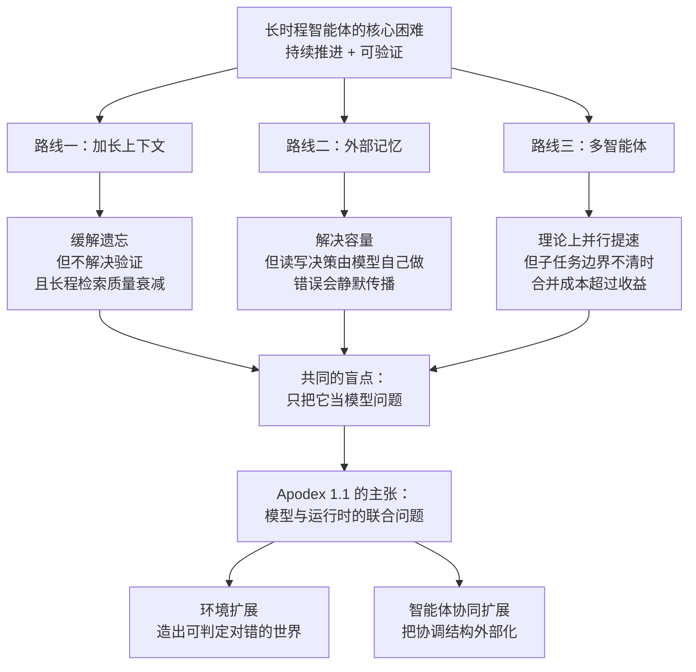
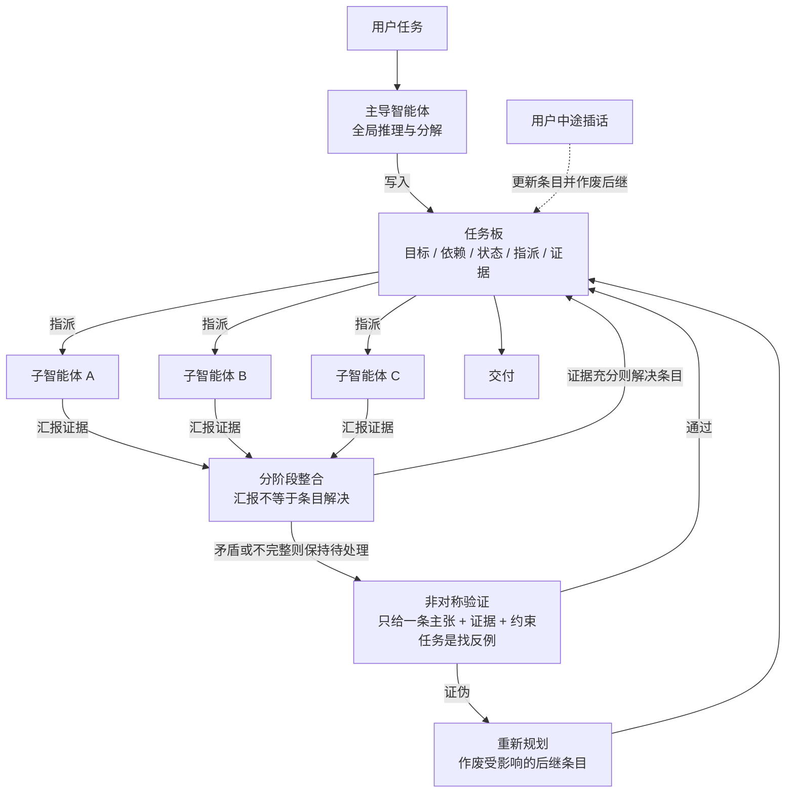
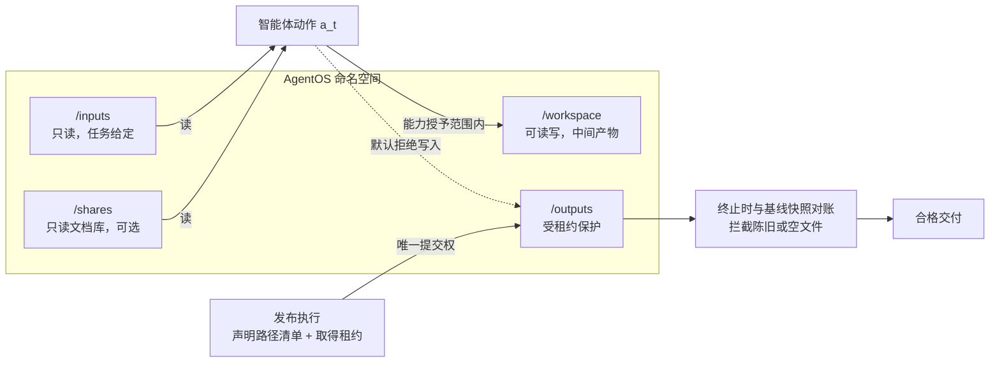
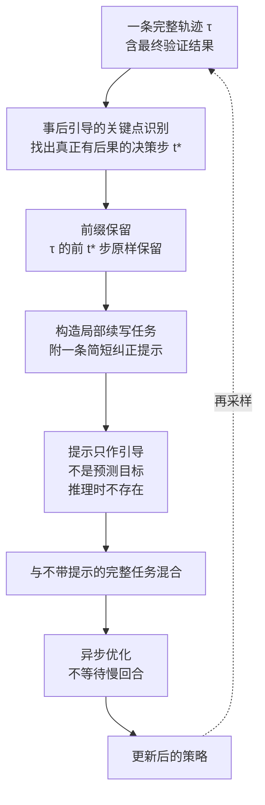
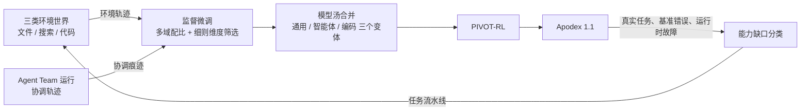

# Apodex 1.1：把智能体推向复杂工作

> **原题**：Apodex 1.1: Scaling Agentic Intelligence for Complex Work
> **作者**：Apodex Team（七十余位署名者，论文以团队名义发表）
> **机构**：论文正文未标注所属机构，arXiv 备注称其为一家独立非营利组织，对外站点为 apodex.ai
> **年份**：2026（arXiv ID 2608.23283，2026 年 8 月 24 日提交）
> **分类**：cs.AI / cs.CL / cs.LG
> **链接**：https://arxiv.org/abs/2608.23283
> **精读日期**：2026-08-25

---

## 阅读须知

### 这篇在领域里的位置

过去三年，语言模型这条线上的进展大致可以分成两段。前一段的主题是让模型把话说对，从预训练规模的扩张，到指令微调，再到基于人类反馈的强化学习，衡量的标准始终是单轮输出的质量。后一段的主题变成了让模型把事做完，也就是让它调用工具、读写文件、执行代码、检索网页，在一个真实存在的环境里推进一件需要很多步才能完成的任务。这后一段通常被称作智能体，英文是 agent。

智能体这条线在 2025 年前后迅速铺开，但很快遇到了一个尴尬。绝大多数公开工作在一个统一的模式下运行，就是所谓的 ReAct，模型交替产出一段推理和一个动作，再把工具返回的结果读回来，如此往复。这个模式在几步到十几步的任务上表现良好，一旦任务的时间跨度拉长到几十步甚至上百步，问题就集中暴露出来：上下文被工具的返回值撑爆，早期的错误没有机制被发现，中途的状态无人维护，最后交付的东西是否真的满足要求也无从检验。

于是研究的重心开始从模型本身向外扩散，扩散到两个方向。一个方向是环境，也就是给模型什么样的世界去练习，这个世界是否足够多样、是否可以被自动判定对错。另一个方向是组织，也就是当一个智能体不够用的时候，多个智能体如何分工、如何把彼此的结果合起来、谁来负责重新规划。Apodex 1.1 正好站在这两个方向的交汇处，它把这两件事分别命名为环境扩展和智能体协同扩展，并且明确宣称训练不是第三条独立的扩展轴，而是把前两条轴产出的东西转化成模型行为的手段。

值得注意的是，这篇论文的形态更接近一份系统报告而不是一篇方法论文。它花在运行时设计上的篇幅明显多于花在模型架构上的篇幅，全文几乎没有讨论网络结构，却详细规定了文件系统的命名空间、发布产物时的租约机制、以及上下文超限时的分层压缩策略。读的时候需要带着这个预期，否则会觉得它在该讲模型的地方一直在讲工程。

### 读完能回答什么

读完这份笔记，应当能够回答下面这几个问题：

1. 环境扩展具体扩的是什么，为什么可验证性比多样性更难做，三类环境各自用什么手段判定任务是否完成。
2. 任务板为什么必须是外部化的共享记录，而不能只是模型自己脑子里的一份计划。
3. 什么叫非对称验证，为什么让验证者去找反例比让它重做一遍问题更划算。
4. PIVOT-RL 跟常规的强化学习相比改动在哪里，为什么它要保留轨迹前缀而不是从头重来。
5. 为什么 Apodex 1.1 在金融和科研这类基准上能超过更大的前沿模型，却在通用知识考试上明显落后，这个反差说明了什么。

### 阅读前置

预设读者熟悉 Transformer 的基本结构、监督微调与强化学习在语言模型上的常规用法，也大致知道工具调用与函数调用是怎么回事。不预设读者做过智能体系统的工程实现，也不预设读者了解沙箱、租约、快照这类运行时概念，凡是涉及这些的地方都会先铺垫再展开。

### 缩写与专名表

- **ReAct**（Reasoning and Acting）：一种智能体运行模式，模型在推理与动作之间交替，每次动作的结果作为新的观察进入下一轮。本文中它同时被用作一个对照组的名字，代表单智能体串行执行。
- **Agent Team**：本文对多智能体协同模式的称呼，由一个主导智能体加若干子智能体构成，与 ReAct 对照。
- **AgentOS**：本文提出的运行时，负责维护工作区状态、工具接口、产物发布与预算控制。
- **SFT**（Supervised Fine-Tuning，监督微调）：用人工或模型生成的示范轨迹直接训练模型模仿的阶段。
- **RL**（Reinforcement Learning，强化学习）：用奖励信号而非示范来优化策略的阶段。
- **PIVOT-RL**：本文提出的强化学习方法，核心是定位轨迹中的关键决策点并在该点做局部续写。
- **Model Soup**（模型汤）：把在不同数据配比上分别训练出的多个模型权重直接平均，得到一个兼顾多种能力的模型。
- **HLE**（Humanity's Last Exam）：一个覆盖广泛学科、题目极难的封闭式知识与推理测评集。
- **GDPVal**：一个以真实职业产出为对象的测评集，衡量模型完成专业工作交付物的质量。
- **fail-to-pass / pass-to-pass**：软件工程任务里验证补丁正确性的两类测试，前者要求在修改前失败、修改后通过，后者要求在两种状态下都通过。

---

## 一、问题

### 为什么这个问题值得做

设想一件非常普通的工作。有人要求你在两天内交出一份关于某个细分市场的尽职调查报告，材料散落在一个有几十个子目录的共享盘里，格式包括表格、幻灯片、扫描件和几份口径互相矛盾的旧报告，其中若干关键数字需要你自己从原始流水重新算一遍，另有一部分信息盘里根本没有，只能去公开网络上找，找到之后还要判断来源是否可信。最后交付的不是一段话，而是一个文件，文件里的每个数字都要经得起追问。

这件事对今天的语言模型来说不难在任何单独一步。读表格不难，写摘要不难，调用一个搜索接口也不难。难的是把这些步骤连起来跑上几个小时而不散架。跑到第四十步的时候，模型很可能已经忘了第七步算出来的中间结果放在哪个文件里；跑到第八十步的时候，上下文窗口早已被前面几十次工具返回的长文本填满；而当它最终产出一个文件时，没有任何机制能够告诉你这个文件里的数字究竟是算出来的还是编出来的。

论文把这种能力单独命名为工作能力，定义是朝一个真实目标持续推进并且推进过程可被验证。这个定义里有两个词是关键的，一个是持续，一个是可验证。持续针对的是时间跨度，可验证针对的是可信度，而现有的评测体系恰好在这两点上都薄弱，它们大多用一次问答的正确率来衡量模型，而一次问答既不持续也不需要中间过程可查。

过去几年这个方向上的努力大致沿三条路线展开。第一条是把上下文窗口做长，从几千个词元一路推到上百万个，寄希望于模型能把整个任务过程装进一次调用里。这条路线缓解了遗忘，却没有解决验证问题，而且长上下文中的信息检索质量会随位置显著衰减。第二条是给模型加外部记忆，把中间结果写进向量库或者结构化存储，需要时再取回来。这条路线解决了容量，却引入了新的问题，就是模型自己决定写什么和取什么，一旦这个决策出错，错误会静默地传播下去。第三条是多智能体，把任务拆给多个模型实例分头做。这条路线在纸面上很吸引人，实践中却经常退化，因为子任务的边界如果划不清楚，合并结果时产生的冲突比分头做省下的时间还多。

Apodex 1.1 的判断是，这三条路线卡住的原因是同一个，就是它们都把智能体当成一个模型问题来处理，而它实际上是一个模型加运行时的联合问题。模型负责决定做什么，运行时负责保证做过的事留下痕迹、产出的东西可以被检查、以及多个执行者之间的状态不会互相踩踏。因此论文的做法是同时动两头，一头把环境造得更多样也更容易判定对错，另一头把协同的结构从模型的隐式推理里搬出来变成显式的运行时对象。

### 三条路线的关系

### 任务契约的形式化

论文给出了一个统一的形式化，用来把上面这些讨论收进一个可以讨论的框架。一个任务被写成一个契约：

$$\mathcal{E} = (\mathcal{W}, W_0, q, \mathcal{A}, \mathcal{T}, \Omega, \mathbf{B}, D, V_D)$$

这些符号逐个来看。$\mathcal{W}$ 是工作区状态的全体可能取值，$W_0$ 是初始状态，也就是任务开始时摆在智能体面前的那个世界。$q$ 是任务的自然语言描述。$\mathcal{A}$ 是可用动作的集合，具体到实现上就是这次执行里模型被授予的工具。$\mathcal{T}$ 是状态转移函数，$\Omega$ 是观察函数，$\mathbf{B}$ 是各类预算的上限，包括工具调用次数与时间。$D$ 是交付要求，$V_D$ 是对应的验证器。

有了这套符号，一次执行就可以写成两条递推：

$$W_{t+1} = \mathcal{T}(W_t, a_t), \qquad o_{t+1} = \Omega(W_t, a_t, W_{t+1})$$

第一条说的是动作把工作区从一个状态推到下一个状态，第二条说的是智能体并不能看到完整的工作区，它只能看到观察函数返回的那一部分。这个区分很重要，它意味着工作区是客观存在的，而模型对工作区的认识是有限且可能过时的，后面许多设计都是为了缩小这个差距。

最终的判定写成：

$$S_D = V_D(W_0, W_H, \tau_H) \in \mathcal{Y}_D$$

也就是验证器同时看初始状态、终止状态和整条轨迹，而不是只看最后的输出。之所以要把轨迹也交给验证器，是因为许多交付要求本身就包含过程性条件，例如某个数字必须来自可追溯的计算而不是模型的记忆。

---

## 二、方法

### 环境扩展：造世界，以及让世界能判卷

环境扩展这个名字容易让人以为只是把训练任务的数量做大。论文强调它扩的是两样东西，一样是多样性，另一样是可验证性，而后者才是真正的瓶颈。原因不难理解：造一万个看起来不同的任务是容易的，让这一万个任务里的每一个都能被自动判定完成与否是困难的，而没有自动判定就没有强化学习可用的奖励信号。

论文把环境分成三个家族，文件世界、搜索世界和代码世界，三者的构造方式与验证边界各不相同。

**文件世界**模拟的是信息散落在嵌套目录里、格式互不统一的工作场景。它的构造不是先摆文件再编任务，而是反过来，先定义一套业务状态、权限关系、推导逻辑与交付要求，再把这套抽象结构投影成一个具体的工作区。这样做的好处是任务的正确答案在造世界的时候就已经确定了，因此可以用代码算出来，而不需要事后请人或者请模型来判卷。

覆盖面上，论文采用了一个按职业展开的注册表，它先把领域展开为职业，再把职业展开为交付物簇，最后把每个簇展开为具体的任务角度。当前这个注册表覆盖 33 个领域、318 种职业、1208 个交付物簇。这个数字值得留意，它说明多样性在这里是被有意组织过的，而不是靠随机采样堆出来的。

**搜索世界**模拟的是开放网络上的调研，包含发现、获取与证据综合三个环节。智能体需要自己拟定查询、筛选来源、顺着引用往下追、并且在多个来源口径不一致时做出取舍。这类任务的验证最麻烦，因为答案往往不唯一，所以论文没有采用让另一个模型打分的做法，而是要求出处加主张审查，也就是既要检查结论本身，也要检查支撑结论的证据链是否真的存在并且真的支持该结论。

为了刻画搜索任务的难度，论文定义了一个获取压力指标：

$$\rho_{\mathrm{acq}}(\mathcal{E}) = \frac{N_{\mathrm{cand}}(\mathcal{E}) + N_{\mathrm{hop}}(\mathcal{E})}{B_{\mathrm{tool}}(\mathcal{E})}$$

其中 $N_{\mathrm{cand}}$ 是候选来源的数量，$N_{\mathrm{hop}}$ 是证据需要跳转的次数，$B_{\mathrm{tool}}$ 是允许的工具调用预算。这个比值的含义相当直观：分子代表要看的东西有多少，分母代表允许看几次，比值越大，智能体就越不能靠穷举，必须靠判断。

**代码世界**是有状态的环境，智能体在其中修改仓库、调整依赖、启停进程，并从沙箱执行中获得反馈。构造上论文把可复用的基础设施与任务特有的状态分开，前者包括基础镜像、解释器与工具链，后者才是每个任务不同的部分。对于从真实仓库采集而来的任务，验证遵循软件工程里的惯例，fail-to-pass 的测试必须在基础状态下失败、在参考修改之后通过，pass-to-pass 的测试则必须在两种状态下都通过。这一对条件合起来，既能确认补丁真的修好了目标问题，也能确认它没有顺手弄坏别的东西。

三个家族的验证边界可以并排看：

| 环境家族 | 任务形态 | 验证依据 |
|---|---|---|
| 文件世界 | 在嵌套目录与异构格式中推导并交付 | 代码可算出的数值，或记录在案的出处 |
| 搜索世界 | 开放网络上的发现、获取与证据综合 | 出处加主张审查，不单靠模型评判 |
| 代码世界 | 有状态的仓库修改与沙箱执行 | 测试通过情况加产物检查 |

### 轨迹的可重放性

环境造好之后还有一个容易被忽略的问题，就是采集到的轨迹是否可信。论文在这里定下了一条相当严的规矩：一条轨迹只有在初始状态可以被重建、工具执行是隔离的、并且验证器可以被重新运行的前提下才会被保留。为此每条轨迹都附带一份重放记录，内容包括世界的随机种子与生成器版本、各个工具的版本、完整的动作与观察序列、文件层面的差异、验证器版本以及终止原因。

这条规矩的代价是采集效率下降，收益则是训练数据不会掺进无法复现的样本。考虑到强化学习对数据质量的敏感程度远高于监督学习，这个取舍是合理的。

### 智能体协同扩展：把计划搬到桌面上

如果说环境扩展解决的是练习场的问题，那么协同扩展解决的是组织的问题。论文的核心主张是，当任务足够长，主导智能体不能把分解结果留在自己的推理里，必须把它外部化成一块持久的任务板。

任务板上的每一个条目包含界定清楚的目标、依赖关系、解决状态、被指派的智能体，以及返回的证据与产物。解决状态是一个四值的枚举，分别是待处理、进行中、已解决和已取消。论文用一句话说明了为什么它必须是外部的：这块板不只是私有推理的可视化，它是模型、运行时与用户之间共享的协调记录。

这句话背后有三层实际含义。第一层是运行时可以读到计划，因此可以据此调度与限流。第二层是用户可以看到计划，因此可以中途干预。第三层，也是最容易被低估的一层，是模型自己在下一轮可以重新读到计划，因此计划不会随着上下文被压缩而丢失。

**分阶段的结果整合**是协同机制里最不直观的一处设计。通常的做法是子任务返回即视为完成，论文却刻意让这两件事解耦：一个子智能体的执行可以已经汇报，而对应的条目仍然保持待处理，原因可能是汇报不完整、与其他证据矛盾、或者尚在等待验证；反过来，协调者也可以用来自若干次执行的证据合并解决同一个条目。这样一来，结果一旦返回就能立刻解锁依赖它的后续任务，而不必等所有分支都跑完。

**非对称验证**是另一处值得展开的设计。让一个验证者重做一遍问题然后比对答案，成本几乎等于把任务做了两次。论文的做法是刻意收窄验证的范围：验证者拿到的不是整个问题，而是一条具体的主张、它的支撑证据、以及适用的交付约束，任务是去找反例、找独立来源、或者找出违反契约的地方。这实际上是把验证从求解问题转成了证伪问题，而证伪通常便宜得多。

与之配套的是自适应的最大团队投入，也就是只对薄弱的、有争议的、或者承重的主张追加调查，并且在每次返回之后重新分配投入。

**异步的人工介入**允许用户在执行过程中发消息进来。论文对这类消息做了区分：如果消息澄清了要求或者改变了优先级，那么它会更新任务板上的条目并作废受影响的后代条目，但不会重新签一份新的任务契约；如果消息只是一个不改变任务的提问，那么它会得到一个及时的简短回复，而其他独立的执行继续进行。这个区分看似琐碎，实际上决定了系统在被打断之后还能不能接着跑。

### AgentOS：工作区、命名空间与发布

运行时这一层，论文把工作区在时刻 $t$ 的状态写成一个六元组：

$$W_t = (F_t, Q_t, C_t, I_t, G_t, K_t)$$

$F_t$ 是文件状态，$Q_t$ 是已检索到的证据，$C_t$ 是可执行状态与日志，$I_t$ 是产物索引，$G_t$ 是把来源、动作与产物连起来的依赖图，$K_t$ 是可选的运行时控制状态，多智能体模式下的任务板与智能体总线就住在这一格里。

把任务板放进 $K_t$ 而不是放在模型之外，带来一个干净的性质：读取或者修改任务板就是一个普通的动作 $a_t$，工具返回的结果作为下一步的观察 $o_{t+1}$。也就是说协调不需要一套单独的机制，它复用了工具调用这条通路。

文件系统被划成几个可见性规则明确的区域。`/inputs` 存放任务给定的只读文件，`/workspace` 是智能体做计算、记笔记、放候选结果的地方，`/outputs` 是最终交付物的收集根目录，另有一个可选的 `/shares` 用于只读的组织文档库。

文件访问采用能力授予而非环境默认，也就是说模型能不能读文件、能不能构造结构化文件、能不能编辑、能不能拿到 shell，全部由本次执行的配置决定，而不是一律给全。

**产物发布**这一块论文写得格外具体，因为它直接关系到交付是否可信。发布与生产被分开：一次发布执行必须声明一份精确的路径清单，并且一个运行时范围内的租约在同一时刻只把提交权授予至多一个活动会话。非发布者对 `/outputs` 的写入是默认拒绝的。执行结束时，清单里的条目会与一份基线快照做对账，用来防止陈旧文件或者空文件冒充成合格的交付物。

**上下文与预算管理**同样落在运行时。压缩是分层的，触发条件采用服务方报告的词元用量而不是本地估算，第一层只驱逐工具观察的正文而保留结构，第二层才用模型去总结较早的中段内容。预算上区分软截止与硬超时，软截止临近时当前活动的智能体开始收拢已有发现，硬超时到达时则由一次有界的收尾调用从已完成的工作里抢救出部分结果。

### 训练：SFT 打底，PIVOT-RL 补刀

训练分两段。第一段是监督微调，作用是给后续训练一个行为上的冷启动。它的数据配比横跨通用推理、智能体工具使用、搜索、文件交互、编码、数学、科学与金融推理、专业交付以及多智能体协同。所有轨迹被归一化成同一套有状态的交互模式，随后过滤掉工具交互非法、状态不一致或者交付不完整的样本。

值得一提的是打分方式。对于用评分细则打分的任务，论文没有采用一个总分阈值来筛，而是挑选与任务相关的细则维度分别设阈值，理由是单一的聚合评判分数会把不同性质的缺陷混在一起。三个分别在通用、智能体、编码方向上训出来的监督微调变体最后通过模型汤合并。

第二段是强化学习，论文提出的方法叫 PIVOT-RL，核心思想是局部轨迹优化。常规做法是把整条轨迹的最终奖励回传，问题在于一条八十步的轨迹里可能只有第十七步那个决定是错的，而均匀的信用分配会把责任摊到所有步上。PIVOT-RL 的做法分四步。

第一步是事后引导的关键点识别，从已完成的轨迹里回头找那些真正有后果的决策点，典型特征是模型在此处采用了不会有结果的策略、依据了不充分的证据、误用了工具、或者没有及时修正一个已经站不住的假设。第二步是前缀保留，关键点之前那段有用的轨迹原样留着，不重跑。第三步是构造局部续写任务，在关键点处给出一条简短的纠正提示，这条提示提供方向性的引导，但它从不作为预测目标，并且在推理时不存在。第四步是异步优化，已完成的轨迹不必等待较慢的回合，这一点对于搜索、代码执行与文件处理这类耗时差异极大的混合负载尤其重要。

最后，局部续写会与不带提示的完整任务混合训练，论文给出的理由是这样可以在失败相关的状态上高效学习，同时保留端到端自主解题的能力。

整体的训练与数据回路则是这样：

这个回路里有一处设计值得单独指出。模型上线之后遇到的真实任务失败、基准测试上的错误、以及运行时故障，会被归类成能力缺口，再由一条任务流水线把缺口转成新的训练任务喂回环境。论文对这个回路的措辞相当克制，明确写道自我演化一词仅指这条受管理的工程回路，不指不受约束的模型自我修改。

---

## 三、实验

### 评测的组织方式

论文的评测覆盖五个方向，分别是专业工作、金融与商业、科学研究、通用推理与搜索、以及数学与编码。每个基准都同时报告两种执行模式的成绩，ReAct 代表单智能体串行，Agent Team 代表多智能体协同，因此表格本身就构成了一组关于协同是否有效的对照。

### 主要数字

下面这张表汇总了 Apodex 1.1 完整模型的成绩，以及论文引用的外部参照系统：

| 基准 | 方向 | ReAct | Agent Team | 外部参照 |
|---|---|---|---|---|
| GDPVal | 专业工作交付（胜率） | 69.5 | 78.8 | Claude-Opus-5：89.4 |
| APEX-Agents | 专业工作 | 34.4 | 38.5 | Claude-Opus-5：42.3 |
| FrontierFinance | 金融 | 48.7 | 54.3 | Claude-Opus-5：49.2 |
| FrontierScience-Research | 科学研究 | 55.0 | 63.3 | DeepSeek-V4-Flash-0731：55.0 |
| BioMysteryBench（人类困难档） | 科学研究 | 23.5 | 35.3 | 未列 |
| Humanity's Last Exam | 通用知识与推理 | 53.2 | 56.1 | Claude-Opus-5：64.7 |
| DeepSearchQA（F1） | 搜索 | 88.2 | 92.4 | 未列 |
| YC-Bench | 商业模拟（净值） | 1,038,255 美元 | 未单列 | 未列 |

那个可本地部署的小模型，也就是 350 亿参数的 Apodex 1.1 Mini，成绩如下：

| 基准 | ReAct | Agent Team |
|---|---|---|
| FrontierFinance | 40.0 | 50.2 |
| FrontierScience-Research | 45.0 | 51.7 |
| APEX-Agents | 24.2 | 27.7 |

### 协同确实有效，而且在难题上收益最大

先看最直接的一条结论。Agent Team 在所有报告的基准上都优于 ReAct，没有例外。但更有意思的是增益的分布：BioMysteryBench 的人类困难档从 23.5 提到 35.3，增加 11.8 个点；GDPVal 从 69.5 提到 78.8，增加 9.3 个点；而 DeepSearchQA 只从 88.2 提到 92.4，增加 4.2 个点。

这个分布是有规律的。增益最大的两个基准，一个是需要跨越多个证据源做长链条推断的生物学谜题，另一个是需要产出完整专业交付物的工作任务，二者的共同点是任务天然可以被切成互相独立的子块。而增益最小的搜索问答，本身链条较短、可切分性差，多铺几个智能体上去帮助有限。换句话说，协同的收益不来自算力的堆叠，来自任务结构里本来就存在的并行性。

### 一个值得单独讨论的反差

把外部参照那一列竖着看，会发现一个相当明显的分裂。在 FrontierFinance 上，Apodex 1.1 的 Agent Team 拿到 54.3，超过 Claude-Opus-5 的 49.2；在 FrontierScience-Research 上，它拿到 63.3，超过 DeepSeek-V4-Flash-0731 的 55.0。但在 Humanity's Last Exam 上，它的 56.1 明显落后于 Claude-Opus-5 的 64.7；在 GDPVal 上，78.8 对 89.4，差距超过十个点。

这个分裂几乎可以直接读出两类任务的区别。Apodex 1.1 领先的那些基准，任务形态是去环境里查、算、验，成绩主要由能不能把证据链走完决定。它落后的那些基准，一个考的是模型自身装了多少知识以及推理有多深，另一个考的是最终交付物的专业成色，二者都更依赖底座模型本身的能力而不是外围的运行时。

论文自己的表述是它用了一个明显更小的模型达到了领先梯队，这个说法在前一类任务上站得住，在后一类任务上则是被数据否定的。诚实地说，这份工作真正证明的是环境与协同能把一个中等规模的模型在流程型任务上推得很远，而不是它们可以替代底座能力。

### 小模型的代际提升

Apodex 1.1 Mini 与上一代 Apodex 1.0 Mini 在重叠任务上的对比也被报告了。FrontierFinance 上，ReAct 模式从 33.2 提到 40.0；Agent Team 模式的提升幅度更大。APEX-Agents 上同样呈现明显的代际提升。

值得注意的是 Mini 在 FrontierFinance 上的 Agent Team 成绩是 50.2，这个数字已经接近完整模型 ReAct 模式的 48.7，甚至略高。这说明在这一类任务上，协同结构所补偿的能力差距，大致相当于一次显著的模型规模提升。对于关心本地部署的读者，这是全文最有实用价值的一个数字。

### 消融方面的实际情况

需要如实说明的是，论文并没有提供严格意义上的消融实验。它给出的对照有三类：ReAct 与 Agent Team 的执行模式对照、Mini 两代之间的对照、以及一张随强化学习算力增加而在三个留出的智能体评测上变化的趋势图。

但是对于论文自己提出的那些具体设计，例如任务板外部化、非对称验证、分阶段整合、发布租约，都没有单独的开关实验来证明各自的贡献。这意味着读者无法判断这套系统的收益究竟集中在少数几个机制上，还是均匀分布在全部机制上。

---

## 四、局限

### 论文自己承认的部分

**协调平面不能跨进程恢复。** 论文明确写道，当前的任务板与智能体总线会话都活在工作进程里，运行时并不会把它们与工作区文件系统一起做原子检查点。客户端在暂停或者异常终止时可以保留最后一次流式推送的任务板，但进程重启后的恢复与文件系统的历史回卷都不在当前契约的范围内。换句话说，一次崩溃可以让几个小时的协调状态无法完整复原。

**发布保护不是系统调用级别的。** 那套护住 `/outputs` 的机制只管住了 AgentOS 内置的文件与 shell 写入通路，它不是一个系统调用层面的文件系统监控。对于那些输出路径无法被静态确定的命令，运行时选择拒绝执行而不是放行，这是一个偏保守的取舍，代价是某些合法操作会被误拒。

**运行时契约不保证结论正确。** 这一条论文说得相当直白：上述机制定义的是关于状态、执行与交付的运行时契约，它们并不保证被检索到的来源、某次计算、某个科学方法或者最终结论是正确的。在高风险场景下，仍然需要任务相应的验证、可复现的计算与人工复核。这个声明值得赞许，因为它把可追溯与可信这两件常被混为一谈的事分开了。

**训练不是独立的扩展轴。** 论文自陈训练的作用是把前两条轴产出的东西学成行为，因此它的上限受制于环境覆盖面与协调样本的丰富程度。注册表覆盖 33 个领域看似不少，但真实世界的职业分布远比这个数字长尾。

### 读完能看出来的部分

**完整模型的规模没有公开。** 论文反复强调它用了一个明显小于诸多前沿系统的模型，却始终没有给出这个模型的参数量。只有 Mini 的 350 亿被写了出来。在缺少这个数字的情况下，效率方面的主张无法被独立核验，读者也无法判断它与被对照的系统之间的算力差距究竟有多大。

**外部参照的口径无法核对。** 表中引用的 Claude-Opus-5 与 DeepSeek-V4-Flash-0731 的成绩，其执行框架、工具集与预算是否与 Apodex 自己的设置一致，论文没有交代。智能体评测对这些外围条件极其敏感，同一个模型换一套工具与预算，成绩摆动十个点并不罕见。因此表里的跨系统比较应当被看作方向性的参考，而不是严格的排名。

**任务板的可扩展性存在隐忧。** 任务板作为一个共享的可变对象，其读写全部走普通的工具调用。当子智能体数量增加时，这个对象既是协调的中枢也是竞争的焦点，论文没有讨论并发写入时的冲突解决策略，也没有给出子智能体数量与整体效率之间的关系曲线。

**关键点识别本身可能出错。** PIVOT-RL 依赖事后找出那个真正有后果的决策步，而这个识别过程本身是由模型完成的。如果识别偏了，前缀保留就会把错误的部分当成正确的保留下来，局部续写反而在一个已经跑偏的状态上继续优化。论文没有报告识别准确率，也没有讨论识别失败时的退化行为。

**注册表可能带来分布上的固化。** 按领域、职业、交付物簇三级展开的注册表保证了覆盖的组织性，但它同时也把训练分布限定在了这套分类体系之内。真实工作中那些跨职业、无法被归入既有簇的任务，恰恰可能是最难的一类，而这类任务在当前的构造方式下不容易被生成出来。

---

## 一句话

用可自动判卷的环境和一块外部化的任务板，把中等规模模型在长时程工作上推到前沿梯队。
