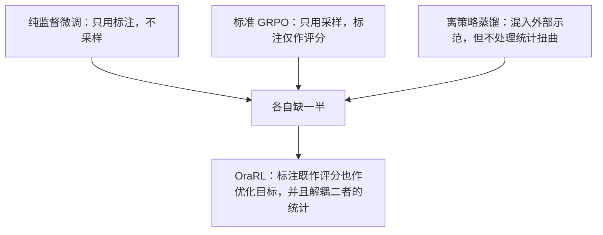
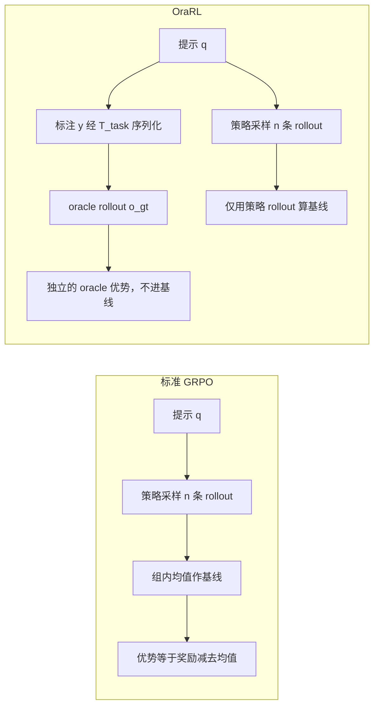
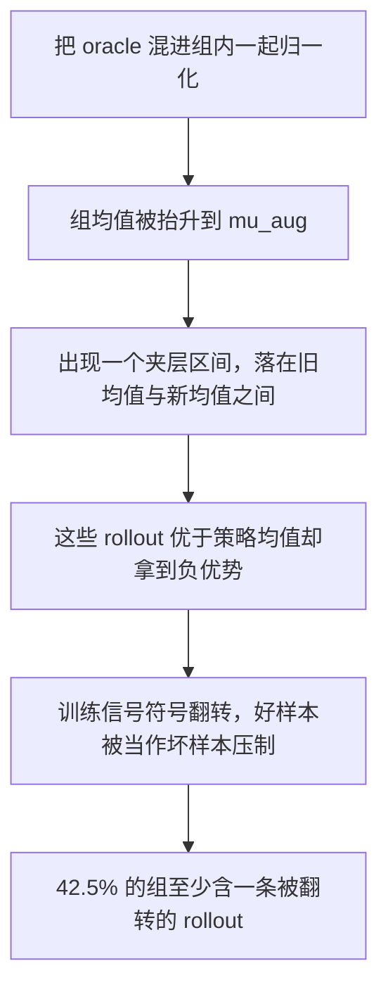
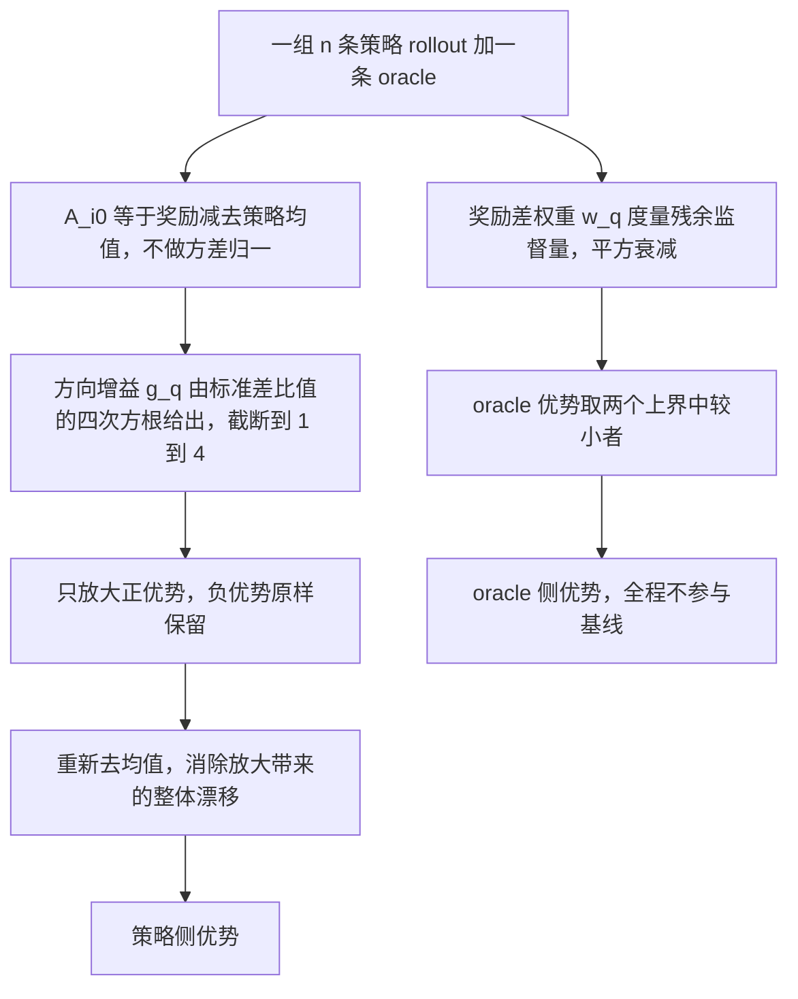
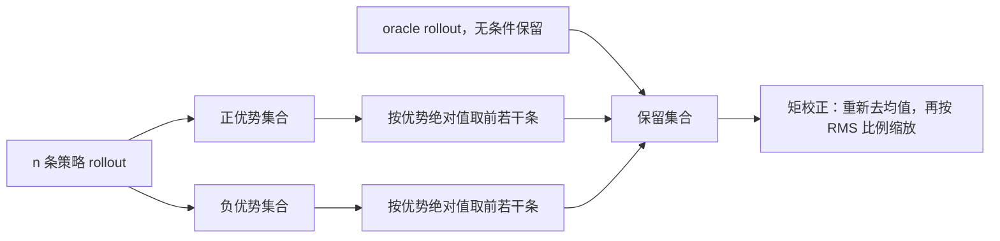
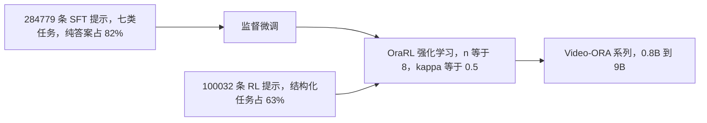

# 把标注当作 rollout：面向视频多模态大模型的高效可扩展强化学习

> **原题**：Annotations as Rollouts: Efficient and Scalable Reinforcement Learning for Video MLLMs
> **作者**：Yunheng Li、Guohong Mu、Hao Li、Shengsheng Qian、Dingwen Zhang、Qibin Hou、Ming-Ming Cheng
> **机构**：arxiv 摘要页未标注
> **年份**：2026（arxiv ID 2608.20492，2026 年 8 月 20 日提交）
> **分类**：cs.CV
> **链接**：https://arxiv.org/abs/2608.20492
> **精读日期**：2026-08-26

## 阅读须知

### 这篇在领域里的位置

这篇论文属于多模态大模型的后训练（post-training）这一支，更具体地说，属于用强化学习做后训练的那一类。要理解它的位置，需要先看清这几年这条线是怎么走过来的。

最早的多模态大模型基本靠监督微调（supervised fine-tuning，简称 SFT）来适配下游任务，也就是准备一批「输入加正确答案」的数据，让模型去拟合。这条路简单可靠，但它的天花板也很清楚：模型只学会了模仿标注，却没有学会分辨自己产生的诸多可能回答之间孰优孰劣。于是从语言模型那一侧传过来的强化学习方法开始进入视觉领域，其中影响最大的是 GRPO（Group Relative Policy Optimization，组相对策略优化）。它的做法是对同一个提示采样一组回答，用组内的平均奖励当作基线，高于平均的往上推、低于平均的往下压，从而省掉了传统强化学习里那个需要单独训练的价值网络。

GRPO 在数学推理这类任务上效果显著，原因是那类任务的采样天然带有多样性，一组里总能碰上几条质量确实很高的回答。可是当它被搬到视频感知任务上时，问题就浮现出来了，而这篇论文正是从这个断裂处切进去的。它提出的方法叫 OraRL，核心主张只有一句话：既然数据集里本来就躺着人工标注的正确答案，那就不该只把它拿来当评分的尺子，而应该把它本身当成一条 rollout 直接放进优化目标里。

### 读完能回答什么

读完这份笔记之后，应当能够回答下面这几个问题。

第一，为什么 GRPO 在视频感知任务上的采样效率会比在数学推理任务上低得多，低到需要专门设计新方法来补救。

第二，什么是「advantage inversion」（优势反转），为什么把一条高奖励的标注直接混进采样组里，反而会让原本表现不错的 rollout 拿到负的优势值。

第三，OraRL 的解耦优势估计具体解耦了什么，方向增益和 detached oracle 优势各自承担什么职责，为什么这两件事必须分开算。

第四，为什么在这类任务上引入思维链（chain-of-thought，简称 CoT）不但没有换来精度，反而把每一步的训练时间拉长了一倍以上。

第五，sign-balanced pruning 为什么要按优势的正负号成对保留，只留高分的那几条为什么不行。

### 阅读前置

这份笔记预设读者熟悉 Transformer 的基本结构、监督微调的一般流程，以及策略梯度方法的基本概念，也就是知道「优势值」大致意味着「这条样本比平均水平好多少」。它不预设读者做过强化学习的后训练工程，也不预设读者专门做视频理解，因此 GRPO 的组内归一化、视频感知的各类任务定义、以及具体的评测指标都会在文中先铺垫再展开。

### 缩写表

**MLLM**（Multimodal Large Language Model，多模态大语言模型）：能同时接受图像或视频与文本输入的大语言模型。

**SFT**（Supervised Fine-Tuning，监督微调）：用「输入加标准答案」的成对数据直接拟合模型的训练方式。

**RL**（Reinforcement Learning，强化学习）：让模型自己产生若干候选，再按奖励高低调整生成概率的训练方式。

**GRPO**（Group Relative Policy Optimization，组相对策略优化）：一种免价值网络的强化学习算法，用同一提示下一组采样的平均奖励充当基线。

**CoT**（Chain-of-Thought，思维链）：让模型在给出最终答案之前先输出一段推理过程的做法。

**rollout**：在强化学习语境下指模型针对某个提示实际采样出来的一条完整回答。本文不译，因为中文里没有对应且通行的词。

**oracle rollout**：本文提出的概念，指把数据集里的人工标注序列化成模型回答格式之后得到的那一条「标准答案 rollout」。

**on-policy**（同策略）：指用当前这一版模型自己采样出来的数据来训练当前这一版模型。

**mIoU**（mean Intersection over Union，平均交并比）：时序定位任务的常用指标，衡量预测出的时间区间与真实区间重合了多少。

**AO**（Average Overlap，平均重叠率）：目标跟踪任务的指标，衡量预测框与真实框在整段视频上的平均重合程度。

**cIoU** 与 **J&F**：分割任务的两类指标，前者衡量像素级重合度，后者同时衡量区域准确度与边界准确度。

**RMS**（Root Mean Square，均方根）：一组数值平方后取平均再开方，本文用它来度量优势值整体的尺度。

## 一、问题

### 为什么这个问题值得做

先说不解决会怎样。视频多模态大模型现在被寄予的期望是「一个模型统一处理各类视频感知任务」，包括在一段视频里找出某个事件发生的时间区间、跟踪某个目标、按一句话描述把某个物体分割出来、回答关于视频内容的问题等等。要把这么多任务塞进同一个模型，后训练阶段就必须同时面对一个规模很大、任务种类很杂的数据集。而现有的强化学习方法在这种场景下的采样效率低得让人难以接受。

低在哪里，可以用一个具体的画面来理解。GRPO 对每个提示采样八条回答，理想情况是这八条里有好有坏，模型据此学到「往好的那个方向走」。但视频感知任务的答案空间往往是高度结构化的，比如时序定位要输出一对起止时间戳，跟踪要输出一串坐标框。这类答案要么对要么错，中间地带很窄，于是一组采样里经常出现八条全错、或者八条差不多一样错的局面。这种组对训练几乎没有贡献，因为组内均值和每一条的奖励都贴得很近，算出来的优势值全是接近零的噪声。

过去几年针对这一点的主流补救办法是引入思维链，也就是让模型先写一段推理再给答案，指望推理过程的多样性能把回答的多样性带出来。这条路确实提高了一些采样质量，代价却相当大：每条 rollout 都要多生成几百个 token，训练时的采样开销随之翻倍，推理时也要付出同样的延迟。更尴尬的是，这篇论文的实验显示这笔投入在视频感知任务上并没有换来精度。

于是问题就卡在这里。旧路线要么效率太低，要么用一个昂贵的手段换来一个可疑的收益。而与此同时，一件显而易见的资源被闲置着：数据集里本来就有人工标注的正确答案，它的质量远高于任何一条采样出来的 rollout，但在 GRPO 的框架里，它只被用来当作打分的尺子，打完分就丢掉了。

### 从动机到一个可验证的技术表述

把上面那段动机落到一个清晰的技术问题上，这篇论文要解决的是：如何在不放弃 on-policy 训练框架的前提下，把数据集标注同时用作优化目标，并且让这件事在数学上不出岔子。

这里的前半句是约束，后半句是难点。约束在于作者不打算把方法退化成纯粹的监督微调，因为 on-policy 采样带来的「模型自己知道自己容易在哪里犯错」这一信息是有价值的，不能丢。难点在于，标注和采样这两类数据混在一起的时候，各自的统计性质完全不同，简单地把它们塞进同一个归一化里会产生一个相当隐蔽的错误，也就是后面要展开的优势反转。

### 前人路线的继承关系

值得把几条相关路线的关系理一遍，因为 OraRL 的定位正是在它们中间。

一条是纯 SFT，它把标注当作唯一的优化目标，完全不采样。它的好处是每一步都在往正确答案上靠，坏处是模型学不到相对好坏的概念。

一条是标准 GRPO 及其各类变体，包括 Dr. GRPO、GDPO、CPPO 等，它们把标注当作打分的依据，优化目标全部来自采样。它们的好处是保留了策略相对性，坏处就是前面说的采样效率。

还有一条是以 LUFFY 为代表的离策略蒸馏路线，做法是把一个更强的模型或者标注当作外部示范混进训练。这条路和 OraRL 最接近，区别在于它通常不处理混入之后的统计扭曲，而这恰恰是 OraRL 认为的关键所在。

## 二、方法

### 把标注变成一条 rollout

OraRL 的第一步操作在概念上非常朴素，作者把它称作「annotation-as-rollout」。对每一个训练样本，取出它的人工标注 y，经过一个与任务相关的序列化变换 T_task，把它转写成模型输出格式的一段文本，记作 o_gt。

这一步为什么需要一个变换而不是直接使用，原因在于标注在数据集里的存储格式和模型的输出格式往往不一致。举例来说，时序定位的标注在数据集里可能是一对浮点数，而模型被要求输出的是一段带特定标记的文本。T_task 做的就是这个格式对齐的工作。

得到 o_gt 之后，把它追加到该提示下已经采样出来的 n 条策略 rollout 后面，组的规模就从 n 变成了 n+1。注意这条 oracle rollout 不需要任何思维链，它就是一个直接的正确答案，因此生成它的成本几乎为零，只是一次字符串拼接。

### 优势反转：为什么不能直接混进去

这是全文最关键的一处洞察，也是方法其余部分存在的全部理由，值得慢慢展开。

先回忆 GRPO 是怎么算优势的。对一个提示，采样出的 n 条 rollout 各自得到一个奖励 r_i，取这一组的均值 μ_op 作为基线，某条 rollout 的优势就是它的奖励减去这个基线。奖励高于均值的拿正优势，训练时其生成概率被推高；低于均值的拿负优势，生成概率被压低。

现在把 oracle 混进去一起算均值。由于 oracle 的奖励 r_gt 通常是满分或接近满分，远高于策略采样的平均水平，新的均值会被它抬起来：

    μ_aug = μ_op + (r_gt − μ_op) / (n+1)

抬升的幅度是 oracle 与策略均值之差的 n+1 分之一。看上去这是一个很小的量，但它带来的后果并不小。考虑那些奖励落在 μ_op 和 μ_aug 之间的 rollout，它们的处境变了：按策略自身的标准，它们表现优于平均水平，本该拿到正优势并被鼓励；可按新的基线，它们低于均值，于是拿到了负优势，被当作反面例子压制。

作者把这个现象命名为 advantage inversion，也就是优势反转。它的危害不在于数值上偏了多少，而在于符号反了，训练信号的方向整个掉了个个儿。论文统计，在朴素混入的设定下，大约 42.5% 的组里至少含有一条被翻转的 rollout，而单条 rollout 的翻转率是 22.4%。相应的代价也是可见的：朴素地把 oracle 塞进组里，GRPO 的平均分从 60.3 掉到 55.4，比不加还差了将近五个点。

### 解耦优势估计

既然问题出在「让 oracle 参与基线计算」，最直接的修法就是不让它参与。OraRL 的核心因此叫做解耦优势估计（decoupled advantage estimator），它把原本混在一起的两件事拆成了两条独立的通路。

第一条通路只处理策略 rollout。基线仍然是策略自身的均值 μ_op，优势就是最朴素的差值：

    A_i^(0) = r_i − μ_op

这里有一处刻意的取舍值得注意：作者不做方差归一化，也就是不再除以组内标准差。标准 GRPO 是要除的，目的是让不同难度的提示产生可比的梯度尺度。放弃它的理由是，除以标准差会把「这一组整体有多分散」这个信息抹掉，而 OraRL 后面正要用到这个信息。

第二条通路单独处理 oracle，它被作为一个 detached 的优化目标，也就是说它有自己的优势值，但这个值既不影响基线，也不参与策略侧的归一化。

### 方向增益：把组间差异重新注入

放弃方差归一化之后，需要用别的方式把「这一组的策略表现离标准答案有多远」这一信息带回来。作者的做法是引入一个方向增益 g_q：

    g_q = clip[ (σ_aug / σ_op + ε)^(1/4), 1, 4 ]

其中 σ_op 是策略 rollout 奖励的标准差，σ_aug 是加入 oracle 之后的标准差。两者的比值反映了 oracle 相对于这一组策略采样有多突出：如果这一组本来就表现不错，加入 oracle 不会让分布变得更分散，比值接近 1；如果这一组普遍很差，oracle 一进来分布立刻被拉开，比值就大。四次方根的作用是压缩这个比值的动态范围，截断到 1 到 4 之间则是为了防止极端情况下梯度爆掉。

这个增益只作用于正优势那一侧：

    U_i = g_q · A_i^(0)，当 A_i^(0) > 0
    U_i = A_i^(0)，否则

设计意图是清楚的。当整组表现都差、离标准答案很远的时候，那几条相对好一点的 rollout 就格外珍贵，应该被更用力地往上推；而负优势那一侧不放大，是为了避免在模型本来就学得糟糕的提示上过度惩罚，那样容易把训练带崩。

放大之后整组的均值会漂移，所以还要重新去均值：

    A_i^op = U_i − (1/n) Σ_j U_j

### detached oracle 优势：给标注一个有节制的权重

oracle 自己的优势值 A_gt 需要单独确定。这里的分寸很微妙：给得太小，标注等于白加；给得太大，方法就退化成变相的监督微调，on-policy 的意义荡然无存。

作者先定义一个奖励差权重，用来度量「标注相对于当前策略还剩多少可教的东西」：

    w_q = [ clip( (r_gt − μ_op) / (r_gt + ε), 0, 1 ) ]²

分子是 oracle 与策略均值的差距，分母是 oracle 自身的奖励，因此这是一个归一化后的相对差距。平方的作用是让这个权重在差距不大时迅速衰减，也就是说当策略已经接近标准答案时，标注的推动力自动退场。

最终的 oracle 优势取两个上界里较小的那个：

    A_gt = min( 2·w_q, clip(1.2·A_max^+, 0.05, 1) )

其中 A_max^+ 是这一组策略侧最大的正优势。第二个上界的含义是，oracle 的权重不允许比组内最好的那条策略 rollout 高出太多，超出 20% 就被截住。这一条约束是整个设计里最能体现克制的地方：它保证了标注始终是在策略自身的尺度上做增量补充，而不是凌驾其上。

### sign-balanced pruning：把计算量砍掉一半

到这里精度问题解决了，但效率问题还在：一组 n+1 条 rollout 全都要参与反向传播，开销并不小。作者的做法是在优势算完之后做一次剪枝，只保留其中一部分参与更新。

关键在于保留的规则。最容易想到的是只留优势绝对值最大的几条，但那样很可能一整组留下来的全是正例或者全是负例，训练信号就偏了。sign-balanced pruning 的做法是按正负号成对保留：把策略 rollout 分成正优势和负优势两个集合，各自按优势绝对值从大到小排序，然后从两边等量取。保留的总数是 K = ⌊n(1−κ)⌋，其中 κ 是剪枝比例。如果某一侧的候选不够，空出来的名额转给另一侧。oracle 则无条件保留。

剪枝之后组的统计量又变了，所以还要做一次矩校正（moment correction）。这一步做两件事：先把优势重新去均值，并且用一个约束保证 oracle 拿到的权重非负；再按均方根做尺度匹配，

    λ_q = clip( RMS_op / (RMS_S + ε), 0.25, 1 )

让剪枝后这一组优势的整体尺度回到剪枝前的水平，最终的优势值是 λ_q 乘以校正后的值。

论文给的实测是，这一步剪枝带来 1.48 倍的加速。

### 训练流程与配置

整体流程是先监督微调再强化学习这一常规两段式。监督微调阶段用了 284,779 条提示，覆盖七类任务，其中不含思维链的纯答案样本占 82%。强化学习阶段用了 100,032 条不重复的提示，结构化任务占 63%。

主干模型是 Qwen3.5 的四个规模，分别是 0.8B、2B、4B 和 9B，另外用 Qwen3-VL-8B 做跨主干的泛化验证。关键超参数是每个提示采样 n=8 条策略 rollout，剪枝比例 κ=0.5，也就是策略侧最终保留四条。工程栈是 veRL 框架加 vLLM 做采样生成，分布式训练用 FSDP。

## 三、实验

### 评测范围

论文的评测铺得相当开，覆盖七个任务族。时序定位在 Charades-TimeLens、ActivityNet-TimeLens、QVHighlights-TimeLens 上用 mIoU 衡量；目标跟踪在 GOT-10k 上用 AO；分割在 RefCOCO 系列、MeViS、ReasonVOS 上用 cIoU 与 J&F；空间定位在 RefCOCO 系列上用 R@0.5；时空联合定位在 STVG 上；视频问答覆盖 VideoMME、VideoMME-v2、MV-Bench、MMVU、VideoHolmes、LongVideoBench、MLVU 七个基准；空间智能则在 VSI-Bench、MMSI-Bench、MindCube 上评测。

对照组分两类。一类是方法层面的对照，包括 SFT、带与不带思维链的 GRPO、Dr. GRPO、GDPO、CPPO，以及 LUFFY 式的离策略蒸馏。另一类是闭源模型的横向参照，包括 GPT-5、Gemini-2.5-Pro、Gemini-3-Pro 和 Seed-2.0。

### 主要结果

先看时序定位。9B 规模的 Video-ORA 在三个基准上分别拿到 61.8、63.6 和 72.5 的 mIoU，对应的基线 TimeLens2-8B 是 58.6、58.6 和 70.2。

视频问答那一块，七个基准的宏平均从主干 Qwen3.5-9B 的 61.9 提升到 66.8。

跟踪任务上的差距最悬殊。GOT-10k 的 AO，Video-ORA-9B 是 78.2，OneThinker-8B 是 73.0，而未经后训练的 Qwen3.5-9B 只有 46.0。这个对比说明这类结构化输出任务对后训练的依赖极重，主干本身几乎不具备可用的能力。

空间智能那一项的数字最引人注目。VSI-Bench 的平均分，Video-ORA-9B 拿到 73.1，而 GPT-5 是 55.0，Gemini-3-Pro 是 55.1。一个 9B 的开源模型在这个基准上超出两个顶级闭源模型将近十八个点，这样的差距通常意味着该基准的分布与训练数据高度对齐，读的时候需要留一分保留。

| 任务 | 指标 | Video-ORA-9B | 主要对照 |
|---|---|---|---|
| Charades 时序定位 | mIoU | 61.8 | TimeLens2-8B 58.6 |
| ActivityNet 时序定位 | mIoU | 63.6 | TimeLens2-8B 58.6 |
| QVHighlights 时序定位 | mIoU | 72.5 | TimeLens2-8B 70.2 |
| GOT-10k 跟踪 | AO | 78.2 | OneThinker-8B 73.0 |
| 视频问答七基准 | 宏平均 | 66.8 | Qwen3.5-9B 61.9 |
| VSI-Bench 空间智能 | 平均 | 73.1 | GPT-5 55.0，Gemini-3-Pro 55.1 |

### 训练成本

这一节的数字是全文最有说服力的部分，因为它把精度和成本放在了同一张表上。

| 方法 | 每步耗时 | 时序定位 mIoU |
|---|---|---|
| SFT | 57.3 秒 | 55.3 |
| GRPO，不带思维链 | 93.9 秒 | 58.7 |
| GRPO，带思维链 | 135.6 秒 | 58.5 |
| OraRL | 62.4 秒 | 61.4 |

以 SFT 为基准，OraRL 的每步耗时是 2.2 倍，而带思维链的 GRPO 是 4.9 倍。换句话说，OraRL 用不到一半的额外开销，换来了比后者高出将近三个点的精度。

推理侧的收益来自同一个来源。在十分钟长度的视频上，Video-ORA-9B 端到端耗时 24.3 秒，而开启思维链的 Qwen3.5-9B 需要 29.0 秒，因为前者不需要生成推理过程。

### 消融实验

按对平均分的贡献从大到小排，去掉方向增益损失 1.5 个点，去掉 detached oracle 优势损失 1.4 个点，去掉奖励差权重损失 1.1 个点，去掉 sign-balanced pruning 损失 0.6 个点，去掉矩校正损失 0.4 个点。

最有说服力的一组是优势反转的直接测量，因为它把方法的动机和效果对上了。朴素混入 oracle 时，rollout 的符号翻转率是 22.4%；改用奖励塑形这类间接手段能降到 11.9%；OraRL 在剪枝前是 1.9%，剪枝后进一步降到 0.3%。这组数字说明解耦确实按设计意图消除了那个夹层区间，而不是把问题掩盖过去。

剪枝比例的取舍也做得很清楚。κ=0.5 保留四条 rollout，每步 62.4 秒，相对全组只损失 0.4 个点；κ=0.75 保留两条，每步降到 45.0 秒，但损失扩大到 2.9 个点。作者据此选择了 0.5。

跨主干的验证显示方法不依赖特定模型：在 Qwen3-VL-8B 上 OraRL 比 GRPO 高 2.6 个点，在 Qwen3.5-9B 上高 1.4 个点。

规模与数据两条曲线都是单调的。模型规模从 0.8B 到 9B，OraRL 相对主干的宏平均增益从 8 个点扩大到 12.3 个点。训练数据从 6,400 条扩到 100,032 条，OraRL 在视频感知聚合指标上涨了 5.2 个点，同期 GRPO 只涨 2.8 个点。

### 三处反直觉的结果

第一处是朴素混入反而更差。把标注直接加进组里，GRPO 的平均分从 60.3 掉到 55.4。这一条很重要，因为它排除了「OraRL 的收益只是来自多了一条高质量样本」这种简单解释，收益确实来自解耦的那套统计处理。

第二处是思维链不起作用。在时序定位任务上，带思维链的 GRPO 拿到 58.5 mIoU，反而略低于不带思维链的 58.7，而训练时间从 93.9 秒涨到 135.6 秒。这与思维链在数学推理任务上的表现完全相反，一个合理的解释是时序定位的答案空间是连续的数值区间，推理过程对确定边界并没有实质帮助。

第三处是跨任务的正迁移。在 9,000 条空间智能提示之外再加 9,000 条视频感知提示，尽管强化学习的更新次数翻了一倍，空间基准反而提升了 0.7 到 1.9 个点。

## 四、局限

### 作者承认的部分

第一条是方法的适用前提。作者明确写道，当前的形式假设每一条标注都能被序列化成一条合法的 oracle rollout，并且能被一个标量的任务奖励评价。这个假设在时序定位、跟踪、分割这类有明确正确答案的任务上成立，但一旦到了开放式的视频描述或者多轮对话，标注既难以序列化成唯一格式，奖励也难以归结为一个标量。

第二条是对监督质量的敏感性尚未验证。论文承认没有评估过在标注含糊、不完整或者带噪声时方法会怎样，也没有评估过用学习得到的 oracle 替代人工标注的情形。这一点在实践中相当关键，因为大规模视频数据集的标注质量参差是常态。

第三条是能力边界。需要复杂推理的空间任务仍然落后于部分闭源模型，路径规划这一类具体地被点了出来，Gemini-3-Pro 和 GPT-5 在这上面仍然更强。

第四条是评测范围。全部结论建立在七个任务族和两个主干家族之上。

### 读完能看出来的部分

第一，方法引入的超参数不算少。方向增益的四次方根与 1 到 4 的截断、奖励差权重的平方、oracle 优势的 1.2 倍系数与 0.05 到 1 的截断、尺度匹配的 0.25 到 1 的截断，这些数字论文都没有给出系统的敏感性分析。它们看上去都是为了「让训练不崩」而设的经验性护栏，换一个任务分布之后是否仍然合适，无从判断。

第二，VSI-Bench 上那个超出 GPT-5 十八个点的结果需要谨慎对待。这类幅度的领先通常伴随着训练数据与该基准分布的高度重合，论文没有讨论训练集与 VSI-Bench 之间是否存在近似样本，因此这个数字更适合读作「在该分布上的拟合能力」，而不是「空间智能的普遍优势」。

第三，与思维链的对比可能不完全对等。论文的结论是思维链在这类任务上不划算，但比较对象是 GRPO 加思维链，而不是 OraRL 加思维链。也就是说，无法排除思维链与解耦优势估计结合之后会有不同表现这一可能。

第四，与纯监督微调的边界仍然模糊。oracle 优势虽然被上界压住了，但当策略普遍很差、方向增益接近上限 4 的时候，训练信号里标注的分量会显著上升。在这种区域里，方法在多大程度上还保留着 on-policy 的性质，论文没有给出定量的刻画。

## 一句话

把标注序列化成一条 oracle rollout 塞进采样组，再用解耦优势估计避开它抬高基线所导致的符号翻转。
