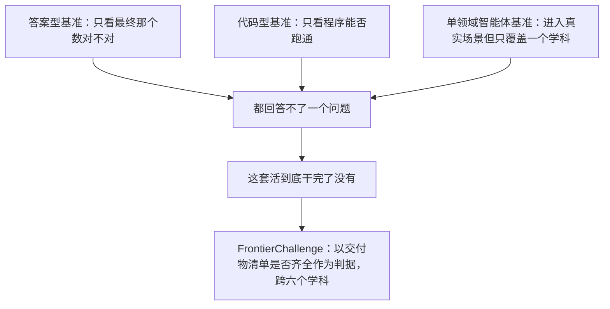
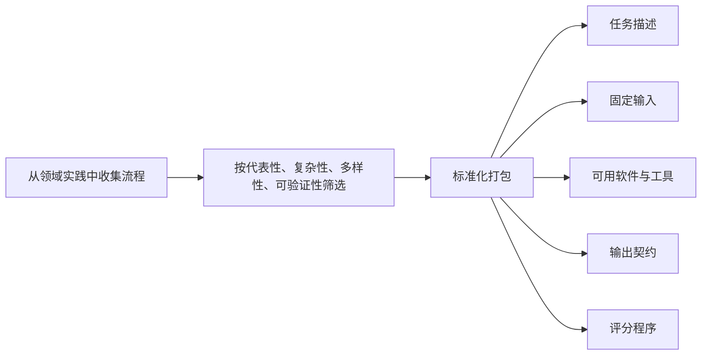
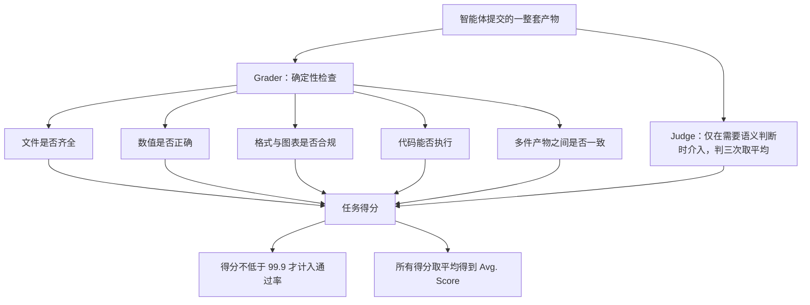
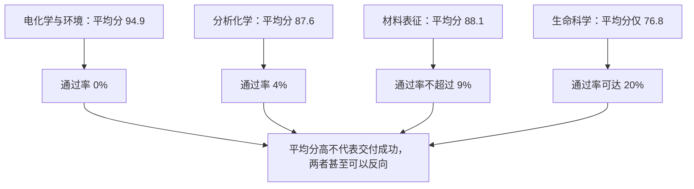

# FrontierChallenge：把科学工作流跑到交付为止的评测

> **原题**：FrontierChallenge: Evaluating Scientific Workflow Completion
> **作者**：Liangcai Su、Zhaopeng Feng、Zhuo Chen、Zhen Zhang、Xiang Lin、Ruilin Li、Handuo Zhang、Ning Wang、Kailong Wen、Yueqi Guo、Feng Xing、Yiling Guo、Chenxiong Qian、Simon Shaolei Du、Lidong Bing、Xinyu Wang
> **机构**：arxiv 摘要页未标注
> **年份**：2026（arxiv ID 2608.24979，2026 年 8 月 25 日提交）
> **分类**：cs.AI / cs.CL / cs.SE
> **链接**：https://arxiv.org/abs/2608.24979
> **精读日期**：2026-08-27

## 阅读须知

### 这篇在领域里的位置

这篇论文属于智能体评测这一支，而且是其中最贴近实用的那一小类。要理解它站在哪里，需要先看清科学场景下的评测这几年是怎么演变的。

最早的一批工作衡量的是知识本身，做法是出选择题或者简答题，看模型答不答得对，代表是各类学科问答基准。这类评测的问题很明显，它只能证明模型记得住或者推得出，不能证明它做得成任何事情。于是第二批工作转向代码，让模型写一段能跑通的程序，用单元测试来判定对错。这一步前进了很多，但它衡量的仍旧是一个孤立的片段，程序跑通之后并没有人问它有没有把该产出的东西产出来。第三批则是各类单一领域的智能体基准，比如专门做化学的、专门做生物信息的，它们确实进入了真实工作场景，但每一个都局限在一个学科内部，而且往往仍旧以某一个最终数值作为判据。

这篇论文要做的事情是把判据整个换掉。它关心的不是模型答得对不对，也不是程序跑不跑得通，而是一整套科研工作流走完之后，那一组本应交付的东西是否齐全、是否彼此一致。它给这个基准取名 FrontierChallenge，收了三百条端到端的科学工作流，横跨六个学科，目前公开了其中九十七条。

结论相当刺眼：最好的配置也只完成了九十七条里的二十条。

### 读完能回答什么

第一，为什么「平均分很高」和「任务真的完成了」可以同时成立又互相矛盾，这个分叉在数字上具体有多大。

第二，什么叫做一个「交付物清单」，它和传统评测里那个唯一正确答案有什么本质区别。

第三，这篇论文发现的那个最令人不安的现象是什么：不通过的运行里有多大比例，最后一句话仍旧在宣称自己做完了。

第四，工具调用出错的频率能不能用来预测任务成败，为什么答案是不能。

第五，通过率在不同学科之间为什么会差出几十个百分点，而作者为什么明确警告不要把这个差距读成学科难度排名。

### 阅读前置

这份笔记预设读者了解大语言模型智能体的基本工作方式，也就是知道模型可以调用工具、执行代码、读写文件，并在多轮之间自主决定下一步做什么。它不预设读者做过科学计算，因此量子化学、分子动力学、薄层色谱这些领域名词出现时都会先交代它们大致在做什么。它也不预设读者熟悉评测基准的构建流程，因此评分协议会逐层展开。

### 缩写表

**智能体（agent）**：能够自主调用工具、执行多步操作并根据中间结果调整计划的模型系统。

**脚手架（scaffold）**：包裹在模型外面、负责组织工具调用与多轮循环的那一层程序。同一个模型换一个脚手架，表现可以差很多。本文评测了三种，分别是 Codex、Claude Code 和 Frontier Agent。

**交付物（deliverable）**：任务要求最终产出的具体东西，可以是一份报告、一张表、一幅诊断图、一段可复现的脚本，或者若干件必须彼此一致的产物。

**Pass Rate（通过率）**：完全满足交付要求的任务数占总任务数的比例。本文的判定线是得分不低于 99.9。

**Avg. Score（平均分）**：所有任务得分的算术平均，用来刻画部分进展。

**Grader（判分器）**：每个任务自带的确定性检查程序，检查文件是否存在、数值是否正确、格式是否合规、图是否画出、代码是否能跑、多件产物之间是否一致。

**Judge（判官）**：当评分细则需要语义判断时调用的模型，本文用的是 GPT-5.6 Sol，每一条准则判三次取平均。

**TLC（Thin-Layer Chromatography，薄层色谱）**：化学实验室里用来快速判断反应进行到什么程度的常规手段。

**MD（Molecular Dynamics，分子动力学）**：通过数值积分模拟原子随时间运动的计算方法。

## 一、问题

### 为什么这个问题值得做

先说不解决会怎样。现在几乎所有把智能体用于科研的设想，落到实处都是同一件事：把一份数据和一句要求交给它，指望它自己去分析、算、画、写，最后交回一沓可用的东西。这个设想成不成立，取决于一个很朴素的问题，就是它到底能不能把活干完。

而目前所有主流基准都回答不了这个问题，因为它们衡量的东西和这件事错位了。答案型基准只看最后那个数对不对，可是真实的科研任务里往往根本没有一个「最后那个数」，有的是一份需要交给同事的材料。代码型基准只看程序跑不跑得通，可是跑通的程序完全可能什么图都没画、什么表都没输出。单领域的智能体基准确实进入了真实场景，但它们各自只覆盖一个学科，横向比不了，而且大多仍旧以某个数值为终点。

于是就出现了一种很难受的状况：模型在各类榜单上分数节节攀升，可是把它真的放到一个完整任务上，交回来的东西经常缺一块，而缺的那一块要人自己去找。更糟的是，它通常还会告诉你已经做完了。

这就是这篇论文动手的地方。它主张评测必须同时看两件事，一是这套流程有没有从头执行到尾，二是该交的东西有没有齐。

### 落到一个可验证的技术表述

作者把问题定义成这样：构造一批有固定输入、有明确交付物契约、有可复现评分程序的端到端科学工作流，然后在同一套输入下评测多个模型与多个脚手架的组合，用「完全交付」而非「部分得分」作为主判据。

这里每一个限定词都有针对性。固定输入是为了让不同系统面对同一份数据，没有搜索或运气的空间。交付物契约是为了把「做完了」这件事写死，不留解释余地。可复现的评分程序是为了让判定不依赖某个人的印象。而以完全交付为主判据，正是因为作者预判到部分得分会虚高，后面的实验证实了这个预判。

### 与前人路线的关系

## 二、方法

### 三百条工作流是怎么攒出来的

任务不是编出来的题目，而是从领域实践中真实存在的分析、计算、模拟与成果交付流程里取来的。作者在收集阶段就优先挑那些需要领域知识、需要专用软件、需要真实实验数据、并且包含多个彼此依赖步骤的流程。

筛选阶段有四条原则。代表性要求这条工作流看上去像是从业者真的会做的事；复杂性要求它必须是端到端且有依赖关系的，产出要有分量；多样性要求在知识类型、流程形态和难度上都拉开；可验证性要求产出能够通过文件、数值或者明确的准则来判定。凡是拿不出固定输入、说不清执行环境、给不出完整交付物契约、或者评分过程不可复现的，一律剔除。

留下来的每一条最后被打包成一个自足的任务包，包含五件对齐的东西：任务描述、固定输入、可用的软件与工具、输出契约、评分程序。

三百条中公开了九十七条，另外二百零三条作为内部保留集，其中包括那些官方评分需要 GPU 才能跑的工作流。

### 交付物清单到底长什么样

这是理解全文的关键，因为它就是判据本身。论文给的说法是，交付物可以包括科学报告、结构化表格、诊断图、可执行的分析代码、模拟产物，或者若干件必须彼此一致的产物。抽象地说不好懂，看三个实例就清楚了。

细胞迁移划痕实验那一条，要求智能体对十八张显微图像里的标记区域做分割，计算不同时间点之间的迁移速率，做统计检验，最后交出一份可复现的分析脚本、一张图像级别的表、一张分组统计的表、两张带标注的汇总图，以及一份方法学报告。

薄层色谱监测 Suzuki 偶联反应那一条，要求交出一份可复现脚本，加上板质控表、斑点级表、泳道组分表、反应进程表和终点表这五张表，再加一张带标注的板图、若干泳道曲线图，以及一份报告。

反应量热安全评估那一条要求更狠，标定、校正、时间序列、单次运行指标、方案汇总、决策这六类表格之间必须可以互相追溯，另外还要有诊断图和报告。

三个例子放在一起，「完成」这两个字的含义就固定下来了：不是算出一个数，而是交出一沓彼此对得上的东西。

### 六个学科与难度分布

公开的九十七条按学科分布如下，括号里是困难与中等的划分。

| 学科 | 任务数 | 困难 | 中等 |
|---|---|---|---|
| 量子化学 | 20 | 15 | 5 |
| 分子动力学 | 16 | 12 | 4 |
| 材料表征 | 22 | 17 | 5 |
| 分析化学 | 23 | 17 | 6 |
| 生命科学 | 10 | 8 | 2 |
| 电化学与环境 | 6 | 5 | 1 |

合计七十四条困难、二十三条中等。作者特意声明这只是公开评测集的一个描述性切片，不是各学科的概率抽样。

### 评分协议

评分分两层。底层是每个任务自带的 Grader，它是确定性的程序，逐项检查要求的文件在不在、数值对不对、格式合不合规、图有没有画出来、代码能不能执行、以及多件产物之间是否互相一致。上层是 Judge，只在评分细则需要语义判断时才介入，用的模型是 GPT-5.6 Sol，每一条准则独立判三次然后取平均。需要强调的是 Judge 并不独立于 Grader，它仍旧是那个任务判分器的一部分。

两个指标由此得出。通过率是得分不低于 99.9 的任务数除以九十七。作者说明这个 99.9 而不是 100 的阈值只是为了吸收三次 Judge 打分取平均带来的微小数值波动，并没有放松任何一条细则。平均分则是所有任务得分之和除以九十七。

### 被评测的对象

三种脚手架分别是 OpenAI 的 Codex、Anthropic 的 Claude Code 以及 ApodexAI 的 Frontier Agent。其中 Claude Code 承担了十个模型的公共脚手架，Codex 用于两个 GPT-5.6 变体，Frontier Agent 则以 Agent Team 配置运行 Apodex 1.1。

十二个前沿模型覆盖面相当宽：GPT-5.6 Sol、GPT-5.6 Terra（max）、Grok 4.6、Kimi K3、Claude Opus 5、Qwen 3.8 Max、Qwen3.5-397B-A17B、DeepSeek V4 Flash-0731、DeepSeek V4 Pro-0813、Apodex 1.1、Gemini 3.7 Flash（开启动态思考）、GLM-5.2。

所有系统拿到的任务目标与可见输入完全一致。

## 三、实验

### 总榜

| 模型 | 脚手架 | 通过率 | 平均分 |
|---|---|---|---|
| GPT-5.6 Sol | Codex | 20.6% | 87.9 |
| Grok 4.6 | Claude Code | 20.6% | 86.6 |
| Kimi K3 | Claude Code | 17.5% | 85.5 |
| Claude Opus 5 | Claude Code | 17.5% | 84.9 |
| GPT-5.6 Terra (max) | Codex | 15.5% | 84.7 |
| Qwen 3.8 Max | Claude Code | 15.5% | 82.1 |
| DeepSeek V4 Pro-0813 | Claude Code | 13.4% | 80.5 |
| DeepSeek V4 Flash-0731 | Claude Code | 12.4% | 79.8 |
| Apodex 1.1 | Frontier Agent | 12.4% | 74.5 |
| Gemini 3.7 Flash | Claude Code | 10.3% | 77.2 |
| Apodex 1.1 | Claude Code | 10.3% | 71.8 |
| Qwen3.5-397B-A17B | Claude Code | 4.1% | 67.9 |
| GLM-5.2 | Claude Code | 3.1% | 67.5 |

最高的两档都是 20.6%，也就是九十七条里完成二十条。榜单最下面是 3.1%，三条。

顺带可以看出脚手架本身有分量：同一个 Apodex 1.1，换到 Frontier Agent 的 Agent Team 配置上，通过率从 10.3% 提到 12.4%，平均分从 71.8 提到 74.5。

按难度看，中等任务上最好的模型能到百分之三十九至四十四，困难任务上则掉到百分之八至十五。

### 平均分与通过率的分叉

这是全文最值得记住的一组数字，因为它把「看起来快好了」和「真的好了」之间的距离量了出来。

量子化学是完成度最高的领域，通过率最高可达 60%，GPT-5.6 Sol 在该领域平均分 91.7，两个指标是同向的。分子动力学也还协调，通过率可到 38%，平均分在 88.9 到 93.7 之间。

从材料表征开始出现分裂：平均分达到 88.1，但没有任何一个配置的通过率超过 9%。分析化学更极端，最高平均分 87.6，然而只有 DeepSeek V4 Pro-0813 在该领域完成过任务，通过率 4%。电化学与环境是最刺眼的一个，最高平均分 94.9，通过率对所有配置一律为 0%。反过来生命科学的平均分只有 76.8 封顶，通过率却能到 20%。

也就是说，平均分和通过率不但可以不一致，还可以完全反向。九十四点九分意味着几乎每一项细则都达标了，但仍旧一条都没交成，因为总有至少一件产物缺着或者对不上。

### 那个最不安的发现

作者统计了九百七十条 Claude Code 轨迹。其中未通过的有八百四十九条，而这八百四十九条里有六百四十一条，也就是 75.5%，最后一条消息带着表示已完成的措辞。明确表示工作仍在进行、仍在等待或尚未结束的只有十三条，占 1.5%。

这个模式并不是低分段独有的。通过的运行里有 90.1% 也带完成措辞，这很正常；但未通过却得分在五十以上的运行里，也有超过 78% 带完成措辞。

结论因此相当直接：智能体嘴上说完成了这件事，和它是否真的完成，几乎没有相关性。这不是某个模型的毛病，而是在十个模型共用同一套脚手架的情况下普遍出现的行为。

### 失败到底失败在哪里

在未通过的提交里，机器可观测的契约违约占比很高。材料表征有 97% 存在被 Judge 判定的产物缺失，分析化学 95%，电化学 85%，量子化学 43%。生命科学与量子化学另有百分之四十到五十出现确定性 Grader 报出的诊断问题。

一个反直觉的结果是，工具报错完全不能用来预测成败。未通过的轨迹里有 80.7% 至少出现过一次工具错误，而通过的轨迹里这个比例是 94.2%，反而更高。中位错误率两者相当，每一百次工具调用分别是 4.4 次和 5.6 次。换句话说，能干成事的智能体出错更多，因为它尝试得更多；把工具错误当作健康指标去做监控，方向是错的。

### 资源消耗

各模型的开销差异极大。Grok 4.6 每条任务平均消耗二百一十八点三万输入 token，是最省的；Apodex 1.1 在 Claude Code 上要一千三百七十三万，是最费的，相差六倍有余。GPT-5.6 Sol 用掉六百三十二点七万，但缓存命中率高达 98.8%。

耗时方面，各配置每条任务的平均执行时间从二十一点八分钟到一百一十二点八分钟不等，而 Frontier Agent 的 Agent Team 配置九十百分位达到二百七十二点二分钟。

## 四、局限

### 作者承认的部分

第一是数据集范围。三百条只公开了九十七条，另外二百零三条作为保留集不对外，因此外部复现只能在公开子集上进行。作者也明确说明六个学科只是公开评测集的描述性切片，不是各自领域的概率抽样。

第二是学科差异的解释权。作者反复强调，模型在不同学科上的表现差异不应被读作各学科内在难度的排名，因为任务的选取方式决定了这种比较不成立。

第三是评分尺度。由于每个任务的细则是各自定制、彼此异构的，平均分只是一个套件层面的描述性汇总，不是一把经过校准、可以跨任务比较的尺子。

第四是 Judge 引入的不确定性。需要语义判断的准则由模型来判，虽然判三次取平均，但这个平均本身也会带来效应，而且 Judge 与被评测对象来自同一类系统。

第五是统计强度。所有结论建立在单次运行之上，并且资源统计依赖各家厂商自己的 token 计费与缓存约定，因此无法做硬件归一化的效率比较。

### 读完能看出来的部分

第一，99.9 这条线是全有全无的。一件产物缺失和十件产物缺失在通过率上完全等价，因此通过率虽然诚实，却损失了「差多远」这个信息。作者用平均分来补，可平均分又被声明为不可跨任务校准，于是这两个指标各自都有缺口，中间那段恰恰没人覆盖。

第二，那个 75.5% 的发现虽然极有价值，但它的度量方式是词汇层面的，也就是检查最后一条消息里有没有表示完成的措辞。这种做法会把「我已经把能做的都做了，但某一步因为缺少某工具没能完成」这类如实交代的表述也算作宣称完成，除非作者做了更细的区分而论文没有展开。这个数字的方向可信，精确值需要保留。

第三，评测把交付物契约写得极其具体，这是它的力量所在，但也意味着它衡量的是「按契约交付」的能力，而不是科研本身的能力。一个能提出更好方案却没照清单交付的智能体，在这套评测里得零分。这一点作者没有讨论，而它恰恰是把这个基准当作科研能力代理指标时最需要小心的地方。

第四，用 GPT-5.6 Sol 做 Judge，而 GPT-5.6 Sol 同时又是榜首的被测模型。论文没有说明是否检查过由此可能带来的倾向性。

## 一句话

用交付物是否齐全取代最终答案作为判据，结果最强配置只完成九十七条科研工作流中的二十条，且未通过的运行里四分之三仍宣称自己做完了。
