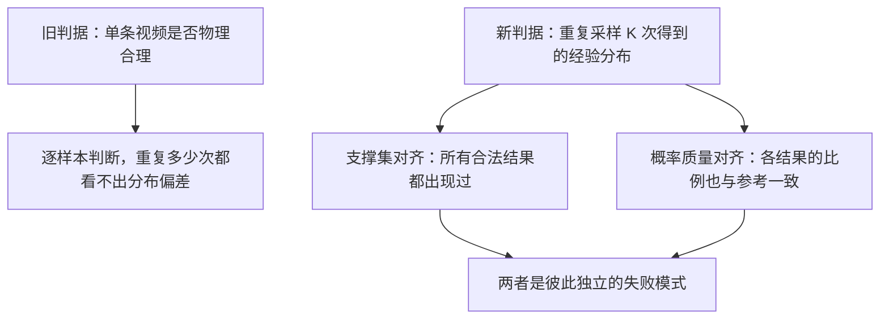
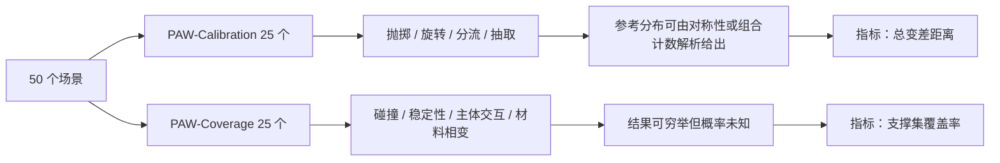
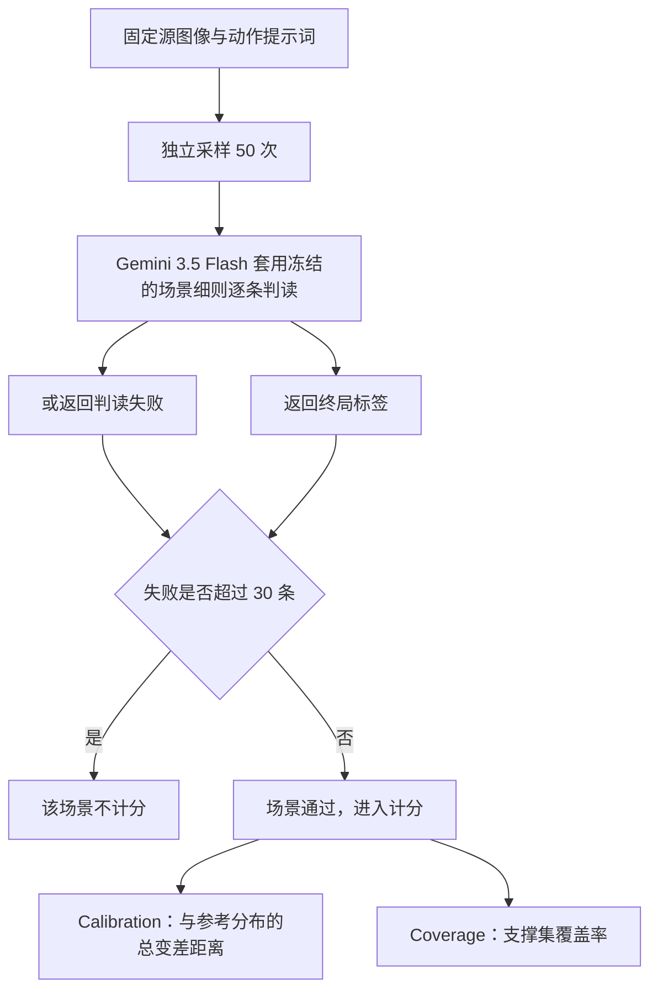
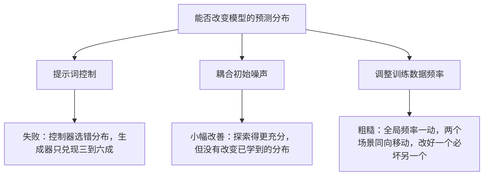

# PAWBench：视频生成模型离概率对齐的世界模型还有多远

> **原题**：PAWBench: How Far Are We from Probabilistically Aligned World Modeling?
> **作者**：Yuandong Pu、Le Zhuo、Sayak Paul、Gabriel Jorge Menezes、Avram Đorđević、Shiyang Li、Yifan Zhou、Bin Fu、Wenlong Zhang、Junjun He、Yu Qiao、Yihao Liu、Jingbo Xing、Xi Chen
> **机构**：arxiv 摘要页未标注
> **年份**：2026（arxiv ID 2608.27345，2026 年 8 月 27 日提交）
> **分类**：cs.CV / cs.AI
> **链接**：https://arxiv.org/abs/2608.27345
> **精读日期**：2026-08-28

## 阅读须知

### 这篇在领域里的位置

这篇论文属于视频生成模型的评测这一支，但它切入的角度和以往几年的做法完全不同，因此有必要先把这条线的演变理清楚。

视频生成最初被当作一项内容创作技术来看待，评测自然也围绕画面质量展开，衡量的是清晰度、时序连贯性、以及生成结果与文字描述是否吻合，代表性指标是 FVD 这一类分布距离，以及各种人工打分。随着模型能力提升，一个更大的说法开始流行起来，就是把视频生成模型称作世界模型，意思是它内部已经习得了物理世界如何演化的规律，因而可以用来预测「接下来会发生什么」。这个说法一旦成立，评测的重心就该转移，因为要问的不再是画面好不好看，而是它预测得对不对。

于是出现了第二批工作，专门检验物理合理性：球会不会穿过桌面，水会不会往上流，物体的运动是否符合重力。这类评测确实抓住了要害，但它们有一个共同的前提，即每一个初始状态对应一个正确的未来。而现实并非如此。

这篇论文正是从这个缺口切进去的。它指出，很多物理过程本身就是随机的，同一个初始画面加同一个动作，可能合法地演化出多种结果，而一个真正的世界模型不仅要能生成其中一条合理的轨迹，还要在反复采样时还原出这些结果各自出现的概率。作者把这个要求称为概率对齐，并且构造了 PAWBench 来检验它。

结论是十一个当前系统里没有一个做到。

### 读完能回答什么

第一，什么是概率对齐，它和以往那种「看单条视频合不合理」的评测在判据上究竟差在哪里。

第二，支撑集对齐与概率质量对齐是两个不同的层次，为什么在实验里它们表现为两种彼此独立的失败模式，擅长其中一项的模型往往不擅长另一项。

第三，用一个模型去给另一个模型判分，这套流程的可靠性有多高，作者做了哪些检验，还有哪些没做。

第四，试图用提示词去控制生成结果的分布为什么不奏效，问题出在控制器还是生成器。

第五，为什么在训练数据里调整某种结果的出现频率，只能提供一种粗糙的控制，无法真正做到概率对齐。

### 阅读前置

这份笔记预设读者了解视频生成模型的基本形态，也就是知道它接受一张初始图像与一句文字指令，通过若干步去噪采样生成一段视频，并且知道采样起点的随机噪声不同会导致结果不同。它不预设读者熟悉概率距离的定义，因此总变差距离会先解释再使用。它也不预设读者做过评测基准，判分协议会逐步展开。

### 缩写表

**世界模型（world model）**：能够根据当前观测与施加的动作，预测环境后续如何演化的模型。

**rollout**：给定同一初始条件的一次完整采样，在这里指生成出来的一段视频。本文不译。

**概率对齐（probabilistic alignment）**：本文提出的核心概念，要求模型反复采样得到的结果分布，与该物理情境下各种结果真实的出现概率相符。

**支撑集（support）**：一个分布中概率不为零的那些取值的集合。支撑集对齐意味着所有合法的结果都能被生成出来，哪怕比例不对。

**概率质量（probability mass）**：各个结果各自分到的概率。概率质量对齐是比支撑集对齐更严的要求。

**TVD**（Total Variation Distance，总变差距离）：两个离散分布之间差异的度量，等于对应概率之差的绝对值之和的一半，取值在零到一之间，本文乘以一百后报告。

**SPR**（Scene Pass Rate，场景通过率）：某个模型在多少比例的场景上产出了足够多可判读的结果，从而进入计分。

**LoRA**（Low-Rank Adaptation，低秩适配）：一种只训练少量新增参数、不改动原模型权重的微调方法。

**C2C**：本文使用的一种耦合噪声采样手段，在保持每个样本边缘分布不变的前提下，让一批采样的初始噪声彼此排斥，从而覆盖更广。

## 一、问题

### 为什么这个问题值得做

先说不解决会怎样。当下把视频生成模型称作世界模型，背后有一个具体的用途设想，就是用它来做预测与规划：给定当前画面和一个打算执行的动作，先在模型里推演一遍，看看会发生什么，再决定要不要真的做。机器人、自动驾驶、以及各类具身智能的路线图上都写着这一条。

而这个设想成立与否，取决于模型预测的可靠性。问题在于，可靠性这件事在随机世界里不能用单条预测来衡量。抛一枚硬币，生成一段正面朝上的视频不算错，生成一段反面朝上的视频也不算错，两者在物理上都成立。真正要问的是，重复抛一百次，模型给出的正反比例是不是接近一比一。如果模型每次都生成正面，它在任何一条单独的视频上都挑不出毛病，可它作为世界模型是坏的，因为基于它做出的任何决策都会系统性地低估风险。

现有的评测恰恰漏掉了这一层。它们逐条检查视频是否合理，而合理性是一个逐样本的判据，无论重复多少次都不会暴露分布上的偏差。于是就出现了一个尴尬的局面：模型在物理合理性的榜单上分数节节攀升，但没有人知道它到底有没有学会「多种结果各自有多大可能」这件事。

### 落到一个可验证的技术表述

作者把问题形式化如下。模型定义了一个在初始观测 x 与动作 a 条件下、关于未来轨迹 τ 的条件分布。每一条轨迹通过一个映射 g 落到某个终局结果上，于是诱导出一个关于结果的分布：

    p_M(y | x, a) = Pr[ g(τ) = y ]

概率对齐分两个层次。较弱的是支撑集对齐，要求该分布的支撑集覆盖所有合法结果，也就是每一种可能都至少会被生成出来。较强的是概率质量对齐，要求这个分布与参考分布 q 完全相等，也就是各结果的比例也对。

这个拆分是全文的骨架，因为实验会显示这两件事在当前模型上是分开坏掉的。

## 二、方法

### 五十个场景怎么构造的

PAWBench 收了五十个人工挑选的场景，入选要满足三条硬性要求，每一条都是为了排除一种干扰。

第一条要求随机性必须来自一个可见的物理机制，而不是来自动作指令本身的歧义或者被隐藏的初始条件。这一条排除的是「模型猜不准是因为题目没说清楚」这种情况。

第二条要求动作指令必须描述一次原子干预，并且这次干预有没有完成，能够从生成的视频里直接看出来。

第三条要求终局结果构成一个有限且在视觉上可区分的集合。这一条使得判读成为可能。

场景分成互补的两条赛道，各二十五个。PAW-Calibration 那一条覆盖抛掷、旋转、分流、抽取四类机制，它们的参考分布可以解析地写出来或者由对称性推出。PAW-Coverage 那一条覆盖碰撞、稳定性、主体交互、材料相变四类机制，它们的结果可以穷举，但各自的概率无法事先确定。

参考概率的来源作者交代得很清楚：来自扇区比例、组合计数、物理对称性，或者画面中可见的因果状态，而不是来自模型输出，也不是默认取均匀分布。这一句相当关键，因为如果参考分布是从模型那里估出来的，整套评测就成了自证。

### PAWEval 判分协议

协议本身不复杂，但每一步都有一个明确的防守目的。

第一步是采样。固定源图像与动作提示词，独立采样 K 等于五十次，得到五十段视频。

第二步是判读。用 Gemini 3.5 Flash 逐条视频套用一份该场景专属、事先冻结的评分细则，返回一个终局标签，或者在无法判定时返回一个失败标记。细则里写明了要识别的是哪一种物理结果，以及什么情况下应当判为失败。冻结这一点很重要，它保证同一场景下所有模型面对的是同一把尺子。

第三步是场景门槛。一个场景只有在五十次采样中失败判读不超过三十次，也就是至少有二十个可读结果时，才进入计分。这一步的目的是防止一个几乎生成不出可判读画面的模型，靠着零星几个样本得到一个虚假的好分数。

第四步是计算指标，且只在通过门槛的场景上计算。Calibration 赛道算经验分布与参考分布之间的总变差距离，定义是对应概率之差的绝对值之和乘以二分之一，报告时乘以一百。Coverage 赛道算支撑集覆盖率，即经验分布中概率大于零的结果个数占全部合法结果个数的比例。

### 被评测的十一个系统

分别是 HappyHorse、Veo 3.1 Fast、Kling 3 Std.、Seedance 2、Wan 2.7、Wan 2.2、LTX-2.3、LTX-2.5、Cosmos 3 Super I2V、LingBot-Video-MoE、MiniMax H3，闭源与开源两侧都有。

## 三、实验

### 校准赛道

下表是 Calibration 赛道的主要结果，总变差距离越小越好，场景通过率越高越好。

| 模型 | TVD ×100 | 场景通过率 | 抛掷 | 旋转 | 分流 | 抽取 |
|---|---|---|---|---|---|---|
| Cosmos 3 Super I2V | 20.5 | 80.0% | 19.4 | 3.6 | 17.7 | 35.5 |
| MiniMax H3 | 24.2 | 68.0% | 22.0 | 14.0 | 28.9 | 26.5 |
| Wan2.7 | 26.3 | 92.0% | 26.0 | 12.2 | 26.8 | 36.5 |
| Wan2.2 | 26.3 | 64.0% | 22.4 | 15.8 | 23.2 | 45.9 |
| LTX-2.3 | 30.1 | 24.0% | 29.3 | 11.0 | 无 | 41.0 |
| LTX-2.5 | 30.2 | 60.0% | 30.2 | 17.1 | 39.9 | 27.1 |
| Seedance 2 | 30.5 | 100.0% | 32.7 | 15.1 | 31.1 | 40.5 |
| Kling 3 Std. | 34.9 | 92.0% | 29.9 | 20.3 | 38.7 | 46.0 |
| Veo3.1 Fast | 35.4 | 88.0% | 37.1 | 12.2 | 32.4 | 55.0 |
| LingBot-Video-MoE | 41.8 | 72.0% | 31.8 | 13.4 | 44.4 | 60.8 |
| HappyHorse | 43.1 | 92.0% | 40.1 | 27.5 | 41.9 | 59.5 |

按机制看有一条很整齐的规律：旋转类的分数普遍最好，Cosmos 甚至低到 3.6；抽取类普遍最差，多数模型落在四十到六十之间。这大概是因为旋转的结果由一个连续量的落点决定，而抽取要求模型在若干离散选项之间真正保持随机。

### 覆盖赛道

| 模型 | 覆盖率 | 场景通过率 | 碰撞 | 稳定性 | 主体交互 | 材料相变 |
|---|---|---|---|---|---|---|
| LTX-2.3 | 71.7 | 72.0% | 82.7 | 50.0 | 59.5 | 90.0 |
| Wan2.2 | 63.4 | 92.0% | 76.8 | 56.7 | 55.0 | 58.3 |
| LingBot-Video-MoE | 58.8 | 100.0% | 62.2 | 61.8 | 46.5 | 72.5 |
| LTX-2.5 | 57.4 | 88.0% | 66.7 | 30.0 | 59.4 | 57.5 |
| Cosmos 3 Super I2V | 55.2 | 92.0% | 56.7 | 31.7 | 49.4 | 81.7 |
| Kling 3 Std. | 52.8 | 88.0% | 52.7 | 40.0 | 44.3 | 77.5 |
| Seedance 2 | 50.9 | 84.0% | 48.6 | 50.0 | 44.3 | 67.5 |
| Wan2.7 | 50.0 | 96.0% | 60.3 | 50.5 | 37.9 | 53.3 |
| MiniMax H3 | 48.7 | 92.0% | 59.5 | 39.5 | 36.4 | 58.3 |
| HappyHorse | 47.1 | 100.0% | 45.0 | 36.8 | 49.0 | 58.3 |
| Veo3.1 Fast | 41.8 | 100.0% | 39.8 | 21.1 | 53.3 | 44.2 |

最能说明问题的是两张表的排名并不一致。Cosmos 在校准上第一，覆盖上只排到第五；LTX-2.3 在覆盖上第一，校准上却排在中游偏后。作者由此得出的结论是，把概率比例调对与把所有可能都生成出来，是两种彼此独立的能力，没有任何一个模型同时具备，再加上场景通过率这一项，三者兼顾的模型一个也没有。

稳定性那一列值得单独看一眼，全部模型都在三十到六十之间，Veo3.1 Fast 只有 21.1。物体倒还是不倒这类判断，恰恰是最需要世界模型给出可信概率的场合，而它是所有机制里表现最差的一类。

### 这个差距是不是采样次数不够造成的

这是读者立刻会想到的质疑，作者也正面处理了。做法是蒙特卡洛模拟：直接从参考分布里抽样，抽样次数与每个模型在其通过场景上的实际可读样本数一致，看看纯粹由有限采样造成的总变差距离会有多大。结果是这种匹配基线平均只有 8.33，而模型实测的平均值是 31.2。在五万次模拟中，没有任何一次能让有限采样单独解释这个差距，对应的显著性水平低于 0.00002。

### 判分本身可靠吗

作者拿八百八十八段视频做了人机比对，PAWEval 的判读与人类评审团给出明确标签的结果一致率为 81.3%，也就是七百二十二条。

### 三种干预手段

确立了差距之后，论文用三组实验去问同一个问题：这个分布能不能被改？

第一种是靠提示词。先测了三个视觉语言模型直接给出分布的能力，Qwen3.5 Plus 的 TVD 是 40.9、覆盖率 35.9%，GPT-5.5 是 42.3 与 34.3%，Gemini 3.5 Flash 是 39.4 与 46.6%，都不算好。接着用 GPT-5.5 做提示词工程去调控四个生成器，结果四个的校准全部变差。作者又做了一个理想化的对照，把目标分布手工写死喂进去，此时 TVD 能降到 10.8 至 18.0，但生成器只兑现了所要求结果的 37.6% 至 58.1%。这两个数字合起来说明语言控制在两端同时失效：控制器选错了分布，生成器又接不住给定的目标。

第二种是改初始噪声。做法叫耦合采样，在保持每个样本边缘分布不变的前提下，让五十次采样的初始噪声之间带上排斥性，从而分散开。三个模型都有改善，Wan2.2 的 TVD 从 26.3 降到 25.7、覆盖率从 63.4% 升到 69.2%；LTX-2.3 的 TVD 从 30.1 大幅降到 19.9、覆盖率从 71.7% 升到 74.8%；Cosmos 从 20.5 降到 19.4、覆盖率从 55.2% 升到 63.9%。作者对此的解读很克制，认为这只是让五十次采样把模型已有的可能性探索得更充分，并没有改变模型学到的分布本身。

第三种是改训练数据。作者用铅笔倒向哪一侧作为受控变量，训练了五个 LoRA，训练数据中向左倒的比例从零到百分之百。在一个参考分布为五五开的直立铅笔场景上，基础模型的 TVD 是 17.3，用两成向左的数据训练后是 17.6，用八成向左的数据训练后恶化到 48.0。而在另一个参考分布为百分之百向左的倾斜铅笔场景上，基础模型的 TVD 是 41.3，八成向左那一版可以降到 0.0，代价是把前一个场景彻底毁掉。结论因此是：同一个调整会把两个场景往同一个方向推，改好一个必然改坏另一个，全局频率的调整只能提供粗糙的控制，而概率对齐要求模型学会分布应当如何随每个场景的初始状态而变化。

### 一个额外的观察

作者还测了模型对干预的反应方向，发现一个反常的组合：改变真正影响物理结果的因素时，模型的分布移动得不够；而只改变与结果无关的干扰性文字时，分布反而动了。也就是说，模型对因果性干预反应不足，对非因果性线索反应过度。

## 四、局限

### 作者承认的部分

第一是判据只看终局。用终局结果来比较分布使得计算变得可行，但它不覆盖轨迹层面的动态，也不覆盖中间的物理过程。两条通向同一终局的路径在这套评测里是等价的，哪怕其中一条在物理上荒谬。

第二是采样预算有限。所有估计建立在每场景五十次采样之上，更大的预算能更可靠地刻画模型的诱导分布，但会显著推高评测成本，而且加大采样本身并不能纠正模型分布的偏差。

第三是场景受控。为了隔离出随机性这一个变量，场景被设计得视觉上易于判读、时间跨度短，因此长时程、交互式与具身环境都留给了后续工作。

### 读完能看出来的部分

第一，场景通过率使得排名的可比性存疑，而这一点论文没有充分处理。LTX-2.3 在校准赛道的通过率只有 24%，意味着它的 TVD 只在二十五个场景中的六个上算出来，而 Seedance 2 是在全部二十五个上算的。分数越低的那个未必更准，也可能只是它恰好在自己能判读的那一小撮简单场景上被评了分。两者放在同一张表里排序，隐含了「未通过的场景与通过的场景难度相当」这个假设，而这个假设很可能不成立。

第二，判分器的噪声与效应量处于同一量级。人机一致率 81.3% 意味着大约五分之一的标签与人类评审不符，而表中不少模型之间的差距只有两三个点。作者对有限采样做了严谨的显著性分析，却没有对判分器误差做同样的传播分析，因此中段那些名次的差别能否站得住，目前是未知的。

第三，参考分布依赖理想化假设。用对称性推出五五开，前提是画面里那支铅笔、那枚硬币在几何与材质上确实对称。渲染或拍摄出来的具体场景未必如此，此时参考分布在原理上正确，对这一个具体场景却未必正确，而模型被要求匹配的恰恰是后者。

第四，训练干预那一组实验的结论虽然合理，但证据很窄。它建立在一种物体、两个场景、五个 LoRA 之上，用来支撑「全局频率调整只能提供粗糙控制」这个相当一般化的判断，样本量偏小。

## 一句话

用同一初始条件重复采样五十次，检验视频生成模型能否还原正确的结果分布，十一个当前系统无一做到。
