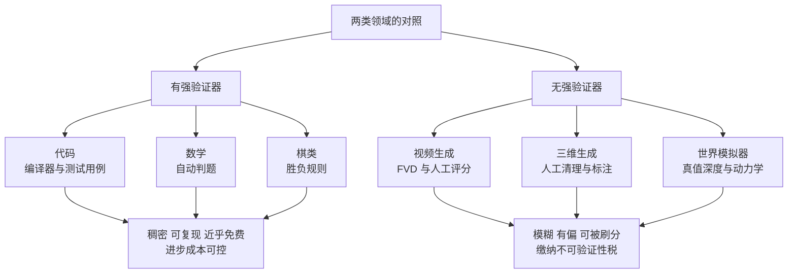
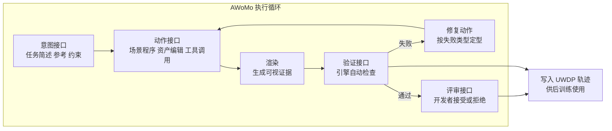
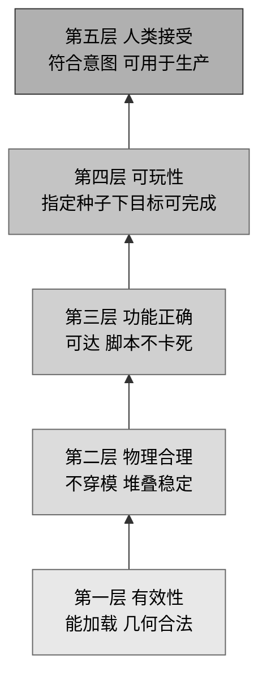
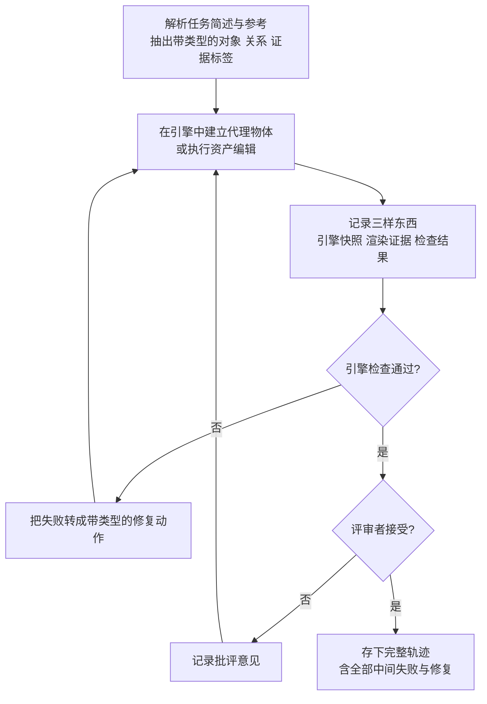

# 把游戏开发变成可验证的轨迹数据引擎

> **原题**：Agentic Game Development as a Verifiable Trajectory Data Engine for Scaling World Models
> **作者**：Pengfei Zhou, Hexin Wang, Zhengfeiyang Zhang, Yixing Ma, Zhenglin Wan, Kaipeng Zhang, Wangbo Zhao, Yang You
> **机构**：arxiv 页面未列出所属机构
> **年份**：2026（arxiv ID 2608.25518，提交于 8 月 26 日）
> **分类**：cs.AI
> **链接**：https://arxiv.org/abs/2608.25518
> **精读日期**：2026-08-29

## 阅读须知

### 这篇在领域里的位置

过去三四年，世界模型这个方向大致沿着两条路往前走。一条是视频生成那一路，把世界建模当成"预测下一帧"的问题，靠海量视频把物理规律隐式地学进网络里，Sora 之后的一系列工作都属于这一类。另一条是三维生成与神经渲染那一路，从辐射场到各种前馈式三维重建，关心的是怎么把一个静态或半动态的场景表示出来并且渲染得逼真。

这两条路都遇到了同一个麻烦，而且这个麻烦不在模型结构上，也不在算力上。麻烦在于，没人能便宜地判断模型生成出来的东西对不对。一段视频看着流畅，但物体被遮挡之后还在不在，透视关系有没有崩，重力方向是否一致，这些都没有自动化的判据。于是整个领域只能退回到两样东西上：一是 CLIP 分数、FVD 这类统计代理，二是人工打分。前者与人真正在意的性质关系很松，后者贵且慢。

这篇论文站的位置，是从这个困境往外找出路，而且它找的方向不是"再设计一个更好的评价指标"，而是"换一个本来就自带验证器的数据源"。它主张把游戏开发这件事本身变成生产训练数据的引擎，因为游戏引擎能以近乎免费的成本判断一个场景合不合法。就领域脉络而言，它可以看成把代码智能体那一套"可验证奖励"的成功经验，试着搬运到空间智能这一侧。

### 读完能回答什么

- 为什么作者认为世界模型的瓶颈不是数据量与算力，而是反馈信号，以及他们所说的"不可验证性税"具体指什么
- 游戏引擎到底能验证哪些性质，这些性质为什么比 CLIP 分数更难被模型钻空子
- RLHEV 中"人"与"引擎"各自负责什么，为什么作者坚持不能让引擎成为唯一裁判
- UWDP 这个轨迹格式里的八个字段分别记录什么，为什么要把失败与修复也一并存下来
- 这篇的实验结论目前能支撑到哪一步，哪些数字看起来漂亮但其实证据很薄

### 阅读前置

假定读者熟悉监督微调与强化学习的基本概念，知道什么是奖励函数、什么是策略，也大致了解基于人类反馈的强化学习是怎么回事。不预设读者做过三维视觉、图形学或者游戏开发，涉及导航网格、碰撞查询这类图形学概念时都会先解释。也不预设读者读过视频生成或世界模型方向的具体论文。

### 缩写表

- **AWoMo**（Agentic World Model，智能体化世界模型）：本文提出的系统，指一个能在游戏引擎里自己提出修改、渲染查看、验证并修复的智能体。
- **RLHEV**（Reinforcement Learning with Human-Engine Verification，基于人机双重验证的强化学习）：本文的训练范式，把引擎给的稠密信号与人给的稀疏接受信号合起来做后训练。
- **UWDP**（Unified World-Development Protocol，统一世界开发协议）：本文定义的轨迹数据格式，用来把一次完整的开发过程记录成可供训练的结构化数据。
- **RLVR**（Reinforcement Learning with Verifiable Rewards，基于可验证奖励的强化学习）：在数学与代码领域已经成熟的做法，奖励来自自动判题或编译执行。本文把只用引擎信号的版本作为一个基线。
- **RLHF**（Reinforcement Learning from Human Feedback，基于人类反馈的强化学习）：只用人类偏好标注做奖励的经典做法，本文中作为另一个基线。
- **SFT**（Supervised Fine-Tuning，监督微调）：直接在示范数据上做模仿学习，不引入奖励信号。
- **FVD**（Fréchet Video Distance）：视频生成常用的统计评价指标，通过比较生成分布与真实分布的特征统计来打分。
- **navmesh**（navigation mesh，导航网格）：游戏引擎里用来描述"角色可以走到哪里"的一层几何数据，可用于自动判断某个位置是否可达。

## 一、问题

### 为什么这个问题值得做

先看一个反差。过去两年，让模型写代码这件事进步得非常快，快到已经改变了一部分人的工作方式。与此同时，让模型理解并生成三维空间这件事，进步的速度明显慢一档，而且慢的方式很特别：模型生成的画面越来越好看，但你很难说清它是不是"对"的。

作者认为这个反差的根源不在模型，而在反馈。代码之所以推进得快，是因为它有两层验证同时起作用。编译器与测试用例提供稠密的结构性反馈，一段代码能不能编过、测试跑不跑得通，都是确定的、可复现的、瞬间就能得到的判断。而开发者的采纳与否提供另一层判断，负责回答这段代码有没有用、是不是想要的东西。这两层各管一段，合起来构成了一个便宜且不太容易被糊弄的信号源。

空间生成这一侧则完全没有对应的东西。判断一个生成的场景好不好，目前主要靠两类办法，一类是 CLIP 分数、FVD 这样的统计代理，另一类是请人来打分。前者衡量的是特征分布上的接近程度，与"这个场景在物理上讲不讲得通"关系很间接；后者慢、贵，而且不同标注者之间的一致性并不理想。作者用了一个说法来概括这个处境，叫做"不可验证性税"，意思是这个领域每往前走一步，都要额外付出采集标注、扫描三维数据、组织人工评分的代价，而这些代价在代码领域是被编译器免掉的。

顺着这个思路，作者对"苦涩的教训"给了一个不太一样的解读。通常人们把那篇短文读成"能靠算力扩展的方法最终会胜出"，而作者认为真正起作用的变量是反馈通道：凡是有强验证器的领域，例如棋类游戏、代码、数学，都实现了成本可控的持续进步；凡是没有的，进展就被困在模仿的层面，最终由主观标注来裁定好坏。

### 三条现有路线各自卡在哪里

把上面的判断落到具体的子领域上，作者逐一检视了三条路线。

**视频生成**这一路，模型的输出质量已经相当可观，但没有任何机制能验证物理一致性。一个物体被另一个物体挡住之后再露出来，它还是不是原来那个，尺寸有没有变，这类问题在训练信号里是缺席的。评价依然落在 FVD 与人工评分上，也就是仍然停留在模糊代理。

**三维生成**这一路面临的是双重稀缺。一方面是数据本身少，经过整理的三维物体大约在一千万这个量级，而二维图像与文本的数据量在十亿到万亿之间，差了两到五个数量级。另一方面是验证贵，拿到原始三维数据之后还需要人工清理与标注才能用。

**世界模拟器**这一路要求更高。想要监督模型对物理演化的预测，就得有真值级别的深度、几何与动力学数据，这类数据的采集成本高到无法支撑大规模训练。

三条路线的共同点，是它们都缺一个能自动说"这个不对"的东西。

### 论文真正要论证的那个命题

把上面的铺垫收拢，这篇论文要立的技术主张可以写成一句可检验的话：游戏开发环境提供了一份可执行的世界规格说明，引擎能够以很低的成本验证碰撞、物理、可通行性与有界可玩性，因此把智能体放进游戏开发流程里跑，本身就能持续产出带有可靠奖励信号的训练轨迹。

这句话里有两个值得注意的地方。其一，验证不是额外做的一件事，而是开发流程的副产品，这就把成本结构反转了过来。其二，作者并不认为引擎的判断足以覆盖全部，所以他们还要把人的评审保留在环里，这一点构成了后面方法部分的核心设计。

## 二、方法

### AWoMo 的四个接口

系统这一侧叫做 AWoMo，也就是智能体化世界模型。它被定义成四个接口，每个接口负责一类信息的进出。

**意图接口**接收任务简述、参考素材与设计约束，也就是"要做成什么样"这件事的输入。**动作接口**向外发出场景程序、资产编辑、工具调用与修复动作，是智能体真正动手的那一端。这两个接口构成了一轮迭代的两头。

**验证接口**记录引擎给出的各项检查结果，包括能否加载、碰撞情况、物理是否稳定、导航网格是否可达、脚本能否执行、以及在有限步数内是否可玩通。**评审接口**记录开发者的接受、拒绝与具体批评。这两个接口是本文与普通智能体框架拉开距离的地方，因为它们把"判断"这件事拆成了两个来源。

执行的循环是：提出修改，渲染出来，交给引擎验证，根据失败做修复，最后交给人评审。每一轮的全部内容都会被存成结构化的轨迹用于训练，这一点后面还会展开。

### 引擎能查什么，以及为什么它难被钻空子

这一节是全文的支点，值得写细一点。游戏引擎本来就是为了让一个场景真的能跑起来而设计的，因此它顺手具备了一批检查能力，而这些检查的共同特点是结果确定、可复现、几乎不花钱。

**几何与碰撞**这一类，通过碰撞查询可以直接暴露出物体之间的穿模与错位。这里有一个关键的性质：碰撞是几何事实，不是观感，所以它比任何基于外观的指标都更难被生成模型糊弄过去。一个模型可以学会生成看起来对的画面，但它没法让两个互相穿插的碰撞体在查询中显示为不相交。

**物理与稳定性**这一类，通过物理推演可以验证一个堆叠结构会不会自己塌掉。**导航**这一类，靠导航网格的可达性判断角色能不能从一处走到另一处。**脚本执行**这一类，能查出卡死与运行时错误。**有界可达性**这一类最接近最终目的，指的是在指定的智能体与指定随机种子下，给定的目标能否在有限步数内完成。

作者把这些检查排成一个从低到高的阶梯，称为"奖励的阶梯"：先是有效性，也就是场景能不能加载、几何是不是合法的流形；再是物理合理性；再是功能正确性；最后才是可玩性。这个排序的用处在于，训练早期可以只靠底层的信号就把大量明显错误的输出筛掉，不必等到最贵的人类评审。

### RLHEV 的目标函数

有了两类信号之后，怎么把它们合成一个可优化的目标，是 RLHEV 要回答的问题。论文给出的形式是：

$$
\max_{y \in Y} \; U_H(x, y, h) \; - \; \sum_i \lambda_i(h)\,\varphi_i\big(C_i(x, y)\big)
\quad \text{s.t.} \quad G_j(x, y) = 1,\; j = 1, \dots, m
$$

逐个符号说明。

$x$ 是输入，也就是设计意图与参考素材那一侧的东西；$y$ 是智能体产出的结果，例如一段场景程序或一次资产编辑；$h$ 是当前的上下文，用来表示同一类检查在不同任务下应当有不同的重要性。

$U_H(x, y, h)$ 是人类接受效用，取值为 0 或 1，来自开发者最终是接受还是拒绝这次产出。它是稀疏的，一整条轨迹通常只在末端拿到一个值。

$C_i(x, y)$ 是第 $i$ 项引擎诊断检查的输出，例如碰撞穿透的深度。$\varphi_i \geq 0$ 是与之配套的单调惩罚函数，它的关键性质是当检查通过时取值为零，也就是说合法的结果不会被无端扣分。$\lambda_i(h) \geq 0$ 是随上下文变化的权重。

$G_j(x, y) \in \{0, 1\}$ 是硬性约束，来自引擎运行时。它与前面那些惩罚项的区别在于，惩罚项是可以用别处的收益抵消的，而硬门一旦不满足，这个结果就直接出局。场景加载失败属于这一类。

作者反复强调的一句话是，这套设计里不变的东西是"权威的划分"：引擎提供稠密的、可复现的验证，而人提供最终的判断。在具体实现里，两者的加权是人类占 0.65、引擎占 0.35。

### 人类评审那一侧的设计

既然人的判断被保留为最终权威，那么怎么问人、问什么就变得重要。论文把评审字段分成两类。

一类是引擎可核查的字段，例如是否符合任务简述、视觉上是否清楚可辨、是否符合生产要求。另一类是只有人能判断的字段，主要是设计意图有没有被真正实现。这样切分的目的，是防止引擎在训练中逐渐变成一个有偏的神谕：引擎能查的部分交给引擎，不能查的部分才占用人的时间。

### UWDP：把开发过程写成训练数据

方法的最后一块是数据格式。UWDP 定义了轨迹中每一步要记什么，一个时刻 $t$ 的记录是一个八元组：

$$
u_t = (b,\; o_t,\; s_t,\; a_t,\; g_t,\; v_t,\; h_t,\; \rho_t)
$$

其中 $b$ 是以提示词形式给出的设计意图，在一条轨迹里保持不变；$o_t$ 是物体、关系或场景区域的稳定标识符，用来保证前后指代的是同一个东西；$s_t$ 是空间、语义、物理与证据状态这几类字段。

接下来的四项对应一次交互的四个环节：$a_t$ 是这一步做的编辑或工具调用，$g_t$ 是引擎与测试框架返回的输出，$v_t$ 是渲染出来的可视证据，$h_t$ 是评审者的决定或批评意见。最后 $\rho_t$ 记录修复动作、置信度、成本与残余风险。

值得单独说的是这套格式把失败也存了下来。一次开发过程中出现的错误、错误对应的引擎报告、以及针对该错误所做的定型修复动作，三者是成对记录的。这意味着训练数据里天然包含"哪里会错、错了之后该怎么改"这一层监督，而这一层在静态数据集里通常是缺失的。

## 三、实验

### 主实验：UnitySceneBench 上的资产编辑判定

主要评测在一个叫 UnitySceneBench 的基准上进行，规模是 200 个样例，任务形式是 Unity 资产编辑，输入包含文本编辑指令、Unity 资产特征、参考图特征以及结构化的布局载荷。训练侧，基础设定用了 720 条原始训练实例。

主指标是四个分类指标的加权组合：

$$
\text{Primary} = 0.45 \cdot \text{balanced\_accuracy} + 0.25 \cdot \text{accuracy} + 0.20 \cdot F_1 + 0.10 \cdot \text{AUC}
$$

八次运行取最好的那次，结果如下。

| 方法 | Primary | Accuracy | Balanced Acc. | F1 | AUC |
|---|---|---|---|---|---|
| 完整 RLHEV | **0.681** | **0.665** | **0.665** | **0.733** | **0.690** |
| 最强的非完整基线 | 0.583 | 0.545 | 未单列 | 未单列 | 未单列 |

参与比较的基线一共五条：零样本 CLIP 作为参照、模糊代理基线、SFT 基线、离线 RLHF、以及只用引擎信号的 RLVR。完整 RLHEV 相对最强的非完整基线，主指标高出 0.098，准确率高出 0.120。

这里最值得看的其实不是完整方法赢了，而是赢的是哪一种组合。只用引擎信号的 RLVR 与只用人类信号的离线 RLHF 都被完整版超过，这正好支撑了作者关于"权威划分"的主张：两类信号各自都不够，合起来才有效。

### 数据规模上的表现

论文做了一个小规模的扩展实验，在不同训练预算下比较生成质量，每个点是八个随机种子的均值加减标准差。

| 训练实例数 | 完整 RLHEV | 仅引擎信号的 RLVR |
|---|---|---|
| 640 | 0.8106 | 未列出 |
| 720 | 0.8197 | 0.7934 |

从 640 增加到 720，完整方法的生成质量从 0.8106 升到 0.8197。需要注意的是这个跨度很小，后面的局限部分会回到这一点。

### 分布迁移与跨引擎迁移

这一组实验的设定是比较两种训练方式：一种是直接在目标分布上从头训练，另一种是先在源分布上预训练再到目标上适配。评价用的是把多模态大模型当裁判打出的归一化分数。

| 迁移设定 | 从头训练 | 预训练后适配 | 相对增益 |
|---|---|---|---|
| Unity 内部分布偏移 | 0.25 | 0.75 | 三倍 |
| Unity 到 Unreal | 0.25 | 0.35 | 40% |
| Unity 到 Godot | 0.15 | 0.35 | 133% |

跨引擎那两行是作者用来回应"是不是只对 Unity 有效"这个质疑的主要证据。论文同时明确说明，跨引擎的质量缺少可直接比较的标量指标，因此目前只能用基于评分细则的裁判模型来放在同一把尺子上衡量，并且所有裁判打分都经过了人工检查。

### 具身任务上的诊断性结果

最后一组实验把 AWoMo 生成的数据拿去增强具身智能的训练，在三个基准上与原始基线以及朴素的数据增强做比较。

| 基准 | 指标 | 相对提升 |
|---|---|---|
| R2R | 成功率 | +0.79% |
| Gymnasium MuJoCo | rollout 回报 | +9.96% |
| D4RL Gym-MuJoCo | 归一化得分 | +48.43% |

三项都是正向，但三者的幅度差得很远，从不到百分之一到接近五成。这个跨度本身就是一条重要信息，说明增益高度依赖具体任务，后面会再讨论。

## 四、局限

### 作者自己承认的部分

论文在附录里专门列了五条可能的反对意见并逐条回应，态度算是坦率的。

**关于模拟与现实的鸿沟**，作者承认游戏不是现实，从模拟迁移到现实这个问题并没有被解决。他们的辩护是，游戏开发至少提供了真实三维数据采集所不具备的结构化验证。

**关于视频生成正在快速进步**，作者的回应是速度本身不解决验证瓶颈，看起来合理但缺乏可执行的判据，仍然属于不可验证。

**关于引擎奖励可能被刷**，作者承认任何奖励系统都会被利用，他们的缓解手段是保留人类评审作为最终判断，以及同时使用多类检查。

**关于真实三维数据正在变便宜**，作者认为即便采集成本下降，原始扫描数据依然不带验证能力。

**关于对单一引擎过拟合**，作者拿跨引擎迁移的结果作为反证。

除此之外，论文有一句自我定性写得很直接：目前的实验结果是正面的，但仍属诊断性质，需要更大规模的扩展研究才能验证泛化能力。

### 读完能看出来的其他问题

第一个问题在于主实验的形式与论文的主张之间存在张力。整篇文章批评的是这个领域依赖模糊代理，而主实验最终落在一个 200 例的资产编辑判定任务上，用的是准确率、F1、AUC 这样的分类指标加权而成的复合分数。分类指标本身也是一种代理，它与"这个世界模型是否真的理解空间"之间的距离，未必比 CLIP 分数近多少。

第二个问题是规模。论文标题里有"扩展"二字，但训练规模只到 720 条实例，扩展曲线的两个可比点是 640 与 720，跨度约百分之十二。以这个跨度去论证扩展性，证据是相当薄的。这一点作者其实已经承认，只是标题的措辞比证据走得更远。

第三个问题出在跨引擎评估上。既然缺少可比的标量指标，就改用大模型裁判来打分，而这恰恰又回到了论文开头所批评的那种主观且可被利用的评价方式。作者用人工复核来缓解，但这也意味着这一组数字的可信度依赖于人工检查的质量，无法自动复现。

第四个问题是人的成本并没有真正被消掉。论文的卖点之一是验证成为开发的副产品，但在 0.65 比 0.35 的权重下，人类接受信号占了主要部分，而这一部分依然需要开发者逐条评审。换句话说，被引擎接管的是那些本来就容易自动化的检查，真正贵的那一段还在原地。

第五个问题是增益的不均匀。具身实验里 R2R 上的提升只有 0.79%，这个幅度基本落在随机波动的范围内，而 D4RL 上的 48.43% 又高得异常。这种量级差异通常提示增益来自某个特定任务的特定性质，而不是数据质量的普遍改善，论文没有对这个差异给出解释。

最后一点关于适用边界。这套方法要求存在一个能提供确定性检查的执行环境，游戏引擎恰好满足。但世界模型真正想覆盖的很多场景，例如流体、可形变物体、人与人的交互，恰恰是游戏引擎里被近似或者干脆略过的部分。也就是说，引擎能验证的那一部分与人们最希望世界模型学会的那一部分，重合度可能没有论文假设的那么高。

## 一句话

用游戏引擎的碰撞与可玩性检查当免费裁判，把开发过程本身变成带奖励的训练数据，再让人只管引擎判不了的那部分。
