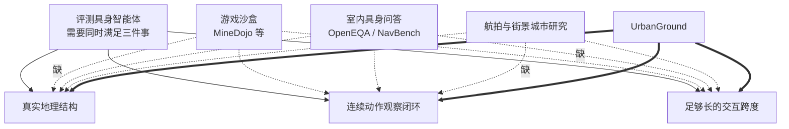
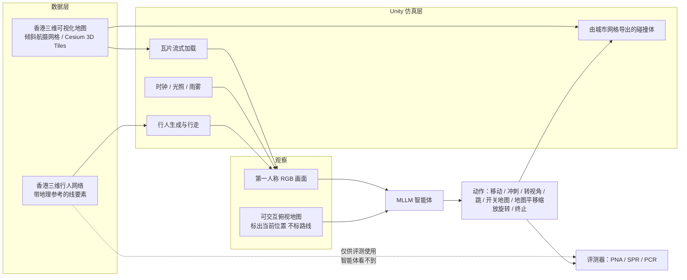
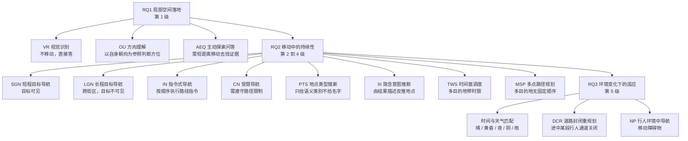
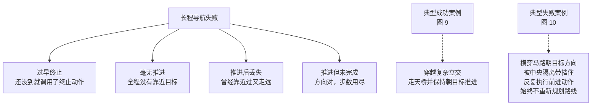

# UrbanGround：从局部感知到真实尺度城市中的空间能动性

> **原题**：UrbanGround: From Local Perception to Spatial Agency in a Real-Scale City
> **作者**：Tianjie Ju, Zheng Wu, Yueqing Sun, Yuhan Cui, Bobo Li, Shengqiong Wu, Pengzhou Cheng, Haodong Zhao, Zongru Wu, Xinbei Ma, Doris Zhang, Kunling Li, Mong-Li Lee, Wynne Hsu, Hao Fei, Qi Gu, Gongshen Liu, Zhuosheng Zhang
> **机构**：上海交通大学、新加坡国立大学、香港中文大学、上海大学、牛津大学、美团
> **年份**：2026（arxiv ID 2608.27456，提交于 8月27日）
> **分类**：cs.CV
> **链接**：https://arxiv.org/abs/2608.27456
> **项目页**：https://urbanground.github.io/
> **精读日期**：2026-08-30

## 阅读须知

### 这篇在领域里的位置

这篇论文属于「具身智能体评测环境」这一支。过去几年，这一支的工作大致沿着三条互不相交的路线各自往前走。第一条是游戏沙盒，代表是 MineDojo 一类建在 Minecraft 上的环境，它的长处是智能体可以在里面连续行动成千上万步，短处则是游戏世界的物理与视觉规则是人造的，学到的东西未必能搬到真实场景。第二条是室内具身问答，代表是 OpenEQA 与 NavBench，它把智能体放进扫描重建的真实房间里，行为因此被真实几何约束住，但一间屋子的空间尺度终究有限，走十几米就到头了。第三条是城市尺度的视觉语言导航，多数依赖航拍影像或街景图片序列，地理结构是真的，可是智能体并不真的在城市里移动，它只是在一串预先采集好的图片之间跳转。

UrbanGround 想做的事情，是把这三条路线各自缺的那一半补上：既保留一座真实城市完整的地理结构，又保留智能体与环境之间连续的动作与观察闭环。它选的城市是香港，理由并不是随手挑的，后文会讲清楚。

在这个坐标系里，这篇论文位于「先把环境造出来，再用它去量一量现有模型到底能走多远」这一步。它本身不提出新的模型结构，也不训练新的策略，它提出的是一个可以反复使用的测量装置，以及用这个装置量出来的一组数字。

### 读完能回答什么

1. 为什么把「局部看得懂」与「走得到」分开来测量，会得出与直觉相反的结论？
2. UrbanGround 是怎么用官方地理数据把一座真实城市变成可交互沙盒的，它的动作空间与观察空间具体长什么样？
3. 论文设计的五级能力阶梯是怎么把「问一个问题」逐步扩展成「在动态城市里完成多点任务」的？
4. 为什么当前最强的多模态大模型在短程导航上能到七成五，在长程导航上却几乎归零？
5. 什么叫「局部合规而全局失明」，行人网络贴合率高而安全推进率低这组数字说明了什么？

### 阅读前置

假定读者熟悉多模态大模型的基本用法，知道什么是「把一张图和一段文字一起送进模型，让它输出一段文本」，也大致了解智能体在一个环境里循环执行「观察、决策、行动」这件事。不预设读者做过具身智能、视觉语言导航或者三维城市重建，相关概念在正文里第一次出现时都会先铺垫再展开。

### 首次出现的缩写表

- **MLLM**（Multimodal Large Language Model，多模态大语言模型）：既能读文字也能看图像的大模型，本文里被当作智能体的大脑使用。
- **VLN**（Vision-and-Language Navigation，视觉语言导航）：给一段自然语言指令，让智能体按照指令在环境中移动到目标位置的任务族。
- **EQA**（Embodied Question Answering，具身问答）：智能体需要在环境中主动移动、寻找证据，才能回答一个问题的任务族。
- **RQ**（Research Question，研究问题）：论文用来组织实验的三个递进问题。
- **VR / OU / AEQ**：第一级任务的三种类型，分别是视觉识别、方向理解、主动探索问答。
- **SGN / LGN / IN / CN / PTS / III / TWS / MSP**：导航任务的八种类型，分别是短程目标导航、长程目标导航、指令式导航、受限导航、地点类型搜索、隐含意图推断、时间窗调度、多点路径规划。
- **DCR / NP**：动态环境下的两类任务，分别是道路封闭重规划、行人环境中导航。
- **PNA**（Pedestrian-Network Adherence，行人网络贴合率）：智能体的行动时间中，留在已登记的行人通道上的比例。
- **SPR**（Safe Progress Rate，安全推进率）：在道路封闭的回合里，真正尊重了封闭约束的那部分比例。
- **PCR**（Pedestrian-Collision Rate，行人碰撞率）：在有行人移动的导航任务里发生碰撞的比例。
- **SR**（Success Rate，成功率）：导航任务的完成比例，判定标准见正文。

## 一、问题

一个多模态大模型看着一张香港街景照片，能说出画面里有一座天桥、右边是一家便利店、地面是湿的。这件事在今天已经不算新闻。真正没有解决的问题出现在下一秒：当这个智能体迈开步子往前走，转过一个街角，刚才支撑它做判断的那座天桥从视野里消失了，它还知道自己在哪里、该往哪走吗？

论文开篇那句话把这件事说得很准确：一旦智能体转过街角，支撑它上一个决定的地标就可能不见了。这不是一个感知问题，因为每一帧画面单独拿出来看，模型都认得清清楚楚。这是一个「局部证据在移动之后还剩下多少用处」的问题。作者把这个能力叫做空间能动性，用来与单纯的空间感知作区分。

这个问题不解决会怎样，可以从三个侧面看。对于做具身智能的研究者，它意味着当前所有基于静态图像的空间推理评测，都可能高估了模型在真实任务中的可用程度，因为静态评测永远不会问「你走了五十步之后还记得来时的方向吗」。对于想把模型装进配送机器人、导览设备或者辅助出行应用里的工程团队，它意味着一次实地失败的代价远高于一次问答失败，而现有的分数并不能预告实地表现。对于终端用户，它意味着一个在演示视频里对答如流的系统，可能在第一个复杂立交处就把人带丢。

那么过去几年这个方向上的努力到了哪里。三条主流路线各有各的卡点，用一张图可以看清它们之间的取舍关系。

游戏沙盒做对的是长跨度与闭环，智能体可以在里面连续跑上万步而不越界，它做不到的是真实性，Minecraft 的方块世界与真实街道之间的差距，使得在其中学到的空间习惯难以迁移。室内具身问答做对的是真实几何与闭环，它的失效之处在于尺度，一间公寓的最长路径不过十几米，而这恰恰低于「局部证据开始失效」的那个临界距离，所以这类环境从设计上就测不到本文关心的失败模式。城市尺度的航拍与街景研究做对的是地理结构与跨度，但它把动作退化成了在预采样图片之间的跳转，智能体与环境之间不再有真正的物理接触，也就无从谈起碰撞、绕行与重规划。

于是这篇论文要解决的技术问题可以收窄成一句可验证的陈述：造一个既保留真实城市完整地理结构、又支持第一人称连续闭环交互的沙盒，并在其中回答现有多模态大模型的局部空间能力究竟能不能复合成持续的目标导向行为。

## 二、方法

### 为什么是香港

选香港不是为了地方特色，而是因为这座城市在垂直方向上的复杂度在全球都少见。大量的行人流线并不在地面，而是走天桥、走过街廊、走商场内部的连通层，同一个平面坐标上可能叠着三四层可通行的路径。这种结构对智能体是一种压力测试：单看一帧画面，它很难判断眼前这条路是通向目的地还是通向另一层楼。

沙盒建在两套香港官方数据之上。第一套是全境的三维可视化地图，由倾斜航空摄影生成带纹理的网格模型，以 Cesium 3D Tiles 的形式组织，使用 WGS84 坐标系。第二套是三维行人网络，它是一组带地理参考的三维线要素，描述了行人可以从哪里走到哪里，包括那些不在地面的连通关系。

前一套数据提供智能体看到的东西，后一套提供评判它走得对不对的依据。这个分工很关键：模型永远看不到行人网络，它只能看到画面；而评测系统始终知道行人网络，因此能算出智能体有多少时间走在真正可通行的路上。

### 沙盒的构成

整个环境用 Unity 搭建。城市网格按视距动态流式加载，碰撞体直接从城市网格几何导出，因此智能体撞不穿它看见的建筑物。地理坐标在整个仿真过程中都被保留，这意味着任何一条轨迹都可以直接导出成标准坐标，与真实地图对齐查看。

环境里还有两类动态成分。一类是行人，用 Microsoft Rocketbox 的人物模型在已登记的行人网络上生成并行走，他们的位置与碰撞在每一步都被记录。另一类是时间与天气，系统带一个连续的时钟控制光照、阴影与入夜后的人工照明，另有可配置的雨与雾，会同时影响能见度、粒子效果、表面渲染与曝光。

### 动作空间与观察空间

智能体每一轮从一组离散动作里选一个。第一人称的动作包括移动（带方向与持续时间）、冲刺、转视角、跳跃、打开地图；地图界面上的动作包括选点、平移、缩放、环视、关闭地图；此外还有一个终止动作。移动的持续时间取值范围是 0.05 秒到 2.0 秒，转视角可以带上偏航角速度与俯仰角速度，单位是度每秒。

观察分主次两路。主要的一路是第一人称的 RGB 画面，从智能体当前的位姿渲染。次要的一路是那张可交互的俯视地图，它会标出当前位置，但不会画出任何推荐路线。这个设计有意为之：地图给的是全局的位置感，不是答案。

值得注意的是这套动作设计带来的一个副作用。移动以时间为单位而不是以格子为单位，意味着智能体必须自己估计「走两秒能走多远」，而这恰恰是后文里长程导航失败的诱因之一。

### 五级能力阶梯

论文没有把任务平铺成一个列表，而是排成一条阶梯，每上一级就要求智能体多维持一点空间状态。第一级是纯局部的，只需要看懂眼前；第二到第四级要求把局部理解在移动中维持住；第五级则在此之上再叠加环境本身的变化。三个研究问题正好对应这条阶梯的三段。

### 评测怎么判

导航任务的成功判定是：最终位置落在目的地 15 米以内，并且满足评测器强制的任务约束。除成功率之外，三个过程性指标各自盯住一件事。行人网络贴合率 PNA 统计智能体的行动时间中有多大比例留在已登记的行人通道上，它测的是「有没有乱穿」。安全推进率 SPR 只在道路封闭的回合里计算，统计其中真正尊重了封闭约束的比例，它测的是「有没有真的改道」。行人碰撞率 PCR 统计在有行人移动的导航里发生碰撞的比例，它测的是「有没有撞到人」。

任务集共 810 个人工核验过的基础实例，全部由真人测试者验证过可以在 100 步限制内完成。100 步对应最多约 200 秒的运动时间。

## 三、实验

评测覆盖十个模型，分别是 OpenAI 的 GPT-5.5、GPT-5.4、GPT-5.2，Anthropic 的 Claude-Opus-5、Claude-Opus-4.6，Google 的 Gemini-3.6-Flash、Gemini-3.1-Pro，以及 Doubao-Seed-2.0-Pro、GLM-5V-Turbo、Kimi-K3。所有模型都通过接口调用，不做任何内部改动。

### 第一级：局部看得懂

| 模型 | VR 准确率 | OU 准确率 | AEQ 准确率 | 总体准确率 | 总体 PNA |
|---|---|---|---|---|---|
| GPT-5.5 | 82.5 | 40.0 | 62.5 | 63.6 | 76.8 |
| Claude-Opus-5 | 91.3 | 58.3 | 82.5 | 79.1 | 80.2 |
| Gemini-3.6-Flash | 93.8 | 56.7 | 77.5 | 77.7 | 79.0 |
| Kimi-K3 | 92.5 | 55.0 | 76.3 | 76.4 | 75.5 |

这一级的结论是清楚的：视觉识别已经相当可靠，各模型落在百分之七十七到九十四之间；方向理解则是明显的短板，最低的只有百分之二十三，最高的 Claude-Opus-5 也只有百分之五十八点三。也就是说，问模型「画面里有什么」它答得很好，问它「那个东西在你的左前方还是右后方」它就开始猜。

主动探索问答的表现介于两者之间，而且它的 PNA 反而是三类任务里最高的，普遍超过百分之九十一。相比之下，纯视觉识别任务的 PNA 只有百分之六十三到六十九。这个反差解释起来并不复杂：识别任务不需要走远，模型为了尽快看清目标会直接横穿，而探索任务本身就要求沿路搜寻，反倒把它约束在了通道上。

### 第二级到第四级：走得到吗

| 模型 | SGN | LGN | IN | CN | PTS | III | TWS | MSP | 总体 |
|---|---|---|---|---|---|---|---|---|---|
| GPT-5.5 | 75.0 | 0.0 | 20.0 | 0.0 | 35.0 | 11.7 | 3.3 | 0.0 | 20.8 |
| Claude-Opus-5 | 48.8 | 2.5 | 30.0 | 3.3 | 30.0 | 11.7 | 3.3 | 3.3 | 17.9 |
| Kimi-K3 | 67.5 | 3.8 | 42.0 | 6.7 | 31.7 | 15.0 | 0.0 | 0.0 | 22.5 |

这张表里有两处值得停下来看。

第一处是长程导航几乎全线归零。目标一旦跨出视野、隔上几个街区，成功率就掉到百分之零到三点八这个区间。但同时，超过一半的长程回合里，智能体的终点确实比起点更靠近目标。换句话说，模型并不是朝着错误方向乱走，它知道大方向，却在中途把这件事做丢了。多点路径规划那一列更极端，智能体平均只走到所需目的地的百分之十到二十。

第二处是排名的反转。Claude-Opus-5 在第一级是最强的，总体准确率百分之七十九点一；到了导航这一级，它的总体成功率百分之十七点九反而是三者中最低的。GPT-5.5 在第一级只有百分之六十三点六，却拿下了短程导航的最高分百分之七十五。这说明局部空间能力与导航能力之间并没有想当然的因果关系，一个在静态问答上更强的模型，未必更会走路。论文自己的说法是，导航把那些在问答任务里被掩盖掉的模型差异重新放大了出来。

按起讫直线距离分箱统计之后，这个规律更清楚：成功率随交互跨度单调下降，短程目标导航与指令式导航都是如此。失败不是发生在某个特定的难点上，而是随着步数累积逐渐发生的。

### 第五级：环境变了以后

先看时间与天气。局部问答对光照的敏感程度因模型而异，Claude-Opus-5 从晴天的百分之七十九点一掉到黄昏的百分之六十六点四，落差超过十二个百分点；Gemini-3.1-Pro 从百分之五十三点二掉到夜间的百分之三十七点三，落差接近十六个百分点；GPT-5.5 则几乎不动，五种条件下都在百分之五十九到六十四之间。短程导航受天气的影响则普遍更小，GPT-5.5 在五种条件下稳定在百分之七十二点五到七十六点三。

真正刺眼的是动态环境那一组。

| 模型 | 道路封闭 SR | 封闭 PNA | 封闭 SPR | 行人导航 SR | 行人 PNA | 行人 PCR |
|---|---|---|---|---|---|---|
| GPT-5.5 | 0.0 | 94.7 | 13.3 | 0.0 | 93.8 | 83.8 |
| Claude-Opus-5 | 0.0 | 93.6 | 46.7 | 2.5 | 94.4 | 87.5 |
| Kimi-K3 | 3.3 | 95.1 | 40.0 | 2.5 | 90.6 | 78.8 |

这组数字里藏着本文最有说服力的一个反直觉结果。行人网络贴合率高达百分之九十以上，说明智能体确实老老实实走在人行道上；可是安全推进率只有百分之十三到四十七，行人碰撞率却高达百分之七十九到八十八。合在一起看就是：智能体在每一个局部时刻都表现得很守规矩，却既不会因为前方封路而改道，也不会因为有人迎面走来而避让。论文把这种状态描述为局部合规的移动，却没有有效的路线修正。守规矩这件事，它是靠模仿画面里的可通行区域做到的，而不是靠理解规则做到的，所以一旦规则以「此路不通」或者「有人挡着」的形式出现，这份守规矩就完全不起作用。

### 失败模式

论文用一种匹配回溯检查点的方法分析长程导航轨迹，把失败归成四类，并配了两个具体例子。

图 10 那个例子是整篇论文里最具代表性的一幕：智能体判断出目标在马路对面，于是横穿过去，被中央的隔离设施挡住，然后开始一遍又一遍地重复前进这个动作，直到步数耗尽，中间没有一次尝试换一条路。它并没有丧失目标，它丧失的是「当前策略无效」这个判断本身。

## 四、局限

### 作者承认的部分

第一是地理范围。全部评测只在香港一座城市里进行，而香港的街道格局、地形起伏与多层行人设施在全球范围内都属于特例，结论未必能直接推广到布局迥异的城市。

第二是模型接入方式。所有模型都通过接口调用且不做内部改动，因此论文无法回答「如果给智能体加上显式的记忆模块或者专门的路径规划组件会不会好转」这个问题，而从失败模式看，这恰恰是最值得问的一个方向。

第三是行人的行为复杂度。生成出来的行人虽然会走会碰撞，但其行为模式相对简单，与真实人群中那种彼此预判、随时变向的动态相比仍有距离。

第四是任务规模。810 个实例全部经过真人核验可完成，这份严谨的代价是数据集规模上不去，与那些自动生成的评测集相比要小得多。

第五是评测跨度。100 步、最多约 200 秒运动时间的上限，可能掩盖了在更长交互中才会显露的其他失败模式。

第六是动作空间的设计。离散动作集与真实机器人上的连续控制并不是一回事，结论未必能迁移到不同的具身接口。

第七是环境的简化。仿真保留了地理结构，却略去了交通信号灯、公共汽车、施工围挡以及城市里真实存在的种种社会性动态。

### 读完能看出来的部分

有一处张力论文没有明说。移动动作以时间为单位、以秒计长度，这个设计让动作空间保持了连续世界的味道，但它同时要求模型把「秒」在心里换算成「米」，而这项换算既没有反馈也没有校准。长程导航中那种「方向对、就是走不到」的失败，有多少来自空间记忆的缺失，有多少只是来自距离估计的系统性偏差，现有的实验拆不开这两者。

另一处是成功判定的 15 米阈值。在香港这样一座立体城市里，水平距离 15 米之内完全可能隔着一层楼板或者一道无法穿越的护栏。这个阈值对短程任务大约是合适的，但它在多层结构处会同时制造假阳性与假阴性，而论文没有报告垂直方向上的判定规则。

还有一处是模型代际的可比性。表中同时出现了 GPT-5.5 与 GPT-5.2、Claude-Opus-5 与 Claude-Opus-4.6、Gemini-3.6-Flash 与 Gemini-3.1-Pro，论文据此说新一代在方向理解与主动探索上进步最大。这个观察本身有价值，但不同厂商的代际间隔并不对齐，把它们放在一张表里比较进步幅度，得出的结论需要谨慎对待。

## 一句话

用香港官方三维数据造了一个可闭环行走的真实城市沙盒，量出当前多模态智能体局部看得懂却走不到，长程导航几乎归零。
