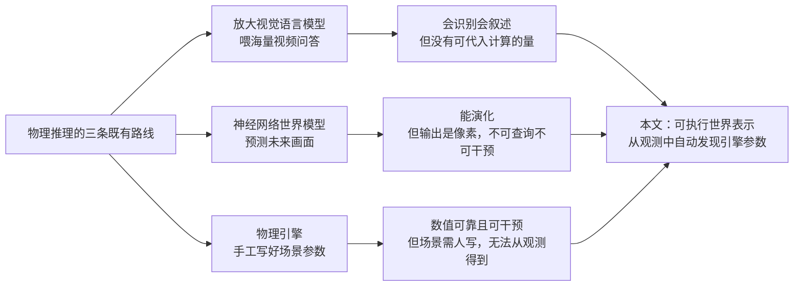
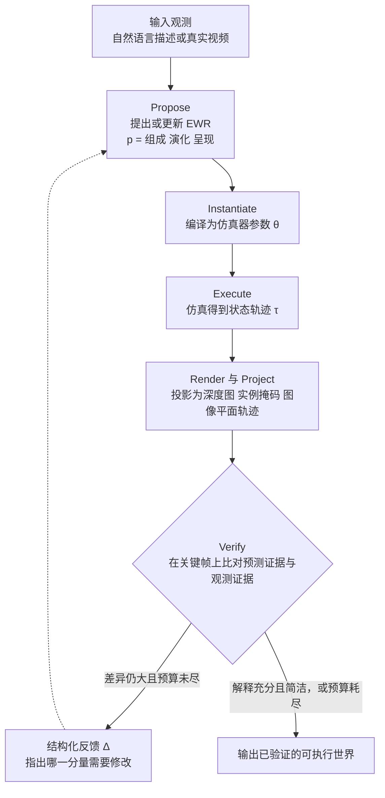
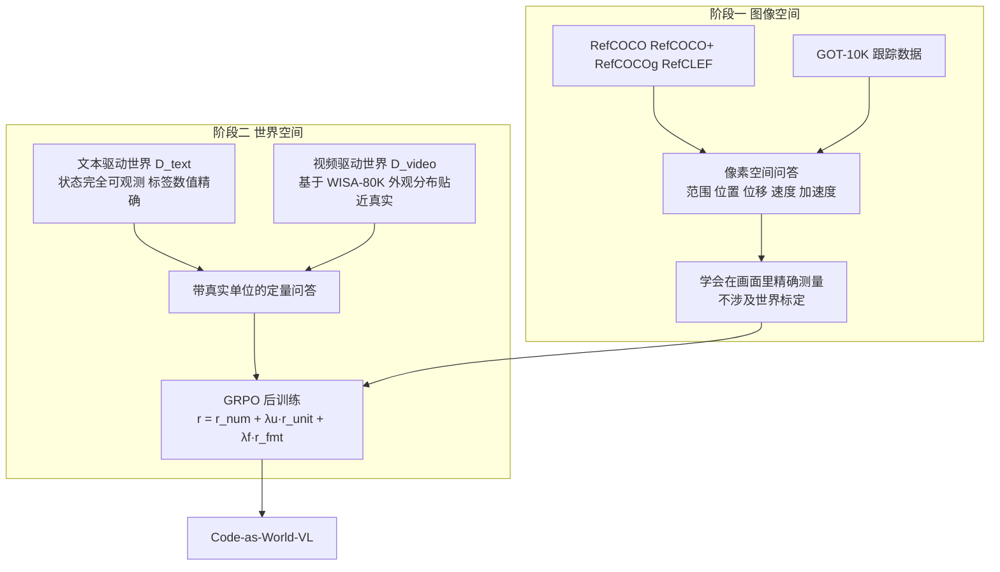

# 代码即世界：用智能体发现可执行的世界表示，以支撑物理推理

> **原题**：Code as Worlds: Agentic Discovery of Executable World Representations for Physical Reasoning
> **作者**：Hanyang Wang, Yimo Cai, Weiliang Chen, Jiawei Chi, Haowen Sun, Qiyu Dai, Yi-Hsin Hung, Xingzhuo Guo, Jinshan Ren, Runmao Yao, Ziwei Liu, Mingsheng Long, Yueqi Duan, Jun Gao, Jiangran Lyu, Fangfu Liu, Jialong Wu
> **年份**：2026（arxiv ID 2608.27549，提交于 8 月 27 日）
> **分类**：cs.CV
> **链接**：https://arxiv.org/abs/2608.27549
> **精读日期**：2026-08-31

## 阅读须知

### 这篇在领域里的位置

这篇属于「世界模型」这一支，但它选的路线与近几年的主流相当不同，所以有必要先把这条脉络理一理。

所谓世界模型，指的是让机器内部持有一份关于「世界如何演化」的表示，从而能够预测接下来会发生什么，也能回答「如果我改动某个条件，结果会怎样」这一类问题。过去几年这个方向上大致走出了三条路。第一条是把视觉语言模型（vision-language model）直接放大，喂进海量视频问答数据，指望模型在参数里隐式地学会物理。这条路在「识别与描述」上确实见效，模型能看出一段视频里发生了碰撞，也能用自然语言讲清楚谁撞了谁。第二条是学一个神经网络形式的动力学模型，输入当前帧与动作，预测下一帧，代表性的工作是各类视频预测模型。这条路的产物是像素，看上去很像，但你无法从中读出任何一个具体的物理量。第三条是直接用物理引擎，把场景的组成与参数手工写好，然后精确地推演。这条路在数值上是可靠的，问题在于场景是人写的，无法从一段观测里自动得到。

这篇论文站的位置，是想把第三条路的数值可靠性，接到第一条路的感知能力上，中间用第二条路缺的那样东西来连接，也就是一份显式的、可以被读出来也可以被改写的世界参数。它的做法是把这份参数写成代码，再让一个智能体通过反复的假设与验证，从观测里把这份代码找出来。

### 读完能回答什么

读完这份笔记之后，应当能够回答下面这几个问题。

其一，为什么把世界表示写成可执行代码，比写成一段自然语言描述或者一组神经网络权重更有用，具体多出来的是哪几项能力。

其二，所谓「智能体发现循环」的五个阶段各自在做什么，其中的 Verify 阶段究竟拿什么和什么比，比出来的差异又是如何回过头去指导修改的。

其三，单目视频做定量物理推理时，最本质的障碍是尺度不确定性，这篇论文是用什么机制把像素空间的量换算到真实世界的量的。

其四，为什么训练要分成图像空间与世界空间两个阶段，第一阶段单独存在的意义是什么。

其五，一个 9B 的模型在这个基准上超过若干闭源大模型，这个结论的适用范围有多大，哪些地方需要打折扣。

### 阅读前置

这份笔记假定读者熟悉视觉语言模型的基本形态，知道什么是视频问答，也用过强化学习做后训练。不预设读者做过物理仿真、图形学渲染，也不预设读者了解归因推理（abductive reasoning）这一支的哲学背景，相关概念都会在正文里铺垫。

### 缩写表

**EWR**（Executable World Representation，可执行世界表示）：这篇论文提出的核心概念，一份描述物理世界的、可以被仿真器直接执行的结构化代码。

**VLM**（Vision-Language Model，视觉语言模型）：同时接受图像或视频与文本输入的模型。

**GRPO**（Group Relative Policy Optimization，组相对策略优化）：一种强化学习后训练算法，用同一提示下采样出的一组回答互相作参照来估计优势，从而省掉单独的价值网络。

**MRA**（Mean Relative Accuracy，平均相对准确率）：这篇论文在数值预测任务上使用的评价指标，衡量预测值与真值的相对接近程度。

**ADE**（Average Displacement Error，平均位移误差）：轨迹预测里的常用指标，逐时刻计算预测位置与真实位置的距离再取平均。

**IoU**（Intersection over Union，交并比）：两个区域重叠程度的度量，这里用于比较仿真渲染出的物体掩码与观测中的物体掩码。

**QuantiPhy**：这篇论文构建的定量物理推理基准。

## 一、问题

先说清楚不解决它会怎样。

现在的视觉语言模型看一段小球从桌沿滚落的视频，可以准确地说出「小球滚出桌面后做抛体运动，然后落地弹起」。但如果接着问「它落地时的速度是多少米每秒」，或者问「若把桌子加高三十厘米，它落点会往外移多少」，模型给出的往往是一个听起来合理、实际上没有任何依据的数字。这中间缺的不是语言能力，而是模型内部根本没有一份可以代入计算的东西：没有物体的真实尺寸，没有重力加速度，没有初速度，也就谈不上推演。

这个缺口在实际用途里是致命的。机器人要抓一个物体，需要知道它有多重、摩擦系数大概多少；自动驾驶要判断能不能超车，需要知道对向车的速度而不是「它开得挺快」；工业质检要判断一个零件掉落会不会损坏，需要的是能量而不是形容词。凡是要把模型的判断接到真实动作上的场合，定性描述都不够用。

那么过去这些年是怎么试的，卡在了哪里。

一条路是把模型继续放大，喂更多带标注的视频问答数据。这条路的产物是识别与叙述能力的持续提升，但它有一个结构性的天花板：模型学到的是「这类画面通常对应这类答案」的统计关联，而不是一套可以外推的机制。一旦问题落到训练分布之外，比如问一个从未见过的重力条件下会怎样，这套关联就不再成立。

另一条路是神经网络形式的世界模型，输入一段视频与一个动作，直接预测未来的画面。这条路在视觉一致性上做得越来越好，但它的输出是像素。你没法从预测出的图像里读出「小球的质量是零点二千克」，也没法把重力从九点八改成一点六再看看会怎样，因为这些量在模型内部并不以独立变量的形式存在。换句话说，这类世界模型能演，却不能被查询，也不能被干预。

第三条路是回到物理引擎。引擎里的一切都是显式的、可查询的、可干预的，问题在于引擎需要有人把场景写出来。人工写场景无法规模化，也无法从一段真实视频自动得到，于是这条路长期停留在「仿真数据合成」的用途上，与真实观测之间隔着一道没人跨过去的沟。

这篇论文要解决的技术命题，就是把这道沟填上：给定一段自然语言描述或者一段真实视频，自动地产出一份显式的、数值上站得住的、可以执行也可以改写的世界描述。

单目视频还带来一个额外的、必须单独处理的障碍，即尺度不确定性。一段视频里，一个近处的小球和一个远处的大球可以投影出同样大小的圆，因此仅凭画面无法确定真实尺寸，也就无法把像素位移换算成米，进而无法给出任何带单位的答案。任何想在单目视频上做定量物理推理的工作，都绕不开这一步。

## 二、方法

### 可执行世界表示是什么

论文把一份世界表示记作 p，它由三个部分组成，写作 p =（𝒞, ℰ, 𝒜）。这三个符号分别对应物理组成、动态演化与视觉呈现。下面逐个说明。

物理组成 𝒞 回答的是「这个世界里有什么，以及它们相对稳定的性质是什么」。具体包含场景中的物体、它们的几何形状、以米为单位的真实尺寸，以及质量、摩擦系数、重力这一类物理属性。这里值得注意的是尺寸被明确要求是带单位的实际长度而非像素长度，这正是前面提到的尺度问题在表示层面的落点。

动态演化 ℰ 回答的是「这个世界如何随时间展开」。它包含物体的初始状态、状态随时间的变化、关键事件，以及整段仿真的时长。所谓关键事件，指的是碰撞、接触、离开支撑这一类在时间轴上可以被单独标记出来的时刻。

视觉呈现 𝒜 回答的是「这个世界被如何观看」。它包含相机参数、背景、材质、光照、输出帧率、分辨率，以及渲染或视频生成的配置。把这一部分单列出来的原因在于，同一个物理过程可以被从不同角度、不同光照下观看，而这些差异不应当污染前两部分的物理量。

这三部分合起来编译成一组仿真器可以接受的参数 θ，执行之后得到一条完整的状态轨迹 τ。轨迹里记录的是物体状态、接触、碰撞与事件结果。

到这里可以回答「为什么写成代码」这个问题了。写成代码之后，这份表示同时具备三项性质：它是紧凑的，因为一段几十行的代码就能刻画一个场景，远比一串像素或一组权重省；它是数值上有依据的，因为每一个物理量都以显式变量的形式存在，可以被读出来；它是可控的，因为改一个变量再执行一次，就得到了一个反事实的世界。这三项性质恰好对应前面三条既有路线各自缺的那一项。

### 智能体发现循环

有了表示形式，接下来的问题是怎么从观测里把它找出来。论文的做法借鉴了归因推理的思路。归因推理指的是从结果反推最能解释这个结果的原因，与从前提推结论的演绎推理方向相反。放在这里，观测到的视频是结果，要找的是那份能生成这段视频的世界参数。

由于这样的反推没有解析解，论文把它做成一个迭代循环，包含五个阶段。

第一个阶段是 Propose。智能体根据输入观测 η、当前的假设，以及上一轮返回的结构化反馈 Δ，提出或者更新一份 EWR。第一轮时没有反馈，智能体基于观测直接给出初始猜测。

第二个阶段是 Instantiate，把这份 EWR 编译成仿真器可以接受的参数。这一步看似机械，实际承担了合法性检查的职责：写得不合规范的假设在这里就会失败，而不会带着错误一路跑到最后。

第三个阶段是 Execute，仿真器运行并产出完整的状态轨迹 τ。

第四个阶段是 Render 与 Project。若输入是视频，系统把仿真出的状态投影回图像平面，得到深度图、实例掩码，以及图像平面上的轨迹。这一步的意义在于，把仿真结果换算成与观测同一种表达形式，否则两者无法比较。

第五个阶段是 Verify。系统在选定的若干关键帧上，把预测出的证据与输入的证据逐一比对。帧级别的差异被汇总成结构化反馈 Δ，而 Δ 的作用不只是告诉智能体「错了」，还要指出错在哪一部分，从而引导它只去局部修改相关的那个分量。举例来说，如果物体掩码的位置对但形状不对，问题更可能出在 𝒞 里的几何而非 ℰ 里的初速度。

循环的终止条件有两个。其一是当前的 EWR 已经足够好且足够简洁地解释了输入，这里的「简洁」是归因推理的固有要求，因为总可以通过堆砌特例来拟合任何观测，但那样的解释没有外推价值。其二是迭代预算耗尽。

### 用已验证的世界去训练模型

发现循环产出的是一批经过验证的可执行世界。每一个这样的世界都自带一段同步的视频与一条仿真状态轨迹，因此可以直接从中生成带精确世界空间标签的定量问答对。这一点是整套方法在实用层面的关键：物理监督信号第一次可以规模化地生产，而不必依赖人工标注。

训练分成两个阶段，这个划分不是工程上的随意选择，而是对应了前面说的尺度问题。

第一阶段是图像空间监督。数据来自 RefCOCO、RefCOCO+、RefCOCOg、RefCLEF 这几个指代表达数据集，以及目标跟踪数据集 GOT-10K。这一阶段的问题问的是物体的范围、位置、位移、速度与加速度，但全部在像素空间里定义，因此不需要任何世界空间的标定。这一阶段要教会模型的是「怎么在画面里精确地量」，这是一项与物理无关的、纯视觉的基本功。

第二阶段是世界空间监督，数据来自发现循环产出的可执行世界，并且刻意混合了两个来源。一路是文本驱动的世界 𝒟_text，由语言描述生成，其仿真器状态完全可观测，因而物理监督在数值上是精确的。另一路是视频驱动的世界 𝒟_video，从真实视频反推而来，构建时用到了 WISA-80K，它的长处在于外观与运动的分布更贴近真实观测。两路混合的用意很清楚：前者保证标签准确，后者保证分布不偏。

后训练用的是 GRPO，奖励由三项相加构成：

r = r_num + λ_u · r_unit + λ_f · r_fmt

其中数值项的形式是 r_num = exp(−|ŷ − y| / (|y| + ϵ))。这个形式值得单独说一句。它用的是相对误差而非绝对误差，原因在于这套基准里的物理量跨越很多量级，从厘米级的尺寸到米每秒平方的加速度，若用绝对误差，大量级的量会主导整个梯度。取指数则把奖励压在零到一之间，且在误差接近零时梯度最陡，鼓励模型把已经接近的答案继续磨准。另外两项分别约束单位是否正确与输出格式是否合规。

## 三、实验

### 基准与指标

论文构建了名为 QuantiPhy 的基准。任务形式是给定一段单目视频与一个定量物理问题，模型直接预测一个数值答案 y，问的是可测量的量，包括物体尺寸、位移、速度与加速度。

尺度问题在这里通过一个显式的标定机制处理。设 ρ 为某个已知的世界空间参考量，ρ_pix 为其在像素空间的对应值，则相对尺度为 γ = ρ / ρ_pix，而世界空间的真值答案为 y = γ · y_pix。这一步把「像素里量得准」与「换算得对」拆成了两件事，也正好解释了训练为何要分两阶段。

基准划分为四个子集，记作 2S、2D、3S、3D，对应二维与三维场景下的静态与动态两种设定。视频来源兼有真实与合成两类，构建时筛选了具有显著刚体运动或碰撞式交互的片段，并经人工复核，确认时间连续性、物体可见性，以及是否适合做可执行重建。评价指标是 MRA。

### 主要结果

下表是各模型在四个子集上的平均 MRA。

| 模型 | 规模 | 平均 MRA |
| --- | --- | --- |
| Code-as-World-VL-27B（Reasoning） | 27B | 58.6 |
| Code-as-World-VL-9B | 9B | 55.4 |
| Gemini-3.1 Flash | 闭源 | 54.8 |
| Code-as-World-VL-4B | 4B | 50.6 |
| ChatGPT-5.1 | 闭源 | 48.4 |
| Gemini-2.5 Pro | 闭源 | 46.4 |
| Gemini-2.5 Flash | 闭源 | 44.1 |
| Qwen3-VL-32B | 32B | 40.2 |
| InternVL-3.5-30B | 30B | 35.5 |
| Qwen3-VL-8B | 8B | 32.3 |

有两个对比值得单独拎出来。其一是 9B 的模型拿到 55.4，高于 Gemini-3.1 Flash 的 54.8，也远高于同量级的 Qwen3-VL-8B 的 32.3。同量级开源模型之间二十三个百分点的差距，说明起作用的不是参数量而是那批世界空间监督数据。其二是 32B 的 Qwen3-VL 只有 40.2，低于本文 4B 模型的 50.6，这进一步支持了同一个判断：在这个任务上，缺的是恰当的监督信号而不是容量。

9B 变体在四个子集上的细分成绩是 2S 为 55.0、2D 为 52.9、3S 为 55.6、3D 为 58.1。这个分布有一处反直觉的地方，即通常被认为更难的 3D 动态子集反而拿到了最高的 58.1，而看似最简单的 2D 动态只有 52.9。论文没有对此展开解释。一个合理的猜测是，三维场景里的透视线索反而为尺度标定提供了更多约束，而二维动态场景缺少深度线索，标定更依赖单一参考量，因此误差更容易放大。这只是推测，论文本身没有给出证据。

### 消融

最能说明问题的一组消融是关于发现循环本身是否有必要。论文把最多迭代五轮的智能体循环，与在相同评估预算下直接采样五次取最好（Best-of-5）作对比。若两者表现相当，则说明所谓的循环只是变相的多次采样，反馈机制并没有真正起作用。

结果是智能体循环在视觉对齐、物体 IoU 与 Accuracy@2%D 这几项上都优于 Best-of-5，轨迹的 ADE 指标也从第一轮到第五轮持续下降。持续下降这一点尤其关键，它说明每一轮拿到的结构化反馈确实在指导修改，而不是靠运气撞上一个好的初始假设。

另一组消融关于两阶段训练。只做图像空间训练的变体在图像平面的测量任务上已经表现不错，而完整的两阶段模型在每一个基准上都进一步超过了它。这说明第一阶段并非可有可无的热身，它把「量得准」这件事先立住了，第二阶段才有可能在此之上把「换算得对」学好。

## 四、局限

### 论文自己承认的

第一项关于发现过程的可靠性。作者指出真实环境高度复杂，而现有仿真器无法忠实覆盖全部物理条件。一旦真实过程落在仿真器的建模范围之外，发现循环可能收敛到一个局部看起来说得通的 EWR，却并没有恢复出机制上正确的解释。换句话说，验证阶段比对的是表象是否吻合，而表象吻合不等于机制正确。

第二项关于基准的覆盖面。作者明确说 QuantiPhy 只评估了物理理解中很有限的一个子集，主要集中在单目尺度标定上，因此它只覆盖了真实世界物理的一小部分。碰撞后的形变、流体、热学、材料失效这些都不在其中。

第三项关于模型学到了什么。Code-as-World-VL 学的是从已验证世界中导出的监督信号，而没有把发现过程本身内化。假设构建、仿真、诊断与迭代修正这几步始终留在模型之外，由外部循环完成。这意味着面对一个全新的、循环未曾处理过的场景，模型本身并不具备自行建立并检验假设的能力。

### 读完能看出来的

首先是可复现性。论文没有指明所用的物理仿真引擎、渲染器或视频生成模型的具体名称，驱动发现循环的智能体在算法描述里只写作一个泛指的大语言模型，Code-as-World-VL 的基座模型也没有点名，训练所用的文本驱动与视频驱动世界各生成了多少也没有给出数量。这些缺失使得外部团队难以按论文复现，也难以判断成绩中有多少来自方法、多少来自某个强力基座。

其次是验证的粒度。Verify 阶段是在选定的若干关键帧上做比对的，那么关键帧之间发生的偏差原则上是看不见的。对于碰撞这类在极短时间内完成的事件，若关键帧恰好落在碰撞前后而非碰撞瞬间，接触细节上的错误可能一路通过验证。

再次是文本驱动世界的分布问题。𝒟_text 由语言模型生成，其物理场景的分布反映的是语言模型认为哪些情形是典型的，而非真实世界中哪些情形常见。它在标签数值上是精确的，但在「什么样的世界值得被学习」这个层面上带有模型自身的先验。论文用视频驱动的一路来对冲这个偏差，但两路的混合比例没有说明。

最后是那条 27B 与 9B 的对比。27B 的变体被标注为 Reasoning，也就是说它同时改变了参数规模与推理模式两个变量，因此 58.6 相对 55.4 的提升无法归因到其中任何一个。若要说明推理模式的价值，需要的是同规模下开与不开的对照。

## 一句话

把物理世界写成可执行代码，再让智能体反复假设与验证地从视频中把这份代码找出来，用它规模化地生产定量物理监督。
