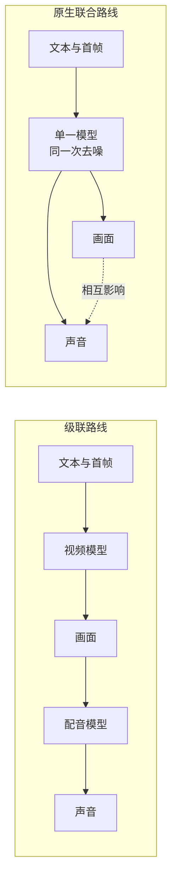
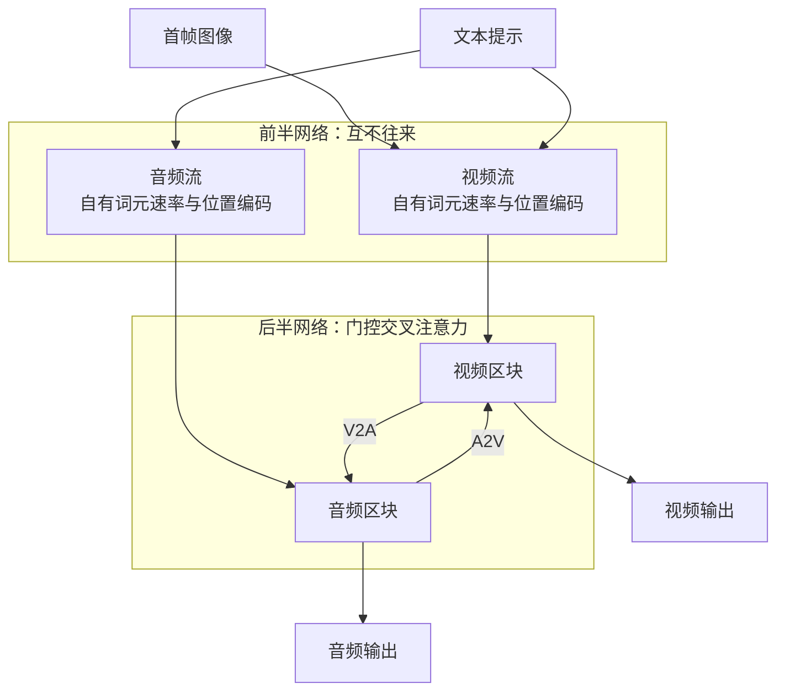
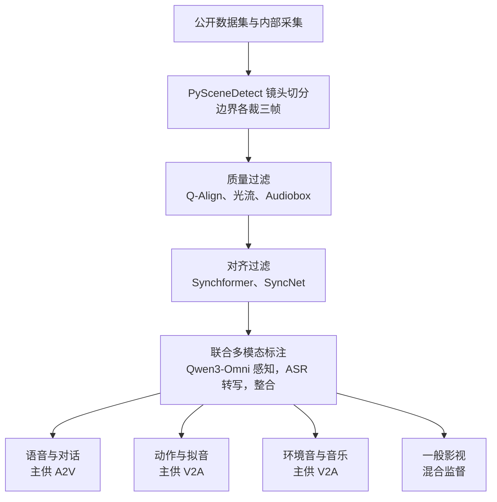
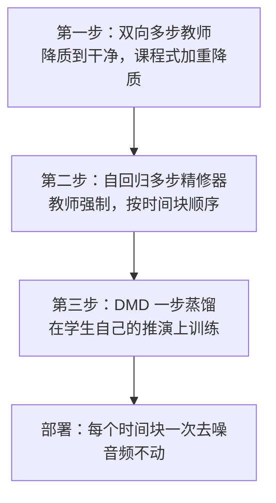

# DreamX-Creator：用七十亿参数把原生音视频联合生成推到 2K

> **原题**：DreamX-Creator: Democratizing Native Audio-Video Generation at 2K Resolution
> **作者**：Jiashu Zhu, Yanhao Zheng, Ruitian Tian, Rujing Dang, Shen Zhang, Bingze Song, Jiachen Lei, Ruimin Lin, Jiahong Wu, Xiangxiang Chu
> **机构**：arXiv 摘要页未列出
> **年份**：2026（arXiv ID 2608.31106）
> **分类**：cs.CV / cs.SD
> **链接**：https://arxiv.org/abs/2608.31106
> **精读日期**：2026-09-01

## 阅读须知

### 这篇在领域里的位置

视频生成这几年走的是一条相当清晰的路线。早期的工作先把扩散模型从静态图像推广到时间维度上，随后骨干网络从卷积换成 Transformer，训练目标从逐步去噪的 DDPM 换成更直接的流匹配，分辨率与时长则一路从几百像素的两秒片段涨到今天的分钟级高清。这一段进展基本围绕画面本身展开，声音长期处在视野之外。

声音后来是被补上去的，补的方式大多是级联。先用一个视频模型把画面生成出来，再用另一个专门的模型看着画面配音，也就是所谓的视频到音频。这条路线的好处是可以复用两边现成的模型，代价则是两种信号之间只剩下单向的、事后的联系：画面不知道自己将要发出什么声音，声音也无法反过来影响画面里的动作节奏。

这篇论文属于另一类工作，即原生联合生成。它主张音频和视频应当在同一次去噪过程里一起被生成，让两种信号在生成的中途就开始互相影响，而不是先后排队。这一类此前已有若干开源尝试，参数规模从六十多亿到三百多亿不等；这篇的位置在于，它用一个七十亿参数的紧凑模型去争取与更大模型相当的效果，并且额外解决了高分辨率输出的问题。

### 读完能回答什么

读完这份笔记，你应该能够回答下面这些问题：

1. 为什么把音频和视频分成两步生成会在原理上丢失一些东西，而不只是效率问题。
2. 一个模型如何在同一个网络里同时处理两种时间尺度完全不同的信号，且不需要把其中一种重采样成另一种。
3. 门控交叉注意力里的那个门到底在门什么，为什么它要同时看目标词元和跨模态的注意力输出。
4. 为什么强化学习后训练在这里必须把奖励拆开，而不能用一个总分。
5. 一个原本需要多步去噪的高分辨率精修器，如何被压缩成每个时间块只算一次。

### 阅读前置

这份笔记预设读者熟悉 Transformer 的基本结构、注意力机制的计算方式，以及扩散模型的大致思路，也就是从噪声出发逐步还原数据的那一套。它不预设读者做过视频生成或者音频生成，也不预设读者了解流匹配、蒸馏或者强化学习在生成模型上的具体用法，这些会在正文里铺垫。

### 缩写表

- **A2V**（Audio-to-Video）：音频到视频的方向，即用音频影响视频的生成。
- **V2A**（Video-to-Audio）：视频到音频的方向。
- **DiT**（Diffusion Transformer，扩散 Transformer）：用 Transformer 而非卷积网络作为扩散模型骨干的做法。
- **LoRA**（Low-Rank Adaptation，低秩适配）：只训练一组低秩增量矩阵、冻结原权重的微调方式。
- **DMD**（Distribution Matching Distillation，分布匹配蒸馏）：把多步生成模型压缩成少步或一步的一类蒸馏方法。
- **KL 散度**（Kullback-Leibler Divergence）：衡量两个概率分布差异的量，这里用来约束强化学习后的策略不要离原模型太远。
- **WER**（Word Error Rate，词错误率）：语音识别指标，这里用来衡量生成的说话内容是否清晰可辨。
- **LSE-C**（Lip Sync Error - Confidence）：唇形同步的置信度指标，越高表示口型与语音越吻合。
- **DeSync**：时间错位程度的度量，越低表示音画在时间上越对齐。

## 一、问题

先说清楚这个问题不解决会怎样。

如果你今天想做一段有声音的生成视频，主流做法是分两步：先让视频模型画出画面，再让另一个模型根据画面配音。听起来这只是流水线上多一道工序，实际上它在原理层面丢掉了一样东西，即两种信号之间的相互决定关系。现实世界里，一个杯子落地的瞬间，画面上的形变与声音的起始点来自同一个物理事件；说话时嘴唇的开合与音节的边界也来自同一个发声动作。级联的做法把这个共同来源切断了，只留下从画面到声音的单向推测。

推测在容易的场景里够用，在难的场景里不够用。配音模型只能看到画面已经定下来的动作，如果那段动作本身在节奏上就不像是能发出某种声音，配出来的音只能勉强对上。更麻烦的是反方向完全没有机会发挥：声音本可以约束画面，比如一句台词的长度本应决定嘴唇张合的次数，但在级联结构里画面早已生成完毕，无从修改。

过去几年这个方向上的努力大致分三条路线。第一条是把配音模型做得更强，用更好的视觉编码器和更细的时间对齐模块去提升单向推测的准确度；它做对的是让容易的场景变得可靠，不够用的地方在于单向这个结构性限制没有被触碰。第二条是把两个模型串在一起联合微调，让梯度可以从音频端回传到视频端；它比第一条更进一步，但两个骨干仍然是各自独立训练出来的，联合的只是最后一段。第三条就是原生联合生成，也就是从一开始就让一个模型同时产出两种信号。

原生路线的困难是具体的。音频和视频在时间上的采样率相差一到两个数量级，一秒钟的视频可能只有二三十帧，而音频要有上万个采样点，两者压缩到隐空间之后词元数量仍然差得很远。把其中一种重采样成另一种会损失信息，直接拼在一起做自注意力则会让计算量失控，并且让两种性质迥异的信号共用同一套位置编码。

这篇论文要解决的技术问题因此可以写成一句相当具体的话：如何在一个参数量不大的模型里，让两条保持各自时间尺度的信号流在同一次去噪过程中互相影响，并且让这种影响可以被控制强弱、可以被单独训练、也可以在推理时按需要开关。

## 二、方法

### 两条流，前半独立，后半耦合

整个系统的核心是一个七十亿参数的生成器，作者称它是同类原生联合模型里公布骨干规模最小的一个。它的输入是一张首帧图像和一段文本提示，输出是一段音频与一段视频。

网络的组织方式是这篇论文最值得记住的设计。音频和视频各自拥有一条完整的流，包括各自的词元速率、各自的位置编码、各自的 Transformer 骨干。文本条件通过各自的通路分别注入两条流。网络的前一半区块里，两条流互不往来，各自处理各自的信号；到了后一半区块，才通过成对的交叉注意力互相连接，一条从音频指向视频，一条从视频指向音频。

这样切分的理由是分工。前半段要做的事情是把各自模态内部的结构建立起来，比如画面的空间布局、声音的频谱包络，这些工作没有必要参考另一种信号；后半段要做的事情才是把两者对齐，让声音的事件落在画面的动作上。把耦合推迟到后半段，既省下了大量本不必要的跨模态计算，也让两条流各自的预训练权重能够被直接复用。

### 门控交叉注意力

交叉注意力本身是常见构件，它让一条流的词元去查询另一条流的信息。这篇论文在它后面加了一道门，用来决定每一份查回来的信息应当被采纳多少。

门的形式是这样的。对第 i 个词元与第 h 个注意力头，门控值为

g_{i,h} = sigmoid( [W_x LN(x_i)]_h + w_c^T LN(C_{i,h}) + b_h )

其中 x_i 是目标词元自身的表示，C_{i,h} 是这个头从另一条流查回来的注意力输出，LN 表示层归一化。门控值介于零与一之间，逐头乘在对应的注意力输出上，然后再拼接。

这个式子里值得停一下的地方是它的两个输入。常见的门控只看目标词元自己，也就是只用 x_i 决定要不要接受外来信息；这里额外把 C_{i,h} 也放了进去，意味着门同时知道自己是谁、以及对方递过来的是什么。作者强调的正是这一点：门的开合取决于目标词元与跨模态注意力输出两者，而不只取决于查询端。这样一来，当另一条流在某个时刻并没有提供有用信息时，门可以把它关小，而不必让整条流去适应噪声。

至于两种信号时间尺度不同这个障碍，解决办法是不做重采样。两条流的位置被映射到一个共享的时间坐标系上，跨模态的查询和键上施加时间旋转位置编码，于是音频词元与视频词元即使数量相差很多，也能在同一根时间轴上找到彼此的对应位置。

训练时还引入了方向掩码，用一对开关控制两条通路是否激活。音频到视频模式下开关是一比零，视频作为目标、音频较为干净；视频到音频模式下反过来；联合模式下两个开关都打开，两条流的噪声水平相当。这三种模式让同一个网络可以分别学习两个方向的条件生成与完全联合的生成。

### 数据系统

联合生成对数据的要求比单模态更苛刻，因为它需要的是时间上真正对齐的片段，而不是各自都合格的画面与声音。

数据来源包括 Koala-36M、VGGSound、AudioSet、OpenHumanVid、SpeakerVid-5M、Action-100M、Talker-T2AV 等公开集合，另有内部采集的数据。过滤分两层。第一层是切分与质量，用 PySceneDetect 做镜头检测并在边界处各裁掉三帧，再用 Q-Align 评视觉质量、光流评运动幅度、Audiobox Aesthetics 评音频质量。第二层是对齐，用 Synchformer 评一般意义上的音画同步，用 SyncNet 专门评语音场景下的唇形同步。

标注方式是这套系统里另一个刻意的选择。作者明确反对先分别给两种模态各写一段描述再拼起来的做法，改用 Qwen3-Omni-30B-A3B-Instruct 做联合的多模态感知，然后由 Qwen3-ASR-1.7B 转写语音、Qwen3.6-27B 整合成最终描述。理由不难理解：拼接出来的描述只会说画面里有什么、声音里有什么，说不出两者之间的关系，而关系恰恰是这个模型要学的东西。

过滤后的片段被分进四个能力池，分别是语音与对话、动作与拟音、环境音与音乐、以及一般影视内容。前者主要提供音频到视频的监督，中间两类主要提供视频到音频的监督。内容分布上，语音占百分之四十五，事件声占百分之三十三点四。

### 渐进式联合训练

训练分三个阶段，一个比一个放得开。

第一阶段从各自模态已有的骨干出发，冻结前半段区块，只在后半段加秩为二百五十六的 LoRA，同时直接优化交叉注意力模块与输出门。学习率上，LoRA 参数用一乘十的负四次方，跨模态部分用二乘十的负五次方。这一阶段的用意是先把连接建立起来，不去动两条流各自已经学好的东西。

第二阶段把 LoRA 权重合并回去，解冻全部参数，骨干用一乘十的负五次方、跨模态部分仍用二乘十的负五次方，在覆盖面较广的成对数据上联合训练。

第三阶段是高质量微调，用同步指标、美学分数与空间分辨率筛出一个子集，并用 OmniShotCut 检出镜头边界、丢弃转场。这里有一个细节值得记下：损失权重上视频取零点五，音频取零点一，也就是刻意压低了音频的权重。

优化目标是流匹配。流匹配可以理解为让模型直接学习从噪声走向数据的那个速度场，相比逐步预测噪声的经典写法更为直接。这里的损失按词元数与特征维度做了归一化，然后按上述权重加权合并，使两种词元数量相差很大的模态不至于一方压倒另一方。三个阶段统一使用 AdamW，梯度范数裁剪到一，采用 bfloat16 混合精度。

### 模态感知的强化学习

预训练之后还有一轮强化学习，目的是按人所关心的质量去调整生成偏好。

这一步的关键设计是不用总分。如果只给一个全局奖励，模型完全可能通过把画面做得更漂亮来掩盖声音变差，总分依旧上升，而实际体验下降了。作者的做法是把优势拆成三份，视频专属的、音频专属的、以及跨模态的，然后按下面的方式分别送回两条流：

Ã_v = A_v + A_{av}
Ã_a = A_a + A_{av}

也就是说，跨模态那一份两条流都收到，而各自专属的那份只回到自己这条流上。奖励本身由四部分构成：视频质量、音频质量、提示词一致性、以及音画同步；每一项都在同一条件下生成的若干候选之间做归一化，得到相对优势。

同步这件事还额外做了两处安排。一是用较深交互区块里的跨模态相关性分数为词元加权，让与另一条流关系更紧密的位置获得更大的训练权重，权重在热身阶段接近均匀，之后逐步拉开。二是按深度缩放梯度，浅层区块流向音频的梯度被衰减，越深越恢复，这与前面前半独立后半耦合的结构是一致的。

训练集只有一千组首帧与提示词的配对，流程在候选生成、多模态奖励评估、策略优化之间交替。损失里含一项 KL 散度，把更新后的策略约束在预训练模型附近，用来保住生成多样性并防止对奖励的过度拟合。

### 自回归一步式 2K 精修

最后一块是分辨率。让主生成器直接产出 2K 代价过高，所以作者把高分辨率交给一个独立的精修器，并把它压缩到每个时间块只需一次去噪。

这个精修器是三步造出来的。第一步训练一个双向的多步教师，用降质的高分辨率视频到干净的高分辨率视频这样的配对，以流匹配为目标；双向意味着它可以同时看过去与未来的帧。降质是按课程逐步加重的，从轻微开始以鼓励结构保持，随后逐步引入更强的模糊、噪声、压缩伪影、重采样伪影、几何畸变以及时间上相关的损坏。

第二步把教师改造成自回归的多步精修器，方法是教师强制，即当前时间块的去噪以低分辨率视频与真实的过去高分辨率块为条件。这一步的目的是让模型的结构与最终部署时的结构一致，同时保住教师的画质。

第三步用分布匹配蒸馏把它压成一步的学生。这里有一个针对曝光偏差的处理值得记下：学生是在自己的推演结果上训练的，也就是用学生自己生成的完整视频来施加蒸馏目标，而不是用教师的轨迹，以免训练与推理时输入分布不一致。像素空间上的监督由分布匹配、DISTS 感知损失与 L2 重建损失共同构成，后两者权重均为一。

部署时，精修器按时间块顺序处理视频，音频流原样不动，因此不会改变运动本身，也不会破坏已经对齐好的时序。

## 三、实验

### 评测设置

评测在 Verse-Bench 上进行，它包含三个子集，覆盖一般音视频事件与以语音为主的场景。提示词由分开的视频描述与音频描述合并而成。

指标分四类。视频质量用 Aesthetic Predictor、MUSIQ、MANIQA、DINOv3；音频质量用 Audiobox Aesthetics 的四个维度，即 CE、CU、PC、PQ；语音场景另用词错误率与 SyncNet 的 LSE-C 衡量唇形同步；音画对齐则用 ImageBind 相似度衡量语义层面的一致，用 Synchformer 的 DeSync 衡量时间层面的错位。

### 主要结果

与规模相近的研究型模型相比，也就是六十三亿的 NAVA、七十一亿的 UniAVGen 与一百亿的 Ovi，这个模型在多数指标上取得相当或更好的分数。最突出的是时间对齐：DeSync 从基础模型的 0.1902 降到强化学习之后的 0.1351，是这一组里最好的。视频质量的 VQ 分数则是基础模型 0.6568、强化学习后 0.6573、再经过精修器之后 0.6930。

| 阶段 | VQ | DeSync |
| --- | ---: | ---: |
| 基础模型 | 0.6568 | 0.1902 |
| 加强化学习 | 0.6573 | 0.1351 |
| 再加 2K 精修 | 0.6930 | 不适用 |

这张表里有一个值得多看一眼的地方。强化学习几乎没有提升视频质量分数，从 0.6568 到 0.6573 只差万分之五，却把时间错位改善了将近三成。这与前面模态感知那一节的设计是自洽的：奖励被拆开之后，同步这一项的改进不会被画面质量的波动淹没，而画面质量本来也不是这一步要动的东西。真正把 VQ 抬上去的是精修器。

与更大的模型相比，即两百二十亿的 LTX-2.3 与三百三十亿的 MiniMax-H3，结论就不再一边倒。音频美学上明显落后，CE 一项是 4.7463 对 LTX 的 5.1876 与 MiniMax 的 5.2776；唇形同步上 MiniMax 的 LSE-C 是 8.7354，高于本文的 7.8361。但在时间对齐上仍然领先，DeSync 是 0.1351 对 0.2412 与 0.2708。

精修器单独与其他精修方法比较时，在 FlashVSR、SeedVR、LTX-2.5 Refiner 之中取得了最高的 MUSIQ 与 MANIQA，分别是 0.7073 与 0.4382，并且在这一组里 LSE-C 与 ImageBind 最好、DeSync 最低。这一点比画质分数本身更值得注意，因为它说明精修没有破坏原本对好的音画关系。

### 主观评测里的反直觉之处

盲测的双向对比给出了一个分裂的结果。对上研究型的开源系统，也就是 Ovi、UniAVGen、NAVA、DaVinci，视频质量的胜率在百分之六十一点七到七十三点七之间，优势清楚。对上工业系统，也就是 Wan2.7、Kling、MiniMax，视频质量还能维持在百分之三十九点五到四十八点八，接近平手，但在音频质量与音画对齐这两项上，输的次数超过赢的次数。

这个分裂本身是有信息量的。它说明这套方法在画面这一侧已经接近工业水准，差距集中在声音与两者的关系上，而这恰好是作者在局限里承认需要更强音频后训练的地方。

## 四、局限

作者自己承认的部分相当直接。七十亿参数的模型尚未在所有维度上追平两个更大的开源基线，差距主要在音频美学与跨模态语义两处；唇形同步上 MiniMax-H3 明显更强；音频保真度与跨模态对齐都还需要更强的音频后训练。他们也提到用户研究里高动态、构图复杂的场景占比偏低，因此与工业系统的比较并没有充分探到对方的能力上限。

读完之后能看出来但论文没有明说的，还有几处。

其一是音频权重那个选择。第三阶段把音频损失权重压到零点一而视频保留零点五，这与最终音频质量落后于更大模型的结果之间，很难说没有关系。压低权重在训练稳定性上有它的道理，因为两种模态的词元数量与损失尺度差得很远，但这个比例是否已经过头，论文没有做消融。

其二是精修器与生成器之间的关系。精修只作用于视频、音频原样不动，这在保持时序上是稳妥的，代价是画质提升之后音频的相对短板会更明显。评测里 VQ 从 0.6573 提到 0.6930 而音频指标不变，主观评测中音频恰是输面较大的一项，两件事放在一起看是说得通的。

其三是强化学习那一步的数据规模。一千组首帧与提示词的配对是个不大的集合，KL 约束也确实在防止过度拟合，但这套奖励是否在更广的题材上仍然指向同一个方向，论文没有给出证据。

其四是可复现性。论文承诺开源七十亿的生成器与 2K 精修器，这是它标题里普及一词的实际内容；但数据系统依赖 Qwen3-Omni、Qwen3-ASR、Qwen3.6 等一整套外部模型来做标注，训练语料的具体规模与过滤后片段数量也没有披露，因此复现权重容易，复现数据难。

## 一句话

用七十亿参数的双流模型，让音视频在同一次去噪里通过门控交叉注意力互相影响，再以一步蒸馏把画面精修到 2K。
