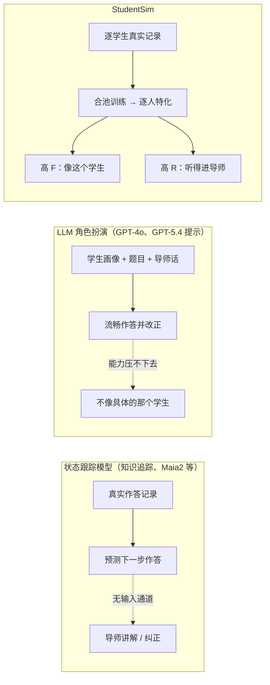
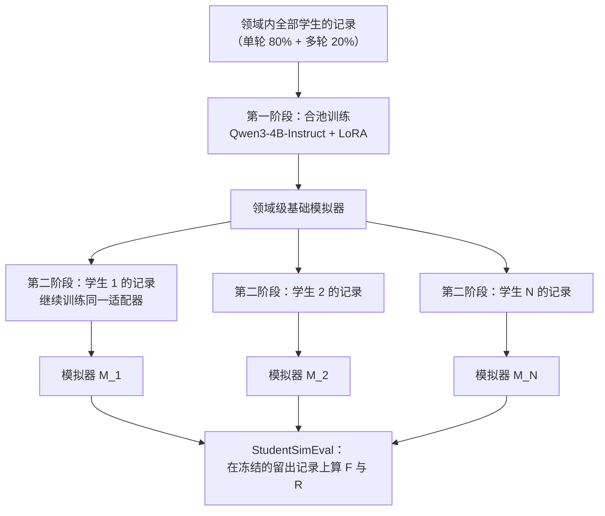
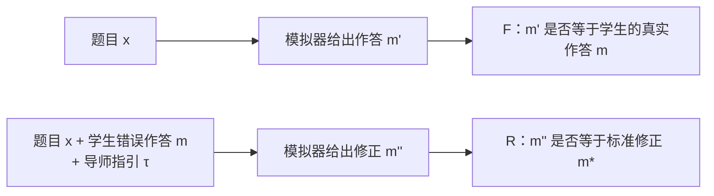
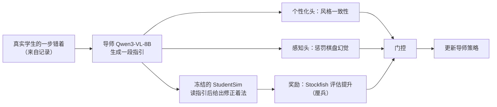

# StudentSim：训练基于大语言模型的学生模拟器

> **原题**：StudentSim: Training LLM-based Student Simulators
> **作者**：Ke Yang, Chenglong Wang, Michel Galley, Chandan Singh, Jeevana Priya Inala, ChengXiang Zhai, Jianfeng Gao
> **机构**：Microsoft Research，University of Illinois Urbana-Champaign
> **年份**：2026（arxiv ID 2609.01591）
> **分类**：cs.CL
> **链接**：https://arxiv.org/abs/2609.01591
> **代码**：https://github.com/microsoft/StudentSim
> **精读日期**：2026-09-02

## 阅读须知

### 这篇在领域里的位置

这篇论文属于「面向教育的模拟学习者」这一支工作，它服务的目标是人工智能导师（AI tutor）的训练与评估。过去二十年里，这一支的主流是知识追踪（knowledge tracing）一类的状态跟踪模型：给定一名学生的做题记录，预测他下一题答对的概率，或者预测他会选哪个错误选项。这些模型贴合真实数据，所以对学生「会做什么」估计得相当准，但它们的输入只有题目与作答历史，没有一条通道能接受一段导师的讲解，也就无法回答「听了这句提示之后学生会不会改对」。

大语言模型出现之后，另一条路线兴起：直接让模型扮演学生（role-play），把学生画像、题目与导师的话写进提示词，让它作答。这条路线对讲解与纠正反应灵敏，却有一个反向的缺陷，扮演出来的学生往往比被模仿的真实学生聪明得多，导师给的任何提示它都能接住，于是这个「学生」不像任何一个具体的人。StudentSim 站在这两条路线的交叉点上：它用真实的逐学生记录去训练一个小型语言模型，让模拟器既像那个具体的学生，又能在导师指引下改变作答。论文同时给出一套名为 StudentSimEval 的评测协议，把「像不像」与「听不听得进去」拆成两个可以分别打分的轴。

### 读完能回答什么

- 为什么知识追踪模型与大模型角色扮演各自只能满足学生模拟器的一半要求，而这两半为什么必须同时满足？
- StudentSim 的两阶段训练（先合池再逐人特化）具体是怎么做的，为什么在每个学生只有几十条记录的情况下不会过拟合？
- 行为忠实度 F 与指导响应度 R 分别度量什么，在国际象棋、二语英语写作与数学三个领域各自如何计算？
- 为什么一个四十亿参数的开源模型经过这样的训练，能在两项指标上都超过 GPT-5.4 的提示式扮演？
- 把训练好的学生模拟器冻结后当作强化学习的奖励模型去训练导师，为什么比用 GPT-5.4 当奖励模型的导师更准确，甚至后者还不如不做强化学习？

### 阅读前置

假定读者熟悉大语言模型的监督微调与参数高效微调的一般概念，知道 LoRA 大致是在冻结主干权重的情况下训练低秩增量矩阵，也知道强化学习里「奖励模型」指的是给策略输出打分的那个模型。不假定读者了解教育技术、知识追踪，或者国际象棋引擎的评估方式；这些在正文中第一次出现时都会先铺垫再展开。

### 首次出现的缩写表

- **LLM**（Large Language Model，大语言模型）：以 Transformer 为骨架、在海量文本上预训练的生成式模型，本文中的模拟器与导师都以它为底座。
- **KT**（Knowledge Tracing，知识追踪）：根据学生历史作答估计其知识状态并预测后续作答的一类模型，本文把它归为「状态跟踪模型」。
- **ZPD**（Zone of Proximal Development，最近发展区）：维果茨基提出的教育心理学概念，指学生独立做不到、在他人协助下能做到的那一段能力区间。
- **LoRA**（Low-Rank Adaptation，低秩适配）：只训练插入在原权重旁的低秩矩阵、主干参数保持冻结的微调方法。
- **F**（Behavioral Fidelity，行为忠实度）：模拟器在没有导师介入时与真实学生作答一致的程度。
- **R**（Guidance Responsiveness，指导响应度）：模拟器在读到导师指引后从错误作答改到标准修正的比率。
- **L2**（Second Language，第二语言）：本文里专指以英语为第二语言的写作学习者。
- **EFCAMDAT**（EF-Cambridge Open Language Database）：一个公开的英语学习者作文语料库，附有教师逐句批改标注。
- **FEN**（Forsyth-Edwards Notation）：用一行字符串描述一个国际象棋局面的标准记法。
- **ELO**：国际象棋通用的棋手实力等级分。
- **RL**（Reinforcement Learning，强化学习）：策略通过与环境交互获得奖励并据此更新的学习范式。
- **MC**（Multiple Choice，多项选择）：数学领域的评测把作答转成四选一的形式。

## 一、问题

一个人工智能导师真正有用，是在它能针对每个学生的强项、弱项与偏好的指导方式做出调整的时候。要做到这一点，导师需要知道「对这个学生，哪一种讲法能让他改对」。这类证据在现实里极其稀疏：一名学生一个学期能积累的有效互动不过几十到几百条，收集慢、成本高，而且每一次尝试都是拿真实学生的学习时间去试错。于是研究者自然想到用学生模拟器做代理，让导师先在模拟学生身上大量试错，再把学到的策略用到真人身上。

问题在于现有的模拟器两边各缺一半。以知识追踪为代表的状态跟踪模型，训练目标是复现真实作答分布，因此在「学生会怎么做」上忠实度不错；然而它们的输入接口里没有导师这一角色，一段解释或一次纠正对它而言不存在，模型无从表现出「听懂了并改正」。与之相对地，用大语言模型做角色扮演，导师说什么它都能立刻回应，可它并不能可靠地把自己的能力压到被模仿学生的水平：真实学生会在某个位置一再犯同一种错，扮演出来的学生则常常直接给出正确答案。作者把这两种缺陷分别称为「有忠实度而无响应通道」与「有响应而无忠实度」。

作者用维果茨基的最近发展区来给这个问题定框。学生有一段独立能力（他自己能做到什么），也有一段协助下的能力（在导师帮助下能做到什么），两者之间的差就是教学可以作用的空间。一个合格的学生模拟器必须同时刻画这两段：既要重现学生独立作答时的样子，也要重现他在得到支持后向前走的方式。前者对应本文的行为忠实度 F，后者对应指导响应度 R，两者被视为彼此独立的两条轴，理想的模拟器要在两条轴上都高。

由此，这篇论文要解决的技术问题可以写成一句可验证的陈述：给定每名学生稀疏的真实记录，训练出一组逐学生的模拟器，使其在留出记录上同时取得高 F 与高 R；并且给出一套固定的评测协议，让任何方法都在同一批学生、同一份训练记录、同一份留出记录上被评分，以便公平比较。

## 二、方法

### 记录的两种形态

StudentSim 处理的最小数据单位是「记录」。单轮记录是一对 (x, m)，其中 x 是题目或局面，m 是学生自己给出的作答；多轮记录是一个四元组 (x, m, τ, m*)，其中 τ 是导师针对学生错误作答 m 给出的一段指引，m* 是这段指引所指向的标准修正。训练集中多轮记录的占比固定为 0.20，也就是说模拟器看到的样本里有八成是学生独立作答的样子，两成是「被指引之后改正」的样子。之所以这样配比，是因为忠实度需要大量独立作答来学习学生的错误分布，而响应度只需要足够多的示例来学会「读到指引就朝修正方向更新」这一模式。

三个领域各自的记录来源不同。国际象棋来自 Lichess 2025 年 5 月的真实对局，一个局面加一步真实着法就是一条单轮记录，导师指引由大模型按固定模板生成，标准修正取引擎的最佳着法。二语英语写作来自 EFCAMDAT 语料，记录由真实教师的逐句批改构成，标准修正是教师给出的改写。数学来自一个基础辅导语料，学生的错误作答与经过审核的答案共同构成记录，导师指引同样由模板生成。三个领域中，只有二语写作的指引出自真人教师，这一点会在局限一节再提。

### 两阶段训练

第一阶段是合池训练。作者把一个领域里许多学生的记录合在一起，在同一个底座上训练一个领域级的基础模拟器。这一步学到的是该领域学生群体的共性：常见的错误类型、作答的格式、以及「什么样的指引通常引向什么样的修正」这一条通路。合池的意义在于对抗稀疏：单个学生只有几十条记录，直接在上面训练一个四十亿参数的模型只会记住那几十条样本，而群体记录提供了足够的结构让模型先学会「学生一般是什么样的」。

第二阶段是逐学生特化。从第一阶段得到的适配器出发，只用第 i 名学生自己的记录继续训练，得到专属于这名学生的模拟器 M_i。两个阶段共用同一个底座、同一套 LoRA 结构与同一个优化器，唯一的区别是数据从合池换成了单人。附录 D.1 的消融把第一阶段的合池记录换成同一名学生记录的重复采样，性能随之下降，这说明第一阶段学到的确实是群体结构而不只是「多训练了一些步数」。

底座选用 Qwen3-4B-Instruct，全程用 LoRA 适配，推理时采用温度为零的贪心解码。选择一个四十亿参数的小模型而不是更大的模型，与研究目标是一致的：模拟器要被大量调用来给导师训练提供奖励，推理成本必须低；同时，忠实地模仿一名初学者并不需要更强的底座能力，需要的是被约束到那名学生的水平。

### StudentSimEval：两条轴的定义

评测协议固定了六十名学生：国际象棋三十名，二语写作十五名，数学十五名。每名学生的记录被冻结地切成训练部分与留出部分，所有被比较的方法都在同一份训练记录上拟合、在同一份留出记录上打分。留出部分的规模差别很大：一名棋手有五千条单轮与四千条多轮留出记录，一名二语学习者只有二十六条单轮与四十条多轮，数学学生平均六十六条单轮与五十九条多轮，多轮的范围从二十一到九十九不等。

行为忠实度 F 在单轮留出记录 S_i 上计算，衡量模拟器给出的作答与学生真实作答一致的程度，逐学生求得 F_i 后对学生取平均：

F = (1/N) · Σ_i F_i

三个领域各有具体的实例化。国际象棋用 Top-1 着法准确率，即模拟器预测的着法是否恰好等于该棋手实际走的那一步。二语写作用错误画像密度匹配，把模拟器所写作文的错误类型与错误率分布同学生真实作文的分布相比较，比较方式接近于分布之间的散度。数学把作答转成四选一，看模拟器是否选中学生实际选的那个选项，无论它对不对。

指导响应度 R 在多轮留出记录 T_i 上计算，衡量模拟器读到指引 τ 之后是否从初始错误作答 m 更新到标准修正 m*，同样逐学生平均：

R = (1/N) · Σ_i R_i

国际象棋看修正后的着法是否等于引擎最佳着法，二语写作看模拟器的改写是否与教师的标准改写逐字一致，数学看修正后的选择是否为正确答案。作者强调这两条轴度量的是可分离的能力，一个方法完全可能在一条轴上很高而在另一条上很低，后文的基线正是如此。

### 把模拟器当奖励模型训练导师

论文最后一节给出一个概念验证，把训练好的模拟器冻结，作为强化学习的环境与奖励来源去训练一个国际象棋导师。每一个训练回合从真实记录里抽出一名学生的一步错着，导师模型（Qwen3-VL-8B）针对这一步给出一段指引，冻结的模拟器读到指引后输出修正着法，奖励取修正着法相对原错着的引擎评估提升，以厘兵（centipawn）计。这里用的是第一阶段的合池模拟器，也就是群体水平的学生，而不是某一名具体学生。

在这个模拟器骨架上，作者又加了两个轻量的奖励头。个性化头读导师的解释，评估教学风格是否前后一致；感知头同样读解释，惩罚导师对棋盘状态的幻觉。这两个头共同对着法质量那一项奖励起门控作用：如果导师的话本身就说错了棋盘，即便模拟器碰巧改对了，也不能拿到高分。

## 三、实验

### 基线

比较对象分四类。GPT-5.4 与 GPT-4o 是闭源大模型的提示式扮演，提示里给出学生画像、题目与导师指引，三个领域都参与。Maia2 是国际象棋领域专门的人类风格着法预测器，以局面的 FEN 字符串与棋手 ELO 为条件，只参与国际象棋。未经训练的 Qwen3-4B-Instruct 作为朴素基线参与二语写作与数学；它在国际象棋上被省略，原因是不经训练的小模型走出的着法几乎全是不合规则的。

### 行为忠实度

| 领域（学生数） | 指标 | 朴素基线 | GPT-4o | GPT-5.4 | StudentSim |
|---|---|---|---|---|---|
| 国际象棋（30） | Top-1 着法准确率 | 0.4535（Maia2） | 0.2163 | 0.2316 | **0.5150** |
| 二语写作（15） | 错误画像匹配 | 0.5130（Qwen3） | 0.4718 | 0.5141 | **0.5624** |
| 数学（15） | 四选一准确率 | 0.4919（Qwen3） | 0.5121 | 0.6121 | **0.6384** |

国际象棋上的差距最能说明问题。GPT-5.4 预测真实棋手着法的准确率只有 0.23，比专门的 Maia2 低了二十多个百分点，这是「大模型太会下棋」的直接后果：它倾向于给出好着法，而被模仿的棋手并不总走好着法。StudentSim 到 0.515，比 Maia2 再高六个百分点，而 Maia2 已经是以 ELO 为条件的专用模型。论文的图四给了一个直观的例子：同一个留出局面，三名真实棋手分别走了 e4、e3 与 Bg5，StudentSim 的三个逐人模拟器把三步都复现出来，Maia2 对三人给出同一个 ELO 层面最常见的 e4，GPT-5.4 则三步都没对上。

### 指导响应度

| 领域（学生数） | 指标 | 朴素基线 | GPT-4o | GPT-5.4 | StudentSim |
|---|---|---|---|---|---|
| 国际象棋（30） | 修正着法率 | 0.2721（Maia2） | 0.7655 | 0.7186 | **0.9067** |
| 二语写作（15） | 片段改写精确匹配 | 0.0200（Qwen3） | 0.3883 | 0.5950 | **0.6417** |
| 数学（15） | 答案修正率 | 0.6132（Qwen3） | 0.6940 | 0.7099 | **0.9181** |

这张表把两条旧路线的缺陷同时摆了出来。Maia2 在忠实度上接近 StudentSim，在响应度上只有 0.27，因为它根本没有读指引的通道，所谓修正只是碰巧。GPT-4o 与 GPT-5.4 的响应度在 0.7 到 0.77 之间，说明提示式扮演确实听得进话，但结合上一张表可知，它们听得进话的代价是不像学生。图五的例子里，一名棋手走了 g5 到 g6 的漏着，导师用苏格拉底式的提问暗示「有一步能逼迫皇后、从后翼将军」却不说目标格，Maia2 复现漏着，GPT-5.4 给出了错误的皇后落点 f8f4，StudentSim 顺着提示的推理链走到标准修正 f8b4。

附录 C.7 按指引类型拆分了响应度：开放式的指引（苏格拉底式提问、概念性解释）最难，直接点明修正的指引最容易，训练时各类指引均匀混合。数学上 StudentSim 的响应度 0.918 与 GPT-5.4 的 0.710 之间二十个百分点的差距，也是三个领域里最大的。

### 消融

附录 D 的四组消融分别回答四个问题。D.1 把第一阶段的合池数据换成单一学生记录的重复，性能下降，证明合池阶段学到了群体结构。D.2 比较文本输入与渲染棋盘图像的视觉输入。D.3 变动多轮记录在训练集中的占比，考察对 0.20 这一默认值的鲁棒性。D.4 变动各类指引在训练集中的配比，支持均匀混合的默认选择。所有主结果都跑了三个独立随机种子，逐次标准差列于附录 E.4。

### 导师强化学习的人工评价

| 导师训练条件 | 准确率（%） | 指导质量（1 到 5） | 个性化（1 到 5） |
|---|---|---|---|
| 不做强化学习（监督微调导师） | 75.7 | 2.99 | 2.80 |
| 以 GPT-5.4 扮演学生做奖励 | 71.6 | 3.08 | 2.42 |
| 以 StudentSim 做奖励（本文） | **90.5** | **3.31** | **3.93** |

八名有竞赛经验的棋手在盲评下对三种导师的回应作了七十四条标注。以 StudentSim 为奖励训练出的导师在三项上都最高。值得单独一说的是第二行：用 GPT-5.4 扮演学生来当奖励模型，训练出的导师准确率反而低于不做强化学习的基线，作者给出的原因是这种导师出现严重事实错误的比率「明显更高」。换句话说，一个太聪明的模拟学生会把导师训练歪：只要它总能改对，导师说错棋盘也照样拿到奖励，于是导师学到的是自信地胡说。这与感知头要惩罚棋盘幻觉的设计是同一个问题的两面。

## 四、局限

### 作者承认的

导师强化学习的概念验证只做了国际象棋。这个领域有 Stockfish 这样的引擎，每一个局面都能给出精确的数值评估，奖励因此可以按步计算；二语写作与数学的作答是自由文本，要把同一套方法搬过去，需要为每个领域另行设计能对自由回答打分的奖励函数，附录 F.6 讨论了这一点。作者也明确说这个导师不以「最强导师」为目标，它只是用来证明模拟器可以当奖励模型。

逐学生数据的稀疏是现实使然，真实互动要按月按年才能积累。数学领域里有些学生错得太少，导致多轮留出记录从二十一到九十九条不等，样本量小的学生上单项分数的方差必然大。此外，三个领域中只有二语写作的导师指引来自真人教师，国际象棋与数学的指引由大模型按固定模板生成，标准修正也分别由引擎与审核过的答案给定，而不是由导师决定。

### 读完能看出来的

第一，这里的「响应度」度量的是一次性的更新：读到一段指引之后立刻改对。真实学习是有时间维度的，学生会记住、会遗忘、会在几周后把同一个概念再学一遍，作者自己在结语里也把「复现更完整的学习动态」列为下一步。当前的模拟器不携带跨会话的状态，它对同一名学生每次都是从记录里学到的静态画像出发。

第二，忠实度的定义偏向可判定的领域。国际象棋与数学的 F 是精确匹配，二语写作的 F 是错误分布之间的相似度，三者不在同一量纲上，跨领域比较数值本身没有意义，只能在领域内比方法。数学的四选一形式也把开放作答压成了选择题，选项的构造方式会影响分数。

第三，评测里的 GPT-5.4 与 GPT-4o 是提示式扮演，而 StudentSim 是在同一批学生的训练记录上做过微调的模型，两者在「见过多少这名学生的数据」上并不对等。论文的协议保证了留出记录相同，但闭源模型无法在这些记录上微调，这是路线本身的限制，读者在解读「超过 GPT-5.4」这一结论时应把它理解为「训练过的小模型胜过提示的大模型」，而不是同等条件下模型能力的比较。

第四，导师强化学习的人工评价只有七十四条标注、八名标注者，且用的是群体水平的合池模拟器而非逐人模拟器，也就是说个性化那一列衡量的是「风格一致」而不是「对某个具体学生的因材施教」。

## 一句话

用真实逐学生记录先合池再逐人微调一个四十亿参数模型，使模拟学生既像真人又听得进指导，并证明它可充当训练 AI 导师的奖励模型。
