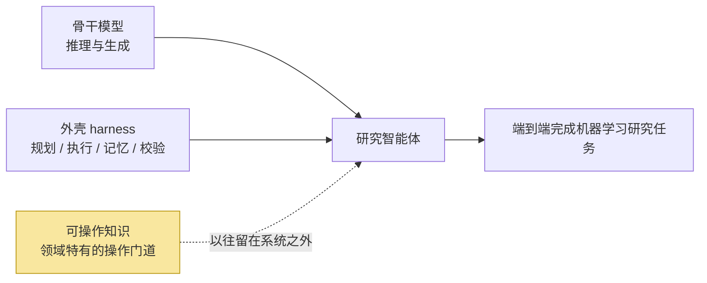
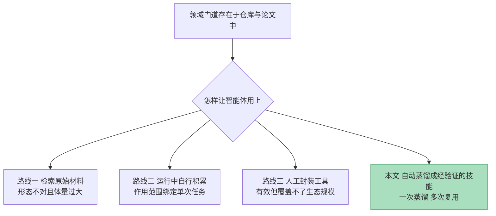
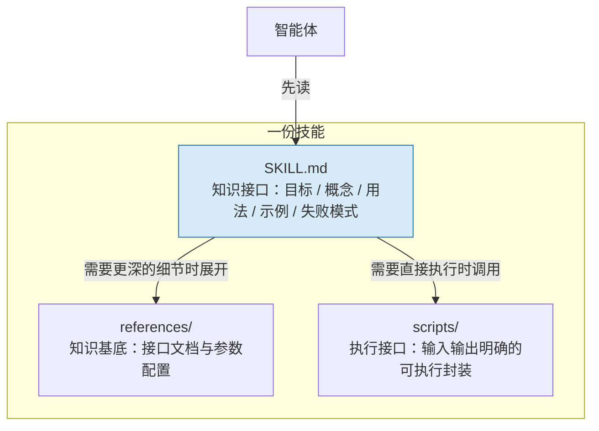
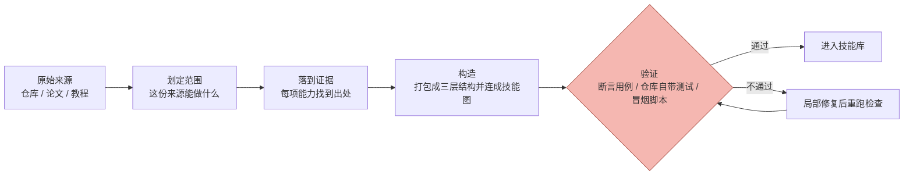
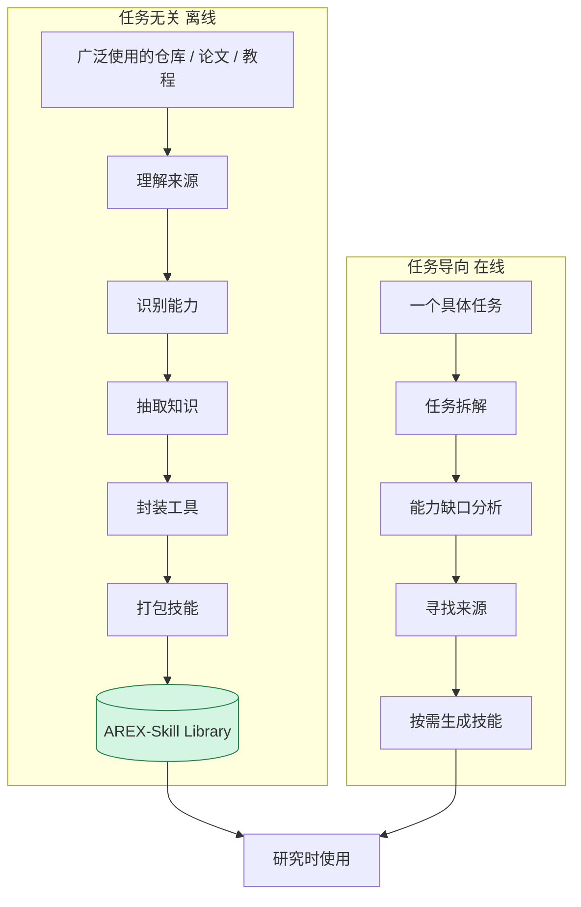
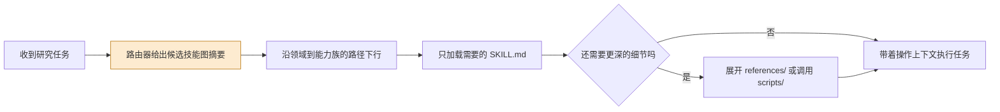

# Repo-To-Skill：把 GitHub 仓库蒸馏成给智能体使用的技能

> **原题**：Repo-To-Skill: Distilling GitHub Repositories Into AI4AI Skills
> **作者**：Jianlyu Chen, Yuyang Hu, Hongjin Qian, Jiawei Liu, Wenqing Wei, Xiaolong Chen, Defu Lian, Zhicheng Dou, Chaozhuo Li, Qiwei Ye, Zheng Liu
> **机构**：arXiv 摘要页未列出
> **年份**：2026（arXiv ID 2609.02749，2026 年 9 月 2 日提交）
> **分类**：cs.AI / cs.CL
> **链接**：https://arxiv.org/abs/2609.02749
> **精读日期**：2026-09-03

## 阅读须知

### 这篇在领域里的位置

过去两年里，让语言模型自己去做机器学习研究，已经从一个演示性的想法变成了一条有明确评测体系的技术路线。这条路线上的系统通常被称作研究智能体，它们要读题、写代码、跑实验、看结果，然后决定下一步做什么。评价它们的基准也随之成型，比较有代表性的是 MLE-bench 这类把 Kaggle 竞赛整体搬过来的任务集，以及 PaperBench 这类要求从论文复现出结果的任务集。

在这条路线上，绝大多数工作改的是两样东西中的一样。一样是模型本体，也就是所谓的骨干模型，思路是把模型本身变得更强。另一样是外壳，学界一般称之为 harness，指的是包在模型外面的那一整套规划、执行、记忆与校验机制，思路是让同一个模型在更好的组织方式下发挥得更好。

这篇论文提出的是第三样东西。作者认为骨干与外壳都到位之后，智能体仍然缺一层内容，这层内容既不属于模型的通用能力，也不属于外壳的流程设计，而是某个具体领域里「怎样才能把事情真正跑通」的门道。论文把这层内容命名为可操作知识，并且主张它可以被提前从开源仓库里蒸馏出来、固化成可复用的技能，而不必让智能体在每一次任务里从头摸索一遍。

### 读完能回答什么

读完这份笔记之后，应当能够回答下面这几个问题。

第一，作者所说的可操作知识究竟指什么，它和模型权重里已有的知识、以及检索增强生成拿回来的文档，区别在哪里。

第二，一份技能在工程上长什么样，为什么要拆成三层，以及所谓渐进披露解决的是什么问题。

第三，DisCo 的四个蒸馏阶段各自做什么，其中的验证环节为什么是这套方法能不能成立的关键。

第四，在骨干模型、外壳与预算都被固定住的前提下，只加入技能能带来多大的提升，这个提升在什么样的任务上最明显。

第五，这套做法目前的边界在哪里，作者自己承认了什么，还有哪些问题他们没有正面回答。

### 阅读前置

这份笔记预设读者熟悉语言模型的基本用法，知道什么是提示词、什么是上下文窗口，也大致了解智能体这一类系统是怎么把模型调用串成多步流程的。笔记不预设读者做过研究智能体方向的工作，也不预设读者读过 MLE-bench 或 PaperBench 的原始论文，涉及到的基准会在实验一节里逐个交代清楚。

### 缩写表

**AI4AI**（AI for AI），指人工智能系统用来服务人工智能自身研发的那一类资产。这篇论文里的技能库就属于这一类，它不是给人读的文档，而是给智能体在做研究时调用的材料。

**DisCo**，论文提出的系统名称，由蒸馏（distill）与创作（create）等词根拼合而来，指的是既能造技能、又能在研究中使用技能的那个智能体。

**AREX-Skill Library**，论文用 DisCo 造出来的技能库，规模是五千余份技能，来自一千个被广泛使用的机器学习仓库。

**harness**，中文一般译作外壳或框架，指包在骨干模型之外、负责规划、执行、记忆与校验的那一层工程结构。

**MLE-bench**，一个把七十五项 Kaggle 竞赛整体作为任务的机器学习工程基准，主要指标是 Any-Medal，即智能体的提交能拿到任意一档奖牌的比例。

**PaperBench**，一个要求智能体从论文出发复现实验结果的基准，指标是复现分数。

**FrontierCS**，一个包含一百八十八道开放式计算机科学问题的基准，这篇论文用的是它的智能体赛道。

**PassNet**，一个关于图编译器优化遍生成的基准，主要指标 AS Score 衡量生成的优化遍带来的加速效果。

**TorchInductor**，PyTorch 自带的编译后端，在 PassNet 上被当作一条参考基线。

## 一、问题

### 为什么这个问题值得做

任何写过一段时间机器学习代码的人都熟悉这样一种落差。方法本身在论文里写得很清楚，公式也不难，可是真要把它跑起来，中间横着一大堆论文不会写、也不值得写进论文的事情：这个仓库的入口脚本在哪里，配置文件里哪几个字段是必须改的，某个依赖在特定版本的显卡驱动下会静默失败，数据预处理有一个不写在文档里但所有人都在用的约定。这些东西不构成学术贡献，却决定了一次尝试是三小时跑通还是三天跑不通。

对人来说，这些门道是靠反复上手积累的，积累之后就留在了脑子里，下一次遇到同一个仓库不必重来。但对当前的研究智能体来说，情况不是这样。每一次任务开始时，智能体面对的都是一个几乎空白的起点，它必须在有限的上下文和有限的步数预算里，一边摸索这些门道一边推进任务本身。摸索失败，任务就卡在环境配置或者某个方法特有的实现细节上，而这类失败与智能体的推理能力其实没有太大关系。

有人会说，这不正是检索增强要解决的事情吗？把仓库文档检索回来喂给模型不就行了。问题在于，仓库和论文都是写给人读的，篇幅动辄数万乃至数十万词，形式上是叙述性的而不是可执行的，一次任务的上下文根本装不下，也没法直接照着做。所以真正的困难不在于知识缺席，而在于知识的形态不对：它存在，但存在的方式让智能体用不上。

这就是这篇论文要处理的缺口。作者的判断是，与其在每一次任务里让智能体现场消化原始材料，不如提前把这些材料压缩成紧凑的、经过验证的技能，一次蒸馏、多次复用。

### 缺的到底是哪一层

论文把当前研究智能体的结构写成两块：一块是骨干模型，负责推理与生成；另一块是外壳，负责把模型的输出组织成规划、执行、记忆与校验的循环。作者指出，这两块都到位之后，领域特有的门道仍然留在系统之外。

作者给这层缺失的内容取名为可操作知识，并且用一句话界定了它：区分「知道一个方法」和「能把这个方法跑成」的那部分知识。这个界定值得多读一遍，因为它同时排除了两样东西。它排除了纯粹的概念性知识，那类知识模型权重里已经有了；它也排除了通用的工程流程，那类知识属于外壳的职责。剩下的是与具体仓库、具体方法绑定的操作细节。

### 前人路线为什么不够

第一条路线是把知识留在原始材料里，用检索的方式在任务中现取。这条路的问题前面已经说过，原始材料的形态是叙述性的、面向人的，体量又大，取回来之后智能体还要自己完成一次理解与转译，而这次转译恰恰要消耗它本就紧张的预算。

第二条路线是让智能体在任务过程中自行积累经验，也就是各种形式的记忆机制。这条路的问题在于范围：积累下来的经验绑定在一次运行或者一个会话上，换一个任务往往就用不上了，于是同样的门道会被反复重新发现。

第三条路线是人工编写工具与文档，把常用操作封装成智能体可以直接调用的接口。这条路走得通，效果也好，但它的代价是人力，覆盖不了开源生态的规模。作者要做的正是把这条路自动化，同时保留它最关键的那个性质，也就是封装出来的东西是经过验证的、可以直接执行的。

## 二、方法

### 一份技能长什么样

在讲流程之前，先要讲清楚这套方法的产物。所谓技能，在这篇论文里不是一段提示词，也不是一个函数，而是一个有固定结构的目录。这个目录分成三层，每一层承担不同的职责。

最上面一层是 `SKILL.md`，论文称之为知识接口。它是智能体进入这份技能时首先读到的东西，内容包括这份技能的目标、涉及的核心概念、工具的用法、可以照抄的示例，以及已知的失败模式。这里的关键是最后一项：失败模式写进技能，意味着智能体不必亲自踩一遍坑才知道某条路走不通。

第二层是 `references/` 目录，论文称之为知识基底。它存放的是更深的材料，例如接口文档与参数配置说明。这一层不要求智能体每次都读，只有当上面那层不足以支撑当前操作时才会被展开。

第三层是 `scripts/` 目录，论文称之为执行接口。它存放的是可执行的封装脚本，输入输出都有明确定义。有了这一层，智能体在很多情况下不需要自己从零写代码，直接调用即可。

这样的三层结构服务于一个具体目的，论文把它叫做渐进披露。智能体先读最上面那层的摘要，判断这份技能是不是它要找的，如果是，再按需往下展开，从而避免把整份材料一次性塞进上下文。

多份相关的技能之间还会连成图，论文称之为技能图。图上的边有三种含义：路由边表示从一个入口可以导向哪些技能，依赖边表示一份技能的使用需要另一份技能先就位，组合边表示若干技能可以被拼起来完成一件更大的事。这些边的作用是让智能体在图上按需游走，而不必把整张图读完。

### 蒸馏的四个阶段

DisCo 把从一份原始材料到一份可用技能的过程写成四步，论文里的形式化写法是从来源出发，先划定范围，再落到证据，然后构造，最后验证。

第一步是划定范围。系统先判断这份来源里有哪些值得抽取的能力，也就是回答「这个仓库到底能做什么」。这一步决定了后面几步的工作面，划得太宽会产出大量无人使用的技能，划得太窄则会漏掉仓库真正的核心用途。

第二步是落到证据。对上一步识别出的每一项能力，系统去原始材料里找支撑它的具体内容，例如相应的模块、示例脚本或者测试用例。这一步的意义在于避免凭空生成：技能里写的每一条操作都应当在来源里有对应的出处。

第三步是构造。系统把这些能力打包成前面描述的三层结构，并且把彼此相关的技能连成技能图。到这一步为止，产物只是候选，还不能进库。

第四步是验证，这是整条流水线上最关键的一环。论文的表述很直接：没有任何一份技能可以仅凭它的来源就被接纳。验证的手段包括带断言的测试用例，以及仓库自带的示例、测试、命令行检查、微型固定装置检查和冒烟脚本。如果验证不通过，系统会做局部修复，然后重跑相关的检查；无法弥合的差距会被记录下来，随技能一并保存。

### 两种蒸馏形态

同一条流水线被用在两种不同的场合，论文把它们称作任务无关的蒸馏与任务导向的蒸馏。

任务无关的蒸馏是离线进行的。系统事先扫过开源生态里被广泛使用的仓库、论文与教程，把它们变成技能存进库里，此时并不知道将来会遇到什么任务。这一路的产物就是 AREX-Skill Library。

任务导向的蒸馏则是在线的，由具体任务触发。系统先把任务拆解开，分析当前手上缺哪些能力，再去寻找能补上这些能力的来源，最后按需生成技能。这一路解决的是库里恰好没有覆盖到的情形。

### 技能库是怎么建起来的

仓库的选取标准是开源可见度与实际使用情况，GitHub 星标数是参与筛选的信号之一。最终这一千个仓库被组织进一棵两级的树，上层是二十个领域，下层是一百七十八个能力族。

这棵树本身也是自动生成的。系统先根据仓库描述提出一个分类方案，然后在一百个规模为十个仓库的稳定批次上评估这个方案，再依据确定性拟合度与各能力族的负载统计来修订它。之所以要这样反复，是因为分类树同时承担着检索时的路由职责，分得不好会直接影响智能体能不能找到该找的技能。

每个仓库可以被挂到多个位置，每次挂载都要附上理由、证据与置信度。论文特别说明了四种会被拒绝的匹配：仅凭关键词命中的、仅凭依赖关系命中的、只是可选集成关系的，以及只在示例里出现过的。这四条规则的共同目的是防止分类被表面相似性污染。

除了仓库这一路，库里还有另外两块。一块是从论文蒸馏出来的技能，共六百三十六份，来自一百五十三篇论文，这些论文是围绕 PaperBench 的目标选出来的。另一块是任务导向生成的技能图，分别对应 MLE-bench 的七十五项竞赛、FrontierCS 的一百八十八道题，以及 PassNet 的一张基准级别的图。

构造成本方面，论文给出的数字是平均每个仓库约四十美元，使用的模型是 GPT-5.5 与 GPT-5.6-sol，并且开到了较高的推理强度。

### 研究时怎么用

到了实际做研究的时候，智能体并不会把技能库整个读一遍。流程是这样的：路由器先给出候选技能图的摘要，智能体据此沿着从领域到能力族的路径往下走，最后只加载真正需要的那几份技能、参考资料或者脚本。

技能图上的链接在这里发挥作用，它让智能体可以在图上定向移动，而不必读取图中不相关的部分。论文强调了一点：技能图的设计与外壳的设计是分开的，也就是说这套东西是加在现有智能体上的一层，而不是要求换一套新的智能体架构。

## 三、实验

### 评测怎么设计的

这一节的设计有一个贯穿始终的原则，理解了它才能读懂后面的数字：骨干模型、研究外壳与下游执行预算三者全部固定，唯一变化的是有没有技能。骨干模型统一是 GPT-5.5 Codex。这样做的目的是把提升干净地归因到技能这一层，而不是归因到换了更强的模型或者更好的流程。

需要注意的是，技能的构造预算与任务的执行预算是分开计算的。也就是说造库的花费不算进比较里，比较的是同样的执行预算下有没有技能的差别。这个安排对作者有利，读的时候应当记住。

四个基准的设置如下。

| 基准 | 规模与设置 | 主要指标 |
| --- | --- | --- |
| MLE-bench | 完整七十五项竞赛，分低、中、高三档难度 | Any-Medal（%） |
| PaperBench | 二十篇目标论文，技能取自其引用的相关工作 | 复现分数（%） |
| FrontierCS 智能体赛道 | 一百八十八道开放式题目，每题五小时，两核 CPU 与四 GiB 内存 | 平均分，以及每题的步数、工具调用数与词元数 |
| PassNet | 图编译器优化遍生成，两百个样本 | AS Score（主），几何平均加速比，正确率，Fast_1 |

### 主要结果

四个基准上的对照结果如下表。

| 基准 | 无技能 | 有技能 | 绝对提升 | 相对提升 |
| --- | --- | --- | --- | --- |
| MLE-bench（Any-Medal） | 31.11% | 72.89% | +41.78 个百分点 | +134.3% |
| PaperBench（复现分数） | 29.45% | 39.59% | +10.14 个百分点 | +34.4% |
| FrontierCS（平均分） | 70.63 | 77.14 | +6.51 | +9.22% |
| PassNet（AS Score） | 1.343 | 1.5313 | +0.1883 | +14.0% |

MLE-bench 上的幅度最大，从三成出头涨到七成以上。更值得注意的是难度分层的结果：高难度那一档的相对提升达到百分之三百六十六点八，远高于整体。作者据此提出了一个判断，即任务越难，可操作知识的价值越大。这个判断在直觉上说得通，因为简单任务往往不需要什么门道，难任务才会卡在实现细节上。

横向比较也给出了一个有意思的对照。加了技能的 Codex 拿到百分之七十二点八九，超过了当时最强的公开基线 Famou-Agent 2.0 的百分之六十四点四四；而同一个 Codex 不加技能只有百分之三十一点一一。换句话说，一个原本远逊于最强基线的智能体，仅凭加上技能这一层就反超了它。

PaperBench 上的提升较小，从二十九点四五涨到三十九点五九。绝对增益最大的是基线本来就很低的那些任务，例如代号 rice 的任务从七点九四涨到四十八点五一。这一点与 MLE-bench 上的难度分层结论方向一致。

FrontierCS 上的整体提升是百分之九点二二，看起来不大，但拆开来看结构很清楚。一百八十八道题里有七十四道被技能改善，六十六道没有变化。提升集中在原本得分低于五十分的四十七道题上，这批题的平均分从十九点四三升到四十五点九九。另一个值得记的数字与效率有关：加了技能的 Codex 得分七十七点一四，高于 Claude Code 的七十四点五，同时工具调用数少了百分之二十四点五到二十七点九，步数少了百分之三十三点八到七十五点一。也就是说技能不只是让结果更好，还让过程更短。

PassNet 上的 AS Score 从一点三四三升到一点五三一三，超过了 TorchInductor 的一点四一九。这个基准还给出了一个特别直观的数字：正确率从百分之八十一点三五升到百分之九十点七六，彻底失败的样本从十四个降到五个，减少了将近三分之二。

### 反直觉的地方

有一个结果与「技能总是有帮助」的预期相反：PaperBench 上有两项任务在加了技能之后反而退步了，分别是代号 sample-specific-masks 与 stay-on-topic 的任务。作者对此的解释是检索精度出了问题，也就是取回来的技能内容与任务并不匹配，反而干扰了智能体本来会自己找到的做法。

这个现象本身比它的绝对数值更重要，因为它说明这套方法的收益并不是无条件的。当检索命中的时候，技能提供的是省下摸索时间的捷径；当检索没命中的时候，技能提供的是一条错误的路径，而智能体缺少判断这条路径是否适用的机制。

另一个需要留意的是没有出现的东西。论文没有做传统意义上的部件消融，也就是说它没有回答四个蒸馏阶段中哪一个贡献最大，也没有回答三层技能结构中去掉哪一层会损失多少。全篇的对照方式是有技能与无技能的整体比较，加上与公开榜单基线的横向比较。

## 四、局限

### 作者自己承认的

作者明确承认了检索精度的问题。前面提到的两项退步任务被归因于检索精度不足，作者进一步把它描述成检索上的精确率与召回率之间存在一个不大不小的权衡：为了尽可能覆盖到有用的技能，就难免会取回一些不相关的；而一旦取回不相关的，就有干扰智能体自主判断的风险。

针对这个问题作者提出了两个方向，一是改进路由，二是加一条显式的回退机制，让智能体在发现取回的技能与任务匹配度差时能够退回到无技能的推理模式。这两个方向都还停留在设想阶段，论文里没有实现。

### 读完之后能看出来的

第一是成本。平均每个仓库约四十美元，一千个仓库意味着四万美元量级的构造开销，而且这还只是仓库那一路，论文导出的六百三十六份技能与三个基准的任务导向技能图都没有计入这个数字。论文没有披露完整的构造总账。这个量级对工业实验室不算什么，但它意味着这套方法目前不是一个个人或小团队能够复现的东西。

第二是与评测的耦合。从论文蒸馏出的六百三十六份技能，其来源是围绕 PaperBench 的目标论文选出来的；三个任务导向的技能图分别对应三个基准。也就是说技能库有相当一部分是知道要考什么之后才建的。作者把构造预算与执行预算分开计算，这在方法论上说得过去，但它使得这些数字更接近「针对这批任务做足准备之后能到什么程度」，而不是「面对一批全新任务能到什么程度」。论文没有报告在完全未见过的任务分布上的结果。

第三是时效性。技能是从某一时刻的仓库状态蒸馏出来的，而开源仓库会持续演进，接口会变、默认参数会变、依赖会变。一份在蒸馏时通过了验证的技能，半年之后可能会指向一个已经不存在的参数。论文的验证环节保证的是入库时刻的正确性，没有讨论此后如何维护。

第四是评测本身的可比性。四个基准的提升幅度差异很大，从 MLE-bench 的百分之一百三十四到 FrontierCS 的百分之九点二二，跨度接近十五倍。论文用任务难度来解释这个差异，但另一个同样合理的解释是各基准与技能库覆盖面的重合程度不同。要区分这两种解释，需要在同一批任务上做覆盖度的控制实验，而论文没有做。

## 一句话

把开源仓库离线蒸馏成经过验证的可执行技能，在骨干与预算不变的前提下让研究智能体的成绩提升数成到一倍以上。
