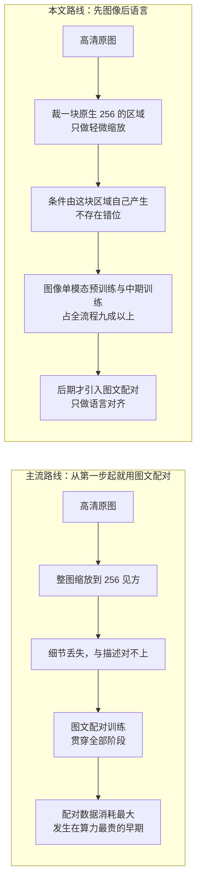
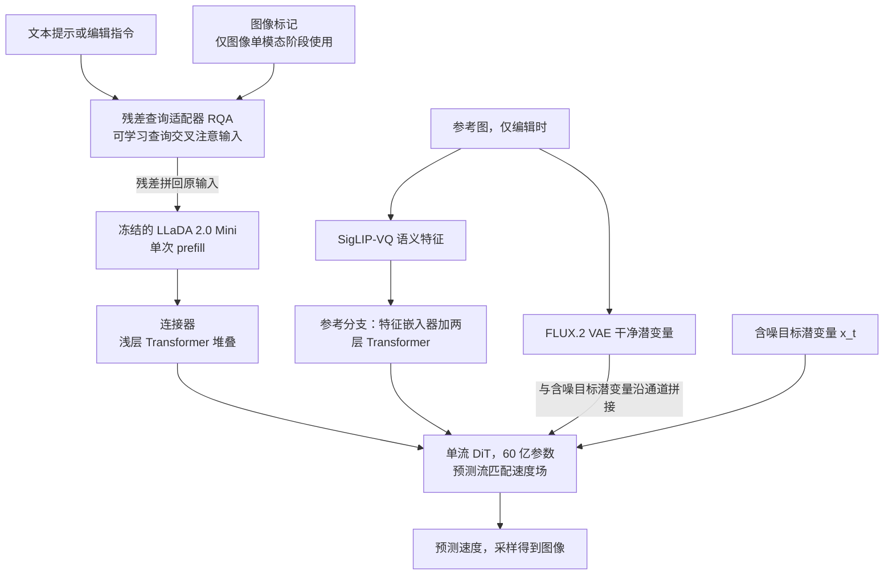
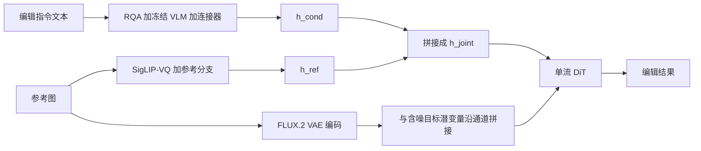
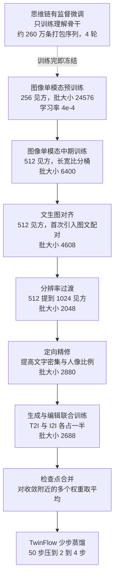
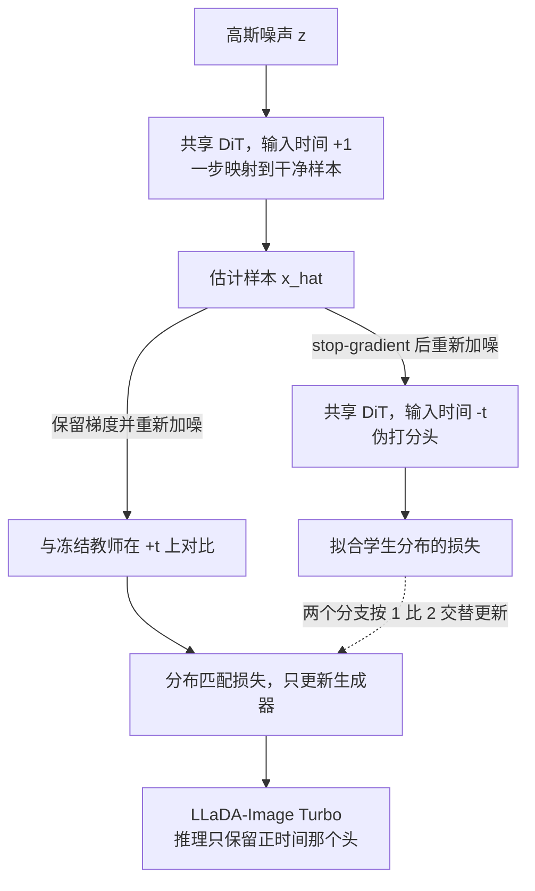

# LLaDA-Image：用完全公开的配方训练一个强图像生成器

> **原题**：LLaDA-Image: Building Strong Image Generators with Fully Open Training Recipes
> **作者**：Chuyan Chen, Haoxing Chen, Kun Chen, Zhenglin Cheng, Long Cui, Ruishan Fang, Zhangxuan Gu, Zhicheng Huang, Zhenzhong Lan, Yuanting Lei, Haoquan Li, Jianguo Li, Rongchuan Li, Sidu Li, Tao Lin, Deyuan Liu, Jiacheng Liu, Lin Liu, Yuxuan Lou, Zhisheng Lu, Yuxin Ma, Shuheng Shen, Peng Sun, Chaoyang Wang, Hongjun Wang, Xiaomei Wang, Yongxin Wang, Chengzhang Wu, Hongru Wu, Jun Xie（按姓氏字母序）
> **机构**：AGI Research Center, Inclusion AI
> **年份**：2026（arxiv ID 2609.03796，提交于 2026 年 9 月 3 日）
> **分类**：cs.CV / cs.AI
> **链接**：https://arxiv.org/abs/2609.03796
> **精读日期**：2026-09-04

## 阅读须知

### 这篇在领域里的位置

文本到图像生成这个方向，过去四年的主线可以粗略地概括成一句话：把扩散模型从像素空间搬到潜空间，再把去噪网络从卷积结构换成 Transformer，然后不断加大数据与参数规模。2022 年的潜空间扩散模型确立了「先用变分自编码器把图像压成低维潜变量，再在潜空间里做扩散」这个基本盘，2023 年的 DiT 用 Transformer 替换了原本的 U-Net，2024 年的整流流与流匹配把训练目标从逐步去噪简化成一条从噪声到数据的直线速度场。到 2025 年前后，开源社区已经有了一批质量相当不错的模型，闭源那一侧则跑得更远。

在这条主线上，有一个几乎没有被动摇的默认假设：训练一个图像生成器，从第一步起就需要大量的图文配对数据。模型要学会画一只猫，前提是有人（或者某个视觉语言模型）先写下「一只猫」这三个字。这个假设带来的代价非常实际，配对数据昂贵、标注有损、而且在计算量最大的早期阶段消耗最多。

这篇论文所在的位置，正是对这个假设的一次系统性反驳。它属于 2026 年出现的一小类工作，主张视觉先验的学习与语言对齐这两件事应该被拆开，前者完全可以只靠图像本身完成，语言只在后期介入。与它同源的还有同一机构的 LLaDA 2.0 Uni 与被它直接引用的 IOMM。这篇的贡献不在于提出某个全新的算子，而在于把这条路线从一个想法推到一个完整可复现的工业级配方，并且把权重、代码与每个阶段的超参全部放了出来。

### 读完能回答什么

读完这份笔记之后，应当能回答下面这几个问题：

1. 为什么图像生成的预训练阶段可以完全不用图文配对数据，模型此时的监督信号究竟从哪里来。
2. 「掩码自条件」这个技巧具体在防止什么退化，如果不加它训练会崩成什么样子。
3. 为什么把一个扩散语言模型而不是 CLIP 或者 T5 那样的文本编码器放在条件通路上，这个选择带来了什么。
4. 图像编辑时参考图为什么要绕开视觉语言模型，直接从两条独立通路进入生成器。
5. TwinFlow 用「带符号的时间」这一个技巧省掉了什么，为什么它能把五十步的采样压到两到四步。
6. 一个宣称「真实数据占优带来更强真实感」的配方，为什么在真实感这个评测维度上反而是它最弱的一项。

### 阅读前置

这份笔记假定读者熟悉 Transformer 的基本结构与 PyTorch 的张量运算，知道扩散模型大致是「给图像加噪声再学着把噪声去掉」这回事，也大致听说过潜空间扩散与变分自编码器。但不假定读者专门做过底层视觉、流匹配或者模型蒸馏，凡是涉及这三块的地方都会先铺垫再展开。论文本身是一份技术报告而不是会议论文，因此它的重点是工程决策与配方，而不是理论证明。

### 首次出现的缩写表

- **DiT**（Diffusion Transformer，扩散 Transformer）：用 Transformer 作为骨干网络的扩散模型，取代早期的 U-Net 卷积结构。
- **dLLM**（diffusion Large Language Model，扩散大语言模型）：不按从左到右逐词生成，而是像图像扩散那样，从一串掩码标记出发并行地把内容填出来的语言模型。
- **VLM**（Vision-Language Model，视觉语言模型）：能同时读图和读文字的模型。
- **VAE**（Variational Autoencoder，变分自编码器）：把图像压缩成低维潜变量再还原回去的编码解码器，扩散过程实际发生在它的潜空间里。
- **RQA**（Residual Query Adapter，残差查询适配器）：一组可学习的查询标记，通过交叉注意力从输入里抽取信息，再以残差方式附加回输入序列。
- **T2I / I2I**（Text-to-Image / Image-to-Image）：文生图与图生图，后者在这篇里特指按指令编辑参考图。
- **SFT**（Supervised Fine-tuning，有监督微调）。
- **CoT**（Chain-of-Thought，思维链）：让模型在给出答案之前先写出一段推理过程。
- **PT / MT**（Pre-training / Mid-training，预训练 / 中期训练）。
- **DMD**（Distribution Matching Distillation，分布匹配蒸馏）：一类把多步扩散模型压成少步生成器的蒸馏方法，做法是让学生分布与教师分布的散度最小。
- **EMA**（Exponential Moving Average，指数滑动平均）：训练过程中对参数做滑动平均，用平均后的权重做推理通常更稳。
- **NED**（Normalized Edit Distance，归一化编辑距离）：衡量生成的文字与目标文字有多接近。
- **GSC / GPQ / GO**：GEdit-Bench 的三个分项，分别是语义一致性与指令遵循、感知质量与自然度、以及二者的综合评分。

## 一、问题

一个图像生成模型要做的事情，在今天已经远远不止「按一句话画一张图」。它需要看懂复杂的、多语言的指令，画出经得起放大看的照片级内容，在编辑一张已有图片的时候不破坏不该动的部分，把画面里的文字一个字不错地写出来，并且在可以承受的推理成本下跑完这一切。闭源系统在这几件事上已经做得相当好，但它们的数据、模型与训练配方基本不对外。

对开源模型来说，问题因此不只是「生成质量能不能追上」。一个真正有用的开源系统，还需要同时满足另外三个条件：数据预算要够得着，大规模训练要稳得住，部署要跑得动。这三个条件与生成质量之间不是并列关系，而是互相牵制的。

这些牵制的根源可以拆成三处。第一处在数据。当前主流的训练范式从一开始就把视觉先验的学习与语言对齐绑在一起，也就是说，计算量最大的那几个阶段全程都在消耗图文配对数据。而图文配对既贵又有损：一段描述文字终究只是图像的一个投影，画面里的很多信息它根本没提；更麻烦的是，在低分辨率下训练时，为了让整张图与整段描述对得上，必须把整张高清图压到训练分辨率，而描述里提到的细节可能在这一压之下就消失了，于是图像与文字之间出现了一个本不该有的错位。

第二处在数据的另一面。合成的图文对可以让早期收敛快很多，因为它的描述天然与图像严丝合缝。但合成数据里的伪影会被模型一并学走，混合比例一旦偏高，长期的真实感会被拉低。这是一个短期与长期取向相反的权衡。

第三处在架构与部署。一个统一模型既要把多模态理解接到生成上，又要在编辑时保住参考图的证据；而扩散模型天生的长采样轨迹在部署时必须被压缩，压缩的过程还不能明显掉质量。这几件事没办法各自单独解决，必须在监督信号、架构、训练流程与蒸馏这四层上一起设计。

下面这张图把两条路线的差别摆在一起看。上面一条是主流做法，下面一条是这篇采取的做法。

论文把这个问题落成一个可验证的技术判断：图像本身已经包含了监督它自己生成所需要的全部高层语义，一个冻结的视觉语言模型可以把这些语义抽出来当作自条件信号，因此大规模的视觉先验学习根本不需要任何配对描述。剩下的工作，是把这个判断变成一条从零训练到可部署的完整路径。

## 二、方法

### 三个部件与它们的分工

LLaDA-Image 由三个部件组成，分工非常干净：一个负责理解，一个负责翻译，一个负责画。

负责理解的是一个视觉语言模型，它建立在 LLaDA 2.0 Mini 这个扩散语言模型骨干之上，自带 SigLIP-VQ 视觉编码器。这里需要先说明为什么是扩散语言模型而不是别的。传统做法是把提示词丢给 CLIP 或者 T5 这样的文本编码器，拿回一组静态的嵌入向量，这组向量此后不再变化，也不具备任何推理能力。而一个视觉语言模型提供的是一个统一的接口，它可以同时处理文字、图像与结构化的推理轨迹，在需要的时候真的能对着输入做一轮多模态推理。这个部件在生成训练的全程都是冻结的，不更新任何参数。

负责画的是一个六十亿参数的单流 DiT，从零开始训练，采用 FLUX.2 的 VAE 作为潜空间编解码器。所谓单流，是指条件标记与图像标记被拼进同一条序列，穿过同一叠 Transformer 层，每一层里语义条件都直接参与对视觉标记的自注意力计算。与之相对的双流架构会为条件和图像各自维护一条通路，只在特定位置交互。

夹在两者中间的是连接器，它要解决的是一个很实际的错配：视觉语言模型的隐状态活在一个为语义理解优化的表示空间里，特征维度与几何结构都与 DiT 需要的条件空间对不上。

RQA 这个模块的动机值得单独说清楚。冻结的视觉语言模型并不会主动把生成所需要的细粒度视觉先验暴露在隐状态里，它的表示是为理解任务优化的。要把这些信息挖出来，最直接的办法是把整个模型解冻去微调，但那样既贵又会损伤它原有的理解能力。RQA 的做法是引入一组可学习的查询标记 $q_0$，让它们先对完整的多模态输入序列 $c$ 做一次交叉注意力：

$$q_{res} = q_\psi(q_0, c)$$

这里 $\psi$ 是 RQA 自己的参数。关键在于产出的 $q_{res}$ 不是去替换原输入，而是被追加到 $c$ 的后面，整条增广序列再送进冻结的骨干做一次 prefill：

$$h_{vlm} = g(\mathrm{concat}(c, q_{res}))$$

换句话说，这组查询扮演的是一段被学出来的提示词，它的作用是诱导一个不能被修改的模型主动吐出对生成有用的东西。随后连接器 $c_\phi$ 把 $h_{vlm}$ 投影到 DiT 的条件空间，得到最终的条件 $h_{cond}$。

### 编辑时参考图为什么绕开理解模块

这是整个架构里最反直觉的一处设计。做图像编辑的时候，参考图不进视觉语言模型，视觉语言模型只看编辑指令那句话。参考图走的是两条完全独立的通路，都直接汇入 DiT。

第一条是语义通路。参考图先经过 SigLIP-VQ 拿到语义特征，再由一个 DiT 专属的参考分支处理，这个分支由一个特征嵌入器加两层 Transformer 构成，作用是把 SigLIP-VQ 的表示搬到 DiT 的标记空间里：

$$f_{ref} = v(y_{ref}), \quad h_{ref} = b_\omega(f_{ref})$$

第二条是像素通路。同一张干净的参考图再用 FLUX.2 VAE 编码一次，得到的潜变量与含噪的目标潜变量沿通道拼在一起，一同送进 DiT 的输入嵌入层。

两条通路是互补的。语义特征告诉模型参考图里有什么，但它无法保住那些本来就不该改动的区域在像素层面的样子；干净的 VAE 潜变量则提供了原生的像素证据，让背景、纹理与身份在编辑之后仍然对得上。把参考图挡在理解模块之外的好处是，视觉语言模型始终只承担一件事，也就是理解指令，它的通路在文生图与编辑之间完全共用，因此不需要为编辑另起一个模型分支。

### 图像单模态预训练：监督信号从哪里来

这是全文最核心的一步，也是「不需要配对数据」这个主张真正落地的地方。

做法的出发点是一个观察：一张图片本身就携带着监督它自己被生成出来所需要的高层语义。既然如此，就让冻结的视觉语言模型去读这张图，把读出来的语义当作条件，再让 DiT 以这个条件为输入把同一张图画出来。整个过程不需要任何人写下的描述。

但这里立刻会撞上一个显而易见的漏洞。如果把图像的全部特征都作为条件交给 DiT，那么条件里已经包含了一份几乎完整的答案，模型只要学会把条件原样搬到输出就能把损失降到很低，这就退化成了一个恒等映射，什么视觉结构都没学到。

论文的解法叫掩码自条件。图像先经过冻结的 SigLIP-VQ 编码成一串块特征 $c_{img} = v(y) \in \mathbb{R}^{N \times D}$，其中 $N$ 是图像标记数、$D$ 是特征维度。这串特征会与一段固定的辅助提示词配对，那段提示词的内容大致是「生成一张与参考图相同的图像」。然后定义一个图像标记掩码率 $\rho_{img}$，按保留概率 $1 - \rho_{img}$ 采样一个二值掩码 $m$：

$$\tilde{c}_{img} = c_{img} \odot m, \quad c = \mathrm{concat}(c_{aux}, \tilde{c}_{img})$$

这一步把预训练从「稠密重建」变成了「由稀疏到稠密的预测」。生成器只能看到一部分图像块，它必须从这些可见的块推断出缺失的内容，于是被迫去学习上下文关系与构图结构，而不是学会抄答案。

训练目标用的是流匹配。为了避免读者在这里卡住，先说清楚流匹配在做什么：它不像早期扩散那样把去噪拆成上千个小步骤各自预测噪声，而是在干净数据 $x$ 与高斯噪声 $z$ 之间画一条直线，让模型直接预测这条直线的速度方向。构造插值 $x_t = (1-t)x + tz$，训练目标是

$$\mathcal{L}_{FM}(\theta, \phi, \psi) = \mathbb{E}\left[\left\| F_\theta(x_t, t, h_{cond}) - (z - x) \right\|_2^2\right]$$

其中 $z - x$ 正是那条直线的恒定速度。这个阶段只更新 DiT 的 $\theta$、RQA 的 $\psi$ 与连接器的 $\phi$ 三组参数，视觉编码器与语言骨干全程冻结。

与掩码自条件配套的还有一个分辨率处理上的技巧，论文称之为分辨率感知采样。传统图文配对训练必须把整张图缩到训练分辨率，因为描述说的是整张图。而图像单模态训练没有这个约束，条件本来就是从被采样的那一块区域提取的。于是这里的做法变成：从原图里随机裁一块，这块区域的原生分辨率本身就是 256 见方或者略大一点，然后只做很轻的缩放送进训练。同样是 256 见方的训练样本，这样得到的是真实的局部细节，而不是一张被压扁的全图。

### 五个阶段与它们的衔接

这个课程表的设计原则是每次只改变一个变量。从 256 见方的图像单模态训练直接跳到高分辨率图文配对训练，会同时改掉空间分布与监督来源两件事，训练体制的突变没有必要。中期训练的作用就是把这两件事拆开：先让模型在熟悉的图像自条件下适应 512 见方的像素预算，之后才在有监督微调阶段切换到文字监督。

理解骨干的思维链微调是一条独立支线，它在生成训练开始之前完成，之后就被冻结。这一步用的是块扩散的形式，块大小 32，对每个被监督的区域按 $\rho = \cos(r\pi/2)$ 采一个掩码率，其中 $r$ 服从零到一的均匀分布。有一个细节颇有巧思：因为一次掩码只覆盖回答的一部分，所以每个批次被消费两次，一次用采到的掩码，一次用它的补集，作为两个独立的优化步。这样每个回答标记都在这一对里被监督到，而每次前向仍然读到的是一个部分干净的上下文。数据按生成、理解、纯文本九比九比二混合。

从有监督微调开始，时间步的采样从均匀分布换成了对数正态分布。理由是均匀采样给所有噪声水平分配同样多的训练样本，但这些噪声水平在推理时的重要程度并不相同。在这篇的插值约定下，$t$ 越大噪声越重，而高噪声区恰恰是最脆弱的：此时图像结构尚未成形，去噪轨迹早期犯的错会一路传播到最后。低噪声区则相反，大部分内容已经稳定，剩下的只是有限的修正。于是采样方式改为

$$\epsilon \sim \mathcal{N}(0,1), \quad t = \mathrm{sigmoid}(P_{mean} + P_{std}\,\epsilon)$$

取 $P_{mean} = 0.8$、$P_{std} = 0.8$，把更多概率质量推向大 $t$ 一侧，同时保留对整条轨迹的覆盖。

编辑训练采用文生图与编辑一比一的混合，而不是单独在编辑数据上继续训练。原因是编辑数据的分布比大规模文生图语料窄得多，只在它上面训会让模型过拟合编辑目标、削弱开放式生成质量、并且遗忘掉前面阶段积累的视觉先验。把文生图样本混进每一步，起到的是能力回放的作用。

### TwinFlow：用正负时间在一个骨干里装两个角色

蒸馏这一步要解决的问题是，训练好的模型采样需要五十步，部署时希望降到两到四步。这一类方法的主流是分布匹配蒸馏，它的思路是让学生分布与目标分布之间的反向 KL 散度最小。计算这个散度需要两个打分模型：一个冻结的真实打分模型，来自原始的多步教师；一个在线的伪打分模型，必须持续追踪学生那个不断变化的分布。传统实现要为伪打分单独开一个网络。

TwinFlow 的技巧是用时间的符号来区分角色。正的时间 $+t \in [0,1]$ 表示这次前向是生成器角色，负的时间 $-t \in [-1,0]$ 表示这次是伪打分角色，两者共用同一个 DiT 骨干。符号在这里不参与任何数值计算，它纯粹是一个角色指示器。

具体地，从噪声出发的一步映射写作 $\hat{x} = z - F_\theta(z, +1, h_{cond})$，因为在流匹配的约定下模型预测的正是 $z - x$。伪打分分支把这个样本切断梯度后重新加噪，得到 $\tilde{x}_t = (1-t)\,\mathrm{sg}(\hat{x}) + t z'$，然后在负时间上拟合；分布匹配分支则保留梯度重新加噪，把冻结教师在 $+t$ 上的输出与自己在 $-t$ 上的输出转换成两个打分，取它们的差与样本做内积作为损失。

实现上有三个选择值得记。其一，骨干上挂了两个输出头，伪打分头与分布匹配头，推理时只保留后者，因此这套辅助结构不带来任何推理开销。其二，用四步反向模拟来对齐训练输入与学生真实的推理轨迹。其三，生成器与伪打分分支按一比二的节奏更新，而不是原始 DMD2 的一比五，这减少了伪打分的更新次数从而提高训练效率。蒸馏完成之后还接了一轮基于 TBSM 的强化微调。

### 数据配方

数据侧的数字是这篇最容易被引用的部分。整条图像生成训练流程共约两亿两千万个样本，其中百分之九十八是真实图像，图像单模态训练占全部样本的九成以上，而在引入配对数据的有监督微调阶段，真实图像的比例始终保持在百分之七十以上。

筛选分三道。元数据筛选只保留总像素超过 1024 见方、且文件大小与像素数之比不低于每像素 0.15 字节的图片，后一个条件用来挡掉被过度压缩的图。美学筛选用 ArtiMuse 打分，低于 60 的丢掉。质量筛选用 DeQA-Score，低于 4.0 的丢掉。

描述文字由 Qwen3.6-35B-A3B 与 Qwen3-VL-235B-A22B-Instruct 两个模型仅根据图像内容生成，要求忠实完整地描述可见的主体、属性、动作、空间关系、场景与视觉风格，并把画面里的文字按原语言原拼写转录下来。生成之后还要过一道一致性检查，由 Qwen3.6-35B-A3B 把描述与原图逐条比对，凡是幻觉出物体、属性、关系或文字的，以及转录错误的，一律剔除。

有监督微调阶段的内容分布是：人物百分之三十七点二，自然百分之二十六点六，设计百分之二十六点四，合成内容百分之九点九。再往下拆，单人肖像一项就占了百分之二十五点二，是最大的单一类目。

论文把四条配方结论单独用方框标了出来，这里一并记下：其一，把 DiT 里所有归一化层换成无参数的 RMSNorm，能明显改善长训练周期下的优化稳定性；其二，真实的图像单模态数据可以在没有配对描述的情况下支撑起大规模的视觉先验学习；其三，预训练根本不需要大规模图文配对，图像本身的监督就够；其四，相比以合成数据为主的配方，真实数据占优的配方在标准评测上早期收敛更慢，但训练足够久之后，生成图像的真实感明显更强，能力上限也更高。整条生成训练线全程使用 Muon 优化器。

## 三、实验

### 主结果

主评测用的是 Qwen-Image-Bench，一个面向创作者的基准，用一千条分层采样的提示词考察五个维度：视觉质量、美学、提示词对齐、真实世界保真度、创意生成。它同时有英文和中文两条赛道，因此可以看出一个模型是不是只在单一语言分布上做了特化。

| 模型 | 类型 | 英文赛道总分 | 中文赛道总分 |
|---|---|---|---|
| GPT-Image 2 | 闭源 | 65.23 | 64.69 |
| Nano-Banana 2.0 | 闭源 | 59.59 | 59.82 |
| FLUX.2 Max | 闭源 | 56.14 | 55.33 |
| **LLaDA-Image** | 开源 | **53.53** | **53.38** |
| Z-Image Turbo | 开源 | 51.66 | 52.71 |
| Boogu-Image 0.1 Turbo | 开源 | 51.61 | 51.53 |
| Qwen-Image 2512 | 开源 | 51.32 | 52.06 |
| LLaDA-Image Turbo | 开源 | 50.98 | 50.27 |

在开源这一档里，它在两条赛道上都排第一，英文比次优的 Z-Image Turbo 高 1.87 分，中文高 0.67 分，而且这个成绩是在不做提示词增强、不开思维链、不用任何测试时重写流程的标准推理设置下拿到的。分维度看，质量、美学、对齐三项在两种语言下都是开源第一，英文赛道的创意生成也是第一。

需要同时看清的是与闭源的差距。GPT-Image 2 的 65.23 比它高出将近十二分，这个差距远大于开源模型彼此之间的差距。

### 文字渲染

文字渲染分两个基准看。LongText-Bench 考察长串文字能不能写得清楚正确，它拿到英文 0.923、中文 0.913，两种语言之间的差只有一个百分点，说明双语能力是平衡的，但绝对分数低于专门做文字渲染的模型，Qwen-Image 2512 在这两项上是 0.956 与 0.965。

CVTG-2K 面向的是广告、海报、表情包、街景这类实际场景，每条提示词包含两到五个文字区域。它在这里拿到平均词准确率 0.875，排第二，归一化编辑距离 0.945，CLIPScore 0.818。更值得注意的是稳定性：词准确率从两区域的 0.892 降到五区域的 0.857，只掉了三个多百分点，衰减比多数对手平缓。

### 两个诊断基准与一处反常

GenEval 与 DPG-Bench 这两个老基准，论文明确表示不把它们当作主要证据，理由是它们的排名会与人类偏好显著背离，而且分数已经趋于饱和，细微差别难以解释。它们被列出来只是为了与既有文献衔接。

即便如此，GenEval 上有一个结果值得单独拎出来。LLaDA-Image 总分 0.85，其中单物体 1.00、双物体 0.98、属性绑定 0.84 都是并列最高一档，唯独计数只有 0.53，把总分整个拖了下来。它的 Turbo 版本在计数上更低，只有 0.42。一个能把双物体做到 0.98 的模型在计数上掉到 0.53，说明这不是泛泛的组合能力不足，而是一个相当具体的短板。

另一处反常在 DPG-Bench：蒸馏后的 Turbo 拿到 88.55，反而高于基础模型的 87.48。蒸馏通常只会掉分不会涨分，这个反向的差距更可能反映的是基准本身的噪声，也从侧面支持了论文不把它当作主要依据的判断。

### 图像编辑

编辑用 GEdit-Bench，包含 606 个真实编辑案例，覆盖十一个任务类别，分项评的是语义一致性与指令遵循、感知质量与自然度，以及二者的综合。

| 模型 | 英文 GSC | 英文 GPQ | 英文总分 | 中文总分 |
|---|---|---|---|---|
| SenseNova U1.5 Preview | 未报告 | 未报告 | 8.172 | 8.051 |
| FireRed-Image-Edit | 8.363 | 8.245 | 7.943 | 7.887 |
| Qwen-Image-Edit 2511 | 8.297 | 8.202 | 7.877 | 7.819 |
| **LLaDA-Image** | **8.043** | **7.182** | **7.336** | **7.294** |

分项揭示的信息比总分更有用：语义一致性 8.043 是有竞争力的，感知质量 7.182 明显偏低，两者相差接近一分。也就是说，这个模型知道该改什么、也确实改对了，但改完之后画面的自然度不如那些专门做编辑的模型。论文自己把缩小这个感知质量差距列为后续方向。

### 蒸馏的代价

Turbo 版本在 Qwen-Image-Bench 上英文从 53.53 掉到 50.98，掉了 2.55 分；中文从 53.38 掉到 50.27，掉了 3.11 分。换来的是采样步数从五十步降到两到四步。所有 Turbo 的评测结果都是在四步设置下取得的。

## 四、局限

### 论文自己承认的

第一是世界知识不足。作者写得很直接：更广的知识覆盖会改善对专门题材、特定文化概念、以及那些视觉呈现依赖事实背景的提示词的忠实描绘。换句话说，画得像不代表画得对，模型在需要外部知识的场合会露怯。

第二是文字渲染的稳定性会随着区域数量、内容长度与版式复杂度的增加而下降。CVTG-2K 上从两区域到五区域的那三个百分点，是这个趋势在受控条件下的量化体现。

第三是编辑的感知质量落后于专门的编辑模型，英文赛道上 7.182 对 8 以上的差距是明确的。

第四是分辨率。训练目前只到 1024 见方这个名义像素预算，原生 2K 生成是一个尚未评测的扩展方向，不是已有能力。

第五是计数能力，GenEval 上 0.53 这个数字论文自己点了出来，称其为一个具体的组合能力短板。

### 读完能看出来但论文没有明说的

**其一，一份强调可复现的报告，却几乎没有做对照实验。** 论文用方框标出的四条配方结论，全部是以经验断言的方式给出的，没有一条附带并排的对照数字。无参数 RMSNorm 说是「明显改善优化稳定性」，但没有稳定性曲线；真实数据占优说是「早期更慢、上限更高」，但没有两条曲线的对比；掩码自条件与分辨率感知采样都只有原理陈述，没有去掉之后会怎样的验证；把扩散语言模型放在条件通路上这个核心选择，也没有与常规自回归视觉语言模型或者传统文本编码器做过对比。这些结论很可能都是对的，团队内部也大概率跑过对照，但对读者而言，它们目前只能作为经验参考而不是被验证的因果结论。

**其二，架构超参不完整。** 学习率、批大小、优化器这一层给得非常详细，但 RQA 的查询标记数量、连接器的层数、DiT 的层数与宽度、掩码率 $\rho_{img}$ 的具体取值都没有在正文里出现。对一份把「让这条路径可复现」写进目标的报告来说，这是个不小的缺口，虽然代码已开源可以补回来。

**其三，也是最值得玩味的一处，真实数据占优的配方在真实感这个维度上并没有兑现。** 论文的核心卖点之一是配方第四条，也就是真实图像占比高会带来更强的真实感。但在 Qwen-Image-Bench 英文赛道的五个维度里，真实世界保真度恰恰是它相对最弱的一项，43.90 分不仅低于 Boogu-Image 0.1 的 46.52 与 Qwen-Image 2512 的 47.80，也略低于 Z-Image Turbo 的 44.08。它在质量、美学、对齐三项上都是开源第一，唯独在这一项上排在中下。中文赛道的情形类似，44.86 同样低于 Qwen-Image 2512 的 47.00。这至少说明，「训练数据是真实照片」与「基准所定义的真实世界保真度」不是同一件事，前者未必自动带来后者。论文没有讨论这处张力。

**其四，部署被写进了动机，却没有部署数字。** 引言里把「在可承受的推理预算下可用」列为三个硬约束之一，蒸馏一整节也是围绕部署效率展开的，但全文没有任何一处给出延迟、吞吐或者显存占用的实测值。两到四步只是采样步数，不等于端到端的时间，尤其是这个系统在每次生成前还要跑一次视觉语言模型的 prefill。

**其五，对比基线用的是各家自报的分数。** 论文明确说明，除非特别注明，基线结果都是相应模型自己报告的原始分数。这在当前的图像生成领域是通行做法，但不同团队的评测实现、采样器设置与随机种子未必一致，一到两分的差距在这种条件下需要谨慎解读，而开源第一与第二之间的差距恰好就是这个量级。

## 一句话

只用图像不用配对描述先把视觉先验训出来，再让语言后期介入，六十亿参数就拿到开源文生图第一。
