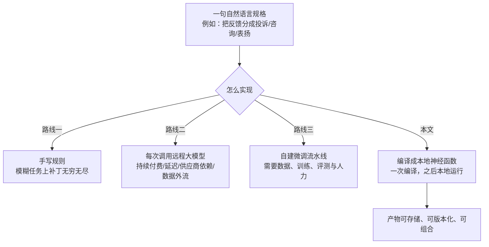
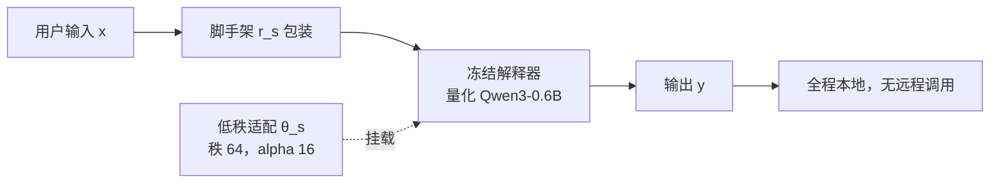
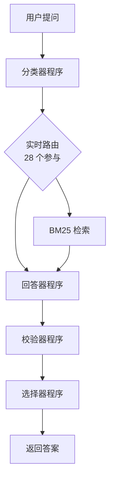

# 训练即编译：把自然语言规格变成本地神经函数

> **原题**：Compile by Training: Turning Natural-Language Specifications into Local Neural Functions
> **作者**：Yuntian Deng, Pengyu Nie, Stuart Shieber
> **年份**：2026（arxiv ID 2609.04199，2026 年 9 月 3 日提交）
> **分类**：cs.CL / cs.AI / cs.LG
> **链接**：https://arxiv.org/abs/2609.04199
> **精读日期**：2026-09-05

## 阅读须知

### 这篇在领域里的位置

这篇论文属于一条这几年一直在推进、但直到最近才被赋予明确形状的技术线索：把一个大模型在某一件具体事情上的能力，转移到一个小得多、可以放在本地跑的模型里。这条线索最早的形态是知识蒸馏，做法是让小模型去拟合大模型的输出分布；后来演化成合成数据监督，也就是让大模型直接生成一批带标注的样本，再拿这批样本去训练小模型；与此同时，参数高效微调这一支解决了另一半问题，让「训练一个专用模型」的成本从复制整个模型的权重，降到只训练一小块附加参数。

这三条线索交汇之后，一个自然的想法出现了：既然一句自然语言的描述加上一个大模型就足以生成训练数据，而训练一小块附加参数又便宜，那么「把一句话变成一个可以部署的小模型」原则上可以做成一条自动流水线。这篇论文的直接前身正是沿着这个想法走的，那项工作叫做 Program-as-Weights，中文可以理解成「以权重形式存在的程序」，它训练了一个摊销式的编译器，能够在一次前向传播里直接预测出附加参数，于是从一句话到一个可用函数只要几秒钟。

这篇论文接在它后面，问的是一个很朴素的问题：如果愿意在编译这一步多花一点时间，比如从几秒钟延长到一分钟，换来的函数能好多少。答案是从语义正确率百分之二十二点四提升到百分之八十三点六。所以这篇工作在领域里的位置，与其说是提出了新的技术组件，不如说是在一个已经成型的框架里，把「编译速度」和「产物质量」这一对取舍明确地摆了出来，并且证明了慢一档的那个档位是划算的。

### 读完能回答什么

- 为什么把一句自然语言描述编译成一个本地小模型，是一件比「写好提示词然后每次调用大模型」更值得做的事
- 摊销式编译器和逐任务训练式编译器的本质差别在哪里，为什么前者快而后者准
- 超网络初始化在这套流程里承担什么角色，为什么有了它一百步训练就够用
- 语义正确率这个指标是怎么定义和验证的，用大模型当评分员的做法在什么条件下站得住
- 教师模型的搭配为什么不是越强越好，而是要用便宜的那个供量、贵的那个补短
- 这套方法在什么样的任务上会失效，以及论文没有做的那几组对照为什么重要

### 阅读前置

假定读者熟悉 Transformer 的基本结构、监督微调的基本流程，以及交叉熵损失的含义，也知道大模型可以通过提示词被引导去完成任务。不预设读者做过参数高效微调、接触过超网络，或者了解 Program-as-Weights 这项具体工作。凡是涉及这三者的地方，都会先铺垫再展开。

### 缩写与术语表

- **PAW**（Program-as-Weights，以权重形式存在的程序）：这篇论文的直接前身工作，也是它的基线。核心思想是让一个冻结不动的小模型充当「解释器」，而把每个具体任务的行为编码进一小块可替换的权重里。
- **LoRA**（Low-Rank Adaptation，低秩适配）：一种参数高效微调方法。它不去改动原模型的权重，而是在若干层旁边挂上两个小矩阵，训练时只更新这两个小矩阵。因为它们的秩很低，参数量比原模型小几个数量级。
- **秩**（rank）：低秩适配里那两个小矩阵的内部维度，本文取 64。这个数越大，附加模块能表达的变化越丰富，参数也越多。
- **alpha**：低秩适配的缩放系数，用来控制附加模块的输出在叠加回原模型时的强度，本文取 16。
- **超网络**（hypernetwork）：一个用来生成另一个网络参数的网络。在这里，它接收一句任务描述，输出一组低秩适配的初始参数。
- **摊销**（amortized）：把原本每次都要重做的优化过程，预先训练成一个可以一次前向传播得到答案的模型。摊销的收益是快，代价是精度受限于这一次前向传播的表达能力。
- **脚手架**（scaffold）：每个编译产物自带的提示词模板，负责把用户的原始输入包装成解释器熟悉的形式。
- **LEM**（LLM Exact Match，大模型判定的精确匹配）：本文的主指标。它不要求输出与参考答案逐字相同，而是由一个充当评分员的大模型判断这次输出是否符合规格描述。
- **FuzzyBench**：一个由「描述容易、写规则难」的文本任务组成的评测集合。**FuzzyBench-Hard** 是它的一个子集，挑选标准见实验一节。
- **`.paw` 产物**：编译的最终交付物，是一个打包文件，里面装着任务规格、低秩适配权重、脚手架模板以及元数据。

## 一、问题

假设手上有这样一件事要做：把用户提交的一段自由格式的反馈，判断成投诉、咨询、表扬三类中的一类。这个任务用一句话就能说清楚，但如果要用规则去实现，很快就会陷入没完没了的补丁，因为自然语言里表达不满的方式几乎是无穷的。于是绝大多数人会选择另一条路，把这句话写成提示词，每来一条反馈就调用一次远程的大模型。

这条路当然可行，可是它的代价是持续的而不是一次性的。每一次调用都要付一次钱，每一次调用都要等一次网络往返，而整个功能的可用性从此绑定在一家服务商的接口上。更麻烦的是数据要离开本地。对一个每天要处理几十万条输入的功能来说，这三项代价加起来往往比这个功能本身的价值还高。

那为什么不训练一个自己的小模型。因为这条路在实践中需要一整套配套能力：得先收集或者标注数据，得搭起训练流程，得设计评测，还得有人会调。对一个只值一句话描述的小功能来说，这套投入完全不成比例。归根结底，横在中间的是一道工程门槛，而不是一道技术门槛。

前人已经把这道门槛削掉了一大半。知识蒸馏说明了大模型的能力可以转移进小模型；以 Self-Instruct 与 Alpaca 为代表的合成监督工作说明了训练数据可以由大模型自己生成，不必人来标注；低秩适配说明了专用模型不必是一整份权重的副本，只需要一小块附加参数。三者拼起来，「一句话换一个小模型」在原理上已经通了。

真正把它做成产品形态的是这篇论文的前身 Program-as-Weights。它的关键设计是把系统拆成两半：一个所有任务共用、始终冻结的小模型充当解释器，以及每个任务各自一小块权重充当程序。这个类比是贴切的，因为解释器只需要装一次，而程序可以有很多份，可以存下来，可以标版本，可以互相调用。为了让编译足够快，它训练了一个摊销式的编译器，也就是一个超网络：给它一句任务描述，它一次前向传播就吐出那一小块权重，全程不需要梯度下降，耗时只有三秒半。

问题恰恰出在这里。一次前向传播能表达的东西是有限的，遇到稍微复杂一点的规格就撑不住。论文用来做实验的那个子集就是这么挑出来的：在这些任务上，那个快速编译器产出的函数一个精确匹配都没拿到。所以这篇论文要回答的技术问题可以写得很具体：在保持「共用解释器加可替换程序」这个架构不变的前提下，把编译从一次前向传播换成一轮真正的训练，能不能把产物质量拉到可用的水平，以及为此要多付多少编译时间。

用编译器的行话说，前身提供的是不做优化的那一档，这篇论文补上的是开了优化开关的那一档。



## 二、方法

整套系统在结构上只有两个部件，理解了这两个部件，后面的流程就都是自然的推论。

第一个部件是解释器，它是一个量化过的 Qwen3-0.6B。这个模型对所有编译产物都是同一份，而且始终冻结，永远不参与训练。选它的理由是六亿参数量级配合量化之后足够小，可以放在普通设备上跑。第二个部件是程序，每个任务各有一份，由两样东西组成：一块低秩适配权重，秩取 64、缩放系数取 16；以及一个脚手架，也就是这个任务专用的提示词模板，负责把用户的原始输入包装成解释器熟悉的形式。

这两样东西最后被打包成一个 `.paw` 文件，里面还附带原始的任务规格与元数据。这个打包动作是整篇论文里容易被略过、但实际上很关键的一步，因为正是它让一个模糊任务的实现变成了一个普通的软件资产：可以放进仓库，可以打版本号，可以被另一个程序引用。

编译分两个阶段，而两个阶段的分工可以用一句话概括：教师负责提供知识，前身工作负责提供起点。

第一阶段是教师合成。给定一句规格描述 s，让教师模型生成一批任务专用的样本，写成 D_s = {(x_i, y_i)}，其中每一对是一个输入和它对应的期望输出。工程上的做法是要求教师返回结构化的 JSON，只有 input 和 output 两个键，并且逐条校验格式，格式不合的直接丢掉。

教师的搭配是这套流程里一个值得单独记的设计。公开服务用的是两个教师按二比一混合：便宜的 GPT-5.4-mini 负责供应大部分样本，更强的 GPT-5.5 负责补充前者覆盖不到的那部分。这个比例不是随手定的，实验一节会给出它的依据。

第二阶段是特化与训练。这里的第一步是热启动：先让前身那个摊销式编译器跑一次，几秒钟之内给出一组低秩适配的初始参数以及配套的脚手架。这一步是理解整篇论文效率来源的关键。如果低秩适配从随机初始化开始，要在一百步之内学会一个任务是相当勉强的；而超网络给出的起点已经大致朝着这个任务的方向，接下来的梯度下降只需要把它推到位，不需要从零摸索。

第二步是常规的监督微调，目标函数就是条件负对数似然：

$$\mathcal{L}(\theta_s) = \sum_{(x,y) \in D_s} -\log p_{\theta_s}(y \mid r_s(x))$$

这里 r_s 就是脚手架，它把原始输入 x 包装成模型实际看到的那段文本；θ_s 是这个任务的低秩适配参数，也是唯一被更新的东西。整个式子的意思是：在脚手架包装过的输入条件下，让模型给期望输出赋予尽可能高的概率。

超参数相当克制：批大小 48，训练一百步，学习率按余弦曲线衰减；数据方面是两千四百对不重复的样本，经过扩展后得到六千四百条训练样本。一百步这个数字之所以够用，前面已经解释过，靠的是超网络给的那个起点。

推理时不再有教师的位置。软件开发工具包把新输入套进脚手架，把低秩适配挂到冻结的解释器上，然后本地跑完，全程没有任何一次远程调用。这一点是整套设计的落脚处：教师的参与被压缩到编译那一次，而不是散布在此后的每一次调用里。

```mermaid
flowchart TD
    S["自然语言规格 s"] --> T1["教师一：GPT-5.4-mini<br/>供应大部分样本"]
    S --> T2["教师二：GPT-5.5<br/>补充互补监督"]
    T1 --> D["样本集 D_s<br/>2400 对不重复，扩展为 6400 条<br/>JSON 格式逐条校验"]
    T2 --> D
    S --> H["摊销式编译器（超网络）<br/>约 3.5 秒"]
    H --> I["低秩适配初始参数<br/>与脚手架 r_s"]
    D --> TR["监督微调<br/>批大小 48，100 步，余弦衰减"]
    I --> TR
    TR --> P["`.paw` 产物<br/>规格 + 适配权重 + 脚手架 + 元数据"]
```



## 三、实验

评测集是 FuzzyBench-Hard，它的挑选标准需要先说清楚，因为它直接决定了怎么读后面的数字。这个子集取自 FuzzyBench，条件是：前身那个快速编译器在这些任务上产出的函数，精确匹配数为零，但语义正确率不为零。换句话说，这是一批「快速编译器碰得到边、却做不对」的任务。

主指标叫 LEM，也就是由大模型判定的精确匹配。它不要求输出与参考答案逐字相同，而是让一个充当评分员的大模型去判断这次输出是否符合规格的要求。用大模型当评分员是有风险的，所以论文给了验证：评分员用的是 GPT-5.5，在作者亲手标注的一百二十八条样本上，它与人工判断的一致率为 0.977，Cohen's kappa 系数为 0.946。这个数字足够高，说明至少在这个评测集上，评分员的判断可以当作代理。

主结果只有两行，但对比相当干净：

| 编译器 | LEM | 编译耗时 |
|---|---|---|
| PAW 快速编译器 | 0.224 | 3.5 秒 |
| 训练式编译（本文） | 0.836 | 50.9 秒 |

绝对提升是 0.612，代价是编译时间大约变成十四倍。论文的立场很明确：对一个编译一次、之后反复使用的产物来说，这个交换是划算的，因为编译成本只付一次，而质量差异分摊在此后每一次调用上。

监督数据这一侧做了两组扫描。第一组是教师搭配：只用便宜的 GPT-5.4-mini 得到 0.746，换成两个教师二比一混合之后升到 0.851。这组数字解释了为什么公开服务要用混合搭配，也说明贵的那个教师并不需要承担主要供量，它的价值在于补上便宜教师系统性遗漏的那部分。

第二组是数据量扫描，结果里有一处值得单独拎出来。一千四百四十对样本对应 0.821，两千四百对对应 0.836，三千六百对仍然是 0.836，而到七千二百对才升到 0.866。也就是说中间存在一个明显的平台期：样本量从两千四百加到三千六百，指标一动不动，直到再翻一倍才重新开始上升。这个形状说明单纯堆数据的边际收益在这个区间里几乎为零，真正的瓶颈可能在教师所能提供的多样性上，而不在样本条数上。顺带一提，论文选作主结果的那个配置用的是两千四百对，对应 0.836，并不是扫描中最好的那一档。

编译耗时在不同硬件上的差别也给了出来，都是没有缓存教师输出的冷编译：B300 上 50.9 秒，H200 上 68.2 秒，消费级的 RTX 上 99.2 秒。并发方面，四个编译任务同时提交时平均排队等待 1.01 秒，各个工作节点负载均匀。这组数字的意义在于说明这套流程不是只能在实验室跑，在消费级硬件上一分半钟也能编译完一个函数。

三个部署案例分别演示了不同的能力。第一个是网站助手 paw-helper，服务四个网站，内部有三十个编译好的程序，其中二十八个参与实时路由，把用户问题依次经过分类器、回答器、校验器和选择器，并与 BM25 检索结合。这个案例的重点不是单个函数有多准，而是证明编译产物可以像普通模块一样被组合成一个系统。第二个是虚拟形象导演，把自然语言指令映射成一套包含序列、时长与重复的动作领域专用语言，在四十四条人工撰写的验证指令上，有四十三条产出了预期的动作结构。第三个是英语与 Claudish 之间的双向翻译器，由两个独立编译的函数组成，从 8 月 22 日公开上线到 9 月 2 日，网页演示完成了 100747 次成功的翻译请求。



## 四、局限

论文自己承认的有两条。第一条是合成监督会继承教师的错误，因此需要保证正确性的应用应当校验输出，或者保留一条确定性的控制路径。这一条说得诚实，它等于承认编译产物的正确性上限被教师锁死了。第二条是应用侧的证据集中在组合能力与结构化执行上，系统性的用户研究属于将来的工作。

读完之后还能看出几处论文没有明说的边界，按重要程度排列如下。

最要紧的一处是缺少一组对照：直接调用教师模型在这个评测集上能拿多少分。整篇论文只把训练式编译与快速编译作比较，而现实中真正的替代方案是每次调用远程大模型。少了这个数字，读者无法判断 0.836 究竟是接近了教师水平，还是离教师还差得远。论文自己的立论是成本与延迟，从这个角度看质量差距不是主要矛盾，但把这个数字空着，读者就没办法自己完成这笔账。

第二处是评测子集的选取方式对基线不利。FuzzyBench-Hard 的定义是「快速编译器精确匹配为零」的那些任务，也就是说这个子集是按基线的失败挑出来的。0.224 对 0.836 的差距本身是真实的，但它建立在一个专门放大基线短板的样本上，读者不应该把这个倍数外推到 FuzzyBench 全集。

第三处是热启动的贡献没有被单独量化。论文强调超网络初始化让一百步训练成为可能，可是没有给出「随机初始化的低秩适配，用同样的六千四百条数据训练」能达到多少。缺了这一组，就无法区分收益究竟来自那个聪明的起点，还是仅仅来自那批合成数据。

第四处是教师依赖并没有被消除，只是被挪了位置。推理时确实不需要教师，但编译时必须有教师访问权限，这意味着数据在编译阶段仍然要经过服务商，而且每编译一个新函数都要重新经历一次。对那些因为数据不能外流而选择本地方案的场景来说，这个约束依然存在。

第五处是解释器的容量构成了硬上限。量化过的六亿参数模型能承载什么样的任务，论文没有画出边界。所有演示的任务都是分类、结构化映射、翻译这一类输入输出较短、模式性较强的工作，一旦规格要求多步推理或者长上下文，这套架构大概率撑不住，但论文没有给出失败案例。

最后一处是评分员与教师同源。评分员是 GPT-5.5，而它同时也是两个教师之一。虽然一百二十八条人工标注给出的一致率高达 0.977，足以支撑这个评测集上的结论，但评分员与教师共享同一模型家族，意味着它们可能共享同一类系统性偏差，那部分偏差在人工核对里未必显现得出来。

另外，Claudish 翻译器那个十万次请求的数字是使用量而不是质量。它说明有人在用，不说明译得准，而这个演示恰恰是三个里面唯一没有给出正确率的。

## 一句话

用一分钟的训练代替三秒的一次前向预测，把一句话编译成能本地运行的小函数，语义正确率从二成二提到八成四。
