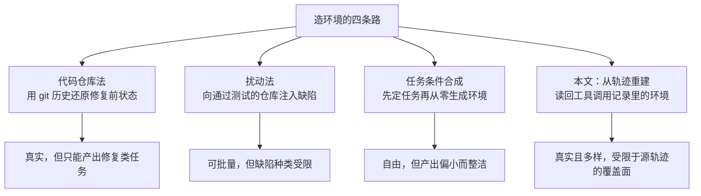
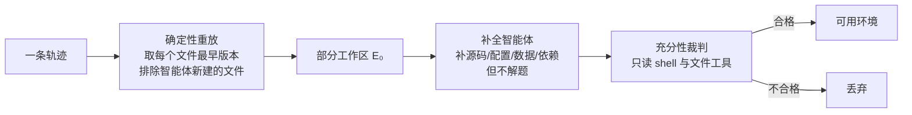
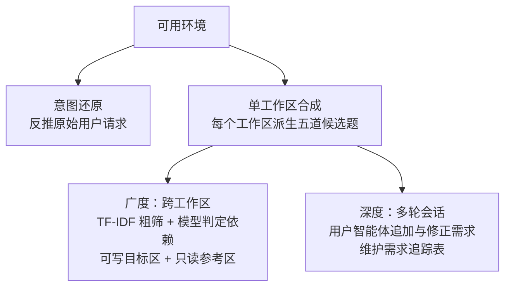

# Terminal-Universe：把智能体轨迹变回可以反复使用的终端环境

> **原题**：Terminal-Universe: Turning Agent Trajectories into Scalable Terminal Environments
> **作者**：Jie Wu, Zhenru Zhang, Beichen Zhang, Xuwu Wang, Yuhui Su, Mouxiang Chen, Peng Wang, Zhihai Wang, Que Shen, Hao Zhou, An Yang, Fei Huang, Yujiu Yang, Dayiheng Liu
> **年份**：2026（arxiv ID 2609.04148，2026 年 9 月 3 日提交）
> **分类**：cs.AI / cs.CL
> **链接**：https://arxiv.org/abs/2609.04148
> **精读日期**：2026-09-06

## 阅读须知

### 这篇在领域里的位置

这篇属于「智能体后训练的数据供给」这一支。过去两年里，能在终端里干活的代码智能体从演示走向了产品，它们的工作方式是在一个真实的命令行环境里反复调用工具，读文件、改文件、跑测试、看报错，再决定下一步。训练这类模型的方法也随之从单纯的监督微调，转向了需要环境参与的路线：模型给出一个动作，环境执行并返回真实结果，这个结果既是训练信号，也是判定对错的依据。

于是整个领域遇到了一个供给侧的瓶颈。模型跑出来的轨迹已经堆积如山，公开可得的数量很大；而能让模型真正跑起来的、装好依赖、放着真实代码、跑得动测试的环境，却始终稀缺。过去几年为解决这个稀缺问题出现了三条路线，各自都能造出一些环境，但造出来的东西在类型和真实度上都受限。这篇论文位于这条脉络的下一步：它不再从零去造环境，而是主张现成的轨迹里其实已经把环境的样子写下来了，只要把它读回去就能把环境重建出来。

### 读完能回答什么

- 为什么说一条轨迹和一个环境的价值差着一个数量级，差在哪里
- 从工具调用记录里，究竟能恢复出环境的哪些部分，恢复不了的又怎么补
- 补全智能体这一步到底值多少，作者用什么数字证明它不可省
- 广度扩展与深度扩展分别指什么，为什么跨工作区的任务明明更难做对，却反而训得更好
- 同样的算力预算，花在造更多环境上和花在给同一批环境编更多题目上，哪个更划算

### 阅读前置

预设读者熟悉大语言模型的监督微调流程，知道什么是智能体的一条轨迹，也用过命令行和容器。不预设读者做过智能体的强化学习，也不预设读者熟悉软件工程类基准的评测方式，这些会在文中交代。

### 缩写与术语表

- **轨迹（trajectory）**：智能体完成一次任务的完整记录，包含它每一步的思考、调用了哪个工具、传了什么参数、拿回什么结果。
- **环境（environment）**：一个装好了代码与依赖、可以真正执行命令的工作区，通常以容器的形式存在。
- **工作区（workspace，文中简写 WS）**：环境里那份代码目录本身。
- **SFT**（Supervised Fine-Tuning，监督微调）：用现成的「输入加正确输出」样本去训练模型的常规做法。
- **验证器（verifier）**：一段可执行的检查程序，用来判定智能体给出的解是否真的把任务做成了。
- **Terminal-Bench**：评测终端智能体的基准，本文用的是 2.1 版。
- **EvoCode-Bench**：评测代码智能体的基准，本文用的是 v2 版的多轮设定。
- **MT@4**（Multi-Turn at 4）：多轮设定下的指标，允许最多四轮交互，看最终是否完成。
- **TF-IDF**（Term Frequency-Inverse Document Frequency，词频与逆文档频率）：一种老牌的文本相似度打分方法，本文用它做工作区之间的粗筛。

## 一、问题

为什么这个问题值得做，要从一次训练里模型究竟能拿到多少可用信号说起。假设手上有一条轨迹，记录了某个智能体如何在某个代码库里定位一个缺陷并修好它。用这条轨迹做监督微调，模型学到的是「在这一串上下文之后，应该输出这一串动作」，仅此一次。轨迹是一份凝固的演示，它既不能被追问，也不能告诉模型「你换个做法行不行」。

与之相对地，如果手上有的是那条轨迹当时所处的那个环境，情况完全不同。同一个环境可以被反复提问，衍生出许多道彼此不同却都可验证的题目；模型每给出一个动作，环境都会真的执行并把结果还回来，对错由执行结果判定而不是由人事后标注。用作者的话说，一个环境可以被反复查询成许多个可验证的任务并提供执行反馈，而一条轨迹只是一次冻结的演示。这就是为什么后训练真正缺的是环境而不是轨迹。

问题在于环境难造。过去的做法大致分三条路，每一条都做对了一部分，也都在某个地方卡住。第一条是基于代码仓库的方法，它利用 git 的提交历史，把某次修复之前的状态还原出来当作环境。这条路的产出真实，但它天然只能产出修复类的任务，因为它依赖的正是「出问题、然后被修好」这一个模式。

第二条是扰动法，做法是拿一个测试全通过的仓库，人为注入缺陷，让智能体去找出来。这条路能批量生产，但注入的缺陷种类受限于注入器本身，任务的多样性上不去。第三条是任务条件下的合成，即先设定一个任务，再让模型从零生成一个配套的环境。这条路自由度最高，代价是生成出来的往往是又小又整洁的工作区，而不是真实世界里那种带着历史包袱的代码。

这篇论文的切入点，是注意到一件此前没有被利用的事实：轨迹里那些工具调用的记录，本身已经把它运行其中的那个环境的结构与内容暴露出来了。智能体读过哪些文件、读到的内容是什么、改之前长什么样、装了哪些依赖，这些都白纸黑字记在轨迹里。既然如此，与其从零去造，不如把环境从轨迹里读回来。

## 二、方法

Terminal-Universe 的整体思路可以概括成两句话：先把每条轨迹还原成一个可用的环境，再在这个环境上重新出题。前半程解决「有没有」，后半程解决「够不够多、够不够难」。

### 第一步：确定性重放

第一步不涉及任何模型，是一段纯粹的确定性程序。它把轨迹里所有的读、写、编辑操作按时间顺序过一遍，对每一个被碰过的文件，取它最早出现的那个版本，也就是智能体动手之前的样子。所有这些文件收拢起来，构成一个部分工作区，文中记作 E₀。

这里有一个刻意的取舍值得点出来：由智能体自己创建的文件被排除在外。原因是那些文件属于解，不属于题；如果把它们留下，重建出来的环境就等于已经把答案摆在桌面上了。

### 第二步：补全智能体

重放只能恢复被读过或被写过的那些文件，凡是轨迹里没碰过的部分，重放是变不出来的。缺失的可能是别的源文件、配置、数据，也可能是根本没被显式记录的依赖。于是第二步引入一个补全智能体，它的职责是把这些窟窿填上，而不是把题目做出来，这条边界在论文里被明确划出。

这一步值多少，作者给了一个很硬的数字。工作区的充分性，也就是「这个环境是否足以支撑对应的任务被完成」，在只做重放时，终端类轨迹是百分之四十点二，软件工程类轨迹只有百分之二十点一；加上补全智能体之后，两者分别升到百分之九十三点五与百分之七十七点一。换句话说，只靠重放，一多半的重建环境是残缺不可用的。

### 第三步：充分性筛选

补完之后还要再过一道关。一个充当裁判的智能体拿着只读的 shell 与文件工具进去看一圈，确认源码、配置、数据与目录结构是否齐备到足以支撑任务，不合格的环境直接丢掉。这一关是只读的，因此裁判本身不会污染环境。

### 第四步：在环境上重新出题

有了环境，接下来是把它「查询」成任务。论文给了四种出题方式，前两种解决基本盘，后两种分别沿广度与深度扩展。

第一种是意图还原。把轨迹按时间顺序读一遍，把当初那个用户请求反推出来，于是原来的任务被复原。第二种是单工作区合成，由一个离线的生成器针对同一个工作区派生出五个候选任务，这样一个环境就不再只对应一道题。

第三种沿广度扩展，做的是跨工作区的任务。作者先用 TF-IDF 做粗筛，再让模型判断，从而在环境之间挖掘出有方向的依赖关系；然后把一个可写的目标工作区与一个只读的参考工作区配成一对，出一道需要同时看两个代码库才能完成的题。这一步模仿的是真实开发中极常见的情形：改这个仓库，得照着那个仓库的接口来。

第四种沿深度扩展，把原本一问一答的单轮任务拉长成多轮会话。一个用户智能体扮演提需求的人，在后续轮次里追加、修正、细化要求；系统内部维护一份明确的需求追踪表，把当前有效的、已经满足的、以及被改写过的要求分别记下来。这样得到的任务捕捉的是需求在交互中逐步清晰的过程，而不是一开始就说得完美的理想情形。

### 第五步：验证与数据筛选

每一道题都要配一个可执行的验证器，由一个专职的智能体在目标容器内部编写。解的部分由 Qwen3.7-Max 充当教师模型试做，只有全部测试通过的轨迹才会被收进训练集。

多轮任务的筛选粒度不同，是按轮来选而不是按整段会话来选。这带来一个有意思的后果：那些出现在成功挽回之前的中间失败被保留了下来。也就是说，训练集里不只有一路顺利的示范，也有「先做错、随后纠正」的片段。

## 三、实验

### 规模

流程跑在公开的终端智能体轨迹上，产出三万七千二百七十三个任务充分的终端环境，连同软件工程类一起，重建出的环境总数为六万八千二百六十三个。最终进入监督微调的示范共三万一千九百七十七条，其中单工作区两万五千三百八十六条、跨工作区三千五百一十二条、多轮三千零七十九条，合计约十四亿两千万个 token。

### 主结果

被训练的模型是 Qwen3.5-27B，两个基准的结果如下。

| 基准 | 设定 | 基线 | 训练后 | 提升 |
|---|---|---|---|---|
| Terminal-Bench 2.1 | 单轮 | 46.2% | 58.1% | +11.9 |
| EvoCode-Bench v2 | MT@4 多轮 | 6.3% | 20.1 | +13.8 |

多轮那一栏的提升幅度比单轮还大，起点低是一个原因，深度扩展那条线直接对应这个设定是另一个原因。

### 值得看的消融

最能说明这篇论文主张的是第一条。同样一批轨迹，直接拿轨迹本身做监督微调，得到百分之三十六点七；先把环境重建出来、再让教师模型在环境里重新解一遍、拿重解的轨迹去训练，得到百分之五十二点一。两者的差距有十五个百分点以上，而数据来源是同一批。

| 消融项 | 对照 | 本文做法 |
|---|---|---|
| 训练数据形态 | 直接用源轨迹 36.7% | 重建环境后重解 52.1% |
| 是否用补全智能体 | 只做重放 48.7% | 加补全 52.9% |
| 跨工作区是否过验证器 | 不过滤 53.2% | 过滤 55.4% |
| 是否做广度扩展 | 仅单工作区 56.4% | 单 + 跨工作区 58.4% |
| 同等预算怎么花 | 加题目或加解法 53.8% 至 53.9% | 加环境（一万七千六到五万六千）56.0% |

最后一行是给工程决策用的：预算固定时，把钱花在造更多环境上，比花在给已有环境编更多题目或多采几条解法上更划算。另外还有一条跨领域的结果，从软件工程类轨迹做意图还原得到的数据，迁移到终端基准上仍有百分之五十的平均表现，说明这套重建方式不挑领域。

### 一个反直觉的结果

跨工作区的任务明显更重也更难：轨迹长度是单工作区的一点六倍（按轮数）、一点九倍（按工具调用次数）、一点五倍（按 token）；教师模型在这类任务上的通过率只有百分之四十九点二，而单工作区是百分之七十二点三。按通常的直觉，通过率低意味着数据脏、噪声大，应当少收；但实验结果是加入这批数据之后成绩反而提升。合理的解释是，这类任务逼出的是「在两个代码库之间来回对照」这种在单工作区里根本不会出现的行为，而这恰恰是真实开发中的常态。

## 四、局限

作者自己承认三条。

第一条关于容器的保真度。重建出来的环境统一跑在标准的 Ubuntu 24.04 容器里，而不是为每个仓库量身定制的镜像。对依赖普通的项目这没问题，但凡是需要特殊工具链、特定版本库或者非常规系统配置的项目，这种统一容器就会失真。

第二条关于覆盖面。整套方法的产出在领域、编程语言与工具链上的分布，从根本上受限于所收集的源轨迹的分布。轨迹里没有的东西，重建不出来。这是「从已有数据里挖」这条路线的固有代价，与它的优势是同一枚硬币的两面。

第三条关于教师模型的单一性。任务、解法与验证器全部由同一个教师模型生成，这既带来能力上限的问题，也带来错误传播的风险：如果教师在某类任务上系统性地判断有误，它写出来的验证器会把这个错误固化成「正确答案」。作者提出的改进方向是引入多个教师，并且用一个独立的模型专门负责编写验证器。

读完之后还能看出一条作者没有明说的边界。整条流水线的每一环都由智能体承担，补全、裁判、出题、写验证器、解题，任何一环的系统性偏差都会沿着流水线往下走，而最终的质量把关依赖的又是同一族模型写出来的验证器。论文用「全部测试通过」作为收录标准，这个标准的严格程度，实际上等于那些测试本身的严格程度。

## 一句话

轨迹里的工具调用记录已经把环境写下来了，把它读回去重建成可反复出题的环境，比直接拿轨迹做微调多出十五个百分点。
