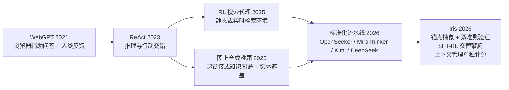
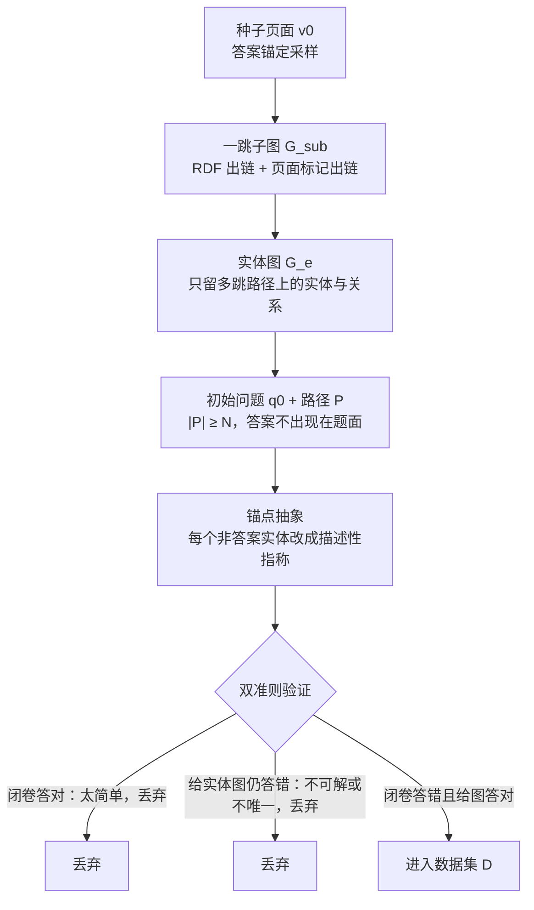

# Iris：攀向搜索前沿

> **原题**：Iris: Climbing to the Search Frontier
> **作者**：Ziyuan Liu, Hengqi Liu, Zichuan Wang, Yang Qin, Jiachen Liang, Xu Chu, Shaowei Chen, Yuantao Gu, Mu Chuan
> **机构**：署名 AllSpark Team，论文未列具体单位
> **年份**：2026（arxiv ID 2609.04304）
> **分类**：cs.AI
> **链接**：https://arxiv.org/abs/2609.04304
> **精读日期**：2026-09-07

## 阅读须知

### 这篇在领域里的位置

这篇论文属于「搜索代理」（search agent）这一支工作。所谓搜索代理，是指一个语言模型不再只凭参数里记住的知识作答，而是自己决定搜什么、读什么、什么时候继续找、什么时候停下来给答案。这一支工作的脉络大致可以分成四步。第一步是 2021 年的 WebGPT，它第一次让模型借助浏览器回答问题，并用人类反馈来训练。第二步是 2023 年的 ReAct，它把「推理」与「行动」交错排列，成了此后几乎所有代理系统的骨架。第三步是 2025 年前后的一批工作，它们用强化学习在静态或实时的网页检索环境里训练策略，同时发现天然问题太容易，于是开始沿着知识图谱或超链接图合成更难的题，并用「实体遮盖」来防止模型走捷径。第四步是 2026 年，OpenSeeker、MiroThinker、Kimi、DeepSeek 等团队把合成题、轨迹监督、强化学习与长上下文推理这几件事拼成了标准化的流水线。

Iris 处在第四步的中段。它没有提出一种全新的范式，而是把这条流水线的每一环都重做了一遍：任务合成上引入了「锚点抽象」与「双准则验证」，训练上把监督微调与强化学习做成交替进行的「攀爬」循环，基础设施上做了部分回放与前缀复用，评测上则坚持把「上下文管理」带来的分数与策略本身的分数分开报告。它的两个模型 Iris-mini 与 Iris-pro 在四个主流搜索基准上拿到了开源系统里的最好成绩，同时也坦白地列出了与闭源前沿系统之间仍然存在的差距。

### 读完能回答什么

1. 天然的网页问题为什么不够难，Iris 是怎样把一个种子页面变成一道必须多跳才能解开的题，又是怎样防止模型靠直接搜字符串来绕过推理的。
2. 「双准则验证」里的难度门与可解性门各自挡掉什么样的题，为什么缺一不可。
3. 监督微调与强化学习交替「攀爬」时，哪些题、哪些轨迹会被选回训练集，为什么这条规则天然形成了一份由易到难的课程。
4. 上下文管理究竟能带来多少分，为什么论文坚持把有无上下文管理的成绩分开列出。
5. Iris 与同规模的开源系统、以及与闭源前沿系统的差距分别有多大，差距落在哪几个基准上。

### 阅读前置

假定读者熟悉大语言模型的监督微调与强化学习的基本流程，知道策略、奖励、回放（rollout）这些词的含义，也了解 ReAct 式的工具调用是怎样把模型输出与工具返回交错起来的。不假定读者做过搜索代理，也不假定读者熟悉在图上合成问题的做法，这两部分会在正文里从头铺垫。

### 首次出现的缩写表

- **SFT**（Supervised Fine-Tuning，监督微调）：用现成的高质量轨迹做最大似然训练。
- **RL**（Reinforcement Learning，强化学习）：让模型自己探索，按结果好坏给奖励并更新。
- **ReAct**（Reasoning and Acting）：把「想一步、做一步、看一步」交错排列的代理范式。
- **CM**（Context Management，上下文管理）：上下文快用尽时对历史做丢弃、压缩或重置的推理期机制。
- **GenRM**（Generative Reward Model，生成式奖励模型）：用一个语言模型读题、读答案、读参考答案，然后给出判定的奖励器。
- **MoE**（Mixture of Experts，混合专家）：论文里 35B-A3B 表示总参数三百五十亿、每个 token 只激活三十亿，397B-A17B 同理。
- **HLE**（Humanity's Last Exam）：专家级学术推理基准，本文只用其纯文本子集。
- **BrowseComp / BrowseComp-ZH**：长尾实体识别基准及其中文版，题目由多条互相约束的间接线索组成。
- **DeepSearchQA**：考察搜索式回答完整程度的基准，以 F1 计分。
- **pass@1**：每题只跑一次回放，按这一次的答案计分。
- **RDF**（Resource Description Framework）：以「主语、谓语、宾语」三元组表示网页间关系的数据格式。
- **FP8**：八位浮点精度，用来在训练集群内以较低显存跑大模型推理。
- **BFCL / τ-bench / OfficeQA / APEX**：通用工具调用与办公协作方向的四个基准，本文只用来验证迁移效果。

## 一、问题

搜索代理要解决的事情，普通人一句话就能说清：给模型一个问题，让它自己上网找到答案。可是这件事与普通的语言模型任务有一处根本不同。普通任务里，问题、上下文与计算量都是事先固定的；搜索任务里，这三样都要由模型在过程中自己决定。它要判断问题问的是什么，要决定搜哪个词，要读懂搜回来的东西，要判断线索够不够，够了就停，不够就换个方向再找。这一连串决定里任何一处出错，最后的答案就是错的。

过去几年这个方向已经走出了几条路。一条是用工具调用与交错推理做监督训练，另一条是用强化学习在真实或静态的网页环境里训练策略，第三条是沿知识图谱合成题目并把实体遮起来。这三条路合起来已经能训出不错的代理，但作者指出了两个被忽视的地方。第一，天然出现的网页问题往往太容易，不足以把模型逼到需要多跳推理的程度，所以必须合成更难的题。第二，也是更要紧的一点，长程搜索常常在解完所有约束之前就把上下文用光，于是各家系统都加了轨迹摘要、状态压缩、选择性删除历史或整体重置等机制，然而这些机制带来的提升往往不单独报告，结果两个系统之间的分差究竟来自策略本身还是来自外面那层推理框架，谁也说不清。

换句话说，这个领域现在缺的不是新点子，而是一条把每一环都做扎实、并且把每一环的贡献算清楚的流水线。这正是 Iris 想做的事。

## 二、方法

Iris 的方法分成三块：先合成题，再用监督微调打底，最后用强化学习与监督微调交替往上爬。下面按这个顺序展开。

### 2.1 从网页图到一道难题

作者先把整个网页语料看成一张有向图，记作 $G=(V,E)$，其中每个节点 $v$ 是一个页面，$\mathrm{Out}(v)$ 是它指出去的链接集合。每次合成从一个种子页面 $v_0$ 开始，采样方式是「答案锚定」的，也就是先选定一个将来要当答案的实体，再取它所在的页面做种子。种子沿着出链向外扩一层，得到一个小子图 $G_{\text{sub}}$，其中包含种子与它的 $k$ 个邻居页面，每页正文截到固定预算。出链既从 RDF 三元组里取，也从渲染后的页面标记里取，两个来源合并以尽量提高链接召回。

有了子图，题目的合成分三步。第一步是「实体图抽取」：原始页面里噪声很多，直接拿来出题会让生成器分心，所以先用一个抽取器 $f_{\text{ext}}$ 把子图蒸馏成一张紧凑的实体图 $G_e=(V_e,R_e)$，只保留落在通向种子主题的多跳路径上的实体与带类型的关系，节点数不超过 $n$。第二步是「多跳问题生成」：记种子主题为 $y$，也就是目标答案，生成器 $f_{\text{gen}}$ 在实体图上产出一个初始问题 $q_0$ 与一条推理路径 $P$，路径形如 $e_1 \xrightarrow{r_1} e_2 \xrightarrow{r_2} \cdots \to y$，要求路径长度至少为 $N$，并且答案 $y$ 不能出现在问题文本里。路径长度的下限是为了逼迫问题依赖至少 $N$ 条耦合在一起的关系。

第三步叫「锚点抽象」，是这一节最值得记住的设计。如果问题里直接写着中间实体的名字，模型只要把那个名字搜一下就能跳到答案，整条多跳推理就被绕开了。为此作者定义了一个抽象算子 $\mathcal{A}$，把问题中每个非答案实体 $e$ 都改写成一段描述性指称 $\mathcal{A}(e)$，要求这段描述里既不含实体的名字也不含它的别名，但仍能唯一确定这个实体。最终的问题 $\tilde{q}=f_{\text{abs}}(q_0,\mathcal{A})$ 保留了原来的推理结构与答案，只是每一个可以被直接搜索的锚点都被抹掉了。

合成出的题还要过一道「双准则验证」。作者用一个参考模型 $M_{\text{ref}}$ 做两次判断：难度准则 $c_{\text{diff}}(\tilde{q})=\mathbb{I}[M_{\text{ref}}(\tilde{q})\neq y]$，即闭卷、不用工具时参考模型答不对；可解性准则 $c_{\text{solv}}(\tilde{q})=\mathbb{I}[M_{\text{ref}}(\tilde{q}\mid G_e)=y]$，即把实体图交给它时它能答对。只有两个准则同时为一的题才进入数据集 $\mathcal{D}$。难度门挡掉的是参数记忆里已经有答案的简单题，可解性门挡掉的是答案错误或答案不唯一的题；答案是否相等由一个语义匹配的判定器决定，而不是字符串比对。

### 2.2 监督微调：先让模型学会像样地搜

有了题，下一步是让一个强教师模型 $M_T$ 按 ReAct 范式把题解一遍，得到轨迹 $\tau=(r_1,a_1,o_1,\ldots,r_T,a_T,o_T,r_{T+1},\hat{y})$。其中 $r_t$ 是第 $t$ 步的推理，$a_t$ 是工具调用，工具只有两种，即搜索与抓取页面，$o_t$ 是工具返回的观察，$\hat{y}$ 是最终答案。这里有一个细节要单独说明：观察 $o_t$ 不是原始网页，而是一份与查询相关的文档级摘要。这一点在后面讲强化学习时会再次出现。

教师产出的轨迹要经过粗、细两道过滤。粗过滤在轨迹级别做三件事。其一是正确性门 $c_{\text{corr}}$，要求轨迹成功终止并且判定器认为答案正确。其二是退化检测：作者用滑动窗口内的压缩比 $\rho_{\text{cr}}(w)=|w|/|\mathrm{zlib}(w)|$ 来抓循环，因为重复的文本比流畅的文本压缩得多得多，窗口压缩比超过阈值 $\tau_{\text{cr}}$ 就判为退化；辅助检测器再覆盖周期性重复的行、过长的单字符串以及连续相同的工具调用。其三是深度要求 $c_{\text{depth}}$，只保留工具调用轮数不少于 $K$ 的轨迹，避免模型学到「搜一次就答」的浅层习惯。三道门都通过并去重之后得到 $\mathcal{D}_{\text{sft}}$。

细过滤在轮级别做。作者没有手写评分标准，而是先让评估器对样本轨迹自由地写评语，再把反复出现的失败模式归并成一份显式的评分表，然后用这份表逐轮判定每个助手回合是保留还是遮蔽，输出掩码 $m_t\in\{0,1\}$。为了防止过滤过于激进，每条轨迹最多遮蔽百分之十的助手回合。训练目标于是写成

$$\mathcal{L}_{\text{SFT}}(\theta)=-\mathbb{E}_{(q,\tau)\sim\mathcal{D}_{\text{sft}}}\sum_{t=1}^{T+1} m_t\log\pi_\theta(u_t\mid C_{<t})$$

其中 $u_t$ 是第 $t$ 轮的助手输出，$C_{<t}$ 是此前可见的历史，观察、用户与系统 token 一律不计损失。作者特别强调 $C_{<t}$ 是按推理时的格式逐字节重建的，训练时模型看到的上下文与部署时完全一致。

### 2.3 强化学习：让模型自己去探索

强化学习阶段的工程设计占了不小的篇幅，原因是长程搜索的回放有很重的长尾：一批回放里总有几条要跑很久，同步训练会被它们拖住。作者的办法是「部分回放与前缀复用」。当一步里已经攒够了完成的轨迹，尚在进行的会话就在请求级别被打断，下一步再从已经提交的前缀处恢复。回放被组织成一片「消息状态森林」，每个状态缓存 token、损失掩码、对数概率以及权重版本的差异，恢复出来的轨迹因此会拼接来自不同策略版本的前缀，这一偏差用截断的重要性采样来纠正。代价是需要大约两倍的过采样余量，换来的是回放 GPU 在同步的共置调度下始终有活干。

奖励与摘要都在训练集群内部完成，而不是调用外部接口。作者在集群里跑了若干个 FP8 精度的 Qwen3.5-397B-A17B 引擎，与策略引擎、回放引擎并排放着。奖励是一个纯二值的判定 $R(q,\tau)=\mathbb{I}[\mathrm{GenRM}(q,\hat{y}_\tau,y^*)=\text{A}]$，没有任何格式加分项，答案为空或被截断的轨迹直接得零。与此同时，同一批引擎还负责把抓回来的页面压缩成与查询相关的摘要，也就是前面说的观察 $o_t$。这是回放期间唯一的上下文缩减手段，没有消息历史剪枝，也没有滑动窗口，于是训练时的上下文与推理时的上下文完全相同。

### 2.4 攀爬：监督微调与强化学习交替

「攀爬」是这篇论文标题的来源，指的是监督微调与强化学习按周期交替。每一轮强化学习先让当前策略去探索，然后把其中高质量的回放蒸馏回监督微调，微调完再回到强化学习。关键在于选什么回来。对每道题 $q$，记它在回放组里的通过率为 $\bar{R}(q)$，只选 $0<\bar{R}(q)\le 1/2$ 的题，也就是「解得出但不稳」的那一档。在这些题的成功回放里，要求工具调用轮数至少为 $K_{\text{rft}}$，然后取其中最短的一条：

$$\mathcal{S}_q=\{\tau_i\mid R(q,\tau_i)=1,\ T_{\text{tool}}(\tau_i)\ge K_{\text{rft}}\},\qquad \tau_q^*=\arg\min_{\tau\in\mathcal{S}_q}T_{\text{tool}}(\tau)$$

深度约束把「碰巧蒙对」的浅层解挡在外面，最短轨迹准则则不鼓励多余的搜索。之所以这套规则能形成课程，是因为通过率的区间是相对当前策略定义的：策略变强以后，原来「解得出但不稳」的题会变成稳定可解而被排除，原来完全解不出的题会进入这一档，难度带自动向上移动，不需要人手排课。

模型方面，Iris-mini 从 Qwen3.6-35B-A3B 初始化，Iris-pro 从 Qwen3.5-397B-A17B 初始化，两者都是混合专家模型，上下文窗口二十五万六千 token。监督微调训两个 epoch，全局批大小六十四，最大序列长度二十六万二千一百四十四 token；强化学习用开源的 Relax 框架。参考模型 $M_{\text{ref}}$ 与教师模型 $M_T$ 论文没有点名。

## 三、实验

评测用四个基准：BrowseComp 与它的中文版 BrowseComp-ZH 考长尾实体识别，DeepSearchQA 考回答的完整程度并以 F1 计分，HLE 的纯文本子集考专家级推理。所有结果都是 pass@1，最终答案由语言模型按各基准官方提示判定。作者报告成绩时把「上下文管理」单列成一个变量：不用任何管理、「丢弃全部」（上下文用尽时清空交互历史重来）、「重试」（把失败的尝试摘要后再来一次），以及两者叠加。

主表里带上下文管理的成绩如下，基线只列开源同规模系统。

| 模型 | 规模 | BrowseComp | BrowseComp-ZH | DeepSearchQA (F1) | HLE |
|---|---|---|---|---|---|
| Iris-mini | 35B | 82.2 | 84.8 | 86.9 | 52.3 |
| XYZ-Aquila-mini | 35B | 78.8 | 82.9 | 89.5 | 51.1 |
| Nex-N2-mini | 35B | 74.1 | 79.6 | 87.2 | 37.1 |
| Apodex-1.0-mini | 35B | 71.5 | 80.6 | 82.2 | 46.8 |
| FORT-Searcher | 30B | 72.2 | 75.0 | 未报 | 未报 |
| Iris-pro | 397B | 88.6 | 85.1 | 92.9 | 56.4 |
| XYZ-Aquila-pro | 397B | 84.8 | 85.1 | 92.5 | 53.3 |

在 BrowseComp 上，Iris-mini 比同规模最强的 XYZ-Aquila-mini 高 3.4 分，Iris-pro 比 XYZ-Aquila-pro 高 3.8 分；HLE 上 Iris-pro 领先 3.1 分。值得注意的是 DeepSearchQA 这一列，Iris-mini 的 86.9 低于 XYZ-Aquila-mini 的 89.5，也低于 Nex-N2-mini 的 87.2，「开源最强」的说法在小模型这一档并不是每一列都成立。

与闭源或重算力系统相比，差距是清楚的。BrowseComp 上 Kimi-K3 为 91.2，GPT-5.6 Sol 为 90.4，Apodex-1.0-H 为 90.3，Claude Fable 5 为 88.0，Iris-pro 的 88.6 大约落在这一群的中下位置；HLE 上 Claude Fable 5 为 64.5，Apodex-1.0-H 为 60.8，GPT-5.6 Sol 为 58.0，Iris-pro 的 56.4 比它们都低。DeepSearchQA 上 Kimi-K3 为 95.0，Apodex-1.0-H 为 94.4，Iris-pro 的 92.9 差得不多。

上下文管理的消融是这篇论文最有信息量的一张表。

| 配置 | BrowseComp | BrowseComp-ZH | DeepSearchQA | HLE |
|---|---|---|---|---|
| Iris-mini 无 CM | 64.7 | 72.3 | 81.0 | 43.2 |
| Iris-mini + 丢弃全部 | 82.2 (+17.5) | 84.8 (+12.5) | 86.9 (+5.9) | 52.3 (+9.1) |
| Iris-mini + 重试 | 未报 | 83.0 (+10.7) | 89.1 (+8.1) | 52.0 (+8.8) |
| Iris-mini + 丢弃全部 + 重试 | 85.9 (+21.2) | 85.1 (+12.8) | 89.9 (+8.9) | 52.4 (+9.2) |
| Iris-pro 无 CM | 72.6 | 76.8 | 86.4 | 50.8 |
| Iris-pro + 丢弃全部 | 88.6 (+16.0) | 85.1 (+8.3) | 92.9 (+6.5) | 56.4 (+5.6) |
| Iris-pro + 重试 | 未报 | 84.1 (+7.3) | 92.3 (+5.9) | 56.6 (+5.8) |

从这张表能读出三件事。第一，上下文管理带来的分数很大，BrowseComp 上小模型叠加两种策略后涨了 21.2 分，这正是作者坚持分开报告的理由：如果别家只报带管理的分数，读者根本无法判断策略本身的水平。第二，收益随基准变化很大，BrowseComp 这类需要跨多个来源串起长链条的任务受益最多，HLE 这类以专家推理为主、检索只是辅助的任务受益最少，作者的总结是「上下文管理最有价值的时候，是模型已经学会了有效的搜索行为、只是上下文在用上这些行为之前就耗尽了」。第三，小模型从管理里拿到的分数比大模型多，BrowseComp 上是 17.5 对 16.0，这与小模型更容易把上下文用光的直觉一致。不带任何管理时，Iris-mini 在 BrowseComp 上的 64.7 仍高于 FORT-Searcher 的 55.9、OpenSeeker-v2 的 46.0 与 REDSearcher 的 42.1，说明策略本身也确实更强。

有一个反直觉的结果值得单独拎出来。BrowseComp-ZH 上，Iris-pro 加丢弃全部、XYZ-Aquila-pro 以及 Iris-mini 叠加两种策略，三个配置都恰好是 85.1，即二百八十九题里答对二百四十六题。作者据此推测，这个基准上剩下的失分已经不再由模型容量决定，而是受制于别的因素。附录里的一个案例给出了一种可能：一道《权力的游戏》题目问珊莎·史塔克的第二任丈夫来自哪个家族，系统答的是波顿家族，与官方标注的兰尼斯特家族不一致，而按原著与剧集，系统的答案才是对的。这提示基准标注本身可能有误，天花板附近的几分未必是模型的错。

最后是迁移。作者称合成的搜索数据与搜索特化的模型（后者被当作在线策略蒸馏的教师）在没有专门针对的领域上也有正向迁移，包括通用工具调用方向的 BFCL 与 τ-bench，以及办公协作方向的 OfficeQA 与 APEX。可惜正文里没有给出这几项的具体数字，这一句只能当作方向性的说法来读。

## 四、局限

作者自己承认的局限只有一条，但是重要的一条：他们的模型与最强的前沿系统之间仍有差距，缩小这一差距是后续工作的方向。从上面的数字看，这条差距在 HLE 上最明显，Iris-pro 比 Claude Fable 5 低八分多；在 BrowseComp 上也落后 Kimi-K3 两分半。作者还在附录里记录了基准标注可能有误的情况，这既是对自己失分的一种解释，也是给基准维护者的提醒。

读完之后能看出、但论文没有明说的问题有几处。第一是可复现性。参考模型与教师模型都没有点名，合成题的数量、最小跳数 $N$、最小工具轮数 $K$ 与 $K_{\text{rft}}$、压缩比阈值、攀爬的轮数、强化学习的算法细节与学习率都没有给出，别人无法照着做。第二是基线的公平性。作者给自己的模型报了带与不带上下文管理的两套分数，这一点做得好，但表里其他开源系统用的是什么推理框架、有没有类似的管理机制，论文没有交代，同表比较仍然带着作者反对的那种不确定性。第三是算力门槛。奖励与摘要由若干个 FP8 的 397B 模型在集群内提供，回放又要留出两倍的过采样余量，这套流水线对没有大规模集群的团队并不友好。第四是基准本身的噪声，BrowseComp-ZH 只有二百八十九题，一分对应约三题，表中许多零点几分的差距在这个粒度上没有意义。第五是迁移结果只有一句话没有数字，读者无法判断「搜索是一种原子能力」这个结论有多少证据支撑。

## 一句话

用网页链接图合成多跳难题、再让 SFT 与 RL 交替攀爬，Iris 在四个搜索基准上做到开源最强，并把上下文管理的贡献单独算清。
