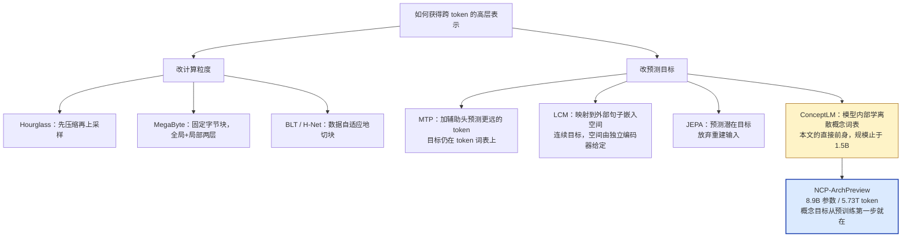
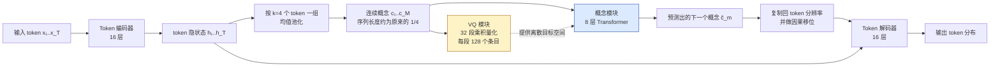
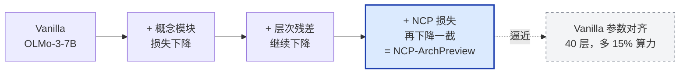

# NCP-ArchPreview 技术报告：用「下一个概念预测」走向潜空间语言模型

> **原题**：NCP-ArchPreview Technical Report: Moving towards Latent Space Language Models through Next Concept Prediction
> **作者**：The Intern-NCP Team
> **机构**：上海人工智能实验室；上海交通大学 LUMIA Lab
> **年份**：2026（arxiv ID 2609.10715，提交于 2026 年 9 月 9 日）
> **分类**：cs.CL
> **链接**：https://arxiv.org/abs/2609.10715
> **精读日期**：2026-09-13

---

## 阅读须知

### 这篇在领域里的位置

过去三年里，生成模型领域反复验证了同一件事情：模型在什么样的表示空间里学习，这件事的重要性不亚于它有多少参数。图像生成是最明显的例子。早期的扩散模型直接在像素上做去噪，每一步都要处理成千上万个通道数极低、彼此高度冗余的数值；后来潜空间扩散把生成过程整体搬进一个由自编码器压缩出来的紧凑连续空间，同样的计算预算能换到高得多的分辨率与更稳定的训练。语言这一侧一直没有出现同等量级的转变。

不是没有人尝试。这个方向上大致存在两条互相独立的路线。第一条路线改变计算的粒度，也就是让模型不再逐个 token 地承担全部计算，而是先把若干个相邻单元并成一个更大的块，在块的层面上做主要的建模，再展开回去。Hourglass Transformer、MegaByte、以及后来用数据自适应方式切分字节的 BLT 与 H-Net 都属于这一条。第二条路线改变预测的目标本身，让模型除了预测下一个 token 之外，还要预测某种更抽象的东西。多 token 预测给模型加上若干个预测未来位置的辅助头，Large Concept Model 把整句话映射进一个共享的句子嵌入空间并在那里做自回归，JEPA 系列则直接放弃重建输入，只预测潜在目标。

这篇工作站在第二条路线上，但它做的是一件此前没人在这个量级上做成的事情。它的直接前身是同一批人做的 ConceptLM，那篇工作提出了「下一个概念预测」这个离散的概念级目标，也提出了与语言模型联合学习的乘积量化概念词表，但验证规模停在从零训练的 1.5B，外加把该目标以继续预训练的方式加到一个现成的 8B 模型上。NCP-ArchPreview 把同一套想法放到 8.9B 参数、5.73T token 的完整预训练里，从第一步起就带着概念目标一起训，并且拿 OLMo-3-7B 做了严格对照。截至目前，这是潜空间语言模型规模最大的一次公开验证。

### 读完能回答什么

读完这份笔记之后，应当能回答下面这几个问题：

- 「概念」在这篇论文里究竟是什么，它与句子嵌入、与多 token 预测的辅助头有什么本质区别
- 为什么概念的预测目标要经过乘积量化变成离散的，直接对连续向量做回归会出什么问题
- 为什么模型要被切成「Token 编码器 + 概念模块 + Token 解码器」三段，而不是在原有的 Transformer 上挂一个旁路
- 1.95 倍的收敛加速里，有多少来自新增的参数与计算，有多少真正来自概念目标本身
- 训练完成之后那个只有 1700 万参数的 VQ 模块凭什么能当作一个领域适配的接口，它与 LoRA 的取舍分别在哪里
- 为什么语言建模损失明显更低，下游分数的领先却在第二训练阶段收窄了

### 阅读前置

这份笔记假定读者熟悉 Transformer 的基本结构，知道自回归语言模型是怎么用交叉熵在 token 上训练的，也大致了解残差连接与注意力的形状。除此之外不做更多假设。向量量化、乘积量化、LoRA、多 token 预测、投机解码这些概念都会在首次出现时先铺垫再展开，不预设读者专门做过其中任何一项。涉及具体公式的地方只保留最关键的两三个，其余用文字讲清楚。

### 首次出现的缩写表

| 缩写 | 全称 | 一句话解释 |
| --- | --- | --- |
| **NTP** | Next Token Prediction | 标准的下一个 token 预测目标，当代语言模型预训练的默认做法 |
| **NCP** | Next Concept Prediction | 本文的核心目标：预测跨越多个 token 的下一个离散概念 |
| **VQ** | Vector Quantization，向量量化 | 把连续向量映射到一个有限码本里最近的那个条目，从而得到离散表示 |
| **PQ** | Product Quantization，乘积量化 | 把向量切成若干段，每一段各自量化，用组合方式换取巨大的表示容量 |
| **CM** | Concept Module，概念模块 | 在压缩后的概念序列上运行的那八层 Transformer |
| **IRC** | Intra-Module Residual Connections | 模块内部的层间稠密残差连接 |
| **CRC** | Cross-Module Residual Connections | 跨三个模块之间的残差连接 |
| **MTP** | Multi-Token Prediction，多 token 预测 | 额外加一个预测更远位置 token 的头，作为辅助目标 |
| **LoRA** | Low-Rank Adaptation | 冻结主干、只训练低秩增量矩阵的轻量微调方法 |
| **MAL** | Mean Accepted Length，平均接受长度 | 投机解码里每一轮验证平均能提交多少个 token，越大越省时间 |
| **BPB** | Bits Per Byte | 以 UTF-8 字节为单位的似然度量，越低越好 |
| **sg(·)** | stop-gradient | 截断梯度的算子，让某个张量在反向传播中被当作常量 |

---

## 一、问题

### 为什么这个问题值得做

当前所有主流语言模型的监督信号都严格锁死在 token 这一层。模型看到前面的若干个 token，被要求预测紧接着的那一个，损失在词表上按交叉熵计算，除此之外没有任何别的东西告诉它应该学成什么样。这套做法之所以能走到今天，靠的是规模；但它有一个长期被默认接受、很少被正面处理的结构性缺陷。

缺陷在于，语义并不是按 token 组织的。一个专有名词可能占四个 token，一个数学推理步骤可能占三十个 token，而一段论证的转折可能横跨两百个 token。模型确实会在隐状态里自发长出这些跨度更大的抽象，已经有不少工作在探针实验里把它们找了出来，例如空间与时间的内部坐标、以及可以被线性读出的语义方向。但这些抽象完全是副产品，训练目标从来没有直接过问过它们。换句话说，模型必须靠预测下一个字这一件事，顺带把「这段话在讲什么、接下来该转向哪里」也学会，没有任何一条损失专门为这件事负责。

这件事情不解决的代价，在数学与代码这类需要多步连贯推理的任务上最容易看出来。token 级的目标天然偏爱局部的、表面的统计规律，因为那是降低下一个词的困惑度最省力的路径。于是模型的样本效率被压住了：要把跨越多个 token 的依赖学扎实，只能靠反复多看数据，让这种结构从海量的局部证据里慢慢浮现出来。

过去几年针对这一点的努力大致到了两个位置。一边是改粒度，把若干 token 合成一块来算，主要收益是省算力，语义层面的监督依然缺席；另一边是改目标，但要么把预测空间放在模型外部的一个独立编码器里，例如 Large Concept Model 用的句子嵌入空间，要么仍然把目标定在 token 上，例如多 token 预测只是把一个头变成若干个头。真正卡住的地方在于：如果要在模型内部学出一个概念空间，并且直接拿它当预测目标，那这个空间是什么、怎么保证它不塌缩、以及这套东西能不能在万亿 token 的规模上稳住，都还没有答案。这篇论文要给的就是这个答案。

### 前人路线的对照

把前面提到的几条线放在一起看，它们的分歧其实出现在两个互相独立的维度上：潜表示是怎么构造出来的，以及模型在什么空间里做预测。

这张图里最值得停一下的是 C2 与 C4 的差别。Large Concept Model 的概念空间来自一个外部的句子编码器，它是给定的、冻结的，语言模型只是被要求在那个空间里做自回归，然后再想办法把结果译回文字。这样做的好处是概念空间有明确的语义含义，坏处是它与语言模型自己的隐状态分布未必对得上，而且生成时必须额外维护一条从概念回到 token 的解码通路。

ConceptLM 与本文走的是另一条路：概念词表直接从语言模型自己的隐状态上长出来，与主模型联合训练；token 级的自回归生成完整保留，概念只是额外的一层监督与额外的一路条件输入。这样一来，推理时模型仍然是一个普通的自回归语言模型，所有现成的解码基础设施都能直接用上。

---

## 二、方法

### 整体结构：把一个 Transformer 切成三段

NCP-ArchPreview 的骨架来自 OLMo-3-7B，隐藏维度 4096，前馈维度 11008，32 个注意力头，最大上下文 8192。原本连成一条直线的 32 层被从中间劈开，前 16 层叫做 Token 编码器，后 16 层叫做 Token 解码器。在这道裂缝里插进去一个八层的概念模块。

之所以要这样切，是因为概念这个东西必须有一个明确的诞生位置与一个明确的作用位置。Token 编码器负责把原始输入加工成足够抽象的隐状态，概念就从这里的输出上提取；概念模块在压缩后的概念序列上做自回归，预测下一个概念是什么；预测出来的概念再回注到 Token 解码器，去影响后面每一个 token 的生成。三段之间的分工是清晰的，而如果只是在原有网络上挂一个旁路，概念既拿不到足够成熟的表示，也没有一个自然的位置把预测结果送回主干。

概念的构造方式本身极其朴素：每四个相邻 token 的隐状态做一次均值池化，得到一个概念向量。论文没有在这里引入任何可学习的切分器或者注意力池化，chunk 大小固定为 4。这个选择的直接后果是概念序列的长度只有 token 序列的四分之一，因此概念模块的每一层虽然带来与一个标准 Transformer 块相当的参数量，计算量却只有大约四分之一。这个不对称是后面整套算力账目的基础。

### 概念词表：为什么必须是离散的

有了连续的概念向量，最直接的做法是让概念模块直接对它做回归，用均方误差逼近下一个概念。论文明确指出这样做不可行，理由在于：回归目标只规定了「离目标有多远」，完全没有规定「什么样的输出才算一个合法的概念」。模型可以把预测结果放在表示空间的任何一个位置，包括那些根本不对应任何真实语义的角落，而损失照样在下降。

解决办法是先用向量量化把概念空间变成一个有限的词表。向量量化要做的事情是，维护一组固定数量的码本条目，把任意输入向量映射到其中距离最近的那一个，从而得到离散表示。单纯的向量量化有一个容量上的困境：要表达足够丰富的概念就需要巨大的码本，而巨大的码本既难训练也容易出现大量条目从不被选中的死码问题。

乘积量化是绕开这个困境的标准手段。它把概念向量沿维度切成 S 段，每一段配一个自己的小码本，各段独立量化，最终的表示是各段选择结果的组合。论文取 S = 32，每段码本 128 个条目，每个条目维度 128。这样一来可表达的组合数量是 128 的 32 次方，而实际需要学习和存储的只有 32 × 128 个向量。整个 VQ 模块加起来只有 1700 万参数，后面会看到这个数字很重要。

码本的训练用的是一个只作用于码本自身的损失：

$$\mathcal{L}_{VQ} = \frac{1}{MS}\sum_{m}\sum_{s} \left\| \mathrm{sg}(c^s_m) - d^s_m \right\|_2^2$$

这里 $c^s_m$ 是第 m 个概念的第 s 段连续向量，$d^s_m$ 是分配给它的那个最近的码本条目，$\mathrm{sg}(\cdot)$ 是停止梯度算子。停止梯度加在连续概念这一侧，意味着这条损失只会把码本条目往数据分布上拉，不会反过来去改动 Token 编码器。这个设计的用意是让码本安静地跟踪隐状态的分布，而不去干扰 token 级表示本身的学习。

### 概念预测：一个可微的离散目标

概念模块的任务是根据前面的概念历史预测下一个概念。做法不是直接输出一个向量，而是对每一段乘积量化各自输出一个在 128 个码本条目上的概率分布，然后按这个分布对码本条目做加权求和，得到预测的概念表示。这一步是整个方法里最精巧的地方：它既借用了离散词表提供的结构约束，避免了纯回归的自由度过大问题，又因为走的是期望而不是硬选择，全程保持可微，不需要 Gumbel 采样或者直通估计这类近似。

预测损失仍然写成均方误差的形式：

$$\mathcal{L}_{NCP} = \frac{1}{M-1}\sum_{m=2}^{M} \left\| \hat{c}_m - \mathrm{sg}(c_m) \right\|_2^2$$

目标 $c_m$ 同样被停止梯度截断。这一点需要特别留意：如果目标不截断，模型可以通过把所有概念向量拉到一起来把这条损失降为零，那是最典型的表示塌缩。截断之后，Token 编码器接收 NCP 梯度的唯一通道是它提供给概念模块的那些历史概念 $c_{<m}$，于是它被推动着去保留那些有助于预测未来的信息，而不是去让未来变得容易预测。

三条损失最终合成一个目标：

$$\mathcal{L}_{total} = \mathcal{L}_{NTP} + \alpha \mathcal{L}_{NCP} + \beta \mathcal{L}_{VQ}$$

预测出来的概念要回到 token 层去发挥作用。做法是把每个概念向量复制回它所覆盖的那四个 token 位置，做一次因果移位保证不泄露未来信息，然后通过归一化的残差连接注入 Token 解码器的每一层。因果移位这一步不是可有可无的细节：概念由四个 token 池化而成，如果不移位，第 m 个概念里就含有这一组 token 自己的信息，解码器在预测它们时等于提前看到了答案。

### 层次残差连接

论文还引入了一套贯穿三个模块的残差机制，分成模块内与跨模块两部分。

模块内的那一半沿用 MUDDFormer 的稠密动态连接：每一层不只接收上一层的输出，而是可以按 token 条件的权重去组合本模块内所有更早层的输出。跨模块的那一半新增了三条通路，分别从 Token 编码器到概念模块、从 Token 编码器到 Token 解码器、以及从概念模块到 Token 解码器。第三条通路遵循与概念注入相同的因果移位，因此同样不会泄露未来。

三条跨模块通路的缩放系数都用很小的值初始化，模型开始时几乎等同于原始骨架，然后逐渐学会利用这些额外的连接。这是一种在架构改动上常见且稳妥的做法：让新加的东西从零开始生效，而不是一上来就扰动一个已经被验证过的结构。

### 训练配置

优化器用的是 Moonlight 版本的 Muon，学习率 6e-5，沿用 OLMo-3-7B 的余弦调度；嵌入层与偏置项仍然交给 AdamW。数据是 Dolma-3，第一阶段用 Dolma 3 Mix 训 5.73T token，第二阶段在 Dolmino 上继续训约 1000 亿 token。整套流程严格对齐 OLMo-3 的分阶段课程，为的是让对照实验干净。

---

## 三、实验

### 主结果：同样的数据，一半的 token

第一阶段的训练曲线是这篇论文最有说服力的一张图。两个模型吃的是完全相同的数据，NCP-ArchPreview 的损失全程更低，而且差距随训练推进不断拉大，到阶段末尾稳定在 0.091。换一个角度看同一件事：它只消耗 51.3% 的训练 token 就达到了 OLMo-3-7B 的最终损失，相当于 1.95 倍的收敛加速。

第二阶段的优势缩小但仍然存在，最终损失低 0.027，达到基线终点只需 66.2% 的 token，加速比 1.51 倍。

下游分数上，第一阶段的宏平均领先 2.45 分。分领域来看，涨幅最大的是数学、代码与非 STEM 的多选题：

| 领域 | OLMo-3-7B（阶段一） | NCP-ArchPreview | 差值 |
| --- | --- | --- | --- |
| MMLU 系列平均 | 54.50 | 56.73 | +2.24 |
| 数学平均 | 20.79 | 24.54 | +3.75 |
| 代码平均 | 25.15 | 27.79 | +2.64 |
| STEM 多选平均 | 84.47 | 86.93 | +2.47 |
| 非 STEM 多选平均 | 70.08 | 74.71 | +4.63 |
| 生成式问答平均 | 54.29 | 54.76 | +0.47 |
| **总体宏平均** | **46.59** | **49.04** | **+2.45** |

单项里最显著的是 GSM8K，从 39.27 涨到 45.26，相对提升接近 15%；PiQA 更是涨了 8.60 分。这与「概念目标提供跨多个 token 的监督」这一动机是吻合的，因为这两类任务恰好都要求模型把一串推理或者一段物理常识作为整体处理。

第二阶段的情况复杂一些，总体宏平均只领先 0.59 分，代码反而退了 0.65 分。论文给出的解释是第二阶段的数据里代码只占约 10%，模型把整个混合分布拟合得更好，代价是在这种占比偏低的领域上退步。这个解释合理，但它同时也说明一件事：更低的语言建模损失并不自动等价于更强的下游能力，两者之间的转换率取决于训练分布与评测领域的匹配程度。

### 消融：把加速拆开看，有多少来自新增的参数

这是全文最关键的对照。概念模块带来了八层新的 Transformer 块，参数总量从 32 个块涨到 40 个块，任何人看到加速都会先问一句：是不是单纯因为模型变大了。

论文为此构造了两个对齐基线。计算对齐的基线用 34 个标准块，因为概念模块在四分之一长度的序列上运行，八层只折合约 2 个标准块的计算量；参数对齐的基线用 40 个标准块，与 NCP-ArchPreview 的参数量相当。

| 模型 | 参数量 | 计算量 |
| --- | --- | --- |
| NCP-ArchPreview | 40 P_blk | 34 F_blk |
| Vanilla（OLMo-3-7B） | 32 P_blk | 32 F_blk |
| Vanilla 参数对齐 | 40 P_blk | 40 F_blk |
| Vanilla 计算对齐 | 34 P_blk | 34 F_blk |

结论有两层。第一层，NCP-ArchPreview 明显好过计算对齐的基线，说明收益不能用「多花了算力」来解释。第二层，它逼近了参数对齐的基线，而后者要多花 15% 的计算，换算下来 NCP-ArchPreview 只用了它 85% 的算力就摸到了相近的位置。

再往下是逐组件的递进消融，四条曲线依次是原始骨架、加概念模块、再加层次残差、最后加 NCP 损失。每加一项损失都往下走一截，三者的贡献是互补的而不是互相替代的。

层次残差自己也做了一轮细致的消融，在 1B 规模上训 150B token，以「不加任何层次残差」为基准：

| 变体 | 平均语言建模损失 | 相对基准的损失变化 | 额外计算 |
| --- | --- | --- | --- |
| 不加层次残差（基准） | 2.2588 | 0.0000 | 0.000% |
| IRC + CRC（完整设计） | 2.2265 | −0.0323 | +0.051% |
| 仅 IRC | 2.2315 | −0.0273 | +0.024% |
| IRC + 输入级跨模块连接 | 2.2292 | −0.0296 | +0.024% |
| Block AttnRes + 跨模块连接 | 2.2409 | −0.0180 | +0.026% |

完整设计拿到最大的损失下降，代价是万分之五的额外计算。论文补了一句相当克制的说明：这些都是解析 FLOPs，没有计入源状态的物化、访存流量、归约操作与小核启动开销，实际的运行时与显存成本会高于账面。这句提醒值得记住，稠密跨层连接在工程上的真实代价往往不在乘加数上。

### 一个意外收获：Muon 与逐层 QK 归一化打架

训练过程中出现了一个与主线无关但很有价值的发现。沿用 OLMo-3 的逐层 Q/K 归一化时，注意力 logit 会持续增长，少数几个异常头主导了 softmax 之前的分数，注意力分布变得极度集中，随后梯度范数出现剧烈尖峰。

论文把 AdamW 与 Muon 做了配对对照，确认 Muon 基线自己就能复现这个不稳定，而把逐层归一化换成逐头归一化之后，Q/K 范数的异常与 logit 的增长都被压住了。给出的解释是：全矩阵形式的 Muon 更新会把多个注意力头的更新耦合在一起，而逐层归一化只约束它们的总体尺度，不独立控制每个头的尺度与 QK 对齐程度，于是个别头的尺度可以逐步膨胀。

值得注意的是作者的处理方式。发现了更好的稳定方案，主实验里却仍然沿用 OLMo-3 原本的逐层归一化，理由是要保持与基线的受控对比。逐头归一化只作为消融里的稳定手段汇报，不参与主结果。这是相当克制的实验纪律。

### VQ 模块当作领域适配接口

预训练结束之后，那个 1700 万参数的 VQ 模块被拿来做了一件原本不在设计目标里的事情：冻结整个 token 级主干，只更新码本与概念预测头，用它来做领域适配。

对照组是全参数微调与 LoRA。为了公平，LoRA 的可训练参数也配成 1700 万。三者的区别在于，全参数微调更新全部 89 亿参数，LoRA 新增 1700 万参数，而 VQ 训练更新的是模型里本来就存在的 1700 万参数，不新增任何东西。

| 适配方式 | 代码平均变化 | 数学平均变化 | TriviaQA 变化 | 通用能力平均变化 |
| --- | --- | --- | --- | --- |
| +Full | −1.61 | +6.16 | +18.00 | −0.97 |
| +LoRA | +1.34 | +3.15 | +17.48 | −0.42 |
| +VQ | **+2.65** | +4.27 | +9.19 | **+0.39**（数学）/ +0.03（知识） |

这张表里有一处反直觉的结果值得单独讨论。在代码上，全参数微调的 HumanEval 涨了 12 分，代码总平均却是负的，原因是 MBPP+ 下跌了 22.49 分；LoRA 同样在 MBPP+ 上损失了 7.67 分。只有 VQ 训练是四项代码基准全部上涨的那一个。这是典型的灾难性遗忘与任务间干扰，而 VQ 之所以受影响小，是因为它完全没有改动 token 级主干的任何一个权重。

知识适配上的情况刚好相反，VQ 的 TriviaQA 只涨了 9.19，远低于全参数的 18.00 与 LoRA 的 17.48。论文的解释引用了那条已经比较成熟的证据链：Transformer 的前馈层可以被理解为键值记忆，具体的事实关联存储在特定的中层 MLP 神经元里。VQ 训练不碰这些参数，只改概念词表，所以它无法直接改写事实关联。这个解释是自洽的，同时也把 VQ 的适用边界划清楚了：它擅长调整「怎么组织与展开」，不擅长灌入「记住什么」。

训练效率这一侧的差距相当大。八卡、微批量为 1 时，VQ 达到每 GPU 每秒 15632 token，LoRA 是 10400，全参数是 7739。显存占用分别是 32.4%、49.0% 与 90.3%。单卡微批量为 2 时，全参数直接超出显存容量，LoRA 占到 87.9%，VQ 只用 51.6%。VQ 与 LoRA 优化的参数量完全相同，吞吐却高出 50%，原因在于 LoRA 的低秩旁路仍然挂在主干的每一层上，反向传播必须穿过整个网络；而 VQ 的可训练部分集中在概念通路上，梯度路径要短得多。

### 概念表示能帮投机解码

最后一组实验换了个场景。投机解码的思路是用一个小模型快速起草若干 token，再由大模型一次性验证，接受的部分直接提交。近来出现的块并行起草器一次提出一整块 token，起草延迟大幅下降，但瓶颈转移到了另一处：很难让同一块里多个未来位置的预测保持一条连贯的轨迹。

论文的基线把 DFlash2 与 DFlare 的改进合在一起，是一个 11 亿参数的起草器。改动极小：对于已验证的前缀，取最后一个完整块对应的概念表示，经过 RMSNorm 与一个零初始化的门控，加到起草器每一层的每个提案位置上。新增参数 4 万个。

| 基准 | 基线 MAL | 加概念后 | 相对提升 |
| --- | --- | --- | --- |
| GSM8K | 6.351 | 6.537 | +2.93% |
| MATH | 6.105 | 6.240 | +2.22% |
| HumanEval | 5.432 | 5.845 | +7.59% |
| MBPP | 5.844 | 6.099 | +4.37% |
| **宏平均** | **5.933** | **6.180** | **+4.17%** |

四个基准全部提升，代码上的收益最大。这个结果的意义超出数字本身：它说明概念模块学到的不是一个只在训练时起作用的正则化信号，而是真的携带了关于「接下来这几十个 token 大致要往哪走」的信息，而且这个信息可以被外部模块直接取用。

### 与多 token 预测的关系

还有一组 3B 规模的对照回答了一个必然会被问到的问题：NCP 与 MTP 是不是在做同一件事。

| 模型 | 平均语言建模损失 | 相对变化 | 训练 FLOPs 变化 |
| --- | --- | --- | --- |
| OLMo-3-3B + 残差 | 2.3805 | 0.0000 | 0.00% |
| OLMo-3-3B + 残差 + MTP | 2.3739 | −0.0065 | +15.55% |
| NCP-ArchPreview | 2.3707 | −0.0098 | −0.57% |
| NCP-ArchPreview + MTP | 2.3664 | −0.0141 | +14.98% |

两件事同时成立。其一，单独的 NCP 带来的改进（0.0098）大于单独的 MTP（0.0065），而且 NCP 几乎不增加训练计算，MTP 要多花 15%。其二，两者叠加还能继续往下走，说明它们捕捉的不是同一种结构。

---

## 四、局限

### 论文自己承认的

**长上下文尚未验证。** 整个报告覆盖的是标准上下文长度下的 5.73T 预训练加 1000 亿中期训练，长上下文训练不在这次架构预览里。作者顺带提出一个推测，认为概念通路运行在压缩后的序列上，长上下文可能反而是潜空间建模格外有利的场景。这个推测有道理，但它目前只是推测，一条实验证据都还没有。

**损失优势到下游能力的转换不稳定。** 语言建模损失的领先在两个阶段都很清楚，下游的领先却从第一阶段的 2.45 分收窄到第二阶段的 0.59 分，而且在不同基准之间摆动。作者把这归因于训练分布与评测领域的匹配问题，并提到近来已有其他工作观察到类似的阶段依赖现象。这个坦白是诚实的，但它也意味着「1.95 倍收敛加速」这个最亮眼的数字不能被直接翻译成「1.95 倍的能力提升」。

### 读完能看出来的

**概念的构造方式过于简单，而且没有被消融。** chunk 大小固定为 4，池化方式是朴素的均值。论文既没有试过别的 chunk 大小，也没有试过可学习的切分或者注意力池化。均值池化对 chunk 内部的顺序完全不敏感，四个 token 无论怎么排列得到的概念都一样，这对于语序承载大量信息的语言来说是一个不小的信息损失。BLT 与 H-Net 那条线花了很大力气做数据自适应的切块，这里直接退回固定长度，缺少一个说明为什么这样就够了的实验。

**码本的健康状况没有任何报告。** 乘积量化最常见的失败模式是码本坍塌，也就是大量条目从不被选中，有效词表远小于名义词表。论文给了 32 段乘以 128 个条目这个配置，却没有报告任何利用率统计、困惑度指标或者死码比例。在没有这些数字的情况下，读者无法判断那个「128 的 32 次方种组合」里究竟有多少是真正被用上的。

**推理时的成本没有单独结算。** 全文的算力账目都记在训练侧，用的还是解析 FLOPs。生成阶段每四个 token 就要跑一次概念模块的前向，并把结果注入解码器的每一层，这部分的实际延迟与显存开销没有单独的测量。对于一个宣称要做下一代基础模型蓝图的架构，缺少推理侧的数字是一个明显的空白。

**主实验是单次运行。** 8.9B 参数、5.73T token 的训练不可能跑多个随机种子，这一点完全可以理解。但由此带来的后果是，第二阶段那 0.59 分的宏平均差距落在什么样的波动范围里，读者无从判断。层次残差消融里那些万分之几的损失差异同样面临这个问题。

**不稳定性的发现与主结果之间存在一个尴尬。** 作者发现逐头 Q/K 归一化能压住 Muon 引发的注意力 logit 爆炸，却为了对照的干净仍在主实验里沿用有问题的逐层归一化。这个取舍在方法论上是对的，可它也留下一个未解的问题：如果主实验用上更稳定的配置，那 0.091 的损失差距会变大还是变小。目前没有答案。

---

## 一句话

把模型自己隐状态里长出的离散概念当成预测目标，与 token 预测联合训练，在 8.9B 规模上用一半 token 追平基线。
