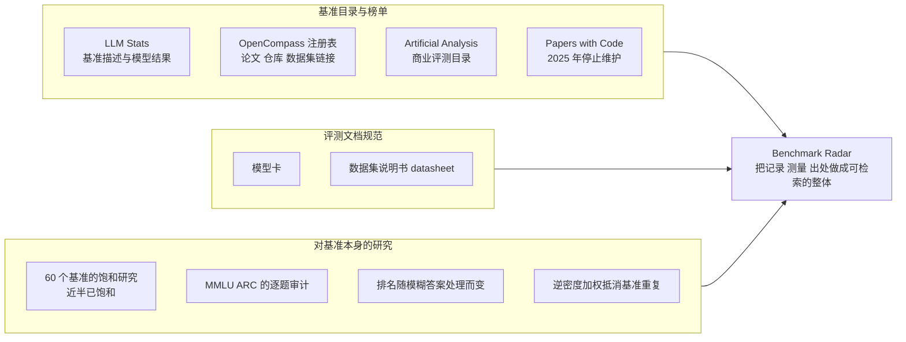
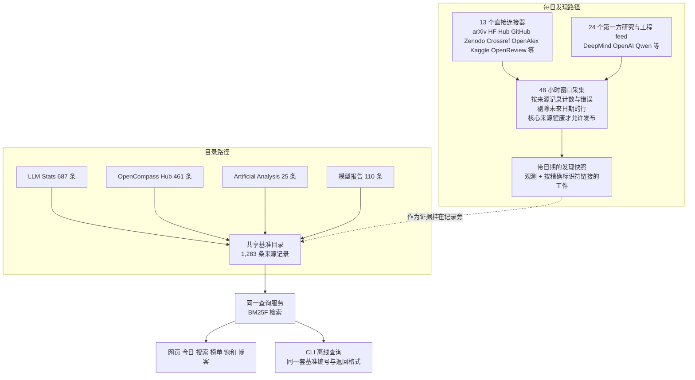

# Benchmark Radar：一个持续更新的 AI 基准数据库与搜索引擎

> **原题**：Benchmark Radar: A Living Database and Search Engine for AI Benchmarks and Evaluation
> **作者**：Koutian Wu, Junjie Zhou, Ergan Shang, Jiayu Wang, Pengqian Han, Junkai Wang, Wanghan Xu
> **机构**：arXiv 页面未列出机构；项目站点 benchmark-radar.org，代码在 github.com/ktwu01/benchmark-radar
> **年份**：2026（arxiv ID 2609.11115，九月十日提交）
> **分类**：cs.AI / cs.IR
> **链接**：https://arxiv.org/abs/2609.11115
> **精读日期**：2026-09-14

## 阅读须知

### 这篇在领域里的位置

这篇论文不提出新模型，也不提出新的评测任务，它属于评测基础设施这一支：研究的对象是「基准本身」，做的事情是把散落各处的基准、数据集、代码与分数报告收拢成一个可以检索、并且保留出处的数据库。过去几年这一支的脉络大致可以分成三段。先是基准的数量爆炸，从 MMLU、GSM8K 这类单一任务，到 HELM、BIG-bench 这类一次打包几十上百个任务的评测套件，再到面向智能体与工具使用的新一代基准，任何一个做模型的团队都很难说清自己该跑哪些评测、别人报的分数是在什么设置下得到的。接着是对基准本身的批评性研究：有人系统地量了六十个语言模型基准，发现将近一半已经饱和，也就是最好的模型已经贴着上限、再往上涨也分不出高下；有人逐条审计 MMLU、ARC 里的题目，发现错题与歧义并不少；有人证明小模型的排名会随着对模糊答案的处理方式而变。最后一段是目录与榜单的运维现实：曾经最常用的 Papers with Code 于二零二五年停止维护，取而代之的是 LLM Stats、OpenCompass 的基准注册表、Artificial Analysis 的商业评测目录，各自覆盖一角，格式互不相通。

Benchmark Radar 位于第三段的延长线上。它把「找基准」这件事拆成两个动作：一是每天发现新出现的基准论文、仓库、数据集与模型发布，二是维护一份带出处的基准目录，把分数、模型身份与引用文献挂在每条记录上。它明确不做的事情也值得先说清：它不评测模型，不给基准打分，不宣称自己的检索比别人更准，它是一份对现状的普查，附带一套可以继续跑下去的采集与查询系统。

### 读完能回答什么

- 数据库里「一条记录」指的是什么，为什么一千二百八十三条记录并不等于一千二百八十三个不同的基准
- 每日发现与目录维护为什么被设计成两条互不混入的路径，发现到的东西为什么不会增加目录的总数
- 七百九十条有分数的记录里，为什么只有八十二条能拿来计算「离满分还差多少」
- 检索用的 BM25F 是什么，作者为什么没有用向量检索，代价是什么
- 榜单页上那条「得分对测得使用量」的帕累托前沿在回答一个什么问题
- 这篇论文的实验部分为什么不是通常意义上的实验，它用什么代替了基线对比

### 阅读前置

假定读者熟悉大语言模型评测的基本概念，知道什么是基准、榜单、准确率与测试集，也用过 GitHub 与 Hugging Face 这类平台；不预设信息检索或数据工程的背景，BM25F、帕累托前沿这些概念在文中第一次出现时都会先铺垫再展开。

### 首次出现的缩写表

- **LLM**（Large Language Model，大语言模型）：本文所说的基准绝大多数是为它设计的
- **BM25F**：经典词匹配检索算法 BM25 的多字段版本，对文档的不同字段（标题、描述、正文）分别加权后再合并打分
- **CLI**（Command-Line Interface，命令行界面）：本文指可以在本机离线查询同一份数据的命令行工具
- **HTTP 接口**：网页版查询走的程序接口，与 CLI 共用同一套基准编号与返回格式
- **DOI / arXiv ID**：文献的持久标识符，本文用它们把不同来源里的同一篇论文对上
- **模型卡**（model card）与**技术报告**：模型发布时随附的说明文档，本文从中抽取「这个模型在哪些基准上报了分」
- **LLM Stats / OpenCompass Hub / Artificial Analysis**：本文目录的三个外部来源，分别是一个基准与分数网站、一个评测平台附带的基准注册表、一个商业评测机构的目录
- **饱和**（saturation）：一个基准上的最好成绩已经贴近上限，无法再区分更强的模型
- **余量**（headroom）：满分与当前最高分之差，只在分数是 0 到 100 的百分制且方向已知时才有意义
- **快照**（snapshot）：一次带日期的采集结果，本文的发现数据按快照保存
- **一级类**（Level 1 class）：本文能力分类法的顶层，共十一个，每条记录恰好属于一个
- **帕累托前沿**（Pareto frontier）：在两个目标上都不被任何其他点同时超过的那些点，本文用它同时看「得分低」与「被用得多」

## 一、问题

### 为什么这个问题值得做

先把痛点落到具体的人身上。一个正在写新评测的研究者，动手之前需要知道同类基准已经有哪些、它们的数据在哪里、代码在哪里、别人报过什么分数；一个正在发布模型的工程师，需要决定跑哪些评测、并且要能解释自己报的数字和竞品报的数字是不是同一套设置。如今要回答这两个问题，需要同时翻论文服务器、代码托管站、数据集平台、厂商的发布页、博客与若干基准目录，而这些地方彼此不通，同一个基准在不同地方叫法不同，同一个分数在不同报告里的测试版本与提示设置也未必相同。于是「找到基准」与「读懂分数」这两件事，每个团队都在各自重复做，做完也不留下可复用的东西。

这个问题在前几年并没有这么尖锐。基准少的时候，一张榜单就够；基准多起来之后，Papers with Code 一度承担了汇总的角色，但它依赖社区人工填写，且已在二零二五年停止维护。此后出现的几个目录各有所长：LLM Stats 收基准名称、描述与模型结果，OpenCompass 的注册表带论文、仓库与数据集链接，Artificial Analysis 维护一份商业评测目录，模型厂商的技术报告则各自列出自己跑过的评测。它们之间没有共享的编号，也没有谁把「这个分数是哪篇文档报的」这条出处链保留下来。与此同时关于基准饱和与污染的研究已经反复指出，很多榜单上的数字并不可比，可这些研究本身也只是一篇篇论文，没有变成一个可以随时查的工具。归根结底，评测领域缺的不是又一个基准，而是一层能把基准、证据与出处连起来的基础设施，并且这层设施要能自己跟上每天的新发布，否则做出来的那一刻就已经过时。

### 具体的技术陈述

把上面的动机落成可验证的目标，作者要做的是一个「活的」数据库加搜索引擎，满足四条要求。第一，每天自动发现新出现的基准论文、代码仓库、数据集与模型发布，并保留发现时的日期与来源。第二，维护一份基准目录，每条记录挂着它的标识符、工件链接、分数观测、模型身份与引用文献，且记录不因缺少分数或日期而被丢弃。第三，提供检索，让人用任务描述找到候选基准，再顺着出处去核对证据。第四，在这份目录上做一次普查，说明它覆盖了什么、缺什么，并借此考察饱和、采用趋势与分数可比性的边界。

### 前人路线与它们不够用的地方

前人的工作可以分成三类，彼此的关系画出来是这样的：

第一类是目录与榜单，它们回答「有哪些基准、谁得了多少分」，但各自只覆盖一角，不互通，且多数不保留分数的出处。第二类是文档规范，模型卡与数据集说明书要求发布者写清评测条件与数据特性，这类工作提供了「该记录什么」的共识，却没有把已经写出来的东西汇集成可查的形式。第三类是研究基准本身的论文，它们证明了饱和、错题与排名不稳定是真实存在的问题，但结论停留在论文里。作者把自己的位置定为对这三类的补充：不重做评测，不重写规范，而是把记录、可用的测量与出处放到同一个可检索的地方。

## 二、方法

### 总体架构：两条输入路径

系统的核心设计只有一句话，却决定了后面所有细节：**发现与目录是两条分开的路径，发现到的东西不会自动变成目录里的记录**。发现路径产出带日期的快照，记录「某天在某处出现了某个基准的提及或发布」；目录路径从基准注册表与模型报告里生成基准记录，供检索与分析。两者共用一套基准编号，但发现观测只作为证据挂在记录旁边，不增加目录的总数。这样做的原因是发现数据天然嘈杂，一个仓库、一条博客都可能提到某个基准，若每次提及都新建记录，目录会在几周内被重复项淹没。

### 发现路径的细节

发现路径接了三十七个来源。其中十三个是直接连接器，覆盖 arXiv 的若干人工智能、语言、视觉与软件类别，Hugging Face Hub 的数据集与 Spaces，GitHub 搜索，以及 Zenodo、Crossref、OpenAlex、Kaggle 数据集与 OpenReview；另外二十四个是研究机构与工程团队的第一方 feed，例如 Google DeepMind、OpenAI、Qwen 的发布页。每次采集看一个四十八小时的窗口，按来源记下条数与出错情况，删掉日期在未来的行，并且要求核心来源都处于健康状态才允许发布这一天的快照。这几条看似琐碎的运维规则正是「活数据库」能不能活下去的关键：一个来源挂了就整天不发布，比发布一份残缺的快照更可取，因为读者无法从快照本身看出缺了什么。

### 目录路径与记录的定义

目录来自四个来源，合计一千二百八十三条**来源记录**。这个词要特别留意：一条来源记录指的是「某一个来源里的一个基准条目」，同一个基准若同时出现在 LLM Stats 与 OpenCompass 里，就是两条来源记录。作者在局限里也明说，来源记录的数量不是不同测试的数量。每条记录的字段包括标识符与工件链接（DOI、arXiv ID、仓库地址），分数观测、模型身份与被引文档，发布日期与引用元数据，任务材料与评测设置。记录不会因为缺少分数、日期或引用而被删除，四百九十三条没有分数的记录仍然留在目录里，其中四百六十四条至少链接到了论文、仓库或数据集之一。

能力分类是另一个单独维护的层。作者把一千二百七十九条记录归入十一个一级领域与六十三个子领域，每条记录恰好属于一个一级类；交互范式与输入模态被作为独立的侧面记录，不与领域混在一起。这样设计是为了避免常见的双重计数：一个既是编程又是智能体的基准，在领域轴上只能占一个位置，它的「智能体」属性通过侧面来表达。

### 检索：为什么是 BM25F

检索这一步作者选了最保守的方案。先铺垫一下 BM25：它是信息检索里沿用了三十年的词匹配打分函数，一个查询词在文档里出现得越多、在整个语料里越罕见，这篇文档得分越高，同时对长文档做归一化。BM25F 是它的多字段版本，把文档拆成标题、描述、正文等字段，各字段单独计词频、乘上不同权重再合并。作者在此之上加了有上界的加分：查询命中基准名称或整个短语时额外加分，但加分封顶，避免名称匹配压倒一切。之所以不用向量检索，作者的理由是可验证性：词匹配的结果可以解释，也不需要一套还没有被评估过的相关性判断来调参；代价是它会漏掉换了说法或改了名的任务，这一点作者在局限里承认。网页与 CLI 走的是同一个查询服务，返回同一种格式，用同一套基准编号，所以在本机离线查到的东西和网页上看到的是一致的。

### 六个界面各自回答一个问题

作者把系统的界面按「读者要问什么」来组织，这张表是理解整个产品意图的捷径：

| 界面 | 读者的问题 | 数据范围 |
|---|---|---|
| 今日 | 今天出现了什么、变了什么 | 当日的发现观测 |
| 搜索 | 哪些基准匹配我这个任务 | 完整目录，含无分数记录 |
| 榜单 | 哪些评测既得分不高、又被广泛使用 | 有分数记录；帕累托前沿视图 |
| 饱和 | 某个基准上报过哪些分数、什么设置 | 逐基准浏览；完整分数历史 |
| 博客 | 能不能读到并分享一份每日简报 | 每日简报与归档 |
| CLI | 能不能在本机核对同一份证据 | 离线查询；同一套基准编号 |

榜单页那条帕累托前沿需要单独说。通常的榜单按分数从高到低排模型，而这里排的是基准：横轴是某个基准上的最高得分，纵轴是这个基准被多少模型报告使用过。处在前沿上的基准是「得分还不高、却已经被很多模型跑过」的那些，换句话说，是既有区分力、又有可比样本的评测；反过来，得分已经贴近满分而使用又广的基准，就是饱和的候选。这个视图把「该跑什么评测」这个问题转成了一个可以用数据回答的形状。

### 一次完整的先行技术检索

论文第五节用一个真实的工作流演示系统的用法：一个编程智能体先用 CLI 在本机检索候选基准，再逐条打开记录里的论文、仓库与数据集链接，读过来源证据之后才把相关工作表拼出来。作者强调这里的分工：系统负责找出候选并给出出处，相关与否的判断仍由人来做。这个例子没有对照组，作者自己也把它列为局限，但它说明了整套设计的用意，即工具的产出是可以核对的证据链，而不是一个直接的答案。

## 三、实验

### 用普查代替基线对比

这篇论文没有常规意义上的实验：没有召回率与精确率，没有与 Papers with Code 或 HELM 的覆盖对比，也没有用户研究。作者用一份对目录与发现数据的普查来代替，普查的目的是让读者知道这个数据库里有什么、没有什么，以及哪些数字可以拿来算、哪些不可以。主要数字如下：

| 项目 | 数值 |
|---|---|
| 来源记录总数 | 1,283（来自 4 个目录） |
| 有数值分数的记录 | 790 |
| 无分数的记录 | 493（其中 464 条仍链接到论文、仓库或数据集） |
| 数值分数观测 | 12,916 |
| 不同的被引文档 | 1,208（支撑 1,278 条记录；5 条无引用） |
| 模型身份 | 868 |
| 链接到论文 / 仓库 / 数据集的记录 | 475 / 506 / 293 |
| 有发布年份的记录 | 615（668 条没有） |
| 带模型发布日期 / 带文档发表日期的分数观测 | 12,594 / 322 |
| 发现观测 / 按精确标识符链接的工件 | 11,068 / 6,546 |
| 快照数 | 46（其中 4 个是模拟的历史回填） |
| 采集截止 | 2026 年 9 月 7 日 |

来源的分布很不均匀：目录里 LLM Stats 占六百八十七条、OpenCompass 占四百六十一条，两者合计近九成；发现数据里五个来源贡献了一万一千零六十八条观测中的九千七百四十三条，占百分之八十八。这意味着「三十七个来源」这个数字说明的是覆盖的广度，不是贡献的均衡。

### 最有说服力的一个数字：八十二

普查里最值得停下来看的，是分数可比性的那一行。七百九十条有分数的记录中，只有八十二条声明了百分制单位、方向已知、数值落在零到一百之间；其余七百零八条用的是其他刻度或未经核实的刻度。也就是说，任何想在这份目录上算「离满分还差多少」的人，只能在大约十分之一的记录上算。这个数字比任何关于饱和的结论都更有分量，因为它说明饱和研究的前提，即分数可比，在目前的公开数据里大多数时候并不成立。作者据此没有报告任何聚合的饱和指标，只把余量计算限制在这八十二条上，这是一个克制而正确的处理。

### 领域构成与智能体基准的位置

分类结果显示，一千二百七十九条记录进入十一个一级领域与六十三个子领域。被标为智能体相关的记录有三百四十五条，其中一百二十八条以「智能体与工具使用」为一级类，一百一十七条落在「编程」之下；这一拆分正是前面说的「一级类唯一、属性作侧面」的设计在数据上的体现，智能体基准有相当一部分本质上是编程评测。按发布年份看，作者给出了构成随时间变化的图，并特别验证了这种变化不是某一年恰好由某个目录供稿造成的假象。

### 文档质量的暗面

一千二百零八篇被引文档支撑了几乎全部记录，但其中一千一百七十一篇缺少机构元数据。这个数字说明出处链虽然存在，链的另一端往往只是一个标识符，读者顺着它能找到文档，却未必能一眼看出这份证据来自谁。

## 四、局限

### 作者自己承认的

作者的局限一节写得直白，值得逐条对照。普查只描述采集截止时的目录，采集上限、失败的请求、缺失的标识符与不同的快照日期都会影响覆盖；来源记录不是不同测试的计数。检索精度、任务适配度与节省的时间都还没有评估，那个工作流示例没有对照基线；词匹配会漏掉改述与改名的任务，评估语义检索需要一套跨查询、跨候选、含冷门基准家族的人工相关性判断，而这套判断目前不存在。arXiv 的发现路径只收新提交，一篇在采集窗口之前首发、之后更新版本的论文不会被回填；作者写第二节相关工作时用的检索就漏掉了两篇相关的早期研究，是一位合著者凭记忆补上的。饱和与分数停滞的测量需要可比的测试版本与设置，且日期要能对应到分数报告或评测发生的时间。能力分类在这次重建里也没有经过验证。

### 读完能看出来的

除了作者列出的，还有几处值得放在心上。第一，目录的实质是对四个既有目录的再聚合，作者自己新增的贡献主要是出处保留、分类层与发现快照，若上游目录停止更新或改变格式，这份目录的新鲜度会随之受限。第二，来源高度集中于 LLM Stats 与 OpenCompass，两者对「什么算一个基准」的口径不同，合并后的一千二百八十三条里有多少重复，论文没有给出去重后的数字。第三，「活」这个定语依赖持续的运维：四十八小时窗口、健康检查、每日发布，这些都是需要人持续投入的事情，论文没有说明团队规模与维护承诺，而 Papers with Code 的前车之鉴正是运维不可持续。第四，BM25F 的字段权重与加分上限是手工设定的，在没有相关性判断集的情况下，这些参数既无法调优也无法说明其合理性。第五，能力分类由谁完成、是人工还是模型辅助，文中没有交代，而这一层直接决定了搜索页的过滤是否可信。这些都不妨碍它作为一个工具的当前价值，但决定了它能不能从一份普查长成一个领域共用的基础设施。

## 一句话

把三十七个来源的每日发现与四个目录的一千二百八十三条基准记录做成带出处的活数据库，并用普查说明其中只有八十二条分数真正可比。
