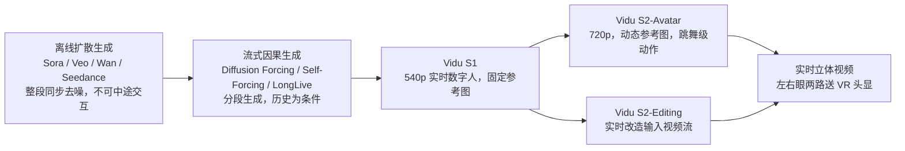
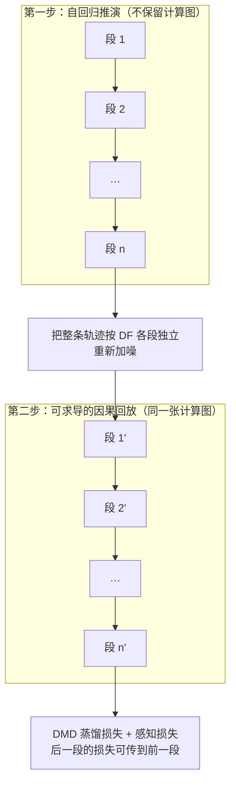
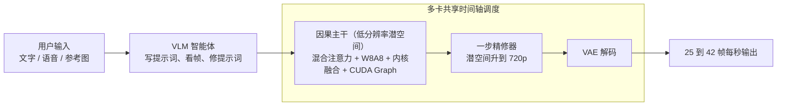
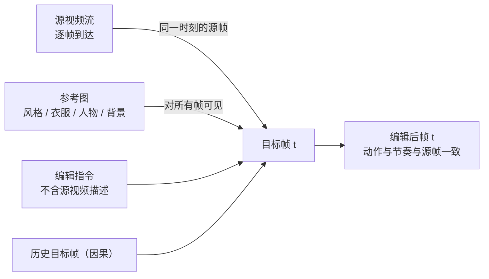

# Vidu S2：实时可交互、可编辑、可立体的视频生成

> **原题**：Vidu S2: Real-Time Interactive, Editable, and Spatial Video Generation
> **作者**：Jintao Zhang, Kai Jiang, Jintao Chen, Xu Wang, Deyuan Liu, Jungang Li, Dechuang Chen, Ming Lin 等三十五人；指导者 Zhijie Deng, Fan Bao, Jianfei Chen, Jun Zhu
> **机构**：清华大学、生数科技（Shengshu Technology）
> **年份**：2026（arxiv ID 2609.11638）
> **分类**：cs.CV / cs.LG
> **链接**：https://arxiv.org/abs/2609.11638
> **精读日期**：2026-09-15

## 阅读须知

### 这篇在领域里的位置

视频生成这一支在过去两年里几乎全部沿着「离线一次性生成」的路走：用户写一段提示词，等待几分钟到几十分钟，最后拿到一段完整的视频。Sora、Veo、Wan、Seedance 都属于这一类，它们把整段视频的所有帧放在一起同步去噪，去噪几十步之后才吐出结果，中途不接受任何干预。这条路对做内容很合适，对「和一个会动的角色面对面说话」这类需求却完全不合适，因为后一种需求要求画面在人说话的同时就变化。

于是从 2025 年起出现了另一支，叫流式或自回归视频生成：把视频切成一小段一小段，每段只依赖前面已经生成的段落，边生成边播放，理论上可以无限长。Self-Forcing、LongLive、Diffusion Forcing 等工作解决的是「怎样让一段一段生成不至于越走越歪」；StreamDiffusion 一类工作解决的是「怎样把速度提到实时」。生数科技 2026 年初发布的 Vidu S1 是这一支里第一批做成产品的系统之一，做到了 540p、每秒 42 帧的实时数字人，用户可以用语音随时改变角色在做什么。

本文是 Vidu S1 的下一代。它把同一套流式生成的骨架往三个方向推：数字人模型升到 720p 并学会跟着指令跳舞、在直播过程中随时换参考图；新增一个能实时改造任意输入视频流的编辑模型；再把两者的输出转成左右眼两路，送进 VR 头显。它是一篇技术报告而不是单点方法论文，价值在于把训练配方、数据流水线、推理栈和评测一并写清楚。

### 读完能回答什么

- 为什么离线扩散模型天然做不了实时交互，流式生成要在结构上改掉什么？
- Self-Forcing 已经让模型在训练时看自己生成的历史了，Self-Replay Forcing 又补上了哪两个漏洞？
- 主干在低分辨率跑、再用一步精修器升到 720p，为什么两者的历史缓存要用不同的噪声水平？
- 实时视频编辑模型靠什么保证输出与输入的动作和节奏严格对齐，同时又不把源视频的内容泄漏进文字条件里？
- 要让这样的模型在廉价 GPU 上跑到每秒 25 到 42 帧，推理栈动了哪几刀？
- 在 StreamAV-Bench、Sparkle-Bench、OpenVE 与 RefVIE、ViViD 这几个基准上，它比开源与商用系统好多少，人工评测又怎么说？

### 阅读前置

假定读者熟悉扩散模型的基本流程（加噪、去噪、时间步）和 Transformer 的注意力机制，写过 PyTorch，但未必专门做过视频生成，也未必了解流式生成或蒸馏方法。凡是第一次出现的术语都会先说它解决什么问题，再说它怎么做。

### 首次出现的缩写表

- **DiT**（Diffusion Transformer）：用 Transformer 代替 U-Net 做扩散模型主干的结构，视频生成的主流选择。
- **I2V / R2V**（Image-to-Video / Reference-to-Video）：以首帧为条件生成视频，以及以一张参考图（不一定是首帧）为条件生成视频。
- **KV cache**：注意力层中把历史 token 的键与值存下来，避免每生成一段都重算全部历史。
- **Teacher Forcing**：训练时把干净的真实历史喂给模型，让它预测下一段。
- **Diffusion Forcing（DF）**：训练时给历史加上随机噪声再喂给模型，让它学会在不完美的历史上生成。
- **Self-Forcing**：训练时让模型以它自己生成的历史为条件，使训练分布与推理分布一致。
- **SRF**（Self-Replay Forcing）：本文提出的训练方法，先让学生模型自回归地走一长段，再把整段重新加噪、在一次可求导的因果前向里「回放」，用蒸馏损失监督。
- **DMD**（Distribution Matching Distillation）：分布匹配蒸馏，让少步学生模型的输出分布对齐多步教师模型的输出分布。
- **DPO / NFT**：直接偏好优化（Direct Preference Optimization）与负样本感知微调（Negative-aware Fine-Tuning），两种基于人类偏好或奖励的后训练方法。
- **RoPE**（Rotary Position Embedding）：旋转位置编码，用来告诉注意力每个 token 在空间和时间上的位置。
- **VAE**：变分自编码器，这里指把像素压成潜变量、再把潜变量还原成像素的编码器与解码器。
- **W8A8**：权重与激活都量化到 8 比特的矩阵乘法。
- **VLM**（Vision-Language Model）：视觉语言模型，能同时读图和文字。
- **GSB**（Good / Same / Bad）：成对人工评测协议，评测者对两个系统的输出判定「更好、一样、更差」。
- **FVD / FID**：视频与图像的分布距离指标，越低越接近真实分布。

## 一、问题

先说这个问题为什么值得做。今天的视频生成模型在「做一段内容」上已经很强，但人对视觉的需求并不只是看做好的片子。面对面聊天、直播、游戏、和一个虚拟角色说话，这些体验的共同点是画面必须立刻回应人的动作。作者在引言里算了一笔账：离线生成的视频可以反复播放、转发，所以生成需求大致按「用户数除以平均观看次数」增长；实时交互的内容每个人每一分钟都要单独生成，需求按用户数乘以使用时长增长。只要交互式体验普及，它的生成量会远大于离线内容。换句话说，实时交互式视频生成不是离线生成的附属功能，而是一个体量更大的方向。

这条路上过去的努力到了哪里。Vidu S1 已经做到了实时、无限长、不糊不漂的数字人，靠的是 TurboDiffusion 与 TurboServe 两套加速栈，在消费级 GPU 上跑到 540p、每秒最多 42 帧。但它有四个明显的边界：分辨率停在 540p；一旦开播，定义角色的参考图就固定了，中途不能换；大幅度的身体动作，比如跳舞，跟不上；只能生成，不能对一条输入的视频流做编辑。本文要解决的就是这四件事，并且顺带探一探把结果做成立体视频的可行性。

再把技术难点落到可验证的陈述上。第一，流式生成一段接一段，误差会从前一段传到后一段，最后表现为漂移或崩塌；已有的 Self-Forcing 让模型在训练时以自己生成的历史为条件，方向是对的，但它把自生成历史以「干净」的形态喂进去，而推理时历史是带噪的，并且这段历史是从计算图上摘下来的，梯度传不回去。第二，分辨率翻倍意味着算力翻倍以上，直接把主干放大做不到实时。第三，实时编辑要求输出与输入逐帧对齐，任何跨帧的错位都会让用户立刻察觉，因为用户在直接比对自己的动作和屏幕上的动作。第四，所有这些都要在有限的 GPU 上以每秒 25 到 42 帧交付。

前人的路线之间有一条清楚的继承关系，下面这张图把它画出来。

## 二、方法

### 2.1 数字人模型 Vidu S2-Avatar 的数据

数据这一节看似琐碎，但本文最实在的几处改进就在这里，而且直接对应引言里的边界。数据流水线沿用 Vidu S1 的五个阶段：切片、过滤、语音处理、打标、嵌入。在此之上，为了让模型学会大幅度的身体动作，作者专门补充了独舞视频和二维、三维动画。

切片阶段解决的是「暗剪」问题。开箱类视频经常把中间过程剪掉只留头尾，这种剪点很难被镜头检测器发现，而把检测阈值调高又会产生大量误报。作者的做法是先按较宽松的阈值找出候选剪点，再在候选点前后抽帧交给视觉语言模型做二次判断，最终保证片段内没有剪辑，误拒率控制在很低的水平。

过滤阶段新增两个算子。一个是「高清晰度筛选」：同样标称 1080p 的视频，压缩策略不同，实际清晰度差别很大，只看分辨率会把糊片放进训练集。于是作者先用分辨率与帧率做硬阈值，再联合编解码器、像素格式、位深、码率评估，最后用专家模型打纹理细节、边缘锐度与压缩伪影的分，加权成一个质量分做阈值。另一个是「背景稳定化」：舞蹈视频常有环绕、推拉、变焦和跟拍，全部丢掉会损失动作多样性，直接保留又会让模型学不会背景一致性。作者观察到这类视频里相机平移很小，视觉变化主要来自旋转与焦距，视差不大，于是先把前景人物掩掉，从背景估计相机变换，再做几何校正与裁切，得到背景静止的版本，最后再过一遍确认人物没有出画。

打标阶段换了表示方式。Vidu S1 用的是分字段的结构化描述，主体、环境、运镜各写一栏，这种格式说不清事件之间的先后与因果。Vidu S2 改用按时间顺序排列的密集描述，例如「2.5 秒到 3.8 秒之间做了某个动作，随后产生了某个结果」，片段级的描述也改为按事件边界切分，而不是按固定时长或语音对齐切分。这一改动的直接收益是模型对新指令的响应更快、动作切换更连贯。标注流水线本身是多智能体分工：先由目标检测与语音识别等专家模型产出一层事实，再由识别、描述、校验、过滤四类智能体接力。

### 2.2 数字人模型的训练

模型本体是一个音视频联合的扩散 Transformer。先解释这个词：扩散 Transformer 是把去噪网络换成 Transformer 的扩散模型，这里的「音视频联合」指视频潜变量与音频潜变量一起进入同一个网络、一起去噪，所以口型和声音天然同步。条件有三样：一张参考图（所有段共享，用来锁定身份和外观）、每一段自己的描述（而不是整段视频一条提示词）、以及历史段落。

训练分三个阶段，每个阶段解决一个具体问题。

第一阶段是双向模型的联合训练。「双向」指时间维度上任何一帧都能看到前后所有帧，这是离线模型的常态，生成质量最好但不能流式。作者在这一阶段同时训练首帧到视频与参考图到视频两种任务，区别只在条件图是首帧还是任意参考图。关键的小改动是：每一段都用自己那一段的描述去监督，而不是像常规做法那样整段视频只用一条提示词。作者报告这一改动大幅提升了指令跟随，且不损失原有质量。

第二阶段是因果化。把双向的时间注意力换成分块因果掩码，让每一段只能看到参考图、当前段的条件和已有的历史。为了让模型既会用干净历史也会用带噪历史，训练时按预设概率在 Teacher Forcing 与 Diffusion Forcing 之间切换：前者喂真实的干净历史，后者给历史加上随机噪声。这一阶段给了模型初步的流式能力和对历史误差的鲁棒性。

第三阶段是本文的核心贡献 Self-Replay Forcing。先说它要补的两个洞。Self-Forcing 让学生模型在训练时以自己生成的历史为条件，这解决了「训练看真实历史、推理看自己历史」的错配。但 Self-Forcing 喂进去的自生成历史是干净的，推理时缓存里的历史却是带噪的；并且这段历史从计算图上被摘掉了，后一段的损失传不到前一段。SRF 的做法分两步：第一步，让当前学生模型按推理流程自回归地走一长段，生成的块和键值缓存都摘下来，不保留这一段的计算图；第二步，把这条自生成轨迹的所有段按 Diffusion Forcing 的方式各自独立重新加噪，然后在一次开着梯度的因果前向里整段「回放」，用分布匹配蒸馏的损失监督回放段里的每一块。因为回放段内的表示都在同一张计算图里，后一块的损失可以传到前一块，而原始的那次长程推演不参与反传，显存与计算都可控。作者还沿用 Vidu S1 的感知正则，对回放输出加一项感知损失防止模式坍缩，并保留了锚定块、滑动窗口上下文和带噪键值缓存这些流式生成的常规部件。

在三个阶段之外还有两处偏好优化。双向阶段用扩散版的 DPO 提升画面保真、表情、动作自然度和音画同步，目的是给后面的因果化提供更强的教师；流式阶段则对因果主干做流式 NFT，样本仍按 SRF 的方式构造，先摘图推演再回放，用奖励做优化，这样优化时看到的状态与推理时一致。

### 2.3 分辨率：主干低清跑，精修器一步升清

要在实时预算内从 540p 升到 720p，作者不放大主干，而是让主干继续在低分辨率潜空间里跑，另加一个一步式的超分精修器，直接在潜空间把低清潜变量上采样、加一次固定时间步的噪声、再预测高清潜变量。

值得单独说的是两套缓存的噪声不对称。主干的历史缓存保持在较高的噪声水平，精修器的高清历史缓存保持在较低的噪声水平。之所以这样设计是因为两者的职责不同：主干负责传播粗粒度的运动和长程时间结构，高噪缓存对高频伪影不敏感，长程运动更稳；精修器负责恢复局部外观和身份细节，低噪的高清缓存正好保留这些线索。这是 Vidu S1 里 TwinCache 思路的延续，效果是主干守住长程一致性，精修器补回细节而不扰动时间轨迹。

### 2.4 推理栈

推理栈的目标是让上述模型在低价 GPU 上跑到每秒 25 到 42 帧，做法是四刀。第一刀在注意力：不同层对近似计算的敏感度不同，于是逐层在 SageAttention、SpargeAttention 与稀疏线性注意力之间选择，不敏感的层用更激进的方法。第二刀在线性层：逐张量或逐通道量化会被少数离群值拖垮精度，作者实现了逐块缩放的 W8A8 矩阵乘法 CUDA 内核，细粒度缩放限制离群值的影响。第三刀在内核层面：流式推理反复执行大量短小算子，启动与同步开销显著，于是把相邻算子融合成自定义 Triton 或 CUDA 内核（例如 RMSNorm 与逐元素操作合并），并用 CUDA Graph 把稳定的执行序列一次捕获、反复重放。第四刀在多卡：用 Ulysses 式的上下文并行切分负载与激活显存，并对卡间交换的张量做量化以降低通信量。

编辑模型另有一处调度改进：VAE 编码器、主干、精修器、VAE 解码器在流式推理的不同阶段活跃，静态地给每个模块预留一组 GPU 会让闲置模块占着卡。作者改为在共享时间轴上做细粒度调度，主干或精修器不用某些卡时，编码器与解码器可以复用它们。

### 2.5 智能体层：让「随时换参考图」真的可靠

模型层面支持参考图条件还不够，用户中途扔进来一张杯子、一件衣服或一个背景，系统要判断这张图是什么、该怎么改提示词、改完有没有做到。作者在模型外面放了一个视觉语言模型智能体，做四件事。写提示词时把角色的身份外观、表情视线姿态动作、手里应该一直拿着的东西分开描述，并且保留用户没有要求改变的细节，比如「拿起杯子，然后微笑」在杯子拿起之后，后续提示词都要明确写「继续拿着杯子」。看帧反馈时按时间顺序检查动作是完成、部分完成还是做错了，只有置信度足够、必要时多次观察一致，才把「完成」写进下一条提示词。处理参考图时先判断它是手持物、背景还是衣服，再与用户请求合成变化描述。摘戴配饰时把「动作过程」与「之后是否仍然戴着」都写清楚。

### 2.6 编辑模型 Vidu S2-Editing

编辑模型要做的是对一条正在输入的视频流实时施加四类改动：整体风格重绘、换衣服、换人物、换背景，每种改动由一条文字指令和一张可选的参考图指定。

数据是自己造的。从数字人流水线过滤后的视频里按更严的标准取一批高质量素材，分成四个互不重叠的子集对应四个任务。以风格迁移为例：先训练一个条件生成模型，输入是一段视频的表面法线序列（用 NormalCrafter 这类模型从原视频估计）加一张从原视频抽出的参考帧，目标是重建原视频，这样模型学会「结构与运动听法线的，外观听参考帧的」；造数据时把参考帧换成一张风格化图片、法线序列不变，就得到运动完全一致的风格化版本。作者称这一方法泛化到五十多种写实与非写实风格。其他三类任务按同样思路微调专用模型造对，同时引入 Bernini、SCAIL-2、Wan2.1 VACE、SAMA-14B、CoinVE-Edit 等开源编辑模型补充候选，观察到没有一个模型在所有场景都最好，于是做后过滤与比较筛选，留下高质量的源视频与编辑后视频配对。

打标有一个细节直接关系到流式可行性：生成描述时不把源视频喂给视觉语言模型，描述只写编辑目标、参考图相关属性和「保持其他内容不变」的约束。这样源视频的内容不会通过文字条件泄漏进模型，模型只能从视频条件本身读取源内容，流式时才不会依赖一段它还没看到的整体描述。

模型结构上，源视频和参考图被编码成条件 token，与带噪的目标视频 token 拼接，用条件专属的旋转位置编码标明各路 token 的时空位置。关键设计是「逐帧对齐的注意力」：生成的每一帧只能与同一时刻的源帧交换信息，不允许跨时刻混合；参考图则对所有帧可见，让新的外观贯穿整段视频。这一约束既保证了输出与输入的动作和节奏严格一致，也让模型结构天然兼容后面的因果化。流式化的训练与数字人模型同一套：先双向训练建立先验，再换因果掩码、混合 Teacher Forcing 与 Diffusion Forcing，最后做 Self-Replay Forcing。推理时每一个源帧与它对应的目标帧一起被消费，不进缓存。

### 2.7 立体视频

立体视频给两只眼睛略有差异的画面，让人感到深度和距离。作者没有训练新的立体生成模型，而是在流式管线里加一个转换阶段：对每一帧估计深度，映射成水平视差，把单目帧当作中心视角向左右两个方向分别形变，得到左右眼视图；形变会在物体边缘和新露出的区域留下空洞，用轻量处理填补；对深度做时间平滑以减少深度感的抖动；最后把两路同步成流式块。编辑一侧支持两种输入：单目输入先编辑再转换；已经是立体的输入则把左右两路横向拼成一条宽视频一次编辑，再拆回两路。作者在讨论里坦白，头显里的立体视频占据的视野更大，对分辨率和延迟的要求都比平面实时生成更高，尤其是透视模式下延迟会让头部运动与画面脱节，这仍是未解决的难题。

## 三、实验

### 3.1 设置

评测分两个任务。数字人生成用公开的 StreamAV-Bench，它有渐进与交互两个赛道，各一百六十个场景，交互赛道每三十秒给一次运行时更新，共五次，最长跑到一百八十秒；商用系统则用内部基准，覆盖流式质量、长程稳定、运行时更新、打断与恢复、音画同步、响应与成本。视频编辑用 OpenVE-Bench、Sparkle-Bench、RefVIE-Bench 和 ViViD 测试集，分别测指令编辑、带参考图的主体与背景替换、无配对虚拟试衣；内部基准另建了十分钟级的长程集，测身份保持、编辑区域在运动与遮挡下的稳定性、生成背景的时间稳定性。

对照系统的数量很大。数字人一侧有 PixVerse R1、HappyOyster、OmniForcing、Odyssey-2、Self-Forcing、LongLive、SWIFT、IAMFlow、SoulX-FlashTalk、AptAvatar、Live Avatar、AvatarForcing、Hallo-Live 等开源系统，以及 Runway、HeyGen、PixVerse 等商用系统；编辑一侧有 Bernini-R、Kiwi-Edit、VInO、OmniWeaving、LiveEdit、VACE、JoyAI-Video-Edit、StreamDiffusionV2、XMax-X2.0、Decart-Lucy2.5 以及一组试衣模型。作者强调所有系统使用相同的输入、预处理、时间采样、评测器与评分规则，只在来源报告了同一基准、同一切分、同一指标时才复用已发表数字，否则留空。人工评测由二十名受过校准的专业评测者按 GSB 协议做成对比较，保留每个样本的输入对、随机种子、模型版本、服务区域与标注记录。

### 3.2 主要数字

StreamAV-Bench 上 Vidu S2-Avatar 在报告的九项指标里全部第一。下面挑几项与最强对照并列。

| 指标 | 含义 | Vidu S2-Avatar | 最强对照 |
|---|---|---|---|
| VA 视觉美学 | LAION 美学预测器 | 0.687 | Live Avatar 0.661 |
| VQ 视觉质量 | Gemini 评判 | 3.370 | Live Avatar 3.295 |
| AQ 音频质量 | Gemini 评判 | 3.286 | HappyOyster 3.157 |
| AVAlign 音画语义对齐 | ImageBind 相似度 | 0.353 | LongLive 0.272 |
| AVSync 音画同步误差（越低越好） | Synchformer | 0.617 | SoulX-FlashTalk 0.648 |
| AIF 音频指令完成度 | 清单式 | 2.985 | SWIFT 2.887 |
| SC 主体一致性 | 长程协议 | 0.998 | Live Avatar 0.997 |
| BC 背景一致性 | 长程协议 | 0.993 | Live Avatar 0.989 |

值得注意的是提升分布在互补的维度上而不是集中在某一项：音画语义对齐 0.353 对 0.272 是差距最大的一项，说明「说什么就做什么」这一层比现有系统强得多；主体与背景一致性已经接近上限，说明长程漂移基本被压住了。

视频编辑一侧，Sparkle-Bench 七项全部第一，总分 3.74，高于最强的流式对照 Decart-Lucy2.5 的 3.67 与最强开源离线模型 Kiwi-Edit 5B 的 3.57；OpenVE 与 RefVIE 联合评测总分 4.26，比最强离线基线 Bernini-R 14B 高 0.34，其中 OpenVE 的整体风格 4.71、背景替换 4.14，RefVIE 总分 3.78，比 Decart-Lucy2.5 高 0.07。无配对虚拟试衣的 ViViD 测试集上，分布距离 VFID 为 9.95，此前最好的 CatV2TON 是 19.51，ViViD 本身是 21.80，差距接近一倍。

| 基准 | 指标 | Vidu S2-Editing | 最强对照 |
|---|---|---|---|
| Sparkle-Bench | 总分 | 3.74 | Decart-Lucy2.5 3.67 |
| OpenVE + RefVIE | 联合总分 | 4.26 | Bernini-R 14B 3.92 |
| RefVIE | 总分 | 3.78 | Decart-Lucy2.5 3.71 |
| ViViD 试衣 | VFID（越低越好） | 9.95 | CatV2TON 19.51 |

### 3.3 人工评测与长程曲线

作者补充人工评测的理由是自动指标抓不住长视频里逐渐累积的身份漂移和时间不一致。按时长分层的曲线从十秒画到九十秒，五个维度（整体、一致性、画质、动作、情绪表达）Vidu S2-Avatar 全程最高，且一致性到九十秒仍保持高位。与商用系统的 GSB 比较里，整体质量一项对 Runway Character GWM-1 的偏好率是 85.7%，对 PixVerse Image Avatar 与 HeyGen 均为 100%；动作与表情质量对 Runway 与 HeyGen 一致偏好；语义遵从的偏好率在 71.4% 到 100% 之间；画质的偏好率在 57.1% 到 71.4% 之间，是差距最小的一项。音画同步上对 PixVerse 与 HeyGen 全部为「偏好或等同」，对 Runway 只有 42.9% 的直接偏好。编辑一侧的内部基准有一百五十对样本，一致性平均分 Vidu S2-Editing 3.56、Decart-Lucy2.5 2.59、XMax-X2.0 1.67，整体质量与时间一致性两项优势最大。

有一个数字要单独拎出来看：商用系统的 GSB 里出现了多项 100% 偏好率。这固然说明差距明显，也提示比较样本数不大（85.7% 与 42.9% 都是七分之几的倍数，说明每组对照大约只有七个样本），这一层结论的统计力度远不如公开基准。

### 3.4 定性案例

定性部分主要展示对照系统的失败模式：PixVerse 出现脸部身份与身体比例漂移，Runway 在头发、手指、眉毛上出现扭曲；编辑任务里 XMax-X2.0 在胸口生成了不存在的文字、换牛仔装时凭空多出一个人、换背景时保留原场景不动，Decart-Lucy2.5 则把花纹放错位置、换错衣服款式、把咖啡馆布局改得与参考不符。Vidu S2 在这些例子里保持了身份、手与物体的交互、衣物边界与遮挡关系。立体视频只给了几组左右眼视图作为可行性展示，没有量化指标。

## 四、局限

作者承认的部分集中在立体视频：头显里画面占据大视野，需要比平面实时生成更高的分辨率和更低的延迟，透视模式下延迟会造成头部运动与画面脱节；当前只做到固定视角的立体视频，全景与自由转头是未来方向。此外全文没有报告参数量、训练算力、训练数据总量与推理所用的具体 GPU 型号与数量，「低成本 GPU」与「25 到 42 帧每秒」缺少可复现的硬件条件。

读完能看出的其他边界还有几处。第一，所有训练数据、造数据用的专用模型、推理栈与产品都是闭源的，论文提供的是在线试玩而不是权重或代码，第三方无法验证任何一个数字。第二，Self-Replay Forcing 没有消融实验：论文没有单独对比「Self-Forcing 加带噪历史」「Self-Forcing 加跨块梯度」与完整 SRF 的差别，所以无法判断两个改动各自贡献多少，也无法判断收益是否主要来自数据与偏好优化。第三，公开基准的评判者大量依赖 Gemini 一类模型打分，这些评分器对流式系统特有的伪影是否敏感，作者自己也在人工评测一节承认存疑。第四，商用系统的 GSB 样本量很小，而且部分对照是产品 API，版本与服务区域会随时间变化，结论的时效性有限。第五，编辑模型的实时性只做了定性说明，没有给出端到端延迟的数字，而作者自己也说编辑任务对延迟比生成任务更敏感。第六，数据流水线里大量使用视觉语言模型与专家模型做判断，这些模型的偏差会传进训练集，例如背景稳定化只保留相机运动平缓的舞蹈视频，模型对大幅运镜下的动作生成能力可能被系统性低估。

## 一句话

生数把实时数字人推到 720p 并加上实时视频编辑与立体输出，核心训练技巧是让模型回放自己的生成轨迹并在带噪、可求导的条件下做蒸馏。
