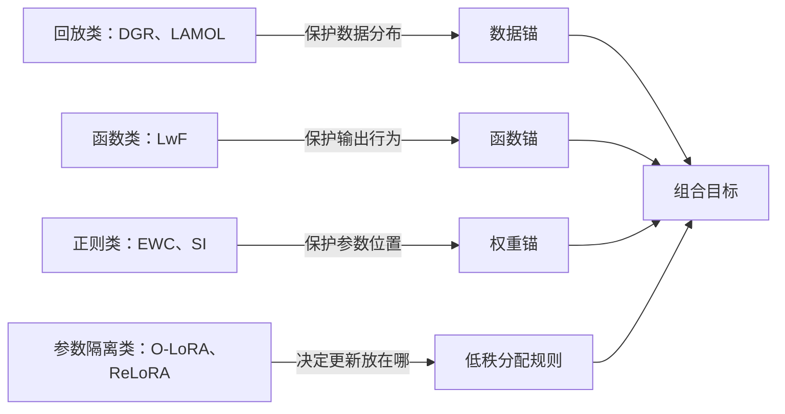
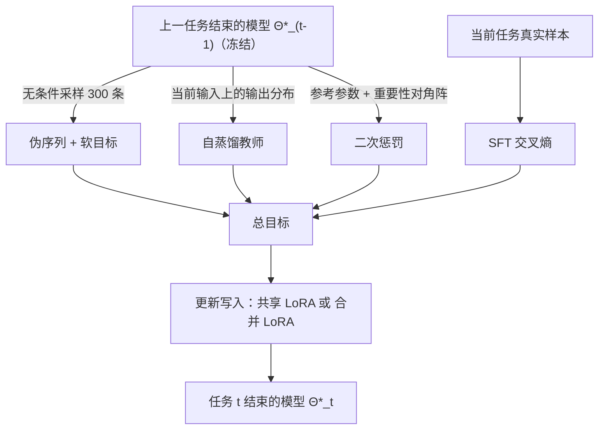
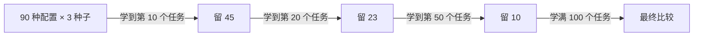

# 持续学习机制可以组合：面向长程记忆的语言模型微调

> **原题**：Continual Learning Mechanisms Compose for Long-Horizon Memorization
> **作者**：Zheyuan Zhang, Alvin Zhang, Daniel Khashabi, Tianmin Shu
> **机构**：Johns Hopkins University
> **年份**：2026（arxiv ID 2609.06986，v1 于 9 月 7 日提交）
> **分类**：cs.LG
> **链接**：https://arxiv.org/abs/2609.06986 ，项目页 compose-cl.github.io
> **精读日期**：2026-09-16

## 阅读须知

### 这篇在领域里的位置

持续学习（continual learning）研究的是一个模型在一串任务上依次训练、而不能回头重看旧数据时，如何不把先前学到的东西忘掉。这个方向在视觉分类上已经做了十年，积累出三大家族的方法：重放旧数据或伪数据的「回放」类，约束新旧模型输出一致的「蒸馏」类，以及限制重要参数改动幅度的「正则」类。语言模型兴起后，社区把同一套方法搬到大模型上，但评测的任务序列通常只有几个到十几个，关注的也多是下游任务之间的迁移，而不是「模型有没有把一条条具体的事实记住」。

这篇论文把问题重新界定为「长程记忆」：一百个问答任务按顺序喂给模型做监督微调，旧样本一律不保留，推理时也不告诉模型这条问题属于哪个任务。它的核心结论不是提出一种新机制，而是证明既有机制之间存在互补，把三类「锚」与低秩适配器的分配规则组合起来，能把最终保留率从百分之一点二提到百分之三十四点九。它位于「大模型知识注入」与「持续学习方法学」两条线的交汇处，属于把老问题拉长尺度之后重新做系统测量的工作。

### 读完能回答什么

- 为什么天真地按顺序微调一百个任务之后，模型几乎把前面的全忘了，保留率只剩百分之一点二？
- 数据锚、函数锚、权重锚分别在保护什么，它们各自的损失项怎么写？
- 「共享 LoRA」与「合并 LoRA」的区别是什么，为什么合并到主权重再开新适配器反而记得更牢？
- 作者怎样用「任务级逐步淘汰」把九十种配置的搜索成本压下来？
- 组合带来的增益里，哪一对机制是真正超加性的，哪一对反而互相拆台？
- 记住了具体问答，是否意味着模型的通用能力也保住了？

### 阅读前置

假定读者熟悉 Transformer 语言模型的监督微调流程、交叉熵损失与 LoRA 低秩适配的基本形式，知道 KL 散度可以用来约束两个输出分布。不假定读者做过持续学习，涉及的 EWC、SI、LwF 等经典方法都会在首次出现时给出铺垫。

### 首次出现的缩写表

- **CL**（Continual Learning，持续学习）：模型在任务流上依次训练且不能完整保留旧数据的学习设定。
- **SFT**（Supervised Fine-Tuning，监督微调）：用带标准答案的样本以交叉熵损失微调模型。
- **LoRA**（Low-Rank Adaptation，低秩适配）：冻结主权重，只训练一对低秩矩阵 A、B，用 W + BA 的形式施加更新。
- **EWC**（Elastic Weight Consolidation，弹性权重固化）：以费雪信息估计参数重要性，对重要参数的改动加二次惩罚；Online EWC 是它的滚动版本。
- **SI**（Synaptic Intelligence，突触智能）：沿优化轨迹累积每个参数对损失下降的贡献来估计重要性的正则方法。
- **LwF**（Learning without Forgetting，不忘学习）：用旧模型作教师、在新任务输入上做输出蒸馏的函数级约束。
- **O-LoRA**（Orthogonal LoRA）：为每个任务保留独立 LoRA 并惩罚新旧子空间重叠的参数隔离方法。
- **ReLoRA**：把 LoRA 更新周期性合并进主权重再重新初始化的训练模式，本文的合并 LoRA 借用了这一模式。
- **TSH**（Task-level Successive Halving，任务级逐步淘汰）：本文提出的超参搜索流程，按任务数分阶段淘汰表现差的配置。

## 一、问题

先讲清楚这个问题为什么值得做。今天的语言模型知识都是预训练时一次性写进参数里的，之后世界继续变化，用户希望模型记住新的事实、新的对话、新的项目细节。把这些信息塞进上下文窗口或者外挂检索是权宜之计，长期来看还是要让模型「学进去」。可是一旦按顺序微调，新的更新会覆盖旧的记忆，这就是灾难性遗忘。业界目前的做法是定期把所有数据重新混合再训一遍，代价是保留全部历史数据并反复付出训练成本。

过去几年持续学习方向的努力，多数停留在几个到十几个任务的短序列上，评的也往往是下游任务的迁移表现。这样的实验尺度看不出一件事：某种机制在十个任务上还撑得住，到一百个任务时是否已经崩掉。作者认为，如果目标是让模型持续吸收事实，就必须把序列拉到足够长，并且直接测量「事实是否还在」。

于是他们把问题写成一个明确可验证的陈述：有一百个任务 T₁ 到 T₁₀₀，每个任务是一批查询与答案的配对；模型从任务一开始依次做监督微调；训练任务 t 时不能访问任务 t 之前的任何原始样本；推理时只给查询，不给任务编号。评价用一个「时间准确率矩阵」：学完前 i 个任务后，在任务 j 的查询上做精确匹配，记为 M_{i,j}。由此派生三个指标：**最终保留率**是学完一百个任务后在全部任务上的平均准确率；**即时习得率**是每个任务刚学完时的准确率；**遗忘量**是从峰值到最终的平均跌落。作者还定义了**记忆半衰期**：一个任务学完之后，要再学多少个任务它的准确率才会跌到初始值的一半。

在这个设定下，天真的顺序微调把最终保留率打到百分之一点二，也就是几乎全忘。作者测试了各家族的单一机制，结论是「我们评估的任何单一机制都无法在这个尺度上保持强保留」，最强的单一机制在三个数据集上分别只到百分之四点二、七点五与十二点五。

前人的路线在这里各有短板。回放类方法（Deep Generative Replay、LAMOL）用生成器造伪样本，只保护了数据分布这一层；正则类方法（EWC、Online EWC、SI）只约束参数，不管输出；函数类方法（LwF）只约束当前输入上的输出分布；参数隔离类（O-LoRA、OSRM）为每个任务保留独立子空间，状态随任务数线性增长。知识编辑那一支（GRACE 等）处理的是精确修改单条事实，与这里把事实当普通训练数据的设定不同。作者的判断是，这些机制分别堵住遗忘的一个来源，单独用时其他来源仍然敞着。

## 二、方法

作者把设计空间整理成两条正交的轴。第一条轴回答「保护什么」，叫作**锚**（anchor），分数据、函数、权重三种；第二条轴回答「新的更新写到哪里」，叫作**低秩分配规则**，分共享与合并两种。任何一种组合都是同一个训练目标里各项的开或关。

先说数据锚，也就是生成式回放。持续学习里「回放」的意思是训练新任务时混入一些旧任务的样本，可是本设定不允许保留旧样本，所以只能让模型自己生成。作者的做法是：每个任务开始前，冻结上一个任务结束时的模型，从一个与任务无关的回放标记出发无条件采样，生成三百条伪序列，丢掉空输出。训练时每一个当前任务的小批次都配一个回放小批次，冻结模型还为回放序列提供软的下一词分布做目标。写成损失项是 ℛ_D(Θ) = E_{z∼Q_{t−1}}[ℓ_D(Θ, z)]，其中 Q_{t−1} 是上一个模型的生成分布。要调的超参数有两个，回放项权重与采样温度，搜索空间取权重 0.5 或 0.75、温度 1.0 或 1.5 的四种组合。

再说函数锚，也就是自蒸馏。蒸馏原本是让小模型模仿大模型的输出分布，这里模仿对象换成「上一个自己」：把上一任务结束时的模型冻结为教师，在当前任务的输入上要求当前模型的输出分布与教师一致。损失项写成 ℛ_F(Θ) = E_{x∼μ_t}[d(q_{t−1}(·|x), p_Θ(·|x))]，d 是分布间的距离。它与数据锚的区别在于作用的输入不同：数据锚把软目标用在生成的伪序列上，函数锚只用在真实的当前任务数据上。实验里评了两档权重，SD₁ 取 1，SD₂ 取 3。

第三是权重锚，也就是重要性正则。它的想法是给每个参数估一个「对旧任务有多重要」的分数，越重要的参数越不允许远离旧值。二次惩罚的形式是 ℛ_W(Θ) = ½(ϑ − ϑ*_{t−1})ᵀ H_{t−1}(ϑ − ϑ*_{t−1})，其中 ϑ*_{t−1} 是上一任务结束时的参数，H_{t−1} 是对角的重要性矩阵。作者比较了两种估法：SI 沿优化轨迹累积每个参数对损失下降的贡献，每个任务结束后保存一份参考张量与一份重要性张量，下一任务开始前丢弃；Online EWC 则维护一个滚动的对角费雪信息作为重要性，参数中心取最新值。

第四是低秩分配规则，这一条决定更新写到哪里。**共享 LoRA** 是 W_t = W₀ + ρB_tA_t，一百个任务始终优化同一对 A、B，相当于一个不断被覆写的适配器。**合并 LoRA** 是 W_t = W_{t−1} + ρB_tA_t，每个任务用一对新的 A、B，训完后把 ρB*A* 折进稠密权重 W_{t−1}，再为下一任务重新初始化适配器与优化器。两种规则的状态大小都不随任务数增长，始终是一份稠密模型加一对低秩矩阵，这是它们与 O-LoRA 这类逐任务累加子空间的方法的关键区别。

四样东西合在一个目标里：Θ_t = argmin ℒ_SFT(Θ) + ℛ_D(Θ) + ℛ_F(Θ) + ℛ_W(Θ)，任意一项可以关掉记为 ∅，这样就能做因子分析。

最后是搜索流程。三种权重锚（∅、Online EWC、SI）乘三种函数锚（∅、SD₁、SD₂）乘五种数据锚（∅ 加四组回放超参）乘两种分配规则，一共九十种配置，每种跑三个种子，全程一百个任务的话成本过高。作者提出任务级逐步淘汰：所有配置先跑到第十个任务，按三个种子的平均保留率排序，留前四十五；跑到第二十个任务留二十三；到第五十个任务留十；剩下的十种跑完一百个任务。评分函数取三个种子上、前 r 个任务的平均保留。

需要说明的是，基座模型的名称、LoRA 的秩与学习率等放在附录 B.8，论文正文以及本次能读到的网页版都没有点名，读者若要复现应直接查原文附录。

## 三、实验

三个一百任务的数据集分别对应三种「记忆」的难度。**Symbol-QA** 是一万条随机的键值对，每个任务一百条，完全没有语义可借力，等于测纯记忆。**LLM-QA** 是由大模型围绕一百个虚构主题生成的一万条问答对，有语义结构但事实不在预训练里。**Real-QA** 是从十个公开问答数据集里取的五千条自然问答，并且过滤掉了基座模型在五次采样里任意一次答对的条目，每个任务五十条，保证记的是模型原本不会的东西。评测一律用训练时的原查询做精确匹配。

主结果如下表，数字为学完一百个任务后的最终保留率。

| 数据集 | 天真顺序微调 | 最强单一机制 | 最佳组合 | 最佳组合的构成 |
|---|---|---|---|---|
| Symbol-QA | 约 1% | 4.2% | 23.2% | 自蒸馏 + 回放 + 合并 LoRA |
| LLM-QA | 约 1% | 7.5% | 41.8% | 三种锚 + 合并 LoRA |
| Real-QA | 约 2% | 12.5% | 54.8% | SI + 回放 + 合并 LoRA |
| 三集平均 | 1.2% | | 34.9% | 三种锚 + 合并 LoRA |

记忆半衰期的变化更直观：Symbol-QA 上从天真微调的 1 个任务，到最强单一机制的 4 个，到最佳组合的 19 个；LLM-QA 上是 1、6、32；Real-QA 上是 2、11、32 到 44。换句话说，组合方法让一条事实在被学进去之后，能再经受三十多次无关更新才衰减一半。

作者对 SI、自蒸馏、回放、合并 LoRA 四个因子做了 2⁴ 的全因子分析，报告主效应与两两交互效应（单位为百分点）。

| 数据集 | SI | SD | 回放 | 合并 | SI×SD | SI×回放 | SI×合并 | SD×回放 | SD×合并 | 回放×合并 |
|---|---|---|---|---|---|---|---|---|---|---|
| Symbol-QA | +0.3 | +5.7 | +9.5 | +5.9 | −0.3 | +0.7 | −3.0 | −0.2 | +0.6 | +3.6 |
| LLM-QA | +5.8 | +5.0 | +18.5 | +14.9 | +1.6 | +2.9 | −0.1 | −3.5 | +1.7 | +9.4 |
| Real-QA | +6.3 | +3.7 | +19.3 | +20.5 | +1.3 | +0.1 | +0.2 | −10.3 | +1.7 | +11.7 |

两条结论从表里直接读得出来。其一，回放与合并 LoRA 是两个最大的主效应，而且它们之间的交互项在三个数据集上都是正的，分别是 3.6、9.4 与 11.7 个百分点，这就是论文标题里「组合」一词的证据：两者合用的收益明显超过各自收益之和。其二，自蒸馏与回放的交互在 LLM-QA 上是 −3.5、在 Real-QA 上是 −10.3，说明两种都作用于「模仿上一个模型」的机制并不总是互补，叠加之后反而互相抵消，所以 Real-QA 上的最佳组合里没有自蒸馏。

一个反直觉的结果值得单独说。把合并 LoRA 换成 O-LoRA，最终保留率只有轻微变化，但 O-LoRA 在通用能力上保得好得多。而在 GSM8K、MATH、MGSM 与 MMLU-Redux 这四个通用基准上，作者写道「所有方法都表现出灾难性遗忘」。也就是说，这套组合把具体问答的记忆从百分之一提到百分之三十几，代价是模型的数学与常识能力照样滑坡，记忆与能力保持在这里是两个尚未同时解决的问题。

## 四、局限

作者自己承认的局限有两条。一是评测只用训练时见过的原查询做精确匹配，「模型可能保住了关联却答不对改写后的问题」，因此这里的保留率是记忆的上界而不是可用知识的度量。二是更强的记忆「并不保证通用能力的保持」，通用基准上的遗忘没有被这套组合缓解，反而是保留率提升不大的 O-LoRA 在这方面更好。

读下来还能看出几处边界。其一，百分之三十四点九仍然意味着六成五的事实在一百个任务后丢了，这是相对天真基线的二十八倍，但离「可靠记忆」还远；作者把它定位为测量与组合的起点而非解决方案。其二，生成式回放每个任务要额外采样三百条序列并配一个回放小批次，加上自蒸馏需要冻结的教师前向，训练成本大约翻倍，论文正文没有给出 GPU 小时数。其三，任务级逐步淘汰是在同一批数据集、同一批种子上选出最优配置再报告的，最优组合在别的模型规模或别的领域是否成立，需要读者自行验证；基座模型与 LoRA 秩等关键设定只在附录 B.8，也限制了直接比较。其四，三个数据集里每个任务规模只有五十到一百条，而实际场景中一次要注入的事实往往更多也更长，序列级记忆是否同样服从这些交互规律，论文没有触及。

## 一句话

一百个问答任务顺序微调后天真方法只剩 1.2% 记忆，把生成式回放、自蒸馏、重要性正则三种锚与合并式 LoRA 组合可提到 34.9%，回放与合并 LoRA 之间存在超加性增益，但通用能力照样遗忘。
