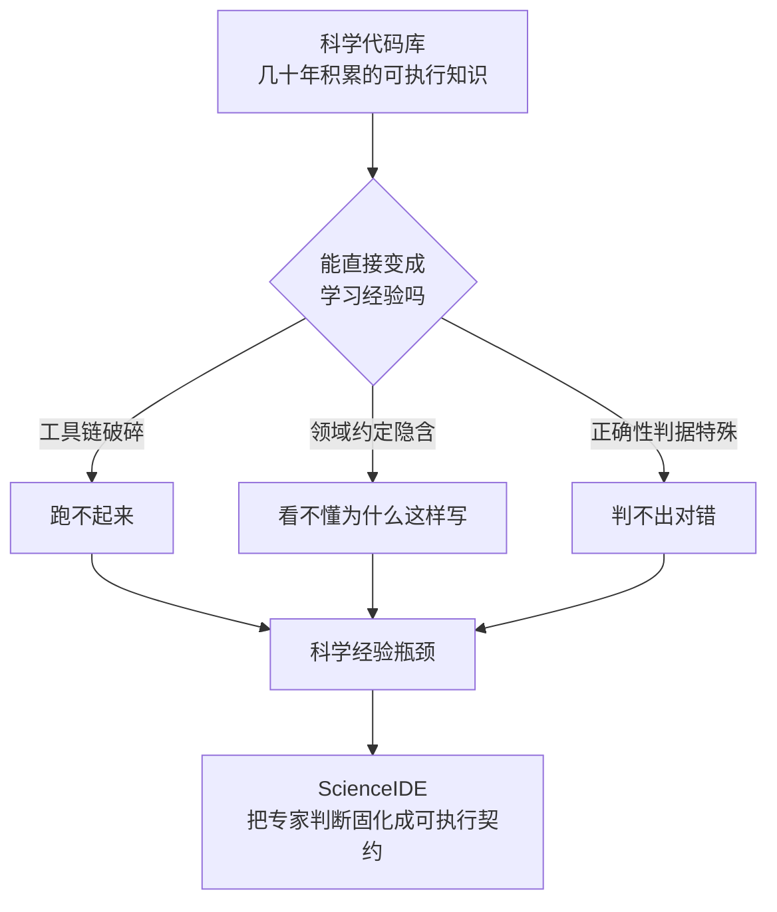
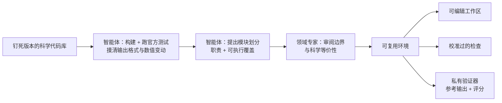
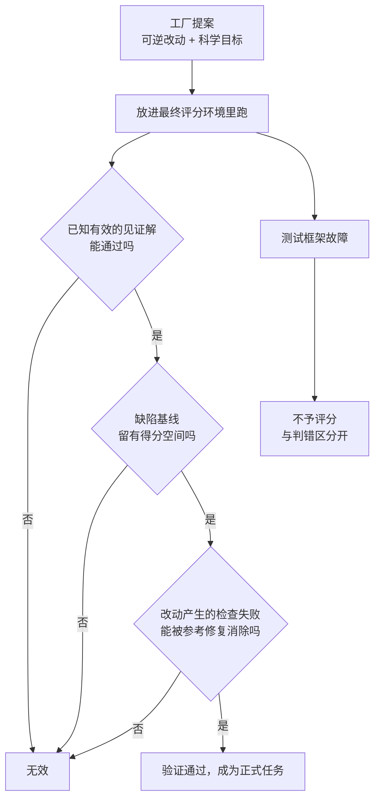
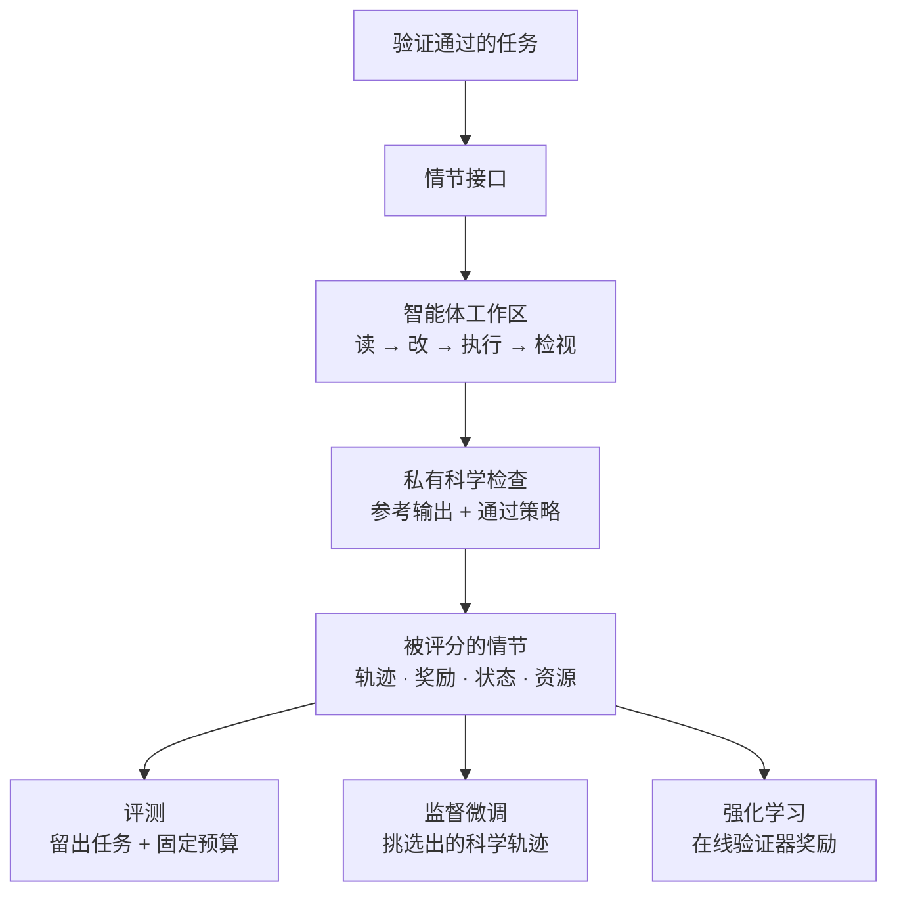
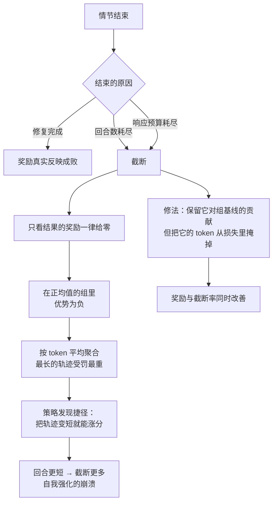

# ScienceIDE：把全世界的科学代码库变成智能体可以学习的环境

> **原题**：ScienceIDE: Turning World's Scientific Codebase into Agent Learnable Environments
> **作者**：Hejia Geng、Zesen Huang（共同第一作者），Zhenfei Yin、Yingcheng Wu、Ling Yang（共同通讯），另有五十余位合作者
> **机构**：AItonomy Foundation，赞助方为 PhAI-Labs 与 Qwen
> **年份**：2026（arxiv ID 2609.19134，9 月 16 日提交）
> **分类**：cs.CL / cs.CY
> **链接**：https://arxiv.org/abs/2609.19134
> **精读日期**：2026-09-17

---

## 阅读须知

### 这篇在领域里的位置

过去两三年里，让语言模型学会写代码这件事，走的是一条相当固定的路线。先是用海量的公开代码做预训练，接着用人工标注的指令数据做监督微调，最后用可以自动判定对错的信号做强化学习。这条路线之所以能走通，关键在于代码有一个别的领域不具备的性质：对错是可以机器判定的。一段程序要么通过单元测试，要么不通过，不需要人来打分。于是像 SWE-bench 这样的基准就成了事实上的标尺，它从真实的开源项目里取出一个已经被修复过的缺陷，把修复前的状态交给模型，再用项目自带的测试来判定模型改得对不对。

这条路线在通用软件工程上很成功，但它有一个隐含的前提：项目自带的测试，足以表达「这段代码写对了」这件事。对于一个 Web 框架或者一个命令行工具，这个前提基本成立。对于科学计算的代码，这个前提就塌了。一个磁流体力学求解器跑出来的结果，两次运行的浮点数几乎不可能逐位相同，自适应步长会变，并行分块的顺序会变，随机数流会变，特征向量的相位会翻转。在这些变化里，哪些是实现细节的抖动，哪些是真正的物理错误，测试本身回答不了，只有懂这门学科的人才回答得了。

这篇论文要处理的就是这个断层。它的位置可以这样定位：它不是又一个代码智能体，也不是又一个基准，而是一套把科学家的判断固化成可执行契约的基础设施，让科学软件这一大片此前无法利用的知识，变成智能体可以评测、可以监督微调、也可以强化学习的经验来源。作者把这个断层命名为「科学经验瓶颈」（scientific experience bottleneck）。

### 读完能回答什么

1. 为什么科学计算的代码不能直接套用 SWE-bench 那一套「跑测试看红绿」的评判方式。
2. 论文说的「环境」到底是什么，它和一个普通的 Docker 镜像加测试套件差在哪里。
3. 逐点比对策略（pointwise）与不变量策略（invariants）分别在什么情况下使用，容差是怎么定出来的而不是拍出来的。
4. 一个由模型提出的任务，要拿出什么样的可执行证据才能被接纳为正式任务。
5. 在长程科学任务上做强化学习时，「预算耗尽」为什么会把策略带进一个自我强化的退化循环，作者用什么办法切断它。
6. 从科学代码的交互轨迹里学到的东西，能不能迁移到与科学无关的公开基准上。

### 阅读前置

假定读者熟悉语言模型的监督微调与强化学习的基本概念，知道 PPO 一类的策略梯度算法大致在做什么，也用过单元测试和容器。不假定读者做过科学计算，不假定读者知道什么是磁流体力学或者海洋生物地球化学，凡是涉及具体学科的地方，文中都会先交代这个东西是干什么的。

### 首次出现的缩写与专名

- **SFT**（Supervised Fine-Tuning，监督微调）：用现成的示范数据教模型模仿某种行为。
- **RL**（Reinforcement Learning，强化学习）：让模型自己尝试，再用一个打分信号告诉它好坏。
- **GRPO**（Group Relative Policy Optimization，组相对策略优化）：一类强化学习算法，对同一个问题采样一组回答，用组内平均分作为基线来判断每个回答的好坏，省掉了单独训练一个价值网络。
- **Dr. GRPO**：GRPO 的一个修正版本，去掉了按组内标准差归一化的那一步。
- **PPO**（Proximal Policy Optimization，近端策略优化）：经典的策略梯度算法，靠限制新旧策略的比值不要偏离太远来保持训练稳定。
- **DAPO**：一个在 GRPO 基础上做了若干工程改动的强化学习方案，其中包含一项按长度惩罚奖励的设计。
- **LoRA**（Low-Rank Adaptation，低秩适配）：只训练插入的小矩阵而冻结原模型权重的微调方法，省显存。
- **vLLM**：一个高吞吐的语言模型推理服务框架，这里用来做强化学习的采样。
- **veRL**：一个强化学习训练框架，论文在它之上做了定制，称为 PSRL。
- **MHD**（Magnetohydrodynamics，磁流体力学）：研究导电流体在磁场中运动的学科，天体物理和等离子体物理里的主力工具。
- **PLUTO、Athena++、PHANTOM**：三个天体物理流体与磁流体模拟的开源代码库。
- **MITgcm**：麻省理工开发的通用环流模式，用于海洋与大气模拟。
- **LAPS**：一个三维伪谱霍尔磁流体求解器。
- **ScienceIDE-Hard**：本文从整个任务库中划出的 85 道难题，作为公开评测子集。
- **PhAI-IDE-72B / 9B / 4B**：本文训练出的三个模型，分别以 Qwen2.5-72B-Instruct、Qwen3.5-9B、Qwen3.5-4B 为底座。

---

## 一、问题

科学软件这件事，值得先花一段讲清楚它的分量。今天几乎所有的计算科学成果，背后都压着一层几十年积累下来的代码：天体物理的流体求解器、海洋环流模式、等离子体的粒子模拟、辐射输运、引力 N 体、光子学的电磁求解。这些代码库动辄十万行，里面固化的不只是算法，还有一代代研究者关于「什么样的数值行为算是物理上正确」的判断。这是一笔极大的、已经写成可执行形式的人类知识。

问题在于，这笔知识现在几乎无法转化成智能体可以学习的经验。原因有三层，论文把它们合称为科学经验瓶颈。

第一层是工具链的破碎。这些代码库往往依赖特定版本的编译器、特定的 MPI 实现、特定的数值库，构建过程里散落着各种平台假设。一个智能体想要在上面做任何事情，第一步就得先把它跑起来，而这一步本身就足以劝退。

第二层是领域约定的隐含性。代码里有大量不成文的规矩：某个数组的第三个维度是什么物理量，某个中间变量为什么必须在这一步归一化，某个边界条件为什么用这种而不是那种离散格式。这些东西写在论文里、写在研究者的脑子里，就是没写在代码的注释里。

第三层，也是最要命的一层，是正确性判据的特殊性。前面提到过，科学代码的输出天然带有运行间的变动。一个有经验的研究者看到两次运行的结果差了千分之一，会先问这个差别落在哪个物理量上、在什么时间窗口内、是不是守恒量。他知道能量守恒偏离万分之一是数值噪声，而角动量朝一个方向单调漂移是真的算错了。把这套判断写成一个自动化的检查，需要的不是软件工程的技巧，而是学科知识。

那么前人是怎么做的。主流路线大致有两支。

一支是通用软件工程基准，以 SWE-bench 及其衍生物为代表。它们从 GitHub 上取真实的问题与真实的修复补丁，用仓库自带的测试判定。这一支做对的地方是它完全建立在可执行证据上，没有人工打分的主观性；不够用的地方是它默认测试等于正确性，因此天然地把科学代码排除在外，因为科学代码的测试通常只覆盖到「程序没崩」这一层。

另一支是科学问答与科学推理基准，用考题的形式测模型的学科知识。这一支做对的地方是它触及了领域知识；不够用的地方是它测的是说，不是做。一个模型能答对磁流体力学的选择题，和它能在一个十万行的求解器里定位并修好一个通量计算的缺陷，是两回事。

这篇论文要解决的具体问题，落到一个可以验证的陈述上，是这样的：**能否设计一套流程，让领域专家的一次性判断被固化成可以反复使用的可执行契约，使得从科学代码库里可以自动地、大批量地生产出带有可靠奖励信号的智能体任务。** 注意这句话里的两个限定。「一次性」是说专家的时间极其昂贵，方案必须做到专家只在关键处介入，其余交给自动化。「可靠奖励信号」是说这个信号必须能区分真实的科学错误与无害的数值抖动，否则无论下游用它做评测还是做强化学习，都是在拟合噪声。

---

## 二、方法

### 2.1 四个基本对象

在看流程之前，先把论文反复使用的四个名词交代清楚，否则后面每一步都会卡住。

**模块**（module）是构建的基本单位。它不是「一组相关的文件」，而是一份连贯的科学职责加上与之配套的可执行覆盖。一个模块要说清楚自己的输入与输出是什么、算法分几个阶段、哪些实现路径归它管、哪些职责明确不归它管、哪些测试支撑它。这里的区分很重要：多个模块可以共用同一个底层求解器和同一套工具链，但它们在科学上仍然是不同的东西。

**环境**（environment）是一个被批准的模块，连同它的运行时和科学检查一起打包的产物。一个代码库可以贡献出多个环境，每个环境都能追溯到它在源码中的出处。

**任务工厂**（factory）是把通用的出题手法特化到某一个环境上的东西。通用的部分处理可逆的代码修改、执行、产物收集；本地的部分则知道这个环境里哪些代码路径是活跃的、有哪些算例、怎么构建、什么样的改动在科学上是有意义的。

**情节**（episode）是智能体与一个任务的一次完整交互，产出三样东西：修改后的代码产物、完整的行为轨迹、以及被测量出来的结果。

### 2.2 从代码库到可执行契约

构建从一份真实使用中的科学软件开始。智能体先去检视一个钉死的上游版本，读它的依赖、许可证和构建假设，然后真的把它编译出来，跑它自带的官方测试和示例。这一步不是走过场，它的目的是把这个代码库的脾气摸清楚：输出是什么格式、数值上有多大的运行间变动、哪些执行路径特别慢、哪些地方有执行风险。这些观察决定了环境的边界画在哪里。

接着智能体提出模块的划分方案，交给领域专家审阅。这里的分工是论文反复强调的一条线：**智能体负责实现与提案，专家保留对科学观测量、等价性判定和验收标准的决定权。** 注册表与命令行工具只负责强制结构与追踪来源，它们不参与选择哪些物理量该被观测。一个被批准的模块，最后会被打包成四样东西：可编辑的工作区、校准过的检查、以及一个私有的验证器，外加从上游继承来的版本钉、依赖和已知风险。

### 2.3 从官方测试到科学检查

这一节是整篇论文技术上最扎实的部分，也是它区别于一般基准工作的地方。

模块批准之后，它的单元测试、回归测试和随附的示例算例会被一起梳理一遍。每一个都要追溯到模块职责上，然后被归入三类之一：留作检查、明确排除并写明理由、或者标记为覆盖缺口。

奖励的最小单位叫**检查**（check），它由固定的输入、被评分的输出、以及一条**通过策略**（pass policy）三者组成。这里有一个值得记下来的设计：一个示例算例即使没有随附参考答案，也仍然算官方测试，因为钉死的构建本身可以提供比对基准，而这个算例背后的物理，比如一个已发表的数值、一条收敛性质、或者一个守恒量，可以充当锚点。一个找不到官方出处的检查被称为自定义检查，必须经过管理员同意才能使用。

通过策略有两种形态，选哪一种取决于这个物理量的数值行为。

**逐点策略**比对每一个被评分的数值，判据是

$$|c - r| \le a + \rho|r|$$

其中 $c$ 是候选输出，$r$ 是参考输出，$a$ 是绝对容差，$\rho$ 是相对容差。精确相等只是 $a = \rho = 0$ 的特例。只要存在一个容差窗口，既能容纳实测的数值敏感性，又仍然能拒绝一个真实的缺陷，就优先用逐点策略。

这里有一条重要的限定：逐点策略只评物理观测量，绝不评记账信息。一个无序集合在比对前要按输出里自带的身份标识对齐，比如一个粒子的各项属性要跟着它的粒子编号走，而不是跟着它在数组里的下标走，它的关联数组也按同一套对齐。存储顺序、自适应步数、计时、并行进程或分块布局、随机抽样、特征向量的相位，这些统统不是观测量。

**不变量策略**则比对矩、分布、守恒量或者积分范数一类的量。它用在没有任何逐点容差能够同时容纳运行间变动并拒绝缺陷的场合，典型的情况包括随机数流、快速发散的流动、抽样统计和离散输出。作者的偏好顺序是：先试着缩短评分窗口，如果物理在缩短后的窗口里仍然成立，就还用逐点；实在不行才从一开始就用不变量。

容差不是拍脑袋定的，而是测出来的。做法是准备一对**标称初值与变体初值**：变体扰动最小的一组活跃输入，使得被评分的输出能够暴露出这个量的数值敏感性。作者特别声明，这是校准证据，不是一个隔离物理效应的实验，也不是一条自动生成容差的规则。如果构建条件允许，还可以跑一个**替代构建**，用同一份钉死源码的另一种合法构建方式跑标称输入，记录下跨构建的分离度，作为容差的下限。作者对这件事的措辞相当克制：没有替代构建的检查就没有这个下限，而即使有了实测的下限或者标称与变体之间的差距，那也只是有限的证据，不是普适的保证。

最后，每一个检查都要带一份用平白语言写成的**理据**（warrant）：它指明观测的是哪个量，解释这个容差界能够区分哪一种科学上有意义的偏差，以及为什么一个合法的实现能够满足它。检查套件在下游出题之前就被冻结，因此任务的题面可以变来变去，而每一个检查始终都是验收契约的一部分。

### 2.4 任务的生产与验证

任务工厂把通用手法特化到环境上之后，就可以批量提出候选。出题的分类法有七种：加速、修复、发现、复现、集成、校准、实现。其中修复与实现这两类可以通过可逆的变异与切除做自动化扩展，其余五类则提供接口，由专家指定目标、数据、流程或资源约束。

关键的一步在于：**模型提出的候选不等于任务，必须拿出可执行的证据才能被接纳。** 对一个注入式的修复任务，证据的形式非常具体：一个已知有效的见证解必须能通过，未修复的基线必须留有得分空间，并且注入的改动必须产生一个检查失败，而这个失败恰好能被参考修复消除。三者缺一不可。此外还要过编译、原生执行和覆盖率的关卡。沉默的变异可以留作显式对照，而含混的题面、不可达的分支、以及测试框架自身的故障，则分别被判为无效或不予评分。

修复类任务的得分要针对「起点本来就是坏的」这一事实做归一化：

$$r_{\text{repair}} = \max\left(0,\ \frac{r - f}{1 - f}\right),\quad 0 \le f < 1$$

其中 $r$ 是科学一致性得分，$f$ 是未修复构建的得分。这样一来，一个起点分数本来就不低的任务，不会因为智能体什么都没做而白拿分。

### 2.5 一个接口，三种用途

一个通过验证的任务，对外暴露的是同一个情节接口。智能体拿到可编辑的工作区，读代码和科学输入，做修改，跑实验，把产物提交给私有验证器。测试框架记录下动作、观察、检查奖励、执行状态和资源消耗，并且严格区分三件事：科学结论不一致、交付不完整、以及基础设施故障。

这个统一接口之上挂着三种消费方式。评测固定住任务与交互预算，测量成功率、部分进展和资源消耗。监督微调挑选轨迹，监督智能体的动作，包括它的工具调用。强化学习则把受策略控制的采样与验证器奖励接在一起。论文强调的设计意图是：科学内容可以复用，而模型与训练器是可替换的。

---

## 三、实验

### 3.1 规模与设置

ScienceIDE 目前从 27 个科学代码库构建出 64 个环境，生产出 2,812 道任务。任务类型的分布相当不均衡：修复 2,515 道，实现 295 道，加速目前只有 2 道。配套的检查集合有 1,076 条，覆盖数值输出与物理不变量。学科分布上，天体物理的磁流体与流体占 13 个环境，空间等离子体 7 个，海洋与气候 6 个，引力与 N 体 5 个，光子学与电磁 5 个，其余分散在气动与机器人、材料、数值方法、天体化学、相对论、辐射、量子、粒子探测器、免疫学等方向。

公开评测用的是从中划出的 **ScienceIDE-Hard**：85 道难题，来自 18 个环境，源头是 PLUTO、Athena++、MITgcm、LAPS、PHANTOM 五个代码库。其中 52 道修复、33 道实现。评测协议是：同一个任务容器、同样的指令、不给额外的定位提示、一小时的情节预算。主指标是严格科学成功，也就是 $r_{\text{repair}} = 1$，交付不完整或者预算耗尽一律算失败。

### 3.2 前沿智能体在科学任务上的表现

十五个模型、八家供应商，分别通过 Codex、Claude Code 或 Gemini CLI 三种测试框架执行。

| 模型 | 严格成功率 |
|---|---|
| Claude Fable 5.1 | 67.1% |
| Claude Opus 5 | 64.6% |
| GPT-6 Astra | 63.1% |
| GPT-5.6 Sol | 55.0% |
| Qwen3.8 Max | 39.2% |
| DeepSeek V4.1 Flash | 36.0% |
| GPT-5.6 Terra | 34.9% |
| DeepSeek V4 Pro | 28.4% |
| Kimi k3 | 28.4% |
| GLM-5.3 | 25.8% |
| Claude Sonnet 5 | 25.4% |
| Gemini 3.8 Flash | 19.6% |
| GPT-5.6 Luna | 18.1% |
| Claude Haiku 4.5 | 4.7% |
| MiniMax-M3 | 4.4% |

作者对这张表的解读相当谨慎，值得原样转述：前几名的点估计不应被读作一个统计上确立的排序，因为 Fable 只测了单次，而 Opus 与 Astra 的重复区间是重叠的。真正稳健的结论是另一句：**即使是领先的智能体，在一小时预算下也还有大约三分之一的科学任务解不出来。**

### 3.3 一个容易被平均值掩盖的现象

有一处观察比总分更有意思。在十分钟这个时间点上，Astra 的成功率是 49.6%，而 Fable 只有 25.9%；Fable 大约要到第 31 分钟才反超。再看 20 分钟到 60 分钟这一段各家涨了多少：Astra 只涨了 2.0 个百分点，Fable 涨了 11.8，Opus 涨了 16.0，Qwen3.8 Max 涨了 30.2。

换句话说，最终分数接近的两个系统，对时间的需求可能完全不同。一个在十分钟内就把自己能解的都解完了，另一个则要靠后半小时的持续工作才追上来。只看终点的排行榜，会把这个差别整个抹掉。

成本这一维同样不能用「花得多就做得好」来概括。Fable 以每道题约 7.90 美元换来 67.1% 的成功率，平均耗时 16.8 分钟、输出 85.7k token；Astra 以每道题 3.56 美元换来 63.1%，平均 9.4 分钟、13.9k token。而 DeepSeek V4.1 Flash 每道题输出 172.4k token，成功率只有 36.0%。跨十五个系统统计，成功率与运行时间的 Spearman 相关只有 −0.22，与输出量的相关是 0.01。资源消耗和科学正确性，是两个基本独立的维度。

### 3.4 从科学轨迹做监督微调

示范数据由 GPT-5.6-sol 采集，再用数值等价性验证器筛选。训练集有来自 564 道任务的 4,567 个片段，验证集有来自 81 道任务的 544 个片段，按任务标识分割，没有任务同时出现在两边。训练用 ms-swift，对所有线性层施加 LoRA，训练三个轮次，并且明确说明最终检查点不是按公开基准的表现挑出来的。

在留出的科学修复任务上，微调带来的提升是这样的：

| 模型 | 环境 | 初始 → 微调后 | 提升（百分点） |
|---|---|---|---|
| 4B | PLUTO-Particles-Dust | 0.0000 → 0.3333 | +33.33 |
| 9B | PLUTO-RMHD/ResRMHD | 0.0000 → 0.2857 | +28.57 |
| 9B | LAPS | 0.3125 → 0.5000 | +18.75 |
| 9B | MITgcm-Biogeo | 0.0625 → 0.1250 | +6.25 |

更值得注意的是迁移。论文报告了 15 组模型与基准的组合出现至少 3 个百分点的提升，而且这些基准与科学计算毫无关系：4B 在 HumanEvalFix 的 JavaScript 子集上提升 10.98 个百分点，在 QuixBugs 的 Java 子集上从 0.400 升到 0.500，在 CodeXGLUE 的缺陷检测上从 0.422 升到 0.492。作者自己指出最后这一项的绝对准确率仍然不到 0.5，没有藏着掖着。

9B 的情况更跳脱一些：BBH 的 Word Sorting 子任务从 0.240 升到 0.576，涨了 33.60 个百分点，同时 GSM8K 也有提升。另有 4B 在 BBH 多步算术与 MMLU-Pro 计算机科学上的提升，以及 72B 在 ARC-Easy 上的提升。

这组结果的意义在于，它提供了一个证据：从科学代码交互中学到的东西，不只是科学领域的专门技能，还有一部分会转化成更一般的代码、推理与知识能力。

### 3.5 在线强化学习，以及一个值得单独讲的失败模式

强化学习部分只用了两个环境：LAPS 与 MITgcm-biogeo，任务库分别有 99 道和 87 道修复题，分别对应 3 个和 9 个被评分的科学算例。指令会告诉智能体缺陷在哪个文件、哪一行、属于哪一类改动，但不告诉它修好之后应该算出什么。

这个设置比常规的强化学习困难得多，原因是奖励只在情节结束后才到达，而一个情节可能跨越几十个回合、几万个 token。工程上，采样跑在 vLLM 上，优化跑在 PSRL 上，两者占用互不相交的显卡，用 token 级的截断重要性采样来纠正由此产生的一步策略滞后。在一个有代表性的训练步上，优化占了 3,210 秒中的 2,069 秒，采样占 751 秒。

目标函数用的是组相对优势。对一组 $G = 8$ 条轨迹，

$$\hat{A}_i = R_i - \frac{1}{G}\sum_{j=1}^{G} R_j$$

这里省掉了原始 GRPO 里除以组内标准差的那一步，跟随 Dr. GRPO 的做法，理由是奖励接近双峰时，归一化会把孤立的成功放大得不成比例。token 更新用 PPO 式的截断比值，而且这个界是不对称的，$\varepsilon_{\text{low}} = 0.2$，$\varepsilon_{\text{high}} = 0.3$，为的是让那些很少被采到的修复动作还有涨概率的余地。

现在说那个失败模式，这是全文最有价值的一段工程观察。

在长程科学任务里，一个情节结束有三种可能：修复完成了、回合数用完了、或者响应预算用完了。只有第一种说明了修复到底成没成，但只看结果的奖励把三种一视同仁，都给零分。于是问题来了：当一条被预算截断的轨迹在一个平均奖励为正的组里拿到零分，上面那个公式给它一个负的优势，它生成的所有 token 都会被压低概率。而由于损失是按 token 平均聚合的，这个惩罚对消耗 token 最多的那些轨迹最重。

结果是目标函数里凭空出现了一条捷径：策略既可以通过真的解决科学问题来提高得分，也可以通过**单纯把自己的轨迹变短**来提高得分。

更糟的是，最长的那些轨迹往往正是在啃最难的修复。惩罚它们，等于在劝阻策略去探索那些需要长时间交互才能找到的解。作者在一次没有加掩码的训练里直接观察到了这个现象：奖励先涨后崩，最后跌到比起点还低，同时每个回合的 token 数掉到不足原来的三分之一。回合变短导致更多轨迹撞上回合上限，截断更多，又强化了同一个病态信号，形成自我循环。

修法的思路很干净：**把一条被截断的轨迹「作为奖励观测」的角色，和它「作为策略优化对象」的角色分开。** 一次预算截断并不能说明截断之前生成的那些 token 有没有用，所以那些 token 不应该收到策略梯度；但这条轨迹的奖励对于组基线仍然是有信息的，所以它继续留在基线里。具体做法就是保留它对基线的贡献，把它从损失里掩掉。出于同样的理由，作者关掉了 DAPO 那一项按长度惩罚奖励的设计，因为在这里长度反映的是定位和修复一个缺陷有多难，不是一个该被压制的量。

加上截断掩码之后的结果：训练 30 步，LAPS 的留出奖励从 0.357 升到 0.857，是 2.4 倍；MITgcm-biogeo 从 0.286 升到 0.571，是 2.0 倍，底座都是 Qwen3.5-4B。

训练过程中的动态也印证了这个机制。比较最初五步与最后五步，LAPS 的平均训练奖励从 0.427 升到 0.828，只算完成的情节则从 0.683 升到 0.883，而预算截断率从 39.5% 降到 6.6%。MITgcm-biogeo 同向：奖励从 0.381 到 0.597，完成情节的奖励从 0.571 到 0.747，截断率从 34.1% 降到 23.8%。策略确实在把那些原先死在预算上的长时间尝试，转化成能够走到验证器面前的情节。

---

## 四、局限

作者自己列出的局限相当详尽，而且措辞克制，这一节几乎不需要替他们补充什么。

**关于覆盖面。** 现有证据只涉及可以用参考答案验证的软件任务，而且以计算物理与地球科学里的修复和实现为主，不涉及开放式的科学发现。更广的任务族覆盖，以及论文提到的一千个环境的发布，都还是开发目标而非已完成的事实。作者还主动点破了一个容易被外界误读的地方：工厂生成的变体之间可能共用代码路径和假设，因此**任务的数量本身不能用来衡量独立的科学覆盖度**。难题集探测的时间跨度上限是一小时，编辑点的耦合程度上限是两处。

**关于验证本身。** 这是最根本的一条：验证是一个科学建模的选择。与选定的观测量在校准过的容差下达成一致，并不能证明在这些检查之外也是正确的，而且合法的替代实现完全可能与参考答案不一致。独立的外部审计与对抗性的奖励攻击评测都还没有做。工厂只是把专家的投入摊薄了，没有消除它，扩张仍然依赖领域知识与上游的再分发权利。仓库、依赖或硬件一旦变化就需要重新验证，因为版本钉保存的是来源，不是科学有效性。

**关于评测的可比性。** 分数比较的是「模型加测试框架」这个整体，在固定预算下的表现，服务速度和重复次数不均都限制了细粒度的排名。检索方面的控制无法排除模型在预训练时已经见过这些公开源码，而且遗留镜像还保留着文件时间戳一类的线索，难度筛选又发生在完整的检索隔离之前，所以选题过程并未被证明不受污染。

**关于学习结果的外推。** 监督微调的收益只在选定的公开基准上成立，强化学习的收益只在训练环境内部、而且是给了提示的留出任务上成立。两者都没有确立向未见过的代码库的迁移。监督微调的分割是按任务标识验证的，不是按相关变体，因此变体之间的泄漏没有被排除。强化学习的对比也没有估计不同随机种子之间的方差。

读完之后能看出来但作者没有明说的，大概有两点。一是成本结构：整条流水线的每一步都依赖领域专家的审阅与最终裁决，论文没有给出专家投入的小时数，因此这套方法能不能扩展到一千个环境，目前无法从文中判断。二是评测者与被评测者的重叠：监督微调的示范数据由 GPT-5.6-sol 采集，而这个模型同时也是排行榜上的参赛者，虽然两件事在论文里是分开的实验，但数据生成与能力评估共用同一批模型这件事，在解释迁移结果时值得留一分保留。

---

## 一句话

把领域专家对「什么是科学上正确」的判断固化成可复用的可执行契约，让科学代码库批量产出带可靠奖励的智能体任务。
