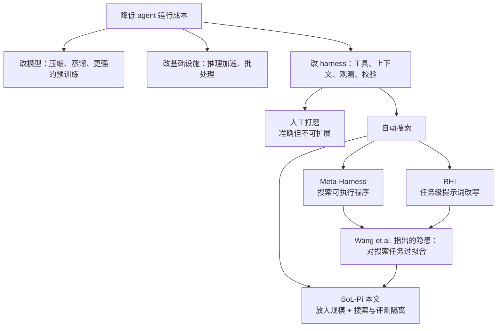
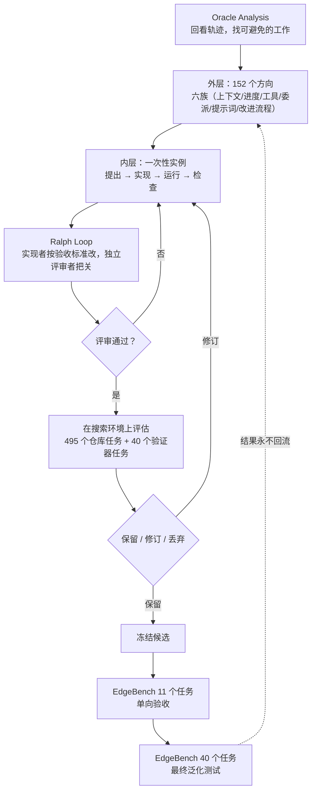
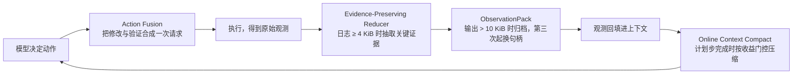
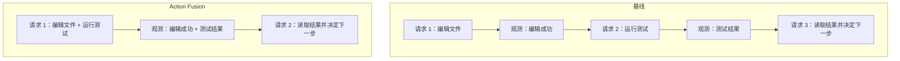
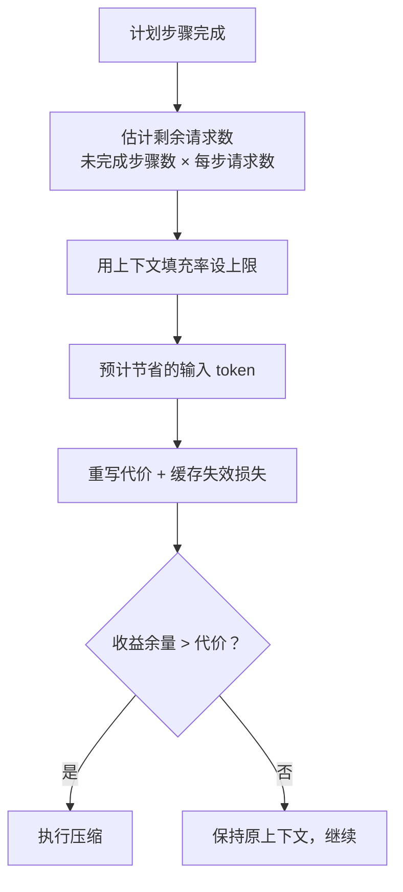

# SoL-Pi：把自动研究循环递归放大，做出更省 token 的 agent harness

> **原题**：SoL-Pi: Recursively Scaling Auto-Research Loops for Efficient Agent Harness
> **作者**：Haozhe Liu, Tian Ye, Sensen Gao, Qihang Cao, Yitong Li, Mingchen Zhuge, Duomin Wang, Ruihua Zhang, Ping Luo, Jiawang Bian, Lei Zhu, Ligeng Zhu, Enze Xie, Song Han
> **机构**：论文页未逐条列出作者单位，Hugging Face daily papers 标注的提交方为 NVIDIA
> **年份**：2026（arXiv ID 2609.20519，2026 年 9 月 17 日提交）
> **分类**：cs.AI
> **链接**：https://arxiv.org/abs/2609.20519
> **精读日期**：2026-09-18

## 阅读须知

### 这篇在领域里的位置

过去两年里，让大模型把编程工作做完的努力大致分成两条路。一条是把模型本身做得更强，从预训练语料到强化学习奖励都往「能写对代码」这个方向调；另一条是不动模型，只改它外面那层软件，让同一个模型在同样的任务上少走弯路。这第二条路上的那层软件，业内通常叫 harness，也就是承接模型与真实环境之间全部往返的调度层：它决定模型能调用哪些工具、工具返回的内容以什么形式回到上下文里、上下文长到什么程度需要压缩、以及什么时候该让另一个更便宜的模型先把材料读一遍。

在 harness 这条路上，早期工作基本靠人手打磨。研究者盯着一条几万 token 的运行轨迹，找出哪一步是多余的，然后回到代码里改一行。这种做法准确但不可扩展，因为每一次改动的收益都要重新跑一遍完整评测才能确认，而 harness 内部各个部件之间又是耦合的，局部变好经常意味着别处变坏。于是自然出现了下一步设想：既然模型已经能写代码、能读日志、能提出假设，为什么不让模型自己来改 harness。

这一设想在 2025 年到 2026 年间有过若干实现，代表性的包括把 harness 当作可执行程序来搜索的 Meta-Harness，以及针对具体任务反复改写提示词的 RHI。这些工作证明了自动改写 harness 是可行的，但也暴露出一个共同的隐患：搜出来的改动往往只在搜索时用的那批任务上成立，换一批任务就失效。SoL-Pi 这篇论文正是接在这一步上，它要回答的是，如果把自动研究循环的规模放大到几百个环境、几千次运行，并且在流程上严格切断搜索与最终评测之间的通路，搜出来的改动能不能真的具有普遍性。

### 读完能回答什么

读完这份笔记之后，应当能够回答下面这几个问题：

1. 为什么在长时间无人值守的编程 agent 上，token 效率会取代单次准确率成为关键指标，而这件事又为什么必须在 harness 这一层解决。
2. SoL-Pi 所说的「自动研究循环」具体由哪几个阶段构成，它用什么机制保证搜出来的改动不是对搜索任务的过拟合。
3. 最终留下来的四个机制各自解决什么浪费，它们在一次模型请求的生命周期里分别插在哪个位置。
4. 为什么在线上下文压缩这一个机制单独使用时会把分数拉低，而观测打包这一个机制单独使用时反而把分数拉高。
5. 这套在 GPT-5.6 Sol 上搜出来的 harness 迁移到 Opus 5 上时，哪些结论保持成立，哪些出现了衰减。

### 阅读前置

这份笔记假定读者熟悉大模型 API 的基本计费结构，知道输入 token、输出 token 与缓存命中是分别计价的，也大致用过或读过某一个编程 agent 的运行日志。不假定读者做过 agent harness 的开发，也不假定读者了解自动化研究循环这一类工作的既有文献，涉及到的地方都会先铺垫再展开。

### 首次出现的缩写与术语表

- **harness**：承接模型与环境之间全部交互的软件层，负责工具定义、上下文组装、观测回填与流程控制。本文全篇讨论的对象就是它，中文里没有稳定译法，下文保留英文。
- **RSI**（Recursive Self-Improvement，递归自我改进）：让系统用自己当前的能力去改进自己，改进之后的版本再去做下一轮改进。本文借用的是这个思路，但作用对象是 harness 而不是模型权重。
- **rollout**：让 agent 在某个环境里完整跑一遍任务，产出一条从开始到结束的交互轨迹。
- **EdgeBench**：本文的主评测集，含 51 个公开任务，被拆成 11 个用于单向验收与 40 个用于最终泛化测试。
- **Terminal-Bench 4**：另一个评测集，含 63 个纯 CPU 任务，用来检验结论是否跨基准成立。
- **held-out**：预留集。指那些在搜索阶段完全不参与、只在候选被冻结之后才拿出来跑一次的任务。
- **cache read / cache write**（缓存读 / 缓存写）：大模型 API 的前缀缓存计费项。重复的上下文前缀命中缓存时按较低的读价计费，新写入缓存时按较高的写价计费。本文的 token 统计把这两项单独列出，因为 harness 的改动会显著改变两者的比例。
- **ablation**（消融实验）：把方法里的部件逐个单独加上去或去掉，看各自贡献多少。
- **trigger rate**（触发率）：某个机制在一次运行中实际被激活的比例。本文把它当作中间指标使用。
- **Oracle Analysis**（先知分析）：本文自造的术语，指让一个模型回看已完成的轨迹，指出其中哪些工作事后看是可以避免的。
- **Ralph Loop**：本文采用的实现与评审流程，实现者按明确的验收标准反复修改，另一个独立的评审者在进入评测之前先把关。

## 一、问题

编程 agent 早期的工作形态是补全，人写一段，模型接一段，一次交互就结束了。在这种形态下衡量好坏的指标很自然是准确率，因为每次交互的成本都很小，可以忽略。但当 agent 被放到无人值守的环境里连续跑上几个小时甚至通宵，形态就完全变了。它要反复读文件、跑测试、看报错、再改代码，一条轨迹里积累的往返可能有上百次，上下文会一路膨胀到几十万 token。这时候每个任务的账单不再可以忽略，它直接决定了这套系统能不能规模化使用。

这里有一层更进一步的动因。论文在开篇把 token 效率与递归自我改进联系在一起：如果希望让 agent 去改进 agent，那么每一轮改进本身都要消耗大量的运行预算，单次运行越贵，一个固定预算能覆盖的搜索空间就越小。换句话说，效率不只是省钱的问题，它决定了自动化研究这件事本身能推进到多远。

那么浪费到底出在哪里。论文的判断是，绝大部分浪费并不在模型内部，而在 harness 组织交互的方式上。同一份编译日志会因为留在上下文里而被反复发送几十次；一次文件修改与紧随其后的一次测试执行本来可以合并，却被拆成两轮往返；上下文长到需要压缩时，压缩的时机完全由固定阈值决定，不考虑这次压缩本身要付出的重写代价。这些都是 harness 层面的决策，跟模型强不强没有关系。

既然如此，为什么不直接人工把这些地方改掉。论文给出的理由是耦合性。harness 里工具的定义、上下文的管理与结果的校验三者互相牵制，一处局部改良常常只是把开销推迟到了后面的阶段，表面上某一段的 token 数下降了，整条轨迹的总量却没有变，甚至因为信息丢失导致 agent 走了弯路而升高。要判断一个改动是否真的有益，必须跑完整条轨迹并统计总量，而人工去读几万 token 的轨迹再翻译成代码改动，这个过程既慢又难以覆盖足够多的候选方向。

前人沿着自动化这条路已经走过几步，本文把它们归成三支。第一支是自动化的 agent 设计，早期的 SWE-agent 优化的是模型与环境之间的接口形式，后来的 AFlow 与 AgentSquare 把搜索对象扩大到工作流结构，再往后的 Darwin Gödel Machine 与 Hyperagents 则直接尝试递归自我改进。第二支是专门针对 harness 的优化，Meta-Harness 把 harness 当作可执行程序来搜索，RHI 则聚焦在针对具体任务反复改写提示词。第三支是 token 效率本身，Context-Folding 与 AgentFold 做上下文管理，AgentDiet 与 ACON 做轨迹缩减，LLM-as-Code 做确定性的信息抽取。

这三支里最值得注意的是第二支暴露出来的问题。Wang 等人此前的研究发现，演化出来的 harness 存在对搜索任务过拟合的风险，也就是说自动搜索确实能在搜索时用的那批任务上把指标推上去，但换一批任务就打回原形。本文把这一发现当作自己的主要设计约束：整套流程围绕「搜索与评测必须彻底隔离」来组织，候选一旦冻结就不再回到搜索里修补。论文原文对这一点的表述是，预留证据只在候选被冻结之后评估，并且永不返回搜索，从而防止验证阶段的失败被就地打上补丁。

于是这篇论文要解决的技术问题可以收敛成一句话：在不改动模型权重的前提下，用一套可规模化的自动研究流程，找出一批能跨任务、跨模型复用的 harness 改动，使长轨迹 agent 的 token 消耗显著下降而能力基本不损失。

## 二、方法

### 自动研究循环的整体形状

SoL-Pi 的核心不是那四个机制本身，而是产出这四个机制的流程。论文把这个流程组织成一个从宽到深的漏斗，外层负责广度，内层负责深度。

外层一共提出了 152 个改进方向，分属六个族：上下文、进度、工具、委派、提示词与策略、以及改进流程本身。这些方向的来源是 Oracle Analysis，也就是让一个模型回看已经跑完的轨迹，指出其中哪些工作事后看是可以避免的。这一步的产物是假设，还不是代码。

内层负责把每一个有希望的方向变成可运行的实现。每个方向都会被放进一个一次性的实例里，按照统一的 skill 模板展开，循环的节奏是提出、实现、运行、检查，然后决定保留、修订还是丢弃。实现这一步采用 Ralph Loop 的组织方式：实现者按照明确写下的验收标准反复修改，直到满足为止；另有一个独立的评审者在候选进入评测之前先把关，评审不通过就退回修订。

整套流程的规模，论文给出的数字是约 150 个提出的方向、约 500 个可执行环境、超过 3,000 次运行以及超过 60,000 次 agent 交互。

搜索用的环境分两类。第一类是从代码仓库派生出来的，共 495 个任务，做法是取 GitHub 上的 issue 与 pull request 配对，把仓库回滚到修复之前的状态，并把依赖离线化。这一类任务的判定标准很严格：只有当对应测试在打补丁之前失败、打补丁之后通过时，这个任务才会被保留下来，这样可以保证任务确实有一个可验证的正确终点。第二类是验证器驱动的，共 40 个任务，它们只规定可执行的成功条件而不规定解法，因此允许多条不同的路径通向成功，把搜索的覆盖面从仓库历史里已经发生过的修复扩展出去。

隔离这件事在流程上是怎么落实的，论文讲得很具体。EdgeBench 的 51 个任务被拆成两份，11 个用于单向验收，意思是只能用来判断一个已冻结的候选是否达标，不能反过来指导修改；另外 40 个完全保留到最后做泛化测试。开发阶段的结果可以用来指导迭代，但预留集的结果一旦看到就不允许再回头改动候选。

### 四个机制在一次请求里的位置

经过上述流程活下来的机制一共四个，它们分别落在一次模型请求的不同环节上。理解它们最方便的方式是顺着一次交互的生命周期走一遍：模型先决定要做什么动作，动作执行完之后产生观测，观测要经过处理才能回到上下文，而上下文积累到一定程度又要被整体压缩。四个机制正好一一对应这四个环节。

#### 机制一：Action Fusion（动作融合）

这个机制针对的浪费非常具体。基础 agent 的典型行为是先编辑一个文件，然后再发一条独立的命令去测试、构建或运行它。这两步之间其实没有任何需要模型判断的东西，模型改完文件必然要验证，可是 harness 把它们拆成了两轮往返，中间那一轮的意义仅仅是把「文件已修改」这个结果送回给模型看一眼。

Action Fusion 的做法是把两个动作合并到同一个工具请求里，执行结果在同一个观测里一并返回，从而省掉中间那次往返。论文明确保留了例外：如果某条命令确实需要先检查上一步修改的结果才能决定怎么执行，那么它仍然保持独立。效果上，一段典型序列的 API 调用次数从三次降到两次。

实现层面有一个值得记下的细节。论文在案例研究里提到，最初尝试仅靠提示词来诱导模型发出融合动作，结果触发并不可靠；后来改成扩展工具的 schema，把融合动作作为一个显式的工具直接暴露出来，触发才稳定下来。

#### 机制二：Online Context Compact（在线上下文压缩）

上下文会随着交互次数不断增长，这是所有长轨迹 agent 共同面对的事实。常见的处理办法是设一个阈值，超过就调用一次压缩，把历史重写成摘要。问题在于压缩本身是有代价的：重写要消耗输出 token，而且重写之后的前缀与之前不同，原先命中的缓存全部失效，接下来若干次请求都要按更贵的价格重新写缓存。

SoL-Pi 的改法是把压缩从阈值触发换成收益门控。在一个计划步骤完成的时刻，harness 会先估计后面还要发多少次请求，具体做法是用未完成的步骤数乘以每步的平均请求数，再用上下文的填充率给这个估计设一个上限。有了预计的剩余请求数，就可以算出这次压缩能在后续请求上省下多少输入 token，把这个收益与重写的代价以及缓存复用的损失放在一起比较，只有当收益的余量确实超过代价时才真正执行压缩。

这个机制是四个里唯一一个会明显影响能力的，原因下一节的消融实验会讲到。

#### 机制三：ObservationPack（观测打包）

大体量的工具输出，例如完整的构建日志或者一次全仓库搜索的结果，第一次出现时确实携带了有用的信息，但它会作为历史的一部分留在上下文里，此后每一次请求都要把它原样再发一遍。到了第三次、第四次，其中绝大部分内容与当前正在做的事已经没有关系了。

ObservationPack 的处理方式是分阶段降级。凡是超过 10 KiB 的输出都会被归档保存；在随后的前两次模型请求里，完整结果照常发送，因为这段时间模型很可能还要反复参考它；从第三次请求开始，上下文里的完整内容被替换成三样东西，一个稳定的句柄、原始的大小、以及一小段首尾摘录。需要完整内容时，模型可以凭句柄把它重新取回来，所以信息并没有丢失，只是不再无条件占据上下文。

#### 机制四：Evidence-Preserving Reducer（保证据的缩减器）

构建日志与测试日志的共同特点是篇幅很长而有效信息很少，真正决定下一步怎么走的往往只有报错的那几行。直接让模型去读全文既慢又贵，可是交给另一个模型去摘要又有风险，因为摘要可能把关键的那一行改写得不准确，而 agent 的后续判断完全建立在这一行上。

SoL-Pi 的做法是让一个低成本的辅助模型 GPT-5.6 Luna 去处理不小于 4 KiB 的日志，抽取其中的关键证据，但抽取的结果不被直接信任。抽完之后有一个确定性的校验器接手，它检查产出的结构是否符合约定的 schema、源文件的哈希是否对得上、退出状态是否一致、以及引用的那几行是否与原文逐字相同。任何一项校验不通过，整个缩减结果就被丢弃，回退到原始日志。

这个机制与 ObservationPack 之间有明确的先后顺序：缩减器先跑，保证关键证据被提取并通过校验，然后原始输出交给 ObservationPack 归档。这样安排的原因是，如果顺序反过来，ObservationPack 已经把内容换成了句柄，缩减器就拿不到可供逐字核对的原文了。

## 三、实验

### 设置

搜索阶段的后端模型是 GPT-5.6 Sol，推理强度设在 xhigh。迁移测试用的是 Opus 5，并且不做任何重新搜索或重新训练，直接把在前者上搜出来的 harness 换一个后端跑。对比的基线 harness 有五个，分别是 Codex、OpenSquilla、Oh-My-Pi、OpenCode 与 Pi，其中 Pi 是 SoL-Pi 的直接前身，因此它是最主要的参照对象。

评测集有三个。EdgeBench 的 51 个公开任务是主战场；Terminal-Bench 4 的 63 个纯 CPU 任务用来检验跨基准的稳健性；IMO 2026 的 6 道题则是一个性质完全不同的场景，用来看这套面向编程轨迹优化出来的 harness 在数学推理上会怎么表现。

成本按 2026 年 8 月 17 日的 API 价格计算，token 效率定义为单位综合得分所对应的成本。能力与效率的门槛都是预先声明的，机制的取舍只在候选冻结并完成评测之后进行。

### EdgeBench 上的主结果

下面这张表里，token 数的单位是十亿，成本是跑完全部 51 个任务的美元总额，效率一列是每一分综合得分所花的美元，数字越低越好。

| Harness | 输入 | 缓存读 | 缓存写 | 输出 | 总计 | 成本（美元） | 平均分 | 效率（美元/分） |
|---|---|---|---|---|---|---|---|---|
| Pi 基线 | 0.0011 | 2.1326 | 0.0141 | 0.0059 | 2.1538 | 1,339 | 44.833 | 0.5855 |
| SoL-Pi 效率版 | 0.0009 | 1.0605 | 0.0316 | 0.0061 | 1.0990 | 894 | 42.003 | 0.4174 |
| SoL-Pi 性能版 | 0.0002 | 2.0005 | 0.0160 | 0.0056 | 2.0224 | 1,271 | 47.208 | 0.5280 |

效率版把记录到的 token 总量压掉了 49.0%，成本降低 33.2%，代价是平均分从 44.833 降到 42.003，保留了基线的 93.7%。这里有一个细节值得注意：缓存读从 2.1326 降到 1.0605，几乎腰斩，而缓存写反而从 0.0141 升到 0.0316，翻了一倍多。这正是压缩机制的直接痕迹，压缩重写了前缀，所以新的缓存要重新写入，但换来的是后续每次请求都少读一大截。

性能版则是另一个取向，它把平均分推到 47.208，比基线高出两分多，同时 token 总量仍有小幅下降。对照后面的消融表可以看出，性能版实际上就是基线加上 ObservationPack 这一个机制。

### 迁移到 Opus 5

| Harness | 总计 | 成本（美元） | 平均分 | 效率（美元/分） |
|---|---|---|---|---|
| Pi 基线（Opus 5） | 2.3697 | 1,741 | 44.756 | 0.7625 |
| SoL-Pi 效率版（Opus 5） | 1.3101 | 1,158 | 42.224 | 0.5376 |

换到一个完全没有参与过搜索的后端上，token 降低 44.7%，成本降低 33.5%，分数保留 94.3%。三项数字都与在 GPT-5.6 Sol 上的结果相当接近，这是论文用来支撑「搜出来的是通用改进而非任务特化」这一主张的主要证据。

### 跨基准与跨任务类型

| 评测集 | Harness | 解出 / 通过 | 总成本（美元） | 单位成本（美元） |
|---|---|---|---|---|
| Terminal-Bench 4（63 任务） | Codex | 18 | 272.35 | 15.13 |
| Terminal-Bench 4 | Pi | 18 | 286.45 | 15.91 |
| Terminal-Bench 4 | SoL-Pi | 15 | 211.12 | 14.07 |
| IMO 2026（6 题） | Codex | 5 | 114.47 | 22.89 |
| IMO 2026 | Pi | 3 | 75.95 | 25.32 |
| IMO 2026 | SoL-Pi | 3 | 62.69 | 20.90 |

Terminal-Bench 4 上的数字需要单独说明。SoL-Pi 的单任务成本降到 14.07 美元，比 Pi 低 26.3%，但解出的任务数从 18 掉到 15。这是一个三个任务的绝对损失，在 63 个任务的盘子里占比不小，而且它与 EdgeBench 上那种「分数只掉 6%」的温和衰减不是一回事。IMO 2026 上 SoL-Pi 与 Pi 同样通过 3 题，单题成本最低，但两者都明显落后于通过 5 题的 Codex，说明这条优化路线对数学推理这类任务并没有带来能力上的好处。

论文还做了一个多 agent 并行的实验，让五组各四名 worker 花两小时做内核优化。单个 Codex agent 完成 1,333 个循环花费 39.20 美元；20 个 worker 的 Pi 集群完成 1,366 个循环花费 82.12 美元；同样 20 个 worker 的 SoL-Pi 集群完成 1,127 个循环花费 60.11 美元，比 Pi 便宜 26.8%。在八项速度门槛上，SoL-Pi 集群与单个 agent 全部通过，Pi 基线通过七项。

### 消融实验

| 配置 | 总计 | 成本（美元） | 平均分 | 效率（美元/分） |
|---|---|---|---|---|
| Pi | 2.1538 | 1,339 | 44.833 | 0.5855 |
| 加 Action Fusion | 1.8968 | 1,235 | 46.664 | 0.5190 |
| 加 Online Context Compact | 1.2881 | 935 | 41.993 | 0.4365 |
| 加 Evidence-Preserving Reducer | 1.9375 | 1,200 | 44.630 | 0.5274 |
| 加 ObservationPack | 2.0224 | 1,271 | 47.208 | 0.5280 |
| SoL-Pi 效率版（四者叠加） | 1.0990 | 894 | 42.003 | 0.4174 |

这张表是整篇论文里信息量最大的一张，有两处结果与直觉相反，值得单独拎出来讨论。

第一处是 Action Fusion 与 ObservationPack 这两个机制在省钱的同时把分数推高了，前者从 44.833 升到 46.664，后者升到 47.208。省钱与提分同时发生，说明被砍掉的那部分 token 不仅是冗余，而且是有害的。合理的解释是，多余的往返与反复重发的大段日志会稀释上下文中真正相关的信息，模型因此更容易走偏；把它们去掉之后，留在上下文里的内容信噪比提高，判断反而更准。

第二处是 Online Context Compact 单独使用时把分数从 44.833 拉到 41.993，是四个机制里唯一造成明显能力损失的。这也解释了最终效率版为什么会掉到 42.003：整套组合的能力损失基本全部由这一个机制贡献，另外三个非但没有拖后腿，还部分抵消了它的负面影响。把这一点和上一张主结果表放在一起看，取舍就很清楚了：想要最低成本就带上压缩，想要最高分数就只用 ObservationPack。

论文还报告了触发率的分析。不同后端上各机制的触发率与触发强度并不相同，Opus 5 上的触发率整体偏低，说明这些机制的触发条件是围绕 GPT-5.6 Sol 的行为特征调出来的。不过论文同时指出，在 Opus 5 上评估的每一种配置，在其被触发的那些任务上都改善了 token 效率，也就是说触发得少，但一旦触发仍然有效。

### 一条机制的完整来历

论文用 Action Fusion 做了一个案例研究，把它从提出到定稿的 27 次迭代拆成四个阶段。第一阶段是 Oracle Analysis 发现轨迹里存在大量相邻且可合并的动作，据此预计在完全触发的情况下能减少 11.5% 的 token。第二阶段构造基线实现，此时发现仅靠提示词诱导触发并不可靠，于是改为扩展工具 schema，把融合动作直接暴露出来。第三阶段在开发任务上打磨提示词与 schema，并引入触发率作为中间指标，因为最终的 token 数受太多因素影响，单看它无法判断改动是否奏效。第四阶段依据触发率与 token 两个指标共同选定版本，冻结，然后在预留集上评估并保留。

这条来历的价值在于，它展示了自动研究循环真正稳定下来的是什么。不是某一行代码，而是机制的接口形态与触发行为，以及为判断这一机制是否生效而专门设计的中间指标。

## 四、局限

论文自己承认的局限集中在第五节，有四条。

第一条是 harness 的预训练问题。论文的原话是，让 harness 产物具备普遍性仍然是一个持续存在的挑战。目前的做法是把可执行环境与研究方向的多样性堆上去，作者推测继续扩大规模有可能带来持续的收益，但这只是推测，没有给出规模与收益之间的定量关系。

第二条是单后端训练。当前这套 harness 是从单一模型的轨迹上更新出来的，作者认为跨多个后端一起搜索可能提升稳健性。触发率分析里 Opus 5 上触发偏低这一现象，正是这一局限的直接表现。

第三条是递归效率改进这个设想还没有真正跑起来。作者提出，一个更高效的 harness 可以降低用来打造其后继版本的自动研究成本，于是可以把 SoL-Pi 当作下一轮的基线，用省下来的预算换取更大的搜索覆盖面。这是一个有吸引力的循环，但论文里没有做第二轮。

第四条是搜索的覆盖面与成本。跑完整的自动研究非常昂贵，在受控预算下不同方法之间该如何比较，论文没有探索。

除了作者承认的这些，读完之后还能看出几处值得留意的地方。

首先是 Terminal-Bench 4 上那三个任务的损失。论文在正文里用成本下降 26.3% 来呈现这组数字，但从 18 解到 15 解是接近六分之一的能力下降，与 EdgeBench 上分数保留 93.7% 给人的印象并不一致。两个基准上衰减幅度的差异说明，机制的收益与损失都依赖于任务分布，而论文并没有分析 Terminal-Bench 上那三个任务具体是怎么丢的。

其次是 Online Context Compact 的能力损失没有得到解释。表格清楚显示它是唯一的负贡献来源，但论文没有给出压缩之后 agent 具体在哪一类判断上出错。这一点如果讲清楚，压缩的门控条件本可以进一步收紧。

再次是 Evidence-Preserving Reducer 引入了对外部辅助模型 GPT-5.6 Luna 的依赖。这意味着这个机制的可复现性与成本结构都受制于一个具体的商用模型，换一个更弱的辅助模型时校验器的回退频率会变成多少，论文没有报告。

最后是成本口径。所有成本都按 2026 年 8 月 17 日的 API 价格折算，而缓存读与缓存写之间的价差是这套方法收益的核心来源之一。如果厂商调整缓存计价策略，尤其是缩小读写之间的价差，压缩机制的收益会随之改变，论文里的成本结论并不是与定价无关的。

## 一句话

用大规模自动研究循环搜出四个 harness 机制，在严格隔离预留集的前提下把编程 agent 的 token 砍掉近一半、成本降低三分之一，能力保留九成以上。
