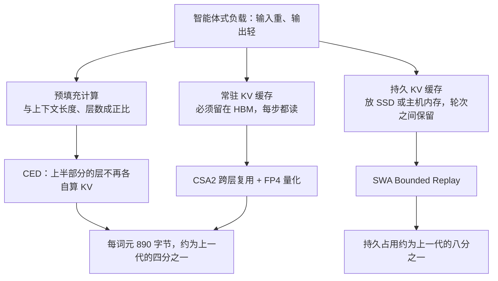
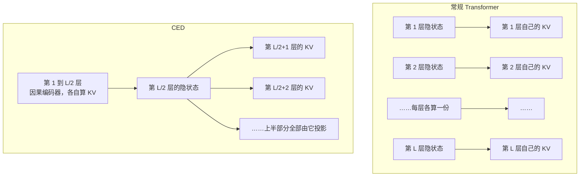
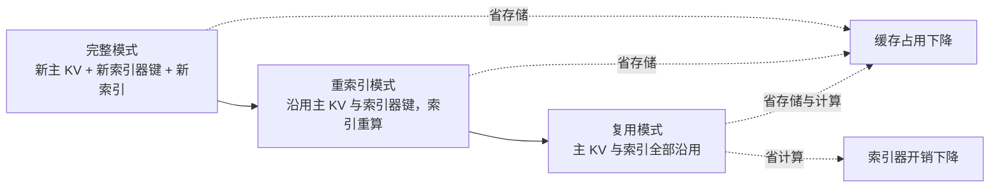

# DeepSeek-V4.1-Flash：把 KV 缓存压到每个词元 890 字节

> **原题**：DeepSeek-V4.1-Flash: Pushing the Limits of KV Cache Compression
> **作者**：DeepSeek-AI，署名作者 591 位
> **机构**：DeepSeek-AI
> **年份**：2026（arXiv ID 2609.19969，2026 年 9 月 17 日提交）
> **分类**：cs.CL
> **链接**：https://arxiv.org/abs/2609.19969
> **精读日期**：2026-09-19

## 阅读须知

### 这篇在领域里的位置

大模型推理的成本，这几年被拆成了三笔账来算。第一笔是算力，也就是模型每吐出一个词元要做多少次乘加；第二笔是显存，模型权重与中间状态要占多大空间；第三笔是带宽，这些状态要以多快的速度在芯片与内存之间搬运。早期的优化几乎都盯着第一笔，做法是让模型在推理时只激活一部分参数，混合专家架构就是这条路上最成功的产物。

可是当模型被用来当作长时工作的智能体之后，账目的重心变了。智能体的活计是读大量的东西再做少量的输出：翻一个代码库、读几十页文档、把之前几十轮的对话全部带上。这种负载被称为输入重，它的开销不落在生成那一端，而落在把输入读进去的那一步，也就是预填充，以及读进去之后必须一直保存着的那份中间状态，也就是 KV 缓存。

KV 缓存的麻烦在于它随上下文长度线性增长，而且必须常驻在速度最快也最昂贵的高带宽显存里。上下文推到百万词元时，这份缓存会大到既装不下也搬不动。于是近两年出现了一批专门针对它的工作：有的把缓存量化到更低的位宽，有的让相邻层共用同一份缓存，有的只保留一部分词元的缓存而把其余丢掉。这些手段各自有效，但都是单点改良。

这篇论文所在的位置，是把这些单点手段合成一套，并且为此改动了模型的主干结构。它要回答的不是某一种压缩能省多少，而是在结构、量化、部署三个层面同时施压之后，KV 缓存这笔账最低能压到什么程度，以及压到那个程度之后模型还剩下多少能力。

### 读完能回答什么

1. 为什么智能体这一类负载会把优化的重心从生成那一端挪到预填充与 KV 缓存这一端。
2. 因果编码器解码器这个结构改动到底改了什么，它凭什么能把预填充的计算量近乎减半。
3. 压缩稀疏注意力第二版里的三种模式各自省掉了什么，为什么缓存共享与索引复用要分开处理。
4. 常驻缓存与持久缓存是两笔不同的账，论文分别用什么手段去压，各自压掉了多少。
5. 把缓存压到原来的四分之一之后，模型的能力是退了还是进了，论文用什么证据支撑这个结论，其中哪些证据站得住，哪些偏软。

### 阅读前置

这份笔记假定读者知道 Transformer 里自注意力的基本形态，知道推理时为什么要把此前每个词元的键与值保存下来，也大致听说过混合专家这种只激活部分参数的做法。不假定读者了解稀疏注意力的具体实现、低位宽浮点格式的细节，或者推理服务的分层存储架构，这些在用到时都会先铺垫再展开。

### 首次出现的缩写与术语表

- **KV 缓存**（Key-Value cache）：自回归生成时，此前每个词元算出的键与值会被保存下来，供后续词元的注意力计算复用。它的大小随上下文长度线性增长，是长上下文推理的主要存储开销。
- **预填充**（prefill）：把整段输入一次性读进模型、算出全部 KV 的那一步。与之相对的是逐词元产出的解码（decode）阶段。
- **HBM**（High Bandwidth Memory，高带宽显存）：贴在加速芯片旁边的高速显存，容量小而昂贵。常驻的 KV 缓存必须放在这里。
- **MoE**（Mixture-of-Experts，混合专家）：把前馈层拆成很多个专家，每个词元只路由到其中少数几个，从而让总参数量远大于单次计算量。
- **CED**（Causal Encoder-Decoder，因果编码器解码器）：本文提出的主干结构，下半部分的层负责编码，上半部分的层不再各自产生 KV。
- **CSA2**（Compressed Sparse Attention 2，压缩稀疏注意力第二版）：本文的注意力机制，通过跨层复用与稀疏选择来减少需要存储和计算的 KV。
- **SWA**（Sliding Window Attention，滑动窗口注意力）：每个词元只关注最近的固定数量的邻居，因此不需要为它保留全局缓存。
- **索引器**（indexer）：稀疏注意力里负责挑选「这个查询该关注哪些历史词元」的小模块，通常输出一个 Top-K 列表。
- **FP4 / E2M1 / E4M3**：四位与八位的浮点格式。E2M1 指两位指数一位尾数，E4M3 指四位指数三位尾数，后者在本文里被用作前者的缩放因子。
- **OPD**（On-Policy Distillation，同策略蒸馏）：让学生模型在自己产生的轨迹上向教师模型对齐的一种后训练手段。

## 一、问题

推理成本这件事，过去几年一直在往下走，可是走法变了。早先降本的主要手段是让模型每一步少算一点，混合专家把这条路走得相当远：总参数可以堆到几千亿，而每个词元实际只激活其中很小一部分。这套办法对聊天式的负载非常有效，因为那种负载的输入短、输出长，成本几乎全在逐字生成的那一端。

智能体把这个前提推翻了。一个连续工作几个小时的编程智能体，它的一轮交互可能要读进整个仓库的相关文件、上一轮的全部输出、以及工具返回的长篇日志，而它自己吐出来的往往只有几十行代码或者一句判断。输入与输出的比例反了过来，成本的大头也就跟着挪到了输入这一侧。

输入这一侧的开销有两块。一块是预填充的计算：把几十万词元一次读进去，每一层都要为它们算出键与值，这笔计算与上下文长度和层数都成正比。另一块是这些键与值算出来之后的存放：它们必须留着，因为后续每一个新词元都要回头看它们，而且必须留在高带宽显存里，因为每一步都要读。论文开篇的判断就落在这里，原话是说计算、存储与带宽三项需求共同构成了进一步降低部署成本的首要瓶颈。

前人针对这三项分头做过不少事。量化那一支把缓存从十六位压到八位甚至更低；跨层共享那一支让若干相邻层共用同一份缓存，省下成倍的存储；稀疏注意力那一支干脆不让每个查询都看全部历史，只挑最相关的一批，于是不相关的那部分缓存可以被挪到更慢更便宜的存储上去。这些路子都被验证过，问题是它们各自解决三项中的一项，彼此之间还可能互相掣肘：稀疏选择本身需要一个索引器，而索引器自己也要存东西、也要算。

于是这篇论文要处理的问题可以这样写下来：在不牺牲能力的前提下，把长上下文推理中 KV 缓存的常驻占用与持久占用同时压到前一代模型的几分之一，并且让预填充的计算量也一并降下来。这三件事必须一起解决，因为单压其中一项，瓶颈只会挪到另一项上去。

## 二、方法

模型本身是一个多模态的混合专家，主干五千五百二十亿参数，支持最长一百万词元的上下文。它在解码时每个词元激活一百六十亿参数，而在预填充时只激活八十亿。这个不对称本身就是为智能体负载设计的：输入重的负载里，预填充占的比重更大，所以让预填充这一侧更便宜。

### 因果编码器解码器

这是主干上最大的一处改动。常规的 Transformer 里，每一层都从自己的隐状态投影出这一层的键与值，因此层数越多，需要计算和存储的 KV 就成倍增加。

这篇论文把整个栈从中间切开。下面一半的层照常工作，被称为因果编码器。上面一半的层不再从各自的隐状态投影 KV，而是直接从第 L/2 层的隐状态投影出来。也就是说，上半部分所有层共用同一个来源。

这样做的直接后果是预填充的复杂度从与层数成正比降到与层数的一半成正比，论文写作从 O(NL) 降到约 O(NL/2)。需要注意的是滑动窗口那一部分的计算仍然逐层进行，被省掉的是全局注意力所需的那部分 KV 投影。

### 压缩稀疏注意力第二版

CSA2 管的是哪些层需要真算 KV、哪些层可以拿现成的。它给每一层静态指定三种模式之一。

第一种是完整模式：这一层要算出新的主 KV、新的索引器键，以及新的 Top-K 索引。第二种是重索引模式：主 KV 与索引器键直接沿用前面某一层的，但索引要重新算一遍。第三种是复用模式：主 KV 与索引都沿用，什么都不新算。

把缓存共享与索引复用拆成两件事，是这里的关键设计。论文的说法是，共享主 KV 与索引器键省下来的是存储，而复用 Top-K 索引省下来的是索引器的计算。两者的收益来自不同的账目，所以应当能够分别开关，而不是绑在一起。

### 分层稀疏索引器

稀疏注意力要挑出该看的那一批历史词元，这个挑选动作本身的代价与上下文长度成正比：候选越多，索引器要打分的对象就越多。上下文推到百万词元时，这笔开销本身就变得可观。

解码器这一侧的做法是把索引器排成层级。较深层的索引器不再面对全部历史，而是只在较浅层已经挑出来的候选池里继续挑。这样一来，每个查询在深层的索引开销从与上下文长度成正比，变成了与上下文长度无关的常数。

### FP4 的键值缓存

量化这一支的常规做法是把缓存从十六位压到八位。这篇论文把量化感知训练推进到四位，格式是 E2M1，也就是两位指数一位尾数，并且每十六个通道共用一个 E4M3 格式的缩放因子。

收益是直白的：相对八位，存储占用几乎再减半，而且这个减半在显存与卸载到固态硬盘时同样成立。论文称训练过程中只有边际的精度损失。

### 滑动窗口的有界重放

到这里压的都是常驻缓存，也就是必须一直待在显存里那一份。还有另一份账：多轮智能体交互之间，上一轮的状态需要保留下来，这部分通常被放在固态硬盘或者主机内存里，称为持久缓存。

滑动窗口注意力的状态按说需要精确重建，代价是与层数乘以窗口大小成正比的一段重放。这篇论文选择不做精确重建，只重放最近的 n_win 个词元，并把滑动窗口截断到这一段重放区间之内，接受由此得到的近似状态。

这个取舍把持久缓存压到了上一代的大约八分之一。论文称评测中的性能退化可以忽略。

### 具体的规格与训练

结构上是四十层，编码器与解码器各二十层。隐藏维度五千一百二十。最前面两层是纯滑动窗口注意力，其余十八个编码器层使用压缩比为二的 CSA2，二十个解码器层使用压缩比为一的 CSA2。每层三百八十四个路由专家加一个共享专家，每个词元激活六个。窗口大小一百二十八，索引器的 Top-K 取五百一十二。

预训练用了四十五万亿词元的多模态语料，纯文本与多模态的词元配比是七比一。优化器不是单一的一种：线性变换用 Muon，RMSNorm 用 AdamW，嵌入层用经过 Sinkhorn 平衡的更新。学习率在前二十八万亿词元维持在 2.6×10⁻⁴，此后按余弦退火到 2.6×10⁻⁵。批大小一亿零六十万词元。序列长度在预训练阶段是六万四千，到三十四万亿词元处扩展到一百万。

后训练沿用标准流程，监督微调之后做强化学习与同策略蒸馏。论文自己声明这一块没有算法上的创新，投入主要放在大规模自动化的数据合成与环境构建上。另外单独训练了名为 DSpark 的投机解码模块，以及称为 Engram 的条件记忆模块。

## 三、实验

先看最要紧的那组数：常驻在显存里的全局 KV 缓存被压到每个词元八百九十字节，约为上一代 DeepSeek-V4-Flash 的四分之一；放在固态硬盘或主机内存里的持久缓存约为上一代的八分之一。这两个数字是整篇论文的落点。

能力这一侧，与自家前两代的对比是这样的。

| 基准 | V4-Flash | V4-Pro | V4.1-Flash |
|---|---|---|---|
| MMLU-Pro（5-shot） | 68.3 | 73.5 | **74.1** |
| HumanEval（0-shot） | 69.5 | 76.8 | **79.4** |
| GSM8K（8-shot） | 90.8 | 92.6 | **93.0** |
| BigCodeBench（Pass@1） | 56.8 | 59.2 | **60.6** |

值得注意的是比较的对象。V4-Flash 是同一条产品线的上一代，V4-Pro 则是更大的那一档。新模型在这四项上不仅胜过同档的前代，也胜过上一代里更大的那一档，而它的缓存占用只有前者的四分之一。这是全文最有力的一组证据：压缩没有以能力为代价。

多模态方面，MMMU-Pro 得分五十六点五，DocVQA 在以大模型为裁判的评分下得九十五点六，RefCOCO 的平均准确率八十六点零。

智能体方面的表述则明显偏软。论文称模型在 Terminal-Bench 2.1 这类标准智能体基准上与闭源前沿模型相当，又称它能够完成超过百分之九十五的真实世界任务，同时保持低延迟与低服务成本。前一句有基准可查，后一句没有：什么叫真实世界任务、样本怎么选、由谁判定完成，论文都没有交代。

## 四、局限

论文自己承认的那一处很坦率：后训练部分没有算法创新，只是把已有流程配上大规模的自动化数据合成与环境构建。这等于说，这一版的进步全部来自结构、量化与部署三处，而不是训练方法。对读者来说这反而是有用的信息，它把因果关系限定得比较清楚。

除此之外，读完之后还能看出几处值得留意的地方。

最软的一处是那句百分之九十五。一个没有定义的分母配上一个很高的比例，在论文里不构成可检验的主张，在宣传材料里却极有杀伤力。它与前半句那个有基准可查的说法放在同一段，容易让读者把两者的可信度当成一样。

第二处是几项近似的代价没有被量化。滑动窗口的有界重放明确接受了近似状态，FP4 量化明确承认有精度损失，论文对这两处都用了可忽略与边际这样的词，却没有给出对照数字。一个压缩方法最该回答的问题恰恰是它在什么条件下开始失效，而失效边界在这篇论文里是缺席的。

第三处是因果编码器解码器这个结构本身。上半部分二十层全部从第 L/2 层的那一个隐状态投影出 KV，这意味着整个上半部分能看到的历史信息被那一层的表示能力框住了。在短上下文里这未必要紧，可在百万词元的长度上，这个瓶颈会不会随长度放大，论文没有讨论，也没有给出随上下文长度变化的消融。

第四处是比较的范围。表格里最主要的对照是自家的前两代，横向与其他实验室的开源模型对比着墨不多。自比能说明这一代比上一代好，说明不了这套方案在同类工作里处在什么位置。

最后是可复现性。检查点已经公开，这一点比大多数同类工作做得实在。但训练本身需要四十五万亿词元的多模态语料与相应的算力，外部要复现训练过程仍然不现实，能被独立检验的只有推理侧的那些数字。

## 一句话

用结构、量化与部署三处改动把常驻 KV 缓存压到每词元 890 字节、约为上一代四分之一，而能力反超更大的上一代。
