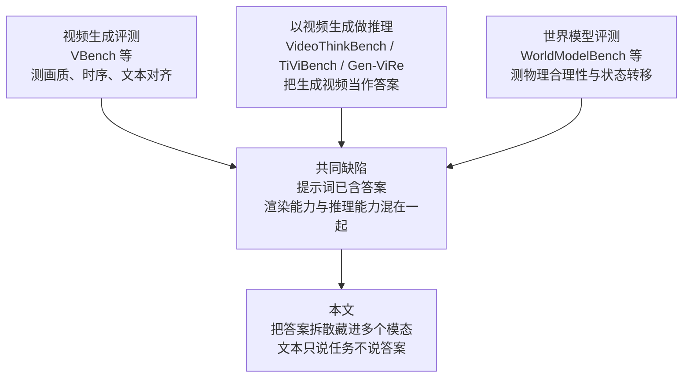
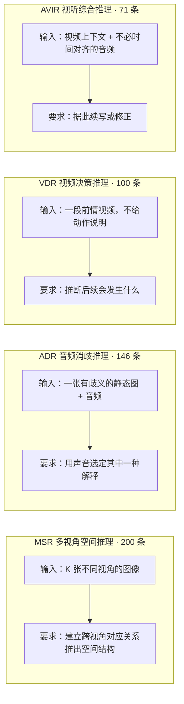
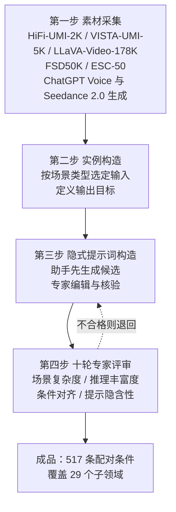
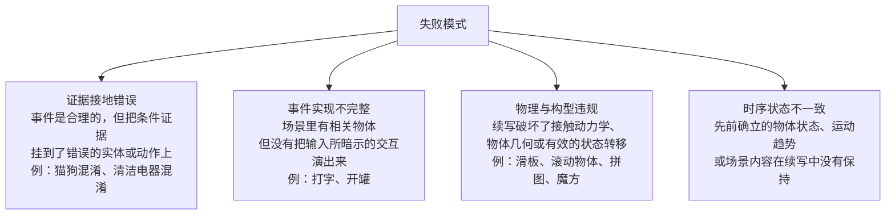

# MiniMax-H3 能对物理世界做推理吗：一个面向全模态生成模型的评测框架

> **原题**：Can MiniMax-H3 Reason About the Physical World? An Evaluation of Omni-Modal Generative Model
> **作者**：Haoyu Zhao, Zihao Zhao, Tianyu Deng, Ziqin Xu, Zihao Zhang, Xudong Wang, Jinxiang Guo, Chen Gao, Ziyi Ye, Yeying Jin, Jiaxi Gu, Zuxuan Wu, Shuicheng Yan
> **机构**：新加坡国立大学（主要）、复旦大学、腾讯
> **年份**：2026（arxiv ID 2609.18323，2026 年 9 月 16 日提交）
> **分类**：cs.CV
> **链接**：https://arxiv.org/abs/2609.18323
> **精读日期**：2026-09-20

---

## 阅读须知

### 这篇在领域里的位置

视频生成这个方向在过去三年里走过了两个阶段。第一个阶段解决的是"能不能生成"，也就是给一段文字或者一张图，模型能不能吐出一段看上去连贯、清晰、不闪烁的视频。这个阶段的评价标准围绕画质、时序稳定性与文本对齐程度展开，代表性的评测框架是 VBench 这一类。到了第二个阶段，画面本身已经足够好看，于是问题变成了"生成的东西对不对"，也就是视频里的物体运动是否符合力学、状态变化是否自洽、因果关系是否成立。围绕这个问题出现了一批被称作世界模型评测的工作，WorldModelBench 是其中一个。

这篇论文站在第二个阶段的末尾，提出了一个更尖锐的质疑。它指出现有的评测有一个共同的结构性缺陷：提示词里已经把答案说清楚了。当你对模型说"生成一段杯子从桌边掉下去摔碎的视频"，模型不需要知道任何关于重力和脆性材料的事，它只需要把这句话里的几个名词与动词渲染出来。于是评测测到的是渲染能力，而不是推理能力。

与此同时，模型这一侧正在发生一个变化。所谓全模态生成模型开始出现，它们不只接受文字，还同时接受图像、视频与音频，并且把这些输入放进同一个潜空间里联合处理，再联合生成画面与声音。MiniMax-H3 就是这样一个模型。这类模型的出现让一个新的评测设计成为可能：既然模型可以同时看见多个视角、听见声音、看过一段前情，那就可以把答案拆散，分别藏在不同的模态里，让文字提示词本身不包含答案。模型必须把这些线索拼起来，才能生成正确的结果。

这篇论文做的就是这件事。它不提出新模型，也不提出新的训练方法，它提出的是一套评测协议以及一份数据集，并且用这套协议测了一个模型。

### 读完能回答什么

读完这份笔记之后，应当能回答下面这几个问题：

1. 为什么"提示词与目标视频高度匹配"会让视频生成的评测失去意义，而所谓隐式提示词又是怎样绕开这个问题的？
2. 全模态输入具体让哪些新的评测任务成为可能，这四个维度分别在考察什么样的能力？
3. 五百一十七条评测样本是怎样造出来的，十轮专家评审在其中把关的是什么？
4. 为什么在四个维度里，靠声音消歧的那一类成绩最差，而看前情推后续的那一类最好？
5. 一个只测了单个模型的评测论文，它的结论能支撑到什么程度，不能支撑什么？

### 阅读前置

这份笔记假定读者熟悉神经网络的基本概念与视频生成的大致流程，知道扩散模型大致在做什么，也接触过一两个多模态模型。但不预设读者做过视频生成的评测工作，也不预设读者了解世界模型这个子领域的具体文献。所有涉及本子领域的术语都会在首次出现时铺垫。

### 首次出现的缩写表

- **Omni-Modal Generative Model**（全模态生成模型）：同时接受文本、图像、视频、音频作为输入，并且能联合生成画面与声音的模型。与只接受文本的视频生成模型相对。
- **MSR**（Multi-view Spatial Reasoning，多视角空间推理）：本文四个评测维度之一，考察模型能否把多张不同视角的图像拼成一个一致的空间结构。
- **ADR**（Audio-based Disambiguation Reasoning，基于音频的消歧推理）：本文四个评测维度之一，考察模型能否用声音去消解画面本身的歧义。
- **VDR**（Video-based Decision Reasoning，基于视频的决策推理）：本文四个评测维度之一，考察模型能否从一段前情视频推断出接下来会发生什么。
- **AVIR**（Audiovisual Integrated Reasoning，视听综合推理）：本文四个评测维度之一，要求同时整合视频上下文与音频证据。
- **SR**（Success Rate，成功率）：本文唯一的评价指标，由人工判定每条样本成功或失败，取成功比例。
- **VBench**：一个广泛使用的视频生成评测框架，侧重画质、时序与文本对齐等感知层面的维度。
- **WorldModelBench**：一个面向世界模型的评测框架，侧重指令遵循、物理合理性与状态转移。

---

## 一、问题

### 为什么这个问题值得做

先把这件事放到一个具体的场景里。假设你要用一个视频生成模型做一段短片，你写下提示词"一只手把一枚硬币投进玻璃罐，硬币落到罐底"。模型给你一段画面：手、硬币、玻璃罐都在，光影也漂亮。可是仔细看，硬币穿过了玻璃壁而不是从罐口进去，或者硬币落下去之后罐子里的水位没有变化，又或者落地的声音出现在硬币还悬在半空的时候。画面每一帧单独拿出来都无可挑剔，合起来却不成立。

这种失败在实际使用里非常常见，而现有的评测基本测不出来。原因在于评测的组织方式。绝大多数视频生成的评测走的是这样一条路径：准备一批提示词，让模型生成，然后由人或者由另一个模型去判断生成的视频与提示词是否对得上。这个流程有一个隐含的前提，就是提示词把要生成的内容描述清楚了。一旦这个前提成立，模型就可以退化成一台渲染机器：把提示词里的名词找出来画上去，把动词找出来动起来，任务就算完成。至于硬币为什么会落下、玻璃为什么挡得住它，模型完全不需要知道。

于是出现了一个尴尬的局面。一方面，业界普遍相信视频生成模型内部学到了某种关于世界的知识，甚至把它们称作世界模型；另一方面，现有的评测体系在设计上就无法把这种知识与单纯的渲染能力分开。要想把两者分开，唯一的办法是让提示词不再包含答案，而是把答案拆散，藏到模型必须真正去解读的地方。

过去做不到这一点，是因为输入通道太窄。当模型只能接受文本，提示词就是唯一的信息来源，你没有别的地方可以藏东西。全模态模型的出现改变了这个条件。既然模型可以同时看见四张不同角度的照片、听见一段声音、看过前面五秒的画面，那就可以把关键信息分散到这些通道里去。文字只负责说清楚任务是什么，不负责说答案是什么。这正是这篇论文的立足点。

### 前人的三条路线

这篇论文把相关工作梳理成三条线索，每一条都推进了一部分，也都在同一个地方卡住。

第一条是**视频生成的评测**。这条线上的工作衡量的是感知质量、语义对齐、时序组合性以及物理真实度。它们把视频拆成若干个可量化的维度，逐项打分。这条路线的问题在于，它的输入设定几乎清一色是显式的文本或者图像条件，也就是前面说的那个结构性缺陷。

第二条是**通过视频生成来做推理**。这条线上的工作把生成的视频本身当作一道题的答案，VideoThinkBench、TiViBench 与 Gen-ViRe 都属于这一类。它们已经开始触碰"隐含的世界规则"这个概念，思路上离本文最近。不过这些工作的输入仍然以文本为主，没有利用多模态输入所能提供的信息分散能力。

第三条是**世界模型的评测**。这条线关心指令遵循、物理规律的遵守、场景一致性以及依赖动作的状态转移。它比第一条更靠近"对不对"这个问题，但它的关注点是模型生成的结果是否违反物理规律，而不是模型能否从分散在各处的证据里把事件推断出来。

把这三条线放在一起看，缺口就清楚了。已有的工作要么在测渲染，要么在测生成结果是否违规，都没有在测"从分散的证据里把事件推出来"这件事。这篇论文要补的正是这一块。

---

## 二、方法

### 被测对象：MiniMax-H3 是什么

在讲评测之前，先说清楚被测的模型。MiniMax-H3 被论文描述为一个开放权重的通用全模态生成模型，它的特点是把多模态的上下文理解与视听联合生成放进同一个潜空间框架里。

这句话需要展开。所谓同一个潜空间框架，意思是文本、图像、视频、音频这四类输入不是各走各的编码器然后在最后拼起来，而是被映射到一个共享的表示空间里，在那里它们彼此可以互相影响。输出这一侧同样如此，画面与声音是一起生成的，而不是先生成画面再配音。这个设计的直接后果是，模型原则上可以接受"同一个事件的若干个不完整观测"，然后输出一个整合了这些观测的结果。论文正是冲着这个原则上的能力去设计评测的。

### 四个维度

评测框架围绕四个互补的维度组织。这四个维度不是随意划分的，它们对应四种不同的"信息分散方式"。

**多视角空间推理**共两百条，分十个子类。给模型 K 张来自不同视角的图像，任何单张图像都不足以确定空间结构，模型必须在多张图之间建立对应关系，再生成一段与这些视角共同支持的空间关系一致的视频。考察的是模型有没有在内部形成一个三维的场景表示，而不是把几张图分别记住。

**基于音频的消歧推理**共一百四十六条，分六个子类。给一张本身存在多种解读的静态图像，再给一段音频，音频提供区分性的证据。模型必须先识别声音里的线索，再把这个线索与画面中的某个具体物体挂上钩，最后生成与之一致的视频。这一类考察的是跨模态的接地能力，也就是声音与画面中的实体能否正确配对。

**基于视频的决策推理**共一百条，分八个子类。给一段前情视频，不告诉模型接下来该做什么，模型需要自己从画面里读出运动趋势与情境，推断出一个合理的后续。考察的是对时序动态与因果后果的理解。

**视听综合推理**共七十一条，分五个子类。这一类要求同时整合视频上下文与听觉证据，而且音频不必与视频在时间上对齐。论文给的一个概念性例子是：音频里给出一条约束，但是这条约束在哪里被违反、应该怎样修正，需要回到视频里去找。这一类是四个维度里综合程度最高的。

四类相加共五百一十七条，覆盖二十九个子领域。

### 数据是怎么造出来的

数据构造分四步，其中第三步和第四步是这篇论文方法上真正的贡献。

第一步是素材采集，来源既有真实数据也有合成数据。视觉侧用到 HiFi-UMI-2K、VISTA-UMI-5K 与 LLaVA-Video-178K，声音侧用到 FSD50K 与 ESC-50 这两个常用的环境音数据集，此外还用 ChatGPT Voice 与 Seedance 2.0 生成了一部分内容。

第二步是按任务类型构造实例，也就是针对每一种场景选定具体的输入组合，定义出这一条样本的正确输出应该是什么样子。

第三步是**隐式提示词构造**，这是整套设计的核心。做法是先让助手模型生成若干候选表述，再由专家逐条编辑与核验。每一条提示词必须同时满足两个条件：其一，单看文本不应当透露目标解释；其二，多模态输入必须足以支撑推出生成结果。这两条合在一起，就把"答案在文字里"这条捷径堵死了，同时又保证题目是可解的，不至于变成猜谜。

第四步是**十轮专家评审**，沿四个方向逐轮打磨：场景复杂度、推理丰富度、条件对齐、提示隐含性。前两个方向保证题目有足够的难度与信息量，后两个方向保证题目既可解又不泄题。十轮这个数字本身说明了一件事，即这类题目很难一次性写对，泄题与不可解这两个失败方向都很容易踩中。

### 怎么评分

评分完全依靠人工。每一段生成的视频由三位独立的专家评审。四个维度各有各的判定要点：多视角空间推理看空间关系与动作是否协调一致；音频消歧看结果是否与给定的音频一致；视频决策看续写是否顺着观测到的运动走；视听综合看音频里的信息有没有被正确反映出来。

指标只有一个，成功率。每条样本由评审给出零或一的二值判断，成功率就是成功样本占全体的百分比，写成公式是

$$\mathrm{SR}(\mathcal{D}) = \frac{100}{|\mathcal{D}|} \sum_{i \in \mathcal{D}} s_i, \quad s_i \in \{0, 1\}$$

其中 $\mathcal{D}$ 是某个评测子集，$|\mathcal{D}|$ 是该子集的样本数，$s_i$ 是第 $i$ 条样本的二值成绩。

这里值得停一下。用二值判断而不用分档评分，好处是评审之间的一致性高，判断"这段视频有没有完成任务"比判断"这段视频完成得有多好"要稳定得多；代价是分辨率低，一个几乎做对但差一点的结果与一个完全跑偏的结果拿到相同的零分。考虑到这是一份以人工评审为唯一手段的评测，作者选择稳定性而不是分辨率，是合理的取舍。

---

## 三、实验

### 主结果

论文只评测了一个模型，就是 MiniMax-H3 本身。在全部五百一十七条样本上，总体成功率为 **41.97%**。

四个维度的成绩差距很大：

| 维度 | 样本数 | 成功率 |
|---|---|---|
| 基于视频的决策推理（VDR） | 100 | 56.00% |
| 视听综合推理（AVIR） | 71 | 47.89% |
| 多视角空间推理（MSR） | 200 | 43.50% |
| 基于音频的消歧推理（ADR） | 146 | 27.40% |
| **总体** | **517** | **41.97%** |

最高与最低之间差了将近二十九个百分点。这个跨度本身比总体那个数字更有信息量，它说明模型的能力在不同模态组合上极不均衡。

具体来说，从一段视频往后推是这个模型相对最擅长的事，成功率超过一半；而用声音去消解画面歧义是它最不擅长的事，不到三成。换句话说，把画面接着画下去，模型做得还行；把声音听懂并且与画面里的某个物体对上号，模型多数时候做不到。这一点值得注意，因为视频这个模态与模型的输出模态是同构的，而音频不是。模型在同构的模态上表现好，在异构的模态上表现差，这至少提示了一种可能，即所谓的跨模态对齐在这个模型里并没有真正做到对等。

### 子类的分布

每个维度内部的分布同样悬殊，下面把论文给出的全部子类成绩列出来。

**多视角空间推理**（总体 43.50%）：穿线 75.00%、倾倒 58.30%、装载 50.00%、装配 50.00%、排布 47.80%、操控 42.90%、形变 41.20%、搬运 34.80%、关节运动 34.60%、清理 33.30%。

**基于视频的决策推理**（总体 56.00%）：交通 100.00%、记忆 66.67%、动物 63.64%、人物 55.88%、合成场景 52.63%、物理 50.00%、卡通 20.00%、拼图 16.67%。

**基于音频的消歧推理**（总体 27.40%）：自然声 54.50%、人声 31.30%、音乐 25.00%、警示音 23.10%、接触声 21.90%、机械声 17.60%。

**视听综合推理**（总体 47.89%）：活动 57.14%、制作 52.38%、提示 50.00%、动画 33.33%、动物 30.00%。

这里面有几处值得单独拎出来说。

交通场景拿到百分之百，而拼图只有 16.67%，两者都在同一个维度里。合理的解释是交通场景的后续高度程式化，车往前开、行人过马路，模型在训练数据里见过无数次；而拼图要求跟踪每一块的位置与朝向，属于需要精确状态维护的任务，这恰好是生成模型最薄弱的地方。卡通只有 20.00% 也指向同一个方向，卡通里的因果关系往往不遵循现实物理，模型学到的那套先验反而帮了倒忙。

音频那一组里，自然声 54.50% 明显高于机械声 17.60%。自然声与画面里的实体对应关系简单，鸟叫对应鸟、水声对应水；机械声则需要辨别具体是哪一类机械，而且同一类机械在不同工况下声音差别很大。这个差距说明模型对声音的处理停留在粗粒度的类别层面，还没有细到可以据此在画面中定位具体物体。

### 关于消融

论文没有做消融实验。作者在第 4.5 节里主动承认了这一点，并指出进一步的受控实验，例如逐个去掉单一模态，或者保持视觉输入不变而替换音频，能够帮助把各个因素分离开。

这是一处明显的欠缺。既然整篇论文的立论是"全模态输入让新的评测成为可能"，那么最应该回答的问题就是：把音频拿掉之后成绩会掉多少？如果掉得很少，说明模型根本没有在用音频，那么音频消歧那一组 27.40% 的低分就不是"听不懂"，而是"压根没听"。这两种解释导向完全不同的结论，而现有的实验无法区分。

### 三点观察

作者在第 4.5 节给出三点观察，这三点是全文最有价值的部分。

第一，**视觉上的合理不等于物理世界的一致**。模型能生成看上去很真实的视频，与此同时违反空间、时序与视听方面的约束。这一点与开头那个硬币的例子完全对应。

第二，**支持多模态不等于能做多模态推理**。模型确实接受多种模态的输入，但是并不能可靠地满足任务要求，在声学接地与多视角协调这两件事上尤其明显。接得进来与用得起来是两回事。

第三，**基于生成的评测反映的是从推理到生成的完整链路**。一个失败的输出可能源于输入理解错误，可能源于跨模态整合不力，也可能源于视频生成本身的缺陷。这既是这套评测的特点，也是它的局限：它测的是端到端的结果，无法定位失败发生在哪一环。

### 四类失败模式

作者在第 4.4 节把失败归为四类，并给出了具体例子。

第一类是**证据接地错误**，模型识别出了一个合理的事件，却把条件证据关联到了错误的实体或者动作上。论文举的例子是猫与狗的混淆，以及清洁电器之间的混淆。这一类失败在音频消歧那一组里应当占了很大比例。

第二类是**事件实现不完整**，生成的场景里相关物体都在，但是输入所暗示的那个交互没有真正被演出来，比如打字或者开罐这样的动作。物体摆在那里，手也在，可是动作本身没有发生。

第三类是**物理与构型违规**，续写破坏了接触动力学、物体几何或者有效的状态转移。滑板、滚动物体、拼图与魔方都是这一类的重灾区，它们的共同点是需要维持一个精确且可验证的内部状态。

第四类是**时序状态不一致**，先前已经确立的物体状态、运动趋势或者场景内容在续写过程中没有被保持下来。这一类对于做连续镜头的人来说最熟悉，前一秒还在的东西下一秒不见了，或者颜色换了。

---

## 四、局限

### 作者承认的

作者承认的局限主要有两项。一是没有做消融实验，因此无法把"输入理解"、"跨模态整合"与"视频生成"这三个环节分开，一个失败的样本究竟坏在哪一环，现有的实验说不清楚。二是评测集的覆盖面还不够，作者计划在未来扩充更多样的物理世界场景、模态组合与推理要求，并且发展自动化的评测框架。

自动化这一条尤其现实。目前每一条样本要三位专家独立判定，五百一十七条样本意味着一千五百次以上的人工判断。这个规模已经接近手工评测的上限，想要扩充到几千条，人工这条路走不通。

### 读完能看出来的

除了作者自己承认的，还有几处问题值得指出。

**只测了一个模型，这是最大的问题。** 整篇论文的实验对象只有 MiniMax-H3 一个。于是 41.97% 这个数字失去了参照系：它究竟说明这个模型不行，还是说明这套题目本来就难？如果把一个只接受文本的视频生成模型放进来做对照，哪怕它在需要多模态输入的题目上只能拿到很低的分，这个对照也能立刻把"题目难度"与"模型能力"分开。没有这个对照，读者无从判断。

**子类的样本量太小，百分数不能当真。** 以基于视频的决策推理为例，一百条样本分到八个子类，从论文给出的百分数反推分母，人物一类是三十四条，动物一类是十一条，拼图一类只有六条，交通一类更少。在六条样本上得到的 16.67% 意味着六条里对了一条，而交通那个 100.00% 很可能是五条里对了五条。这样的数字波动极大，换一批样本结论就可能翻转。把它们并列成一张表，容易给人一种精确的错觉。论文正文对这些数字做了不少解读，其中一部分解读的统计基础并不牢靠。

**人工评分的一致性没有报告。** 每条样本由三位专家独立评判，那么三人之间的一致率是多少？分歧时如何裁决，是取多数还是重新讨论？论文没有交代。对于一份以人工评分为唯一指标的评测，这是必须披露的信息，否则读者无法判断这个 41.97% 的误差带有多宽。

**二值判定抹掉了程度差异。** 前面提过，用零一判断换取了评审的稳定性，代价是分辨率。在失败模式里，"事件实现不完整"与"物理与构型违规"显然不是同一程度的错误，前者是漏做，后者是做错，可是在成功率这个指标下它们都是零分。这使得成功率的提升与模型的实际改进之间不一定是单调对应的。

**数据来源里混入了生成内容，可能带来污染。** 素材里包含由 ChatGPT Voice 与 Seedance 2.0 生成的部分。用一个生成模型产出的内容去评测另一个生成模型，两者的分布若有重叠，评测结果会偏乐观。论文没有讨论这一点，也没有报告真实素材与合成素材在成绩上是否存在系统性差异。

### 对做视频生成的人意味着什么

抛开评测方法本身的问题，这篇论文的三点观察对实际做视频的人有直接用处。

最有用的一条是"视觉上的合理不等于物理世界的一致"。这意味着挑片子的时候不能只看画面漂不漂亮，必须逐条去验状态：前一个镜头里出现的物体，在后一个镜头里还在不在、还是不是原来的样子。四类失败模式里的"时序状态不一致"就是连续镜头最常见的塌陷方式。

第二条有用的是关于声音。模型在音频消歧上只有 27.40%，说明指望模型自己"听懂"音频再据此生成画面，目前并不可靠。声音这条线还是应该由人来定，不要交给模型去推断。

第三条是关于任务类型的选择。程式化程度高的场景，比如交通，模型做得相当好；需要维持精确状态的场景，比如拼图、魔方、滚动的物体，模型基本做不好。在设计分镜的时候避开后一类，比事后反复重生成要省力得多。

---

## 一句话

把答案拆散藏进图像、音频与前情视频里，再看全模态模型能不能拼回来，MiniMax-H3 在五百一十七道这样的题上只做对了 41.97%，其中靠声音消歧一项仅有 27.40%。
