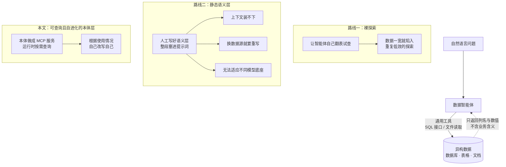
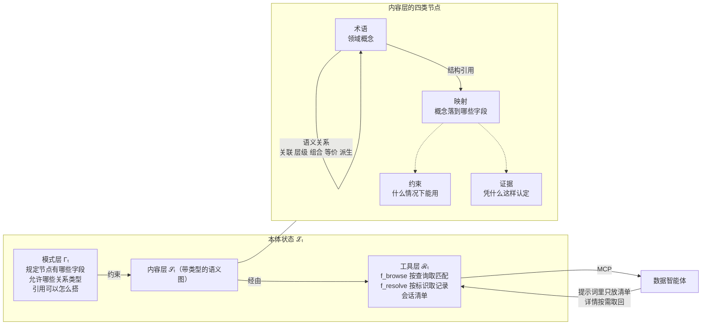
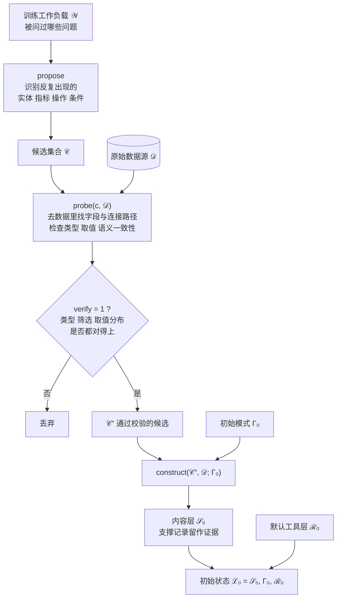
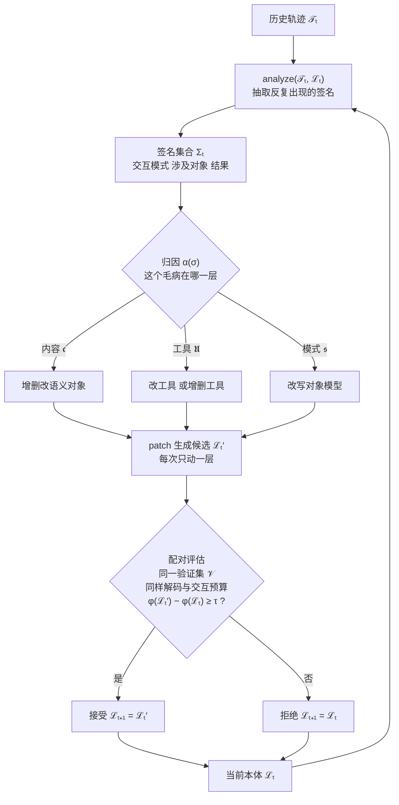

# EvoOntology：一层会自己生长的本体，架在数据智能体与数据之间

> **原题**：EvoOntology: A Self-Evolving Ontology Layer for Data Agents
> **作者**：Meiduo Chong, Shaolei Zhang, Ju Fan, Xiaoyong Du
> **年份**：2026（arXiv ID 2609.15779，2026 年 9 月 14 日提交）
> **分类**：cs.AI / cs.CL / cs.DB
> **链接**：https://arxiv.org/abs/2609.15779
> **精读日期**：2026-09-21

## 阅读须知

### 这篇在领域里的位置

这几年「数据智能体」逐渐成为一个独立的研究方向。它要解决的事情说起来朴素：人用自然语言提一个问题，比如「去年第四季度北欧区哪些产品线的毛利率下滑超过五个百分点」，然后由一个大语言模型驱动的智能体自己去找表、写查询、读文件，最后把答案给出来。这件事之所以难，不在于模型不会写 SQL，而在于模型并不知道公司的数据仓库里「毛利率」被存成了哪一列，也不知道「北欧区」在维度表里究竟是一个地区编码还是三个国家代码的并集。

针对这个困难，过去两三年大致形成了两条路线。第一条是让智能体自己去探索，给它一个 SQL 接口和一个文件读取工具，让它先把表结构列出来、随便查几行看看，边看边猜。第二条是事先由人把业务语义写成一层文档，通常叫语义层，然后整段塞进提示词里，让模型照着读。前者的问题是数据一大就陷进去出不来，后者的问题是写起来昂贵、换个数据源就得重写，而且塞不进上下文。

这篇论文站在第三个位置上。它既不让智能体裸奔，也不把语义层当成一份静态文档灌进提示词，而是把语义层做成一个可以被运行时查询的服务，并且让这个服务自己根据智能体的使用情况不断改写自己。论文把这层东西叫作本体层。

### 读完能回答什么

- 「智能体与数据之间的鸿沟」具体指什么，为什么给模型看一眼表结构并不能弥合它
- 为什么把语义层整段塞进提示词这件事，在实验里有时候反而让分数下降
- EvoOntology 的三层结构各自装什么，为什么要把它们分开而不是揉成一份文档
- 自进化闭环凭什么保证改出来的本体不会越改越差，那个接受门槛在数学上是怎么定义的
- 为什么同一份初始本体在不同的大模型底座上会进化成不同的样子，论文用什么数字证明了这件事

### 阅读前置

这份笔记假定读者熟悉大语言模型的基本用法，知道什么是提示词与上下文长度限制，大致了解智能体这种「模型调用工具、观察结果、再决定下一步」的循环范式。不假定读者做过数据库或知识图谱方向的研究，涉及本体、语义层、文本转 SQL 这些概念的地方都会先铺垫再展开。

### 首次出现的缩写表

- **数据智能体（data agent）**：由大语言模型驱动、通过工具去访问表格与数据库并回答自然语言问题的系统
- **本体（ontology）**：一套把领域概念、概念之间的关系、以及概念如何落到具体数据字段上的形式化描述。可以粗略理解为一份「机器能查的业务词典」
- **语义层（semantic layer，缩写 SL）**：介于原始数据与使用者之间的一层业务含义描述，传统上由数据团队手工维护
- **MCP**（Model Context Protocol，模型上下文协议）：一种让大模型以统一方式调用外部工具与数据源的协议。这篇论文把本体做成一个 MCP 服务，智能体便可以像调用工具一样查询它
- **ReAct**：一种经典的智能体范式，模型交替产出推理文字与工具调用，根据工具返回结果决定下一步
- **DDR-Bench**（Deep Data Research Benchmark）：面向多数据源深度研究任务的评测集，论文用的是其中的 10-K 年报场景
- **InsightBench**：面向商业分析的评测集，数据以 CSV 表格形式给出
- **BIRD**：一个贴近真实业务库的文本转 SQL 评测集
- **EX**（Execution Accuracy，执行准确率）：生成的 SQL 执行之后结果是否正确
- **VES**（Valid Efficiency Score，有效效率分）：在结果正确的前提下，衡量生成的 SQL 执行效率高不高

## 一、问题

设想一家公司把十几年的经营数据摊在那里，有几百张数据库表，有散落在各处的 CSV 文件，还有一堆年报与合同的原始文本。现在要让一个智能体回答「哪条产品线的库存周转在恶化」。模型本身的推理能力是够的，它知道库存周转怎么算，可它不知道这家公司把库存记在哪张表里，更不知道那张表里有三列名字都带着 inventory，其中两列是历史遗留、早就没人写入了。

这就是论文所说的智能体与数据之间的鸿沟。数据住在智能体外面，智能体只能透过一些通用工具去够它，比如执行一段 SQL、读取一个文件路径。这些工具能返回列名和数值，却不携带任何关于「这一列到底是什么意思、什么时候能用、和哪一列必须一起用」的知识。

面对这道鸿沟，此前的做法分成两支。

第一支让智能体直接去探索原始数据。它可以先把表结构列出来，再试探性地查几行看看数据长什么样，然后根据观察到的东西调整下一步。这条路在数据量小的时候确实好用，因为几张表翻一遍也就看完了。可一旦数据又宽又杂，论文的措辞是智能体「很容易陷进重复而低效的探索里出不来」。原因不难理解：模型每看一列都要消耗上下文，看到第五十列的时候，第一列看到了什么早就被挤出窗口了。

第二支预先构造一层语义层，把业务含义与元数据写清楚，再整段放进提示词。这条路绕开了探索的低效，却撞上另外两堵墙。一堵是上下文长度，论文直言「对于大型数据源，把整个语义层放进智能体上下文是不现实的」。另一堵是维护成本，现有的语义层通常是预先定义、人工维护的，因此「构造起来昂贵，而且难以适应新的数据源、新的任务与新的智能体」。

值得单独留意的是最后那半句话，也就是「适应不同的智能体」。这篇论文后面用实验说明了一件反直觉的事：同一份语义层，对某个模型底座是助力，对另一个底座可能是干扰。静态文档天然无法照顾这种差异。

## 二、方法

### 本体的状态：三个层次

EvoOntology 把某一时刻的本体状态写作一个三元组，记为 ℒₜ = (𝒮ₜ, Γₜ, ℛₜ)。这三个分量分别是内容层、模式层与工具层。把它们分开而不是揉成一份文档，是这篇论文在结构上最关键的一个决定，因为后面的自进化要能分别改动这三处。

**内容层 𝒮ₜ** 是一张带类型的语义图，也就是真正装着业务知识的那一层。图里的节点分成四个家族。术语节点记录领域概念，比如「毛利率」这个概念本身。映射节点负责把概念落到具体字段上，说明「毛利率」对应的是哪张表的哪一列，或者由哪几列算出来。约束节点写明使用规则，比如某一列只在某个时间段之后才有效。证据节点保存支撑性的记录，也就是当初凭什么认定这个映射是对的。

图里的边分成两个家族。语义关系连接术语与术语，关系类型包括关联、层级、组合、等价、派生这几种。结构引用则把术语连到它的映射上，并把约束与证据挂上去。

**模式层 Γₜ** 管的是「内容层允许长成什么样」。它定义上述四个节点家族各自有哪些字段、允许出现哪些语义关系类型、以及引用可以按什么模式来搭。论文强调了一个后果：「模式更新因此可以扩展本体的表达能力，而不必改动已经实例化的内容」。换句话说，模式层是元层面的，动它等于放宽或收紧本体的表达边界。

**工具层 ℛₜ** 是本体对外的接口，以两个 MCP 工具的形式暴露出来。`f_browse(q, k, n)` 接受一个查询 q 与一个种类 k，返回最相关的 n 条语义匹配。`f_resolve(ℐ, c)` 接受一组标识符，返回对应的记录以及与之相连的对象。除这两个工具之外，还有一份会话清单，在智能体初始化时提供一份紧凑的来源与用法说明。

这里的设计意图值得点出来。进入提示词的只有那份清单，它很短；详细记录一概不进提示词，而是由智能体在需要的时候通过工具取回。这样就绕开了「语义层塞不进上下文」这个死结，代价是智能体必须学会主动去问。

### 构建智能体：初始本体从哪里来

初始本体 ℒ₀ 不是人写的，而是由一个构建智能体从训练工作负载 𝒲 与原始数据源 𝒟 自动造出来的。需要强调的前提是，这个过程看不到标准答案，它只看得见有哪些问题被问过，以及数据本身长什么样。

第一步是工作负载引导的探查。构建智能体先从训练工作负载中提出一批候选，写作 𝒞 = propose(𝒲)，做法是识别那些反复出现的实体、指标、操作与分析条件。对每个候选 c，它再发起 probe(c, 𝒟)，去数据里找可能对应的字段与连接路径，并检查这些字段的类型、取值与语义是否自洽。

第二步是凭证据提交。只有探查结果通过校验的候选才会被真正写进本体：

𝒞⁺ = {c ∈ 𝒞 | verify(probe(c, 𝒟)) = 1}

𝒮₀ = construct(𝒞⁺, 𝒟; Γ₀)

其中 verify 这个函数检查的是声明的类型、筛选条件与取值分布要求是否成立。通过校验的候选按初始模式 Γ₀ 实例化，当初支撑它的那些记录则作为证据保留下来。这一步决定了本体里的每一条都是有据可查的，而不是模型凭印象编出来的。

第三步是与默认工具层 ℛ₀ 合在一起，构成初始状态 ℒ₀ = (𝒮₀, Γ₀, ℛ₀)。

### 自进化闭环：让本体跟着用法改自己

本体造出来之后并不冻结。进化智能体会观察智能体实际怎么用它，然后提出修改。这个闭环由四个环节构成。

**归因分析**。给定历史轨迹 𝒯ₜ 与当前状态 ℒₜ，进化智能体抽取出反复出现的签名 Σₜ = analyze(𝒯ₜ, ℒₜ)。每个签名概括一种交互模式、其中牵涉到哪些本体对象、以及观察到的结果如何。随后由一个归因函数把签名指派到三个层次之一，写作 α: Σₜ → {𝖈, 𝖀, 𝖘}，分别对应内容、工具与模式。这一步回答的是「这个毛病该在哪一层修」。

**带类型的编辑**。编辑动作按层次分成三类。内容层的干预是增删改内容层里已经实例化的语义对象。工具层的干预是修改已有工具，或者增删工具。模式层的干预是改写对象模型本身。

**局部化介入**。对某个已归因的签名 σ，进化智能体提出候选 ℒₜ′ = patch(ℒₜ, σ, α(σ))。论文明确限制说「每个候选只修改一个层次」，只有当多个内容对象在实现同一个假设时，才允许它们一起更新。这条限制让每次改动的因果关系保持清楚。

**底座条件下的配对评估**。这是整个闭环里防止越改越差的那道闸门。接受准则是：

ℒₜ₊₁ = ℒₜ′，当 φ(ℒₜ′, 𝒱, m) − φ(ℒₜ, 𝒱, m) ≥ τ；否则 ℒₜ₊₁ = ℒₜ

意思是把候选本体与它的父本体放在同一个验证集 𝒱 上、用同样的解码设置与同样的交互预算各跑一遍，只有当候选的得分比父本领先达到门槛 τ 时才接受，否则丢弃、保留原样。这里的 m 指的是具体的模型底座，而论文特意说明「所有底座都从同一个初始状态 ℒ₀ 各自独立地进化」，因此被接受的修改会反映出该底座特有的交互习惯。

## 三、实验

### 设置

评测跨三个基准。DDR-Bench 取的是 10-K 年报场景，考的是跨多个数据源做研究的能力，指标有两个，逐条消息的准确率与整条轨迹的准确率。InsightBench 是商业分析基准，数据以 CSV 给出，指标是洞察分与摘要分。BIRD 是贴近真实业务库的文本转 SQL 基准，指标是执行准确率与有效效率分。

主实验用了四个模型底座，分别是 GPT-5.5、GPT-5.6-sol、Claude-Sonnet-5 与 Claude-Opus-4.8，另外在 DeepSeek-V4-Flash 与 Qwen3.5-Flash 上补做了测试。

对照组有两个。一个是不带本体层的 ReAct，记作 Baseline。另一个是把构建智能体造出来的语义层当作静态提示词片段整段前置，记作 Baseline + SL。后面这个对照组是整篇论文里最有说服力的那一个，因为它与本文方法用的是同一份语义内容，区别只在于「整段塞进提示词」还是「做成服务按需查询」。

评测协议采用互惠两折。每个基准切成 A、B 两折，在 A→B 这一轮里，A 的百分之七十用于构建与进化本体，百分之三十用作配对验证，B 只用于最终评测；最后报告的是两个方向得分的平均值。

### 主要结果

DDR-Bench 上的轨迹准确率提升最为显著。

| 底座 | Baseline | EvoOntology | 提升 |
|---|---|---|---|
| GPT-5.5 | 64.2% | 90.9% | +26.7 |
| GPT-5.6-sol | 68.5% | 93.5% | +25.0 |
| Claude-Sonnet-5 | 72.5% | 81.3% | +8.8 |
| Claude-Opus-4.8 | 73.0% | 92.3% | +19.3 |
| DeepSeek-V4-Flash | 30.3% | 52.3% | +22.0 |
| Qwen3.5-Flash | 14.3% | 19.1% | +4.8 |
| 平均 | | | **+17.8** |

BIRD 上的执行准确率提升幅度较小但相当整齐，六个底座分别提升 7.4、7.2、9.9、10.8、6.4 与 2.5 个百分点，平均提升 7.4 个百分点，有效效率分平均提升 8.6 个百分点。InsightBench 上的平均提升只有 1.9 个百分点，论文把原因归于这个基准采用参考答案式的打分，分数本身已经接近饱和；其中提升最大的是 DeepSeek-V4-Flash，从百分之三十九点八升到百分之四十五点九。

### 三个反直觉的结果

第一个值得单独拎出来。静态语义层不是无害的。在 Claude-Sonnet-5 上，Baseline + SL 的轨迹准确率比什么都不加还要低 15.0 个百分点。论文给出的解释是静态提示词会与智能体自身的指令相互竞争。同样的现象在 BIRD 上换了个方向出现：Baseline + SL 的执行准确率最多掉了 5.6 个百分点，可有效效率分在所有底座上都是上升的，也就是说 SQL 写得更快了但更容易写错。

第二个是本体与记忆的比较。论文拿 ReAct 加情景记忆做了对照，轨迹准确率是百分之七十五点八，而 EvoOntology 是百分之八十九点五。论文的措辞很精准：「情景记忆只是重放做过的事，并不暴露出带类型、可组合的结构」。这句话点明了两种持久化机制的本质差别。

第三个是成本。加了本体之后每一轮的输入词元从三千二百升到四千六百，看上去更贵了，可每个任务的总成本反而从五万二千六百降到四万二千，降了约两成。原因在轨迹长度上：平均交互轮数从十四点六轮降到八点四轮。少走弯路省下来的，超过了每轮多读一点资料花掉的。

### 消融

把构建出来的初始本体与自进化拆开看，两部分都有贡献但不对等。初始本体相对 Baseline 在三个基准上分别带来 12.3、0.8 与 5.1 个百分点的提升，自进化在此之上再加 7.7、0.2 与 3.7 个百分点。

进化闭环四个环节的消融显示那道闸门最要紧。去掉闸门，轨迹准确率掉 11.2 个百分点；去掉归因掉 6.3；去掉诊断掉 4.8；去掉修补只掉 1.7。这个顺序说明，能不能改对不是最关键的，能不能拦住改错的才是。

三个层次的编辑权限分别开放时，工具层单独贡献最大，为 13.2 个百分点，内容层为 8.7，模式层为 3.6，三层全开是 20.0。三者之和大于各自单独之和，说明层次之间存在互补。

本体结构各部分的重要性则是另一个顺序。屏蔽映射，轨迹准确率掉 13.4 个百分点，是最吃重的一块，因为它承担着把概念落到字段上的接地职责。屏蔽证据掉 8.7，屏蔽约束掉 3.5，屏蔽关系只掉 2.1。

关于收敛，四个底座都呈现单调改善，到第四、第五轮趋于平缓。内容层的扩张主要发生在前三轮，第三轮之后每轮增幅低于百分之五，术语数量从初始的六十一条增长到五轮后的八十条。

最后是跨底座的分化。不同底座进化出来的本体，术语标识符的两两 Jaccard 重叠度最高只有 0.62。把一个底座进化出的本体拿给另一个底座用，分数下降 6.6 到 10.9 个百分点。这两个数字支撑了「按底座分别进化」这个设计选择。

## 四、局限

论文没有专门写局限一节，以下分两部分，先说作者自己承认或在设定中明示的，再说读完之后能看出来的。

作者在方法设定里明示的约束主要有两条。其一是本体的构建依赖一份有代表性的训练工作负载，因为候选概念是从「被问过哪些问题」里提出来的，工作负载覆盖不到的领域，本体自然也长不出来。其二是所有底座从同一个初始状态出发各自独立进化，这意味着初始本体的质量会为后续所有进化设定天花板。

读完之后能看出来的问题有几处。

接受门槛 τ 是一个超参数，而整个闭环的安全性完全押在它身上。消融显示去掉闸门要掉 11.2 个百分点，可论文没有讨论这个门槛取值的敏感性，也没有给出调它的依据。门槛定高了本体几乎不动，定低了噪声会被当成改进接受下来，这中间的余地有多大，读者无从判断。

按底座分别进化在效果上是对的，代价却是每换一个模型就要把进化过程重跑一遍。论文报告了每个任务的推理词元数，却没有报告构建智能体与进化智能体本身跑完一轮要花多少时间与多少钱。在只关心单次任务成本的场景下这笔账是划算的，可要是把适配成本摊进来，结论可能不一样。

互惠两折的评测协议要求把数据切开并留出验证集。对于那些本来就只有一份数据、也谈不上什么训练工作负载的场景，这套方法怎么起步，论文没有回答。

还有一处更微妙。凡是进入本体的条目都要求有数据层面的证据支撑，这保证了准确性，但也意味着那些在数据里没有直接体现、却对理解业务很关键的概念，比如某条口径为什么在二〇二三年变过一次，很难被提交进来。这类知识恰恰是人工语义层最擅长承载的部分。

## 一句话

把语义层从塞进提示词的静态文档，改造成智能体可运行时查询、并按使用情况自我改写的服务。
