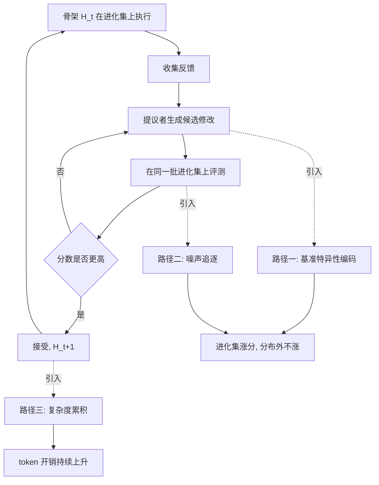
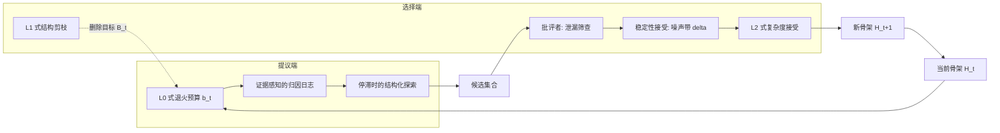
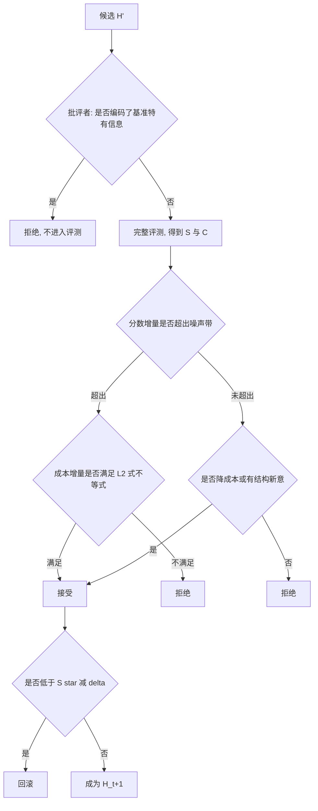

# 带正则的递归自我改进：让智能体骨架的进化不只在自己那套题上变好

> **原题**：RRSI: Regularized Recursive Self-Improvement of Agent Harnesses
> **作者**：Peng Xia, Rujun Han, Zifeng Wang, Yanfei Chen, Yufan Zhang, Yoonho Lee, Chengsong Huang, Han Yu, Zhongying CuiZhu, Yifei Ming, Huaxiu Yao, Burak Gokturk, Tomas Pfister, Chen-Yu Lee
> **机构**：arxiv 摘要页未逐一列出署名单位
> **年份**：2026（arxiv ID 2609.24972，9 月 21 日提交）
> **分类**：cs.LG / cs.AI / cs.CL
> **链接**：https://arxiv.org/abs/2609.24972
> **精读日期**：2026-09-22

## 阅读须知

### 这篇在领域里的位置

过去两年，让大语言模型智能体变强的办法明显分成了两条路。一条是继续训模型本身，把参数往更好的方向推；另一条是把模型冻住不动，转而去打磨围绕它的那一层工程结构。这一层结构在英文文献里叫 harness，本文一律译作「骨架」，它包含提示词、控制流、工具接口、记忆机制以及上下文的组织方式。同一个模型换一副骨架，在同一个基准上的成绩可以差出十几个百分点，这个现象在 2025 年之后已经被反复观察到，于是骨架本身成了一个值得优化的对象。

顺着这条路往下走，自然会想到把骨架的调优也交给模型来做。具体的做法是让一个大模型充当「提议者」，读取当前骨架的运行反馈，提出若干条修改方案，再在一批任务上逐一评测，把分数最高的那一版留下来，如此循环。这个循环在系统层面上构成了一种递归自我改进，英文缩写 RSI。本文所处的位置，是这条路线走了一段之后开始反噬的地方：人们发现循环跑得越久，骨架在用来进化的那批任务上涨得越好，换一批任务却常常把涨幅吐回去，甚至比没进化之前还差。

### 读完能回答什么

- 为什么骨架的递归自我改进会过拟合，而这种过拟合与监督学习里那种过拟合在机制上有何不同
- 「自适应过拟合」的三条具体失效路径分别是什么，它们各自由哪一个环节引入
- L0、L1、L2 这三种经典正则的思想如何被翻译到一个没有可微参数的搜索过程上
- 为什么本文的方法在进化集上的涨幅反而比对照方法更小，而这一点恰恰是它想要的结果
- 为什么加了约束之后推理开销不升反降，少掉的那三成 token 是从哪里省出来的

### 阅读前置

假定读者熟悉大语言模型的基本用法与智能体的一般结构，知道提示词、工具调用、上下文窗口这些概念各自指什么，也了解过拟合与正则化在监督学习里的含义。不预设读者做过智能体骨架的自动优化，也不预设读者读过本文引用的那几个前作。文中出现的 L0、L1、L2 正则会在用到时重新铺垫一遍，不要求读者能立刻写出它们的表达式。

### 缩写表

- **RSI**（Recursive Self-Improvement，递归自我改进）：让系统反复修改自身结构并保留更好版本的循环过程。本文讨论的是发生在骨架层面而非权重层面的那一种。
- **RRSI**（Regularized Recursive Self-Improvement，带正则的递归自我改进）：本文方法的名字，即在上述循环的提议端与选择端同时施加约束。
- **harness（骨架）**：围绕冻结模型的那一整层工程结构，包含提示词、控制流、工具、记忆与上下文管理。
- **evolve set（进化集）**：骨架进化过程中反复评测所用的那一批固定任务，它在本文里扮演的角色相当于监督学习中的训练集。
- **OOD**（Out-of-Distribution，分布外）：不参与进化、用来检验骨架是否真的变强的那些基准。
- **ID held-out**（In-Distribution held-out，同分布留出集）：与进化集同源但未参与进化的任务，用来区分「记住了这批题」与「记住了这类题」。
- **policy token（策略 token）**：执行任务时由被冻结的那个模型实际消耗的 token，本文用它来衡量骨架的运行成本。

## 一、问题

先说清楚不解决它会怎样。如果一家公司决定不再频繁训练模型，转而让一套自动流程去改进智能体的骨架，那么它每一轮拿到的报告都会是好消息，因为分数确实在涨。问题出在这个分数是在同一批任务上反复量出来的。等这套骨架被放到真实业务里，面对的是没见过的工单、没见过的代码仓库、没见过的设计题，此前积累的那些涨幅可能一分都兑现不了。更糟的是骨架在这个过程里变得越来越臃肿，每一轮都往上叠一点新的分支与提示，推理成本持续上升，而这部分成本是实打实要付的。

这一类失效在监督学习里有一个现成的名字叫过拟合，但机制并不相同。监督学习的过拟合发生在参数空间里，模型的容量可以用权重的范数去度量，正则化也就有地方施加。骨架进化没有可微的参数，它优化的是一段结构化的文本与代码，真正在被反复利用的是「在同一批任务上反复评测再据此决定去留」这个反馈通道。于是本文把问题重新表述为：需要正则化的不是假设空间的大小，而是搜索轨迹对有限反馈的利用强度。

作者把观察到的失效拆成三条彼此耦合的路径。第一条是基准特异性编码，也就是骨架把进化集里那些任务的名字、实体取值、固定套路直接写进了逻辑，这类修改在进化集上必然涨分，换一批任务立刻失效。第二条是噪声追逐，同一个骨架在同一批任务上跑两遍，分数本身就有波动，而只要选择规则是「分数高就留下」，那么纯粹由噪声带来的虚假涨幅也会被永久固化。第三条是复杂度累积，每一轮的修改都倾向于增加而非删减，长期下来骨架里堆着大量既不产生收益又持续消耗 token 的分支。

前人的方法在这个循环上并没有分歧。本文点名的四个对照方法 Meta-Harness、AHE、TTHE 与 HarnessX，走的都是「执行、取反馈、提议、评测、择优」这同一套流程，区别只在提议者的提示方式与评测的组织方式。它们共同留下三处没有处理的松动：提议端可以把许多互不相关的修改打包进同一个候选，导致事后无法归因究竟是哪一条起了作用；已经被证伪的机制会在后续轮次里被反复重新提出，白白吃掉搜索预算；选择端只要分数不降就接受，既不区分涨幅是否超出噪声，也不过问这一点涨幅需要付出多少额外开销。

## 二、方法

RRSI 的总体思路是保持骨架的修改空间完全开放，只约束搜索如何在这个空间里行进。用符号写出来，第 t 轮的候选集合与接受规则是：

**ℋ_t ~ P_reg(· | H_t, ℱ_t, ℒ_t, b_t, ℰ_t, ℬ_t) ⊆ Ω(H_t)，H_{t+1} = arg max_{H' ∈ ℋ_t ∩ 𝒜_t} Ŝ(H')**

这里 H_t 是第 t 轮的骨架，Ω(H_t) 是它所有可能修改构成的全集，ℋ_t 是本轮实际被提出的候选子集，ℱ_t 是运行反馈，ℒ_t 是历史日志，b_t 是本轮允许的修改条数上限，ℰ_t 是探索方向的提示，ℬ_t 是被标记为待删除的组件集合，𝒜_t 是接受域，Ŝ 是在进化集上量到的分数。值得注意的是 Ω(H_t) 没有被缩小，被缩小的是 P_reg 这个提议分布与 𝒜_t 这个接受域。

### 提议端的三件事

第一件是把每一轮允许打包的修改条数做成一条退火曲线。它的形式是余弦退火：

**b_t = ⌈b_min + (b_max − b_min) · ½(1 + cos(πt/T))⌉**

其中 T 是总轮数。在早期轮次里 b_t 接近 b_max，允许一个候选同时改动若干处，因为此时需要的是大幅度的结构探索；到了后期 b_t 降到 b_min，每个候选只能改一处，于是任何涨幅都能被明确归到某一条修改上。这一步对应的是 L0 正则的思想。L0 正则在监督学习里约束的是非零参数的个数，也就是「一次最多让多少个自由度动起来」，这里被翻译成「一个候选最多捆绑多少条可独立归因的修改」，写作 ‖z_t‖₀ ≤ b_t。

第二件是把每一次评测都记进一份带归因信息的日志。每条被评测过的修改都会留下它改的是哪个组件、背后的假设是什么、具体的 diff、分数与成本各自变了多少、以及最终是否被接受。提议者在生成下一批候选时会读这份日志，于是那些已经被证伪的机制不会被反复重提。日志还会按组件聚合，维护一个被改动过的组件集合 𝒯_t 与每个组件近期的最佳收益 g_t(ℓ)。

第三件是在进展停滞时强制换方向。停滞的判据是最近 w 轮的分数增量不超过噪声阈值，即 Ŝ_t − Ŝ_{t−w} ≤ δ。一旦触发，本轮的提议预算会留出一部分专门用于此前很少被碰过的组件类型。这一步并不限制哪些组件可以存在，它只改变搜索在停滞时的落点分布。

### 选择端的四道关卡

第一道是泄漏筛查。一个被称作「批评者」的模型会在昂贵的完整评测之前先读一遍候选的 diff，凡是把任务名称、实体取值或基准特有逻辑直接写进去的修改，一律在这一步就被拒掉。之所以要放在评测之前，是因为这类修改一旦进入评测就会拿到虚高的分数，从而在后续的择优里显得格外有吸引力。

第二道是稳定性接受。作者先把基础骨架反复评测若干遍，用这些重复评测的波动标定出一个噪声带 δ，然后要求候选满足：

**Ŝ(H') ≥ S★ − δ**

其中 S★ 是迄今观察到的最佳分数。这条规则挡住的是一种很隐蔽的退化：每一轮都接受一点看似落在噪声范围内的小幅下降，积累若干轮之后整体已经明显变差，而每一步单独看都说得过去。

第三道是复杂度感知的接受，对应 L2 正则的思想。L2 正则在监督学习里的作用是让参数的增大必须以足够的损失下降作为交换，这里被翻译成让推理成本的增加必须以足够的分数提升作为交换。对于涨幅超出噪声的候选，即 ΔS > δ 时，要求：

**ΔC ≤ β₀ + β₁ ΔS**

其中 ΔS = Ŝ(H') − Ŝ(H_t) 是分数增量，ΔC = (Ĉ(H') − Ĉ(H_t)) / Ĉ(H_t) 是成本的相对增量，β₀ 是允许的固定成本容忍度，β₁ 是边际成本率。这两个系数在进化集上调好之后就固定下来，迁移评测时不再调整。对于落在噪声带以内的候选，另有一条形态不同的条件：w_s ΔS − w_c ΔC + w_n ν_t(H') > 0，其中 ν_t 衡量结构上的新颖度。它的含义是分数几乎没变的修改只有在降低了成本或带来了结构新意时才允许进入。

第四道是结构剪枝，对应 L1 正则的思想。L1 正则之所以能把参数压到恰好为零，是因为它对小参数的惩罚不随参数减小而衰减，这里被翻译成对长期不产生收益的组件直接删除。形式上，在一个长度为 n_prune 的窗口内收益非正的组件构成待删集合：

**ℬ_t = {ℓ ∈ 𝒯_t : g_t(ℓ) ≤ 0}**

这个集合会被交给提议者作为删除目标，于是骨架在生长的同时也在持续收缩。

## 三、实验

评测覆盖三个领域共八个基准。编程这一侧是 Terminal-Bench 2.1 与 SWE-bench Verified，前者含 89 个以终端操作为主、由单元测试判定的任务，后者取自真实的 GitHub issue，需要在仓库层面改动代码。智能体工作区这一侧以 Harvey LAB 为核心，它给出 120 个任务作为进化集、40 个同分布任务作为留出集，任务内容偏法律，由模型充当评判者打分，另有 JobBench、GDPval 与 APEX-Agents 三个基准完全不参与进化。工程设计这一侧是 EngDesign 的 61 个由确定性仿真器判分的任务，以及 47 个以连续目标函数计分的 Frontier-Eng 任务。

对照方法是未经进化的基础骨架 H₀ 与前面提到的四个自动进化方法，所有方法从同一个 H₀ 出发，使用同一批进化集，策略模型在全过程中冻结。主实验的策略模型是 Claude Opus 4.8，另用 Gemini 3.5 Flash 做稳健性检验。

主结果分两组来看。在用于进化的那一部分上，Terminal-Bench 2.1 从 74.2 涨到 80.2，增加 6.0 分；Harvey LAB 从 89.4 涨到 90.5，只增加 1.1 分；EngDesign 增加 4.9 分。在完全没有参与进化的五个基准上，SWE-bench Verified 从 82.0 涨到 83.8，JobBench 从 36.0 涨到 40.7 即相对提升 13.1%，GDPval 从 48.8 涨到 52.3，APEX-Agents 从 34.2 涨到 37.9，Frontier-Eng 的 Medal 分增加 4.3 即相对提升 24.3%。

真正说明问题的是这两组数字之间的落差，Harvey LAB 那一组尤其典型。RRSI 在进化集上拿到 90.5，是所有进化方法里涨得最少的一个，而它在分布外五个基准上的平均分是 43.6，基础骨架是 39.7。对照之下，Meta-Harness 在进化集上拿到 93.0，比 RRSI 高出 3.6 分，可它的分布外平均只有 39.6，比完全不进化的基础骨架还低了 0.1 分。换句话说，那 3.6 分的差距买到的是一个在真实任务上不如不改的骨架。

| 变体 | 进化集 | 同分布留出 | 分布外平均 | 每次试验 token（百万） |
|------|--------|------------|------------|------------------------|
| H₀ 基础骨架 | 89.4 | 86.9 | 39.7 | 1.56 |
| 完全不加正则 | 92.8 | 88.9 | 40.3 | 3.80 |
| 去掉提议端正则 | 90.7 | 88.8 | 41.9 | 2.69 |
| 去掉接受端正则 | 91.5 | 88.7 | 41.0 | 3.59 |
| RRSI 完整版 | 90.5 | 89.2 | 43.6 | 2.42 |

消融这张表把两端的分工讲得很清楚。去掉接受端的约束之后，进化集从 90.5 升到 91.5，而分布外平均从 43.6 掉到 41.0，相对基础骨架的优势少了将近一半，同时 token 消耗上升 48%。去掉提议端的约束之后，进化集只掉了 0.2 分，分布外却掉了 1.7 分，说明提议端那几条限制并不是在压制能力，而是在决定搜索把预算花在哪里。完全不加正则的那一行最能说明问题：进化集分数是全表最高的 92.8，分布外却几乎没动，停在 40.3。

成本这一侧的结论与直觉相反。RRSI 每次试验消耗 242 万策略 token，四个对照方法在 359 万到 382 万之间，也就是说约束更多的那一版反而省下了三成左右。省出来的部分来自两处，一是 L1 式剪枝持续删掉了不产生收益的分支，二是 L2 式接受条件挡住了那些用大量额外调用换取零点几分的修改。

另有两项迁移检验。把编程骨架的进化换成 Gemini 3.5 Flash 来做，Terminal-Bench 上涨 14.1 分，未参与进化的 SWE-bench 上涨 2.2 分，而同样的流程用 Claude Opus 4.8 得到的是 6.0 分与 1.8 分，说明涨幅的大小与策略模型有关，能够迁移这个性质与策略模型无关。更进一步，用 Gemini 3.5 Flash 进化出来的骨架被换到能力更弱的 Gemini 3.1 Flash Lite 上，准确率从 11.2 升到 14.6，相对提升 30.4%，说明被保留下来的是可复用的机制而不是贴着某个模型脾气写出来的技巧。

## 四、局限

作者自己承认三点。其一，整套方法建立在策略模型权重冻结这个前提上，骨架进化与权重更新同时进行时会发生什么，本文没有讨论。其二，方法依赖一个有限的进化集，并且 β₀、β₁、δ、n_prune 这几个量仍然需要在进化集上调，一旦反馈信号本身质量不高，正则的几道关卡也就失去了判断依据。其三，验证只覆盖了编程、智能体工作区与工程设计这三个领域，更长的进化周期与结构差异更大的骨架尚未检验。

读完之后还能看出另外几处。第一处是批评者这一环节本身是一个模型，它判断「是否编码了基准特有信息」的标准并没有被形式化，一条写得足够抽象的基准特异性修改完全可能通过筛查，而这类漏网恰恰是最难在事后发现的。第二处是噪声带 δ 由基础骨架的重复评测标定，可骨架在进化过程中结构不断变化，它的评测方差未必还与 H₀ 相同，用一个固定的 δ 贯穿全程存在低估或高估的风险。

第三处与评测方式有关。Harvey LAB 这一组由模型充当评判者打分，而进化的目标正是最大化这个分数，于是骨架有可能学会迎合评判模型的偏好而非真正把任务做好。本文用分布外基准来缓解这个问题，可那几个基准里仍有一部分采用同类判分方式。相较之下，EngDesign 与 Frontier-Eng 由确定性仿真器判分，它们上面的涨幅比 Harvey LAB 那一组更值得采信。

## 一句话

把 L0、L1、L2 三种正则的思想搬到骨架进化的搜索轨迹上，用进化集上少涨几分换取分布外多涨几分，同时省下三成推理开销。
