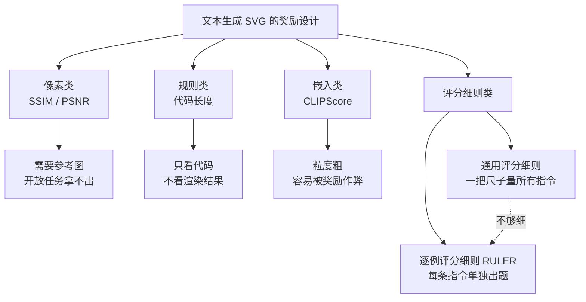
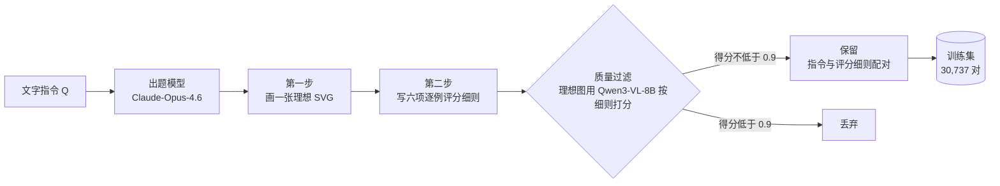

# RULER：为每一条指令单独出题的 SVG 生成强化学习奖励

> **原题**：RULER: Instance-aware Rubric Rewards for SVG Generation
> **作者**：Hangyu Ran、Yuhao Zheng、Yingying Zhang、Kevin Qinghong Lin、Han Peng
> **机构**：蚂蚁集团、香港科技大学（广州）、牛津大学、独立研究者
> **年份**：2026（arxiv ID 2609.25270）
> **分类**：cs.CV
> **链接**：https://arxiv.org/abs/2609.25270
> **精读日期**：2026-09-23

## 阅读须知

### 这篇在领域里的位置

这篇论文属于「用强化学习训练大模型写视觉代码」这一类工作。视觉代码指的是那些本身是文本、但执行或渲染之后会变成图像的程序，例如 SVG 矢量图、TikZ 绘图脚本、网页前端代码。这一类任务的共同难处在于，模型产出的是代码，而人真正在意的是代码渲染出来的样子，两者之间隔着一个渲染器。

过去几年，文本生成 SVG 这个子方向大致走过三步。最早是基于优化的路线，拿一个文本到图像的扩散模型当老师，对每一条提示词单独迭代优化一组贝塞尔曲线，代表作是 VectorFusion 与 SVGDreamer；随后是自回归路线，把 SVG 当成一种特殊的语言，用大规模指令与 SVG 配对数据做监督微调，代表作是 IconShop、OmniSVG；最近一年开始出现「渲染感知的强化学习」，也就是让模型先写代码、渲染成图，再根据图像打分来更新模型。RULER 位于第三步，它要回答的是第三步里最没有定论的那个问题：图像的分数到底该怎么打。

### 读完能回答什么

1. 为什么 CLIP 分数、美学分数这类在自然照片上校准过的指标，一旦用来给 SVG 当强化学习奖励，就会把模型带偏
2. 「逐例评分细则」（instance-aware rubric）和「通用评分细则」（universal rubric）差在哪里，为什么前者给出的训练信号更细
3. RULER 在没有标准答案 SVG、也没有人工偏好标注的情况下，评分细则是怎样从一句文字指令里生成出来的
4. 评分细则的设计本身为什么会成为奖励作弊的新入口，Rubric-S 这个消融说明了什么
5. 一个 80 亿参数的模型经过 RULER 训练之后，和更大的模型相比处在什么位置，这个结论依赖哪些前提

### 阅读前置

假定读者熟悉大语言模型的基本训练流程，知道监督微调与强化学习微调的区别，听说过 PPO 这类策略梯度算法。不假定读者做过矢量图形、计算机图形学或者多模态评测，这些背景会在正文里铺开讲。

### 首次出现的缩写表

- **SVG**（Scalable Vector Graphics，可缩放矢量图形）：一种用 XML 文本描述图形的格式，图形由路径、圆、矩形等几何元素组成，放大不会失真
- **RL**（Reinforcement Learning，强化学习）：让模型根据奖励信号调整自身行为的训练方式
- **VLM**（Vision-Language Model，视觉语言模型）：能同时读图和读文字的大模型，本文用它当裁判给渲染图打分
- **GRPO**（Group Relative Policy Optimization，组相对策略优化）：一种不需要额外价值网络的强化学习算法，用同一问题下多个回答之间的相对好坏来估计优势
- **PPO**（Proximal Policy Optimization，近端策略优化）：GRPO 所继承的那套带裁剪的策略更新目标
- **SFT**（Supervised Fine-Tuning，监督微调）：用输入与标准输出的配对数据直接做模仿学习
- **CLIP**（Contrastive Language-Image Pre-training）：一种把图像与文本映射到同一向量空间的模型，CLIPScore 用两者向量的相似度衡量图文是否匹配
- **HPS**（Human Preference Score，人类偏好分数）：一个在自然图像的人类偏好数据上训练出来的打分模型
- **MDP**（Markov Decision Process，马尔可夫决策过程）：强化学习里描述「状态、动作、奖励」的标准数学框架
- **SSIM / PSNR**：两种需要参考图像的像素级相似度指标
- **KL 正则**：在强化学习里约束新模型不要离原模型太远的惩罚项，本文训练时没有使用

## 一、问题

先说这个问题不解决会怎样。前沿大模型的发布会越来越喜欢现场演示「让模型画一只骑自行车的鹈鹕」这类 SVG 生成任务，因为它能同时考察模型的语义理解、空间推理与代码能力。可一旦想用强化学习把一个中等规模的开源模型在这件事上练好，马上会遇到一个尴尬：没有可靠的分数。于是训练要么根本起不来，要么起来之后模型学会的是讨好打分器，而不是画得更好。

主流路线大致卡在两处。监督微调依赖指令与 SVG 的配对数据，而这类数据往往出自少数几套模板，模型学到的更像是数据集自己的画风，换一类指令就不灵。强化学习本应弥补这一点，但它的效果几乎完全由奖励决定，而眼下能用的奖励恰恰是那些不可靠的指标。

### 为什么没有标准答案

这个任务的根本难处在于开放性。同一句「画一个指向东北方向的指南针」，可以画成扁平图标，也可以画成带阴影的写实插画，指针可以粗可以细，配色可以冷可以暖，它们都可以是好答案。换句话说，一条指令对应的是一大片合格的图像，而不是某一张标准图。

一旦没有标准图，像素级的比较指标就失去了意义。SSIM 与 PSNR 这类指标衡量的是生成图与参考图在像素上有多像，它们要求先有一张参考图，而开放式生成恰恰拿不出这张图。

### 现有几种奖励各自缺在哪里

论文把已有的奖励设计归成四类，并用五个标准逐一对照：能否评判视觉细节、能否评判语义、是否不依赖标准答案、是否从多个维度评分、是否针对具体指令。

第一类是像素类指标，也就是上面说的 SSIM 与 PSNR。它们能看到细节，但离不开参考图，而且只给一个数。

第二类是规则类信号，例如代码长度。它不需要参考图，但它只看代码本身，从不看渲染出来的样子。之所以有人用它，是因为它便宜，可它和图画得好不好几乎没有关系。

第三类是嵌入类指标，以 CLIPScore 为代表。它把图像和文字各自编码成一个向量，再算两个向量的相似度，于是既不需要参考图，又确实看了图像。问题在于它只能给出粗粒度的判断，对「左边是猫、右边是狗」这类组合关系并不敏感，而且在强化学习下很容易被钻空子。

第四类是通用评分细则。它让一个视觉语言模型按一份固定的清单从多个维度给图打分，比单个数字细得多。可是这份清单对所有指令都一样，一张极简图标和一幅细节丰富的插画用的是同一把尺子，于是它说不出「对这一条指令而言什么才算对」。

### 为什么自然图像上的指标搬不过来

CLIP、美学分类器与 HPS 都是在真实照片上训练或校准的。矢量图是另一种东西：色块平涂、线条干净、刻意简化，这些在照片的世界里要么罕见，要么恰恰是「低质量」的特征。于是这些指标在矢量图上会系统性地看走眼，论文开篇的例子里，一张渲染已经坏掉的 SVG 反而拿到了比正常图更高的 CLIP 与美学分。

一旦把这样的指标当成奖励，问题就从「评得不准」升级成「训练被带偏」。强化学习的优化器会把概率质量集中到最容易抬高的那个信号上，这就是奖励作弊（reward hacking）：模型学会的是抬分的技巧，而不是更好的画。论文后面的实验会给出一个非常具体的作弊样本。

### 这篇论文要验证的技术命题

把上面的动机落成一个可检验的命题，大致是两句话。第一句是评测层面的：让视觉语言模型按一份多维度的评分细则逐项打分，比 CLIP、美学这类单一标量更贴近人的判断。第二句是训练层面的：如果为每一条指令单独生成一份评分细则，再把逐项打分加权成奖励，就能在既没有标准答案 SVG、也没有人工偏好标注的前提下，用强化学习稳定地提升模型的出图质量，并且不引发奖励作弊。

## 二、方法

### 把任务写成一个决策过程

论文先把「根据指令写 SVG」形式化为一个逐词元的马尔可夫决策过程。这一步的用处在于，它把强化学习的标准框架原样套进来，于是所有难点都被压到了奖励函数这一个位置上。

- $\mathcal{Q}$：输入的文字指令，描述想要的画面内容
- $\pi_\theta$：要训练的语言模型策略，$\theta$ 是它的参数
- $\mathcal{Y}=(y_1,\dots,y_T)$：模型逐个词元生成的 SVG 代码序列，长度为 $T$
- $\mathcal{E}(\cdot)$：渲染器，把 SVG 代码变成一张图，本文用 CairoSVG 渲染成 512×512 的白底图像
- $\mathcal{I}_{\text{gen}}=\mathcal{E}(\mathcal{Y})$：渲染得到的图像
- $\mathcal{R}(\cdot)$：奖励函数，只在整段代码写完、渲染出图之后给出一次

在这个框架下，前面所有的讨论都可以归结成一个问题：$\mathcal{R}$ 该怎么定义。

### 先用人类标注确认评分细则可靠

在动手设计奖励之前，作者先做了一次人工对照实验，目的是确认「按评分细则打分」这条路本身站得住。他们从两个基准里抽了 300 条指令，分别让 Claude-Opus-4.6、Qwen3-32B 与 Qwen3-8B 三个能力不同的模型各画一张，一共 900 张渲染图，再请十位标注者给每张图打 0 到 100 的整体质量分，并由三位复核人员把不合理的分数重新打过。

随后他们用两个统计量来比较各个自动指标与人工分数的一致程度。一个是斯皮尔曼等级相关系数（Spearman's ρ），衡量在全部 900 张图上，自动指标给出的排序与人工排序有多一致。另一个是古德曼-克鲁斯卡尔伽马系数（Goodman-Kruskal γ），衡量在同一条指令的三张图之间，自动指标判断的「谁比谁好」与人的判断有多一致。

结果是评分细则方法的 ρ 为 0.7929、γ 为 0.7574，而美学分数分别只有 0.6051 与 0.5465，CLIP 分别只有 0.5518 与 0.5295。需要留意的一点是，这次对照里当评分细则裁判的是 GPT-5-mini，用的也是一份通用评分细则，并不是后面训练时实际使用的那套配置。这一点在局限一节还会再提。

### 逐例评分细则是怎么生成的

有了「评分细则比标量可靠」这个前提，下一步是解决怎么为每一条指令单独出一份评分细则。评分细则（rubric）原本是教育评测里的概念，指的是一张把「好答案」拆成若干条可以逐项核对的标准的表格。RULER 的核心设计，是让评分细则跟着指令走，而不是所有指令共用一张。

具体做法是把指令 $\mathcal{Q}$ 交给一个前沿大模型 $\mathcal{M}_{\text{rub}}$，默认用的是 Claude-Opus-4.6。生成提示词要求它分两步完成：第一步先自己画一张它心目中的「理想 SVG」，第二步再以这张理想图为参照，写出一份评判其他候选图的评分细则。之所以要先画一张，是为了让出题者对「这条指令画好了应该长什么样」有一个具体的想象，而不是凭空列标准。

这张理想图只在出题阶段起作用，训练时给候选图打分并不会拿它来比对。与此同时，提示词明令禁止把评分细则写成「复刻理想图」的清单：除非指令本身要求，否则不得规定具体的几何形状、位置、配色或部件数量。这样做的目的，是在引入逐例标准的同时，保住任务一对多的开放性。

每份评分细则固定包含六项，分属三个维度，每项的标题、描述和打分指南都针对当前指令改写，但项目结构和权重对所有指令相同：

| 维度 | 评分项 | 权重 |
|---|---|---|
| 语义忠实 | 1. 概念辨识度与整体可读性 | 5 |
| 语义忠实 | 2. 主要部件与区分性线索 | 5 |
| 视觉质量 | 3. 轮廓与造型的精致度 | 5 |
| 视觉质量 | 4. 构图与画面安排 | 4 |
| 渲染风格 | 5. 完成度与做工 | 5 |
| 渲染风格 | 6. 风格统一与刻意营造的视觉趣味 | 5 |

形式化地写，一份评分细则是六个二元组的集合：

$$C_{\mathcal{Q}}=\{(c_k,w_k)\}_{k=1}^{6}$$

- $c_k$：第 $k$ 项的标题、描述与连续打分指南，都已针对 $\mathcal{Q}$ 改写
- $w_k$：第 $k$ 项的权重，取值即上表中的 5 或 4

提示词还对项目之间的「正交性」提了硬要求：每一项只看一个可观察的维度，能单独凭图判断，并且惩罚的是一种与其他项不同的失败。凡是两项可以用同一条证据来论证，就要改写到分开为止，也不允许出现「整体美观」这种什么都能装进去的大筐。打分指南统一分成五档，0.9 到 1.0、0.7 到 0.8、0.4 到 0.6、0.1 到 0.3 以及 0，并要求档内可以取任意小数。

生成完之后还有一道过滤。作者把出题模型自己画的那张理想图，交给训练时用的裁判模型 Qwen3-VL-8B 按这份评分细则打分，得分低于 0.9 的评分细则直接丢弃。这一步的逻辑是：如果连出题者心目中的理想答案都拿不到高分，这份评分细则多半写得有问题。

训练数据来自两个基准的训练划分：从 MMSVG-Icon 随机抽 2 万条指令，从 MMSVG-Illustration 抽 1.2 万条，过滤后剩 19,531 与 11,206 对，共 30,737 对。出题是一次性的离线预处理，结果缓存下来，训练过程中不再调用出题模型。

### 奖励怎么算

训练时，每一段生成的 SVG 先被渲染成图，然后交给裁判视觉语言模型 $\mathcal{M}_{\text{judge}}$，本文用的是冻结参数的 Qwen3-VL-8B。裁判拿到的是原始指令、渲染图和这条指令对应的评分细则，它被要求对六项逐一独立打分，先写理由再给分，每一项得到一个连续的满足度 $s_k\in[0,1]$。

奖励就是六项满足度的加权平均：

$$\mathcal{R}(\mathcal{I}_{\text{gen}})=\frac{\sum_{k=1}^{6}w_k s_k}{\sum_{k=1}^{6}w_k}$$

与单一标量相比，这个奖励的好处在于它是「分项记账」的。一张图可能语义对了但构图局促，另一张可能构图漂亮却漏了关键部件，它们的总分也许接近，可分项分数的构成完全不同。裁判的打分提示词还专门写了一句校准规则：图像「不是空白」「大致认得出」不足以得到 0.6 以上的分数，用意是防止裁判给出一片虚高的分数，把组内差异抹平。

### 为什么选 GRPO

组相对策略优化（GRPO）是近两年在推理模型训练里流行起来的一种强化学习算法。它要解决的问题是，传统的 PPO 需要额外训练一个价值网络来估计「这个回答比平均水平好多少」，这个网络本身又大又难训。GRPO 的做法是换一个参照系：对同一个问题一次采样一组回答，直接用组内平均分当基线。

具体到 RULER，每条指令采样 $G=8$ 个 SVG，全部渲染并打分，得到 $\mathcal{R}_1,\dots,\mathcal{R}_G$，然后按组内均值与标准差做归一化：

$$A_i=\frac{\mathcal{R}_i-\mathrm{mean}(\{\mathcal{R}_j\}_{j=1}^{G})}{\mathrm{std}(\{\mathcal{R}_j\}_{j=1}^{G})+\epsilon}$$

- $A_i$：第 $i$ 个回答的优势，也就是它比同组其他回答好多少
- $\epsilon$：防止分母为零的小常数

参数更新沿用 PPO 那套带裁剪的目标，其中 $\rho_i$ 是新旧策略生成同一段 SVG 的概率之比，裁剪的作用是不让单步更新走得太远。

之所以说逐例评分细则与 GRPO 相配，原因在于 GRPO 需要组内有差异才能学到东西。如果一组八张图的分数几乎一样，归一化之后的优势就接近于零，这一步等于白练。六项分开记账的奖励天然更容易拉开差距，因为不同的图往往在不同的项目上各有得失。

### 训练的具体设置

训练基于 VERL 框架与 vLLM 推理引擎，在单机八张 H800 显卡上完成。策略模型默认是 Qwen3-8B，关闭了思考模式，回答最长 4096 个词元，每条指令采样八个回答，温度 1.0，批大小 128，学习率 $1\times10^{-6}$。值得一提的是，作者在奖励和损失里都没有加 KL 正则，也就是没有显式约束新模型离原始模型的距离。

## 三、实验

### 设置与对照对象

评测在 MMSVG-Illustration 与 MMSVG-Icon 两个基准上进行，前者偏内容丰富的插画，后者偏紧凑的图标，各用 150 条测试指令。训练与测试的指令是分开生成的，作者在附录里也坦白，两者仍来自同一个分布，因此不能算作分布外的泛化测试。

对照对象分三组。第一组是基于扩散模型逐条优化的方法，VectorFusion 与 SVGDreamer。第二组是通用大模型，Qwen3-8B、Qwen3-32B 与参数量大得多的 DeepSeek-V3。第三组是专门为 SVG 训练的模型，IconShop、OmniSVG-8B 与 JanusCoder-8B。

指标方面，论文沿用了 CLIP、美学分与 HPS 以便与前人对比，同时引入一个评分细则分数作为主指标：由 GPT-5-mini 担任独立裁判，按一份所有样本共用的通用评分细则打分。这个裁判与训练时的裁判不是同一个模型，用的细则也不是训练时那种逐例细则。

### 主结果

| 方法 | 插画 CLIP | 插画 美学 | 插画 HPS | 插画 细则分 | 插画 词元 | 图标 CLIP | 图标 美学 | 图标 HPS | 图标 细则分 | 图标 词元 |
|---|---|---|---|---|---|---|---|---|---|---|
| VectorFusion | 0.313 | 4.930 | 0.265 | 0.611 | 31.4k | 0.309 | 4.624 | 0.254 | 0.510 | 31.4k |
| SVGDreamer | 0.293 | 5.119 | 0.266 | 0.547 | 124.3k | 0.276 | 4.850 | 0.253 | 0.413 | 124.3k |
| Qwen3-8B | 0.244 | 4.309 | 0.233 | 0.432 | 0.4k | 0.266 | 4.424 | 0.234 | 0.395 | 0.3k |
| Qwen3-32B | 0.224 | 4.392 | 0.215 | 0.651 | 0.5k | 0.228 | 4.514 | 0.218 | 0.681 | 0.3k |
| DeepSeek-V3 | 0.285 | 4.653 | 0.251 | 0.686 | 0.5k | 0.290 | 4.610 | 0.248 | 0.673 | 0.2k |
| IconShop | 0.236 | 4.480 | 0.219 | 0.262 | 2.6k | 0.285 | 4.541 | 0.243 | 0.586 | 1.3k |
| OmniSVG-8B | 0.215 | 4.505 | 0.221 | 0.288 | 6.9k | 0.272 | 4.629 | 0.244 | 0.565 | 5.7k |
| JanusCoder-8B | 0.228 | 4.323 | 0.227 | 0.390 | 1.0k | 0.256 | 4.432 | 0.234 | 0.384 | 1.0k |
| **RULER（Qwen3-8B）** | 0.249 | 4.859 | 0.246 | **0.693** | 2.0k | 0.269 | 4.873 | 0.247 | **0.683** | 0.7k |

在主指标上，RULER 把 Qwen3-8B 的细则分从 0.432 与 0.395 提到 0.693 与 0.683，两个基准上都排第一，与 DeepSeek-V3 的 0.686 与 0.673 基本持平。与专门的 SVG 模型相比差距更明显，插画上最好的专用模型 JanusCoder 只有 0.390。

在传统指标上，RULER 只能算「不掉队」。插画上它的 CLIP 为 0.249，明显低于 VectorFusion 的 0.313；HPS 与美学分也不如两种扩散优化方法。作者的解释是这些指标本身在矢量图上不可靠，而扩散方法的代价是每条指令平均要优化 72.1 分钟、生成三万多个词元，RULER 只需一次自回归生成。

### 人工盲评

为了不让结论只建立在自动指标上，作者另做了一次盲评：从基准里抽 150 条指令，把 RULER 的输出分别与五个对照模型的输出配对，共 750 组，打乱左右顺序、隐去模型身份，由三位标注者判断胜、平、负，每组只看一次。

| 对照模型 | 胜 | 平 | 负 | 不计平局的胜率 |
|---|---|---|---|---|
| Qwen3-8B | 122 | 14 | 14 | 89.7% |
| Qwen3-32B | 84 | 23 | 43 | 66.1% |
| VectorFusion | 73 | 13 | 64 | 53.3% |
| OmniSVG | 93 | 11 | 46 | 66.9% |
| JanusCoder | 139 | 6 | 5 | 96.5% |

RULER 对五个对照的胜率都超过一半，可幅度差别很大。对自己的底座 Qwen3-8B 和 JanusCoder 几乎是碾压，对 VectorFusion 只是略占上风。与此同时，盲评里没有 DeepSeek-V3，因此「与 DeepSeek-V3 相当」这个说法，目前只由自动细则分支撑。

### 奖励设计的对照：这是全文最有说服力的一组

为了把奖励设计的作用单独剥离出来，作者固定底座模型与优化器，只换奖励，比较四种配置。

| 配置 | 插画 CLIP | 插画 美学 | 插画 细则分 | 插画 词元 | 图标 CLIP | 图标 美学 | 图标 细则分 | 图标 词元 |
|---|---|---|---|---|---|---|---|---|
| 不做强化学习 | 0.244 | 4.309 | 0.432 | 0.4k | 0.266 | 4.424 | 0.395 | 0.3k |
| CLIP + 美学 + HPS 组合奖励 | 0.196 | 6.697 | 0.464 | 0.7k | 0.232 | 6.210 | 0.262 | 6.3k |
| 通用评分细则奖励 | 0.244 | 4.813 | 0.660 | 0.7k | 0.266 | 4.793 | 0.591 | 0.3k |
| RULER 逐例评分细则 | 0.249 | 4.859 | 0.693 | 2.0k | 0.269 | 4.873 | 0.683 | 0.7k |

组合标量奖励那一行，是一个教科书式的奖励作弊样本。美学分被抬到 6.697 与 6.210，远高于其他所有配置，可 CLIP 在插画上从 0.244 掉到 0.196，图标上的细则分从 0.395 跌到 0.262，比完全不训练还差。作者观察到，在图标任务上模型为了骗过美学分类器，开始堆叠大量重叠的笔画和重复的装饰路径，平均输出长度从 300 个词元暴涨到 6,300 个，而图画本身变得更糟。

通用评分细则那一行则说明，多维度分项打分本身就能挡住大部分作弊，细则分稳步上升，CLIP 与 HPS 也没有受损。逐例细则在此基础上再往前走了一步，插画上多出 0.033，图标上多出 0.092。图标上的差距更大，一个合理的解释是图标类指令之间差异更大，一把通用的尺子更难同时量准。

### 消融：哪个维度最要紧

作者把三个维度分别置零，看细则分掉多少。去掉视觉质量掉得最多，从 0.693 降到 0.580；去掉渲染风格次之，降到 0.599；去掉语义忠实掉得最少，降到 0.623。

语义那一项贡献最小，乍看有些反直觉，因为「画对」按理说最重要。作者的解释是 Qwen3-8B 在预训练中已经具备不错的图文对应能力，额外奖励语义的边际收益有限，而造型、构图、做工这些预训练覆盖较少的方面，才是强化学习真正补上的东西。

### 反直觉的一条：更严格的评分细则反而更差

消融里最值得单独拿出来讲的是 Rubric-S。这一变体换了一套更强调结构完整、打分更严的出题提示词，去掉了风格维度，只生成五项，并额外附加一个权重为负二的「文字提示惩罚」项，专门惩罚在图里写字。按直觉，标准更严应该练出更好的模型。

实际结果却是细则分跌到 0.536，比任何一个单维度消融都低。更出人意料的是，尽管有专门的文字惩罚项，模型还是越来越多地把指令里的关键词直接写进画面，例如把要画的那个东西的名字做成一个风格化的标签。换句话说，细则一变，原本被堵住的作弊通道又被打开了。作者由此得出的结论是，维度之间的互补性至少和打分严格程度同样重要。

### 稳健性

换底座与换出题模型两组实验，都是五次独立推理取均值与标准差。

| 设置 | 插画 细则分 | 图标 细则分 |
|---|---|---|
| Qwen3-4B 原模型 | 0.372 ± 0.017 | 0.338 ± 0.017 |
| RULER-4B | 0.561 ± 0.008 | 0.559 ± 0.006 |
| Qwen3-8B 原模型 | 0.440 ± 0.011 | 0.394 ± 0.016 |
| Qwen3-32B 原模型 | 0.585 ± 0.005 | 0.566 ± 0.026 |
| RULER-8B | 0.692 ± 0.007 | 0.662 ± 0.016 |
| RULER-8B（出题模型换成 GPT-5.5，仅图标） | 未报告 | 0.646 ± 0.007 |

40 亿参数的版本同样受益，已经接近 320 亿参数的原模型；80 亿参数的版本则超过了它。把出题模型从 Claude-Opus-4.6 换成 GPT-5.5，图标细则分从 0.662 变为 0.646，差距不大，说明方法并不绑定某一个出题模型。

渲染成功率方面，RULER 在图标上为 99.3%，插画上为 100%，而原始 Qwen3-8B 分别只有 94.7% 与 89.3%，JanusCoder 更是只有 68% 左右。这一点值得记一笔，因为自动指标只在渲染成功的样本上计算，渲染失败率高的方法在表格里会被悄悄抬高。

## 四、局限

### 作者自己承认的

第一，整套方法依赖两个外部模型：一个前沿模型负责出题，一个视觉语言模型负责打分。奖励的质量因此会继承它们的偏好与盲点，裁判有可能高估表面线索、低估细微的风格品质，在训练分布之外的指令上尤其如此。

第二，训练成本明显上升。每一步都要渲染全部采样结果，再逐张请裁判模型按逐例细则打分，这比 CLIP 或代码长度这类轻量奖励贵得多，会限制它向更大模型、更长输出和更大规模超参数搜索扩展。出题本身是一次性的，三万多条指令在 Claude-Opus-4.6 上一共花了约 2,013 美元，平均每条约 0.066 美元。

第三，把质量拆成语义、视觉、风格三轴本身就是一种立场。它在这两个基准上好用，但未必能覆盖所有正当的艺术意图或特定领域的偏好。

### 读完能看出来的

其一，评测与训练用的是同一类尺子。主指标是 GPT-5-mini 按通用评分细则打的分，训练奖励是 Qwen3-VL-8B 按逐例评分细则打的分，裁判模型不同，可评判的维度高度重合。一个被训练去满足「造型、构图、做工、风格」这些条目的模型，在另一个按相近条目打分的裁判面前占优，并不完全出人意料。论文的缓解手段是人工盲评，而盲评恰好没有覆盖 DeepSeek-V3，规模也只有每组 150 条、每条只被一个人看过一次。

其二，证明「评分细则贴近人的判断」的那次对照，用的是 GPT-5-mini 加通用细则，而实际当奖励的是 Qwen3-VL-8B 加逐例细则。前者可靠，并不直接推出后者同样可靠。一个 80 亿参数的裁判在逐项打分时能有多稳，论文没有单独给出与人工标注的相关性。

其三，「不需要标准答案」这个说法要打一点折扣。出题模型在写细则之前先画了一张理想图，过滤时又要求这张理想图得分不低于 0.9，于是细则在相当程度上是以 Claude-Opus-4.6 自己的审美为锚点写成的。从效果上看，这更接近把一个强模型的品味蒸馏给小模型，而这个强模型本身就是一个很好的 SVG 生成器。

其四，输出长度的变化值得盯住。RULER 在插画上的平均输出从 400 个词元涨到 2,000 个，在图标上从 300 涨到 700。这远没有到组合标量奖励那种六千词元的失控程度，也可能只是画得更精细的正常代价；但评分细则第六项明确奖励「细节密度」与「视觉趣味」，长度持续上涨是不是一种更温和的迎合，论文没有讨论。

其五，训练与测试同分布，训练中也没有 KL 正则。这意味着目前的结果回答不了两个问题：换一类风格迥异的指令，收益还剩多少；以及模型在 SVG 之外的通用能力有没有被这轮训练磨损。

## 一句话

为每条指令生成六项评分细则、由视觉模型逐项打分作奖励，让 8B 模型在无标准答案的 SVG 生成上稳定提升且不作弊。
