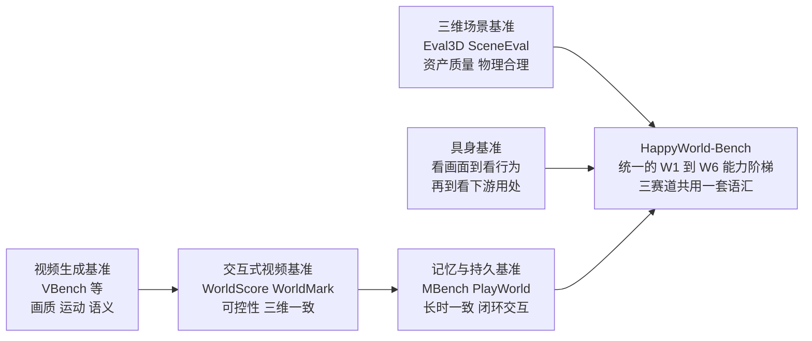
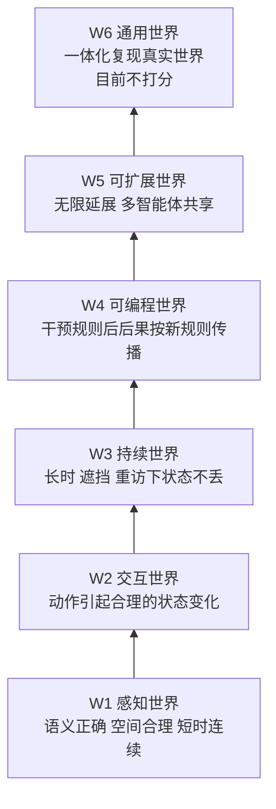
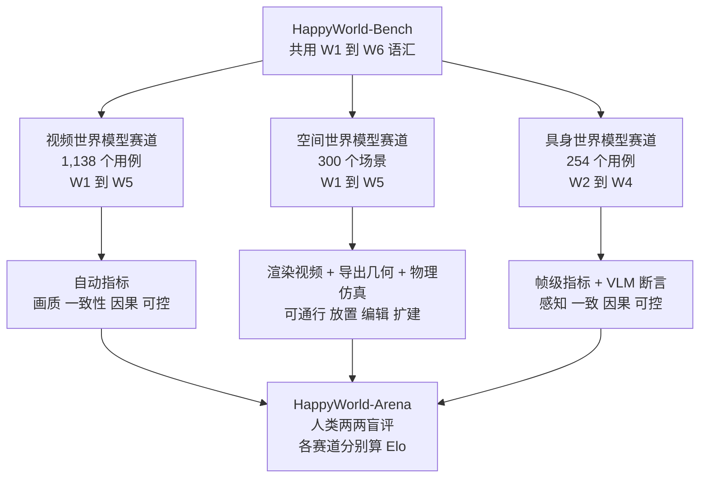

# HappyWorld-Bench：在交互中检验世界模型是否靠得住的统一基准

> **原题**：HappyWorld-Bench
> **作者**：Zhiqi Bai、Junai Cai、Yixin Chen、Siyuan Huang、Song-Chun Zhu 等 36 人（按字母顺序排列）
> **机构**：阿里巴巴 Token Hub、通用人工智能国家重点实验室（北京通用人工智能研究院 BIGAI 与北京大学）、清华大学、南京大学
> **年份**：2026（arxiv ID 2609.24308）
> **分类**：cs.CV
> **链接**：https://arxiv.org/abs/2609.24308
> **精读日期**：2026-09-24

## 阅读须知

### 这篇在领域里的位置

这是一篇评测论文，不提出新模型，而是提出一套给「世界模型」打分的办法。世界模型这个词近两年被用得很宽：能根据键盘鼠标操作一帧帧往下生成画面的交互式视频模型叫世界模型，能从一张图生成一整个可以走进去的三维场景的系统叫世界模型，能预测机器人动一下手之后画面会怎么变的模型也叫世界模型。三个社区各自发展，各自造了自己的评测。

过去两年的评测大致从「画面好不好看」一路往「世界靠不靠得住」推进：先是 VBench 这类看画质、运动与语义对齐的视频基准，然后是 WorldScore、WorldMark、MBench、PlayWorld 这类开始考察可控性、记忆与长时一致性的交互式基准，在三维场景和具身方向上也各有 Eval3D、SceneEval 以及一批动作条件下的具身评测。这篇论文位于「把三条线收拢到同一把尺子下」这一步：它先定义一个从 W1 到 W6 的六级能力阶梯，再在视频、空间、具身三条赛道上分别落地，并配上一个人类两两对比打分的 Arena 平台。

### 读完能回答什么

1. 一个世界模型「好」到底意味着什么，为什么画面逼真远远不够
2. W1 到 W6 这六级能力各自要求什么，三条赛道分别考到了哪几级
3. 视频、三维场景、具身三类世界模型眼下最常见的失败是什么
4. 为什么「看起来好」与「用起来可靠」在三条赛道上都出现了明显的背离
5. 这个基准本身有哪些值得警惕的地方，包括出题方与参赛方的关系

### 阅读前置

假定读者了解扩散模型与视频生成的基本概念，知道 Elo 评分是什么，听说过 CLIP、DINOv2、SAM 这类视觉基础模型。不假定读者做过三维重建、机器人操作或世界模型研究，相关背景会在正文里铺开讲。

### 首次出现的缩写表

- **W1 到 W6**：本文定义的六级世界能力，依次是感知世界、交互世界、持续世界、可编程世界、可扩展世界、通用世界
- **Elo**：一种根据两两对比胜负推算相对实力的评分方法，源自国际象棋
- **3DGS**（3D Gaussian Splatting，三维高斯泼溅）：用大量带颜色与透明度的三维高斯点表示场景的一种方法，渲染快
- **VLM**（Vision-Language Model，视觉语言模型）：本文大量用它当裁判，核对画面是否满足某条断言
- **HPS / HPSv3**（Human Preference Score）：在人类审美偏好数据上训练的图像打分模型
- **MUSIQ、TOPIQ、Q-Align**：几种无参考的图像质量评估模型
- **DA3**：一个深度估计模型，本文用它估计相机运动与几何重投影
- **RAFT**：一种光流估计方法，用来衡量画面里的运动量
- **SAM2.1 / SAM3**：Meta 的分割模型，用来把某个物体从画面里抠出来持续追踪
- **TAPIP3D**：一种在三维中追踪任意点的方法，用来检查绕一圈回来后物体是否还对得上
- **LPIPS**：一种感知层面的图像相似度指标

## 一、问题

先说这件事为什么重要。世界模型之所以被寄予厚望，是因为它承诺让智能体「先在脑子里试一遍」：机器人不必真的把杯子碰翻，就能预见碰翻的后果；自动驾驶系统不必真的撞车，就能在模拟里学会避让。这个承诺成立的前提只有一个，就是模拟出来的世界要靠得住。一旦世界模型只会生成漂亮的画面，却在镜头转回来时让房间换了布局，或者机器人明明推了杯子、杯子却纹丝不动，那么基于它做的任何规划都会建立在沙地上。

眼下的困难在于，衡量「靠不靠得住」的工具是零散的。视频生成社区习惯看画质与运动流畅度，三维场景社区看渲染与几何，具身社区看动作条件下的画面是否合理，三拨人各有各的基准，用的接口、指标与目标都不一样。于是一个很实际的问题答不上来：同样叫世界模型，这几类系统离「能拿来用」各差多远。

### 画面好看为什么不够

论文开篇举了三个具体的反例。一个视频模型可以生成视觉上非常惊艳的序列，却在长时间交互后认不出最初那个物体；一个三维场景系统可以渲染出完整漂亮的房间，导出的几何却根本走不进去，也放不稳一个盘子；一个具身世界模型可以生成看似合理的机器人操作画面，却没有真的让被操作的物体发生应有的变化。

这三个反例指向同一件事：画面质量只是世界模型能力的最底层，真正决定它能否支撑规划的，是动作之后状态怎样演化、演化后的状态能否保持、以及人为干预之后后果是否按新规则传播。

### 已有基准做到了哪里

视频方向上，早期的 VBench 关注画质、运动质量与语义对齐；VBench 2.0 把物理合理性与常识纳入考察；WorldScore 在给定相机轨迹下考察可控性与三维一致性；WorldMark、iWorld-Bench、WBench 开始针对交互式模型设计标准化的动作序列；MBench、WorldRoamBench 强调记忆与持久性；PlayWorld 更进一步，引入闭环的智能体交互。

三维场景方向上，Eval3D 用基础模型给生成的三维资产逐项打分；SceneEval 检查物体数量、属性、空间关系以及支撑、碰撞、可通行这类物理合理性；WorldScore 也覆盖了三维与四维生成。具身方向上，评测正从「生成的视频好不好看」转向「在明确的动作条件下行为是否可靠」，再转向「能否当数据引擎或策略评估器用」。

这些工作各自都做得细致，问题在于它们只覆盖某一类模型或某几项能力，彼此之间没有共同语汇。于是本文要验证的技术命题可以写成一句话：能否定义一套跨模型形态的能力分级，把视频、空间、具身三类世界模型放进同一个框架里评测，并用自动指标与人类偏好相互印证，揭示它们在交互、持久与干预上的真实差距。

## 二、方法

### 六级能力阶梯

整篇论文的骨架是一个六级的能力定义。之所以要分级，是因为「世界模型好不好」这个问题太笼统，分成层级之后，每一级都能对应到一组可以检验的行为。

第一级是感知世界（W1）：能从图像或多模态条件出发，构造出语义正确、空间结构合理、短时间内连续的世界表示。这是一切的地基。

第二级是交互世界（W2）：能模拟动作带来的状态变化，预测智能体、物体与环境对交互的反应，同时保持局部的几何、物理与因果一致。换句话说，推一下，东西要真的动，而且动得合乎物理。

第三级是持续世界（W3）：在长时间交互、视角变化、遮挡与重访之下，保持全局空间结构、物体身份与累积下来的状态。转身再转回来，房间还得是那个房间。

第四级是可编程世界（W4）：支持对物体、事件、行为乃至世界规则的显式干预，干预的后果按因果传播，而不相干的内容保持不变。比如把重力改小，之后所有的下落都要按新重力走。

第五级是可扩展世界（W5）：生成可以无限延展、由多个智能体共享的世界，支持它们在只看到局部的情况下沟通、同步、协作与处理冲突。

第六级是通用世界（W6）：把生成、模拟、状态建模、交互与规划整合进一个系统，完整复现真实世界并跨环境、任务、模态与本体泛化。这一级目前只是定义，没有任何一条赛道给它打分。

### 三条赛道各考什么

这套阶梯在三条相互独立的赛道上分别落地。三条赛道共享同一套能力语汇，但因为模型形态和接口不同，各自只考其中一部分等级。

视频世界模型赛道考的是：给定首帧与文字描述，再给一段按时间编排的控制指令，模型往下生成的画面在空间与时间上是否连贯、是否响应控制。这条赛道有 1,138 个用例，覆盖 W1 到 W5，每级分别为 218、294、342、180、104 个，细分为 74 个评测侧面，归入感知与表示、一致性与状态保持、因果与因果展开、可控交互与反事实、多主体协调五个维度。控制指令只规定方向和持续时间，不规定到达的位置，原因是同一个输入在不同模型里移动的距离本来就不同。

空间世界模型赛道考的是导出的三维场景能不能用：能不能在里面走、能不能稳稳放下东西、绕着看一圈物体还对不对得上、编辑之后别处有没有被改坏、往外扩建之后原来的部分有没有变差。这条赛道只选静态场景，理由是目前没有方法能做时空一体的世界建模。数据为 300 个场景，其中 266 个快照场景、34 个扩建用例，另标注了 424 个目标物体、72 个支撑面和 30 组编辑指令。

具身世界模型赛道考的是：给一张机器人头戴相机视角的参考图和一段动作描述，模型生成的视频里机器人、场景与被操作物体会不会按动作正确地变化。这条赛道只考 W2 到 W4，共 254 个用例：62 个单步动作、100 个带明确阶段的多步序列、92 组从同一初始画面出发的成对对照，其中 40 组改动作条件，52 组改物理规则，比如重力、摩擦、材质刚度。

### 自动指标是怎么搭起来的

三条赛道的自动指标，本质上是把许多现成的视觉模型拼成一套检查流程。视频赛道里，画质用 MUSIQ 与 HPSv3，运动量用 RAFT 光流；背景稳定性用遮罩后的 CLIP 相似度，几何与纹理一致性用 DA3 做重投影与光度对齐，主体身份用 SAM2.1 抠出主体后比 DINOv2 与 CLIP 特征；物理因果与内容因果则交给 Gemini 按清单逐项核对。控制是否被执行，用 DA3 估计的相机运动去对照指令里的平移方向。

空间赛道更依赖导出的几何。可通行比例取导航网格里最大连通区域的面积；放置成功率是在仿真器里往标注好的支撑面上放一个盘子，看它能不能稳住；绕物体一圈的一致性，用 SAM3 看物体是否可见、用 TAPIP3D 看回到原处时的点能否对上；编辑是否成功由 Qwen3-VL 判定，编辑之外的区域有没有被改坏，用 RGB 保留率、LPIPS、DINOv2 相似度与深度一致性来量。

具身赛道把 17 个指标分成感知、一致性、因果、可控四个维度，其中相当一部分是「冻结的断言」交给视觉语言模型逐条判真假，比如「杯子在第 3 秒前是否离开了桌面」。四个维度按固定权重合成总分：感知 20%、一致性 20%、因果 30%、可控 30%。

### 人类偏好这一侧

自动指标之外，作者搭了一个 HappyWorld-Arena 平台，让评审员对同一用例下两个匿名模型的输出二选一，再把投票汇总成每条赛道各自的 Elo 分。具身赛道一项就收集了 62,592 张盲评票。之所以两套并行，是因为 Elo 反映的是整体观感，自动指标反映的是具体能力，两者对得上时互相印证，对不上时恰好暴露「看起来好」与「用起来可靠」之间的缝隙。

## 三、实验

### 视频赛道：Elo 第一不等于每一级都第一

视频赛道评测了 14 个交互式世界模型，另在 W1 上加了 5 个纯视频生成模型作基线；W4 只有 HappyOyster 与 LingBot-World-v2 两个模型支持所需的干预接口。

| 模型（节选） | Arena Elo | W1 | W2 | W3 | W4 |
|---|---|---|---|---|---|
| HappyOyster | 1263 | 82.4 | 78.0 | 76.8 | 66.7 |
| Genie 3 | 1206 | 82.8 | 74.0 | 75.0 | 未测 |
| JoyAI-Echo | 1147 | 78.2 | 74.5 | 74.1 | 未测 |
| Alaya-EVOKE | 1132 | 79.2 | 73.9 | 74.6 | 未测 |
| LingBot-World-v2 | 1115 | 81.9 | 72.6 | 71.0 | 59.3 |
| Cosmos3 | 1092 | 81.3 | 70.2 | 64.8 | 未测 |
| Lyra 2.0 | 1059 | 81.0 | 73.5 | 71.6 | 未测 |
| Matrix-Game 3.0 | 943 | 78.8 | 64.6 | 66.1 | 未测 |
| Open-Oasis | 324 | 53.1 | 43.3 | 39.4 | 未测 |

HappyOyster 以 1263 分居 Elo 第一，Genie 3 以 1206 分第二；但 W1 感知这一级，Genie 3 以 82.8 略高于 HappyOyster 的 82.4。更值得看的是列与列之间的落差：W1 分数大多挤在 78 到 83 之间，到了 W3 却拉开到 62 到 77。这正是论文想说明的现象，感知质量接近的模型，在长时间交互与重访之后能否守住世界状态，差别要大得多。

论文还指出，W2 里动作执行得好，并不保证动作之后的状态合理。控制指令的轨迹精度与动作完成度可以很高，而状态一致性与内容因果却参差不齐。W4 的观察是，干预能被执行，不代表干预之后的世界稳定：一次有效的重力修改，应当让之后所有的下落都按新重力走，而不只是在修改那一刻画面变一下。

### 空间赛道：画面最好的不一定最能用

空间赛道评测了 9 个系统，其中包括 GPT-6-Astra，它不是专门的三维生成模型，而是按同样协议提交场景，场景由它调用 Blender 直接搭建网格。

| 系统 | Arena Elo | W1 感知 | W2 可用 | W3 持久 | W4 编辑 | W5 扩建 |
|---|---|---|---|---|---|---|
| Marble | 1308 | 79.10 | 64.99 | 59.89 | 53.51 | 45.44 |
| GPT-6-Astra | 1252 | 63.72 | 65.43 | 68.80 | 82.09 | 63.10 |
| HYWorld-2.0 | 1230 | 76.30 | 67.71 | 57.99 | 59.97 | 43.16 |
| HYWorld-1.0 | 1029 | 78.78 | 59.40 | 55.19 | 66.16 | 未测 |
| Matrix-3D | 1019 | 46.35 | 56.35 | 52.73 | 49.76 | 35.15 |
| WorldGen | 962 | 69.17 | 60.11 | 54.16 | 57.56 | 未测 |
| FlashWorld | 743 | 49.39 | 0.00 | 38.13 | 未测 | 未测 |
| Lyra 2.0 | 729 | 57.58 | 0.90 | 40.52 | 未测 | 未测 |

这张表里最有意思的是 GPT-6-Astra 的形状。它的 W1 只有 63.72，在前几名里最低，因为用 Blender 搭出来的场景表面干净、形状规整，却缺乏几何细节与材质的真实感；可它在 W3 到 W5 三级全部领先，编辑一级更是高达 82.09。与之相对，Marble 画面最好、Elo 最高，编辑与扩建却排在后面。这说明「生成出好看的场景」和「生成一个能被持续修改、扩建而不崩的场景」是两种不同的能力，而后者恰好是用显式几何与程序化构造更容易做到的。

另一个醒目的数字是 FlashWorld 与两个 Lyra 版本的 W2：0.00 到 1.36。它们能渲染出像样的画面，但导出的几何残缺、孔洞率高，几乎没有可通行区域，也放不稳任何东西。即便是表现最好的系统，稳定放置的成功率也只有 HYWorld-2.0 的 70.14%，编辑成功率最高 73.33%，距离「可靠」仍有明显距离。

### 具身赛道：动作像了，后果没到

具身赛道评测了 8 个通用视频生成模型，每个都只凭一张参考图和一段动作描述生成机器人视角的视频。

| 模型 | Arena Elo | W2 单步 | W3 多步 | W4 对照 |
|---|---|---|---|---|
| MiniMax-H3 | 1060 | 93.60 | 91.42 | 88.62 |
| Grok Imagine Video 1.5 | 1051 | 93.02 | 88.51 | 83.48 |
| Wan 3.0 | 1051 | 90.53 | 87.96 | 84.53 |
| Seedance 2.5 | 1031 | 90.91 | 86.73 | 84.11 |
| HappyHorse 1.1 | 1026 | 91.59 | 88.82 | 84.60 |
| Kling 3 | 978 | 85.94 | 84.26 | 78.70 |
| Cosmos 3 | 931 | 69.16 | 74.47 | 68.33 |
| Sora 2 | 872 | 60.91 | 65.35 | 64.12 |

MiniMax-H3 在三级上都第一，Elo 也第一；Cosmos 3 与 Sora 2 三级都在 75 分以下。人类 Elo 的排序与自动评分大体一致，差别只在分数相近的几个模型之间。

分数本身看起来不低，失败模式却很说明问题。W2 单步动作里，最常见的三种失败是：机械手凑近目标却只在空中反复做抓握的姿势，从未真正接触；动作施加到了另一个物体上，目标纹丝不动；以及画面里凭空冒出初始画面没有的物体，或者镜头擅自离开了固定视角。W3 多步序列的失败集中在阶段之间的状态交接：前一步没有建立或保持后一步所需的状态，后面的动作便失去了前提。

W4 的结论最直接。改物理规则时，模型几乎毫无反应，改了材质、重力或摩擦，生成的动态里找不到任何可辨认的痕迹；改动作条件时，反应是部分的，方向与目标大致体现出来了，动作方式却偏离了要求，比如要求「推」，生成的却是「抓住后拖」。

### 值得单独拎出来的三个反直觉结果

其一，感知分高度饱和，却几乎不预示可靠性。视频赛道 W1 前九名挤在 5 分之内，具身赛道前六名的场景保真与主体保真都在 97 分以上，可到了持久与干预层面，差距一下子拉开。

其二，一个通用大模型借助建模软件，在空间赛道的持久、编辑、扩建三级上胜过了所有专门的三维生成系统，而它的画面分数反倒最低。

其三，改动物理规则是三条赛道里最弱的一环。无论视频还是具身，模型对「把重力改小」这类指令大多充耳不闻，说明当前系统学到的更像是「这类场景通常长什么样」，而不是「世界按什么规则运转」。

## 四、局限

### 作者承认的

论文正文没有单列局限一节，但在各赛道里交代了几处边界。W6 在三条赛道上都没有打分，W5 只在视频与空间赛道上部分考察。空间赛道只选静态场景，理由是现有方法都做不到时空一体的建模。视频赛道的 W4 只有两个模型支持，比较样本极小。作者也提醒，W2 与 W3 用的是不同的用例池，两者分数的差别不能简单理解为「时间变长导致的衰减」。

### 读完能看出来的

第一，出题方与参赛方有重叠。论文的第一机构是阿里巴巴 Token Hub，视频赛道 Elo 第一、W2 与 W3 第一的 HappyOyster 正是阿里巴巴 Token Hub 的模型，W4 能参加比较的两个模型之一也是它；具身赛道里的 Wan 3.0 来自阿里云，HappyHorse 从命名看也出自同一系列。基准本身冠以 Happy 之名。这并不说明结果有误，Arena 的盲评也提供了一层保护，但读者应当知道，在「自家基准上自家模型第一」这种设置下，用例设计、指标选择与接口适配都可能在不经意间偏向自家模型的长处。

第二，大量指标依赖别的模型当裁判。视频赛道的物理因果与内容因果交给 Gemini 按清单核对，空间赛道的编辑成功与画面缺陷交给 Qwen3-VL，具身赛道的断言也由视觉语言模型判真假。这些裁判自身的偏好与盲点会直接进入分数，论文没有报告这些自动裁判与人工判断的逐项一致率。

第三，具身赛道的分数有明显的天花板效应。前五名在 W2 上都在 90 分以上，差距不到 3 分，可论文描述的失败模式却相当普遍。一个把「机械手没碰到杯子」都算作常见失败的赛道，前几名却拿到九十多分，说明加权合成后的总分对失败不够敏感，读分数时应以论文列出的失败模式为准。

第四，具身赛道评测的其实是通用视频生成模型，输入是自然语言写成的动作描述，而不是机器人真实的动作向量。这测到的是「看懂文字描述并画出合理后果」的能力，与真正按关节指令做预测的具身世界模型并不完全是一回事。专门的具身模型里只有 Cosmos 3 参评，而它的成绩靠后。

第五，三条赛道的 Elo 各自独立计算，数值不能跨赛道比较；空间赛道的 Elo 还做了「按不支持的能力调整」，细节放在附录。具身赛道四个维度 20%、20%、30%、30% 的权重是人为设定的，换一组权重，排名可能会变。

## 一句话

用 W1 到 W6 六级能力把视频、三维、具身世界模型放进同一评测，发现画面逼真普遍达标，状态保持与响应干预仍是短板。
