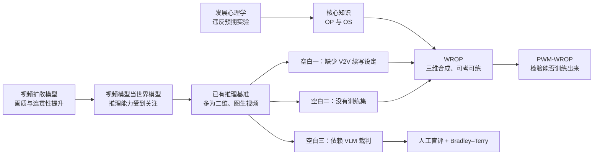
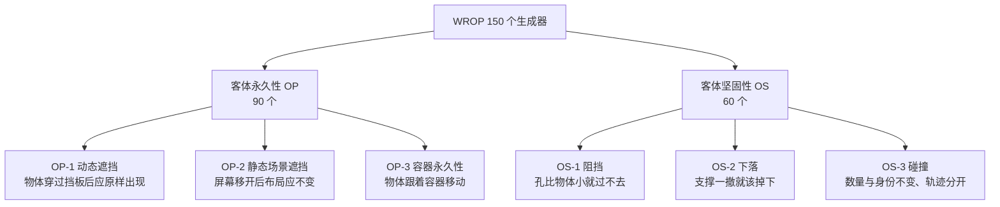
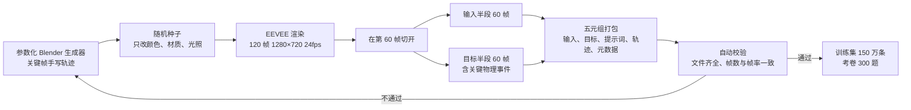
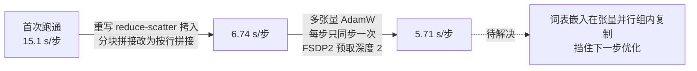
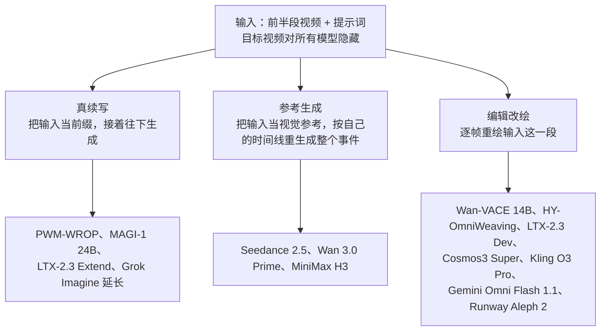
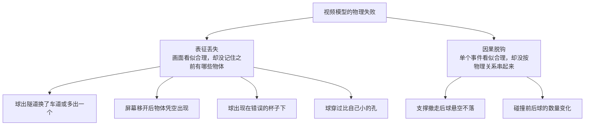

# 在世界模型里训练「客体永久性」

> **原题**：Training Object Permanence in World Models
> **作者**：Haotian Zhang、Fengyuan Yu、Dezhi Luo、Haoran Sun 等 31 人，通讯作者 Hokin Deng；合作者包括 Philip Torr、Alan Yuille、Nikolaus Kriegeskorte、Lvmin Zhang、Yilun Du 等
> **机构**：卡内基梅隆大学、约翰斯·霍普金斯大学、密歇根大学、哥伦比亚大学、斯坦福大学、哈佛大学、牛津大学、南加州大学、加州大学伯克利分校与圣迭戈分校、多伦多大学、滑铁卢大学、布里斯托大学、埃尔朗根-纽伦堡大学、纽约大学等
> **年份**：2026（arxiv ID 2609.28654）
> **分类**：cs.AI
> **链接**：https://arxiv.org/abs/2609.28654
> **精读日期**：2026-09-25

## 阅读须知

### 这篇在领域里的位置

视频生成模型这两年被越来越多地称作「世界模型」。理由是它们生成的画面不仅逼真，而且在时间上连贯，似乎在内部模拟了一个物理世界。随之而来的一批工作开始考察这类模型会不会「推理」：让它走迷宫、做规律归纳、遵循抽象规则，结果在不少任务上表现得出人意料地好。

然而另一类失败一直没有消失：物体绕到遮挡物后面就凭空不见，再出现时位置对不上；球撞向实心的墙，直接穿了过去。这两类错误对应认知科学里两条最基础的物理直觉，一条叫客体永久性，一条叫客体坚固性。这篇论文位于「把这两条直觉单独拎出来，既考又练」这一步：它造了一个专门的三维合成数据集，一面当考卷，一面当训练集，并用它微调出一个视频续写模型，看看这两条直觉能不能靠数据教会。

与近来把世界模型当作整体来打分的综合基准不同，这篇论文的范围很窄，只盯着最底层的两条原则，但它同时给出了一百五十万条训练样本。换句话说，它不只回答「模型会不会」，还尝试回答「不会的话能不能教」。

### 读完能回答什么

1. 客体永久性与客体坚固性分别指什么，为什么认知科学把它们看作物理智能的最底层
2. WROP 的一百五十个任务生成器是怎样设计的，为什么要把参数分成「结构参数」与「表面参数」两类
3. 为什么这篇论文坚持用人来打分，而不用视觉语言模型当裁判
4. 续写、参考生成、编辑改绘这三类视频模型接口，为什么会在同一份考卷上表现出系统性差异
5. 微调后的 PWM-WROP 在哪些任务上进步明显，在哪些任务上仍然吃力，这个结果能证明多少

### 阅读前置

假定读者了解扩散模型与视频生成的基本流程，知道「条件生成」是什么意思，也大致听说过 Elo 评分。不假定读者学过发展心理学，也不假定读者熟悉 AWS Trainium 这类非 GPU 训练硬件，相关背景会在正文里铺开讲。

### 首次出现的缩写表

- **OP**（Object Permanence，客体永久性）：物体被挡住、看不见时依然存在，并且保持原来的身份、数量与位置关系
- **OS**（Object Solidity，客体坚固性）：固体不能互相穿透，失去支撑会下落，碰撞时不会合并或消失
- **WROP**（World Reasoning with Object Permanence）：本文提出的数据集与考卷
- **PWM**：本文开源的训练框架，也是其微调模型 PWM-WROP 的名字来源
- **PWM-WROP**：在 WROP 数据上微调得到的 160 亿参数视频续写模型
- **V2V**（Video-to-Video，视频到视频）：输入一段视频，输出另一段视频的生成设定；本文特指「给前半段、生成后半段」
- **VLM**（Vision-Language Model，视觉语言模型）：能看图看视频并用文字回答的多模态模型
- **VoE**（Violation of Expectation，违反预期范式）：发展心理学实验方法，通过婴儿对「不可能事件」注视更久来推断其已有的物理预期
- **BT**（Bradley–Terry 模型）：从两两比较的胜负记录里估计每个参与者相对实力的统计模型
- **LPIPS、SSIM、MS-SSIM、PSNR、MSE**：几种以参考视频为标准的画面相似度指标，前一个衡量感知距离，后几个衡量结构或像素误差
- **FID**（Fréchet Inception Distance）：衡量生成画面与真实画面整体分布差距的指标
- **FSDP2**（Fully Sharded Data Parallel 第二版）：PyTorch 的全分片数据并行方案，把参数、梯度与优化器状态切到多张卡上
- **TP**（Tensor Parallelism，张量并行）：把单层的矩阵乘法切到多张卡上并行计算

## 一、问题

设想一个家用机器人借助视频世界模型来预判下一秒会发生什么。杯子被一块布盖住，模型如果认为杯子随之消失了，机器人就不会去掀布；球滚向一道窄缝，模型如果认为球能穿过去，机器人就会做出错误的抓取规划。对于只拿视频模型做短片的用户，这类错误表现为画面里莫名其妙多出或少掉一个物体；对于想把视频模型当作物理模拟器的研究者，这类错误意味着建立在其上的一切因果推理都会继承同样的错。

过去几年，视频生成的主流路线是扩散模型加上 Transformer 的扩展，商业系统与开源系统在画质与时间连贯性上都进步很快。与此同时，针对视频模型推理能力的研究也在增多，但作者指出这些研究有几处共同的空白：大多局限于二维环境；几乎都是「给一张图，生成一段视频」，很少覆盖「给一段视频，续写下一段」的设定；并且没有哪一个基准专门考察物体身份、物理约束与因果后果这一层。之所以现在还需要新工作，是因为旧路线只能告诉我们模型「偶尔会错」，却既说不清错在哪一类原则上，也没有给出可以直接拿来训练的数据。

### 两条最底层的物理直觉

客体永久性这个概念来自发展心理学。皮亚杰最早把它看作婴儿感知运动阶段最关键的成就，认为要到一岁左右才逐步建立。后来的违反预期实验改写了这个判断：研究者给婴儿看一个物体滚到挡板后面、再从另一边出来的场景，如果中间做了手脚，让物体「不可能地」出现，婴儿会注视得更久。借助这种方法，Baillargeon 在 1986 年发现，三个半月大的婴儿就已经能表征被挡住的物体。

客体坚固性出现得同样早。半岁以内的婴儿就能区分「球被墙挡住」与「球穿墙而过」这两类事件，并且会用这条约束预判支撑物被抽走之后物体的去向。Spelke 与 Kinzler 把这两条原则归入「核心知识」：它们是发育早期就在运转的、专门化的表征系统，后续更复杂的物理推理都搭在它们之上。

作者由此推出一个判断：如果视频模型允许物体互相穿透，它就不可能生成物理上成立的碰撞或支撑移除事件，更高层的场景构造与因果推理也会跟着出错。换句话说，这两类失败在结构上处于上游。

### 已有评测卡在哪里

已有的视频推理基准还有两处结构性问题。第一是规模：每个任务的样本数很小，并且大多没有训练集，只能考不能练。第二是打分方式：许多基准依赖视觉语言模型来判断生成结果对不对，而恰恰是在直觉物理这一块，视觉语言模型自身就有系统性的缺陷。作者团队此前的几篇工作已经分别表明，多模态语言模型存在核心知识缺陷，不能可靠地推理物理变换，也缺乏稳定的知觉恒常性。让这样的裁判去判定客体永久性，等于让不懂这条原则的人去批改这条原则的考卷。

下面这张图把这篇论文要接上的几条线索放在一起。

## 二、方法

这篇论文的方法分三块：一套按认知科学范式设计的任务体系与数据生成流水线，一个在这些数据上微调的续写模型，以及一套以人工盲评为主、自动指标为辅的评测协议。

### 六个任务家族

WROP 一共有一百五十个任务生成器，分属两个认知维度、六个任务家族，其中客体永久性九十个，客体坚固性六十个。每个家族都尽量改编自发展心理学里已有的实验范式，找不到现成范式的地方由作者原创。

几个家族的考点各有侧重。动态遮挡考的是模型能否在物体完全看不见的那段时间里，依然维持它的身份、大小与运动方向，而不是仅凭最后一帧外推运动。静态场景遮挡考的是能否同时记住多个被遮住的物体，把遮挡当成「只挡视线、不改变场景」的事件。容器永久性要求更高：杯子在转盘上转了半圈，模型必须意识到球跟着杯子走了，而不是还留在原来的世界坐标上。

坚固性这一侧，阻挡任务要求模型比较物体与孔洞的尺寸，再决定能不能通过，而不是默认运动中的物体会一直往前走。下落任务要求模型把「开始下落」这件事与「支撑被移除」这一时刻绑在一起。碰撞任务要求撞击之后所有物体既不合并、也不消失、也不互相穿过，而且各自沿不同方向散开。

### 结构参数与表面参数

每个生成器内部的参数被分成两类，这是整套数据设计里最关键的一处。结构参数决定物理与认知上的难题本身，例如物体数量、几何形状、运动轨迹、遮挡方式、孔洞大小与接触时机；它们在同一个生成器内系统地变化，用来控制难度，也让模型无法靠记住某一个固定结局来答题。表面参数只改变外观，例如颜色、材质、光照与相机视角；它们在同一个结构配置下独立随机，目的是让画面足够多样，同时不改变底下的物理问题，防止模型借助外观线索蒙混过关。

作者举了一个例子来说明这种设计意图。在「标记盒子交换」这个生成器里，两个带标记的盒子各扣住一个物体，然后在画面上交换位置，再打开。正确答案是每个物体仍然跟着自己原来的盒子。这样一来，模型无法只凭最终位置作答，必须在遮挡与运动过程中一直追踪盒子的身份以及盒子里的东西。

### 数据生成流水线

每个生成器都是一个自包含的 Blender 三维场景脚本。值得注意的是，这里没有用刚体物理引擎，所有轨迹都是用关键帧解析地写出来的。之所以这样设计，是为了让遮挡、接触与再出现精确地发生在指定的帧上；代价是物理上是否合理，完全由场景作者负责，而不是由模拟器保证。

每条样本是一段 120 帧的动画，渲染为 1280×720、每秒 24 帧，在关键事件开始处切成前后两半，各 60 帧。这里有一条贯穿全文的约定：关键物理事件一定发生在后半段。于是，模型拿到前半段作为上下文，必须自己生成包含事件及其后果的后半段，这就是本文所说的视频到视频续写设定。每个生成器贡献一万条训练样本，合计一百五十万条；考卷则从每个生成器抽两题，合计三百题。

### PWM-WROP：只换训练信号的微调

PWM-WROP 从英伟达的 Cosmos3-Nano 微调而来，架构与分词器都不动，只改变训练信号。它的训练方式与考试方式完全一致：前半段视频当条件，后半段当预测目标，外加每条样本的自然语言提示词，没有任务标签，也没有家族名称这类额外监督。模型在一百五十万条样本上训练一个轮次，这批训练数据是同样一百五十个生成器较早一次渲染的结果。打包后的训练片段是 117 帧，前 57 帧是条件，后 60 帧是预测，分辨率为 320×192。

作者在正文里强调，PWM-WROP 的定位是「这份数据集的基线」，而不是一个新的模型设计。换句话说，它存在的意义是回答「用这种数据微调，能带来多少变化」。

### 训练框架 PWM

论文的另一项贡献是开源训练框架 PWM，它在 AWS 的 Trainium2 芯片上用原生 PyTorch 训练与采样，不走 XLA 图追踪。Trainium2 是亚马逊自研的训练加速芯片，一台 trn2.48xlarge 有十六颗芯片，对外呈现为 64 个逻辑计算核。

这个 36 层模型的切分方式是张量并行度 4 乘以全分片数据并行度 16，正好铺满 64 个核；每个 Transformer 块用静态形状编译一次。训练用 fp32 主权重加 bf16 计算，检查点支持逐位精确地恢复。推理时只需要张量并行那一组，29 GB 权重分到四个核上，每核 7.3 GB。

附录记录了把每步训练时间从 15.1 秒压到 5.7 秒的过程，这部分对做大模型工程的读者很有参考价值。

其中有几条发现具有普遍性。其一，FSDP2 默认的 reduce-scatter 拷入实现在一步 15.9 秒里占了 7.9 秒，换成按行拼接的等价实现后，步时缩短到原来的约 2.25 分之一。其二，在张量并行组内复制的参数，梯度会慢慢漂移，一百步后相对差达到 5.9×10⁻⁵，于是改为每步显式同步。其三，默认的单张量 AdamW 在这个后端上受限于内核启动次数，每个参数大约十次启动、二十二次主机同步；改成多张量实现后，优化器耗时从每步 1,324 毫秒降到 126 毫秒。作者还特别指出，集合通信在这里受延迟而非带宽限制，两百兆字节只要 24 毫秒，所以收益来自减少通信次数，而不是减少单次通信量。

### 评测协议

评测这一侧有两处设计值得先讲清楚。第一处是接口分类。作者把十四个被测模型按它们与输入视频的关系分成三类，并在全部分析里把接口类别当作一个显式因素。

这三类接口在考卷面前的处境并不相同。真续写模型必须从输入的最后一帧无缝接下去；参考生成模型可以按自己的理解把整个事件重新演一遍，自由度更大；编辑改绘模型的输出与输入占据同一段时间，原理上就很难描绘「遮挡结束之后」才发生的事件。

第二处是统一的推理框架。所有模型只拿到输入视频与提示词，提示词原样传入，不加思维链，也不加任务标签，凡是提供服务端提示词扩写的接口都关掉这一选项。输出会把回放或补帧的部分裁掉，只保留真正预测出来的那一段。

主要的评判方式是人工盲评。评分者看到输入视频与提示词，再看两段匿名、随机排序的续写，选 A、选 B 或者「差不多」。评判标准同时包含三项：是否符合文字描述，运动是否自然、物理上是否合理，以及客体永久性是否被遵守，也就是物体不能凭空消失、凭空出现、穿过固体，或者在遮挡之后改变颜色、形状与数量。两两比较的结果用 Bradley–Terry 模型汇总，平局各算半场胜利，最后换算到均值为 1500 的 Elo 尺度上，置信区间来自按评分者整体重抽样的一千次自助法。

自动指标只作为辅助。所有模型的预测段统一重采样到 60 帧，缩放到 320×192，再与目标视频比较 LPIPS、SSIM、MS-SSIM、PSNR、MSE、CLIP 相似度与 FID。作者反复提醒，这些指标衡量的是「像不像参考视频」，而不是「物理推理对不对」：一个编辑模型只要把事件发生前的静态场景忠实地重绘一遍，就可能在 SSIM 上拿到不错的分数，却从头到尾没有让物体从遮挡物后面出来。

## 三、实验

### 人工盲评的总体排名

参与评分的是二十名众包评分者，都通过了资格测试，门槛是十题答对八题，中位成绩九题。嵌入的注意力检查题答对率为 90.0%；对重复出现的题目，评分者与自己此前的判断一致率为 93.5%，Cohen's κ 为 0.891；左侧片段在非平局判断里被选中的比例是 51.4%，p 值 0.615，没有检测到位置偏差。一百二十个模型对，每对安排四道题，完成 476 次判断，其中 361 次发生在不同模型之间，每个模型 50 到 52 局。

| 排名 | 模型 | 接口类别 | Elo | 95% 置信区间 | 得分率 |
|---|---|---|---|---|---|
| 1 | Wan 3.0 Prime | 参考生成 | 1723.6 | [1629.2, 1864.9] | 77.9% |
| 2 | MiniMax H3 | 参考生成 | 1723.6 | [1644.5, 1837.6] | 77.9% |
| 3 | PWM-WROP（本文） | 真续写 | 1679.5 | [1603.5, 1781.5] | 73.1% |
| 4 | Seedance 2.5 | 参考生成 | 1649.6 | [1554.2, 1751.5] | 69.6% |
| 5 | Runway Aleph 2 | 编辑改绘 | 1518.3 | [1425.1, 1621.6] | 52.9% |
| 6 | Wan-VACE 14B | 编辑改绘 | 1506.7 | [1429.9, 1590.8] | 51.0% |
| 7 | Gemini Omni Flash 1.1 | 编辑改绘 | 1492.5 | [1404.1, 1572.9] | 49.0% |
| 8 | Kling O3 Pro | 编辑改绘 | 1471.3 | [1404.0, 1534.0] | 46.2% |
| 9 | Grok Imagine（视频延长） | 真续写 | 1457.0 | [1362.7, 1555.1] | 44.2% |
| 10 | LTX-2.3 Extend | 真续写 | 1453.4 | [1363.6, 1545.8] | 43.1% |
| 11 | Cosmos3 Super | 编辑改绘 | 1409.2 | [1318.2, 1488.7] | 37.3% |
| 12 | LTX-2.3 Dev | 编辑改绘 | 1398.9 | [1297.7, 1482.3] | 36.5% |
| 13 | HY-OmniWeaving | 编辑改绘 | 1268.5 | [1159.4, 1344.2] | 21.0% |
| 14 | MAGI-1 24B | 真续写 | 1248.0 | [1137.2, 1315.6] | 19.2% |

这张表可以从三个角度读。第一，参考生成模型占据了榜首，Wan 3.0 Prime 与 MiniMax H3 战绩完全相同，并列第一。作者的解释是，参考生成模型不必从输入的最后一帧接着画，而是按自己的时间线把事件重新生成，因此有更大的余地造出一个物理上自洽的场景。

第二，PWM-WROP 在真续写这一类里排第一，总榜第三，比同类第二名 Grok Imagine 高出约 224 个 Elo 分，而且是以 320×192 的原生输出分辨率，去和 720p、1080p 的系统同场比较。自助法估计的「排第一的概率」里，Wan 3.0 Prime 为 46.8%，MiniMax H3 为 36.4%，PWM-WROP 为 12.3%，Seedance 2.5 为 4.5%，其余模型全部为零。

第三，榜单中段几乎全是编辑改绘模型，从 Runway Aleph 2 到 Cosmos3 Super 的五个系统之间只差 109 个 Elo 分，置信区间彼此重叠。作者据此认为，接口类别比模型规模更能解释排名：逐帧重绘的机制本身让这些模型难以生成输入结束之后才发生的事件，于是它们无论规模大小、开源还是商用，都挤在一起。

### 按任务家族拆开看

把排名按六个任务家族拆开，PWM-WROP 的表现并不均匀。

| 任务家族 | PWM-WROP 家族内排名 |
|---|---|
| OP-1 动态遮挡 | 第 3 |
| OP-2 静态场景遮挡 | 第 1 |
| OP-3 容器永久性 | 第 3 |
| OS-1 阻挡 | 第 5 |
| OS-2 下落 | 第 2 |
| OS-3 碰撞 | 第 8 |

在三个永久性家族里，它稳定地排在前三；到了坚固性家族，排名起伏明显，碰撞任务只排第八。与之相对地，两个参考生成的领头模型恰好在坚固性家族上占优：MiniMax H3 在下落与碰撞两个家族里都拿下第一，而且全胜；Wan 3.0 Prime 在容器永久性家族排第一、在碰撞家族排第二，但在其余永久性任务上的名次相对居中。

作者对这一反差给出了两层解读。一层是模型侧：追踪被遮挡的物体与生成接触后的动力学，可能依赖不同的内部表征，当前的微调方式对前者更有效。另一层是接口侧：参考生成模型重新生成整个场景的自由度，对坚固性任务有帮助，对永久性任务却可能是负担，因为后者要求严格保留输入里已经确立的物体与空间布局。需要注意的是，坚固性各家族总共只有 36 到 44 局，置信区间很宽，作者自己也提示这些家族内名次只代表趋势。

### 定性案例：两类失败模式

作者从每个家族挑了一个对家族排名影响较大的生成器，做同题同样本的对比。几个案例都很直观。

在「三球平行隧道」里，三个不同颜色的球各走一条车道钻进隧道。Gemini Omni Flash 的输出在出口处多出了第四个球，车道与间距也全乱了；PWM-WROP 让三个球在各自车道上连续地出来。在「转盘杯子」里，三个相同的杯子放在转盘上，球扣在最前面那只杯子下，转盘转了半圈。Seedance 2.5 把转盘转对了，却去掀此刻位于前方的另一只杯子，而且在那只杯子下面变出了球；PWM-WROP 掀起了转到后方的原来那只杯子。

坚固性这一侧，在「尺寸门」任务里，第一道挡板的孔只有球直径的一半，正确结果是球停在第一道挡板前。Seedance 2.5 让球径直穿了过去，作者指出这是所有被测模型里最常见的失败，MiniMax H3 与 Wan 3.0 Prime 也同样出现过。在「撤走支撑后下落」任务里，Seedance 2.5 不仅把整个支架都撤掉了，还让球悬在原处停留了几帧才慢慢开始下落。在「台球开球」任务里，Gemini Omni Flash 在碰撞之前就把七个球画成了十二个以上，撞击之后又让最先被击中的紫球消失了。

作者把这些案例归纳为两类失败模式。

第一类是表征丢失：模型生成的画面单独看都说得过去，但它没有持续追踪早先出现过的物体。第二类是因果脱钩：模型能生成一个个看上去合理的事件，却没有用物理关系把它们连起来。家族层面的排名也印证了这一点：有的模型擅长遮挡追踪却在阻挡与碰撞上吃亏，有的模型正好相反。

### 自动指标

在统一缩放到 320×192 之后，PWM-WROP 在感知距离 LPIPS 上最好，为 0.081，第二名是 0.105；在多尺度结构相似度 MS-SSIM 上也最好，为 0.921，第二名是 0.877；像素误差 MSE 为 2.97×10⁻³，同样最低；CLIP 相似度 0.956，排第二。它在 PSNR 与 SSIM 上排名靠后；到了对分辨率敏感的指标，例如在 720p 下计算的末帧 LPIPS 与 FID，它的输出要先放大四倍再比较，排名进一步下滑。

| 模型 | LPIPS ↓ | MS-SSIM ↑ | SSIM ↑ | PSNR ↑ | FID ↓ |
|---|---|---|---|---|---|
| Wan 3.0 Prime | 0.115 | 0.861 | 0.942 | 27.15 | 15.1 |
| MiniMax H3 | 0.105 | 0.877 | 0.938 | 27.51 | 14.8 |
| PWM-WROP | 0.081 | 0.921 | 0.917 | 26.45 | 20.4 |
| Grok Imagine（视频延长） | 0.125 | 0.852 | 0.932 | 26.98 | 13.6 |
| Gemini Omni Flash 1.1 | 0.151 | 0.830 | 0.937 | 26.81 | 17.0 |
| Seedance 2.5 | 0.282 | 0.616 | 0.770 | 18.37 | 24.6 |

作者对这张表的定位很克制：它主要用来确认 PWM-WROP 的低分辨率输出在同一尺度下并没有损失像素层面的保真度，而不是用来排名物理推理能力。

### 值得单独拎出来的几个结果

第一个反直觉之处是，分辨率最低的模型拿到了续写这一类的第一，并在同尺度的感知指标上领先。这说明在这份考卷上，决定胜负的主要不是画质，而是事件本身有没有生成对。

第二个值得注意的是，接口类别对排名的解释力超过模型规模与出身。同一家族的 Cosmos3 Super 作为编辑改绘模型排在第十一，而它的小号 Cosmos3-Nano 经过续写微调后排到第三；开源模型与商用模型混在中段，彼此难以区分。

第三个是参考生成模型的双刃剑效应：同样的「重新演一遍」的自由度，让它们在下落与碰撞上全胜，却也让 Seedance 2.5 在转盘杯子与屏幕遮挡这类必须忠实保留输入布局的任务上出错。

## 四、局限

### 作者承认的

作者明确说明，PWM-WROP 与其他续写模型在架构上也不同，因此它领先同类的幅度不能全部归因于训练数据。坚固性家族的对局数很少，置信区间很宽，家族内名次只能当作趋势来读；在总榜上，置信区间重叠的名次也不应被解读为显著差异。PWM-WROP 在碰撞、阻挡这类接触动力学任务上仍然明显落后，说明当前的微调方式对遮挡追踪比对接触动力学更有效。

自动指标只衡量与参考视频的接近程度，不衡量物理推理是否正确，并且不同服务商的输出分辨率差异在高分辨率下仍是一个混杂因素。评测细节上，考卷里有两道 90 帧的题目，PWM-WROP 的条件窗口只有 57 帧，前 33 帧它根本看不到；Runway 的接口拒绝了三条超过一千字符的提示词。训练框架一侧，词表嵌入在张量并行组内复制，挡住了下一步优化，作者列为尚未解决的问题；基于 Neuron 内核接口的 flash attention 实现，反向传播最多只支持 8,192 个 token，放不下 720p 的几何尺寸，也还没有与默认路径做端到端的对比。

### 读完能看出来的

最值得警惕的一点是同分布问题。PWM-WROP 的训练数据来自同样一百五十个生成器较早的一次渲染，考卷则是这些生成器的另外两次采样。结构参数虽然在变，但任务类型、场景风格、渲染器与镜头语言完全相同。换句话说，它是在自己练过的题型上考试，而其余十三个模型都是零样本作答。这个结果能说明「用这类数据微调能显著提升同类任务表现」，却不能直接说明模型学到了可以迁移到真实视频或全新任务上的客体永久性。论文没有留出生成器级别的测试集，也没有在真实拍摄的视频上检验。

第二，缺少最关键的对照组。人工盲评里没有未经微调的 Cosmos3-Nano 本体，因此读者无法知道三百题上的提升有多少来自 WROP 数据，有多少来自这个底座本身就适合做续写。附录里只有一个间接证据：在 64 段物理渲染片段上过拟合时，续写半段与目标的余弦相似度，微调后是 0.993 到 0.999，底座是 0.85 到 0.995。这只能说明训练链路是通的，替代不了同一份考卷上的对照。

第三，人工盲评的规模偏小，而且标准是混合的。一百二十个模型对各只比四道题，三百道题里每个模型实际被评到的只有五十来局。评分者同时考虑文字对齐、运动自然度与客体永久性三项，并没有把物理正确性单独打分，因此高分辨率、画面更精致的系统，可能在「运动自然」这一项上占到与物理推理无关的便宜，反过来也可能压低 PWM-WROP 的得分。两种偏差方向相反，但都会让「Elo 反映物理推理能力」这一解读打折扣。

第四，参考答案本身由人工关键帧写成，不经过物理引擎。对遮挡与容器这类离散判断影响不大，但对碰撞后的散开方向、减速过程这类连续动力学，参考答案的准确性取决于场景作者，而自动指标恰恰以它为标准。PWM-WROP 在同渲染风格数据上训练过，在 LPIPS 与 MS-SSIM 上的领先，有一部分可能来自风格匹配，而不完全来自事件生成正确。

第五，工程记录有一处前后不一致，也有一处承诺没有兑现。正文说训练与评测的几何尺寸是 320×192，附录的吞吐测量却是在 288×512 下进行的，两者的每步时间不能直接互换。正文还说附录会交代 PWM-WROP 在这套设施上端到端微调的状态，但附录只给出了吞吐、正确性核验与待解决事项，没有给出这次一百五十万样本微调的训练曲线、总耗时或最终损失。对一篇以「可复现的训练栈」为贡献之一的论文，这部分信息的缺失会影响读者评估复现成本。

最后，被测的商业系统都是 2026 年的具体版本，通过托管接口调用，服务端随时可能更新。模型答案与分数虽然已经公开，但同样的请求过几个月再发一次，未必能得到同样的结果。

## 一句话

用一百五十个仿婴儿实验的 Blender 生成器造出可考可练的数据，微调后的小分辨率续写模型在人工盲评里跻身前三。
