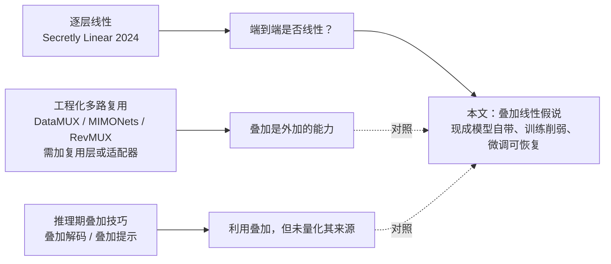
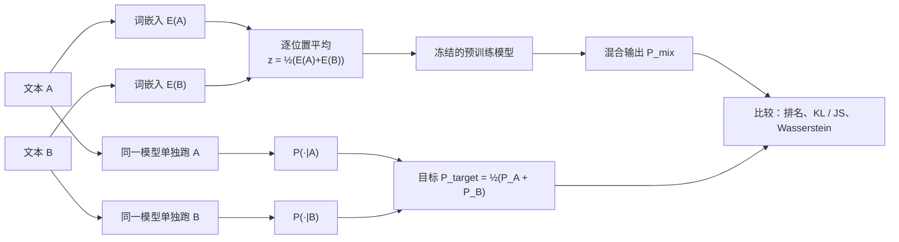
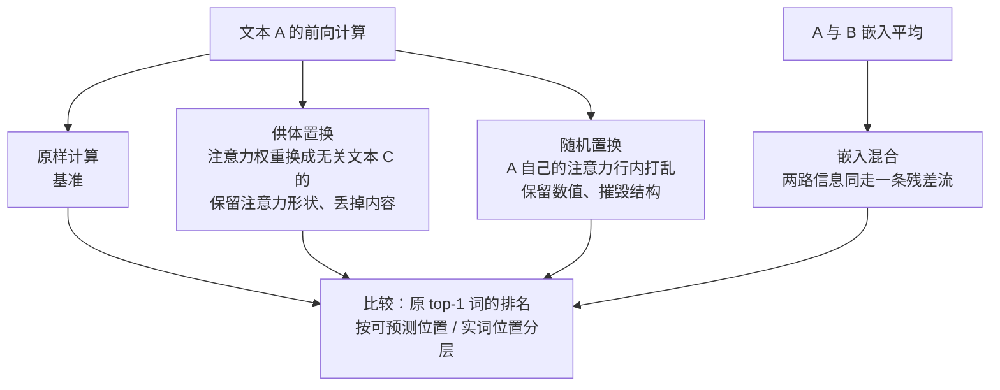
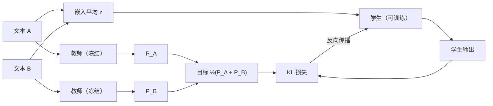
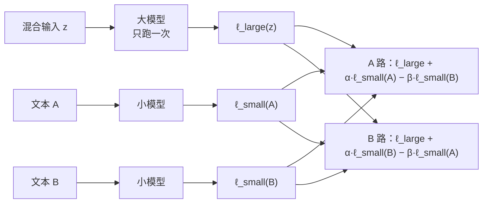

# 你的 Transformer 能同时装下两个念头：大语言模型中的线性叠加

> **原题**：Your Transformer Can Hold Two Thoughts at Once: Evidence of Linear Superposition in LLMs
> **作者**：Pavel Tikhonov、Anton Korznikov、Matvey Mikhalchuk、Nikita Dragunov、Temurbek Rahmatullaev、Polina Druzhinina、Anton Razzhigaev、Ivan Oseledets、Elena Tutubalina
> **机构**：论文 HTML 版未列出机构；作者与 2024 年《Your Transformer is Secretly Linear》一文高度重合，可视为同一研究线的延续
> **年份**：2026（arxiv ID 2609.29845）
> **分类**：cs.CL
> **链接**：https://arxiv.org/abs/2609.29845
> **精读日期**：2026-09-26

## 阅读须知

### 这篇在领域里的位置

这篇论文属于「解释大模型内部在做什么」的一类工作，同时又带着一点推理加速的野心。过去几年，可解释性研究陆续发现，Transformer 尽管由大量非线性部件搭成，内部却处处透出线性结构：概念可以对应到隐藏空间里的方向，相邻两层之间的变换常常能被一个仿射映射近似。作者团队 2024 年的《Your Transformer is Secretly Linear》就是后一类发现的代表。

这篇论文把问题从「层与层之间是否线性」推进到「整个模型从输入到输出是否线性」。它做的事情非常朴素：把两段毫不相干的文本的词向量逐位置取平均，喂进一个现成的模型，看输出会不会恰好是两段文本各自输出的平均。它的位置，就在可解释性的「线性结构」研究与推理侧的「多路复用」研究交汇处。

### 读完能回答什么

1. 把两段文本的嵌入直接平均后送进模型，为什么输出里还能找到两段各自的下一个词
2. 这种「线性叠加」是训练学出来的能力，还是架构自带、反而被训练削弱的性质
3. 注意力机制在其中扮演了什么角色，为什么功能词容易存活而实词容易丢失
4. 用一个轻量的自蒸馏微调，能把叠加的保真度恢复到什么程度，代价是什么
5. 从一次叠加的前向计算里同时解出两段通顺的续写，为什么比拟合分布难得多，眼下离实用还有多远

### 阅读前置

假定读者熟悉 Transformer 的基本结构（嵌入层、自注意力、MLP、残差流、输出头），知道 softmax 与交叉熵，听说过知识蒸馏与 KL 散度。不假定读者读过机制可解释性方向的论文，相关概念会在正文里铺开讲。

### 首次出现的缩写表

- **LLM**（Large Language Model，大语言模型）
- **SLH**（Superposition Linearity Hypothesis，叠加线性假说）：本文提出的假说，即模型对两段输入之平均的响应，近似等于它对两段输入各自响应的平均
- **KL / JS**（Kullback–Leibler / Jensen–Shannon 散度）：衡量两个概率分布差异的指标，JS 是 KL 的对称化版本
- **CDF**（Cumulative Distribution Function，累积分布函数）：这里指「真实词排在前 k 名以内」的概率随 k 变化的曲线
- **R_D**（Superposition Approximation Ratio，叠加近似比）：本文定义的归一化指标，越小越好，小于 1 即优于随机基线
- **LAMBADA**：一个考察长上下文理解的完形填空基准，目标词通常是只有读懂整段才能猜出的实词
- **PPL / NLL**（Perplexity / Negative Log-Likelihood，困惑度 / 负对数似然）：衡量语言模型预测质量的常用指标，越低越好
- **KV 缓存**（Key-Value cache）：自回归生成时保存历史位置键值向量的缓存，是长文本推理显存占用的大头
- **RoPE**（Rotary Position Embedding，旋转位置编码）

## 一、问题

设想一台推理服务器同时要为两个用户续写文本。常规做法有两种：要么把两段文本排成一个批次一起算，要么一段一段轮流算。无论哪一种，两段文本在模型内部都是各走各的路，互不干扰，显存里也各自保留一份 KV 缓存。于是一个自然的问题出现了：有没有可能把两段文本压进同一条计算通道里，只算一遍，却同时得到两份结果？如果可以，推理吞吐与显存占用都会有实质的改善。

这个设想之所以听上去不可能，是因为 Transformer 满是非线性：softmax 注意力会根据内容挑选要看的位置，MLP 里有非线性激活，层归一化也不是线性操作。直觉上，把两段不相干文本的向量混在一起，就像把两张照片叠印，模型看到的将是一团既不像 A 也不像 B 的东西，输出会坍缩成与两者都无关的噪声。

### 已有的两条路线

在这个问题上，前人大致走过两条路。第一条是「工程化的多路复用」：DataMUX、MIMONets、RevMUX 等方法专门加入复用层与解复用层，或者借用向量符号架构里的绑定与解绑操作，把多个输入显式地编码进一个表示，再用训练好的解码器拆开。这条路能用，但叠加是被外加进去的能力，需要改架构或加适配器。

第二条是「推理期的叠加技巧」：叠加解码（Superposed Decoding）把多个候选词的嵌入混在一起，一次自回归生成多条草稿；叠加提示（Superposition Prompting）在检索增强生成中把多条文档路径放进同一次前向计算。这些方法利用了叠加，却没有回答一个更基础的问题：一个完全没改过的现成模型，本身对叠加的输入到底有多「线性」。

与此同时，可解释性研究提供了第三块拼图。《Your Transformer is Secretly Linear》发现，解码器 Transformer 相邻两层之间的映射，往往能被一个线性变换解释掉绝大部分。于是作者追问：这种逐层的线性，会不会累积成端到端的线性，使得模型对「两段输入之平均」的响应，恰好近似为「两段输入各自响应之平均」？

### 本文要验证的具体命题

作者把问题落成一个可以直接测量的命题，并称之为叠加线性假说：两段词元序列的嵌入逐元素平均之后送进模型，模型对这个混合输入给出的下一词分布，近似于它对两段序列分别给出的下一词分布的算术平均。围绕这个命题，论文依次回答四个问题：现成模型离这个理想有多近；这个性质从哪里来；能不能通过训练增强；增强之后能不能真的从一次计算里拆出两段续写。

## 二、方法

### 叠加输入的构造

整篇论文的实验都建立在一个极简的操作上。设两段等长文本 x 与 y，在每个位置 t 上，把两者的词向量取平均：

e_t(z) = ½ · (E(x_t) + E(y_t))

- E 是模型的词嵌入函数，把词表里的一个词映射成 d 维向量
- x_t、y_t 分别是两段文本第 t 个位置的词
- z 是混合后的输入序列，长度与原文相同

这个混合序列直接送进冻结的预训练模型，走标准的因果自注意力，每个位置能看到此前所有混合位置。模型最后输出的分布记作 P_mix。作为对照，同一个模型分别处理 x 与 y，得到 P(·|A) 与 P(·|B)，它们的算术平均就是理想目标：

P_target = ½ · (P(·|A) + P(·|B))

如果模型是完全线性的，P_mix 应该等于 P_target，A 和 B 各自最可能的下一个词会排在混合分布的第一、第二名。反过来，如果非线性彻底打乱了一切，这两个词会掉进词表的长尾，平均排名接近词表大小的一半。

### 两类度量

第一类是排名度量。以单独处理 A 时模型最可能的词为参照，看它在 P_mix 里排第几，画出「排在前 k 名以内」的累积分布曲线。

第二类是分布度量。用 KL 散度、JS 散度，以及在前 256 个词上以词向量余弦距离为代价的 Wasserstein 距离，衡量 P_mix 与 P_target 的差距。为了在不同模型之间可比，作者定义了叠加近似比：

R_D = E[D(P_target ‖ P_mix)] ÷ E[D(P(·|A) ‖ P(·|B))]

分母是两段不相干文本各自输出分布之间的距离，相当于「随便拿一个别的分布来比」的随机基线。R_D 小于 1，说明混合输出比随机基线更接近目标；越接近 0，越接近完美叠加。

### 追踪训练过程：叠加从哪里来

为了分清这个性质是架构自带还是训练学来的，作者沿着 Pythia 系列公开的中间检查点追踪。对每一对文本跑三遍前向计算（单跑 A、单跑 B、跑混合），在每一层把隐藏状态减去该层均值，再比较「混合输入的隐藏状态」与「A 和 B 隐藏状态之和」的方向差异，取各层平均，记作叠加误差 Ē，越小越线性。

### 注意力置换实验：注意力在其中扮演什么角色

直觉上，注意力是最该破坏叠加的部件。为了拆开注意力的作用，作者设计了两种单流扰动，与嵌入混合对照：

- **供体置换**：处理文本 A 时，把每一层每个头的注意力权重整个换成另一段不相干文本 C 产生的注意力权重，A 自己的 Q、K、V 投影与位置编码都不动。这样保留了「自然注意力的形状」，比如对角线与局部带状结构、注意力汇聚点、各头的分工，却与 A 的内容脱钩。
- **随机置换**：用 A 自己的注意力，但在每一行的因果前缀内随机打乱。这保留了每行权重的数值集合与行和，却摧毁了位置与内容结构。

作者还把被预测的位置分成两类：「可预测位置」约占 65%，多是标点、虚词、分词碎片；「实词位置」约占 35%，需要真正读懂上下文才能猜出。

### 自蒸馏微调：把线性找回来

如果叠加在预训练中被削弱，能不能专门训回来？作者用自蒸馏：学生模型从预训练权重初始化，教师是同一模型的冻结副本。教师分别处理 A 与 B，把两份输出分布平均作为目标；学生只看混合输入，最小化目标分布与学生输出之间的 KL 散度：

L = D_KL(P_target ‖ M_student(z))

训练数据是 FineWeb 的一个子集，约二十万步，数据量不到原预训练规模的万分之二点五。

### 从一次前向计算里解出两段续写

拟合分布只是第一步，真正的实用价值在于从混合的输出里分别采样出两段通顺文本。作者指出这里有一个结构性的障碍，称之为「几何平均障碍」。如果混合后的 logit 近似是两路 logit 的平均，那么经过 softmax 后：

P'(t) ∝ exp(½(ℓ_A(t) + ℓ_B(t))) ∝ √(P_A(t) · P_B(t))

也就是说，混合概率正比于两路概率的几何平均，而不是算术平均。一个词只要在其中一路里很不可能，它在混合分布里就会被重重压低。于是，即便两路的正确词都稳稳待在前五名，想让它们各自在自己那一路里排第一，用普通解码几乎做不到；直接从混合分布采样，得到的文本会在 A 的词和 B 的词之间来回跳。

作者给出的概念验证叫「联合对比解码」，借一个小模型为每一路提供引导：

ℓ̃_A = ℓ_large(z) + α · ℓ_small(A) − β · ℓ_small(B)
ℓ̃_B = ℓ_large(z) + α · ℓ_small(B) − β · ℓ_small(A)

- ℓ_large(z) 是大模型对混合输入的 logit，只算一遍
- ℓ_small(A)、ℓ_small(B) 是小模型分别对两路的 logit
- α、β 初始为 1，与大模型骨干一起在两路的交叉熵上联合训练

直观地说，要解出 A 这一路，就在混合 logit 上加上小模型对 A 的判断、减去它对 B 的判断，把属于 B 的成分往外推。

附录里还有两种变体：一种不需要小模型，而是给两路各配一个可学习的投影矩阵和一个输出头，靠打破平均操作的对称性来区分两路；另一种在推理时用梯度优化求解 logit 的线性组合，不改大模型权重。

## 三、实验

实验覆盖 Pythia、Qwen2.5、Llama、OLMo、Gemma 几个家族，规模从一亿六千万到八十亿参数；数据用语法简单的 TinyStories 与真实网页文本 FineWeb，随机抽取不相干的文本对。

### 现成模型就有相当程度的叠加

在不做任何修改的 Pythia-2.8B、Llama-3.2-3B、Qwen2.5-3B 上，单独处理时的首选词在混合分布里的排名如下：

| 排名范围 | 现成模型（叠加） | 频率基线对照 |
|---|---|---|
| 前 10 名以内 | 约 30% 到 40% | 2.63% |
| 前 50 名以内 | 约 50% 到 60% | 未报告 |
| 前 100 名以内 | 约 60% 到 65% | 10.41% |

这里的频率基线是一个关键对照：只跑 A，去看 B 的正确词在 A 的输出里排第几。它保留了词频分布，却切断了上下文联系。叠加的恢复率比它高出一个数量级，说明现象不能用「高频词本来就排在前面」来解释。考虑到词表有五万个以上的词，混合状态并没有坍缩成乱码，而是把搜索范围缩小到了一个同时包含两路正确续写的小邻域。

分布度量给出同样的结论。在 FineWeb 上，各模型的叠加近似比都明显小于 1：

| 模型（上下文 32） | KL | R_KL | JS | R_JS |
|---|---|---|---|---|
| Pythia-160M | 0.91 | 0.35 | 0.23 | 0.40 |
| Pythia-410M | 1.54 | 0.39 | 0.36 | 0.50 |
| Pythia-2.8B | 1.86 | 0.42 | 0.40 | 0.54 |
| Llama-3.1-8B | 2.16 | 0.37 | 0.48 | 0.57 |

上下文加长到 512 时，数值基本持平甚至略好；把三段文本一起混合，近似比上升 0.04 到 0.09，性质变弱但没有质变。值得注意的是，置信度高的预测最能扛住混合：单独处理时概率超过 0.5 的词，在混合分布里的中位排名约为 3。

### 叠加随预训练减弱

沿 Pythia 的训练检查点追踪，隐藏状态的叠加误差在最早期最小，随训练单调上升，几个规模的模型走势一致。作者据此认为，线性叠加是架构自带的倾向，预训练在优化语言建模目标的过程中放大了残差流里的非线性交互，从而把它削弱了。逐层的线性度分析给出一个 U 形剖面：前几层线性度高，中间层降到约 0.65，最后三分之一的层又回升到 0.95 以上。作者用这个「末端线性」解释为什么叠加信号能一直存活到输出层。

### 注意力置换：功能词靠形状，实词靠内容

在 Qwen2.5-3B 上，按两类位置分层的结果最能说明问题：

| 设置 | 可预测位置 中位排名 | 可预测位置 top-1 | 实词位置 中位排名 | 实词位置 top-1 |
|---|---|---|---|---|
| 嵌入混合（原模型） | 6 | 24.8% | 284 | 4.2% |
| 供体置换（原模型） | 3 | 33.0% | 111 | 5.4% |
| 随机置换（原模型） | 3,079 | 1.3% | 19,246 | 0.0% |
| 嵌入混合（微调后） | 8 | 21.6% | 5 | 22.8% |

这张表可以读出三层意思。其一，前面那些看上去漂亮的总体恢复率，很大程度上是被占多数的可预测位置撑起来的：只要注意力的形状还在，输出头里的词频先验就能让标点和虚词排在前面。其二，随机置换在两类位置上都全面崩溃，说明光有词频先验不够，注意力的结构形状同样不可少。其三，在真正考验理解的地方，嵌入混合比供体置换保住了更多信息：在 LAMBADA 上，嵌入混合的原始准确率是 2.25%、目标词中位排名 339，供体置换只有 0.5%、中位排名 2,350，准确率相差约 4.5 倍、排名相差约 7 倍。换句话说，混合的那条残差流里，确实同时携带着两路各自的内容信息，而不只是「词频加注意力形状」。

### 微调后的恢复与代价

自蒸馏微调的效果非常明显。以 Pythia-2.8B 为例，平均 KL 散度从 1.86 降到 0.27，叠加近似比从 0.42 降到 0.06；正确词落在前五名的概率从约 30% 升到 60% 以上。更关键的是实词位置：中位排名从 284 降到 5，top-1 一致率从 4.2% 升到 22.8%。这说明微调不是在讨好高频词，而是真的让模型学会了并行处理两路的语义内容。

但这份恢复是有代价的，作者也坦白写在正文里：同一个目标会明显损害模型处理单一文本的能力。

| 模型 | 单流 LAMBADA 微调前 | 单流 LAMBADA 微调后 |
|---|---|---|
| Pythia-2.8B | 0.544 | 0.357 |
| Qwen2.5-3B | 0.602 | 0.460 |

附录里的困惑度更直观：只做叠加蒸馏的 Qwen2.5-3B，在 FineWeb 上的单流困惑度从 12.44 升到 65.52。

### 解码：概念验证，尚未追上小模型

联合对比解码在 LAMBADA 上的两路平均准确率如下：

| 大模型 / 引导小模型 | 单流准确率（大 / 小） | 叠加·原模型 | 叠加·联合对比 | 两路词重叠（越低越好） |
|---|---|---|---|---|
| Qwen2.5-3B / 0.5B | 0.592 / 0.437 | 0.168 | 0.345 | 0.126 → 0.061 |
| Llama-3.2-3B / 1B | 0.643 / 0.540 | 0.182 | 0.430 | 0.094 → 0.067 |
| Pythia-1.4B / 160M | 0.499 / 0.225 | 0.065（2.8B） | 0.110 | 0.109 → 0.080 |

联合对比把叠加下的准确率从 0.06 到 0.18 提到了 0.11 到 0.43，两路生成的词重叠也保持在低位，说明两段续写确实被分开了。但在每一组里，它都没有追上单独运行那个引导小模型的水平：Llama 这一组是 0.43 对 0.54。作者把剩下的差距归因于前面的几何平均障碍，并明确把这一部分定位为概念验证。用大模型当评委给 TinyStories 续写打分时，这个差距同样可见：Pythia-2.8B 单独生成的语法分 4.52、创造性 5.72，微调后的叠加生成分别是 3.69 与 2.13。

### 吞吐量：翻倍是相对谁而言

附录给出了生成速度的实测（提示与生成各 128 个词，一百次运行）：

| 组合 | 双头分离（叠加） | 引导解码（叠加） | 普通批量 b=2 | 普通逐条跑两遍 |
|---|---|---|---|---|
| Pythia-2.8B + 160M | 109.6 | 79.4 | 113.1 | 56.0 |
| Llama-3B + 1B | 81.5 | 52.4 | 81.4 | 41.3 |
| Qwen-3B + 0.5B | 64.9 | 39.4 | 63.6 | 32.4 |

（单位：每秒生成的词数）

这里有一个很容易被标题带偏的地方。叠加方案相对「逐条跑两遍」确实快了约一倍，但和最普通的「把两条放进一个批次一起算」相比，速度基本持平，差距在 3% 以内；带小模型引导的版本还更慢。

### 值得单独拎出来的两个反直觉结果

第一个是，模型越训练越不线性。通常人们会以为「能同时处理两路信息」是一种需要学习的高级能力，这篇论文的证据却指向相反的方向：这个倾向在初始化时最强，被预训练逐步削弱。

第二个是，被「打乱」得更彻底的嵌入混合，在实词上反而比「只换注意力」的供体置换保住了更多信息。嵌入混合从第 0 层起就让每一层的 Q、K、V 都掺进了另一段文本，按理说污染更重；它在总体一致率上也确实输给供体置换（中位排名 19 对 8），可一到考理解的 LAMBADA 上就反超了。这说明残差流有能力同时承载两路内容，而这种能力不能被「词频先验加注意力形状」完全解释。

## 四、局限

### 作者承认的

作者在局限一节写明，分析性实验的上下文最长只有 128 个词，分布度量延伸到 512，语料以单一语言为主；更长的上下文、多语言场景下嵌入的几何结构更复杂，结论能否成立尚待验证。研究也只覆盖纯文本模型，把文本与图像块这类不同模态的嵌入混在一起，会带来截然不同的几何问题，完全没有探索。

正文里还有几处坦白。增强叠加的微调会明显损害单流质量，LAMBADA 与困惑度都有可观的退步。从混合输出中解出两段通顺续写受几何平均障碍制约，作者明言这仍是开放问题，给出的联合对比解码只是概念验证。计算成本上，所谓「轻量」是相对预训练而言的：Pythia-2.8B 的一次蒸馏在两张 A100 80GB 上跑了约 114 小时，Qwen2.5-3B 约 132 小时。

### 读完能看出来的

最需要警惕的是结论里的效率叙事。结论称这一范式「理论上带来两倍吞吐」，并能「把每一路的 KV 缓存占用减半」。但附录的实测显示，叠加方案只是追平了普通批量推理，并没有超过它；两倍的对照对象是逐条串行推理，而这并不是任何实际服务会采用的基线。KV 缓存减半的说法没有在长上下文下实测，附录里的显存数字只和单路推理比较，没有和批量为 2 的普通推理比较，而在提示只有 128 个词的设置下，KV 缓存本来就占不了多少显存。

第二，解码的质量账还算不过来。联合对比解码需要把一个小模型对两路各跑一遍，而它产出的叠加结果在每一组实验里都不如这个小模型单独运行。换句话说，在现有结果下，如果目标是「又快又省地得到两段续写」，直接让小模型跑两遍，质量更高、成本更低。这不否定论文的科学发现，但说明它离推理加速的实用门槛还有相当距离。

第三，「架构自带」这一说法的证据偏弱。叠加误差在初始化时最小、随训练上升，这与「随机初始化的网络本来就接近线性、训练会引入更多非线性」这一更平凡的解释同样相容。要把「架构偏置」与「随机初始化的一般性质」区分开，需要和其他架构（例如非 Transformer 的序列模型）在同样条件下对照，论文没有做。

第四，总体数字需要打折来读。作者自己在第三节就证明了，排名恢复率的大头来自标点、虚词这类可预测位置；未经微调时，实词位置的中位排名是 284，top-1 一致率只有 4.2%。摘要与引言里「两路正确词经常出现在前十名」的表述，读者应当理解为主要描述的是功能词。

第五，实验规模集中在三十亿参数上下，最大到八十亿，都是中小模型；蒸馏与解码实验都用最长 128 或 512 个词的片段。更大的模型在预训练中被削弱得更多还是更少，是否依然能用同样的轻量微调恢复，论文没有覆盖。TinyStories 的质量评估依赖单一大模型评委，也没有人工评估作为校准。

## 一句话

两段文本的词向量取平均送进现成大模型，输出近似两路分布的叠加；此性质随预训练减弱、可经微调恢复，但解码仍难以实用。
