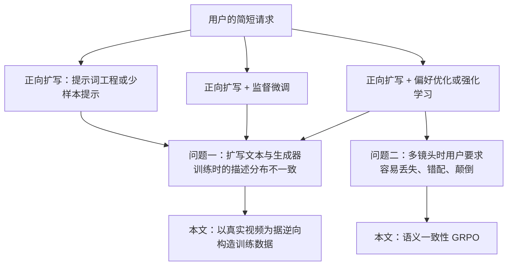
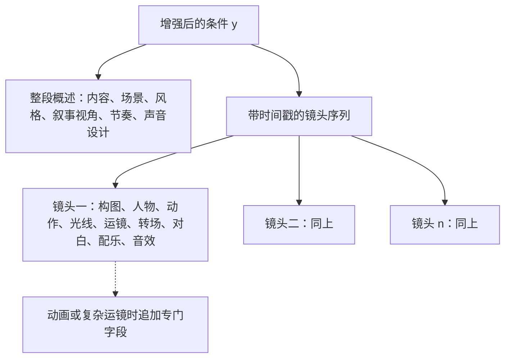
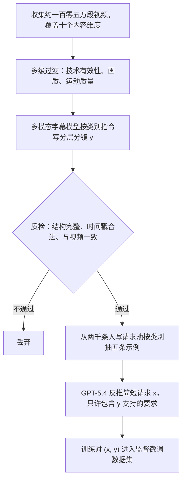
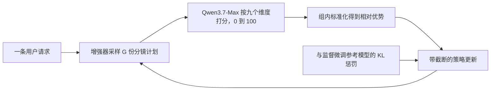

# WanPE：面向当代文生视频的电影化提示词增强

> **原题**：WanPE: Towards Cinematic Prompt Enhancement for Modern Text-to-Video Generation
> **作者**：Yubo Zhu, Yawen Shao, Ziyun Dai, Zixun Fang, Kai Zhu, Siyang Sun, Haolan Xue, Chuxin Wang, Tingyu Weng, Jingming Luo, Chen Shi, Lianghua Huang, Yufeng Ai, Yuzheng Wang, Wenyuan Zhang, Yu Shang, Yuxiang Bao, Zoubin Bi, Jie Xiao, Jinbo Xing, Jiaxing Zhao, Chongyang Zhong, Hengjian Chen, Chenwei Xie, Akide Liu, Zhehan Kan, Yu Liu, Wei Zhai, Sheng Zhong, Wei Tong
> **机构**：南京大学、阿里巴巴集团 Wan 团队、复旦大学、清华大学
> **年份**：2026（arxiv ID 2609.30221，2026 年 9 月 24 日提交）
> **分类**：cs.CV
> **链接**：https://arxiv.org/abs/2609.30221
> **精读日期**：2026-09-27

## 阅读须知

### 这篇在领域里的位置

文生视频（text-to-video）这几年的主线，是生成器本身越来越强：从两三秒的无声片段，走到今天能一口气生成三十秒、带对白与音效、镜头可以切换的短片。与此同时，另一条不那么显眼的支线一直在旁边跟着走，那就是「提示词增强」（prompt enhancement）。它要解决的事情很朴素：普通用户写的请求往往只有一两句话，而生成器在训练时见到的，是一大段详细描述画面、动作、光线和镜头的文字，两者之间差着好几个数量级的信息量。于是各家都在生成器前面加一个语言模型，先把用户那一两句话扩写成生成器爱看的长描述，再交给生成器。

过去这一支线的做法，大致停留在「润色」这一层：把一句话扩成一段更丰富的画面描述，至多补一些镜头词。WanPE 这篇论文来自阿里巴巴的 Wan 团队，它的主张是，既然生成器已经能处理三十秒、多镜头、带声音的内容，提示词增强就不该只是润色，而应当升级为「分镜规划」：像导演一样，先把整段视频拆成按时间排列的镜头，每个镜头写清构图、动作、光线、运镜、对白与音效，再交给生成器去渲染。这篇论文位于「提示词增强从润色走向导演」的这一步上。

### 读完能回答什么

1. 为什么「从用户请求往前扩写」这种传统做法，会让增强器写出的描述和生成器训练时见过的描述对不上？
2. 「以视频为据的逆向构造」具体是怎么从一百零五万段真实视频里造出训练数据的？
3. 语义一致性 GRPO 的奖励由谁来打、从哪九个维度打分，它解决的是监督微调之后残留的什么问题？
4. 在三十秒长视频上，WanPE 配 Wan3.0 与字节的 Seedance 2.5 相比处于什么水平，哪些类别赢、哪些类别输？
5. 这套方法在评测设计上有哪些值得警惕的地方，例如奖励模型与评测模型是否同源？

### 阅读前置

本文假定读者熟悉大语言模型的基本训练流程，知道监督微调（SFT）与基于奖励的强化学习大致是怎么回事，也大致了解扩散模型能用文字条件生成图像或视频。本文不假定读者专门做过视频生成，也不假定读者熟悉影视制作的术语，涉及分镜、运镜等概念时会先做铺垫。

### 首次出现的缩写表

- **T2V**（Text-to-Video，文生视频）：输入一段文字、输出一段视频的生成任务。
- **PE**（Prompt Enhancement，提示词增强）：在生成器之前，用语言模型把用户的简短请求改写成更详细的条件文本。
- **SFT**（Supervised Fine-Tuning，监督微调）：用「输入与标准答案」成对的数据，让模型去模仿答案。
- **GRPO**（Group Relative Policy Optimization，组相对策略优化）：一种强化学习算法，对同一个输入采样一组输出，用组内相对好坏作为优势信号，省去了单独训练价值网络。
- **SC-GRPO**（Semantic-Consistency GRPO，语义一致性 GRPO）：本文提出的 GRPO 变体，奖励专门衡量「用户的要求有没有被完整、正确地保留」。
- **MoE**（Mixture of Experts，混合专家）：模型里有很多组「专家」参数，每个词元只激活其中一部分，因此总参数很大，单次计算量却小得多。文中 397B-A17B 的意思是总参数三千九百七十亿，每次激活一百七十亿。
- **KL**（Kullback-Leibler 散度）：衡量两个概率分布差异的量，在强化学习里常用来约束新策略别离参考策略太远。
- **BT**（Bradley-Terry 模型）：一种从两两比较结果里估计每个选手「实力分」的统计模型，考虑了对手强弱。
- **WanPEval**：本文构建的评测集，含 249 条请求、约一万一千次专家两两盲评。

## 一、问题

先说这个问题不解决会怎样。如今的视频生成器，已经可以听懂「第一个镜头远景，第二个镜头推近到人物面部，她说了一句台词，背景有雨声」这样细致的指令。可普通用户不会这样写，他们写的是「一个女孩在雨夜的车站等人」。生成器拿到这样一句话，只能自己去猜镜头怎么切、光线怎么打、要不要配音，结果常常是画面好看但平淡，或者三十秒里只有一个镜头从头拍到尾。换句话说，生成器的能力有很大一截被浪费了，浪费的原因不在像素渲染，而在文字条件太单薄。

过去几年的主流做法，是在生成器前面放一个语言模型当「扩写器」。无论是早期的提示词优化工作，还是各家商业产品里不公开的增强模块，路线大体一致：拿用户请求当输入，让语言模型往前扩写，写出一段更丰富的描述。有的工作用监督数据训练扩写器，有的用偏好优化或强化学习，让扩写结果生成出来的视频更受欢迎。

### 前人路线卡在哪里

作者指出了两个卡点。第一个卡点叫「训练与推理的错配」。生成器在训练时见到的文字条件，是别人看着真实视频写出来的描述，也就是「以视频为据的描述」；而扩写器在推理时写出的文字，是从用户请求凭空往前扩出来的。两者不仅用词风格不同，更深的差别在于组织方式：真实拍摄里，镜头、光线、声音、表演是彼此配合的，一个推镜往往伴随着情绪的上扬和配乐的变化；凭空扩写的文本很难自然地写出这种配合关系。

第二个卡点是「全局的语义保留」。当增强从一段描述升级为一整套分镜时，用户的每一个要求都要被正确地分配到对的镜头、对的人物、对的时间顺序上。用户说「男人先开口，女人再回答」，分镜里就不能把台词分给错的人，也不能把顺序颠倒；用户要求「全程下雨」，后面的镜头就不能突然写成晴天。语义保留因此不再是一句话对一句话的局部问题，而是贯穿整份计划的全局一致性问题。

下面这张图把几条前人路线与本文的关系摆在一起：

把问题落到一个可以验证的技术表述上，就是：给定用户请求 x，训练一个增强器 π，输出一份分镜计划 y，使得 y 在分布上接近生成器训练时见过的「以视频为据的描述」，同时 y 完整、正确地保留了 x 中的所有要求；最终的检验标准，是 y 交给生成器之后，专业人士对成片的偏好。

## 二、方法

WanPE 的方法由三块组成：一份分层的分镜格式，一条逆向构造训练数据的流水线，以及两阶段训练（先监督微调，再语义一致性 GRPO）。先看整体骨架：

### 分镜格式长什么样

在讲怎么训练之前，先要知道增强器要写出的东西长什么样。作者把增强后的条件 y 设计成两层。上层是整段视频的概述，交代内容、场景、视觉风格、叙事视角、节奏和整体的声音设计，相当于导演在开拍前写的一段总体说明。

下层是按时间排列、带时间戳的逐镜头描述。每个镜头写清构图、出场人物、动作、光线、运镜、转场、对白、配乐与音效。对于动画，还要写动画风格和动画特有的运动方式；对于复杂运镜或长镜头，还要写运动类型、方向、速度，以及这个运镜在叙事上起什么作用。

之所以分两层，是因为两种信息的尺度不同。逐镜头的细节决定每一帧画面能否拍到位，整段的概述则保证镜头之间风格统一、节奏连贯，两者缺一不可。

### 以视频为据的逆向构造

这是全文最核心的一招，值得慢慢讲。传统做法是「请求在前、描述在后」：先有用户请求，再让模型往前扩写出描述。逆向构造把顺序倒过来：「视频在前、描述其次、请求最后」。先拿一段真实视频，让模型看着视频写出分镜描述，再从这份描述反推出一个普通用户可能会写的简短请求。这样一来，训练对里的描述天然是「以视频为据」的，与生成器训练时见到的描述同源，第一个卡点在数据层面就被绕开了。

具体分四步。第一步是收集与筛选视频。作者收集了约一百零五万段公开或获得授权的视频片段，每段最长三十秒，覆盖十个内容维度：一般内容、大幅运动、音乐、方言、含大量文字、动画、广告、动态图形、视觉特效和复杂运镜。随后用多级过滤器，按技术有效性、画面质量与运动质量筛掉不合格的片段。

第二步是看着视频写分镜。一个多模态字幕模型 f_cap 同时理解画面与声音，按上面那套两层格式写出描述。公式写作 y_i = f_cap(v_i; s_i)，其中：

- v_i 是第 i 段视频；
- s_i 是按视频类别选用的写作指令，动画、广告、动态图形各有不同的指令；
- y_i 是写出的分层分镜描述。

写完之后还要质检：结构是否完整、时间戳是否合法、描述与原视频是否一致，不合格的丢掉。

第三步是反推用户请求，这一步有个容易踩的坑。如果直接让模型「把这份描述缩成一句话」，它写出来的往往是一份压缩版的描述，保留了描述的结构与细节，读起来根本不像真人写的请求。作者的做法是先请人工标注者在十个类别里写了两千条真实风格的请求，组成一个示例池。反推时，按视频类别从池里抽五条示例 ℰ_i，交给 GPT-5.4 做少样本改写，得到 x_i = f_LM(y_i; ℰ_i)。改写指令还有一条硬约束：x_i 里只能出现 y_i 支持的要求，不能凭空添加。这样一来，y_i 必然是 x_i 的一个语义上合法的实现。

第四步是成对入库，得到监督微调数据集 𝒟_SFT = {(x_i, y_i)}。论文没有给出 N 的确切数目，只说来自这一百零五万段视频。

### 阶段一：以视频为据的监督微调

有了成对数据，第一阶段就是标准的监督微调，最小化负对数似然：

ℒ_SFT(θ) = −(1/N) Σ log π_θ(y_i | x_i)

这里 π_θ 是增强器，θ 是它的参数。这一步的目的，是让增强器学会把自然的用户请求，转换成「以视频为据」的分镜条件，并且学到真实影视作品里镜头、光线、声音、表演彼此配合的组织方式。

底座模型是 Qwen3.5 系列，作者做了四个规模：4B、9B、35B-A3B 和 397B-A17B，后两个是混合专家模型。实验在五百一十二张 GPU 上完成。

### 阶段二：语义一致性 GRPO

监督微调解决了分布对齐，却留下了第二个卡点。增强器学会了写得像真实描述，但写着写着，会漏掉用户的要求、改动用户的要求，或者把台词分给错的人。原因不难理解：训练数据里的 x 本来就是从 y 反推出来的，模型从没被专门要求「逐条核对用户要求」。

第二阶段就是针对这个问题的强化学习。先说训练数据从哪来。人工标注者写了一批最长三十秒的请求，用监督微调后的增强器改写，再交给 Wan3.0 生成视频；标注者把「成片没有拍出所要求内容」的请求挑出来，再和一批多样的人写请求合在一起，得到约一万五千条训练提示。换句话说，强化学习专挑监督微调版本做不好的难例来练。

再说奖励。奖励 r_sem(x, y) 由 Qwen3.7-Max 这个大模型来打，分数在 0 到 100 之间，越高说明用户要求保留得越好。它从九个维度逐项核对：

1. 风格
2. 人物
3. 动作
4. 对白
5. 声音
6. 运镜
7. 光线
8. 空间关系
9. 场景

核对的内容包括：要求有没有被省略、被削弱、被改动或被自相矛盾地处理；人物与属性、说话人与台词的绑定是否正确；动作与镜头的先后顺序是否正确；不同镜头之间有没有冲突。语义等价的改写和不冲突的细化是允许的，偏差按严重程度扣分。

最后是优化目标，它就是标准的 GRPO 形式：

J(θ) = E[(1/G) Σ_g (1/T_g) Σ_t (min{ρ_{g,t} Â_g, clip(ρ_{g,t}, 1−ε, 1+ε) Â_g} − β K_{g,t})]

逐个解释符号：

- G 是对同一条请求采样出的分镜计划数目；
- T_g 是第 g 份计划的长度；
- ρ_{g,t} 是新旧策略在第 t 个词元上的概率比；
- Â_g 是组内相对优势，即把这一组 G 份计划的奖励做标准化之后的值；
- clip 把概率比截在 1−ε 到 1+ε 之间，防止一步更新过猛；
- K_{g,t} 是与监督微调参考模型之间的 KL 惩罚，β 是它的系数，作用是别让模型为了讨好奖励而偏离监督微调学到的写法太远。

之所以这样设计，是因为两个阶段分工明确：监督微调负责「写得像真的」，语义一致性 GRPO 负责「写得对」。前者从真实视频里学到影视组织方式，后者专门修补用户要求在多镜头中丢失和错配的毛病。

## 三、实验

### 评测集与评分方式

作者构建了 WanPEval。它有 249 条精选请求，时长分四档（5、10、15、30 秒），画幅有横屏 16:9 与竖屏 9:16 两种。内容分七类：动作、动画、说话、广告、歌舞、剧情和知识。请求的详细程度分三级：只给意图的、给出情节走向的、以及已经逐镜头写好的。所有请求都经过人工审核，并去掉了与两套训练数据重叠的部分。

评分请了六十位编剧、导演、摄影等影视从业者，做匿名的两两盲评，总计约一万一千次。每次比较有四种结果：A 更好、B 更好、都好、都差。每种方法的偏好分 S 等于「赢的次数加上一半的都好次数」除以参与比较的总次数，另外还用 Bradley-Terry 模型算了考虑对手强弱的实力分。

这里有一点必须先说清楚：S 是在同一批对手里相对计算的，所以不同实验表格之间的 S 不能直接比较。例如同样是「不做增强」，在一张表里是 33.80，在另一张表里是 23.05，因为两张表的对手不同。

### 主结果：5 到 15 秒，对比各家商业系统

外部系统都以各自的完整形态参赛：大多数是「自家增强器加自家生成器」的端到端接口，直接提交请求；MiniMax-H3 与 LTX-2.5 则先经自家增强器改写，再交给自家生成器。WanPE 各规模都接 Wan3.0 生成器。

| 方法 | 5 秒 | 10 秒 | 15 秒 | 总体 S |
|---|---|---|---|---|
| LTX-2.5 | 18.69 | 18.47 | 16.10 | 17.30 |
| Kling 3.0 | 31.11 | 23.47 | 16.10 | 20.80 |
| HappyHorse 1.1 | 20.28 | 24.00 | 26.80 | 24.89 |
| MiniMax-H3 | 29.09 | 36.46 | 38.30 | 36.40 |
| Seedance 2.0 | 46.20 | 41.40 | 44.31 | 43.42 |
| Wan3.0，不做增强 | 46.08 | 33.63 | 30.59 | 33.80 |
| Wan3.0 + WanPE-4B | 48.17 | 41.27 | 44.00 | 43.60 |
| Wan3.0 + WanPE-9B | 50.91 | 44.40 | 45.78 | 46.00 |
| Wan3.0 + WanPE-35B | 50.69 | 48.76 | 46.45 | 47.85 |
| Wan3.0 + WanPE-397B | 56.74 | 49.91 | 49.43 | 50.61 |

这张表有两处值得看。其一，同一个 Wan3.0 生成器，加上 WanPE-397B 之后，总体 S 从 33.80 升到 50.61，并且时长越长，增益越大：5 秒多 10.66，10 秒多 16.28，15 秒多 18.84。

其二，增强器的规模确实有用，从 4B 到 397B 逐级上升。连最小的 4B 版本，也让 Wan3.0 的总体分追平了 Seedance 2.0。

### 三十秒：与 Seedance 2.5 对比

三十秒这一档只和 Seedance 2.5 比。不做增强的 Wan3.0 在这一档只拿到 9.38，说明时长越长，没有分镜规划的生成器越吃亏。

| 类别 | Seedance 2.5 | Wan3.0 + WanPE-397B |
|---|---|---|
| 动作 | 68.18 | 50.00 |
| 动画 | 46.43 | 81.25 |
| 说话 | 55.00 | 73.68 |
| 广告 | 81.25 | 75.00 |
| 歌舞 | 60.00 | 47.50 |
| 剧情 | 56.00 | 53.85 |
| 知识 | 60.71 | 57.14 |
| 总体 | 59.76 | 60.24 |

总体上两者几乎打平。拆开看却很不均匀：WanPE 在动画与说话两类上大幅领先，在动作、歌舞、广告上落后。换句话说，分镜规划最能帮上忙的，是需要把台词、人物与镜头准确对应起来的内容；而大幅度的肢体运动，更多取决于生成器本身的运动建模能力，增强器写得再好也补不上。

### 消融一：逆向构造与正向扩写

这一组实验回答「逆向构造到底值不值」。三种增强方式都接 Wan3.0，5 到 15 秒。正向扩写基线用的是 gemini-3.1-pro-preview，作者为它的改写指令迭代了二十七个版本，可以说是一个认真调过的强基线。

| 方法 | 总体 S |
|---|---|
| 不做增强 | 23.05 |
| 正向扩写（gemini-3.1-pro-preview） | 39.49 |
| 正向扩写目标上的监督微调 | 35.17 |
| 逆向构造的监督微调（WanPE-397B-SFT） | 49.86 |

结果很清楚：仅做监督微调、还没有强化学习的 WanPE-397B，就比精调过的正向扩写高 10.37 分，比「用正向扩写结果当目标做监督微调」高 14.69 分，并且在七个类别里都排第一。

这里有一个反直觉的地方值得单独拎出来。「正向扩写目标上的监督微调」反而比直接用 Gemini 正向扩写还差。也就是说，把一个强模型的正向扩写结果蒸馏进自家模型，不但没有帮助，还损失了效果；真正起作用的不是「有监督数据」，而是「监督数据以视频为据」。

### 消融二：语义一致性 GRPO 的作用

先看文字层面，即 Qwen3.7-Max 打出的语义一致性分：

| 规模 | 仅监督微调 | 加 SC-GRPO | 提升 | 满分率变化 | 失败率变化 |
|---|---|---|---|---|---|
| 4B | 66.5 | 85.3 | +18.8 | +31.9 | −29.2 |
| 9B | 70.2 | 88.8 | +18.6 | +31.3 | −32.9 |
| 35B | 73.1 | 96.4 | +23.3 | +59.4 | −38.2 |
| 397B | 75.5 | 97.6 | +22.1 | +55.8 | −34.1 |

对照组方面，精调的正向扩写得 90.7，MiniMax 的自家增强器得 88.3，LTX 的自家增强器得 77.3。

这组数字里藏着一个很有意思的现象，同样值得单独讨论。只做监督微调的 WanPE-397B 在语义一致性上只有 75.5，明显低于正向扩写的 90.7。这正好印证了第二个卡点：以视频为据的数据让模型写得「像真的」，却也让它更容易丢掉用户的要求，因为训练时它学的是描述真实视频，而不是逐条兑现请求。强化学习之后升到 97.6，才把这个短板补回来并反超。

再看成片层面，397B 加不加 SC-GRPO，交给专家盲评：

| 类别 | 仅监督微调 | 加 SC-GRPO | 提升 |
|---|---|---|---|
| 动作 | 47.02 | 47.65 | +0.63 |
| 动画 | 47.37 | 48.70 | +1.33 |
| 说话 | 40.24 | 53.05 | +12.81 |
| 广告 | 54.00 | 55.00 | +1.00 |
| 歌舞 | 37.50 | 53.33 | +15.83 |
| 剧情 | 38.75 | 40.96 | +2.21 |
| 知识 | 34.26 | 53.70 | +19.44 |
| 总体 | 42.70 | 49.69 | +6.99 |

提升集中在知识、歌舞与说话三类。这三类的共同点是用户要求很具体：知识类要讲对内容，歌舞类要对上节奏与动作，说话类要把台词给对人。动作、广告、剧情几乎没变，说明在这些类别里，瓶颈不在「要求有没有保留」。

### 消融三：换一个生成器还管不管用

作者把 WanPE-397B 的输出，用 GPT-5.4 转写成另外两家生成器的原生格式，再与它们的自家增强器比较：

| 生成器 | 自家增强器 | 转写后的 WanPE-397B | 提升 |
|---|---|---|---|
| LTX-2.5-Base | 21.11 | 35.56 | +14.45 |
| MiniMax-H3-Base | 35.92 | 41.09 | +5.17 |

两家都有提升，说明学到的分镜组织方式并不只对 Wan3.0 有效。不过对 MiniMax 的提升明显小于对 LTX 的，可能是因为 MiniMax 自家的增强器本来就更强，也可能是格式转写本身损失了一部分信息，论文没有进一步拆分。

### 按请求详细程度拆开看

在 5 到 15 秒、Wan3.0 的设定下，按请求的详细程度拆开，WanPE-397B 相对不做增强的提升分别是：只给意图的请求 +18.55（52.44 对 33.89），给出情节走向的请求 +16.97（49.26 对 32.29），已经逐镜头写好的请求 +13.45（49.32 对 35.87）。用户写得越简略，增强器可以发挥的余地越大，这符合直觉；即使用户已经写好了分镜，增强器仍然能再加十三分多，说明它补上的不只是镜头安排，还有光线、声音、表演这些用户通常不会写的细节。

## 四、局限

### 作者承认的

论文的结论部分只概括贡献，没有专门讨论局限与未来工作。从正文能读出的、作者自己也摆在桌面上的边界有两条。一是三十秒这一档只是与 Seedance 2.5 大体打平，并在动作、歌舞、广告上落后，作者的措辞是「保持竞争力」，而不是领先。二是跨生成器迁移需要先用 GPT-5.4 把输出转写成对方的格式，并非拿来即用。

### 读者能看出的

第一，奖励模型与评测模型是同一个。强化学习用 Qwen3.7-Max 打分当奖励，文字层面的语义一致性评测也用它打分。模型在训练时就是朝着这个打分者优化的，评测时再由它来打分，97.6 这个数字难免偏乐观。更稳妥的做法，是换一个不同家族的模型或者请人来核对。好在成片层面的专家盲评是独立的，那一组 +6.99 的提升更可信。

第二，底座与奖励模型同属 Qwen 家族。增强器的底座是 Qwen3.5，打分者是 Qwen3.7-Max。同一家族的模型可能共享写作偏好，打分者也许会更偏爱「自家风格」的表述，这一点论文没有讨论。

第三，偏好分只在同一批对手内有效。上文已经提到，同一个「不做增强」在两张表里分别是 33.80 和 23.05。读者引用这些数字时，只能在同一张表里比较，不能跨表横比。

第四，对比外部系统时，生成器与增强器是捆在一起比的。主表里 WanPE 接的是 Wan3.0，而 Seedance、Kling 等用的是各自的生成器。所以「WanPE-397B 比 Seedance 2.0 高 7.19 分」这个结论，混合了增强器的差异和生成器的差异，并不能单独归功于增强器。真正干净的对照，是同一张表里「Wan3.0 不做增强」与「Wan3.0 加 WanPE」之间的差距。

第五，推理成本没有报告。397B-A17B 的混合专家模型每次激活一百七十亿参数，写一份三十秒的分镜要输出不少词元；作为生成器前面的一道工序，它的延迟与费用在实际产品里是要紧的。论文给了 4B、9B、35B 三个更小的版本，但没有报告各自的速度与成本。

第六，数据流水线依赖闭源模型与大量视频。反推请求用的是 GPT-5.4，正向扩写基线用的是 Gemini，下游生成器 Wan3.0 也是闭源的。视频来源只写了「公开或获得授权」，一百零五万段视频的版权与复现条件没有细说。其他团队想复现这套流程，门槛很高。

第七，评测规模不算大。249 条请求、七个类别、六十位专家，对于一个面向全类别商用的增强器来说，覆盖面有限；七类之外的内容，例如体育转播风格、纪录片、多人群戏，效果如何并不清楚。

## 一句话

先看真实视频写分镜、再反推用户请求来训练增强器，并用语义一致性强化学习保住用户要求，让提示词增强从润色变成导演。
